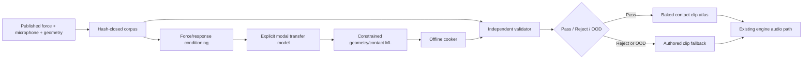

# Roadmap V11: force-normalized physical sound with constrained ML

| Поле | Значение |
| --- | --- |
| Дата rebaseline | `2026-08-31` |
| Статус | `ACTIVE_R&D / B1_V1_REPEAT_REJECTED / B1R_INVALID_PRECHECK / NOISE_AWARE_FRF_NEXT / REAL_DATA_CLOSED / RUNTIME_NOT_AUTHORIZED` |
| Предыдущий roadmap | [V10](physical-sound-synthesis-roadmap.md), закрыт после A1R |
| Архитектура | [SPEC-45](../architecture/45-physical-sound-synthesis-and-acoustic-presentation.md), `Proposed` |
| Exact rebaseline | [A1R result and V11 research](../development/physical-sound-r3a-v10-a1r-force-onset-fit-result-and-v11-research-2026-08-31.md) |
| Текущее состояние | [Physical sound task state](../development/task-state/physical-sound-synthesis.md) |
| Product fallback | Обычные authored clips остаются обязательным и авторитетным путём |

## Простая формулировка цели

Мы больше не просим нейросеть «угадать весь звук» по названию материала и не
пытаемся сжать микрофонную запись как произвольный waveform. Сначала отделяем:

```text
чем ударили                    что сделал объект
contact force f(t)  *  transfer response h(t)  =  microphone y(t)
```

Затем представляем `h(t)` как проверяемые частоты, затухания и амплитуды мод.
ML учится только там, где он полезен и проверяем: предсказывать modal residues
и radiation по геометрии/точке удара, ускорять FEM/BEM-подобный solver и
оценивать OOD. Финальный продукт по-прежнему печёт bounded clip atlas offline.

Первая цель V11 — один exact стеклянный объект, одна listener condition и
несколько unseen contact/force trials. `glass` как универсальная категория не
заявляется. Wood и metal идут только после полного автоматического цикла для
первого объекта.

## Почему V10 закрыт

A1R доказал, что интернет-источник и синхронизация пригодны: force onset
повторяется около sample `48,000`, все hard gates и budgets проходят. Но V9
провалил все четыре real fit contacts: spectrum `9.39–10.27 dB` против лимита
`4 dB`, modal frequency `1,807–3,870 cents` против `100`. Значит, следующий
разумный шаг — не ещё один residual size, а корректное разделение excitation и
transfer response.

## Неизменяемые ограничения

- Пользователь ничего не записывает и не ударяет по предметам; все real data
  находятся в интернете.
- WAV, archives, datasets, arrays, weights, checkpoints и atlases остаются вне
  Git; в репозитории хранятся code, protocols, hashes и reviewable reports.
- Каждый experiment заранее фиксирует source roles, transforms, metrics,
  thresholds, budgets, read counters и stop rule.
- Opened diagnostic data не выбирают следующую capacity. Real selection требует
  свежую object/source revision и защищённые parent groups.
- Force, microphone, room response, contact coordinate, geometry, support и
  listener pose не считаются взаимозаменяемыми и не выводятся из material label.
- Generator не видит validator method holdout и admission shadow.
- Один pooled score, audio-language model или человеческое прослушивание не
  могут самостоятельно выдать `Pass`.
- Любой invalid/OOD/fault результат использует authored clip.
- Runtime neural inference, raw PhysX callback mixing и влияние звука на
  authoritative simulation запрещены.

## Целевой автономный конвейер



## Программа работ

| ID | Этап | Статус | Размер | Наблюдаемый выход |
| --- | --- | --- | ---: | --- |
| B0 | A1R exact result и bounded research | `COMPLETE / REPRODUCIBLE` | S | Force onset валиден; V9 real representation закрыта; exact report `5c9e87e…c2ca`. |
| B1 | Synthetic force→response oracle | `V1_REJECTED / B1R_INVALID / B1R2_NEXT` | S–M | H1 точно предсказывает unseen force и `6/7` poles; B1R precheck выявил noise-relative force mask. Следующая revision сравнивает H1/H2/noise-aware errors-in-variables local rational FRF. |
| B2 | Fresh internet corpus и zero-decode roles | `BLOCKED_BY_B1` | M | Доказаны force/mic timebase, coordinate, geometry, listener, support и parent-disjoint roles без чтения protected PCM. |
| B3 | Real transfer-response representation | `BLOCKED_BY_B2` | M | Frozen estimator на fit и development лучше raw-output/modal и nearest controls; holdout остаётся one-shot. |
| B4 | Exact-object contact-to-residue ML | `BLOCKED_BY_B3` | M–L | ML предсказывает unseen contact modal residues/uncertainty лучше KNN/classical interpolation. |
| B5 | Excitation renderer и deterministic atlas | `BLOCKED_BY_B4` | M | Несколько force/energy profiles печатают byte-identical bounded clips с coverage/OOD manifest. |
| B6 | Independent Validator V1 | `BLOCKED_BY_B3` | M | Frozen ensemble удерживает bounded false-pass risk и useful coverage на source/object-disjoint groups. |
| B7 | One-shot admission | `BLOCKED_BY_B5_B6` | S | Immutable `Pass`, `Reject` или `FallbackOutOfDomain` на untouched shadow. |
| B8 | Physical Sound Base V1 | `BLOCKED_BY_B7` | L–XL | Glass, wood, metal имеют admitted exact domain или честный fallback-only result. |
| B9 | Один production impact prop | `POST_V1 / ADR_REQUIRED` | L | Visible consumer использует committed contact projection, atlas и mandatory fallback. |

## B1 — Synthetic force→response oracle

### Гипотезы

- Direct FFT division работает только при хорошо возбуждённых frequencies и
  служит diagnostic control.
- Regularized spectral deconvolution или H1-style FRF estimator устойчивее к
  response noise и обязан печатать conditioning/coherence mask.
- Shared poles/damping должны восстанавливаться из нескольких различных force
  pulses; per-contact residues могут различаться.

### Fixture

1. Создать exact known modal system с зафиксированными poles, damping и
   contact residues.
2. Возбудить его минимум четырьмя разными force profiles, включая weak-band и
   double-impact corruption.
3. Добавить separately seeded force noise, response noise и bounded room tail.
4. Заморозить train/development/holdout trials до запуска estimator.

### Gates

- Noiseless identity reconstructs held response to numeric tolerance.
- Pole frequency/damping errors проходят заранее frozen thresholds.
- Held force convolution восстанавливает response лучше impulse-assumption и
  raw-output peak-picking controls.
- Weak excitation, double impact и low coherence не превращаются в optimistic
  mode; они дают explicit invalid/OOD mask.
- Два запуска повторяют manifest/model/report byte-for-byte.

Только `PASS_KNOWN_TRUTH_FRF` открывает B2. Иначе меняется математическая
гипотеза, а не real thresholds.

### B1 V1 exact result

[Первая preregistered revision](../development/physical-sound-r3a-v11-b1-force-response-oracle-result-2026-08-31.md)
повторяется byte-for-byte и возвращает `REJECT_ESTIMATOR`. Она проходит
noiseless identity, unseen-force reconstruction, все control ratios и
weak-excitation/low-coherence OOD. H1 получает `0.025706` mean held NRMSE,
находит `6/7` poles с максимумом `0.034 Hz / 0.307 s^-1`, но minimum valid
coverage равен `0.566656` против `0.90`; holdout не сгенерирован.

Следующий B1R меняет не пороги, а факторизацию confidence. Force-only
conditioning определяет, возбуждён ли источник; pooled cross-contact evidence
определяет shared poles; contact-local coherence ограничивает residue и его
uncertainty. B1R использует fresh phases/noise seeds и тот же staged
development-before-holdout stop rule. B2 остаётся закрыт до repeat-exact
`PASS_KNOWN_TRUTH_FRF`.

Этот первый B1R был [закрыт на implementation precheck](../development/physical-sound-r3a-v11-b1r-precheck-rejection-and-frf-noise-research-2026-08-31.md),
до runner/manifest/evidence run: нормализация observed `Sxx` на in-band maximum
делает noise-only high band на `100%` «observable». B1R2 обязан отдельно
измерять force/response noise floor, считать input SNR и сравнить H1/H2 с одним
errors-in-variables/TLS либо local-rational estimator. Старый B1R protocol не
исправляется задним числом; real data и оба synthetic holdout остаются закрыты.

## B2 — Fresh internet corpus

Предпочтительный класс источника — controlled impact dataset с raw force,
microphones, impact coordinates, listener positions и geometry. RealImpact
является сильным кандидатом, потому что публикует эти axes и описывает force
deconvolution, но до выбора нужно доказать exact availability, terms, object
identity и независимость от уже открытого ObjectFolder lineage.

Zero-decode inventory замораживает parent groups:

- estimator fit;
- generator development;
- representation holdout;
- validator calibration;
- validator method holdout;
- admission shadow.

Если project/object/mutation leakage нельзя исключить, source получает только
diagnostic role. Missing listener/support axis сужает claim или отклоняет source.

## B3 — Real transfer-response representation

Для каждого contact/listener trial сохраняются отдельные факты:

```text
force f(t)
microphone y(t)
conditioning/coherence mask q(ω)
regularized transfer H(ω)
shared poles (frequency, damping)
contact/listener residues
bounded unexplained residual
```

Сравниваются direct division, regularized/H1 estimator, raw microphone
peak-picking и impulse-assumption controls. Нельзя заявить качество только по
reconstruction той же записи: обязательны held force profile и protected
contact/listener groups.

Exit:

- все fit contacts проходят absolute gates;
- одна frozen revision проходит development лучше compatible controls;
- representation holdout открывается один раз и подтверждает перенос;
- uncertainty/OOD коррелирует с conditioning failure;
- record и shared state укладываются в cooker budgets.

## B4 — Где именно используется ML

ML не заменяет poles произвольным waveform latent. Первая модель получает
geometry/contact descriptors и предсказывает:

- modal residues/gains;
- при наличии listener axis — radiation/transfer gains;
- uncertainty и OOD distance.

Жёсткие frequencies/damping берутся из принятого modal identification или
FEM oracle. Baselines: nearest contact, barycentric/RBF interpolation, compact
linear basis и geometry-agnostic mean. ML проходит только если выигрывает у
каждого совместимого control на unseen parent groups и не ухудшает hard physics
checks.

DiffSound/NeuralSound-подобная learned solver acceleration — отдельная ветка:
network proposal должен проверяться residual/convergence gate численного
solver. Runtime inference из этого не следует.

## B5 — Excitation и atlas

Cooker получает frozen modal transfer и ограниченное семейство contact-force
profiles/energy bins. Он сворачивает force с transfer response, применяет
canonical acoustic presentation и печатает:

- ordinary 48 kHz clips;
- exact hashes and source lineage;
- contact/energy coverage;
- OOD/fallback mapping;
- cost report.

Если clip atlas дешевле и качественнее формулы, выбираются clips. Distillation в
runtime coefficients не является критерием успеха V11.

## B6–B7 — независимая проверка и admission

Validator объединяет hard lineage/count/determinism gates, force-response
consistency, modal specialists, spectral/envelope/decay endpoints, learned
artifact specialists и calibrated OOD. Thresholds выбираются только на
calibration; method holdout и admission shadow не участвуют в tuning.

Решение tri-state:

- `Pass`: все hard gates, bounded false-pass risk и coverage выполнены;
- `Reject`: сохранён counterexample, revision закрыта;
- `FallbackOutOfDomain`: evidence недостаточно или conditioning невалидна.

Human listening остаётся необязательным report-only sanity check.

## Ближайшие commit boundaries

1. **B0 — COMPLETE:** A1R fit runner, two exact runs, result and V11 rebaseline.
2. **B1 protocol:** known-truth modal system, force families, corruptions,
   estimators, thresholds and hashes frozen before evaluation.
3. **B1 runner/result:** exact controls and one selected FRF method or explicit
   rejection.
4. **B2 source feasibility:** official URLs/versions, lineage and axis matrix;
   zero waveform decode.
5. **B2 role freeze:** exact parent groups and read counters.
6. **B3 fit → development → holdout:** each gate is a separate commit and only
   a pass opens the next protected role.
7. **B4 contact ML:** controls first, then one frozen model.
8. **B5 atlas, B6 validator, B7 admission:** independent artifacts and commits.

## Stop/go policy

| Наблюдение | Решение |
| --- | --- |
| Synthetic FRF cannot recover known poles/held responses | `REJECT_ESTIMATOR`; real data остаются закрыты. |
| Force spectrum is weak or coherence invalid | Mask/OOD; не делить FFT и не выдумывать mode. |
| Fresh source lineage/axes cannot be proven | `DATA_INSUFFICIENT`; source diagnostic-only. |
| Real fit fails | Закрыть representation; development не читать. |
| Development loses to classical interpolation | Закрыть ML revision; holdout не открывать. |
| Exact object passes, cross-object fails | Сохранить exact-object domain; broad material claim закрыть. |
| Validator risk is unbounded | `FALLBACK_ONLY`. |
| Atlas wins over compact formula | Ship clips when later authorized; formula is optional. |
| No consumer or Accepted ADR | Не создавать runtime/public contract. |

## Критерии завершения

### Research MVP

- B1–B7 закрыты для одного нового стеклянного exact object.
- Force→transfer decomposition and modal parameters pass known-truth and fresh
  real held groups.
- Contact ML beats honest classical controls and reports OOD.
- Validator makes an autonomous tri-state decision.
- Accepted output bakes byte-identical clips; every unsupported case falls back.

### Physical Sound Base V1

- Тот же immutable pipeline повторён для glass, wood и metal.
- Каждая family имеет admitted exact domain или reproducible fallback-only
  result; никакой material label не выдаётся за универсальную формулу.
- Corpus, model, cooker, validator, risk, coverage and cost lineage complete.

### Product vertical

- B9 получает отдельный consumer-driven Accepted ADR и ProductChecks.
- Runtime видит только cooked assets through the existing presentation path.
- Gameplay/physics/save/replay roots identical with physical audio on/off.

Rolling, scraping, fracture, footsteps, cloth, liquids, fire, voice и
biological sound не входят в V11.

## Research basis

- [RealImpact CVPR 2023](https://openaccess.thecvf.com/content/CVPR2023/papers/Clarke_RealImpact_A_Dataset_of_Impact_Sound_Fields_for_Real_Objects_CVPR_2023_paper.pdf)
- [DiffImpact CoRL 2021](https://proceedings.mlr.press/v164/clarke22a/clarke22a.pdf)
- [DiffSound SIGGRAPH 2024](https://hellojxt.github.io/DiffSound/)
- [NeuralSound](https://arxiv.org/abs/2108.07425)
