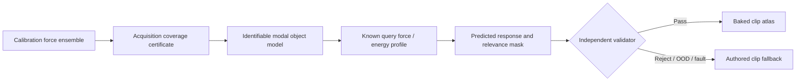

# Roadmap V12: автономная база физического звука

| Поле | Значение |
| --- | --- |
| Дата rebaseline | `2026-08-31` |
| Статус | `ACTIVE_R&D / C1_PROTOCOL_FROZEN / C1_RUNNER_NEXT / ZERO_DECODE_SOURCE_SEARCH_OPEN / REAL_PCM_CLOSED / RUNTIME_NOT_AUTHORIZED` |
| Предыдущий roadmap | [V11](physical-sound-synthesis-roadmap-v11.md), закрыт после B1R3 |
| Exact основание | [B1R3 result](../development/physical-sound-r3a-v11-b1r3-local-modal-support-result-2026-08-31.md) |
| Архитектура | [SPEC-45](../architecture/45-physical-sound-synthesis-and-acoustic-presentation.md), `Proposed` |
| Текущее состояние | [Physical sound task state](../development/task-state/physical-sound-synthesis.md) |
| Product fallback | Обычные authored clips обязательны для любого reject/OOD/fault |

## Куда мы идём

Цель — не одна формула «как звучит стекло» и не генератор waveform по слову.
Мы строим пополняемую, автоматически проверяемую базу физических моделей:

```text
измеренная сила удара
        ×
моды exact-объекта (частота, затухание, участие точки контакта)
        ×
акустическое представление
        =
детерминированно испечённый набор обычных audio clips
```

Нейросеть появится только после того, как эта факторизация проходит на реальных
данных. Её первая задача — предсказывать участие уже проверяемых мод по
геометрии и точке контакта, а не заменять физику непрозрачным waveform latent.

## Что изменил B1R3

B1R3 repeat-exact отклонён, но локализовал проблему:

- шесть наблюдаемых мод восстановлены с `0.007180` mean NRMSE;
- максимум ошибки частоты — `0.119071 Hz`, относительного затухания — `1.15%`;
- weak excitation и unmeasured interference корректно дают OOD;
- мода `6,643 Hz` не восстанавливается, потому что сам набор force pulses почти
  не содержит энергии в этой полосе: local SNR около `1.2…1.34`;
- намеренный notch на `8 kHz` нельзя изолировать от этого случайного hole.

Значит, следующий слой — не ещё один порог и не более крупная сеть, а явный
**сертификат наблюдаемости входного возбуждения**.

## Три разных домена, которые нельзя снова смешивать



1. **Acquisition domain:** какие полосы вообще возбуждены совокупностью
   опубликованных измеренных ударов достаточно сильно, чтобы идентифицировать
   объект.
2. **Object-model domain:** какие poles и residues реально доказаны внутри
   acquisition domain.
3. **Query domain:** какой вклад уже известная модель даст для конкретного
   профиля силы/энергии. Ноль входной энергии не создаёт новую моду и не обязан
   автоматически инвалидировать весь объект.

## Программа работ

| ID | Этап | Статус | Exit criterion |
| --- | --- | --- | --- |
| C0 | B1R3 exact result и V12 rebaseline | `COMPLETE / REPRODUCIBLE` | Два запуска и все артефакты byte-identical; reject и нулевой holdout зафиксированы. |
| C1 | Coverage-certified known-truth oracle | `PROTOCOL_FROZEN / RUNNER_NEXT / ONE_FRESH_REVISION` | Все acquisition-supported truth modes восстановлены, unsupported controls не изобретены, held responses и OOD gates проходят дважды побитово. |
| C2 | Internet-source zero-decode inventory | `OPEN_IN_PARALLEL` | Найден хотя бы один stable paired force+mic source с доказуемыми axes/lineage; PCM не читается. |
| C3 | Source role freeze и bounded importer | `BLOCKED_BY_C1_C2` | Parent-disjoint fit/development/holdout/validator/shadow roles и exact read counters заморожены до decode. |
| C4 | Real transfer-response model | `BLOCKED_BY_C3` | Fit и development проходят против raw-H1, impulse, peak-picking и nearest controls; one-shot holdout подтверждает перенос. |
| C5 | Physical Sound Record V1 | `BLOCKED_BY_C4` | Версионированная external record-база хранит poles, damping, contact residues, coverage/OOD и provenance без waveform в Git. |
| C6 | Exact-object contact ML | `BLOCKED_BY_C5` | Geometry/contact model выигрывает у nearest, RBF/barycentric и linear-basis controls на unseen parent groups. |
| C7 | Independent Validator V1 | `BLOCKED_BY_C4` | Frozen validator имеет bounded false-pass risk, useful coverage и tri-state решение на method holdout. |
| C8 | Deterministic atlas cooker | `BLOCKED_BY_C5_C6` | Несколько force/energy profiles печатают byte-identical bounded clips и complete fallback map. |
| C9 | One-shot exact-object admission | `BLOCKED_BY_C7_C8` | Untouched shadow получает immutable `Pass`, `Reject` или `FallbackOutOfDomain`. |
| C10 | Material-family expansion | `BLOCKED_BY_C9` | Glass, wood и metal имеют admitted exact domains либо честные reproducible fallback-only результаты. |
| C11 | Один production impact prop | `POST_RESEARCH / ADR_REQUIRED` | Visible consumer использует committed contact projection, cooked atlas и mandatory clip fallback. |

## C1 — последний bounded synthetic oracle

Это одна свежая revision, а не серия подстроек B1R3.

Протокол [V12-C1](../development/physical-sound-r3a-v12-c1-acquisition-coverage-oracle-protocol-2026-08-31.md)
и его [bounded research](../development/physical-sound-r3a-v12-c1-coverage-and-source-research-2026-08-31.md)
зафиксированы до runner. Force-only prefreeze подтверждает полную
`200…9,500 Hz` coverage минимум тремя профилями и не читает object response.

### Fixture и blind separation

- Новые truth frequencies, damping, residues, phases и RNG seeds.
- Сначала создаётся force ensemble и его band-coverage certificate без доступа
  к transfer truth.
- Обычные truth modes детерминированно выбираются только из заранее
  сертифицированных непрерывных bands, а не рядом с максимумами конкретных FFT.
- Отдельные negative fixtures получают заранее объявленные unsupported bands,
  comb notch, weak excitation, unmeasured interference и missing impact.
- Discovery/fit не читает truth; truth доступна только финальному scorer.

### Обязательные проверки

- `supported truth recall = 100%`, false positives `= 0`;
- frequency/damping, NRMSE, spectrum и compatible-control gates остаются не
  слабее B1R3;
- leave-one-force-family-out проверяет, что сертификат принадлежит ансамблю, а
  не одному удачному pulse;
- query с нулевой энергией в известной полосе не изобретает output energy;
- acquisition hole даёт `FallbackOutOfDomain`, dynamic interference —
  `OOD_LOW_COHERENCE`, missing force event — `OOD_MODEL_MISMATCH`;
- development полностью проходит до генерации holdout;
- два полных запуска повторяют manifest/model/arrays/report byte-for-byte;
- real/network/parent-holdout reads равны нулю.

### Жёсткий stop rule

- `PASS_KNOWN_TRUTH_FRF` открывает C3, если C2 также нашёл источник.
- Valid failure на восстановлении **сертифицированной** моды закрывает текущую
  Gabor/common-pole ветку. Следующий выбор делается только после отдельного
  bounded comparison с local-rational/vector-fitting control; B1R3 fixture и
  пороги не ремонтируются.
- Failure только потому, что force ensemble не может сертифицировать полезную
  полосу, закрывает источник/experiment design как `DATA_INSUFFICIENT`.

## C2–C3 — интернет вместо домашней записи

Пользователь не записывает микрофон и не ударяет по предметам. Поиск и importer
должны работать с опубликованными данными.

Zero-decode inventory проверяет до чтения waveform:

- paired raw force и microphone с общим timebase;
- stable object/trial identity и impact coordinates;
- geometry/scale, support condition и listener/microphone pose;
- sample rate, units, calibration и saturation metadata;
- parent grouping, stable download, provenance и redistribution boundary.

Кандидат без paired force+mic может быть validator/control source, но не учит
абсолютный force→response transfer. Кандидат без geometry/contact axes не
получает contact-ML claim. Отсутствующий axis никогда не выводится из material
label.

После C1+C2 один source freeze заранее назначает шесть непересекающихся ролей:
estimator fit, generator development, representation holdout, validator
calibration, validator method holdout и admission shadow. Decode начинается
только после hash-closed manifest и exact budgets.

## C4–C6 — от реального отклика к формулам и ML

Одна запись превращается не в «эталонный WAV», а в проверяемый record:

```text
Object/geometry revision
Contact and listener descriptors
Force ensemble coverage certificate
Shared frequencies and damping
Per-contact modal residues and uncertainty
Unexplained residual budget
Source lineage and protected role
```

C4 сначала доказывает real representation на одном exact object. Только затем
C5 фиксирует external Physical Sound Record schema и миграции. C6 обучает
contact→residue field; frequencies/damping остаются измеренными или
solver-verified. Runtime weights запрещены: accepted model используется offline.

Если classical interpolation выигрывает у ML, база и atlas продолжают работать
без ML. Это успешный инженерный fallback, а не повод подменить метрики.

## C7 — кто валидирует автоматически

Validator — отдельный frozen ensemble, который не участвует в обучении:

- hard checks: hashes, lineage, units, counts, determinism, finite/bounded data;
- physics checks: force-response consistency, poles, damping, residues,
  unexplained energy and OOD calibration;
- acoustic checks: spectrum, decay, transient/envelope and artifact specialists;
- corpus checks: source/object/contact-disjoint failures and controlled
  mutations;
- risk layer: верхняя confidence bound false-pass rate плюс measured coverage.

Решение всегда tri-state: `Pass`, `Reject`, `FallbackOutOfDomain`. Learned
metric или audio-language model может быть только одним specialist vote и не
имеет права единолично пропускать asset. Человеческое прослушивание остаётся
необязательным report-only анализом.

## C8–C11 — продуктовый путь

Offline cooker сворачивает admitted modal record с ограниченным семейством
force/energy profiles и печатает обычные `48 kHz` clips, hashes, coverage и
fallback map. Clips идут по существующему audio path; симуляция от них не
зависит.

Первый one-shot admission относится только к одному exact объекту и canonical
listener condition. Затем тот же immutable pipeline повторяется для других
glass objects, wood и metal. Material-family claim допускается только как
агрегация доказанных exact domains, никогда как одна магическая формула.

Runtime/public contract появляется лишь при concrete visible consumer,
engine-owned committed contact projection, прошедшем ProductCheck и отдельном
Accepted ADR. До этого SPEC-45 остаётся `Proposed` и authored clips —
авторитетный путь.

## Ближайшие commit boundaries

1. `C0`: B1R3 result, task-state, V11 closure, V12 and main-roadmap rebaseline.
2. `C1a`: fresh coverage-certificate protocol committed before runner.
3. `C1b`: runner and focused unit tests without numeric evidence.
4. `C1c`: freeze, paired preflights, run A/B and exact result.
5. `C2a`: web source report with official URLs, versions and axis matrix; zero
   waveform decode.
6. `C3`: source/role manifest and read budgets only after C1+C2 pass.
7. `C4`: real fit → development → one-shot holdout as separate gates/commits.
8. `C5–C9`: record schema, controls-first ML, validator, atlas and admission as
   independently reviewable artifacts.

## Definition of done

### Research MVP

- Один fresh internet exact object проходит C1–C9 или получает reproducible
  fallback-only result без ручного перебора звуков.
- Force→transfer decomposition и modal record подтверждены held groups.
- ML, если он нужен, выигрывает у всех compatible classical controls.
- Independent validator самостоятельно выдаёт tri-state decision с bounded
  false-pass risk и coverage.
- Accepted output печатает byte-identical clips; любой unsupported case имеет
  deterministic authored fallback.

### Physical Sound Base V1

- Один и тот же hash-closed pipeline повторён для glass, wood и metal.
- База хранит exact-domain формулы, uncertainties, OOD boundaries и provenance,
  а не субъективные material presets.
- Ни один dataset, checkpoint, WAV, capture или generated atlas не попадает в
  Git.
- Production runtime не обучается, не загружает neural weights и не влияет на
  authoritative simulation.
