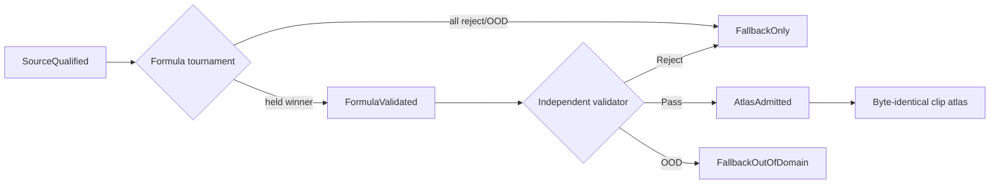

# Roadmap V13: автономная фабрика физических impact-звуков

| Поле | Значение |
| --- | --- |
| Дата rebaseline | `2026-08-31` |
| Статус | `ACTIVE_R&D / M2B_REPEAT_EXACT_SOURCE_INCOMPLETE / M2C_REALIMPACT_CONTROL_NEXT / CANONICAL_SOURCE_RECOVERY_REQUIRED / RUNTIME_NOT_AUTHORIZED` |
| Предыдущий roadmap | [V12](physical-sound-synthesis-roadmap-v12.md), закрыт на real force coverage |
| Exact основание | [V12-C4a result](../development/physical-sound-r3a-v12-c4a-object41-real-frf-fit-result-2026-08-31.md) |
| Research basis | [V13 canonical modal-field research](../development/physical-sound-v13-canonical-modal-field-research-2026-08-31.md) |
| Архитектура | [SPEC-45](../architecture/45-physical-sound-synthesis-and-acoustic-presentation.md), `Proposed` |
| Product fallback | Обычные authored/recorded clips обязательны для любого reject/OOD/fault |

## Цель

Построить не один «правильный звук стекла», а автономную фабрику, которая:

1. находит и hash-закрывает опубликованные записи и геометрию;
2. автоматически пробует извлечь проверяемую формулу exact-объекта;
3. сравнивает ML с честными classical controls на нетронутых контактах;
4. сохраняет успех как modal field, а неудачу как `FallbackOnly`;
5. независимым validator решает `Pass / Reject / FallbackOutOfDomain`;
6. печатает byte-identical обычные clips для существующего audio path.

V13 сознательно разделяет два уровня физического утверждения:

```text
CanonicalImpactField
  canonical normalized impact + contact -> sound
  доступен сейчас из интернет-данных

MeasuredTransferField
  arbitrary measured force(t) * H(contact, listener) -> sound
  upgrade-only, пока нет broadband paired source
```

Ни один `CanonicalImpactField` не может притворяться transfer-функцией.

## Что изменил V12-C4a

ObjectFolder `41 / Wrench_Large / Steel` прошёл onset и SNR, но не acquisition
coverage: максимум общих supporters равен двум, а минимум — четыре. Оба запуска
побитово совпали и оставили microphone decode равным нулю. Значит, новый
roadmap не чинит пороги и не выбирает удобные удары. Object `41` становится
постоянным OOD-контролем.

Параллельно появилась работа AV-MSF, практически совпадающая с нашей целевой
факторизацией: global frequencies/damping + spatial neural modal gains из
few-shot impacts. Мы используем её как внешнюю гипотезу, но реализуем и
проверяем независимо: upstream code пока не опубликован, а его residual
конфликтует с уже полученным отрицательным evidence Next Engine.

## Центральный артефакт: Physical Sound Research Record V0

До production-schema каждый объект получает внешний экспериментальный record:

```text
identity/provenance/hashes
claim_kind: canonical-impact | measured-transfer
known axes and explicitly absent axes
immutable role split and exposure ledger
preprocessing and sample/read accounting
source coverage/OOD certificate
global modes: frequency, damping, uncertainty
contact/listener gain field and compatible controls
held metrics and validator votes
decision + deterministic clip fallback
```

Record не является public contract, не входит в package content и не даёт
runtime authority. Он нужен, чтобы pipeline мог обрабатывать сотни объектов
одинаково и не терять отрицательные результаты.

## State machine объекта



`FallbackOnly` — полноценный конечный результат, а не повод вручную тюнить
один объект. Новый метод возвращается к объекту только как новая
preregistered family revision.

## Программа работ

| ID | Этап | Статус | Exit criterion |
| --- | --- | --- | --- |
| M0 | V12 closure | `COMPLETE / REPEAT_EXACT_DATA_INSUFFICIENT` | C4a A/B совпадают; microphone/protected decode `0`; stop rule соблюдён. |
| M1 | Research Record V0 + exposure ledger | `COMPLETE / REPEAT_EXACT_ZERO_SIGNAL` | Experimental schema, lifecycle, prior-exposure census and source shortlist validate without new signal decode. |
| M2 | Canonical source adapters and role freeze | `IN_PROGRESS / M2B_SOURCE_INCOMPLETE / M2C_NEXT` | Один viable fresh exact object и один RealImpact derived-response control получают immutable contact/object roles and budgets; object 92 закрыт на missing raw metadata. |
| M3 | Known-truth modal-field oracle | `BLOCKED_BY_M2` | Global poles/damping и spatial gains восстанавливаются на synthetic held contacts; collapse/OOD mutations отвергаются. |
| M4 | Fresh exact-object formula fit | `BLOCKED_BY_M3` | Fit-only global modes reconstruct every opened contact within absolute gates; no residual/waveform shortcut. |
| M5 | Held-contact model tournament | `BLOCKED_BY_M4` | Neural modal-gain field wins over KNN, geodesic RBF, barycentric/linear and geometry-agnostic controls, либо объект получает `FallbackOnly`. |
| M6 | Multi-object record batch | `BLOCKED_BY_M5` | Object-disjoint glass/wood/metal records строятся одним hash-closed runner; no per-object hyperparameter selection. |
| M7 | Independent Validator V1 | `BLOCKED_BY_M5` | Frozen tri-state validator has bounded false-pass risk, useful coverage and method-holdout evidence. |
| M8 | Deterministic atlas cooker | `BLOCKED_BY_M5_M7` | Canonical energy/profile grid печатает byte-identical clips, hashes and complete fallback map. |
| M9 | One-shot shadow admission | `BLOCKED_BY_M7_M8` | Untouched object/contact shadow получает immutable `Pass`, `Reject` или `FallbackOutOfDomain`. |
| M10 | Material-family expansion | `BLOCKED_BY_M9` | Glass, wood, metal имеют несколько admitted exact domains или reproducible fallback-only records. |
| M11 | Один production impact prop | `POST_RESEARCH / ADR_REQUIRED` | Concrete consumer проходит content-package/play/performance checks через committed contact projection и existing clip path. |

## M1 — record и ledger раньше новой модели

Первый implementation package не читает новый signal. Он должен:

- собрать все prior manifests/reports в canonical exposure ledger;
- отличать `header/hash/metadata read` от `signal decoded`;
- фиксировать project/object/contact/listener/mutation parent groups;
- валидировать, что одна sample identity не попала в fit и validator;
- реализовать experimental JSON schema и current-version canonical roundtrip;
- сохранить три progressive и два terminal состояния объекта с обязательным fallback;
- запрещать promotion при неизвестной claim-kind или отсутствующем axis.

Exit: два независимых построения ledger/records byte-identical; intentional
leak, changed hash, missing axis and status skip fail closed.

## M2 — два источника, две разные роли

### ObjectFolder canonical lane

Использует compact microphone, contact coordinate, mesh/scale и raw force лишь
для onset и scalar canonical-energy normalization. Никакого frequency-domain
division и никакого arbitrary-force claim. Fresh object выбирается только из
ledger и waveform-independent metadata.

Role split делается по contact parent до decode: formula fit, generator
development, representation holdout, validator calibration, validator method
holdout, admission shadow. Для 30–50 контактов ориентир — few-shot fit около
20%, но exact count/farthest-point/hash policy замораживаются отдельным
protocol до сигнала.

M2a выбрал fresh object `92 / Glass_Red / Glass`: это единственный кандидат
M1c с полным selected contact-localization binding. [Повторяемый zero-sample
freeze](../development/physical-sound-v13-m2a-object92-source-role-freeze-result-2026-08-31.md)
зафиксировал `36` parent-контактов как `8/6/12/3/4/3` для fit, development,
representation holdout, validator calibration, validator method holdout и
admission shadow. M2b должен отдельно заморозить и выполнить bounded raw-force
prefix inventory; никакой real PCM decode пока не разрешён.

[M2b raw inventory](../development/physical-sound-v13-m2b-object92-raw-force-inventory-result-2026-08-31.md)
закрыл object `92` как `SOURCE_INCOMPLETE_OBJECT92`: все `36` microphone/force
пары и их compact identities присутствуют, но
`92/audio/35/metadata.yaml` отсутствует, а следующий object header уже
достигнут. Ни contact 35, ни frozen role partition не сокращаются после этого
наблюдения. M2c теперь фиксирует RealImpact control; отдельный M2d должен
выбрать новую viable canonical source revision до real fitting.

### RealImpact derived-response lane

Использует publisher `deconvolved_0db.npy`, five impact parents, listener IDs,
geometry and coordinates как relative derived transfer/control. Он не получает
raw-force provenance. Leave-one-impact-out проверяет только canonical/derived
modal field; listener blocks могут стать radiation evidence позже.

## M3–M5 — формула и ML tournament

Candidate record для одного exact object:

```text
s(x,t) = sum_m g_m(x) * exp(-d_m*t) * sin(2*pi*f_m*t + phase_m(x))
```

`f_m,d_m` глобальны для объекта. `g_m(x),phase_m(x)` зависят от surface
contact. Первая revision не моделирует listener field и не добавляет
stochastic residual.

### Обязательные controls

1. nearest recorded contact;
2. Euclidean and surface-geodesic RBF;
3. barycentric/local linear interpolation;
4. low-rank modal gain basis;
5. geometry-agnostic mean;
6. DiffSound-style per-record inverse fit as report-only initialization control.

### Neural candidate

Минимальная модель — surface point/mesh descriptors + contact coordinate ->
bounded complex modal gains and uncertainty. Она не генерирует waveform latent.
Visual/DINO/3DGS features являются отдельной capacity only after mesh-only
candidate and controls are frozen. Training follows warm-up on extracted gains,
then differentiable modal reconstruction with multiresolution complex-STFT,
early-transient, envelope and decay losses.

ML проходит только если:

- every absolute held-contact gate passes;
- aggregate error materially beats every compatible control;
- no contact exceeds the frozen maximum regression;
- uncertainty selects OOD instead of hiding failures;
- A/B model, record and rendered arrays are byte-identical on the pinned host.

Если KNN/RBF выигрывает, classical field становится формулой. Если никто не
проходит, объект получает `FallbackOnly`.

## Residual policy

Static random-phase magnitude noise, nearby codec retries and the retired V9
time-varying residual are forbidden successors. Residual modeling открывается
только после independent modal-gain pass and as a separate record revision.
До этого unexplained energy записывается как uncertainty/fallback boundary, а
не маскируется waveform payload внутри «формулы».

## M7 — автоматический validator

Validator не участвует в model selection и состоит из независимых specialists:

- hard: lineage, hashes, schemas, finite values, counts, determinism;
- physics: stable poles, positive damping, gain bounds, symmetry/continuity,
  claim-kind compatibility;
- acoustic: held spectrum, envelope, decay, transient and artifact metrics;
- corpus: object/contact/source-disjoint failures and controlled mutations;
- selective risk: confidence upper bound false-pass rate and measured coverage.

Learned audio-language/embedding score может быть одним specialist vote, но не
может единолично пропустить объект. Human listening остаётся report-only.

## M8–M11 — продуктовый путь

Cooker рендерит ограниченную сетку canonical impact energy/contact regions в
обычные `48 kHz` clips. Runtime не загружает model weights и не обучается.
Gameplay correctness не зависит от audio; unsupported query выбирает authored
fallback через complete map.

MeasuredTransferField может позже заменить canonical excitation конкретного
record, если новый internet source проходит broadband force certificate. Это
upgrade, а не blocker для clip atlas.

Production consumer появляется только после concrete gameplay need, engine-
owned committed contact projection, отдельного Accepted ADR и relevant
ProductChecks. SPEC-45 до этого остаётся `Proposed`.

## Ближайшие commit boundaries

1. `M0a`: `COMPLETE`; V12-C4a repeated negative result and V13 research.
2. `M1a` — `COMPLETE / REPEAT_EXACT_ZERO_SIGNAL`: [protocol](../development/physical-sound-v13-m1a-research-record-v0-protocol-2026-08-31.md), [result](../development/physical-sound-v13-m1a-research-record-v0-result-2026-08-31.md).
3. `M1b` — `COMPLETE / REPEAT_EXACT_ZERO_SIGNAL`: [protocol](../development/physical-sound-v13-m1b-exposure-ledger-v0-protocol-2026-08-31.md), [result](../development/physical-sound-v13-m1b-exposure-ledger-v0-result-2026-08-31.md).
4. `M1c` — `COMPLETE / REPEAT_EXACT_ZERO_SIGNAL`: [protocol](../development/physical-sound-v13-m1c-historical-census-and-shortlist-protocol-2026-08-31.md), [result](../development/physical-sound-v13-m1c-historical-census-and-shortlist-result-2026-08-31.md).
5. `M2a` — `COMPLETE / REPEAT_EXACT_ZERO_SAMPLE`: object `92` selected by
   signal-blind metadata; [source/role result](../development/physical-sound-v13-m2a-object92-source-role-freeze-result-2026-08-31.md)
   freezes all `36` contacts and reports zero PCM/force samples decoded.
6. `M2b` — `CLOSED / REPEAT_EXACT_SOURCE_INCOMPLETE`: [8-GiB inventory](../development/physical-sound-v13-m2b-object92-raw-force-inventory-result-2026-08-31.md)
   proves one missing object-92 metadata member with zero sample decode.
7. `M2c` — next: freeze one RealImpact derived-response control, five impact
   parents, canonical listener row and leave-one-impact-out budgets.
8. `M2d` — select a new viable fresh canonical source revision from
   `59/82/93` or a new internet source; no object-92 role reduction.
9. `M3a–M5a`: known-truth oracle, fit-only formula, then held tournament as
   separate commits with hard stop rules.
10. `M6–M9`: batch, validator, cooker and shadow admission independently.

## Definition of done

### Research MVP

- One fresh exact object reaches `FormulaValidated` or reproducible
  `FallbackOnly` without manual threshold/model choice.
- Same pipeline processes at least one glass, wood and metal exact object.
- ML, if selected, beats all compatible controls on untouched contacts.
- Validator produces tri-state decisions with bounded false-pass risk.
- Accepted records bake byte-identical clips; every failure has a complete
  deterministic fallback.

### Physical Sound Base V1

- External record registry contains provenance, exact-domain formulas,
  uncertainty/OOD and fallback state for all processed objects.
- Material-family labels aggregate exact domains and never replace them.
- No dataset, raw recording, checkpoint, generated atlas or credential enters
  Git.
- Public/runtime promotion is backed by one visible consumer, an Accepted ADR
  and measured product checks.

## Не повторять

- lowering V12-C4 force coverage or selecting favorable object-41 contacts;
- claiming arbitrary-force response from canonical normalized impacts;
- prompt-to-waveform or a universal neural codec as the engine path;
- stationary random-phase residual, nearby V9 residual or reopened V5 codec;
- another coordinate/listener kernel without surface mode-shape evidence;
- per-object threshold, seed, capacity, checkpoint or contact selection;
- local microphone/hammer capture or manual per-sound approval;
- runtime neural inference before a separately justified ADR.
