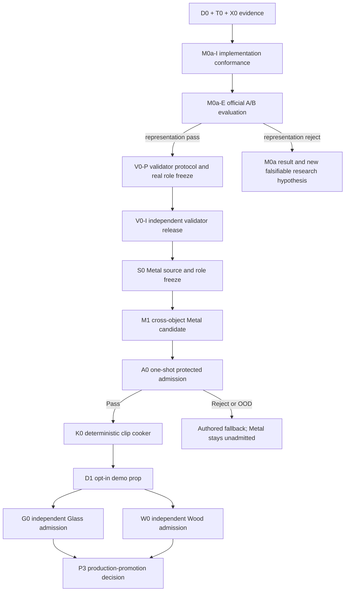

# Roadmap V25: first autonomously admitted physical-sound asset

| Field | Value |
| --- | --- |
| Rebaseline date | `2026-09-02` |
| Status | `CLOSED_BY_M0A_E_PREPROCESS_CONFORMANCE_REJECT / NO_MODEL_VALUES_OPENED / RUN_B_NOT_STARTED / SUPERSEDED_BY_V26` |
| Replaces | [Roadmap V24](physical-sound-synthesis-roadmap-v24.md) as planning authority; every frozen V24 protocol, hash and spent-role rule remains binding |
| Superseded by | [Roadmap V26](physical-sound-synthesis-roadmap-v26.md) |
| Current evidence | [M0a-E result](../development/physical-sound-v25-m0a-official-evaluation-result-2026-09-02.md), [D0 result](../development/physical-sound-v24-d0-neural-evidence-plane-result-2026-09-01.md), [T0 result](../development/physical-sound-v24-t0-analytic-teacher-result-2026-09-01.md), [X0 result](../development/physical-sound-v24-x0-blue-bowl-pilot-result-2026-09-01.md), [M0 conformance rebaseline](../development/physical-sound-v25-m0-implementation-conformance-rebaseline-2026-09-02.md), [M0a protocol](../development/physical-sound-v25-m0a-causal-material-neural-student-protocol-2026-09-02.md) and [M0a-I result](../development/physical-sound-v25-m0a-implementation-conformance-result-2026-09-02.md) |
| Architecture | [SPEC-45](../architecture/45-physical-sound-synthesis-and-acoustic-presentation.md), `Proposed`; no public schema, runtime model, physics authority or production ProductCheck is promoted |
| Mandatory fallback | The ordinary authored clip remains authoritative for every reject, OOD result, missing source, unsupported query or tooling failure |

## Outcome

Deliver one evidence-backed, automatically admitted Metal rigid-impact asset
that can be played by one opt-in demo prop as ordinary cooked clips. The path
must require no local recording and no per-sound human approval.

The product-shaped V25 outcome is achieved only when all of the following are
true:

1. the already frozen exact-object M0a neural student produces a reproducible
   pass against its classical controls;
2. an independent validator is frozen and calibrated from real controls,
   mutations and OOD groups that are disjoint from generator selection;
3. one cross-object Metal candidate passes its preregistered development and
   method-holdout gates;
4. the validator opens one untouched Metal admission shadow exactly once and
   returns `Pass`;
5. a deterministic cooker produces byte-identical ordinary clips and one demo
   prop uses them with a complete authored fallback.

A reproducible reject at M0a, V0, M1 or A0 is still a valid scientific terminal
result: it closes the branch without tuning on opened values, but does not
claim the product-shaped V25 outcome.

Glass and Wood remain follow-on material admissions. Runtime neural inference,
rolling, scraping, fracture, fluids, fire, cloth, biological sound and a
universal material model are not V25 scope.

## What is already closed

| Foundation | State | What may now be relied on |
| --- | --- | --- |
| V3 evidence plane | `D0 REPEAT_EXACT_PASS` | Three claim-safe lanes, role privacy, canonical projections and fail-closed mutations are implemented. |
| Analytic teacher | `T0 REPEAT_EXACT_PASS` | Twelve plate/beam objects, 144 contact rows, ten modes per object and exact remesh/force controls provide causal synthetic supervision. |
| Internet pilot | `X0 REPEAT_EXACT_PASS` | Four exact Blue Bowl transfer rows and three identified recordings are represented without inventing absent physical axes; row `2407` remains sealed. |
| Combined corpus record | `VALIDATED / AXIS_INCOMPLETE_BY_DESIGN` | The actual D0 owner accepts all 151 rows; incomplete real axes remain absent and cannot become supervision. |
| Exact-object student | `M0 SUPERSEDED / M0A-I REPEAT_EXACT_PASS / VALUES_UNOPENED` | M0's one-hot input could not expose isolated `E`/density gates. M0a adds masked causal material coordinates; commit `6b04dc5f` and implementation root `9df63e…e46` pass the full-entry fixture without opening official values. |

These results prove the research substrate, not sound quality, Metal admission,
validator reliability, a cooked atlas or runtime readiness.

## Critical dependency graph

M0a implementation and signal-blind V0 source inventory may overlap. Validator
thresholds, candidate-sensitive features and protected values may not open
early merely to shorten the path.

## Work packages

| ID | Package | State | Size | Observable exit criterion |
| --- | --- | --- | ---: | --- |
| R0 | V24 evidence closeout | `COMPLETE` | — | D0, T0 and X0 pass twice; combined V3 SHA-256 is `c43ba8eac68e32a8ef8fbe37d3ffa3d21db1d59e0443766cee1d98f51cad70bb`; no model, validator or runtime authority follows from it. |
| M0a-I | Causal-material student implementation conformance | `COMPLETE / REPEAT_EXACT_PASS / VALUES_UNOPENED` | M | Commit `6b04dc5f`, implementation root `9df63e…e46`; deterministic preprocessing, protected-role access, fixed model, controls, canonical tensors, local diagnostic MLflow and atomic full-entry fixture pass. Two executions are byte-identical and declared corruptions fail closed. |
| M0a-E | Exact-object official evaluation | `IMPLEMENTATION_CONFORMANCE_REJECT / NO_MODEL_VALUES / RUN_B_NOT_STARTED` | M | Run A stopped on the first off-vertex coarse-mesh contact before model construction. M0a is spent; V26 owns the barycentric execution-equivalent successor. |
| V0-P | Validator protocol and role freeze | `MAY_INVENTORY_SIGNAL_BLIND / VALUES_SEALED` | M | Freeze real-only calibration, positive holdout, mutation, OOD and untouched shadow groups; declare feature versions, thresholds, false-pass bound and access order before any candidate-sensitive value. |
| V0-I | Independent Validator V1 | `BLOCKED_BY_M0A_PASS_AND_V0-P` | M–L | A separate owning CLI passes hard, physical, real-acoustic, mutation and selective-risk fixtures twice exactly; generator targets/checkpoints and candidate development outputs are unavailable to calibration. |
| S0 | Metal evidence freeze | `BLOCKED_BY_V0-P` | M | Internet-only sources provide hash-closed object/family-disjoint train, development, method-holdout, validator and admission roles. Missing geometry, force, support, composition or listener axes narrow the claim or produce `FallbackOutOfDomain`. |
| M1 | Cross-object Metal candidate | `BLOCKED_BY_M0A_PASS_V0-I_S0` | L | One preregistered geometry-conditioned successor beats compatible classical controls on object-disjoint development and a one-shot method holdout without seed, threshold, object or checkpoint selection. |
| A0 | Protected Metal admission | `BLOCKED_BY_M1` | S | Frozen generator and validator open exactly one untouched Metal shadow; `Pass` is possible only when every hard/physical/mutation/OOD gate and the declared false-pass bound succeed. |
| K0 | Deterministic clip cooker | `BLOCKED_BY_A0_PASS` | M | The accepted record cooks twice into byte-identical bounded 48 kHz clips plus provenance; invalid, stale, OOD or unsupported input publishes nothing and selects the authored clip. |
| D1 | Demo prop | `BLOCKED_BY_K0` | M | One opt-in prop plays the cooked clips through the existing presentation-only audio path. Feature-off, missing asset, corrupt asset and unsupported contact all reproduce ordinary authored fallback behavior. |
| G0 | Glass admission | `AFTER_D1` | L | New source identities, role freeze, candidate decision, validator evidence and protected shadow; no Metal thresholds or admission result are inherited. |
| W0 | Wood admission | `AFTER_D1` | L | Same independent procedure as Glass; existing audition clips are controls only and cannot issue `Pass`. |
| P3 | Production promotion | `POST_RESEARCH / ADR_REQUIRED` | L | A concrete consumer, committed contact projection, content/fault/migration contract, Linux cost and full fallback justify a separate Accepted ADR and the future AUDIO-PHYS ProductChecks. |

## Immediate implementation sequence

### 1. Close M0a-I before opening model values

`COMPLETE`: the [M0a-I result](../development/physical-sound-v25-m0a-implementation-conformance-result-2026-09-02.md)
freezes commit `6b04dc5f` and implementation root `9df63e…e46`; the official
model-value surface remains unopened.

Implement the frozen protocol through complete entry points, not isolated
helpers. The conformance fixture must prove:

- CPU, seed, thread, deterministic-kernel and parameter-count enforcement;
- exact parsing and binding of teacher mesh/modal/gain records;
- descriptor masks preserve unknown X0 support/composition rather than impute;
- candidate code receives only roles permitted at its current phase;
- admission shadow and REALIMPACT row `2407` never materialize;
- method holdout cannot open before the candidate tensor hash freezes;
- canonical weights and predictions repeat byte-for-byte;
- local MLflow is diagnostic only and cannot become identity or selection;
- interrupted training or publication leaves no partial candidate.

Commit this implementation and its value-independent fixture before the first
official M0a run. That commit is the rollback boundary for the model family.

### 2. Execute M0a-E once as a scientific decision

`CLOSED`: [official run A](../development/physical-sound-v25-m0a-official-evaluation-result-2026-09-02.md)
rejected during preprocessing before model values; the stop rule forbade B and
[Roadmap V26](physical-sound-synthesis-roadmap-v26.md) supersedes this plan.

Run official A/B without changing architecture, losses, seed, capacity,
thresholds, contacts or step count. Compare canonical artifacts, then open
roles in the frozen order. Record the first failed boundary and stop later
role access immediately.

- `PASS`: authorize V0-I and S0/M1 planning; do not claim general Glass,
  cross-object or admission quality.
- `REPRESENTATION_REJECT`: close the model family before real query/holdout
  access allowed by later phases.
- `DOMAIN_GAP_REJECT`: keep the synthetic representation result but research
  excitation, listener and source-domain mismatch; do not increase capacity.
- conformance/resource failure: no quality inference; repair only through a
  newly frozen execution-equivalent protocol when the failure rules allow it.

### 3. Build V0 independently

The validator has five jointly necessary layers:

1. canonical schema, hash, bounds, finiteness and deterministic-render checks;
2. modal order, damping, force scaling, continuity, remesh and causal
   counterfactual checks;
3. real temporal/spectral/decay descriptors plus one frozen pretrained audio
   representation calibrated only on real roles;
4. explicit negative mutations for silence, clipping, ringing, shuffled
   envelope, frozen spectrum, stationary noise and identity/provenance faults;
5. group-disjoint OOD calibration with a predeclared upper confidence bound on
   false passes.

No single score can issue `Pass`. Human listening remains optional diagnosis
and demo review, never an admission input.

### 4. Admit one Metal vertical, then cook and demonstrate it

Freeze Metal sources and roles before training M1. Development may diagnose;
method holdout is one-shot; admission shadow is opened only by V0 after the
candidate and validator identities are frozen. A reject or OOD result is a
valid terminal outcome and leaves Metal fallback-only.

Only an A0 `Pass` unlocks K0 and D1. The demo consumes ordinary clips, not a
model, research manifest or raw physics callback. Audio remains presentation
only and cannot change gameplay hearing, physics, save or replay.

## Stop and branch rules

- Do not modify the frozen M0a family from official development or holdout
  values. A successor requires a new hypothesis, protocol and fresh roles.
- Do not let synthetic targets or generator predictions calibrate V0. If real
  groups cannot bound false-pass risk, return `VALIDATOR_INSUFFICIENT` and stop
  admission.
- Do not infer absent internet-source axes from material/object labels. Narrow
  the loss/claim or return `FallbackOutOfDomain`.
- Do not ask the user to record impacts or approve a queue of generated sounds.
- Do not reuse a Metal threshold, checkpoint or admission decision for Glass
  or Wood.
- Do not add runtime inference, a public content schema or a raw PhysX contact
  route during research. Authored clips remain the production fallback.
- Do not start K0/D1 on a development-only success; they require protected A0
  admission.

## Checkpoints visible to the user

| Checkpoint | Meaning |
| --- | --- |
| M0a-I | The causal-material neural experiment can run reproducibly without leaking protected evidence or hiding an unobservable physical gate. |
| M0a-E | Preprocessing rejected before model values, so V25 has no neural-quality answer; M0a is spent and V26 owns the execution-equivalent repair. |
| V0-I | Bad, implausible and out-of-domain sounds can be rejected automatically without the generator judging itself. |
| A0 | One unseen Metal object has passed the frozen automatic test exactly once. |
| K0 + D1 | The admitted result is an ordinary deterministic asset audible in the demo, with the original clip always available. |
| G0 + W0 | The same process works material-by-material rather than only for one Metal example. |

## Verification policy

- M0a/V0 research code uses focused Python tests, complete owning-entry fixture
  runs, mutation coverage, A/B canonical-byte comparison, resource measurement,
  `git diff --check` and the external-registry boundary scan.
- K0 content work adds the relevant focused cooker/content-package checks.
- D1 gameplay/presentation work adds `play`; state checks are needed only if a
  future promoting change touches authoritative state.
- `platform` and `performance` remain conditional on a real host/runtime hot
  path. External offline training time is reported separately from runtime
  cost.
- Until P3, SPEC-45 remains `Proposed`; no current ProductCheck or shipping
  claim is created by a research pass.

## Definition of done

V25 is done when one protected Metal shadow passes an independently frozen
automatic validator exactly once, the accepted record cooks twice into
byte-identical ordinary clips, and one opt-in demo prop plays them with a
complete authored fallback. Every source and decision is hash-bound, no local
recording or per-sound approval is required, and no neural model runs in the
game.

If M0a, V0, M1 or A0 rejects, V25 closes that branch with a reproducible result
and the feature remains fallback-only. A new roadmap may then name one fresh
falsifiable hypothesis; it may not tune against the opened reject.
