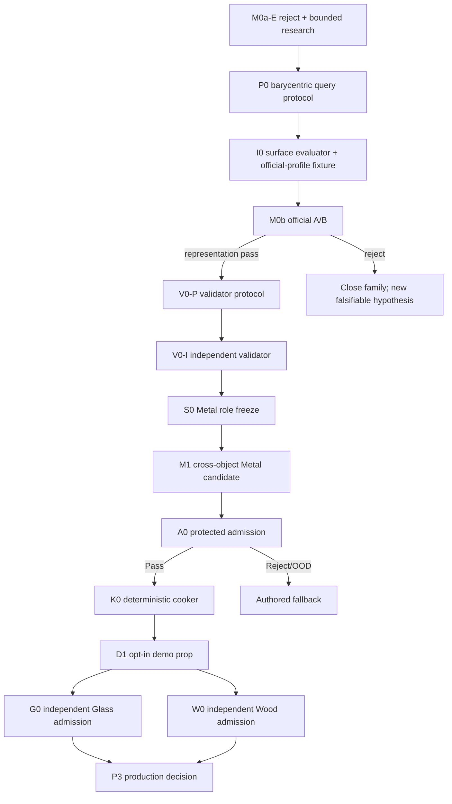

# Roadmap V26: deterministic surface-field repair to one admitted sound asset

| Field | Value |
| --- | --- |
| Rebaseline date | `2026-09-02` |
| Status | `ADOPTED / M0A_E_PREPROCESS_CONFORMANCE_REJECT / NO_MODEL_VALUES_OPENED / P0_PROTOCOL_FROZEN / I0_NEXT / AUTOMATIC_VALIDATOR_REQUIRED / INTERNET_ONLY_REAL_EVIDENCE / OFFLINE_COOKED_CLIPS / RUNTIME_NOT_AUTHORIZED` |
| Replaces | [Roadmap V25](physical-sound-synthesis-roadmap-v25.md) after M0a-E stopped before training; completed D0/T0/X0/M0a-I evidence and every protected-role rule remain binding |
| Current evidence | [P0 protocol](../development/physical-sound-v26-p0-barycentric-surface-query-protocol-2026-09-02.md), SHA-256 `4fff3ebd7b788e527b524ff8615d9e8a449b40121e194ba1eb947c5ea81e65e7`; [M0a-E result](../development/physical-sound-v25-m0a-official-evaluation-result-2026-09-02.md), [off-vertex transfer research](../development/physical-sound-v26-off-vertex-field-transfer-research-2026-09-02.md), [M0a-I result](../development/physical-sound-v25-m0a-implementation-conformance-result-2026-09-02.md), [T0](../development/physical-sound-v24-t0-analytic-teacher-result-2026-09-01.md), [X0](../development/physical-sound-v24-x0-blue-bowl-pilot-result-2026-09-01.md) and [D0](../development/physical-sound-v24-d0-neural-evidence-plane-result-2026-09-01.md) |
| Architecture | [SPEC-45](../architecture/45-physical-sound-synthesis-and-acoustic-presentation.md), `Proposed`; no public schema, content role, runtime model, physics authority or production ProductCheck is promoted |
| Mandatory fallback | Ordinary authored clips remain authoritative for every reject, OOD query, unavailable source, invalid artifact or tooling failure |

## Outcome

Deliver one evidence-backed, automatically admitted Metal rigid-impact asset
as ordinary deterministic cooked clips for one opt-in demo prop, without local
recording or per-sound human approval.

V26 succeeds only when:

1. a newly frozen M0b execution-equivalent successor evaluates per-vertex
   fields at arbitrary legal surface queries deterministically and passes one
   official A/B decision against the unchanged controls;
2. an independent validator is frozen from real groups unavailable to model
   selection and demonstrates bounded false-pass risk;
3. one cross-object Metal candidate passes development and one-shot method
   holdout without seed/checkpoint/threshold selection;
4. the frozen validator opens one untouched Metal admission shadow once and
   returns `Pass`;
5. the accepted record cooks twice to byte-identical clips and the demo retains
   a complete authored fallback.

A reproducible reject at M0b, V0, M1 or A0 is a valid terminal scientific
result and leaves the feature fallback-only. Glass and Wood remain separate
later admissions. Runtime neural inference, rolling, scraping, fracture and a
universal material model remain outside V26.

## What M0a established and did not establish

| Evidence | State | Consequence |
| --- | --- | --- |
| D0/T0/X0 evidence plane | `REPEAT_EXACT_PASS` | 144 causal teacher rows plus seven honest disclosed Blue Bowl rows remain the sole current corpus record. |
| M0 one-hot family | `SUPERSEDED_BEFORE_VALUES` | Isolated elasticity/density gates were unobservable and may not be restored. |
| M0a-I | `REPEAT_EXACT_CONTRACT_PASS` | Fixed model, causal features, role owner, canonical tensors and atomic CLI are implementable. |
| M0a-E | `PREPROCESS_CONFORMANCE_REJECT / NO_MODEL_VALUES` | Exact-vertex remesh sampling is invalid for official off-vertex contacts. No conclusion about neural quality is legal. |
| Successor scope | `EXECUTION_EQUIVALENT_ONLY` | M0b may change field sampling and fixture coverage; model/loss/seed/schedule/roles/gates do not change. |

## Critical dependency graph

Signal-blind source inventory may overlap P0/I0. Candidate-sensitive validator
features, thresholds and protected values remain sealed until their declared
predecessors pass.

## Work packages

| ID | Package | State | Size | Observable exit criterion |
| --- | --- | --- | ---: | --- |
| R0 | M0a-E closeout | `COMPLETE / CONFORMANCE_REJECT` | — | Exact first failure, no-output state, resource record and no-model-value claim are published; run B remains unstarted. |
| P0 | Surface-query and field-transfer protocol | `COMPLETE / FROZEN / VALUES_UNOPENED` | S | Protocol `4fff3ebd…65e7` freezes triangle membership, tolerances, canonical face tie-break, barycentric interpolation, mutations, M0b equivalence and all-official-shape fixture. |
| I0 | Deterministic field evaluator | `NEXT / BLOCKS_M0B-E` | M | Complete owning entry plus official-profile structural fixture passes twice byte-exactly for all plate/beam grids and 12 contacts; vertex/edge/interior pass and outside/degenerate/non-finite inputs reject. |
| M0b-E | Execution-equivalent official evaluation | `BLOCKED_BY_I0_COMMIT` | M | Under the unchanged seed `3101`, model, losses, 2,000 steps and role order, two bounded runs emit byte-identical canonical artifacts and one terminal `PASS`, `REPRESENTATION_REJECT`, `DOMAIN_GAP_REJECT` or conformance/resource result. |
| V0-P | Validator protocol and role freeze | `MAY_INVENTORY_SIGNAL_BLIND / VALUES_SEALED` | M | Freeze real-only positive, mutation, OOD and untouched-shadow groups, features, thresholds, confidence bound and access order before candidate-sensitive values. |
| V0-I | Independent Validator V1 | `BLOCKED_BY_M0B_PASS_AND_V0-P` | M–L | Separate owning CLI passes hard, physical, acoustic, mutation and selective-risk fixtures twice; generator targets/checkpoints are unavailable to calibration. |
| S0 | Metal evidence freeze | `BLOCKED_BY_V0-P` | M | Internet-only object/family-disjoint train, development, method-holdout, validator and admission roles are hash-closed without inventing absent axes. |
| M1 | Cross-object Metal candidate | `BLOCKED_BY_M0B_PASS_V0-I_S0` | L | One preregistered geometry-conditioned candidate beats compatible controls on object-disjoint development and one-shot holdout without selection. |
| A0 | Protected Metal admission | `BLOCKED_BY_M1` | S | Frozen generator and validator open one untouched shadow; every hard/physical/mutation/OOD gate and false-pass bound passes. |
| K0 | Deterministic clip cooker | `BLOCKED_BY_A0_PASS` | M | Accepted record cooks twice into byte-identical bounded 48 kHz clips plus provenance; stale/OOD/invalid input publishes nothing and selects fallback. |
| D1 | Demo prop | `BLOCKED_BY_K0` | M | One opt-in prop uses the existing presentation-only path; feature-off, missing/corrupt asset and unsupported contact reproduce authored fallback. |
| G0 / W0 | Glass and Wood admissions | `AFTER_D1 / INDEPENDENT` | L each | Each material receives fresh source identities, roles, candidate decision, validator evidence and protected shadow. |
| P3 | Production promotion | `POST_RESEARCH / ADR_REQUIRED` | L | A concrete consumer, content/fault/migration contract, Linux cost and full fallback justify a separate Accepted ADR and future ProductChecks. |

## Immediate implementation sequence

### 1. Freeze P0 before changing code

`COMPLETE`: [P0](../development/physical-sound-v26-p0-barycentric-surface-query-protocol-2026-09-02.md)
is frozen at SHA-256 `4fff3ebd…65e7`; no model value opened.

P0 must specify one deterministic algorithm:

- closest-surface residual with a scale-derived maximum;
- non-degenerate triangle requirement;
- float64 barycentric weights with bounded coordinates, sum-to-one and
  reconstruction checks;
- canonical lexicographic face identity for edge/vertex ties independent of
  triangle enumeration;
- linear interpolation of all ten vertex gains at the same physical query;
- no nearest-vertex snap, hidden analytic `u/v`, retriangulation or smoothing.

The M0b delta list must state that every model/value-affecting item from M0a is
unchanged. Its protocol hash freezes before implementation.

### 2. Build I0 around the missed official shape

Add a small production helper for point-on-triangle evaluation and test it
through the owning CLI. The structural fixture must reuse exact official grid
counts and all contact fractions, not merely a convenient subset. It must fail
if profile contacts, grid denominators, face order, tie-break, tolerance or
gain-field binding drift.

Run the existing full-entry fixture twice, the new official-profile structural
fixture twice, all source/role/tensor/atomic mutations and the relevant T0/X0/
assembler suite. Commit the implementation and exact root before M0b-E.

### 3. Execute M0b-E once

Build one hash-closed external manifest and preflight only identities,
resources and structural invariants. Then execute A/B with network denied,
CPU/one-thread determinism, `1,800 s`, `4 GiB` and `256 MiB` limits.

- `PASS` advances only to validator/Metal work.
- `REPRESENTATION_REJECT` closes the model family before later role access.
- `DOMAIN_GAP_REJECT` preserves the synthetic result but starts a new
  source-domain hypothesis, not a capacity increase.
- conformance/resource failure publishes no quality claim and spends M0b.

No official value may select a code change, retry, checkpoint or threshold.

### 4. Build the validator before Metal admission

V0 remains a separate owner with jointly necessary hard-schema, causal-
physical, real-acoustic/pretrained-representation, negative-mutation and
group-disjoint OOD layers. No scalar score alone can issue `Pass`. Human
listening is optional diagnosis only.

### 5. Admit, cook and demonstrate one Metal vertical

Only protected A0 `Pass` unlocks K0 and D1. The game consumes ordinary cooked
clips; it never runs the research model, reads its dataset or makes gameplay
state depend on presentation audio.

## Stop and branch rules

- M0a is spent. Do not rerun it or alter its exact-vertex implementation.
- M0b changes only sampling semantics and coverage. Architecture, capacity,
  seed, schedule, losses, thresholds, role order and physical defaults remain
  unchanged.
- Do not weaken surface tolerance until a coarse vertex happens to match; an
  off-surface query is OOD.
- Do not ask the user to record impacts or approve generated sounds one by one.
- Do not use generator predictions to calibrate the independent validator.
- Do not infer missing internet-source force, support, composition, material
  constants, listener or impact normal.
- Do not reuse Metal thresholds or admission results for Glass or Wood.
- Do not add runtime inference, public content schemas or raw PhysX contact
  mixing during research.

## Verification policy

- P0/research documentation uses `git diff --check` and direct link/hash/path
  validation.
- I0/M0b uses Python compilation, Ruff, focused full-entry tests, official-
  profile structural/mutation fixtures, recursive A/B byte comparison,
  resource records and boundary scan.
- K0 adds focused cooker/content-package checks; D1 adds `play`.
- Platform/performance checks remain conditional until a real runtime path
  exists. External offline training cost is not runtime performance.
- SPEC-45 stays `Proposed` until P3; research passes create no shipping claim.

## Definition of done

V26 is done when one protected Metal shadow passes the independently frozen
validator exactly once, its accepted record cooks twice into byte-identical
ordinary clips, and one opt-in demo prop plays those clips with authored
fallback intact. Every decision is hash-bound, no user recording or per-sound
approval is required, and no neural model runs in the game.

If M0b, V0, M1 or A0 rejects, V26 closes that branch reproducibly and the
feature remains fallback-only. Any later roadmap must name a fresh falsifiable
hypothesis and may not tune against opened values.
