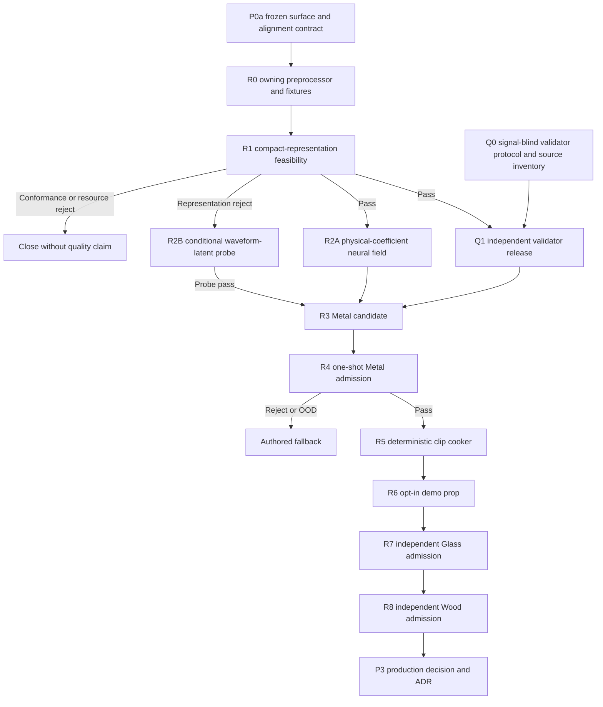

# Roadmap V27: automatic ML material-sound pipeline

| Field | Value |
| --- | --- |
| Rebaseline date | `2026-09-02` |
| Status | `ADOPTED / R0_REPEAT_EXACT_PASS / R1_A_RESOURCE_TIMEOUT / NO_CANONICAL_OUTPUT / RUN_B_NOT_STARTED / MODEL_QUALITY_UNOBSERVED / GENERATOR_BRANCH_CLOSED / Q0_SIGNAL_BLIND_NEXT / RUNTIME_ML_NOT_AUTHORIZED` |
| Replaces | [Roadmap V26](physical-sound-synthesis-roadmap-v26.md) as planning authority; V26 evidence, frozen protocols, protected-role order and spent experiments remain binding |
| Current evidence | [R1 result](../development/physical-sound-v27-r1-official-feasibility-result-2026-09-02.md), [R0 result](../development/physical-sound-v27-r0-preprocessing-owner-result-2026-09-02.md), implementation root `d013ec35…f456`; [P0a](../development/physical-sound-v26-p0a-barycentric-and-padded-alignment-protocol-2026-09-02.md) `54522c26…49e8`, [M0a-E](../development/physical-sound-v25-m0a-official-evaluation-result-2026-09-02.md), [V24 D0](../development/physical-sound-v24-d0-neural-evidence-plane-result-2026-09-01.md), [T0](../development/physical-sound-v24-t0-analytic-teacher-result-2026-09-01.md) and [X0](../development/physical-sound-v24-x0-blue-bowl-pilot-result-2026-09-01.md) |
| Architecture | [SPEC-45](../architecture/45-physical-sound-synthesis-and-acoustic-presentation.md), `Proposed`; the accepted clip path remains production authority |
| User constraint | Evidence comes from published internet sources; no user recording and no per-sound human approval |

## Product outcome

Build a repeatable external pipeline that turns published physical/acoustic
evidence into an automatically validated set of ordinary cooked impact clips.
The first complete vertical is Metal. Glass and Wood reuse the machinery but
must earn independent data, model and admission results.

V27 deliberately stops treating a hand-authored formula as the final product.
Classical mechanics remains useful as a causal teacher, deterministic renderer,
sanity oracle and fallback. The learned model handles the variation that did
not transfer through fixed formula families: geometry, contact location,
material response and compact residual acoustics.

The game does not run the research model. An accepted external record is cooked
offline into bounded clips with exact hashes. Missing, rejected, corrupt or OOD
records select an authored clip; audio never changes authoritative gameplay.

## Definition of success

V27 succeeds when all of the following are true:

1. the repaired preprocessor accepts every legal frozen surface/contact and
   alignment fixture twice exactly;
2. one frozen feasibility run decides whether the compact physical
   representation is learnable without changing its model after values open;
3. an independent validator is calibrated only on real, group-disjoint data
   and controlled negative mutations, with a declared false-pass bound;
4. one Metal generator beats its frozen classical and retrieval controls on
   object-disjoint development and one untouched method holdout;
5. the frozen generator and validator open one Metal admission shadow exactly
   once and return `Pass` without manual listening;
6. the accepted record cooks twice to byte-identical 48 kHz clips and one
   opt-in demo prop preserves authored fallback under every failure case;
7. the pipeline can start Glass without copying Metal thresholds, protected
   examples or object identities.

A reproducible `Reject`, `FallbackOutOfDomain`, conformance failure or bounded
resource failure is also a valid scientific result. It closes that branch; it
does not authorize test-driven retuning.

## Four-plane design

| Plane | Owner | Learns or decides | Must not do |
| --- | --- | --- | --- |
| Evidence | Internet-source registry and dataset builder | Exact bytes, provenance, object/material identity and only genuinely observed axes | Invent force, geometry, composition, listener or support metadata |
| Generator | External training job | Contact/geometry/material-conditioned acoustic representation or offline clip distribution | Read validator shadows or choose itself from admission results |
| Validator | Separate external release | Hard signal validity, causal relations, real-acoustic similarity, mutations and OOD risk | Reuse generator targets, checkpoint features or training groups |
| Cooker/runtime | Deterministic engine-owned tool and accepted clip path | Quantize, bound, hash and publish ordinary clips with fallback | Load training data/checkpoints or make simulation depend on audio |

The durable "sound knowledge base" is therefore not a bag of hand-tuned
formulas. It is a registry of source hashes, observed domain, conditioning
schema, generator/validator releases, admission decision, cooked asset hashes,
OOD limits and fallback. Large datasets, checkpoints and generated audio stay
outside Git.

## Dependency graph

Q0 may inventory signal-blind real sources while R0/R1 runs. Validator
features, thresholds and protected values remain sealed until their declared
predecessors permit them.

## Work packages

| ID | Package | State | Size | Observable exit criterion |
| --- | --- | --- | ---: | --- |
| R0 | Deterministic preprocessing owner | `COMPLETE / REPEAT_EXACT_PASS` | M | [R0](../development/physical-sound-v27-r0-preprocessing-owner-result-2026-09-02.md) passes full-entry A/B, 48 surface queries, mutations and all three real contexts at root `d013ec35…f456`; M0a stays unchanged. |
| R1 | Compact-representation feasibility | `CLOSED / RUN_A_RESOURCE_TIMEOUT / RUN_B_NOT_STARTED` | M | [R1](../development/physical-sound-v27-r1-official-feasibility-result-2026-09-02.md) reached the `1,800 s` wall limit without canonical output; quality remains unobserved and M0b is spent. |
| Q0 | Validator protocol and source inventory | `NEXT / SIGNAL_BLIND_ONLY` | M | Freeze positive groups, negative mutations, OOD groups, feature families, access order, confidence method and minimum evidence before candidate-sensitive values. |
| Q1 | Independent Validator V1 | `BLOCKED_BY_Q0_AND_FRESH_GENERATOR_PASS` | L | Separate CLI passes hard, physical, acoustic, mutation and selective-risk fixtures twice; generator code/checkpoints are unavailable to calibration. |
| R2A | Physical-coefficient neural field | `NOT_AUTHORIZED_BY_R1_RESOURCE_REJECT` | L | A fresh roadmap/protocol must first prove a resource-bounded generator predecessor. |
| R2B | Conditional waveform-latent probe | `NOT_AUTHORIZED_WITHOUT_REPRESENTATION_REJECT` | M | Resource timeout cannot select a waveform/codec-latent family. |
| R3 | Metal corpus and candidate freeze | `BLOCKED_BY_Q1_AND_R2` | L | Hash-close internet-only train/development/method-holdout/validator/shadow roles, train one declared candidate and open the holdout once without selection. |
| R4 | Protected Metal admission | `BLOCKED_BY_R3` | S | Frozen generator and Validator V1 open one untouched shadow exactly once; every mandatory gate and false-pass bound passes. |
| R5 | Deterministic cooker | `BLOCKED_BY_R4_PASS` | M | Accepted record cooks twice into byte-identical bounded clips and provenance; stale, invalid or OOD input publishes nothing and selects fallback. |
| R6 | Demo vertical | `BLOCKED_BY_R5` | M | One opt-in prop plays cooked Metal variants through the existing presentation path; feature-off, missing/corrupt asset and unsupported contact reproduce authored fallback. |
| R7 | Glass admission | `AFTER_R6 / INDEPENDENT` | L | Fresh Glass identities, splits, thresholds, candidate and shadow pass the same process without Metal leakage. Thin goblet, bottle and thick jar remain object/domain distinctions, not one universal preset. |
| R8 | Wood admission | `AFTER_R7 / INDEPENDENT` | L | Fresh Wood evidence and protected admission pass independently; current hand-tuned wood remains only a baseline/fallback. |
| P3 | Product promotion | `POST_RESEARCH / ADR_REQUIRED` | L | A real consumer, public content/fault/migration contract, Linux cost and fallback evidence justify Accepted architecture and ProductChecks. |

## Model decision ladder

V27 permits exactly one branch at each decision point:

1. **R1 asks whether the compact target is learnable.** It keeps the frozen
   causal model and only repairs value-independent preprocessing. A pass
   selects R2A; it does not prove naturalness.
2. **R2A is the preferred product-shaped model.** Geometry/material/contact
   conditioning predicts compact acoustic coefficients which a deterministic
   renderer converts to clips.
3. **R2B is an escalation, not an automatic retry.** It runs only after a
   representation-specific reject and tests one conditional waveform/codec
   latent family offline. If it also rejects, neural generation closes until
   materially new data or a new falsifiable hypothesis exists.
4. Prompt-to-sound systems may supply an upper-bound comparison or dataset
   hypothesis. Their opaque output cannot become the validator, physical
   ground truth or direct runtime dependency.

Architecture size, seed, checkpoint, loss and threshold shopping against an
opened holdout or shadow is prohibited. A new choice needs a new protocol and
fresh protected identities.

## Automatic validation contract

`Pass` is the conjunction of independent layers, never one similarity score:

- **hard signal:** parseable canonical PCM, finite samples, duration/bandwidth,
  peak/RMS/DC/clip limits, deterministic repeat and provenance;
- **causal physical:** impact precedes decay, stronger excitation does not
  reduce declared response, nearby contacts vary continuously and material/
  geometry changes are not ignored;
- **real acoustic:** frozen embeddings and temporal-spectral descriptors place
  the candidate inside the target real-object distribution;
- **negative mutations:** noise tails, frozen spectra, shuffled envelopes,
  metal-like glass, wrong decay and other known shortcuts must reject;
- **OOD/selective risk:** insufficient source coverage, unknown conditions and
  low confidence return fallback, with a group-disjoint false-pass upper bound;
- **independence:** validator training/calibration groups, code and features are
  unavailable to generator selection and protected admission opens once.

Human audition remains optional diagnosis and showcase feedback. It cannot be
a required production gate or a way to rescue a failed automatic decision.

## Immediate execution order

1. `COMPLETE`: R0 binds P0a surface/alignment in the owning M0b entry and
   passes conformance plus official-context preflight at `d013ec35…f456`.
2. `CLOSED / RESOURCE_REJECT`: R1-A reached `1,800 s` without canonical
   output; B did not start and no quality inference is legal.
3. Next, perform only signal-blind Q0 source inventory; freeze the full
   validator protocol before any Metal candidate-sensitive value is opened.
4. The current generator branch is closed. A successor requires a new bounded
   research result, roadmap and protocol; R2A/R2B cannot be selected from the
   timeout.
5. Freeze the Metal roles, train one R3 candidate, open one method holdout and
   then one R4 shadow. No successful shadow means no cooker or demo promotion.
6. After R6, repeat admission for Glass and then Wood. Reuse tooling, not
   thresholds, recordings, identities or claims.

## Stop rules

- Do not rerun or repair spent M0a, earlier field families or opened roles.
- Do not rerun R1-A, start R1-B or inspect partial values after the resource
  timeout; M0b is spent and published no quality result.
- Do not open model values until R0 fixtures and its implementation root are
  committed.
- Do not weaken surface/alignment tolerances to accept one convenient sample.
- Do not ask the user to hit objects, record microphones or approve every clip.
- Do not train the validator on generator outputs or use its shadow for model
  selection.
- Do not infer unobserved internet-source axes or redistribute source material
  whose distribution terms are not reviewed.
- Do not copy a Metal admission to Glass/Wood or call broad material labels
  exact alloy/species/composition truth.
- Do not add runtime neural inference, gameplay authority or a public content
  schema during V27.
- After two coherent failures in the same family, stop tuning and run a bounded
  research cycle with competing hypotheses and one cheapest discriminator.

## Verification and commit boundaries

| Boundary | Required verification | Commit result |
| --- | --- | --- |
| R0 protocol/implementation | Python compile, Ruff, surface/alignment/full-entry/mutation fixtures twice, recursive byte comparison and boundary scan | Frozen implementation root before R1 values |
| R1/Q1/R2 | Exact manifests, protected-role audit, deterministic repeats, resource record and declared terminal result | Separate protocol, implementation and result checkpoints |
| R3/R4 | Split-leakage audit, control comparison, one-shot access log and false-pass bound | Admission or explicit fallback-only result |
| R5 | Focused cooker/content-package checks and byte-identical output | No datasets, checkpoints or generated WAVs in Git |
| R6 | Focused `play` check with feature-on/off and failure fallback | One product-shaped, opt-in demo only |
| P3 | Future ADR plus affected product checks | No promotion by roadmap wording alone |

## Not in V27

- a universal sound model for every material and action;
- rolling, scraping, fracture, fluids, cloth, fire or biological sounds;
- runtime neural inference or network access;
- automatic gameplay hearing from presentation audio;
- replacement of authored clips, music, speech or ambience;
- publication of third-party datasets, checkpoints or generated audition WAVs.
