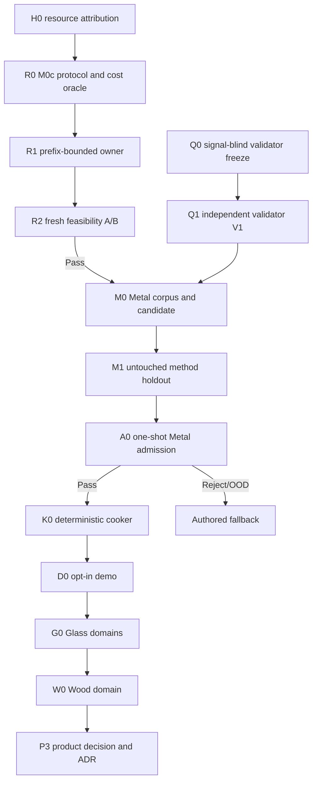

# Roadmap V28: resource-bounded automatic physical sound

| Field | Value |
| --- | --- |
| Rebaseline date | `2026-09-02` |
| Status | `SUPERSEDED_BY_V29 / H0_COMPLETE / R0_FROZEN / R1_PASS / R2_REPEAT_EXACT_REPRESENTATION_REJECT / M0C_CLOSED / RUNTIME_ML_NOT_AUTHORIZED` |
| Replaces | [Roadmap V27](physical-sound-synthesis-roadmap-v27.md) as planning authority; its R0/R1 evidence, protected-role order and stop rules remain binding |
| Replaced by | [Roadmap V29](physical-sound-synthesis-roadmap-v29.md); V28 evidence and closed-family stop rules remain immutable |
| Current evidence | [R2 result](../development/physical-sound-v28-r2-official-feasibility-result-2026-09-02.md) `REPEAT_EXACT_REPRESENTATION_REJECT`; [R1 result](../development/physical-sound-v28-r1-m0c-owner-resource-result-2026-09-02.md) at implementation `d316982d`, root `524411d3…6d32`; [R0 protocol](../development/physical-sound-v28-r0-m0c-prefix-resource-protocol-2026-09-02.md) `28cab428…9000`, [V28 resource research](../development/physical-sound-v28-prefix-bounded-training-research-2026-09-02.md), [V27 R1](../development/physical-sound-v27-r1-official-feasibility-result-2026-09-02.md) and [V27 R0](../development/physical-sound-v27-r0-preprocessing-owner-result-2026-09-02.md) |
| Architecture | [SPEC-45](../architecture/45-physical-sound-synthesis-and-acoustic-presentation.md), `Proposed`; the accepted authored-clip path remains production authority |
| User constraint | All real evidence is found online; the user records nothing and does not approve sounds one by one |

## Outcome

Build an external, reproducible ML authoring pipeline that learns how bounded
physical impacts should sound from published evidence, validates candidates
without a human review queue, and cooks accepted results into ordinary clips.

The first admitted vertical is Metal. Glass follows with separate thin goblet,
bottle and thick jar domains; Wood follows independently. Formulas remain a
causal teacher, renderer, constraint system and fallback, but the learned model
owns variation that fixed presets could not express.

No neural model runs in gameplay. No generated sound changes simulation. A
missing, rejected, corrupt or out-of-domain record always selects an authored
clip.

## What V28 changes

V27 proved preprocessing but spent its feasibility run on a resource timeout.
V28 retains the scientific model and removes only computation that the frozen
loss cannot observe:

```text
stored aligned target: 144,000 samples
training spectral windows: 256, 1,024, 4,096 samples
old differentiable render: 144,000 samples
V28 differentiable render: 4,096 samples
full render: evaluation/cooking only
```

Random-tensor evidence shows the `4,096`-sample path is bit-exact in loss and
gradients and about `83.7×` faster per rendered training step. The successor is
still fresh: M0b remains closed, M0c gets a new protocol, implementation root,
resource oracle and official A/B access record.

## Success definition

V28 reaches the requested end state only when:

1. prefix-bounded M0c proves exact loss/gradient equivalence and completes an
   official-shape resource oracle twice inside its frozen wall/RSS envelope;
2. a fresh official feasibility A/B run publishes a repeat-exact decision;
3. an independent real-data validator demonstrates bounded false-pass and OOD
   behavior on group-disjoint positives and controlled negative mutations;
4. one frozen Metal generator beats classical and retrieval controls on
   object-disjoint development and one untouched method holdout;
5. the generator and validator open one Metal admission shadow exactly once
   and return `Pass` without mandatory listening;
6. accepted records cook twice to byte-identical 48 kHz clips and one opt-in
   demo prop preserves fallback under every failure mode;
7. Glass and Wood repeat acquisition, calibration and admission with fresh
   identities, thresholds and protected roles.

A deterministic reject, OOD fallback, conformance failure or bounded resource
failure is a valid terminal scientific result. It closes the branch and cannot
be repaired from protected values.

## Dependency graph



R0–R2 and Q0–Q1 are independent until M0. Validator calibration must not read
generator code, checkpoints, predictions or protected admission values.

## Work packages

| ID | Package | State | Exit criterion |
| --- | --- | --- | --- |
| H0 | Resource attribution | `COMPLETE` | [Research](../development/physical-sound-v28-prefix-bounded-training-research-2026-09-02.md) confirms the long differentiable render as dominant, proves five exact random loss/gradient equivalence cases and records primary PyTorch methods. |
| R0 | M0c protocol and resource oracle | `COMPLETE / FROZEN` | [Protocol](../development/physical-sound-v28-r0-m0c-prefix-resource-protocol-2026-09-02.md) `28cab428…9000` binds inherited hashes, sole `144,000 → 4,096` change, exact equivalence fixtures, 10,000-step cost workload, `600 s`/`3.5 GiB` gates and official access order. |
| R1 | Prefix-bounded M0c owner | `COMPLETE / REPEAT_EXACT_RESOURCE_PASS` | [Result](../development/physical-sound-v28-r1-m0c-owner-resource-result-2026-09-02.md): Gate E and complete entry repeat exactly; two isolated 10,000-step runs finish in `164.616/155.428 s`, peak `1.010/1.008 GB`, normalized SHA `078ff403…6af6`. |
| R2 | Fresh official feasibility | `COMPLETE / REPEAT_EXACT_REPRESENTATION_REJECT / M0C_CLOSED` | [Result](../development/physical-sound-v28-r2-official-feasibility-result-2026-09-02.md): six A/B artifacts match; frequency/gain/spectrum beat ridge, but decay ratio `1.924`, remesh `0.01156 > 1e-5` and all physical counterfactuals fail. |
| Q0 | Validator protocol and source inventory | `READY / SIGNAL_BLIND_ONLY` | Hash-freeze online source identities, real positive/OOD groups, mutations, feature families, confidence method, minimum evidence, rights/provenance and one-use role order before signal values. |
| Q1 | Independent Validator V1 | `BLOCKED_BY_Q0` | Separate CLI passes hard-signal, causal, real-acoustic, mutation and selective-risk fixtures twice with declared group-disjoint false-pass bound; no generator feature/checkpoint dependency. |
| M0 | Metal corpus and candidate | `BLOCKED_BY_R2_REJECT_AND_Q1` | A fresh generator research/protocol must replace closed M0c; then hash-close internet-only roles and train one preregistered candidate/control set without validator/shadow access. |
| M1 | Metal method holdout | `BLOCKED_BY_M0` | Open one untouched object-disjoint holdout once; candidate meets every declared advantage and OOD gate without selection. |
| A0 | Metal admission | `BLOCKED_BY_M1_PASS` | Frozen generator and Validator V1 open one admission shadow once; all mandatory gates and false-pass bound pass automatically. |
| K0 | Deterministic clip cooker | `BLOCKED_BY_A0_PASS` | Accepted record cooks twice to byte-identical bounded PCM/provenance; invalid, stale or OOD input publishes nothing and selects fallback. |
| D0 | Demo vertical | `BLOCKED_BY_K0` | One opt-in Metal prop plays cooked contact variants through existing presentation; feature-off and every fault reproduce authored fallback. |
| G0 | Glass admission | `AFTER_D0 / INDEPENDENT` | Thin goblet, bottle and thick jar use fresh online objects, calibration, thresholds, candidate, holdout and shadow; no Metal identity or threshold leakage. |
| W0 | Wood admission | `AFTER_G0 / INDEPENDENT` | Fresh Wood species/object evidence and admission pass independently; the current procedural wood sound remains baseline/fallback. |
| P3 | Product promotion | `POST_RESEARCH / ADR_REQUIRED` | A real consumer, public content/fault/migration contract, Linux cost and fallback evidence justify an Accepted decision and affected ProductChecks. |

## R0/R1 frozen design intent

M0c may change exactly one scientific execution detail: synthetic prediction is
rendered to the maximum sample read by its loss. It must inherit from M0b:

- data manifests, preprocessing and P0a alignment;
- model topology, `23,142` parameter cap, CPU float32 and seed;
- optimizer, learning rates, step counts, batch sizes and variant set;
- loss terms, weights, spectral windows, controls, thresholds and access order;
- evaluation, full-length output rendering and protected-role rules.

R0 must mechanically prove all of the following before R1 exists:

- `render(N)[..., :4096] == render(4096)` for finite legal predictions;
- old and new synthetic total/components/parameter gradients are exact on
  multiple fixed random cases plus bounds/adversarial cases;
- no metric that consumes late decay is silently truncated;
- the complete official-shape cost workload, including five variants and real
  replay structure, completes twice below a frozen wall limit and below the
  existing `4 GiB` memory ceiling;
- cost reports contain timings/RSS only and cannot become a tuning surface for
  model values.

Suggested initial envelope to preregister, then prove rather than assume:
`≤600 s` wall per complete value-independent cost run, peak RSS `<3.5 GiB`,
two successful runs, and no network. R0 protocol owns the final numbers.

## Automatic validator contract

Validator `Pass` is a conjunction, not one embedding score:

- canonical PCM validity, finite samples, duration/bandwidth/peak/RMS/DC/clip
  limits and deterministic provenance;
- causal impact/decay order, excitation monotonicity and contact continuity;
- frozen temporal-spectral descriptors and independently released audio
  embeddings calibrated on real, group-disjoint objects;
- rejection of wrong decay, frozen spectra, shuffled envelopes, noise tails,
  material-confusion and generator-shortcut mutations;
- explicit OOD/fallback when source coverage or confidence is insufficient;
- confidence intervals and a preregistered upper false-pass bound at object
  group level.

Optional human audition may diagnose failures or produce a showcase. It cannot
select checkpoints, tune thresholds, rescue an admission or become required
for every sound.

## Evidence and knowledge base

The durable database stores metadata and decisions, not redistributed corpora:

- exact source URL/version/date/hash and permitted use/provenance;
- observed object, material, geometry, support, contact and excitation axes,
  with missing axes explicit;
- split group and one-use role;
- preprocessor/generator/validator release hashes;
- admission decision, OOD domain and fallback reason;
- cooked clip hashes and reproducibility record.

Datasets, protected audio, checkpoints, generated clips, caches and MLflow
runs remain outside Git. Unknown or incompatible distribution terms exclude an
artifact from redistribution even when it can inform local scientific work.

## Execution order

1. `COMPLETE`: freeze R0 M0c protocol `28cab428…9000`; official values remain sealed.
2. `COMPLETE`: R1 passes equivalence/full-owner gates at implementation
   `d316982d`, root `524411d3…6d32`.
3. `CLOSED / REPEAT_EXACT_REPRESENTATION_REJECT`: R2 A/B match; M0c fails
   decay, remesh and physical intervention gates before holdout.
4. `NEXT`: complete signal-blind Q0, then build Q1 from independent real
   groups and mutations.
5. Only after R2 Pass and Q1, freeze/train M0 Metal, then open M1 and A0 once.
6. A0 Pass unlocks K0/D0. Reject/OOD ends in authored fallback.
7. Reuse tooling—not data, thresholds or protected identities—for Glass, then
   Wood.

## Stop rules

- Never rerun V27 R1-A, start R1-B or inspect interrupted values/staging beyond
  the already published value-independent surface report.
- Never change M0c seed, capacity, optimizer, step count, loss weight, spectral
  window, threshold or role from a resource or protected result.
- Never tune or rerun M0c from R2 values; its six repeat-exact official
  artifacts are attribution evidence only and the family is closed.
- If prefix equivalence, full-owner cost or repeat-exactness fails, close M0c
  before official access.
- Do not infer a representation reject from a timeout and do not jump to a
  waveform/codec model without a fresh representation-specific result.
- Do not ask the user to record impacts or approve sounds individually.
- Do not let generator output train/calibrate its validator.
- Do not promote runtime ML, a public schema or a new content role from this
  roadmap; SPEC-45 remains `Proposed` and authored clips remain authority.
- Do not copy Metal evidence or thresholds into Glass/Wood admissions.

## Verification and commits

| Boundary | Minimum verification | Commit boundary |
| --- | --- | --- |
| H0/R0 docs | `git diff --check`, direct link/hash/symbol validation | Research and adopted roadmap |
| R1 owner | Python compile, Ruff, focused M0a/M0b/M0c tests, exact value/gradient fixtures, complete owner A/B, cost/RSS runs and boundary scan | Protocol, implementation and result separately |
| R2/Q1 | Exact manifests, access audit, deterministic repeats, resource record and declared terminal result | Separate protocol/release/result commits |
| M0/M1/A0 | Split-leakage audit, frozen controls, one-use access log, confidence/false-pass evidence | Candidate, holdout and admission commits |
| K0 | Focused cooker and `content-package` checks, recursive byte comparison | No dataset/checkpoint/generated WAV in Git |
| D0 | Focused `play` check for feature-on/off and fallback faults | One opt-in demo vertical |
| P3 | Future ADR/SPEC updates and mapped ProductChecks | No promotion by roadmap text alone |

## Not in V28

- a universal prompt-to-sound model;
- rolling, scraping, breaking, liquids, cloth, fire, voice, music or ambience;
- runtime inference, network-dependent playback or training in gameplay;
- manual review of every generated sound;
- redistribution of third-party datasets/checkpoints/audio;
- replacement of gameplay hearing facts with presentation audio.
