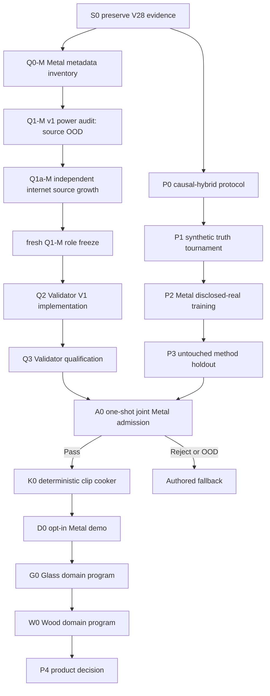

# Roadmap V29: validator-first causal hybrid physical sound

| Field | Value |
| --- | --- |
| Rebaseline date | `2026-09-02` |
| Status | `ADOPTED / V28_M0C_CLOSED / Q0M_SOURCE_IDENTITIES_FEASIBLE / Q1M_SOURCE_POWER_OOD / Q1AM_SOURCE_GROWTH_NEXT / VALIDATOR_FIRST / CAUSAL_HYBRID_GENERATOR_RESEARCH / INTERNET_ONLY / AUTOMATIC_ADMISSION / CLIP_FALLBACK / RUNTIME_ML_NOT_AUTHORIZED` |
| Replaces | [Roadmap V28](physical-sound-synthesis-roadmap-v28.md) as planning authority; all V28 evidence, protected-value access records and closed-family stop rules remain immutable |
| Research basis | [V29 rebaseline](../development/physical-sound-v29-validator-first-ml-rebaseline-research-2026-09-02.md) |
| Architecture | [SPEC-45](../architecture/45-physical-sound-synthesis-and-acoustic-presentation.md), `Proposed`; current authored clips and deterministic gameplay acoustic facts remain authority |
| Product-owner constraint | All real evidence is published online; the user records nothing and does not approve sounds one by one |

## Outcome

Build an external, reproducible authoring loop that can learn rigid-impact
sound variation, independently decide when a result is trustworthy and bake an
accepted result into ordinary deterministic 48 kHz clips.

The first domain is Metal rigid impact. Glass then restarts with separate thin
goblet, bottle and thick-jar domains; Wood follows independently. A failed or
unsupported domain is complete as `FallbackOutOfDomain` and keeps its authored
clip. No research model runs in gameplay and no generated waveform affects
simulation or NPC hearing.

## Why V29 exists

V28 solved execution cost and repeatability, then rejected M0c itself. The
model improved several output-space metrics but failed decay, remesh
consistency and all physical interventions. Its family is closed.

V28 also inherited a validator corpus whose frozen target was Glass. That
corpus cannot validate Metal because its Metal entries are explicit
`reject_parent` rows. V29 therefore makes target-role correctness and sample
power the first gate. The old Glass split remains immutable diagnostic
evidence; it is never relabelled or used to tune Metal thresholds.

[Q1-M](../development/physical-sound-v29-q1m-metal-role-power-result-2026-09-02.md)
then proved that the raw Q0 counts cannot populate the protected topology:
there are two project revisions against a nine-project role floor, `23/32`
exact-Steel groups for the two protected evaluations and exactly `70/70`
non-Metal rejects, leaving none for development/calibration. All `109`
identities are exposure-accounted, but none has a current freshness
certificate. The current release is therefore terminal OOD and Q1a-M source
growth is next; no protected signal or role opened.

## Program invariants

1. **Three certificates stay separate.** Generator capability, validator
   qualification and joint admission are different immutable results.
2. **Validator and generator are independent.** The validator cannot read
   generator code, checkpoints, features, predictions or protected roles
   during training/calibration.
3. **Roles precede signals.** Source identity, object/project groups, declared
   axes and one-use roles freeze from metadata before protected PCM, features
   or model values open.
4. **Physics precedes plausibility.** A generator must pass known-truth
   counterfactual and remesh gates before real-data quality can matter.
5. **Abstention is success.** Missing support, source power, confidence or
   agreement returns `FallbackOutOfDomain`, never a manual-review queue.
6. **No hidden product promotion.** The pipeline stays external and cooks
   clips through the current content path until a real consumer and Accepted
   ADR authorize more.

## Dependency graph



Q1a/Q2/Q3 and P0–P1 may progress independently. They meet only after both
sides have immutable release identities. P2 may use only generator-designated
sources; Q2/Q3 may use only validator-designated sources.

## Work packages

| ID | Package | State | Exit criterion |
| --- | --- | --- | --- |
| S0 | V28 closure and lineage | `COMPLETE` | V28 R2 remains the repeat-exact `REPRESENTATION_REJECT`; M0c values cannot select a retry and all protected access records remain immutable. |
| Q0-M | Signal-blind Metal source inventory | `COMPLETE / REPEAT_EXACT / ZERO_SIGNAL / IDENTITIES_FEASIBLE` | [Q0-M](../development/physical-sound-v29-q0m-metal-source-inventory-result-2026-09-02.md) preserves exact labels and excludes 30 historical overlaps; 23 exact-Steel, 39 broad-Metal and 70 non-Metal groups remain across two project revisions. No role or freshness claim. |
| Q1-M | Metal power and role freeze | `COMPLETE / REPEAT_EXACT / ZERO_SIGNAL / SOURCE_POWER_OOD / NO_ROLE_ASSIGNMENT` | [Q1-M](../development/physical-sound-v29-q1m-metal-role-power-result-2026-09-02.md) accounts for all `109` identities but finds `2/9` role projects, `2/4` protected projects, `23/32` exact-Steel positives, `70/70` protected rejects and zero current freshness-certified groups. All protected payloads remain sealed. |
| Q1a-M | Independent Metal source growth | `NEXT` | Freeze at least seven additional independent internet project revisions, at least nine additional exact-Steel groups before unprotected needs, reject capacity beyond the protected `70` floor and one current metadata-only exposure ledger. Then rerun Q1-M as a fresh release with unchanged gates. |
| Q2 | Independent Validator V1 | `BLOCKED_BY_Q1a-M_AND_FRESH_Q1-M` | A separate CLI combines hard PCM/provenance checks, causal envelope/decay, temporal-spectral descriptors, a hash-pinned frozen BEATs candidate and explicit OOD abstention. CLAP remains report-only. Two clean runs are byte-identical and no generator dependency exists. |
| Q3 | Validator qualification | `BLOCKED_BY_Q2` | Calibration alone selects thresholds. One object/project-disjoint validator holdout meets the frozen false-pass upper bound, positive-coverage lower bound, mutation rejection and leave-project-out requirements. Failure closes the validator release; it does not tune from holdout or open joint shadow. |
| P0 | Physics-locked generator protocol | `READY / PARALLEL_WITH_Q` | Freeze one classical differentiable modal control and one neural correction model whose outputs are bounded damping/radiation/modal-participation corrections around classical geometry/material modes. Bind resource, remesh and counterfactual gates before values. |
| P1 | Synthetic known-truth tournament | `BLOCKED_BY_P0` | Complete-owner A/B repeats exactly; classical control and neural candidate are tested on unopened geometry/material/remesh truth. The candidate must pass decay, remesh and Young's-modulus/density/thickness/scale interventions before real PCM access. |
| P2 | Disclosed-real Metal training | `BLOCKED_BY_P1_PASS_AND_FRESH_Q1-M` | Train one frozen candidate on generator-only internet roles with exact meshes/contact/force where published. Compare against classical inverse-fit and retrieval baselines; validator sources, thresholds and shadow remain inaccessible. |
| P3 | Metal method holdout | `BLOCKED_BY_P2` | Open one untouched object/project-disjoint generator holdout once. Candidate beats both controls on preregistered causal and acoustic metrics without checkpoint, threshold or architecture selection. |
| A0 | Joint Metal admission | `BLOCKED_BY_Q3_PASS_AND_P3_PASS` | Freeze generator, cooker preprofile and Validator V1 hashes, then open one joint admission shadow exactly once. All hard physics, acoustic, false-pass, coverage and OOD gates pass automatically, or the result is terminal Reject/OOD. |
| K0 | Deterministic clip cooker | `BLOCKED_BY_A0_PASS` | One accepted record renders/cooks twice to byte-identical bounded 48 kHz PCM plus provenance. Invalid, stale, oversized, corrupt or OOD input publishes nothing and resolves to the declared authored fallback. |
| D0 | Opt-in Metal demo | `BLOCKED_BY_K0` | One demo-scene prop uses only cooked clips through the existing presentation path. Feature-off, missing clip, invalid record and audio-device fault preserve gameplay roots and reproduce the authored fallback. |
| G0 | Glass domain program | `AFTER_D0 / FRESH_RELEASE` | Reuse tooling only. Thin goblet, bottle and thick jar each receive fresh target roles, evidence counts, thresholds, generator release, holdout and one-shot admission. The historical Glass split may be a frozen diagnostic but cannot supply Metal-derived thresholds. |
| W0 | Wood domain program | `AFTER_G0 / FRESH_RELEASE` | Fresh Wood species/object/support evidence and one-shot admission pass independently. Current procedural/authored Wood remains baseline and fallback. |
| P4 | Product promotion decision | `POST_RESEARCH / ADR_REQUIRED` | A real production consumer, complete committed contact projection, public content/fault semantics, Linux cost and enabled/disabled/fault root non-regression justify an Accepted ADR and the SPEC-45 ProductChecks. |

## Q lane: who validates

Validator V1 is an external frozen ensemble with five layers:

1. **Integrity owner** — canonical PCM, finite/bounded samples, duration,
   bandwidth, peak/RMS/DC/clipping and exact provenance;
2. **physical-time specialist** — onset, energy trajectory, decay order,
   monotonic excitation and contact continuity;
3. **spectral/material specialist** — stable modal/spectral evolution and
   confusion against declared non-Metal families;
4. **frozen representation specialist** — one exact pretrained BEATs encoder
   plus a small calibration-only head trained only on real validator roles;
5. **risk/OOD owner** — source coverage, specialist disagreement,
   source-stratified confidence and explicit abstention.

`Pass` is the conjunction of mandatory layers. Any hard failure rejects. Any
unsupported domain, insufficient confidence or serious specialist disagreement
returns `FallbackOutOfDomain`. A CLAP text/audio score, optional audition or
showcase preference is diagnostic only.

### Required negative evidence

Q1-M/Q2 preserve the AV-P0C controls and add the causal failures exposed by
later experiments:

- stationary white and coloured tails;
- shuffled amplitude envelope and repeated/frozen spectral carrier;
- wrong decay curve and late-energy injection;
- frequency/material confusion and retrieval-copy shortcuts;
- excitation-order or gain-monotonicity violations;
- clipped, DC-biased, bandwidth-starved and background-contaminated PCM;
- generator-family and source-project OOD.

Mutations inherit the parent's role and group. A parent is a false pass if any
mandatory reject child passes. Published resynthesis is never called a failure
unless its expected outcome was explicitly declared before evaluation.

### Statistical contract

- Thresholds and feature/head choices use only validator development and
  calibration.
- Holdout and joint shadow never select a threshold, model, checkpoint,
  mutation severity or source.
- Release evidence is grouped by physical object and reported by independent
  publisher/project revision.
- The frozen method must demonstrate a 95% upper grouped false-pass bound
  `<= 0.10` and a useful-coverage lower bound `>= 0.80` on its declared domain.
- `35` reject parents and `16` positive groups are minima, not permission to
  ignore project/source concentration. Q1-M may require more groups after its
  exact cluster/source analysis, never fewer.
- Insufficient evidence terminates as OOD without opening later roles.

## P lane: what the model learns

The classical owner computes or imports geometry-bound modes and carries the
direct material counterfactual. ML is allowed to learn bounded residual facts
that the classical approximation misses:

- frequency-dependent damping correction;
- radiation/directivity correction for a declared listener domain;
- contact-conditioned modal participation;
- a bounded non-modal transient only if a separate known-truth ablation proves
  it is required.

The model cannot freely rewrite mode frequency scaling, invent absent force or
support axes, or output final unconstrained waveform bytes as its admission
representation. Every output has finite bounds and an exact classical
fallback. Full-length waveform generation happens only in evaluation/cooking.

P0 freezes the smallest CPU-feasible profile before data access. It includes:

- complete owning-entry and dependency-closure smoke;
- exact A/B repeat, loss/gradient equivalence where applicable and resource
  envelope;
- paired coarse/refined/remeshed geometry;
- isolated Young's-modulus, density, thickness and scale interventions;
- classical inverse-fit, retrieval and frozen-ridge controls;
- one permitted neural family and one explicit reconsideration condition.

If the physics-locked correction fails known truth, P2 does not start. A
mesh-spectral successor requires a new preregistration that explains which
P1 failure it can discriminate; there is no architecture sweep.

## One-use role order

```text
source metadata
  -> Q0-M inventory
  -> Q1-M role/power freeze
  -> validator development
  -> validator calibration
  -> validator holdout once

synthetic known truth
  -> P0 protocol
  -> P1 tournament
  -> generator disclosed-real training/development
  -> generator method holdout once

frozen Validator V1 + frozen generator
  -> joint admission shadow once
  -> Pass | Reject | FallbackOutOfDomain
```

Opening a later role early, inspecting it after a terminal failure or moving an
object/project between roles retires that release. A fresh release requires new
identities and a new hypothesis; it cannot relabel old bytes.

## Durable knowledge base

Git stores contracts, tools and compact decisions. Heavy/source-protected bytes
remain in the external content-addressed research store.

The accumulating database has six immutable external record families:

| Record | Purpose |
| --- | --- |
| `SourceEvidence` | Exact URL/revision/date/hash, provenance, object/material/action axes and explicit missing facts. |
| `RoleFreeze` | Source/project/object grouping and one-use partition without signal-derived fields. |
| `GeneratorRelease` | Protocol/model/control/resource hashes and the exact domain it may claim. |
| `ValidatorRelease` | Feature/model/threshold/mutation/risk identities with independent qualification evidence. |
| `AdmissionRecord` | One generator + one validator + one shadow decision: Pass, Reject or OOD. |
| `CookReceipt` | Accepted input hashes, deterministic PCM hashes, limits and exact authored fallback. |

This is the requested “base of how it should sound”: not a mutable universal
formula table, but a monotonically growing set of bounded domains, evidence,
learned corrections, validator releases and immutable failures.

## Stop rules

- Do not retry M0c, tune from its R2 values or select a waveform/codec model
  from its opened failures.
- Do not relabel the frozen Glass target/reject split for Metal.
- Do not decode protected signals until Q1-M freezes roles and power.
- Do not let generator data, code or outputs train/calibrate Validator V1.
- Do not lower `35` reject-parent, `16` positive-group, risk, coverage or
  project-diversity gates because internet acquisition is inconvenient.
- Do not open validator holdout, generator method holdout or joint shadow more
  than once for one release.
- Do not ask the user to record impacts or approve generated sounds one by one.
- Do not add runtime ML, a public acoustic content schema or a raw PhysX audio
  route; SPEC-45 remains `Proposed` and clips remain fallback authority.

## Commit and verification boundaries

| Boundary | Minimum verification | Commit boundary |
| --- | --- | --- |
| V29 docs | `git diff --check`, direct link/path/identifier validation | Research, roadmap and planning-context update |
| Q0-M/Q1-M/Q1a-M | Exact source identity replay, leakage/power audit, current exposure audit and no-signal access audit | Inventory, power result and each source-growth increment separately |
| Q2/Q3 | Python/Rust format/lint/focused tests, model/checkpoint hash validation, exact repeats, grouped risk and access audit | Implementation, release and qualification separately |
| P0/P1 | Complete owner fixtures, resource oracle, remesh/counterfactual truth and exact repeats | Protocol, implementation and truth result separately |
| P2/P3/A0 | Split audit, controls, one-use access log and immutable terminal report | Candidate, method holdout and admission separately |
| K0 | Focused cooker tests, recursive byte comparison and affected `content-package` path | No dataset/checkpoint/generated WAV in Git |
| D0 | Focused demo `play` path for feature on/off and fault fallback | One opt-in presentation-only vertical |
| P4 | Future ADR/SPEC/routing/traceability update and mapped ProductChecks | Promotion never occurs by roadmap text alone |

## Immediate execution order

1. Preserve Q0-M and Q1-M as exact zero-signal evidence: raw identities exist,
   but the current two-project release is source-power OOD and grants no role
   or protected-access credit.
2. Run Q1a-M source growth: add independent exact-Steel/reject-bearing internet
   projects and a current exposure ledger, then rerun Q1-M as a fresh release
   without weakening `16/35` or project-disjoint gates.
3. In parallel, freeze P0's one physics-locked generator family and
   value-independent resource/counterfactual owner.
4. Implement/qualify Q2/Q3 and run P1 known truth independently.
5. Only Q3 Pass + P1 Pass unlock real Metal training, holdout and joint
   admission.
6. A0 Pass unlocks deterministic cooking/demo; Reject/OOD terminates in the
   authored fallback.
7. Start Glass and Wood only as fresh domain releases after the Metal loop is
   executable end to end.

## Not in V29

- rolling, scraping, fracture, footsteps, liquids, cloth, fire, voice, music
  or ambience;
- a universal prompt-to-sound generator or universal material formula;
- runtime inference, network-dependent playback or training in gameplay;
- redistribution of protected datasets, checkpoints or generated research
  artifacts;
- replacement of deterministic `AcousticFactV1` gameplay hearing with
  presentation audio;
- mandatory human audition or local capture hardware.
