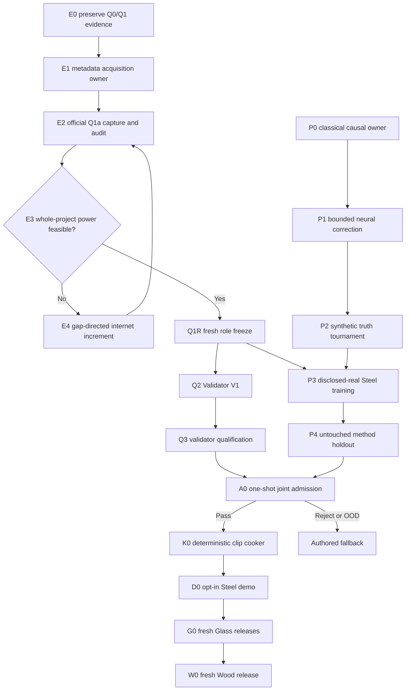

# Roadmap V30: autonomous evidence-to-clip physical sound

| Field | Value |
| --- | --- |
| Rebaseline date | `2026-09-02` |
| Status | `ADOPTED / Q1A_OWNER_COMPLETE / Q1A_CAPTURE_PENDING / Q1M_SOURCE_POWER_OOD / VALIDATOR_FIRST / PHYSICS_LOCKED_ML / INTERNET_ONLY / NO_PER_SOUND_HUMAN_REVIEW / CLIP_FALLBACK / RUNTIME_ML_NOT_AUTHORIZED` |
| Replaces | [Roadmap V29](physical-sound-synthesis-roadmap-v29.md) as planning authority; V29 evidence, thresholds, role-order rules and stop conditions remain immutable |
| Current evidence | [Q1-M result](../development/physical-sound-v29-q1m-metal-role-power-result-2026-09-02.md), [Q1a protocol](../development/physical-sound-v29-q1a-metal-source-growth-protocol-2026-09-02.md), [Q1a acquisition control](../development/physical-sound-v29-q1a-acquisition-control-result-2026-09-02.md) |
| Architecture | [SPEC-45](../architecture/45-physical-sound-synthesis-and-acoustic-presentation.md), `Proposed`; authored clips and deterministic gameplay acoustic facts remain authoritative |
| Product-owner constraint | Evidence comes from the internet. The user records no impacts and is not a per-sound validator. |

## Destination

Deliver one autonomous Steel-impact authoring vertical:

1. discover and freeze enough independent published evidence;
2. qualify a validator that can reject implausible, physically inconsistent and
   out-of-domain sounds without asking the user;
3. train one physics-locked ML correction around a classical modal renderer;
4. open an untouched joint shadow once;
5. on `Pass`, cook an ordinary deterministic 48 kHz clip and play it in the
   demo; on any reject, missing evidence or tool failure, keep the authored
   fallback.

This roadmap is complete only when the same machinery can start a fresh Glass
release for thin goblet, bottle and thick jar without inheriting Steel roles or
thresholds. Runtime synthesis, runtime learning and generated gameplay facts
are not part of this roadmap.

## What changed after V29

V29 established the correct architecture but treated source growth as one
step. Q1-M and the Q1a research showed that source acquisition is itself a
first-class, testable subsystem:

- aggregate sample count is not enough; whole publisher/project revisions must
  populate disjoint roles;
- exact `Steel` cannot be replaced by generic Metal, Iron, Aluminium or
  qualified Stainless/Carbon/Galvanized Steel;
- candidate discovery, metadata capture, role-power planning and protected
  payload opening are separate transitions;
- a provider timeout must yield no partial corpus and no eligibility claim;
- more examples of the same vessel do not repair project concentration.

V30 therefore adds an evidence-factory phase before Validator V1 and makes its
gap planner authoritative for the next internet search increment.

## Non-negotiable invariants

1. **Roles before signals.** Metadata fixes identity, grouping, exposure and
   one-use roles before protected audio/features open.
2. **Projects are the independence unit.** Files and recordings from one
   publisher/project revision cannot be split across protected roles.
3. **Validator and generator are independent.** They share public contracts,
   never training data, role labels, thresholds, features or checkpoints.
4. **Physics owns causal scaling.** ML may correct damping, radiation and modal
   participation inside frozen bounds; it may not freely rewrite mode scaling
   or generate an unconstrained final waveform for admission.
5. **Abstention is a valid terminal result.** Unsupported evidence returns
   `FallbackOutOfDomain`, not a human-review queue.
6. **One-use evidence stays one-use.** Holdouts and the joint shadow never tune
   a model, threshold, source list or mutation.
7. **The engine stays deterministic.** Only cooked clips enter the existing
   content/presentation path. Gameplay correctness and NPC hearing never
   depend on a model, network or audio device.

## Dependency graph



The evidence/validator lane and synthetic generator lane run independently.
They join only after a fresh role freeze and a known-truth generator pass.

## Milestones and exit criteria

| ID | Work package | Current state | Exit criterion |
| --- | --- | --- | --- |
| E0 | Preserve Q0-M/Q1-M | `COMPLETE / REPEAT_EXACT / ZERO_SIGNAL` | The 109 existing identities, historical Glass exclusions and Q1-M OOD result reproduce without role or protected-signal access. |
| E1 | Metadata acquisition owner | `COMPLETE / COMMIT_0c07a943` | The checked-in Q1a owner rejects identity/license/material conflicts, repository exposure, hashes/symlinks/output replacement and any signal counter; focused Q0/Q1/Q1a tests pass. |
| E2 | Official Q1a capture and audit | `PENDING_PROVIDER_COOLDOWN / NO_ARTIFACT` | One atomic external capture binds every frozen HTML URL and remains zero-signal. Offline audit A/B is recursively byte-identical. No raw page enters Git. |
| E3 | Whole-project power planner | `IMPLEMENTED / RESULT_PENDING_E2` | Report both raw floors and an exhaustive whole-project partition. A raw aggregate pass cannot hide a protected-role deficit. |
| E4 | Gap-directed source growth | `CONDITIONAL` | If E3 is OOD, search only the exact best-frontier deficits. Prefer a new multi-object project carrying both exact Steel and non-Metal groups; add no redundant same-project recordings merely to inflate counts. |
| Q1R | Fresh Metal role freeze | `BLOCKED_BY_E3_FEASIBLE` | At least nine independent role-capable project revisions exist; each protected role receives at least two projects, 16 exact-Steel positive groups and 35 non-Metal reject parents, while at least five projects remain for unprotected roles. Current exposure is complete and every role freezes before signal access. |
| Q2 | Independent Validator V1 | `BLOCKED_BY_Q1R` | One external CLI combines hard PCM/provenance checks, physical-time and spectral specialists, a hash-pinned frozen BEATs candidate and an explicit grouped OOD/risk owner. CLAP remains report-only. |
| Q3 | Validator qualification | `BLOCKED_BY_Q2` | Calibration-only choices produce a grouped 95% false-pass upper bound `<= 0.10` and useful-coverage lower bound `>= 0.80` on untouched project/object-disjoint holdout; mutations and leave-project-out checks pass twice exactly. |
| P0 | Classical causal owner | `NEXT_PARALLEL` | Freeze geometry/material/contact/support inputs, modal control, deterministic renderer, remesh pairs, physical interventions and a complete-entry resource owner before values. |
| P1 | Bounded neural correction | `BLOCKED_BY_P0` | Freeze one CPU-feasible family that may correct frequency-dependent damping, radiation and contact-conditioned modal participation only within declared bounds. Classical output remains exact fallback. |
| P2 | Synthetic known-truth tournament | `BLOCKED_BY_P1` | The neural candidate and classical/retrieval/ridge controls repeat exactly. Decay, remesh and isolated Young's-modulus, density, thickness and scale gates all pass before real PCM opens. |
| P3 | Disclosed-real Steel training | `BLOCKED_BY_P2_AND_Q1R` | Train one frozen candidate on generator-only roles with exact published axes. Validator roles, code, thresholds and outputs remain inaccessible. |
| P4 | Generator method holdout | `BLOCKED_BY_P3` | One unopened project/object-disjoint holdout opens once. The candidate beats the frozen classical inverse-fit and retrieval controls on preregistered causal and acoustic metrics, or the release closes. |
| A0 | Joint admission | `BLOCKED_BY_Q3_AND_P4` | Freeze generator, validator and cooker-preprofile hashes, then open one joint shadow once. Conjunction of hard physics, acoustic, risk, coverage and OOD gates yields `Pass`, `Reject` or `FallbackOutOfDomain`. |
| K0 | Deterministic clip cooker | `BLOCKED_BY_A0_PASS` | The accepted record cooks twice to byte-identical bounded 48 kHz PCM with provenance. Invalid, stale, oversized or OOD input publishes nothing. |
| D0 | Opt-in Steel demo | `BLOCKED_BY_K0` | One demo prop uses the cooked clip through the current presentation path. Feature-off, missing/corrupt clip and audio-device failure preserve roots and authored fallback. |
| G0 | Glass program | `AFTER_D0 / THREE_FRESH_RELEASES` | Thin goblet, bottle and thick jar each receive independent source power, roles, validator qualification, generator holdout and one-shot admission. No Steel threshold is inherited. |
| W0 | Wood program | `AFTER_G0 / FRESH_RELEASE` | Wood species/object/support evidence and admission pass independently; current Wood sound remains baseline and fallback. |
| R0 | Product promotion | `POST_RESEARCH / ADR_REQUIRED` | A real consumer, Linux cost evidence and enabled/disabled/fault non-regression justify an Accepted ADR and SPEC-45 ProductChecks. Roadmap completion alone grants no runtime/public-contract status. |

## The automatic validator

Validator V1 is a conjunction, not a single aesthetic score:

| Layer | What it rejects |
| --- | --- |
| Integrity/provenance | Non-canonical PCM, clipping, DC, invalid duration/bandwidth, missing or stale source/model identity |
| Physical time | Wrong onset, energy injection, impossible decay order, frozen/repeated carrier, excitation-order or gain-monotonicity violations |
| Spectral/material | Modal instability, bandwidth-starved noise, wrong material family and retrieval-copy shortcuts |
| Frozen representation | A hash-pinned real-audio embedding plus calibration-only head; no generator features or text prompt decides admission |
| Grouped risk/OOD | Project concentration, source disagreement, leave-project-out failure and unsupported object/support/listener domains |

Every mandatory layer must pass. A hard defect is `Reject`; insufficient support
or confidence is `FallbackOutOfDomain`. Optional human listening is a showcase
tool only and cannot create or overturn a release certificate.

## Generator contract

The generator is deliberately hybrid:

```text
mesh + material + contact + support
  -> classical modes and causal scaling
  -> bounded learned damping/radiation/participation corrections
  -> deterministic offline renderer
  -> independent validator
  -> accepted clip or authored fallback
```

This avoids repeating V28's failure, where output-space metrics improved while
decay, remesh consistency and all physical interventions failed. A future
waveform or codec model is admissible only under a fresh protocol that preserves
the same known-truth, independence and fallback gates.

## Evidence store

Git contains profiles, code, compact reports and planning decisions. External
content-addressed storage contains source HTML/audio, datasets, features,
checkpoints, generated audio and captures. The durable database grows through
immutable records:

1. `SourceEvidence` — source URL/revision/hash, license/provenance and declared
   object/material/action/support axes;
2. `RoleFreeze` — project/object groups and one-use roles without signal fields;
3. `GeneratorRelease` — model/control/resource hashes and exact supported domain;
4. `ValidatorRelease` — specialists, embeddings, thresholds, mutations and risk;
5. `AdmissionRecord` — one generator, one validator, one shadow, one decision;
6. `CookReceipt` — accepted hashes, deterministic PCM and exact fallback.

This is the machine-readable “base of how things should sound”: bounded domain
claims and reproducible failures, not one mutable universal formula table.

## Stop and fallback rules

- Do not lower exact-Steel, `16/35`, project-diversity, risk or coverage gates
  because internet acquisition or a provider is inconvenient.
- Do not count Stainless Steel, Carbon Steel, generic Metal, Iron or Aluminium
  as exact Steel positives; title/description conflicts are exclusions.
- Do not decode a protected payload before Q1R freezes all roles.
- Do not let validator holdout, generator holdout or joint shadow choose a
  threshold, checkpoint, architecture, mutation or source.
- Do not retry V28 M0c or select a nearby model from its opened failures.
- Do not ask the user to record impacts or approve sounds individually.
- Provider/network failure produces no partial corpus and no material claim.
- Any missing certificate keeps the authored clip and blocks runtime promotion.

## Immediate queue and commit boundaries

1. **E2:** after provider cooldown, run one fresh atomic Q1a capture, offline
   audit A/B and recursive comparison; commit only the compact result.
2. **E4 or Q1R:** if partition is OOD, publish the exact frontier deficits and
   add the smallest independent internet project increment. If feasible, rerun
   Q1-M unchanged and freeze roles before any PCM access.
3. **P0 in parallel:** freeze the classical modal control, physical
   counterfactual fixtures and complete-entry CPU resource owner.
4. **Q2/Q3:** implement and qualify Validator V1 only after Q1R; failure is a
   terminal validator release, not a threshold-tuning loop.
5. **P1/P2:** freeze one bounded hybrid family and require known-truth pass
   before disclosed-real training.
6. **P3/P4/A0:** train, open method holdout once, then joint shadow once.
7. **K0/D0:** cook ordinary clips and prove opt-in/fault fallback in the demo.
8. **G0/W0:** repeat the complete evidence/validator/generator/admission cycle
   per material domain rather than inheriting Steel assumptions.

Each implementation boundary receives focused tests; source/role boundaries
receive identity, exposure, power and zero-signal audits; cooker/demo boundaries
receive the affected content/play ProductChecks. No dataset, capture, audio,
checkpoint or generated artifact is committed.
