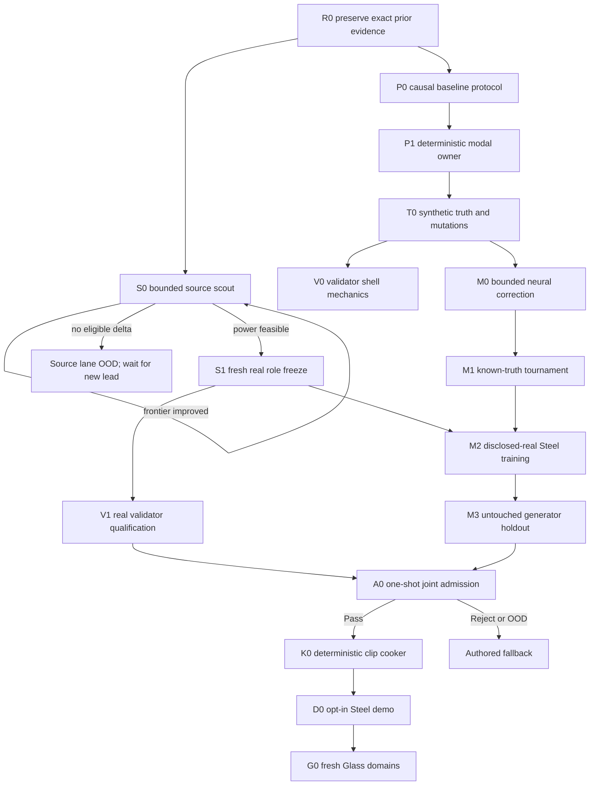

# Roadmap V31: convergent physical-sound learning program

| Field | Value |
| --- | --- |
| Rebaseline date | `2026-09-02` |
| Status | `ADOPTED / P0_P1_COMPLETE / T0_TRUTH_NEXT / BOUNDED_SOURCE_SCOUTING / SYNTHETIC_VALIDATOR_MECHANICS_ALLOWED / REAL_ADMISSION_BLOCKED_BY_SOURCE_POWER / OFFLINE_ML_ONLY / NO_PER_SOUND_HUMAN_REVIEW / AUTHORED_FALLBACK` |
| Replaces | [Roadmap V30](physical-sound-synthesis-roadmap-v30.md) as planning authority; V30 source identities, power thresholds, role isolation and exact E2/E3 result remain immutable |
| Current evidence | [V30 E2 source-growth result](../development/physical-sound-v30-e2-q1a-source-growth-result-2026-09-02.md), [V28 R2 representation result](../development/physical-sound-v28-r2-official-feasibility-result-2026-09-02.md), [V18 B0 classical baseline](../development/physical-sound-v18-b0-deterministic-global-baseline-result-2026-09-01.md) |
| Architecture | [SPEC-45](../architecture/45-physical-sound-synthesis-and-acoustic-presentation.md), `Proposed`; authored clips and deterministic gameplay acoustic facts remain authoritative |
| Product-owner constraint | All evidence is internet-sourced. The user records no impacts and is not a release validator. |

## Destination

Produce one independently admitted Steel-impact research release from:

```text
geometry + material + contact + support
  -> deterministic classical modal renderer
  -> bounded learned correction
  -> independent automatic validator
  -> deterministic ordinary clip or authored fallback
```

The release is useful only if the same machinery can begin three fresh Glass
domains—thin goblet, bottle and thick jar—without inheriting Steel data,
thresholds or checkpoints. Runtime synthesis, runtime learning and generated
gameplay facts are outside this roadmap.

## Why V31 replaces V30

V30 correctly separated evidence, generator, validator, admission and cooking.
Its E2 run also exposed a scheduling problem: a rare real-data partition can
leave every other independently testable component waiting on internet source
availability. Repeating broad searches does not improve the measured frontier
and can become indefinite work.

V31 preserves the exact real-evidence gate but changes execution order:

1. source discovery becomes a bounded, resumable acquisition lane;
2. classical physics, synthetic truth, validator mechanics and bounded ML can
   advance without claiming real quality;
3. real calibration and admission remain sealed until source power is feasible;
4. every stage terminates with `Pass`, `Reject` or `OutOfDomain`, never an
   unbounded tuning loop or a request for the user to approve individual clips.

This is not a relaxation. It distinguishes useful implementation progress from
the stronger claim that a generated sound is safe to ship.

## Immutable boundaries

1. **Physics owns causal structure.** Geometry, scale, thickness, density,
   Young's modulus, contact and support determine the classical modes and
   intervention direction. ML cannot bypass or freely rewrite them.
2. **Learning is a bounded correction.** The first model may adjust
   frequency-dependent damping, radiation and contact-conditioned modal
   participation only inside frozen bounds. Classical output is always valid.
3. **Validator and generator stay independent.** They share record formats,
   never training groups, features, thresholds, checkpoints or opened roles.
4. **Roles precede signals.** Project/object identity, license, material,
   exposure and one-use roles freeze before protected audio or features open.
5. **Real claims require real power.** Synthetic truth can qualify mechanics,
   mutations and causal behavior; it cannot certify material naturalness.
6. **The engine consumes clips.** Only a hash-bound offline cooker may publish
   bounded 48 kHz PCM through the existing content/presentation path.
7. **Fallback is a success state.** Missing evidence, unsupported geometry,
   validator disagreement or any failed certificate returns authored audio.

## Work planes

| Plane | Authority | Can prove | Cannot prove |
| --- | --- | --- | --- |
| Evidence | Immutable source/project/object records and role freezes | Provenance, exact labels, independence and statistical power | Acoustic quality |
| Truth | Analytic and deterministic simulated interventions | Causal direction, scaling, remesh and mutation observability | Real Steel naturalness |
| Generator | Classical renderer plus bounded learned correction | Repeatable candidate behavior inside a declared domain | Admission |
| Validator | Independent hard, physical, spectral and grouped-risk specialists | Bounded reject/coverage behavior after real qualification | Generator correctness by construction |
| Product | Admission record, cooker and fallback | Reproducible clip publication and fault-safe demo use | Runtime ML promotion |

## Dependency graph



The source lane may pause at OOD while P0–M1 continue. S1, V1, M2 and every
real release claim remain blocked until the unchanged source-power gate passes.

## Milestones and exit criteria

| ID | Work package | State | Exit criterion |
| --- | --- | --- | --- |
| R0 | Preserve evidence | `COMPLETE` | V28 R2, Q0/Q1 and V30 E2/E3 identities reproduce; protected signal counters remain zero. |
| S0 | Bounded source scout | `OPEN / FRONTIER_6_STEEL_27_NON_METAL` | Each batch examines at most three concrete primary-source leads and publishes exactly one outcome: `Feasible`, `ImprovedFrontier` or `NoEligibleDelta`. It never opens payloads. |
| S1 | Fresh Steel role freeze | `BLOCKED_BY_S0_FEASIBLE` | Two disjoint protected roles each receive at least two projects, 16 exact-Steel groups and 35 non-Metal reject parents while at least five projects remain for other one-use roles. |
| P0 | Causal baseline protocol | [`COMPLETE / REPEAT_EXACT_ZERO_SIGNAL`](../development/physical-sound-v31-p0-causal-baseline-result-2026-09-02.md) | Geometry/material/contact/support inputs, modal output, resource limits, deterministic numeric profile and isolated `E`, density, thickness, scale, impulse, contact and support interventions are frozen before solver values. |
| P1 | Deterministic modal owner | [`COMPLETE / REPEAT_EXACT_PASS`](../development/physical-sound-v31-p1-deterministic-modal-owner-result-2026-09-02.md) | Two 56-file executions are byte-identical; analytic plate/beam controls, nine remesh pairs, energy bounds and all seven isolated interventions pass. Six unsupported probes return typed authored fallback. |
| T0 | Truth and mutation library | `NEXT` | Freeze clean causal cases plus wrong-decay, frozen-carrier, shuffled-envelope, mode-collapse, spectral-copy, clipping and provenance mutations with exact expected validator outcomes. |
| V0 | Validator shell | `BLOCKED_BY_T0` | One external CLI implements canonical PCM/provenance checks, physical-time and spectral specialists, deterministic feature caching, abstention and mutation coverage. Learned real thresholds remain unset. |
| M0 | Bounded correction protocol | `BLOCKED_BY_T0` | Freeze one CPU-feasible model family, parameter bounds, losses, control baselines, complete-entry smoke and resource oracle before training values. No free waveform decoder. |
| M1 | Known-truth tournament | `BLOCKED_BY_M0` | Candidate and classical/ridge/retrieval controls repeat exactly; candidate must improve a preregistered aggregate while all causal, remesh, decay, energy, resource and mutation gates pass. Otherwise the family closes. |
| V1 | Real validator qualification | `BLOCKED_BY_S1` | Calibration-only choices achieve grouped 95% false-pass upper bound `<= 0.10` and useful-coverage lower bound `>= 0.80` on untouched project/object-disjoint roles; leave-project-out and mutation checks pass twice. |
| M2 | Disclosed-real Steel training | `BLOCKED_BY_M1_AND_S1` | Train one frozen candidate only on generator roles and declared axes. Validator data, features, thresholds and outputs remain inaccessible. |
| M3 | Generator method holdout | `BLOCKED_BY_M2` | One unopened project/object-disjoint holdout opens once. Candidate beats frozen classical inverse-fit and retrieval controls on preregistered causal and acoustic metrics or closes. |
| A0 | Joint admission | `BLOCKED_BY_V1_AND_M3` | Frozen generator, validator and cooker preprofile open one joint shadow once. Conjunction returns `Pass`, `Reject` or `FallbackOutOfDomain`; no post-shadow tuning. |
| K0 | Deterministic cooker | `BLOCKED_BY_A0_PASS` | Accepted record cooks twice to byte-identical bounded 48 kHz PCM with complete provenance; stale, invalid or OOD inputs publish nothing. |
| D0 | Opt-in Steel demo | `BLOCKED_BY_K0` | One prop plays the cooked clip through the existing presentation path; feature-off, corruption and audio-device failure preserve authored fallback and all required roots. |
| G0 | Glass generalization | `AFTER_D0` | Thin goblet, bottle and thick jar each repeat S0–A0 with fresh sources, roles, thresholds and admission. Steel evidence grants no Glass quality credit. |
| W0 | Wood generalization | `AFTER_G0` | One declared species/object/support domain repeats the complete release cycle; the current Wood clip remains baseline/fallback. |
| PR | Product promotion | `ADR_REQUIRED_AFTER_CONSUMER` | A concrete consumer plus Linux cost, enabled/disabled/fault and affected ProductChecks justify an Accepted ADR. Research completion alone cannot promote SPEC-45. |

## The first model

The first learnable candidate is intentionally small. Given frozen classical
modes, it predicts bounded corrections such as:

```text
damping_multiplier(mode, material, support)
radiation_gain(mode, geometry_summary, listener_condition)
participation_delta(mode, contact, striker)
```

It does not predict unconstrained frequencies or final PCM. This makes every
physical counterfactual mechanically observable and preserves a useful
classical result if the model is absent, OOD or rejected.

Escalation to a mesh-spectral network is allowed only if M1 rejects the compact
family while P1/T0 controls pass. An end-to-end waveform or codec model needs a
new roadmap because current evidence cannot prevent it from hiding the causal
failures already observed in V28.

## The automatic validator

Validator admission is a conjunction:

| Layer | Mandatory behavior |
| --- | --- |
| Integrity | Reject non-canonical PCM, clipping, DC, invalid duration/bandwidth, missing hashes and stale lineage. |
| Physical time | Reject wrong onset, energy injection, impossible decay order, repeated carriers and non-monotonic excitation response. |
| Spectral/material | Reject modal collapse/instability, bandwidth-starved output and retrieval-copy shortcuts. |
| Frozen representation | Use a hash-pinned real-audio encoder only after S1; text prompts and CLAP remain diagnostic. |
| Grouped risk/OOD | Report project concentration, leave-project-out behavior and unsupported object/support/listener domains; disagreement abstains. |

V0 can prove implementation and mutation detection on T0. Only V1 may attach a
real false-pass/coverage certificate. Optional listening can guide product
discussion but cannot create, overturn or repair an admission record.

## Evidence and experiment store

Git stores code, profiles, compact manifests, schema documentation and exact
result summaries. External content-addressed storage keeps source pages/audio,
datasets, features, checkpoints, waveforms and captures. The durable record set
grows append-only:

1. `SourceEvidence` — URL/revision/hash, license, object/material/action axes;
2. `SourceFrontier` — exact deficits, exclusions and next eligible lead class;
3. `RoleFreeze` — whole-project/object assignments and exposure ledger;
4. `TruthRelease` — analytic cases, interventions and mutation expectations;
5. `GeneratorRelease` — model/control/resource hashes and supported domain;
6. `ValidatorRelease` — specialists, features, thresholds, mutations and risk;
7. `AdmissionRecord` — frozen generator, validator, shadow and decision;
8. `CookReceipt` — accepted inputs, deterministic PCM and fallback identity.

This is the evolving “database of how things should sound”: exact bounded
claims and reproducible counterexamples, not one universal mutable formula or
one neural checkpoint trusted for every material.

## Bounded source policy

- A scout batch starts only from a concrete primary-source lead, not a broad
  request to “find more sounds”, and contains at most three candidate projects.
- Exact Steel means unqualified `Steel`. Stainless, Carbon, galvanized, Iron,
  Aluminium and generic Metal do not count as exact-Steel positives.
- The protected-role independence unit is a publisher/project revision. Within
  a project, each stable physical object counts once; repeated recordings do
  not create new parents.
- Unknown or incompatible redistribution terms exclude payload use. Metadata
  may still support an explicit exclusion record.
- A network/provider failure yields no partial capture or source credit.
- `NoEligibleDelta` pauses source work without weakening S1. New published
  evidence can resume the lane under the same gate.

## Execution order and commit boundaries

1. **P0 protocol — complete:** the causal owner contract, intervention suite
   and CPU/resource envelope are frozen with zero audio/model/solver values.
2. **P1 owner — complete:** deterministic modes/rendering, typed fallback,
   complete-entry and remesh controls pass twice exactly.
3. **T0 truth — next:** add causal fixtures and adversarial audio mutations with exact
   expected outcomes.
4. **V0 shell:** implement hard/physical/spectral validation and OOD reporting
   without pretending synthetic thresholds are real calibration.
5. **M0/M1:** preregister one bounded correction, run complete-entry/resource
   controls, then a single known-truth tournament.
6. **S0 batches:** in parallel with the above boundaries, audit at most three
   concrete new source leads per batch; rerun the unchanged partition planner
   only when a candidate improves the exact frontier.
7. **S1/V1:** when real power is feasible, freeze roles before signals and
   qualify the independent validator exactly once.
8. **M2/M3/A0:** train on disclosed roles, open one method holdout, then one
   joint shadow. Any reject closes that release rather than selecting a retry.
9. **K0/D0:** cook an ordinary clip and prove opt-in/fault fallback in the demo.
10. **G0/W0:** repeat the complete evidence-to-admission loop per material.

The immediate next commit is T0, not another open-ended source crawl. A newly
published high-value source may interrupt only at an S0 commit boundary; it
cannot alter P0/T0/M0 values or any previously frozen role.

## Verification policy

- Documentation boundaries: `git diff --check` plus direct link/path checks.
- External registry/validator tooling: focused tests and the SPEC-45 boundary
  scan; no ProductCheck credit while the feature remains external/Proposed.
- Content cooker: focused tests plus `content-package`.
- Demo presentation: affected `play` checks and enabled/disabled/fault cases.
- Runtime or public-contract promotion: separate Accepted ADR, affected SPECs
  and the routing-table/ProductCheck update required by repository policy.

No dataset, capture, protected audio, checkpoint, generated waveform or cache
enters Git.
