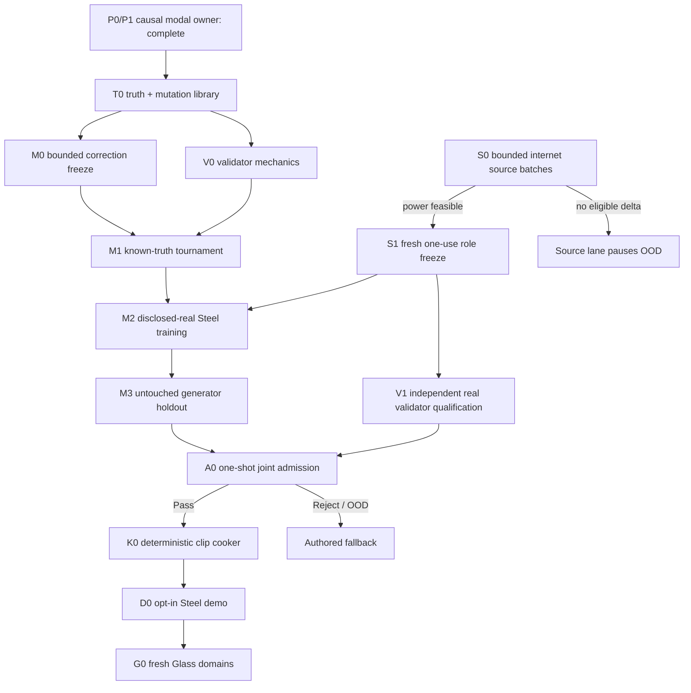

# Roadmap V32: autonomous physical-sound validation and ML delivery

| Field | Value |
| --- | --- |
| Rebaseline date | `2026-09-02` |
| Status | `ADOPTED / P0_P1_T0_V0A_COMPLETE / V0_V1_REJECT_PRESERVED / M0_PROTOCOL_NEXT / VALIDATOR_FIRST / BOUNDED_SOURCE_SCOUTING / REAL_RELEASE_BLOCKED_BY_SOURCE_POWER / OFFLINE_ML_ONLY / NO_PER_SOUND_HUMAN_REVIEW / AUTHORED_FALLBACK` |
| Replaces | [Roadmap V31](physical-sound-synthesis-roadmap-v31.md) as planning authority; V31/V30 evidence identities, source-power thresholds, one-use roles and closed experiment families remain immutable |
| Current implementation | [P0 causal baseline](../development/physical-sound-v31-p0-causal-baseline-result-2026-09-02.md), [P1 deterministic modal owner](../development/physical-sound-v31-p1-deterministic-modal-owner-result-2026-09-02.md) and [T0 truth/mutation release](../development/physical-sound-v32-t0-truth-mutation-result-2026-09-02.md) |
| Current real-data frontier | [V30 E2 source-growth result](../development/physical-sound-v30-e2-q1a-source-growth-result-2026-09-02.md): the weaker protected role remains short by six exact-Steel and 27 non-Metal groups |
| Architecture | [SPEC-45](../architecture/45-physical-sound-synthesis-and-acoustic-presentation.md), `Proposed`; authored clips and deterministic gameplay acoustic facts remain authoritative |
| Product-owner constraint | Evidence is internet-sourced. The user records no impacts and does not validate individual sounds. |

## Outcome

Build one external, automatic release machine for impact sounds:

```text
geometry + acoustic material + contact + support
  -> deterministic classical modal owner
  -> bounded learned correction
  -> independent automatic validator
  -> one admission decision
  -> deterministic ordinary clip or authored fallback
```

The first admitted target is one declared Steel impact domain. Success then
means that thin goblet, bottle and thick-jar Glass domains can enter the same
process with fresh evidence, thresholds and releases—not that Steel grants a
generic “glass-like” checkpoint.

The pipeline terminates every case as `Pass`, `Reject` or `OutOfDomain` without
asking a person to listen. Optional listening is product feedback only and
cannot create, override or repair a certificate.

## Why V32 replaces V31

V31 established the convergent architecture and completed its first two
owners. V32 turns the remaining research graph into an executable delivery
sequence with explicit artifacts, automatic decision owners and stop rules:

1. P0/P1 are retained as completed prerequisites rather than reopened;
2. synthetic truth qualifies validator mechanics before any new ML values;
3. one bounded model family competes against classical and shortcut controls;
4. source acquisition is a separate, resumable lane with a fixed batch budget;
5. real validator calibration, real training and admission join only after the
   unchanged source-power gate becomes feasible;
6. every failed gate has one deterministic consequence: close the candidate or
   use the authored fallback, never tune against the failed evidence.

V32 changes planning order and deliverables only. It does not promote a public
schema, runtime model, content role or production physical-sound contract.

## Fixed boundaries

1. **Classical physics owns causality.** Geometry, scale, thickness, density,
   Young's modulus, contact, impulse, support and pickup own modal structure and
   intervention direction. ML cannot replace this owner.
2. **Acoustic material is independent.** Elastic/acoustic parameters never
   reuse or reinterpret PhysX friction, restitution or material lineage.
3. **The first model is a bounded correction.** At one canonical listener it
   may correct damping, object-global modal gain and contact-conditioned modal
   participation inside frozen limits. It does not emit free waveform samples,
   unconstrained frequencies or a learned listener/radiation field.
4. **Generator and validator are independent.** They may share canonical
   record syntax, but not training groups, learned features, thresholds,
   checkpoints or protected roles.
5. **Synthetic evidence is mechanics-only.** It can prove deterministic
   causality and mutation detection, never real Steel or Glass naturalness.
6. **Real claims require independent internet evidence.** Project/object roles
   freeze before protected audio, features or model values open.
7. **Runtime consumes ordinary clips.** Training, validation and model
   inference remain external/offline. The cooker publishes bounded 48 kHz PCM.
8. **Fallback is complete behavior.** Missing evidence, invalid lineage,
   unsupported geometry, OOD or validator disagreement selects the authored
   clip without changing gameplay facts.

## Automatic owners

| Owner | Input | Output | Authority |
| --- | --- | --- | --- |
| `ModalOwner` | Frozen geometry/material/contact/support case | Modes, decay, gains and deterministic PCM | Synthetic causal reference only |
| `TruthBuilder` | P1 cases plus frozen corruptions | Clean and adversarial records with expected outcomes | Validator-mechanics truth only |
| `Validator` | Candidate record and a frozen validator release | `Pass`, `Reject(reason[])` or `OutOfDomain(reason[])` | Release authority only after V1 real qualification |
| `Trainer` | Disclosed generator roles and frozen correction protocol | One immutable candidate plus controls | No admission authority |
| `AdmissionRunner` | Frozen generator, validator and one untouched shadow | One immutable admission decision | First real release decision |
| `ClipCooker` | Passing admission record and bounded render request | Byte-identical PCM plus receipt | Presentation artifact publication only |

All owner records are canonical, hash-bound and atomically published. Git keeps
code, profiles and compact result summaries. Source payloads, datasets,
features, checkpoints, generated WAVs and caches remain in external
content-addressed storage.

## Critical path



T0–M1 do not wait for source discovery, but they earn no real-quality credit.
S1, V1, M2, M3, A0 and every release claim remain blocked until source power
passes exactly.

## Milestones

| ID | Deliverable | State | Exit criterion |
| --- | --- | --- | --- |
| F0 | Deterministic causal foundation | `COMPLETE` | P0/P1 repeat byte-exactly; plate/beam controls, nine remesh pairs, energy bounds, seven interventions and six typed fallbacks pass with zero signal/model/network access. |
| T0 | Truth and mutation release | [`COMPLETE / REPEAT_EXACT_PASS`](../development/physical-sound-v32-t0-truth-mutation-result-2026-09-02.md) | Nine clean P1 cases and seven frozen corruptions—wrong decay, frozen carrier, shuffled envelope, mode collapse, spectral copy, clipping and provenance mismatch—publish exact expected outcomes twice byte-identically. |
| V0 | Validator mechanics release | [`COMPLETE / V0A_REPEAT_EXACT_PASS`](../development/physical-sound-v32-v0a-modal-equivalence-validator-result-2026-09-02.md) | V0a publishes exact `9 Pass / 7 Reject`, passes lawful modal aliases, retains plate→beam retrieval rejection, canonicalizes cache/OOD and repeats exactly. It carries no real threshold or material-quality claim. |
| M0 | Bounded correction protocol | `PROTOCOL_NEXT / UNBLOCKED_BY_V0A` | Freeze one CPU-feasible family, parameter bounds, losses, classical/ridge/retrieval controls, full-owner smoke and resource envelope before model values open. |
| M1 | Known-truth tournament | `BLOCKED_BY_M0` | One candidate run improves the preregistered aggregate over every control while all causal, remesh, decay, energy, resource, determinism and mutation gates pass. A reject closes the family. |
| S0 | Bounded source growth | `OPEN / FRONTIER_6_STEEL_27_NON_METAL` | Each batch audits at most three concrete primary-source leads without opening signal and returns `Feasible`, `ImprovedFrontier` or `NoEligibleDelta`. |
| S1 | Fresh protected-role freeze | `BLOCKED_BY_S0_FEASIBLE` | Two disjoint protected roles each have at least two projects, 16 exact-Steel groups and 35 non-Metal reject parents, with at least five projects reserved for other one-use roles. |
| V1 | Real validator qualification | `BLOCKED_BY_S1_AND_V0` | Frozen calibration choices achieve grouped 95% false-pass upper bound `<= 0.10` and useful-coverage lower bound `>= 0.80` on untouched project/object-disjoint roles; leave-project-out and mutation checks repeat. |
| M2 | Disclosed-real Steel training | `BLOCKED_BY_M1_AND_S1` | Train exactly one frozen candidate on generator roles and declared axes. Validator roles, features, thresholds and outputs remain inaccessible. |
| M3 | Generator holdout | `BLOCKED_BY_M2` | Open one untouched project/object-disjoint holdout once. The candidate beats frozen classical inverse-fit and retrieval controls on preregistered causal and acoustic metrics or closes. |
| A0 | Joint admission | `BLOCKED_BY_V1_AND_M3` | Frozen generator, validator, domain and cooker preprofile open one joint shadow once and return exactly one `Pass`, `Reject` or `FallbackOutOfDomain`; no post-shadow tuning. |
| K0 | Deterministic cooker | `BLOCKED_BY_A0_PASS` | The accepted record cooks twice to byte-identical bounded 48 kHz PCM with complete provenance; stale, invalid and OOD input publishes nothing. |
| D0 | Opt-in Steel demo | `BLOCKED_BY_K0` | One demo prop uses the cooked ordinary clip through the existing presentation path; feature-off, corruption, unsupported case and device failure preserve authored fallback. |
| G0 | Three Glass releases | `AFTER_D0` | Thin goblet, bottle and thick jar each repeat S0–A0 with fresh sources, roles, thresholds and admission. |
| W0 | Wood release | `AFTER_G0` | One declared species/object/support domain repeats the same release cycle; the existing Wood sound remains fallback. |
| PR | Product promotion | `ADR_REQUIRED_AFTER_CONSUMER` | A concrete consumer plus Linux cost and enabled/disabled/fault ProductChecks justify an Accepted ADR. Research completion alone cannot promote SPEC-45. |

## The first ML family

M0 selects the smallest family that can represent the remaining uncertainty:

```text
damping_multiplier(mode, acoustic_material, support)
global_modal_gain_delta(mode, geometry_summary, acoustic_material)
participation_delta(mode, contact, striker)
```

The network receives frozen modal features and outputs bounded corrections.
The classical render stays defined if the model is missing, invalid or OOD.
Model selection compares one neural candidate with at least:

- unchanged P1 classical rendering;
- deterministic ridge on the same disclosed coordinates;
- nearest/retrieval control with group isolation;
- identity/no-correction control.

M1 is a tournament, not an optimization diary. The protocol freezes one
aggregate, hard causal gates and resource limits before values. Failure closes
the compact family. A mesh-spectral successor needs a new preregistered
hypothesis; an end-to-end waveform model needs a new roadmap and architecture
review. A learned listener/radiation field remains a later domain with separate
evidence after the first canonical-listener impact release.

## Validator composition

The validator owns a conjunction, not one opaque “sounds good” score:

| Specialist | Mandatory checks |
| --- | --- |
| Integrity and lineage | Canonical PCM, hashes, parent identities, duration, channels, rate, finite values, clipping, DC and stale artifacts |
| Physical time | Onset, energy injection, excitation monotonicity, decay ordering, frozen/repeated carriers and shuffled envelopes |
| Modal/spectral | Pole stability, modal coverage, bandwidth, collapse and retrieval-copy shortcuts |
| Causal interventions | Expected isolated direction for `E`, density, thickness, scale, impulse, contact and support; remesh invariance |
| Real representation | Hash-pinned real-audio encoder and calibrated thresholds introduced only in V1 after role freeze |
| Grouped risk/OOD | Project concentration, leave-project-out behavior, supported geometry/material/contact/support/listener domain and specialist disagreement |

V0 proves only implementation and mutation coverage. V1 is the first owner
allowed to publish a real false-pass/coverage certificate. Any missing
mandatory specialist or disagreement returns `OutOfDomain`, never a guessed
score.

## Release artifacts

Every stage publishes one compact external research record:

1. `TruthRelease` — parent P1 identity, clean cases, mutations and expected outcomes;
2. `ValidatorRelease` — specialists, feature owners, thresholds, domains, mutation coverage and grouped-risk certificate;
3. `GeneratorRelease` — classical owner, correction model, controls, resource result and supported domain;
4. `AdmissionRecord` — frozen generator/validator/shadow identities and one decision;
5. `CookReceipt` — accepted input, deterministic PCM identity and authored fallback identity.

These are external experimental formats under Proposed SPEC-45, not public
engine schemas. A later production consumer must justify the smallest required
contract through a separate ADR instead of promoting the research envelope.

## Failure and rollback table

| First failure | Required consequence |
| --- | --- |
| T0 cannot express an unambiguous expected mutation result | Repair/freeze truth semantics before writing V0; ML stays blocked. |
| V0 misses a mutation or rejects a clean case | Validator mechanics reject; no threshold tuning and no M1 credit. |
| M0 exceeds the frozen CPU/resource envelope | Candidate family closes as resource-rejected; no quality inference. |
| M1 loses to a control or breaks causality | Learned correction closes; P1 classical owner remains usable research/fallback machinery. |
| S0 returns `NoEligibleDelta` | Pause the source lane until a concrete new primary-source lead exists; do not weaken S1. |
| V1 misses risk or coverage | No real validator release, training admission or cooking. |
| M3 or A0 rejects/OOD | Close that release and select authored fallback; do not tune against the holdout/shadow. |
| K0/D0 fails determinism, integrity or fault behavior | Publish no generated clip and retain the existing authored clip. |

## Ordered implementation queue

1. **V32.1 — freeze T0 — complete:** protocol and canonical profile only; bind exact P0/P1
   owners, nine clean cases, seven mutations, reason codes and A/B requirements.
2. **V32.2 — build T0 — complete:** truth/mutation CLI, focused tests, external A/B
   evidence and compact result; no real signal, network or model access.
3. **V32.3 — freeze V0 — complete:** validator interface, specialist ownership, cache
   identity, abstention and expected T0 decision matrix before thresholds/code.
4. **V32.4 — build V0 — complete through V0a:** V0-v1 target-ID retrieval is
   preserved as a clean false-positive reject; V0a passes the unchanged matrix
   twice with exact modal equivalence and the plate→beam negative control.
5. **V32.5 — freeze M0:** one compact correction family, baselines, losses,
   hard gates and resource oracle before values.
6. **V32.6 — run M1 once:** A/B tournament, immutable result and either family
   closure or permission to await real roles.
7. **V32.S — source batches:** only at coherent boundaries and only for at most
   three named primary-source leads; `NoEligibleDelta` is a valid pause.
8. **V32.7 — join real lanes:** after S1, qualify V1 and train M2 independently;
   then spend one M3 holdout and one A0 shadow.
9. **V32.8 — deliver:** K0 clip cooker, D0 fallback-safe demo, then fresh Glass
   domains and Wood.

V32.1–V32.4 are complete; the immediate next commit freezes M0 before model values. A source lead may interrupt only between
commit boundaries and cannot alter frozen truth, model or validator values.

## Verification policy

- Documentation-only roadmap changes use `git diff --check` and direct
  link/path/ID validation.
- External truth/generator/validator tooling uses focused tests and the
  SPEC-45 boundary scan; it earns no current ProductCheck credit.
- Cooker work additionally runs the affected content-package checks.
- Demo work runs affected `play` checks and explicit enabled/disabled/fault
  fallback cases.
- Public/runtime promotion requires a separate Accepted ADR, affected SPEC and
  routing/ProductCheck updates.

No dataset, protected audio, model checkpoint, generated waveform, capture or
cache enters Git.
