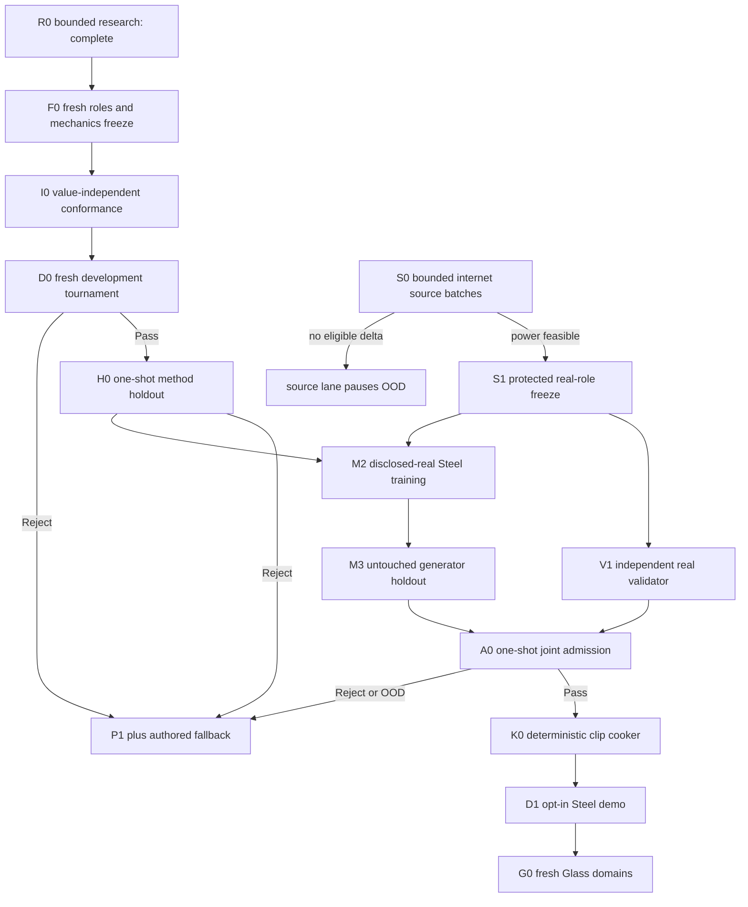

# Roadmap V33: mode-local spectral ML successor

| Field | Value |
| --- | --- |
| Rebaseline date | `2026-09-02` |
| Status | `ADOPTED / R0_COMPLETE / F0_NEXT / V32_M1_FAMILY_CLOSED / FRESH_SYNTHETIC_ROLES_REQUIRED / VALIDATOR_FIRST / BOUNDED_SOURCE_SCOUTING / REAL_RELEASE_BLOCKED / OFFLINE_ML_ONLY / AUTHORED_FALLBACK` |
| Replaces | [Roadmap V32](physical-sound-synthesis-roadmap-v32.md) as planning authority; all V32 evidence, one-use roles, source thresholds and closed-family decisions remain immutable |
| Research basis | [V33 mode-local spectral successor research](../development/physical-sound-v33-mode-local-spectral-successor-research-2026-09-02.md) |
| Trigger evidence | [V32 M1 terminal result](../development/physical-sound-v32-m1-known-truth-tournament-result-2026-09-02.md) |
| Architecture | [SPEC-45](../architecture/45-physical-sound-synthesis-and-acoustic-presentation.md), `Proposed`; no production consumer or promoting ADR |
| Product-owner constraint | Evidence comes from the internet; the user records no impacts and does not validate sounds one by one |

## Outcome

Build an automatic, independently validated physical-impact authoring path in
which classical modal physics owns causality and a small offline model learns
only bounded residual structure that the physics owner does not claim:

```text
geometry/material/contact/support
  -> deterministic P1 modal owner
  -> mode-local spectral residual model
  -> independently qualified real validator
  -> one-shot admission
  -> deterministic 48 kHz clip cooker
  -> ordinary runtime clip or authored fallback
```

V33 first answers one narrow synthetic question left by V32: can a compact
model generalize contact correction across unseen geometry and unseen contact
when its input exposes a fixed surface spectrum and local P1 mode field? It
does not claim that the synthetic answer sounds like Steel, Glass or Wood.

The first real target remains one declared Steel impact domain. After that
single vertical passes independent admission and fallback-safe demo checks,
thin goblet, bottle and thick-jar Glass repeat the complete evidence cycle with
fresh sources, roles and validator releases. Human listening is optional
product feedback, never a release authority.

## Why V33 replaces V32

V32 successfully built the deterministic P1 owner, truth/mutation release,
validator mechanics and a bounded three-head residual tournament. Its M1
candidate passed all hard gates and 13 of 14 metric gates but lost the contact
branch to nearest retrieval at `1.112179x` versus a required `<=0.90x`. That
opened development role closes the compact raw-coordinate family permanently.

V33 changes one hypothesis only: contact requires an explicit surface-spectral
and mode-local representation. It also removes an ambiguity in V32's geometry-
only split by requiring separate geometry-only, contact-only and joint
generalization strata. The source, validator, admission, cooker and product
boundaries are unchanged.

## Immutable boundaries

1. P1 owns frequencies, mode identity/order, contact nodes, pickup sign,
   impulse scaling, support behavior and remesh identity. ML cannot override
   these quantities.
2. The selected candidate changes only contact representation. Decay and
   object-global gain retain the V32 branch decomposition and serve as
   non-regression checks on fresh roles.
3. Acoustic material constants remain independent of PhysX friction,
   restitution and gameplay material lineage.
4. Synthetic evidence qualifies representation and validator mechanics only.
   It supplies no real-material or naturalness claim.
5. Generator and validator never share learned weights, training groups,
   protected roles, features or thresholds.
6. Real project/object roles freeze before protected signal, feature or model
   values open. The unchanged S1 whole-project power floor may not be lowered.
7. Model training and inference are external/offline. Runtime receives an
   ordinary bounded PCM clip through existing presentation paths.
8. Every missing, invalid, stale, unsupported, rejected or OOD case selects an
   authored clip without changing deterministic gameplay acoustic facts.
9. No dataset, protected audio, model/checkpoint, generated WAV or cache enters
   Git. Only profiles, tools and compact evidence summaries are versioned.

## Selected candidate and controls

`mode-local-spectral-residual-v1` preserves V32's branch isolation and bounded
multiplicative composition. Its contact head receives the lawful V32 contact
inputs plus two fixed, deterministic additions:

- a low-order axis-aligned sine/cosine encoding of normalized surface
  coordinates;
- a bounded local stencil sampled from the P1 mode-participation field.

F0 freezes the exact orders, offsets, boundary handling, normalization, width,
parameter count, seed, optimizer, steps and limits before target values. There
is one candidate, not a hyperparameter sweep. SIREN, random Fourier features,
learned embeddings, mesh GNNs, waveform models and acoustic-radiation networks
are outside this roadmap.

Every tournament includes exactly these control classes:

1. unchanged P1 identity/no-correction;
2. group-isolated nearest train row;
3. ridge on raw V32 branch features;
4. ridge on the frozen spectral/mode-local features;
5. the V32 raw-coordinate MLP topology retrained from scratch on fresh roles;
6. the sole V33 spectral/mode-local MLP candidate.

The raw MLP control isolates representation from capacity/optimizer changes.
The spectral ridge control tests whether ML adds value beyond a fixed basis. A
V33 pass requires both distinctions; beating only identity or raw ridge is not
enough.

## Fresh synthetic evidence design

F0 binds new synthetic material constants, geometry multiplier cells and
contact sets disjoint from V32 M1. The truth bank is a new deterministic mix of
P1 modal-field and declared low-order surface components; it cannot copy the
disclosed V32 oracle. Coefficients, role membership and commitments freeze
before candidate execution.

Train, development and method-holdout remain case/group closed. Development
and holdout each report three disjoint case strata:

| Stratum | Geometry | Contact | Question |
| --- | --- | --- | --- |
| `geometry-only` | unseen | seen in train | Can the representation transfer across object dimensions? |
| `contact-only` | seen in train | unseen | Can it interpolate the surface field instead of retrieving a memorized contact? |
| `joint` | unseen | unseen | Does it retain both capabilities together? |

The same family/support types may recur because P1 currently owns only the
frozen plate and two beam controls, but no exact V32 material, multiplier,
contact, target, prediction, weight or optimizer state may enter V33 training
or selection. Method-holdout values remain inaccessible until development
passes in full.

## Critical path



R0–H0 and S0 can progress independently. M2 requires both an H0 pass and S1
source feasibility. V1 depends on S1 and the already completed V0a mechanics,
not on the generator's synthetic score. No downstream stage may reinterpret a
failed upstream role.

## Milestones and exit criteria

| ID | Deliverable | State | Exit criterion |
| --- | --- | --- | --- |
| R0 | Bounded successor research | [`COMPLETE`](../development/physical-sound-v33-mode-local-spectral-successor-research-2026-09-02.md) | Primary prior art, six competing hypotheses, selected smallest candidate, fresh-evidence rule and terminal stop conditions are recorded without opening a new oracle/model value. |
| F0 | Fresh-role and mechanics freeze | `NEXT` | Canonical profile binds new materials/cells/contacts, truth-bank commitment, three strata, exact feature lift/stencil, candidate/controls, seed/training, access order, metrics, A/B semantics and resources before values. |
| I0 | Value-independent owner conformance | `BLOCKED_BY_F0` | Complete owning entry point proves dependency/hash closure, feature dimensions, boundary stencil behavior, parameter count, zero protected access, atomic failure and all P1 invariants on discarded non-official fixtures. |
| D0 | Fresh development tournament | `BLOCKED_BY_I0` | A/B artifacts repeat exactly; every hard gate passes; contact beats raw MLP, nearest and spectral ridge at frozen aggregate and per-stratum bounds; decay/global gain do not regress. Otherwise close before holdout. |
| H0 | One-shot method holdout | `BLOCKED_BY_D0_PASS` | Frozen candidate and controls open the committed holdout once; every branch/stratum and aggregate comparison passes twice exactly with no post-development change. |
| S0 | Bounded internet source growth | `OPEN / FRONTIER_6_STEEL_27_NON_METAL` | Each batch audits at most three named primary-source leads and returns `Feasible`, `ImprovedFrontier` or `NoEligibleDelta` without opening signal. |
| S1 | Protected real-role freeze | `BLOCKED_BY_S0_FEASIBLE` | Both protected roles have at least two projects, 16 exact-Steel groups and 35 non-Metal reject parents, with at least five further projects reserved for other one-use roles. |
| V1 | Real validator qualification | `BLOCKED_BY_S1` | Project/object-disjoint calibration obtains grouped 95% false-pass upper bound `<=0.10` and useful-coverage lower bound `>=0.80`; mutation and leave-project-out checks repeat. |
| M2 | Disclosed-real Steel training | `BLOCKED_BY_H0_AND_S1` | One frozen spectral residual model trains on disclosed generator roles only; validator identities/features/thresholds remain inaccessible. |
| M3 | Generator real holdout | `BLOCKED_BY_M2` | One untouched project/object-disjoint holdout opens once and candidate beats frozen classical/retrieval controls on preregistered causal and acoustic metrics. |
| A0 | Joint admission | `BLOCKED_BY_V1_AND_M3` | Frozen generator, validator, domain and cooker preprofile open one joint shadow once and return `Pass`, `Reject` or `FallbackOutOfDomain`. |
| K0 | Deterministic clip cooker | `BLOCKED_BY_A0_PASS` | Accepted record cooks twice to byte-identical bounded 48 kHz PCM with complete provenance; invalid/OOD input publishes nothing. |
| D1 | Opt-in Steel demo | `BLOCKED_BY_K0` | One demo prop consumes the ordinary cooked clip; feature-off, corruption, unsupported query and device failure preserve the authored fallback. |
| G0 | Thin goblet, bottle and thick jar | `AFTER_D1` | Each Glass domain repeats source power, fresh roles, validator qualification, generator holdout and one-shot admission independently. |
| W0 | Wood domain | `AFTER_G0` | One declared species/object/support domain repeats the same automatic release cycle; current Wood audio remains fallback. |
| PR | Product promotion | `ADR_REQUIRED_AFTER_CONSUMER` | A concrete consumer and Linux enabled/disabled/fault/cost ProductChecks justify the smallest Accepted contract change. |

## D0/H0 decision rules

F0 owns the exact numeric thresholds, but their shape is fixed now:

- candidate contact RMSE must beat raw MLP, nearest and spectral ridge on the
  aggregate role;
- every `geometry-only`, `contact-only` and `joint` contact stratum must beat
  its frozen best-control relative bound and an absolute bound;
- decay/global-gain aggregate and per-branch results must preserve V32's
  physics-locked benefit on the new truth bank;
- material/contact ablations must worsen the branches they are meant to
  observe;
- frequency/order, node zeros, signs, impulse ratios, remesh identity,
  correction bounds, finite output and render peak remain hard gates;
- all artifacts, decisions and stdout repeat byte-exactly inside the resource
  envelope.

If spectral ridge passes but the candidate loses to it, the basis is useful but
the ML family rejects. If the candidate beats raw MLP only on known contacts,
the contact representation rejects. If D0 misses any gate, H0 remains unopened.
If H0 misses, the family closes. No basis order, stencil, seed, capacity, step,
loss or threshold is tuned against D0/H0.

## Failure, rollback and reconsideration

| First failure | Required consequence | Reconsider only when |
| --- | --- | --- |
| F0 cannot define fresh truth without copying V32 | Stop; do not implement a benchmark-specific retry. | A distinct physical truth family and role commitment can be specified before model values. |
| I0 breaks locality, remesh or P1 authority | Repair only value-independent mechanics under F0's explicit allowances; otherwise supersede V33. | Complete owning-entry evidence isolates a non-value semantic defect. |
| D0 spectral ridge and candidate both lose | Reject H1/H2 and close V33 before holdout. | New primary evidence motivates a materially different topology representation and fresh roles. |
| D0 candidate loses only to spectral ridge | Close the neural family; retain ridge as a diagnostic control, not a production release. | Real evidence later demonstrates bounded nonlinear residual need under a new protocol. |
| H0 rejects | Close the candidate and preserve its opened roles as immutable negative evidence. | Never reopen H0; a new family requires a new roadmap and fresh roles. |
| S0 returns `NoEligibleDelta` | Pause source work without weakening S1. | A concrete new primary-source lead exists. |
| V1/M3/A0 rejects or OOD | Publish no release and select authored fallback. | A fresh one-use release cycle under a new preregistered hypothesis. |
| K0/D1 fails integrity, determinism or fault fallback | Publish no generated clip and retain authored audio. | The same exact input passes the affected content/play checks after a scoped implementation fix. |

SIREN is the first named alternative only if V33 supplies evidence that the
fixed lift is expressive but the SiLU head cannot optimize it under a
value-independent capacity control. A mesh/voxel/GNN operator requires a
topology-sensitive failure that P1 local fields cannot represent. Neither is
an automatic V33 retry.

## Ordered implementation queue

1. **V33.0 — complete:** record the M1 failure cluster, primary prior art,
   competing hypotheses, selected small successor and stop rules.
2. **V33.1 — next:** freeze F0 canonical corpus/truth/feature profile without
   materializing train, development or holdout targets.
3. **V33.2:** implement the complete external owner and focused contract probes;
   run I0 only on discarded non-official fixtures.
4. **V33.3:** execute D0 in two fresh CPU processes. On any miss, publish one
   terminal reject and keep H0 at exact zero access.
5. **V33.4:** only after D0 pass, hash-freeze the candidate and spend H0 once;
   publish pass/reject without tuning.
6. **V33.S:** continue source batches only at coherent boundaries, at most three
   named primary-source leads per batch.
7. **V33.5:** after both H0 and S1 pass, qualify V1 independently and execute
   M2/M3, then one A0 shadow.
8. **V33.6:** after A0 pass, build K0/D1; then start three independent Glass
   releases and later Wood.

## Verification policy

- R0/F0 documentation uses `git diff --check` plus direct path, link, ID and
  profile-hash validation.
- External truth/model/validator tooling uses focused tests and the SPEC-45
  boundary scan; it earns no ProductCheck credit.
- K0 additionally runs affected `content-package`; D1 runs affected `play`
  checks including feature-off and fault fallback.
- Public/runtime promotion requires a separate Accepted ADR, affected SPEC and
  routing/ProductCheck updates.

SPEC-45 remains `Proposed`. V33 adds no public schema, content role, runtime
model, production gate or shipped capability.
