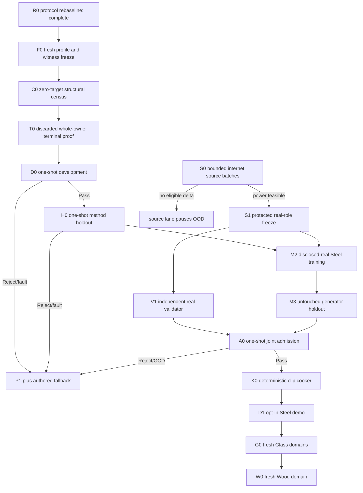

# Roadmap V34: target-safe spectral experiment recovery

| Field | Value |
| --- | --- |
| Rebaseline date | `2026-09-02` |
| Status | `ADOPTED / R0_COMPLETE / F0_NEXT / V33_D0_PROTOCOL_REJECT / FRESH_ROLES_REQUIRED / TARGET_SAFE_PREFLIGHT_FIRST / VALIDATOR_FIRST / REAL_RELEASE_BLOCKED / OFFLINE_ML_ONLY / AUTHORED_FALLBACK` |
| Replaces | [Roadmap V33](physical-sound-synthesis-roadmap-v33.md) as planning authority; V33 roles remain spent/closed and its H0 remains exact zero |
| Research basis | [V34 protocol-closure rebaseline](../development/physical-sound-v34-protocol-closure-rebaseline-2026-09-02.md) |
| Trigger evidence | [V33 D0 terminal contract reject](../development/physical-sound-v33-d0-fresh-development-tournament-result-2026-09-02.md) |
| Architecture | [SPEC-45](../architecture/45-physical-sound-synthesis-and-acoustic-presentation.md), `Proposed`; no production consumer or promoting ADR |
| Product-owner constraint | All evidence is internet-sourced or synthetic; the user records no impacts and does not approve sounds one by one |

## Outcome

Recover one scientifically valid evaluation of the still-untested V33
mode-local spectral residual hypothesis, then continue toward an independently
validated real Steel release and deterministic offline clip cooking:

```text
fresh role commitments
  -> zero-target structural witness census
  -> discarded full-owner terminal-path proof
  -> one-shot development and method holdout
  -> independent real validator plus Steel generator
  -> one-shot admission
  -> deterministic 48 kHz clip
  -> ordinary demo clip or authored fallback
```

V34 is not a new neural architecture. It deliberately keeps the V33 feature
lift, `1,811`-parameter candidate class, raw-MLP/ridge/nearest controls,
optimizer, steps, metrics and thresholds. Only the failed protocol and fresh
one-use evidence are replaced. This isolates whether spectral/mode-local
features work without turning an infrastructure failure into model tuning.

## Immutable boundaries

1. P1 owns frequency, order, node, pickup sign, impulse scaling, support and
   remesh identity. ML changes only bounded decay/gain/contact residuals.
2. V33 train/development identities, targets, weights and unpublished metrics
   never enter V34 selection, training, controls or thresholds.
3. V34 uses fresh materials, geometry cells, contact sets, truth coefficients
   and role commitments while keeping V33 seeds unchanged. Method holdout remains inaccessible until D0
   passes in full.
4. Structural preflight may inspect geometry, role membership, P1 modes and
   exact witness predicates. It may not materialize residual targets, truth
   coefficients, protected audio, model weights or metric values.
5. Every applicable hard invariant has a declared, non-empty witness set in
   each official evaluation role. Nodal zero is present in every geometry-only,
   contact-only and joint development/holdout stratum.
6. Scientific failure after role access publishes a complete atomic reject
   artifact. Contract failure occurs before target access and publishes no
   partial directory. An exception after access closes the lineage.
7. Generator and validator never share learned weights, groups, features or
   thresholds. Synthetic success grants no real-material/naturalness claim.
8. ML remains external/offline. Runtime receives only an ordinary bounded PCM
   clip; any missing, invalid, stale, rejected or OOD result selects authored
   audio without affecting deterministic gameplay acoustic facts.
9. No datasets, protected audio, checkpoints, generated WAVs or caches enter
   Git. Compact profiles, owners and evidence summaries may enter Git.

## Hard-gate witness contract

F0 freezes machine-readable predicates and minimum counts. C0 reports their
actual identities and counts without targets:

| Invariant | Required structural witness |
| --- | --- |
| Nodal zero | At least one exact P1 zero-contact mode in every evaluation stratum |
| Signed gain | Both nonzero pickup signs in every evaluation role |
| Frequency/order | Every modal row participates; identity is bit-exact |
| Positive decay and correction bounds | Every modal row participates |
| Impulse scaling | At least one finite nonzero render per case family |
| Remesh identity | At least one committed common-contact pair per role and family |
| Render peak | Every case render is finite; at least one non-silent case per stratum |
| Branch isolation | At least one material-sensitive and one contact-sensitive row per stratum |

Minimums are lower bounds, not favorable-case selectors. C0 rejects if a
predicate cannot be computed from signal-blind structure or if any witness set
is empty. Exact counts and row commitments freeze before target materialization.

## Terminal publication contract

T0 uses discarded, non-official full-shape fixtures and the complete owning
entry point. It must force and repeat these outcomes:

| Outcome | Required publication/access behavior |
| --- | --- |
| Pass | Complete artifacts, candidate freeze, exact access receipt |
| Metric reject | Complete reject artifacts, reasons, no freeze |
| Hard-gate reject | Complete reject artifacts, witness counts/reasons, no freeze |
| Resource reject | Complete bounded reject report when serialization is safe; no freeze |
| Pre-access contract reject | No target/model access and no partial directory |

The owner records target-row access monotonically before training/evaluation.
All post-access scientific decisions are data, not exceptions. Atomic staging
and file-count closure are tested for every terminal path. A/B stdout and
artifacts must match byte-for-byte; wall/RSS remain diagnostic fields outside
the deterministic payload.

## Critical path



F0–H0 and S0 may progress independently. M2 requires both H0 and S1. V1 uses
only protected real validator roles and V0a mechanics; it never learns from
generator scores. No downstream stage may reinterpret a failed upstream role.

## Milestones and exit criteria

| ID | Deliverable | State | Exit criterion |
| --- | --- | --- | --- |
| R0 | Protocol-closure rebaseline | [`COMPLETE`](../development/physical-sound-v34-protocol-closure-rebaseline-2026-09-02.md) | Root cause, six competing explanations, fresh-role rule, preserved hypothesis and two pre-training gates are recorded with zero new target values. |
| F0 | Fresh profile/witness freeze | `NEXT` | One canonical profile freezes fresh disjoint roles, truth commitment, unchanged V33 model/controls/gates, witness predicates/counts, terminal outcomes, seeds/resources and A/B semantics without targets. |
| C0 | Signal-blind structural census | `BLOCKED_BY_F0` | Two fresh processes publish identical per-role/stratum witness identities and counts; every minimum passes with exact zero target/model/protected/real/network access. |
| T0 | Whole-owner terminal proof | `BLOCKED_BY_C0` | Discarded full-shape fixtures force Pass, metric/hard/resource reject and pre-access contract reject twice exactly; every post-access path publishes atomically inside bounds. |
| D0 | Fresh development tournament | `BLOCKED_BY_T0` | Two official processes repeat all artifacts; every hard/metric/ablation/resource gate passes. Any miss or post-access exception closes V34 before holdout. |
| H0 | One-shot method holdout | `BLOCKED_BY_D0_PASS` | Frozen candidate/controls open holdout once and pass every branch/stratum/aggregate comparison twice exactly with no change. |
| S0 | Bounded internet source growth | `OPEN / FRONTIER_6_STEEL_27_NON_METAL` | Each batch audits at most three named primary-source leads and returns `Feasible`, `ImprovedFrontier` or `NoEligibleDelta` without signal access. |
| S1 | Protected real-role freeze | `BLOCKED_BY_S0_FEASIBLE` | Both protected roles have at least two projects, 16 exact-Steel groups and 35 non-Metal reject parents, with five projects reserved for other one-use roles. |
| V1 | Independent real validator | `BLOCKED_BY_S1` | Project/object-disjoint calibration reaches grouped 95% false-pass upper bound `<=0.10` and useful-coverage lower bound `>=0.80`; mutations and leave-project-out repeat. |
| M2 | Disclosed-real Steel training | `BLOCKED_BY_H0_AND_S1` | One frozen generator trains only on disclosed roles; validator identities/features/thresholds stay inaccessible. |
| M3 | Generator real holdout | `BLOCKED_BY_M2` | Untouched project/object-disjoint holdout opens once and beats frozen classical/retrieval controls on preregistered causal/acoustic metrics. |
| A0 | Joint admission | `BLOCKED_BY_V1_AND_M3` | Frozen generator, validator, domain and cooker preprofile open one joint shadow once and return Pass, Reject or FallbackOutOfDomain. |
| K0 | Deterministic clip cooker | `BLOCKED_BY_A0_PASS` | Accepted record cooks twice to byte-identical bounded 48 kHz PCM with provenance; invalid/OOD input publishes nothing. |
| D1 | Opt-in Steel demo | `BLOCKED_BY_K0` | One demo prop uses the ordinary cooked clip; feature-off/corruption/query/device faults preserve authored fallback. |
| G0 | Thin goblet, bottle, thick jar | `AFTER_D1` | Each Glass domain repeats source power, fresh roles, validator qualification, generator holdout and admission independently. |
| W0 | Wood | `AFTER_G0` | One declared species/object/support domain repeats the same automatic release cycle; current Wood remains fallback. |
| PR | Product promotion | `ADR_REQUIRED_AFTER_CONSUMER` | Concrete consumer and Linux enabled/disabled/fault/cost ProductChecks justify the smallest Accepted contract change. |

## D0/H0 scientific rules

F0 copies V33's model, controls and numeric gates exactly. D0/H0 still require:

- contact aggregate beats raw MLP, nearest, raw ridge and spectral ridge;
- geometry-only, contact-only and joint contact strata pass their relative and
  absolute bounds;
- decay and global gain retain physics-locked improvement;
- material/contact/stencil ablations worsen their declared branches;
- all P1 hard gates, exact repeats and resource bounds pass.

No V33 metric is available to justify a change. If the candidate loses to
spectral ridge, the neural family closes. If both lose, the fixed spectral
basis closes. If C0/T0 fails, no official V34 role opens. If D0/H0 fails, no
seed, basis, stencil, width, loss, step or threshold retry is allowed.

## Failure and rollback

| First failure | Consequence |
| --- | --- |
| F0 cannot make roles fresh and witness-complete without target selection | Stop before targets; revise only under a new value-independent protocol decision. |
| C0 has an empty or target-dependent witness set | Reject profile; official owner remains unauthorized. |
| T0 raises after discarded target access or leaves partial artifacts | Reject owner; official roles remain unopened. |
| D0 exception/reject/resource miss | Close V34 before holdout; preserve exact evidence and authored fallback. |
| H0 reject/fault | Close candidate permanently; never reopen holdout. |
| S0 no eligible delta | Pause source lane without weakening S1. |
| V1/M3/A0 reject or OOD | Publish no release; authored fallback remains selected. |
| K0/D1 integrity/determinism/fault failure | Publish no generated clip until the exact input passes the scoped content/play checks. |

## Ordered implementation queue

1. **V34.0 — complete:** record the protocol root cause, non-inferences and
   fresh-role recovery decision.
2. **V34.1 — next:** freeze the fresh role/truth/profile and witness contract;
   prove zero target materialization twice exactly.
3. **V34.2:** implement C0 signal-blind per-role/stratum witness census and
   publish its exact access receipt.
4. **V34.3:** implement T0 complete-owner terminal-path fixtures and atomic
   publication tests at official shapes/resources.
5. **V34.4:** only after C0/T0 pass, freeze the official owner commit and execute
   D0 in two fresh CPU processes.
6. **V34.5:** only after D0 pass, freeze the candidate and spend H0 once.
7. **V34.S:** continue at most three named internet leads per source batch.
8. **V34.6:** after H0+S1, qualify V1 and run M2/M3/A0.
9. **V34.7:** after A0 pass, implement K0/D1, then independent Glass and Wood
   releases.

## Verification policy

- R0/F0 documentation/profile work uses `git diff --check`, direct path/ID/hash
  validation and focused profile tests.
- C0/T0/D0/H0 tooling uses focused Python tests, exact A/B comparison and the
  SPEC-45 boundary scan; it earns no ProductCheck credit.
- K0 runs affected `content-package`; D1 runs affected `play` checks including
  feature-off and fault fallback.
- Product/runtime promotion requires a separate Accepted ADR, affected SPEC,
  routing update and consumer-backed ProductChecks.

SPEC-45 remains `Proposed`. V34 adds no public schema, content role, runtime
model, production gate or shipped capability.
