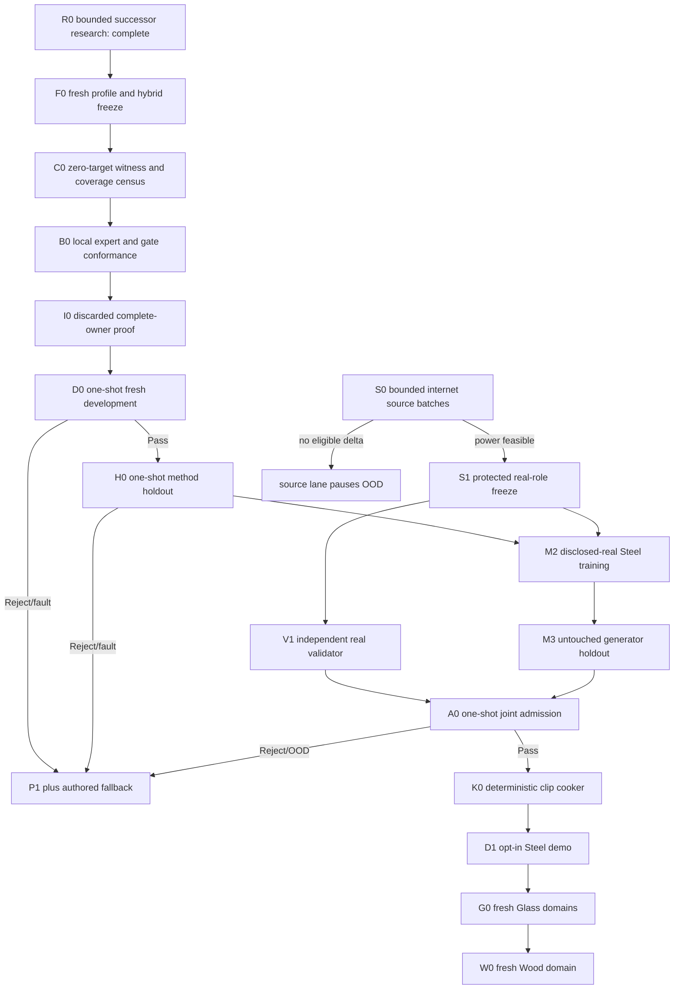

# Roadmap V35: geometry-conditioned learned impact atlas

| Field | Value |
| --- | --- |
| Rebaseline date | `2026-09-02` |
| Status | `ACTIVE / R0_COMPLETE / F0_NEXT / FRESH_ROLES_REQUIRED / VALIDATOR_FIRST / REAL_RELEASE_BLOCKED / OFFLINE_ML_ONLY / AUTHORED_FALLBACK` |
| Replaces | [Roadmap V34](physical-sound-synthesis-roadmap-v34.md) as planning authority; V34 is terminal and every opened role remains spent |
| Research basis | [V35 geometry-conditioned hybrid research](../development/physical-sound-v35-geometry-conditioned-hybrid-research-2026-09-02.md) |
| Trigger evidence | [V34 H0 terminal metric reject](../development/physical-sound-v34-h0-method-holdout-result-2026-09-02.md) |
| Architecture | [SPEC-45](../architecture/45-physical-sound-synthesis-and-acoustic-presentation.md), `Proposed`; no production consumer or promoting ADR |
| Product-owner constraint | All evidence is internet-sourced or synthetic; the user records no impacts and does not approve sounds one by one |

## Outcome

Turn the complementary strengths of V34 spectral ML and local retrieval into
one falsifiable geometry/contact method, then—only after synthetic admission
and independent real-source power—train, validate and cook one Steel impact
vertical without per-sound human approval:

```text
fresh target-safe synthetic roles
  -> geometry-conditioned neural expert + continuous local expert
  -> value-independent coverage gate
  -> one-shot development and method holdout
  -> independently qualified real validator and Steel generator
  -> one-shot joint admission
  -> deterministic 48 kHz clip
  -> opt-in demo or authored fallback
```

V35 does not promise that neural synthesis wins. The method must beat nearest
and a stronger continuous local interpolator on fresh evidence. If the
non-neural control wins, it becomes the scientific baseline and V35 ML closes.

## Immutable boundaries

1. P1 alone owns frequencies, modal order, nodes, pickup signs, impulse
   scaling, support and remesh identity. Learning changes only bounded
   decay/gain/contact multipliers around P1.
2. V32/V33/V34 identities, truth coefficients, targets, predictions, weights
   and metrics never enter V35 profile selection, training or thresholds.
3. V35 uses fresh materials, geometry cells, contacts, truth coefficients and
   role commitments. Development opens once; method holdout remains
   inaccessible until a complete development pass freezes one candidate.
4. V34's successful decay/global-gain decomposition is unchanged. The sole
   scientific change is the contact branch and its deterministic coverage gate.
5. Gate inputs are continuous causal train-support distances only. Object,
   geometry-cell, role, stratum and oracle IDs are forbidden; exact-contact
   detection cannot be used as a hidden split classifier.
6. Local estimates are train-only, continuous and permutation-invariant.
   Train-time estimates leave out the complete case/remesh group containing the
   queried row.
7. Structural preflight may inspect geometry, contact coordinates, role
   membership, P1 modes and witness predicates. It may not materialize targets,
   truth coefficients, predictions, weights or metric values.
8. Every post-access result is a complete atomic Pass, MetricReject,
   HardGateReject or ResourceReject artifact; pre-access contract rejection
   publishes no partial directory.
9. Generator and validator never share learned weights, groups, features or
   thresholds. Synthetic success grants no real-material or naturalness claim.
10. ML remains external/offline. Runtime sees only an ordinary bounded PCM
    clip; missing, stale, invalid, rejected or OOD output selects authored audio
    without changing deterministic gameplay acoustic facts.
11. No datasets, protected audio, checkpoints, generated WAVs or caches enter
    Git. Compact profiles, owners and evidence summaries may enter Git.

## Selected method family

The F0 profile freezes one `coverage-gated-geometry-contact-hybrid-v1`:

| Component | Frozen responsibility |
| --- | --- |
| P1 modal owner | Authoritative modes, participation, support, impulse response and hard invariants |
| Neural expert | V34 spectral/local contact inputs plus dimensionless physical geometry; predicts one bounded contact residual |
| Local expert | Fixed continuous interpolation over causal family/support/material/geometry/contact/modal keys from train only |
| Coverage gate | Continuous blend weight derived only from normalized distance to train support |
| Decay/global gain | V34 architecture and physics-locked composition unchanged |
| OOD/fallback | Deterministic rejection outside frozen support; authored clip remains authoritative |

F0 chooses exact normalizers, distance, kernel, neighbor count, bandwidth rule,
zero-distance behavior and blend equation without target values. Training loss
uses group-cross-fitted local predictions so self-retrieval cannot leak labels.

## Critical path



The synthetic and source lanes may progress independently. M2 requires both H0
and S1. V1 is trained only on protected validator roles and never sees generator
scores. No downstream stage may reinterpret a failed upstream role.

## Milestones and exit criteria

| ID | Deliverable | State | Exit criterion |
| --- | --- | --- | --- |
| R0 | Failure research and successor choice | [`COMPLETE`](../development/physical-sound-v35-geometry-conditioned-hybrid-research-2026-09-02.md) | Exact V34 failure, seven competing hypotheses, four primary sources, chosen hybrid, anti-leakage and stop rules are recorded with zero new oracle/model/real values. |
| F0 | Fresh profile and method freeze | `NEXT` | Hash-closed fresh roles/truth and exact geometry key, neural/local experts, gate, controls, ablations, gates and resources freeze with zero official target/model access. |
| C0 | Signal-blind witness/coverage census | `BLOCKED_BY_F0` | Every role/stratum has nonempty P1 hard-gate witnesses, both experts structurally reachable, finite distance support and no forbidden input; identities/counts repeat exactly with zero target/model access. |
| B0 | Local expert/gate conformance | `BLOCKED_BY_C0` | Discarded analytic fields prove continuity, train permutation invariance, group leave-out, zero-distance handling, no exact-contact split, bounded blend and deterministic OOD twice exactly. |
| I0 | Complete-owner terminal proof | `BLOCKED_BY_B0` | Discarded official-shape execution imports the frozen V34 publisher, covers Pass/metric/hard/resource/pre-access terminals and repeats artifacts/stdout exactly without official role access. |
| D0 | Fresh development tournament | `BLOCKED_BY_I0` | Candidate beats nearest and continuous local control in aggregate and each transfer stratum, passes both-expert ablations and every hard/resource gate, then freezes one candidate with zero H0 access. |
| H0 | One-shot method holdout | `BLOCKED_BY_D0_PASS` | Frozen candidate repeats exactly without training and independently passes all aggregate/branch/stratum, P1 hard, provenance and resource gates. Reject/fault closes V35 permanently. |
| S0 | Bounded internet source growth | `OPEN / FRONTIER_6_STEEL_27_NON_METAL` | Each batch audits at most three named primary-source leads and returns `Feasible`, `ImprovedFrontier` or `NoEligibleDelta` without signal access. |
| S1 | Protected real-role freeze | `BLOCKED_BY_S0_FEASIBLE` | Both protected roles have at least two projects, 16 exact-Steel groups and 35 non-Metal reject parents, with five projects reserved for other one-use roles. |
| V1 | Independent real validator | `BLOCKED_BY_S1` | Project/object-disjoint calibration reaches grouped 95% false-pass upper bound `<=0.10` and useful-coverage lower bound `>=0.80`; mutations and leave-project-out repeat. |
| M2 | Disclosed-real Steel training | `BLOCKED_BY_H0_AND_S1` | Frozen V35 model trains only on disclosed generator roles; every source/provenance/access receipt closes and protected validator/shadow roles remain zero. |
| M3 | Generator real holdout | `BLOCKED_BY_M2` | Untouched project/object-disjoint holdout opens once and beats frozen classical/local controls on preregistered causal/acoustic metrics. |
| A0 | Joint admission | `BLOCKED_BY_V1_AND_M3` | Frozen generator, validator, domain and cooker preprofile open one joint shadow once and return Pass, Reject or FallbackOutOfDomain. |
| K0 | Deterministic clip cooker | `BLOCKED_BY_A0_PASS` | Accepted record cooks twice to byte-identical bounded 48 kHz PCM with provenance; invalid/OOD input publishes nothing. |
| D1 | Opt-in Steel demo | `BLOCKED_BY_K0` | One demo prop uses the ordinary cooked clip; feature-off/corruption/query/device faults preserve authored fallback. |
| G0 | Thin goblet, bottle, thick jar | `AFTER_D1` | Each Glass domain repeats source power, fresh roles, validator qualification, generator holdout and admission independently. |
| W0 | Wood | `AFTER_G0` | One declared species/object/support domain repeats the same automatic release cycle; current Wood remains fallback. |
| PR | Product promotion | `ADR_REQUIRED_AFTER_CONSUMER` | Concrete consumer and Linux enabled/disabled/fault/cost ProductChecks justify the smallest Accepted contract change. |

## D0/H0 scientific gates

F0 freezes exact numeric thresholds before target materialization. At minimum:

- candidate contact aggregate beats raw/spectral ridge, V34-shaped MLP,
  nearest and continuous local interpolation;
- geometry-only, contact-only and joint contact strata each beat their best
  frozen control and remain inside absolute error bounds;
- decay and global gain retain their V34 physics-locked improvements;
- removing explicit geometry worsens geometry-only transfer, removing the local
  expert worsens supported local transfer, and removing the neural expert
  worsens novel-contact or joint transfer by preregistered margins;
- gate continuity, train-order permutation, group leave-out and near-contact
  perturbation probes pass; exact role/stratum classification is absent;
- all nodal zeros, signs, positive decay, correction bounds, frequency/order,
  impulse scaling, remesh identity, render peak and branch-isolation gates pass;
- two fresh CPU processes publish byte-identical deterministic payloads inside
  the frozen wall/RSS envelope.

The best control is binding per stratum. Aggregate averaging, absolute accuracy
or subjective listening cannot waive one failed relative gate.

## Failure interpretation and rollback

| First failure | Consequence |
| --- | --- |
| F0 cannot define a causal cross-family key/gate without IDs or targets | Stop before target access; retain P1 and authored fallback. |
| C0 finds empty expert reachability, witness or distance support | Reject profile before official values; revise only through a new value-independent protocol. |
| B0 exposes discontinuity, self-retrieval, order dependence or split detection | Close implementation; official roles remain unopened. |
| I0 terminal/access/atomicity fault | Close owner; publish no official artifacts. |
| D0 candidate loses any frozen control/stratum or ablation | Close V35 before H0; do not tune from development. |
| H0 reject/fault | Close V35 and every candidate permanently; no fresh wrapper around spent evidence. |
| Continuous local control wins | Record that compact ML adds no synthetic value; promote it only as a future baseline, not as V35 admission. |
| All compact methods fail | Research a topology/operator representation under a new roadmap; do not expand V35 in place. |
| S0 has no eligible delta | Pause source lane without weakening S1 or opening protected signals. |
| V1/M3/A0 reject or OOD | Publish no release; authored fallback remains selected. |
| K0/D1 integrity, determinism or fault failure | Publish no generated clip until the exact input passes scoped content/play checks. |

## Ordered implementation queue

1. **V35.0 — complete:** record local evidence, prior art, competing
   hypotheses, selected hybrid and permanent stop rules.
2. **V35.1 — next:** freeze fresh roles/truth and exact neural/local/gate
   profile with zero official targets, model weights or metrics.
3. **V35.2:** run the signal-blind P1 witness and expert-coverage census twice
   exactly; reject any degenerate stratum before target access.
4. **V35.3:** implement and prove local interpolation, continuous gate,
   cross-fit anti-leakage and complete terminal paths on discarded fixtures.
5. **V35.4:** execute D0 once in two fresh processes; freeze one candidate only
   after a complete repeat-exact pass.
6. **V35.5:** execute H0 once without retraining; admit the synthetic method or
   permanently close V35.
7. **V35.S:** continue source discovery in batches of at most three named
   primary-source leads; keep source roles independent from synthetic work.
8. **V35.6:** only after H0+S1, qualify V1 and run M2/M3/A0 in their one-use
   real roles with no generator/validator leakage.
9. **V35.7:** after A0 Pass, cook byte-identical PCM, integrate one opt-in Steel
   prop and prove authored fallback under feature-off and faults.
10. **V35.8:** repeat the entire automatic release cycle independently for
    thin goblet, bottle, thick jar, then one Wood domain.

## Verification policy

- R0/F0 documentation/profile work uses `git diff --check`, direct path/ID/hash
  validation and focused profile tests.
- C0/B0/I0/D0/H0 tooling uses Ruff/compile, focused Python suites, exact A/B
  comparison, focused xtask registry tests and the SPEC-45 boundary scan; it
  earns no ProductCheck credit.
- K0 runs affected `content-package`; D1 runs affected `play` checks including
  feature-off and fault fallback.
- Product/runtime promotion requires a separate Accepted ADR, affected SPEC,
  routing update and consumer-backed ProductChecks.

SPEC-45 remains `Proposed`. V35 adds no public schema, content role, runtime
model, production gate or shipped capability.
