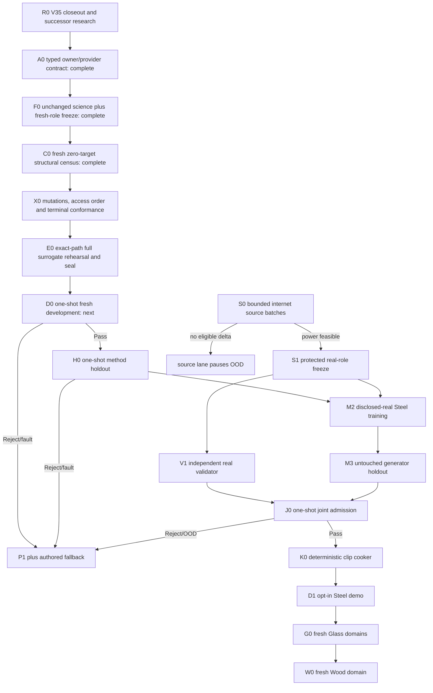

# Roadmap V36: sealed single-path physical-sound experiment

| Field | Value |
| --- | --- |
| Rebaseline date | `2026-09-03` |
| Status | `CLOSED / D0_REPEAT_EXACT_METRIC_REJECT / H0_UNOPENED / NO_CANDIDATE_AUTHORITY / SUPERSEDED_AS_PROGRAM_PLAN_BY_V37` |
| Superseded by | [Roadmap V37](physical-sound-synthesis-roadmap-v37.md); V36 D0/H0 runner, protocol, profile, seal and one-shot rules remain unchanged |
| Replaces | [Roadmap V35](physical-sound-synthesis-roadmap-v35.md), closed after a repeat-exact post-access owner fault; every V35 train/development role is spent and H0 stays unopened |
| Research basis | [V36 sealed-owner rebaseline](../development/physical-sound-v36-sealed-owner-rebaseline-research-2026-09-03.md) |
| Trigger evidence | [V35 D0 terminal result](../development/physical-sound-v35-d0-development-tournament-result-2026-09-03.md) |
| A0 evidence | [Repeat-exact typed owner/provider contract](../development/physical-sound-v36-a0-typed-owner-contract-result-2026-09-03.md) |
| F0 evidence | [Repeat-exact fresh-role and unchanged-science freeze](../development/physical-sound-v36-f0-fresh-role-unchanged-science-result-2026-09-03.md) |
| C0 evidence | [Repeat-exact fresh structural census](../development/physical-sound-v36-c0-fresh-structural-census-result-2026-09-03.md) |
| X0 evidence | [Repeat-exact mutation and terminal conformance](../development/physical-sound-v36-x0-mutation-terminal-conformance-result-2026-09-03.md) |
| E0 evidence | [Repeat-exact full surrogate rehearsal and execution seal](../development/physical-sound-v36-e0-full-surrogate-seal-result-2026-09-03.md) |
| D0 evidence | [Repeat-exact fresh development MetricReject](../development/physical-sound-v36-d0-fresh-development-result-2026-09-03.md) |
| Architecture | [SPEC-45](../architecture/45-physical-sound-synthesis-and-acoustic-presentation.md), `Proposed`; no production consumer or promoting ADR |
| Product-owner constraint | Evidence is internet-sourced or synthetic; the user records no impacts and does not approve sounds one by one |

## Outcome

Answer the still-unobserved V35 scientific question without spending another
role on a preventable runner defect. V36 first turns the experiment into one
typed, capability-limited, byte-sealed executable path. Only then may the
unchanged geometry-conditioned hybrid run on fresh roles:

```text
typed single-path owner
  -> mutation and access-order conformance
  -> full-count/full-step surrogate rehearsal
  -> byte-sealed execution capability
  -> fresh one-shot development and method holdout
  -> independently qualified real validator and Steel generator
  -> one-shot joint admission
  -> deterministic 48 kHz clip
  -> opt-in demo or authored fallback
```

V36 is not another tuned model variant. The V35 features, experts, controls,
ablations, capacity, model/training seeds, optimizer schedule, losses, gates
and resource ceilings are copied without using any V35 target/model value. Only
the role/truth seed namespace, hidden truth identity and execution contract are
new.

## Immutable boundaries

1. V35 train/development roles are spent. Its H0 role is retired unopened. No
   V35 target, prediction, weight, loss or metric may be reconstructed or read.
2. P1 alone owns frequencies, modal order, nodes, pickup signs, impulse
   scaling, support and remesh identity. Learning predicts only the same three
   bounded V35 multipliers.
3. V36 preserves every V35 scientific knob. A scientific change requires a
   different hypothesis and roadmap, not a V36 patch.
4. V36 receives fresh materials, geometry cells, contacts, truth coefficients,
   role/truth enumeration seeds and train/development/method-holdout
   commitments. No role overlaps any V32–V35 identity.
5. One typed owner function owns materialization, fit, prediction, controls,
   metrics, hard/resource gates and atomic publication. Rehearsal and official
   runs may select different providers, never different owner branches.
6. Structural, surrogate, D0 and H0 providers expose the same versioned
   concrete role containers. `Any`, untyped dictionaries and implicit
   sequence behavior are forbidden at the owner/provider boundary.
7. The owner emits a canonical stage trace. Surrogate and official traces must
   agree in stage/callable/terminal identities; only role/value/access receipts
   may differ.
8. A fresh-target capability is issued only for an exact execution seal binding
   owner, dependencies, profile, environment, type/property checks, terminal
   publisher and full rehearsal roots. Any byte change invalidates the seal.
9. Pre-access implementation corrections are allowed and rerun the complete
   verification ladder. After any fresh target opens, no correction or retry is
   allowed inside V36.
10. Every post-access outcome is atomic Pass, MetricReject, HardGateReject,
    ResourceReject or OwnerFault. Unexpected exceptions are data-spending
    terminal outcomes, never retry invitations.
11. Generator and validator share no learned weights, groups, features or
    thresholds. Synthetic success creates no real-material or naturalness
    claim.
12. ML remains external/offline. Runtime sees only bounded cooked PCM; every
    missing, stale, rejected, invalid or OOD result selects authored audio and
    cannot change deterministic gameplay acoustic facts.
13. No dataset, protected audio, checkpoint, generated WAV or cache enters Git.
    Owners, compact profiles, seals and evidence summaries may enter Git.

## Sealed execution design

The owner accepts capabilities, not paths or globally reachable datasets:

| Provider | Allowed information | Forbidden information |
| --- | --- | --- |
| Structural | role identities, geometry, contacts, P1 modes and witnesses | targets, truth coefficients, weights, predictions and metrics |
| Surrogate | disposable analytic values with official container/count shapes | every V36 official identity/value and every earlier-generation value |
| D0 | fresh V36 train and development only | method holdout, real/protected signals and earlier-generation values |
| H0 | disclosed train reconstruction, frozen D0 candidate and fresh method holdout | training, development metrics, real/protected signals |

The execution seal binds at minimum:

- exact owner, provider protocol, terminal publisher and dependency SHA-256;
- effective profile and fresh-role commitment roots;
- Python, NumPy and Torch identities plus deterministic CPU settings;
- pinned strict-checker configuration and zero owner-boundary diagnostics;
- property/state-machine mutation result and exact stage vocabulary;
- two byte-identical full-count/full-step surrogate artifact roots;
- wall/RSS envelope and zero forbidden-access receipts.

The official capability verifier checks the seal before it can construct a
target provider. Verification failure is pre-access and publishes no partial
official artifact.

## Critical path



The synthetic and internet-source lanes remain independent. M2 needs both H0
and S1. V1 never sees generator scores. No downstream stage may reinterpret an
upstream reject as partial admission.

## Milestones and exit criteria

| ID | Deliverable | State | Exit criterion |
| --- | --- | --- | --- |
| R0 | V35 terminal closeout and bounded rebaseline | [`COMPLETE`](../development/physical-sound-v36-sealed-owner-rebaseline-research-2026-09-03.md) | Exact access/fault evidence, five hypotheses, primary-source assurance guidance, unchanged-science rule and stop conditions are recorded with zero new official values. |
| A0 | Typed single-path owner/provider contract | [`COMPLETE / REPEAT_EXACT / ZERO_OFFICIAL_VALUES`](../development/physical-sound-v36-a0-typed-owner-contract-result-2026-09-03.md) | One immutable concrete `RoleBatch` has explicit `row_count` and no length protocol; strict positive/negative typing, 10 lifecycle mutations and complete D0/H0 topology traces pass; four artifacts/stdout repeat exactly with zero official access. |
| F0 | Fresh-role and unchanged-science freeze | [`COMPLETE / REPEAT_EXACT / ZERO_TARGET_VALUES`](../development/physical-sound-v36-f0-fresh-role-unchanged-science-result-2026-09-03.md) | V35 scientific projection is hash-exact outside eight declared identity paths; `1,512 / 15,120` fresh case/row commitments and every V32–V35 identity intersection close at zero with no target/model/prior-value access. |
| C0 | Fresh structural census | [`COMPLETE / REPEAT_EXACT / ZERO_TRUTH_TARGET_VALUES`](../development/physical-sound-v36-c0-fresh-structural-census-result-2026-09-03.md) | Dedicated truth-free structural profile reproduces all F0 roots; every `15,120` P1 row is valid, all witnesses/support close, 216/215 local counts hold, both experts are reachable and OOD count is zero. |
| X0 | Mutation and lifecycle conformance | [`COMPLETE / REPEAT_EXACT / 38_MUTATIONS / ZERO_OFFICIAL_VALUES`](../development/physical-sound-v36-x0-mutation-terminal-conformance-result-2026-09-03.md) | All 38 container/lifecycle/trace mutations reject; eight complete D0/H0 scientific terminals, four failpoints and pre/post-access exception conversion close atomically in two exact processes. |
| E0 | Full surrogate rehearsal and execution seal | [`COMPLETE / REPEAT_EXACT / FULL_D0_H0 / SEALED / ZERO_OFFICIAL_VALUES`](../development/physical-sound-v36-e0-full-surrogate-seal-result-2026-09-03.md) | The committed owner completes all four `1,200`-step fits and every D0/H0 control, metric, hard/resource gate and scientific terminal over exact `6,480 / 4,320 / 4,320` discarded rows twice; all 24 files/stdout match and the checked-in seal binds both roots before official access. |
| D0 | Fresh development tournament | [`COMPLETE / REPEAT_EXACT_METRIC_REJECT`](../development/physical-sound-v36-d0-fresh-development-result-2026-09-03.md) | A/B match across stdout, stderr and all 12 files. Hard/resources pass, but contact transfer loses every frozen control comparison and 18/28 metric/ablation gates fail. |
| H0 | One-shot method holdout | `NOT_RUN / PERMANENTLY_CLOSED` | D0 did not pass, candidate authority is false and method-holdout access remains exact zero. |
| S0 | Bounded internet source growth | `OPEN / FRONTIER_6_STEEL_27_NON_METAL` | Each batch audits at most three named primary-source leads and returns `Feasible`, `ImprovedFrontier` or `NoEligibleDelta` without signal access. |
| S1 | Protected real-role freeze | `BLOCKED_BY_S0_FEASIBLE` | Both protected roles have at least two projects, 16 exact-Steel groups and 35 non-Metal reject parents, with five projects reserved for other one-use roles. |
| V1 | Independent real validator | `BLOCKED_BY_S1` | Project/object-disjoint calibration reaches grouped 95% false-pass upper bound `<=0.10` and useful-coverage lower bound `>=0.80`; mutations and leave-project-out repeat. |
| M2 | Disclosed-real Steel training | `BLOCKED_BY_H0_AND_S1` | Frozen V36 model trains only on disclosed generator roles; every source/provenance/access receipt closes and protected validator/shadow roles remain zero. |
| M3 | Generator real holdout | `BLOCKED_BY_M2` | Untouched project/object-disjoint holdout opens once and beats frozen classical/local controls on preregistered causal/acoustic metrics. |
| J0 | Joint admission | `BLOCKED_BY_V1_AND_M3` | Frozen generator, validator, domain and cooker preprofile open one joint shadow once and return Pass, Reject or FallbackOutOfDomain. |
| K0 | Deterministic clip cooker | `BLOCKED_BY_J0_PASS` | Accepted record cooks twice to byte-identical bounded 48 kHz PCM with provenance; invalid/OOD input publishes nothing. |
| D1 | Opt-in Steel demo | `BLOCKED_BY_K0` | One demo prop uses the ordinary cooked clip; feature-off, corruption, query and device faults reproduce authored fallback. |
| G0 | Thin goblet, bottle and thick jar | `AFTER_D1 / THREE_FRESH_RELEASES` | Each Glass domain repeats source power, roles, validator qualification, generator holdout and admission independently. |
| W0 | One declared Wood domain | `AFTER_G0 / FRESH_RELEASE` | Species/object/support scope receives independent source power, roles, validator, generator holdout and admission; current Wood stays fallback meanwhile. |
| PR | Product promotion | `ADR_REQUIRED_AFTER_CONSUMER` | A concrete consumer plus Linux enabled/disabled/fault/cost ProductChecks justify the smallest Accepted contract change. |

## Scientific gates carried unchanged from V35

- candidate contact aggregate beats raw/spectral ridge, V34-shaped MLP,
  nearest and continuous local interpolation;
- geometry-only, contact-only and joint strata each beat their best frozen
  control and remain inside their preregistered absolute bounds;
- decay and global-gain branches retain the V34 physics-locked improvements;
- removing geometry, local expert or neural expert fails the corresponding
  preregistered contribution margin;
- gate continuity, train-order permutation, complete case/remesh leave-out,
  near-contact perturbation and OOD probes pass without role/stratum IDs;
- nodal zeros, signs, positive decay, correction bounds, frequency/order,
  impulse scaling, remesh identity, render peak and branch isolation pass;
- two fresh CPU processes publish byte-identical payloads inside the unchanged
  wall/RSS envelope.

No V35 observation may change these thresholds. Best-control comparison is
binding per stratum; subjective listening and aggregate averaging cannot waive
a miss.

## Failure interpretation and rollback

| First failure | Consequence |
| --- | --- |
| A0 cannot remove `Any`/implicit container semantics from the owner boundary | Stop pre-access; no V36 role opens. |
| F0 changes a V35 scientific knob or reuses an earlier identity | Reject the profile pre-access. |
| C0 lacks any witness/support or finds role overlap | Reject the fresh corpus pre-access. |
| X0 misses a declared mutation, access-order violation or atomic terminal | Repair only before the seal; rerun A0–X0. |
| E0 diverges, faults, exceeds resources or uses a rehearsal-only branch | No seal and no D0 capability; repair pre-access and repeat the whole ladder. |
| Any code/profile/dependency byte changes after E0 | Invalidate the seal and repeat E0 before target access. |
| D0/H0 metric, hard or resource reject | Close V36; compact hybrid ML is rejected on fresh evidence. |
| D0/H0 post-access owner fault | Close V36 and pause scientific generations; first build a reusable experiment framework with the same seal guarantees outside the one-use roles. |
| Continuous local control wins | Record it as the synthetic baseline; no ML admission follows. |
| Compact methods fail scientifically | Research a surface/operator representation under a new roadmap; never tune V36. |
| S0 has no eligible delta | Pause source lane without weakening S1 or decoding protected signals. |
| V1/M3/J0 reject or OOD | Publish no release; authored fallback remains selected. |
| K0/D1 integrity, determinism or fault failure | Publish no generated clip; retain authored fallback. |

## Ordered implementation queue

1. **V36.0 — complete:** record V35 terminal evidence and the sealed-owner
   rebaseline without opening new values.
2. **V36.1 — complete:** the typed owner/provider API, explicit row-count
   semantics, exhaustive lifecycle states, canonical D0/H0 traces, strict type
   checks and mutation suite pass twice exactly with zero official values.
3. **V36.2 — complete:** the V35 scientific projection is hash-exact outside
   eight declared identity paths; fresh role/truth commitments and all prior
   intersections close twice exactly with zero target access.
4. **V36.3 — complete:** a dedicated truth-free profile reproduces every F0
   root; all P1 witnesses, local/gate support and both-expert reachability close
   twice exactly over `15,120` structural rows.
5. **V36.4 — complete:** all 38 container/lifecycle/trace mutations, eight
   scientific terminals, four failpoints and access-sensitive exception
   conversion pass twice exactly through the shared atomic publisher.
6. **V36.5 — complete:** the committed owner runs D0/H0 twice end-to-end on
   full-count/full-step surrogate values; all 24 files/stdout repeat exactly,
   every scientific terminal publishes, and one checked-in seal binds both roots.
7. **V36.6 — complete:** the seal-verifying official provider and runner
   executed fresh D0 A/B exactly; both returned the same `MetricReject` with
   complete access receipts and no forbidden access.
8. **V36.7 — not run:** D0 reject permanently closes H0 and V36. The compact
   hybrid is not tuned or retried on spent values.
9. **V36.S:** independently continue internet-source discovery in batches of at
   most three named primary-source leads.
10. **V36.8:** only after H0+S1, qualify V1 and execute M2/M3/J0 with one-use,
    project-disjoint real roles.
11. **V36.9:** after J0 Pass, cook byte-identical PCM and prove one opt-in Steel
    prop with complete authored fallback.
12. **V36.10:** repeat the complete automatic release independently for thin
    goblet, bottle, thick jar and then one Wood domain.

## Verification policy

- R0 documentation uses `git diff --check` plus direct link, identity and
  task-state validation.
- A0–E0 use a pinned strict type check, Python compile/Ruff, focused unit and
  property/state-machine tests, exact A/B artifact/trace comparison, focused
  xtask registry tests and the SPEC-45 boundary scan.
- D0/H0 additionally require exact access receipts and sealed-owner identity;
  they earn no ProductCheck or real-material credit.
- K0 runs affected `content-package`; D1 runs affected `play` checks for
  feature-on/off and all declared fallback faults.
- Runtime/product promotion requires a separate Accepted ADR, affected SPEC,
  routing update and consumer-backed ProductChecks.

SPEC-45 remains `Proposed`. V36 is closed and adds no public schema, content
role, runtime model, production gate or shipped capability. Roadmap V37 owns
the surface/operator successor research and independent source/validator lane.
