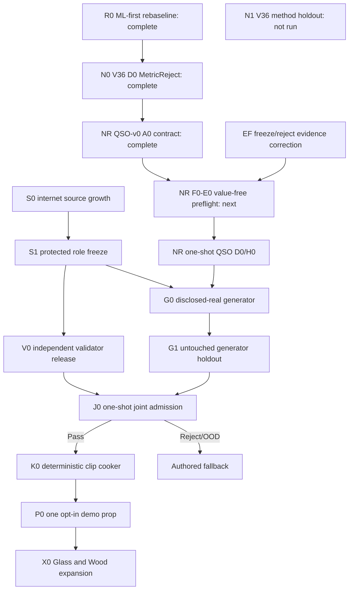

# Roadmap V37: autonomous neural physical-sound factory

| Поле | Значение |
| --- | --- |
| Дата rebaseline | `2026-09-03` |
| Статус | `ACTIVE / R0_N0_NR_RESEARCH_COMPLETE / QSO_V0_SELECTED / A0_REPEAT_EXACT_PASS / F0_NEXT / V36_CLOSED / H0_UNOPENED / ML_FIRST / AUTOMATIC_VALIDATION / AUTHORED_FALLBACK` |
| Заменяет | [Roadmap V36](physical-sound-synthesis-roadmap-v36.md) как программный план; замороженные V36 D0/H0 runner, protocol, profile и seal переносятся без изменений |
| Текущее evidence | [A0 repeat-exact target-free contract](../development/physical-sound-v37-a0-query-surface-contract-result-2026-09-03.md), [QSO-v0 successor research](../development/physical-sound-v37-query-surface-operator-research-2026-09-03.md), [implementation plan](2026-09-03-physical-sound-v37-query-surface-operator-implementation-plan.md) и [V36 D0 repeat-exact MetricReject](../development/physical-sound-v36-d0-fresh-development-result-2026-09-03.md) |
| Архитектура | [SPEC-45](../architecture/45-physical-sound-synthesis-and-acoustic-presentation.md), `Proposed`; production consumer и promoting ADR отсутствуют |
| Ограничение владельца продукта | Пользователь не записывает удары и не подтверждает каждый звук; реальные данные ищутся в интернете, решение принимает автоматический pipeline |

## Цель

Построить не коллекцию вручную дотюненных формул, а автономную внешнюю
фабрику физических звуков:

```text
опубликованные записи + геометрия + метаданные
  -> hash-closed corpus с независимыми ролями
  -> physics-locked neural generator
  -> независимо обученный automatic validator
  -> one-shot admission
  -> детерминированный 48 kHz clip atlas
  -> обычный audio asset движка или authored fallback
```

Первая продуктовая победа — один точно ограниченный impact-domain, который
проходит весь контур без ручного прослушивания. Предпочтительный первый домен —
Steel, потому что его текущий интернет-corpus ближе всего к role-power gate.
Если до заморозки ролей другой материал первым закроет те же неизменные gates,
он может стать первым доменом без ослабления критериев. Затем тот же процесс
повторяется независимо для тонкого бокала, бутылки, толстой стеклянной банки и
одного заявленного деревянного домена.

V37 — revision программного плана, а не новая научная роль. Он не создаёт
`V37 targets`. Замороженный V36 D0 выполнен и repeat-exactly отверг compact
hybrid на contact transfer; H0 не открывался. Следующая научная роль появится
как value-free F0 identity/profile; её target values появятся только после
нового surface/operator hypothesis и полного C0/X0/E0 preflight.

## Главное техническое решение

### Что остаётся математикой

- P1 владеет модальными частотами, порядком мод, узлами, знаками, impulse
  scaling, remesh identity и остальными причинными инвариантами.
- Геометрия, контакт, support, excitation и listener envelope являются явными
  входами или честно отсутствующими осями; material label не подменяет данные.
- Hard gates проверяют энергию, затухание, знаки, узловые нули, bounds,
  continuity, remesh и воспроизводимость независимо от learned score.

### Что учит нейросеть

- ограниченные поправки к modal gain, decay и residual envelope;
- перенос между допустимыми контактами и геометрическими context cells;
- uncertainty/OOD признаки, но не финальное решение о выпуске;
- только offline: runtime weights не загружает и inference не выполняет.

### Кто валидирует

Один `ValidatorRelease` состоит из независимого ансамбля:

1. deterministic hard/causal gates;
2. acoustic specialists для attack, decay, modes, spectral evolution и
   residual texture;
3. learned real-audio representation, обученной на других project/object
   groups, чем generator;
4. OOD/risk controller с confidence bounds по целым parent groups.

Финал всегда трёхзначный: `Pass`, `Reject` или `FallbackOutOfDomain`.
Человеческое прослушивание допустимо только как необязательная диагностика и
не может изменить решение.

## Неизменяемые границы

1. Реальный corpus поступает только из опубликованных internet sources; локальный
   микрофон, молоток или force sensor не входят в программу.
2. Dataset payloads, WAV, checkpoints, weights, caches и cooked atlases остаются
   вне Git. В Git входят code, compact profiles, manifests, seals и summaries.
3. Источник с неизвестными или несовместимыми условиями распространения не
   входит в release corpus; provenance и notices следуют за каждым asset.
4. Generator, validator calibration, method holdout и admission shadow разделены
   по целым project/object parent groups до чтения signal values.
5. Generator не видит validator thresholds, protected roles или admission
   shadow. Validator той же revision не обучается на candidate outputs.
6. После открытия protected role нельзя менять seed, capacity, feature,
   threshold, contact selection или retry policy по увиденному результату.
7. Prompt-to-audio и универсальный waveform codec могут быть controls, но не
   получают admission без тех же causal, OOD и held-real gates.
8. Отсутствующие force, geometry, support или listener axes сужают domain claim;
   они не восстанавливаются по имени материала.
9. Любая ошибка, stale identity, low confidence или OOD выбирает authored clip.
10. Audio остаётся presentation-only и не влияет на deterministic simulation,
    gameplay hearing, save или replay.
11. SPEC-45 остаётся `Proposed`; public contract и runtime promotion требуют
    отдельного Accepted ADR и конкретного consumer.

## Критический путь



S0/S1 и V0 не зависят от научного исхода V36 и остаются полезными при смене
generator representation. G0 начинается только после `NR Pass` и `S1`.

## Milestones и критерии выхода

| ID | Результат | Состояние | Критерий выхода |
| --- | --- | --- | --- |
| R0 | ML-first rebaseline | `COMPLETE` | V36 сохранён как byte-frozen ближайший gate; разделены generator, validator, data, admission, cooker и product promotion. |
| N0 | V36 fresh development | [`COMPLETE / REPEAT_EXACT_METRIC_REJECT`](../development/physical-sound-v36-d0-fresh-development-result-2026-09-03.md) | A/B совпали по stdout, stderr и всем 12 файлам; 20 hard и 2 resource gates прошли, но contact transfer провалил 18/28 metric/ablation gates. |
| N1 | V36 method holdout | `NOT_RUN / PERMANENTLY_CLOSED_BY_N0_REJECT` | H0 access остался нулевым; V36 candidate не имеет freeze authority. |
| NR | Successor representation research | [`QSO_V0_SELECTED / A0_REPEAT_EXACT_PASS / F0_NEXT`](../development/physical-sound-v37-a0-query-surface-contract-result-2026-09-03.md) | Typed immutable field/CSR/query contract, separate structural/scientific lifecycles and Pass-only candidate freeze repeat exactly with zero target/truth/model/official access. F0 may now allocate fresh operator roles. |
| EF | Freeze/reject evidence correction | `A0_TYPED_RULE_PASS / X0_COMPLETE_PUBLISHER_PENDING` | A0 makes reject/freeze states mutually exclusive and rejects legacy V36 metadata as H0 authority; X0 must repeat the rule through complete atomic terminal/failpoint fixtures. |
| S0 | Internet source growth | `OPEN / FRONTIER_6_STEEL_27_NON_METAL` | Каждая партия проверяет не более трёх named primary-source leads metadata-first и публикует `ImprovedFrontier`, `Feasible` или `NoEligibleDelta` без signal decode. |
| S1 | Protected role freeze | `BLOCKED_BY_S0_FEASIBLE` | Неизменный source-power gate закрыт: обе protected roles имеют не менее двух проектов, 16 exact-Steel groups и 35 non-Metal reject parents; ещё пять проектов остаются для остальных one-use roles. |
| V0 | Independent automatic validator | `BLOCKED_BY_S1` | Grouped 95% false-pass upper bound `<= 0.10`, useful-coverage lower bound `>= 0.80`, corruption suite и leave-project-out проходят повторяемо; candidate outputs не участвовали в calibration. |
| G0 | Disclosed-real generator training | `BLOCKED_BY_NR_PASS_AND_S1` | Frozen successor обучается только на disclosed generator roles; protected reads равны нулю, model lineage hash-closed, hard physics выполнены по построению. |
| G1 | Untouched generator holdout | `BLOCKED_BY_G0` | На project/object-disjoint real holdout candidate превосходит frozen classical/local controls по всем preregistered primary strata и не нарушает causal/OOD/resource gates. |
| J0 | Joint admission | `BLOCKED_BY_V0_AND_G1` | Frozen generator, validator, domain и cooker preprofile один раз открывают joint shadow и возвращают ровно `Pass`, `Reject` или `FallbackOutOfDomain`. |
| K0 | Deterministic clip cooker | `BLOCKED_BY_J0_PASS` | Один accepted record дважды создаёт byte-identical bounded 48 kHz PCM atlas с provenance; invalid/OOD input не публикует частичный asset. |
| P0 | Один opt-in impact prop | `BLOCKED_BY_K0` | Обычный content/audio path проигрывает atlas; feature-off, missing, stale, corrupt, query и device faults воспроизводят authored fallback. |
| X0 | Новые material domains | `AFTER_P0` | Тонкий бокал, бутылка, толстая банка и затем Wood проходят S1–J0 независимо; провал одного домена не ослабляет другой. |
| PR | Product promotion | `ADR_REQUIRED_AFTER_P0` | Конкретный consumer и Linux enabled/disabled/fault/cost ProductChecks обосновывают минимальное изменение Accepted архитектуры. |

## Что хранится в «базе звука»

На этом этапе база — внешний versioned research registry, не новый public
engine schema. Каждая принятая запись связывает:

- точный domain: material composition, object/geometry revision, support,
  excitation, contact region и listener envelope;
- source/corpus revision и распределение независимых ролей;
- P1 physics owner, generator candidate и validator release hashes;
- uncertainty/OOD envelope и immutable admission decision;
- cooker profile и hashes готового clip atlas;
- причину authored fallback для неподдержанных запросов.

То есть база отвечает не «как вообще звучит стекло», а «какая проверенная
модель и какие clips допустимы для этого ограниченного физического домена».

## Автоматические тесты

| Слой | Обязательные проверки |
| --- | --- |
| Corpus | Hash/provenance closure, duplicate и parent leakage, coordinate/audio/geometry binding, role access ledger. |
| Generator | Exact repeat policy, baselines, held strata, ablations, uncertainty, resource envelope и zero protected access. |
| Physics | Finiteness, energy scaling, positive decay, modal order, signs/nodal zeros, bounds, remesh, continuity и branch isolation. |
| Validator | Clean positives, causal corruptions, reward-hack controls, leave-project-out, false-pass/coverage confidence bounds и OOD. |
| Admission | Immutable identities, one-shot shadow, tri-state decision, atomic publication и no tuning after access. |
| Cooker/demo | Byte-identical PCM/manifest, bounded assets, provenance, `content-package`, affected `play` checks и complete fallback matrix. |

## Упорядоченная очередь реализации

1. **V37.0 — этот commit:** зафиксировать ML-first roadmap, сохранив V36 seal
   и scientific protocol без изменений.
2. **V37.1 — complete:** final pre-access checklist прошёл; V36 D0 A/B
   repeat-exactly вернули `MetricReject`, H0 остался unopened.
3. **V37.2 — complete:** терминальный D0 report закрывает V36 и фиксирует
   post-access non-authoritative freeze-metadata defect без repair/retry.
4. **V37.3 — complete:** выбран QSO-v0; A0 repeat-exactly фиксирует immutable
   typed field/CSR/query contract, отдельные structural/scientific lifecycle и
   однозначный `Pass` freeze против rejected-candidate evidence с нулевым
   target/truth/model/official access.
5. **V37.4 — next:** F0 выделяет только свежие disjoint operator identities и
   до вычисления values замораживает truth components, controls, ablations,
   metrics, thresholds и resource ceilings.
6. **V37.5:** C0 строит все full-shape контейнеры без targets, доказывает
   reachability/remesh/cost и останавливается до values при любом reject.
7. **V37.6:** X0 связывает complete owner и atomic terminal publisher; E0 затем
   дважды исполняет полный discarded D0/H0 и единственный создаёт execution seal.
8. **V37.7:** только seal-verifying provider один раз открывает D0 A/B; H0 A/B
   разрешён исключительно после точного D0 `Pass` freeze.
9. **V37.S:** продолжить S0 metadata-only internet discovery партиями до
   `S1 Feasible` либо честного `NoEligibleDelta`.
10. **V37.8:** собрать validator calibration corpus и выпустить V0 только после
   grouped risk/coverage, mutation и leave-project-out gates.
11. **V37.9:** после NR+S1 обучить G0 на disclosed-real roles и один раз открыть
   G1 generator holdout.
12. **V37.10:** заморозить generator, validator, domain и cooker preprofile; один
   раз выполнить J0 admission shadow.
13. **V37.11:** после J0 Pass реализовать K0 и P0 через существующий audio path с
   полным authored fallback.
14. **V37.12:** повторять S1–J0 как независимые releases для Glass archetypes и
   Wood; не переносить thresholds или admission credit по material label.
15. **V37.13:** только после работающего consumer подготовить promoting ADR,
    минимальный public contract и Linux ProductChecks.

Внутренний WIP limit критического пути — один необратимый experiment gate за
раз. Metadata-only source discovery не открывает protected values и может
продолжаться независимо.

## Stop rules

- Любой post-access V36 reject или fault терминален; никакого локального retry.
- Scientific reject закрывает compact V36 hybrid, но не source registry и не
  validator work. Следующий generator обязан иметь новую falsifiable
  representation и новые роли.
- Owner fault после target access сначала переводит работу в EF; новая научная
  роль не выделяется до полного reusable owner proof.
- `NoEligibleDelta` не разрешает уменьшить project/group floor, смешать роли
  или открыть сигнал «для проверки».
- V0 без заявленных risk/coverage bounds остаётся diagnostic-only и ничего не
  принимает.
- G1 или J0 reject не публикует model/atlas и не превращается в partial Pass.
- Human listening, красивый отдельный WAV или text-audio similarity не могут
  отменить causal, held-real, OOD или provenance failure.
- До P0 нет production capability claim; до Accepted ADR нет нового runtime
  public contract.

## Проверка изменений roadmap

Текущий status update является documentation-only отражением отдельного A0
code commit. Для него обязательны `git diff --check`, проверка локальных
links/paths/identifiers и согласованность с main roadmap и task-state. A0
evidence отдельно включает Ruff/compile/strict typing, focused Python tests,
fresh-process A/B и registry/boundary checks; Cargo ProductCheck не применим,
пока production consumer отсутствует.

SPEC-45 остаётся `Proposed`. Authored clips остаются единственным production
fallback и единственным гарантированным путём до успешных J0/K0/P0 и отдельной
архитектурной promotion.
