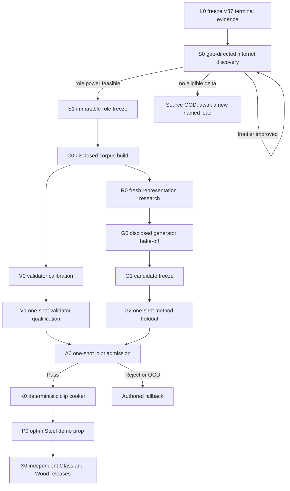

# Roadmap V38: evidence-first autonomous physical-sound learning loop

| Поле | Значение |
| --- | --- |
| Дата rebaseline | `2026-09-03` |
| Статус | `SUPERSEDED_BY_V39 / S0_IMPROVED_FRONTIER_6_STEEL_23_NON_METAL / V37_QSO_V0_CLOSED / H0_PERMANENTLY_CLOSED / OFFLINE_ML_ONLY / AUTHORED_FALLBACK` |
| Заменяет | [Roadmap V37](physical-sound-synthesis-roadmap-v37.md) как planning authority; V37 identities, targets, seals и terminal result остаются immutable отрицательным evidence |
| Текущее evidence | [V38 S0 source increment](../development/physical-sound-v38-s0-gap-directed-source-result-2026-09-03.md), [V37 D0 terminal result](../development/physical-sound-v37-d0-fresh-development-result-2026-09-03.md), [V30 source frontier](../development/physical-sound-v30-e2-q1a-source-growth-result-2026-09-02.md), [V29 source-power audit](../development/physical-sound-v29-q1m-metal-role-power-result-2026-09-02.md), [V32 validator mechanics](../development/physical-sound-v32-v0a-modal-equivalence-validator-result-2026-09-02.md), [V31 causal contract](../development/physical-sound-v31-p0-causal-baseline-result-2026-09-02.md) и [modal owner](../development/physical-sound-v31-p1-deterministic-modal-owner-result-2026-09-02.md) |
| Архитектура | [SPEC-45](../architecture/45-physical-sound-synthesis-and-acoustic-presentation.md), `Proposed`; production consumer и promoting ADR отсутствуют |
| Ограничение владельца продукта | Пользователь ничего не записывает и не подтверждает звуки вручную; реальные данные поступают из опубликованных internet sources, решение принимает автоматический pipeline |

## Итоговая цель

Получить автономный цикл, который для ограниченного физического домена умеет:

```text
internet evidence
  -> hash-closed corpus и независимые project/object roles
  -> physics owner + несколько ML-кандидатов на disclosed development
  -> независимо квалифицированный automatic validator
  -> один untouched generator holdout
  -> один joint admission shadow
  -> deterministic 48 kHz clip atlas
  -> обычный audio asset или authored fallback
```

Первая продуктовая победа — один Steel-impact domain и один opt-in prop в demo.
После него тот же release process повторяется независимо для тонкого бокала,
бутылки, толстой стеклянной банки и одного заявленного Wood domain. Ни Steel,
ни один Glass archetype не передаёт другому admission credit только по material
label.

## Почему V38 меняет порядок

[V37 D0](../development/physical-sound-v37-d0-fresh-development-result-2026-09-03.md)
дважды вернул byte-identical `MetricReject`. Complete owner, hard physics и
resource gates сработали, но QSO-v0 прошёл только `11/22` metric gates, уступил
ridge и pointwise MLP, а field-only ablation не подтвердил пользу его основной
field/trunk fusion. H0 не открывался и навсегда закрыт для QSO-v0.

Это доказывает две разные вещи:

1. sealed experiment machinery уже достаточно надёжен и не является текущим
   исследовательским bottleneck;
2. последовательность новых synthetic architecture ladders не приближает нас
   к real-material acceptance без достаточного internet corpus и независимого
   real-audio validator.

V38 поэтому переносит source power и validator на критический путь. Synthetic
truth остаётся обязательным causal non-regression test, но больше не выбирает
архитектуру в одиночку. Несколько ML-семейств можно честно сравнивать и улучшать
на заранее раскрытых train/development roles; только protected generator
holdout, validator qualification и joint shadow остаются одноразовыми.

## Неизменяемые границы

1. Audio остаётся presentation-only и не влияет на gameplay hearing,
   deterministic simulation, save или replay.
2. Physics owner задаёт частоты, modal order, mode-shape signs/nodes, impulse
   scaling, decay bounds, remesh identity и физические counterfactuals. ML не
   может обходить эти проверки.
3. Runtime не загружает weights и не выполняет inference. Принятый external
   release запекается в обычные clips; любой fault/OOD выбирает authored clip.
4. Dataset payloads, WAV, features, checkpoints, generated runs и atlases
   остаются во внешнем content-addressed store. Git хранит code, compact
   manifests, profiles, seals, summaries и provenance references.
5. Whole publisher/project revision — единица независимости. Protected roles
   нельзя собирать из файлов одного parent project или открывать до role freeze.
6. Generator и validator не разделяют training groups, checkpoints, learned
   features, thresholds или candidate outputs.
7. Disclosed train/development roles разрешают ограниченные воспроизводимые
   итерации; protected holdout и joint shadow не выбирают architecture, seed,
   checkpoint, threshold, source или retry.
8. Отсутствующие geometry, force, support, excitation или listener axes сужают
   domain claim и не восстанавливаются из material name.
9. Финал всегда `Pass`, `Reject` или `FallbackOutOfDomain`. Human listening —
   необязательная диагностика, не release authority.
10. SPEC-45 остаётся `Proposed`; новый public contract или production status
    возможен только после работающего consumer и отдельного Accepted ADR.

## Роли данных

Один immutable `RoleFreeze` делит целые project/object parents до signal access:

| Роль | Использование | Можно повторять? |
| --- | --- | --- |
| generator train | обучение generator candidates | Да, внутри замороженного development budget |
| generator development | grouped model selection, ablations и stopping | Да, без изменения role membership |
| generator method holdout | финальная проверка одного frozen candidate | Нет, один раз |
| validator calibration | features, specialists, thresholds и OOD policy | Да, до freeze validator release |
| validator qualification | false-pass/coverage и leave-project-out certificate | Нет, один раз на release |
| joint admission shadow | совместная проверка frozen generator/validator/domain | Нет, один раз |

Текущий source frontier не позволяет построить эти роли: [первый V38 S0
increment](../development/physical-sound-v38-s0-gap-directed-source-result-2026-09-03.md)
добавил IETeasy и уменьшил дефицит лучшей второй protected роли до шести
exact-Steel и 23 non-Metal parent groups. Эти
числа нельзя уменьшать вслед за удобством найденных данных.

## Критический путь



Target-free validator shell, corpus adapters, mutation fixtures и generator
benchmark harness могут готовиться до S1. Ни один real-quality claim и ни одна
model-selection итерация не начинается до immutable role freeze.

## Milestones и exit criteria

| ID | Результат | Состояние | Критерий выхода |
| --- | --- | --- | --- |
| L0 | Закрыть V37 | [`COMPLETE / QSO_V0_METRIC_REJECT`](../development/physical-sound-v37-d0-fresh-development-result-2026-09-03.md) | A/B stdout и complete trees совпадают; `11/11` hard и `5/5` resource gates проходят, `11/22` metric gates проходят, candidate authority false, H0 zero/unopened. |
| S0 | Gap-directed source discovery | `ACTIVE / FIRST_INCREMENT_IMPROVED_FRONTIER_6_STEEL_23_NON_METAL` | Каждая bounded batch начинается с не более трёх named primary-source leads, читает metadata до payload и возвращает `ImprovedFrontier`, `Feasible` или `NoEligibleDelta`. |
| S1 | Immutable role freeze | `BLOCKED_BY_S0_FEASIBLE` | Две protected роли получают не менее двух projects, 16 exact-Steel и 35 non-Metal parent groups каждая; ещё пять whole projects остаются для остальных roles. Exposure и duplicate/parent leakage равны нулю. |
| C0 | Disclosed corpus build | `BLOCKED_BY_S1` | Только generator train/development и validator calibration payloads декодируются в external store; hashes, axes, quality/integrity checks и missing-axis claims воспроизводятся. Protected counters остаются zero. |
| V0 | Validator calibration | `BLOCKED_BY_C0` | Независимый ensemble hard/temporal/spectral/representation/OOD specialists заморожен только по calibration roles; generator outputs не использованы. |
| V1 | Validator qualification | `BLOCKED_BY_V0` | Grouped 95% false-pass upper bound `<= 0.10`, useful-coverage lower bound `>= 0.80`, causal corruption suite и leave-project-out проходят на untouched validator role. Иначе release закрывается. |
| R0 | Fresh representation research | `BLOCKED_BY_C0` | До обучения определены максимум три substantively distinct families, controls, grouped selection rule, compute budget, hard gates и unsupported-domain policy. V37 QSO-v0 и spent targets не участвуют в выборе knobs. |
| G0 | Disclosed generator bake-off | `BLOCKED_BY_R0` | Все candidates и classical/local/ridge controls проходят один и тот же grouped train/development tournament. Iteration log hash-closed; побеждает заранее заданное правило, а не понравившийся WAV. |
| G1 | Candidate freeze | `BLOCKED_BY_G0` | Ровно один candidate, checkpoint, preprocessing graph, thresholds, domain envelope и cooker preprofile заморожены до protected access; synthetic causal/remesh/mutation tests и resource envelope проходят. |
| G2 | Generator method holdout | `BLOCKED_BY_G1` | Frozen candidate один раз открывает project/object-disjoint holdout и превосходит все preregistered applicable controls по aggregate, contact-only, geometry-only и joint strata без hard/OOD failure. |
| A0 | Joint admission | `BLOCKED_BY_V1_AND_G2` | Frozen generator, validator, domain и cooker preprofile один раз открывают joint shadow и атомарно возвращают `Pass`, `Reject` или `FallbackOutOfDomain`. |
| K0 | Deterministic clip cooker | `BLOCKED_BY_A0_PASS` | Один accepted record дважды создаёт byte-identical bounded 48 kHz PCM atlas с provenance; invalid/stale/OOD inputs не публикуют partial assets. |
| P0 | Opt-in Steel demo | `BLOCKED_BY_K0` | Demo scene проигрывает atlas через существующий content/audio path; feature-off, missing, stale, corrupt, query и device faults воспроизводят authored fallback. |
| X0 | Glass и Wood expansion | `AFTER_P0` | Thin goblet, bottle, thick jar и Wood domain независимо повторяют S1–A0 с собственными roles, thresholds и admission records. |
| PR | Product promotion | `ADR_REQUIRED_AFTER_P0` | Конкретный consumer и Linux enabled/disabled/fault/cost ProductChecks обосновывают минимальный public contract и Accepted ADR. |

## Generator bake-off

R0 не выбирает очередную сеть по одному synthetic target. Он фиксирует не
более трёх новых families, каждая из которых обязана потреблять физические
modal признаки и сохранять deterministic renderer. Допустимые направления для
исследования, но не заранее объявленные победители:

1. mode-set model: bounded per-mode participation/decay corrections с явными
   mode-shape samples в contact point и permutation-invariant global context;
2. local surface-to-mode encoder: geometry/support field кодируется один раз,
   а contact query воздействует непосредственно на modal coefficients, без
   отвергнутой V37 scalar field/trunk fusion;
3. physics-conditioned residual envelope: ограниченный time-frequency residual
   поверх classical render, который не может менять causal/modal owner.

Обязательные controls: deterministic modal owner, nearest/local interpolation,
ridge и простой pointwise MLP. Более сложная family допускается только если
улучшает заранее заданный grouped objective внутри того же CPU/RAM budget.
Waveform diffusion, prompt-to-audio и universal codec могут быть diagnostic
comparators, но не обходят physical, held-real, OOD и deterministic-cooking
gates.

## Automatic validator

Validator release — conjunction независимых проверок:

| Слой | Обязательная функция |
| --- | --- |
| Integrity/provenance | canonical PCM, clipping/DC/duration/bandwidth, complete hashes, axes и lineage |
| Physical time | onset, energy injection, decay order, excitation/gain monotonicity и repeated-carrier defects |
| Spectral/modal | mode collapse/drift, bandwidth starvation, unstable partials и retrieval-copy shortcuts |
| Frozen real-audio representation | hash-pinned encoder и calibration-only head; text similarity остаётся diagnostic |
| Grouped risk/OOD | project concentration, unsupported axes, leave-project-out, confidence bounds и abstention |

Любой hard defect даёт `Reject`; недостаточная evidence coverage или specialist
disagreement дают `FallbackOutOfDomain`. Ни один score не превращается в
release authority без V1 certificate.

## Воспроизводимый development loop

G0 — намеренно не one-shot. Автоматизация должна уметь независимо выполнить
ограниченный цикл:

1. зарегистрировать hypothesis, code/profile/data hashes и compute budget;
2. обучить candidates на generator train roles;
3. оценить grouped folds на generator development roles;
4. проверить baselines, physics, mutations, OOD, ablations и resources;
5. применить заранее замороженный selection rule;
6. сохранить compact experiment summary и либо продолжить в рамках budget,
   либо завершить `NoCandidate`;
7. заморозить один G1 candidate до любого protected access.

Это даёт машине право итеративно улучшать модель на известных development
данных, но не право подгонять её по финальному holdout. Human preference не
входит в selection rule.

## Упорядоченная очередь реализации

1. **V38.0 — complete:** закрыть V37/QSO-v0, принять V38 и сохранить H0
   unopened.
2. **V38.1 — complete:** metadata-only batch по IETeasy, RSAudio и DiffImpact
   допускает один IETeasy project с `0/4`; payload остаётся sealed.
3. **V38.2 — complete:** неизменённый whole-project planner улучшает frontier
   с `6/27` до `6/23`, но возвращает `feasible=false`; S0 продолжается.
4. **V38.3 — next:** выполнить следующую максимум-трёх-lead S0 batch против
   точного `6/23`; параллельно реализовать только target-free части C0 external
   disclosed-corpus builder и validator/generator benchmark contracts.
5. **V38.4:** после S1 завершить C0 disclosed payload build; protected counters
   остаются zero.
6. **V38.5:** откалибровать V0 и один раз выполнить V1 qualification.
7. **V38.6:** выполнить bounded R0 research, заморозить максимум три fresh
   generator families и selection budget.
8. **V38.7:** запустить автоматический G0 bake-off на disclosed roles; если ни
   одна family не побеждает controls, завершить `NoCandidate` без holdout.
9. **V38.8:** заморозить G1 и один раз выполнить G2 method holdout.
10. **V38.9:** после V1+G2 Pass один раз выполнить A0 joint admission.
11. **V38.10:** после A0 Pass реализовать K0 cooker и P0 demo/fallback vertical.
12. **V38.11:** повторить независимые releases для Glass archetypes и Wood.
13. **V38.12:** только после P0 подготовить promoting ADR и affected Linux
    ProductChecks.

Внутренний WIP limit — один protected experiment gate. Metadata discovery,
target-free harness work и disclosed development не открывают protected roles.

## Stop rules

- Не rerun, repair или retune V37 QSO-v0 и не использовать его targets,
  predictions или ratios для выбора nearby architecture/hyperparameters.
- Не ослаблять exact-Steel, `16/35`, whole-project independence, risk или
  coverage gates из-за неудобства internet acquisition.
- Не открывать protected PCM/features до S1 и не использовать holdout/shadow
  для model/threshold/source selection.
- Не выпускать validator, который обучался на candidate outputs или разделяет
  generator features/checkpoint.
- Не считать лучший disclosed-development WAV продуктовым успехом.
- `NoEligibleDelta`, `NoCandidate`, `Reject`, `FallbackOutOfDomain`, provider
  fault или resource reject сохраняют authored fallback и не создают partial
  release.
- До P0 нет production capability claim; до Accepted ADR нет нового runtime
  public contract.

## Проверка roadmap change

Это documentation-only rebaseline. Достаточны `git diff --check`, проверка
локальных links/paths/identifiers и согласованность V37 terminal result,
`docs/roadmap.md` и durable task-state. Cargo/ProductChecks не применимы: ни
production code, ни schema, ни runtime-consumed data не меняются.
