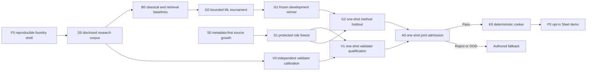

# Roadmap V39: two-lane autonomous ML sound foundry

| Поле | Значение |
| --- | --- |
| Дата rebaseline | `2026-09-03` |
| Статус | `ACTIVE / F0_COMPLETE / F1_NEXT / TWO_LANE_ML_FOUNDRY / PROTECTED_ADMISSION_BLOCKED / OFFLINE_ONLY / AUTHORED_FALLBACK` |
| Заменяет | [Roadmap V38](physical-sound-synthesis-roadmap-v38.md) как planning authority; его source frontier и все terminal evidence остаются точными историческими фактами |
| Текущее evidence | [V39 F0](../development/physical-sound-v39-f0-foundry-preflight-result-2026-09-03.md), [V38 S0](../development/physical-sound-v38-s0-gap-directed-source-result-2026-09-03.md), [V37 D0](../development/physical-sound-v37-d0-fresh-development-result-2026-09-03.md), [V32 validator mechanics](../development/physical-sound-v32-v0a-modal-equivalence-validator-result-2026-09-02.md), [V31 causal contract](../development/physical-sound-v31-p0-causal-baseline-result-2026-09-02.md) и [modal owner](../development/physical-sound-v31-p1-deterministic-modal-owner-result-2026-09-02.md) |
| Архитектура | [SPEC-45](../architecture/45-physical-sound-synthesis-and-acoustic-presentation.md), `Proposed`; current production consumer, public schema и promoting ADR отсутствуют |
| Ограничение владельца продукта | Никаких локальных записей ударов и обязательного ручного прослушивания; реальные данные берутся из опубликованных internet sources, а решение принимает воспроизводимый automatic validator |

## Цель

Построить не одну удачную формулу, а автономную «фабрику звука», которая:

1. собирает и версионирует опубликованные записи и их физический контекст;
2. обучает несколько ограниченных ML-моделей и сравнивает их с простыми
   формулами на одинаковых данных;
3. автоматически отклоняет нефизичные, скопированные и out-of-domain звуки;
4. замораживает один победивший generator и проверяет его на независимых
   проектах ровно один раз;
5. переводит результат в компактный modal/transient recipe и детерминированно
   запекает обычные `48 kHz` clips;
6. всегда сохраняет authored clip как безопасный fallback.

Первая полная победа остаётся узкой: один Steel-impact domain, один canonical
listener и один opt-in prop в demo. Glass и Wood получают отдельные releases;
слово `Glass` или `Wood` само по себе не переносит качество и admission credit.

## Главная смена порядка

V38 правильно поставил real data и независимый validator перед продуктовым
утверждением, но связал даже полезную ML-разработку с недостижимым пока полным
protected split. Точный frontier после IETeasy всё ещё равен дефициту
`6 exact-Steel / 23 non-Metal` для более слабой protected role.

V39 разделяет работу на две честные дорожки:

- **development lane** запускается сейчас на уже раскрытых либо навсегда
  назначенных disclosed-research проектах. Здесь можно обучать, сравнивать и
  улучшать модели, но нельзя объявлять физическую достоверность или выпуск;
- **admission lane** продолжает metadata-first поиск и сохраняет строгие
  project/object-disjoint protected roles. Только она может разрешить cooker и
  demo vertical.

Проект, чей signal попал в development lane, больше никогда не получает
protected роль. Поэтому раннее обучение даёт инженерный прогресс, но не
размывает независимую финальную проверку.

## Уровни результата

| Уровень | Что доказано | Что ещё запрещено |
| --- | --- | --- |
| `MechanicsReady` | Corpus/role/experiment machinery, mutations и terminal outcomes воспроизводятся без real signal. | Любой вывод о звучании материала. |
| `DevelopmentWinner` | Один candidate по замороженному правилу обошёл controls на grouped disclosed development data. | Protected quality claim, cooker, demo promotion. |
| `AdmissionReady` | Независимый validator квалифицирован, generator заморожен, protected roles доступны. | Повторная настройка после открытия holdout. |
| `Admitted` | Frozen generator и validator прошли method holdout и joint shadow. | Runtime model и новый public contract. |
| `ProductVertical` | Deterministic cooker и demo используют cooked clips с exact fallback. | Распространение credit на другие материалы/формы. |

## Неизменяемые границы

1. Audio — presentation-only. Оно не влияет на gameplay hearing, simulation,
   save или replay.
2. Physics owner задаёт causal/modal invariants: signs/nodes, impulse scaling,
   decay bounds, energy, remesh identity и counterfactual behaviour.
3. ML работает offline. Runtime не загружает weights, dataset registry или
   research validator.
4. Dataset payloads, WAV, features, checkpoints, generated runs и cooked
   research atlases остаются во внешнем content-addressed store.
5. Git хранит только code, compact profiles, manifests, hashes, seals,
   provenance references и summaries.
6. Whole project/revision — минимальная единица независимости. Родственные
   файлы, mutations и objects не пересекают disclosed/protected границы.
7. Validator не использует generator outputs для обучения, выбора features или
   thresholds и не разделяет с generator learned artifacts.
8. Неизвестные force, geometry, support, listener или excitation axes дают
   узкий claim либо `FallbackOutOfDomain`, а не угаданные labels.
9. Protected method holdout и joint shadow открываются по одному разу. Они не
   выбирают architecture, checkpoint, seed, threshold или retry.
10. SPEC-45 остаётся `Proposed`; V39 не создаёт production contract или
    ProductCheck до реального consumer и отдельного Accepted ADR.

## Целевая форма решения

Основной candidate не генерирует финальную waveform напрямую. Сеть получает
доступные физические признаки объекта и контакта и предсказывает bounded
`AcousticRecipe` во внешнем research record:

```text
object/material/support/contact evidence
  -> bounded ML parameter estimator
  -> modal frequencies + damping + participation
  -> onset/transient + coloured residual envelope
  -> deterministic reference renderer
  -> canonical PCM clip atlas
```

Точное имя и schema `AcousticRecipe` здесь исследовательские, не публичный API.
Частоты, damping и modal topology остаются ограничены physics owner; ML в
первую очередь учит contact-dependent participation и небольшой residual.
DiffSound или другая prompt-to-audio модель может быть teacher/diagnostic
comparator, но не является validator, источником физической истины или runtime
dependency.

## Потоки работ



S0 продолжается параллельно с F0–G0. Protected access остаётся последовательным
с WIP limit `1`.

## Milestones и exit criteria

| ID | Результат | Состояние | Проверяемый выход |
| --- | --- | --- | --- |
| E0 | Preserve evidence | `COMPLETE` | V37 QSO-v0 закрыт `MetricReject`; V38 frontier `6/23` и все spent identities неизменны. |
| F0 | Foundry shell | `COMPLETE / REPEAT_EXACT_MECHANICS_READY` | Один CLI/profile path валидирует corpus roles, hashes, access ledger, experiment budget, terminal result и atomic external publication; fixture A/B и validate byte-identical, signal/model/network counters zero. |
| F1 | Source-frontier automation | `NEXT` | V30 baseline и IETeasy increment воспроизводят `6/23`; duplicate parent, material inflation, hash drift, in-repo output и partial publication отклоняются. |
| D0 | Permanent disclosed corpus | `AFTER_F0` | Уже раскрытые или явно sacrificed projects назначены только `generator_train`, `generator_development` либо `validator_calibration`; claims/axes/provenance проверены, protected counters zero. |
| B0 | Baseline pack | `AFTER_D0` | На одной grouped evaluation surface воспроизводятся modal owner, nearest/local, ridge, pointwise MLP и retrieval-copy detector; ни один threshold не выбран по candidate output. |
| V0 | Validator calibration | `AFTER_D0_AND_B0` | Integrity, temporal, spectral/modal, frozen representation и OOD specialists заморожены только по validator-calibration projects и labelled mutations. |
| G0 | ML tournament | `AFTER_B0` | Не более двух substantively distinct candidates обучаются и сравниваются внутри frozen compute/iteration budget; все controls, ablations, causal gates и grouped development metrics публикуются автоматически. |
| G1 | Development winner freeze | `AFTER_G0` | Ровно один checkpoint, preprocessing graph, domain envelope, selection rule и cooker preprofile заморожены; иначе terminal `NoCandidate`. |
| S0 | Gap-directed internet discovery | `ACTIVE / FRONTIER_6_23` | Каждая batch содержит не более трёх DOI/versioned primary-source leads и до payload возвращает `ImprovedFrontier`, `Feasible` или `NoEligibleDelta`. |
| S1 | Protected role freeze | `BLOCKED_BY_S0` | Unchanged planner даёт две protected roles с минимум двумя projects и `16 exact-Steel / 35 non-Metal` parent groups каждая плюс пять whole projects для остальных roles; leakage/exposure zero. |
| V1 | Validator qualification | `BLOCKED_BY_S1_AND_V0` | На untouched projects grouped 95% false-pass upper bound `<= 0.10`, useful-coverage lower bound `>= 0.80`, causal corruption suite и leave-project-out проходят один раз. |
| G2 | Generator method holdout | `BLOCKED_BY_S1_AND_G1` | Frozen candidate один раз превосходит preregistered applicable controls по aggregate, contact-only, geometry-only и joint strata без hard/OOD failure. |
| A0 | Joint admission | `BLOCKED_BY_V1_AND_G2` | Frozen generator, validator, domain и cooker preprofile один раз возвращают только `Pass`, `Reject` или `FallbackOutOfDomain`; result atomic. |
| K0 | Deterministic cooker | `BLOCKED_BY_A0_PASS` | Один accepted record дважды создаёт byte-identical bounded `48 kHz` atlas; invalid/stale/OOD input не оставляет partial assets. |
| P0 | Steel demo vertical | `BLOCKED_BY_K0` | Existing audio/content path играет cooked atlas; feature-off, missing, stale, corrupt, query и device faults выбирают exact authored fallback. |
| X0 | Glass/Wood expansion | `AFTER_P0` | Thin goblet, bottle, thick jar и один Wood domain независимо повторяют D0–A0 со своими evidence, roles, thresholds и records. |
| PR | Product promotion | `ADR_REQUIRED_AFTER_P0` | Конкретный consumer и Linux enabled/disabled/fault/cost ProductChecks обосновывают минимальный contract и Accepted ADR. |

## Automatic validator

Validator принимает решение конъюнкцией независимых слоёв:

| Слой | Что ловит |
| --- | --- |
| Integrity/provenance | Неканонический PCM, clipping/DC, повреждение, drift identity, неполные axes или lineage. |
| Causal physics | Неверный onset, энергия до удара, нарушенная impulse/gain monotonicity, decay/remesh/counterfactual defects. |
| Spectral/modal | Mode collapse/drift, чрезмерно металлический carrier, bandwidth starvation, unstable partials и repeated spectrum. |
| Frozen audio representation | Расстояние до независимых real parent groups без использования text score как release authority. |
| Grouped risk/OOD | Project concentration, unsupported conditions, leave-project-out risk, confidence bounds и abstention. |
| Retrieval guard | Копирование reference/nearest clip, leakage и одинаковый carrier под разными физическими условиями. |

Hard defect даёт `Reject`; недостаточная coverage или disagreement даёт
`FallbackOutOfDomain`. Человек может слушать diagnostic preview, но его выбор не
входит в threshold, ranking или release decision.

## Autonomous development loop

Каждая G0-итерация выполняется машиной целиком:

1. читает immutable experiment profile и проверяет data/code/environment roots;
2. обучает candidate на `generator_train`;
3. считает controls и candidate на grouped `generator_development`;
4. запускает causal, spectral, OOD, retrieval, ablation и resource checks;
5. применяет заранее замороженный selection/stopping rule;
6. публикует compact report и либо запускает следующую разрешённую iteration,
   либо возвращает `DevelopmentWinner`/`NoCandidate`;
7. не читает protected roles до отдельного G1 freeze.

Автоматизация может менять только заранее перечисленные knobs в пределах
budget. Новый model family требует нового profile до target access, а не
подстройки после плохого результата.

## Упорядоченная очередь реализации

1. **V39.0 — complete:** принять two-lane rebaseline, не меняя V38 frontier и
   strict admission gates.
2. **V39.1 — complete:** [F0](../development/physical-sound-v39-f0-foundry-preflight-result-2026-09-03.md)
   повторяет target-free profile/runner/report byte-exactly, закрывает role/access
   mutations и публикует только `MechanicsReady` с нулевым forbidden access.
3. **V39.2 — next:** автоматизировать F1 source frontier; воспроизвести V30 + IETeasy
   как checked profile и exact external A/B report.
4. **V39.3:** заморозить permanent disclosed roster и построить D0 corpus
   projection; ни один его project больше не резервируется для protection.
5. **V39.4:** выпустить B0 baseline pack и V0 validator-calibration protocol.
6. **V39.5:** провести первый G0 tournament: bounded modal-parameter model
   против modal/ridge/pointwise/local controls. При отсутствии победителя
   завершить `NoCandidate`, а не открывать holdout.
7. **V39.6:** параллельно продолжать bounded S0 batches до `Feasible` или
   `NoEligibleDelta`; отсутствие новых sources не отменяет disclosed research.
8. **V39.7:** после S1 один раз выполнить V1 и G2; любой reject закрывает
   revision без retune по открытым protected значениям.
9. **V39.8:** после V1+G2 Pass выполнить A0, затем K0/P0.
10. **V39.9:** после Steel P0 выбрать следующий материал только по source power;
    каждый Glass archetype и Wood проходят собственный release.
11. **V39.10:** только после работающего P0 подготовить promotion ADR и
    affected Linux ProductChecks.

## Stop rules

- Не переоткрывать V37 QSO-v0, V36/V35 roles или spent targets и не выбирать
  nearby knobs по их значениям.
- Не считать disclosed winner доказательством натуральности, материала или
  product readiness.
- Не ослаблять exact-Steel, `16/35`, whole-project independence или validator
  risk/coverage gates ради удобства acquisition.
- Не переносить disclosed project обратно в protected pool.
- Не использовать prompt similarity, один красивый WAV или human preference
  как automatic release authority.
- Не делать waveform model runtime dependency; cooker output остаётся обычным
  bounded asset с authored fallback.
- `NoEligibleDelta`, `NoCandidate`, `Reject` и `FallbackOutOfDomain` являются
  корректными terminal outcomes и не создают partial release.
- До P0 нет production capability claim; до Accepted ADR нет нового public
  runtime contract.

## Проверка F0

F0 проходит `9/9` focused Python tests и официальный внешний fixture A/B плюс
validate с одним byte-identical пятифайловым деревом. Hash-bound Rust neural
data-plane проходит `10/10` focused tests. Общий `boundary-scan` сохраняет
известный legacy `SOURCE_LAYOUT_ESCAPE_HATCH` в `realimpact_transfer_fixture.rs`;
F0 не добавляет и не использует его. ProductChecks не применимы: production
consumer, public schema и runtime-consumed data не меняются.
