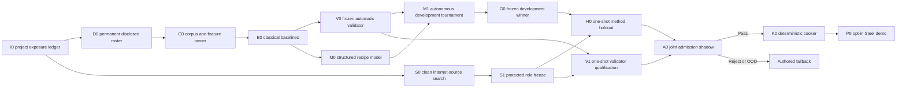

# Roadmap V40: evidence-clean neural sound factory

| Поле | Значение |
| --- | --- |
| Дата rebaseline | `2026-09-03` |
| Статус | `ACTIVE / I0_COMPLETE_SOURCE_POWER_OOD / D0_NEXT / S0_CLEAN_GROWTH_OPEN / OFFLINE_ONLY / AUTHORED_FALLBACK` |
| Заменяет | [Roadmap V39](physical-sound-synthesis-roadmap-v39.md) как planning authority; F0/F1 и все прежние terminal results остаются историческим evidence |
| Причина | [Project-independence correction](../development/physical-sound-v40-project-independence-rebaseline-2026-09-03.md): V39's `6/23` is an exact replay, but ObjectFolder and YCB already have opened signal and cannot supply current protected credit without a new whole-project audit |
| Архитектура | [SPEC-45](../architecture/45-physical-sound-synthesis-and-acoustic-presentation.md), `Proposed`; production consumer, public schema и promoting ADR отсутствуют |
| Ограничение владельца продукта | Только опубликованные internet sources; никаких локальных ударов, микрофона и обязательного ручного одобрения каждого звука |

## Конечный результат

Первый законченный vertical — один Steel prop в demo-сцене. При столкновении
он играет звук, который:

1. создан обученной моделью как ограниченный физический recipe;
2. автоматически проверен независимым validator;
3. заранее и детерминированно запечён в обычный `48 kHz` clip atlas;
4. не влияет на simulation, save, replay или gameplay hearing;
5. при любой ошибке заменяется существующим authored clip.

После Steel тот же pipeline запускается независимо для Wood и трёх отдельных
Glass domains: thin goblet, bottle и thick jar. Общего разрешения «на стекло»
по одному удачному бокалу не существует.

## Что меняется относительно V39

V39 правильно разделил development и admission, но перенёс в новый строгий
режим старый расчёт source power. V40 сначала приводит историю доступа к той же
единице независимости, которую требует финальный экзамен.

- Любой открытый waveform, feature или target навсегда делает весь доказанный
  project/revision family `disclosed`.
- Metadata-only просмотр не тратит project, но и не даёт ему freshness credit.
- Изменение metadata hash не создаёт новую независимую аудиоревизию.
- Связанные коллекции одного физического объекта объединяются alias edges и не
  могут оказаться по разные стороны disclosed/protected границы.
- [I0](../development/physical-sound-v40-i0-project-exposure-result-2026-09-03.md)
  установил clean frontier `9 Steel / 7 non-Metal` в девяти проектах. Лучшие
  две роли сохраняют пять reserve projects, но имеют дефициты `13/34` и
  `13/31`; состояние — `SourcePowerOOD`, а не прежнее `6/23`.

Это не блокирует обучение. ObjectFolder, открытый YCB и REALIMPACT становятся
полезным постоянным disclosed corpus; они просто больше не изображают слепой
экзамен.

## Архитектура решения

ML development and clean-source discovery proceed in parallel. Protected
access remains sequential with WIP limit `1`.

## Модель: нейросеть учит recipe, а не притворяется физикой

Первая модель `StructuredRecipeNet-v0` получает только доступные и маскированные
признаки материала, формы, support и contact. Она предсказывает:

- bounded correction к object-global modal frequency/damping;
- contact-dependent modal participation/gain;
- onset/transient envelope;
- небольшой coloured-residual envelope и uncertainty/OOD score.

Deterministic renderer превращает это в PCM. Physics owner остаётся жёсткой
рамкой: signs/nodes, impulse scaling, energy, decay, remesh identity и causal
counterfactuals сеть отменить не может. Прямая waveform/diffusion model остаётся
только diagnostic comparator, пока structured model не исчерпан честным
development tournament.

## Кто валидирует

Решение принимает замороженный ансамбль, обученный и откалиброванный отдельно
от generator:

| Слой | Роль |
| --- | --- |
| Deterministic integrity | PCM canonicality, clipping/DC, onset, energy, decay, remesh и provenance/hash failures |
| Physics/metamorphic tests | monotonic impulse/gain, invariant poles, contact/geometry interventions и known corruptions |
| Frozen audio representation | Расстояние до validator-only real groups; embedding family выбирается до просмотра generator outputs |
| Grouped statistics/OOD | Leave-project-out risk, uncertainty, project concentration и abstention |
| Retrieval/leakage guard | Exact/near copy, shared carrier и train/reference leakage |

Hard defect возвращает `Reject`; нехватка coverage или disagreement —
`FallbackOutOfDomain`. Прослушивание человеком разрешено как debugging preview,
но не выбирает thresholds, candidate, checkpoint или release.

## Milestones и exit criteria

| ID | Состояние | Проверяемый выход |
| --- | --- | --- |
| R0 | `COMPLETE` | V39 F0/F1 сохранены; `6/23` помечен historical replay, а не current admission frontier. |
| I0 | `COMPLETE / SOURCE_POWER_OOD` | [Zero-signal audit](../development/physical-sound-v40-i0-project-exposure-result-2026-09-03.md) accounted `11/11` candidate projects, permanently disclosed nine opened families, quarantined ObjectFolder/YCB power and repeat-exactly established clean `9/7`; no role or payload opened. |
| D0 | `NEXT` | ObjectFolder, opened YCB/REALIMPACT и другие spent families навсегда распределены между `generator_train`, `generator_development` и `validator_calibration`; roles parent-disjoint, protected counters zero. |
| C0 | `AFTER_D0` | Один external content-addressed corpus owner выдаёт canonical `48 kHz` segments, observed-axis masks, modal/transient targets и immutable train/dev/calibration projections без данных в Git. |
| B0 | `AFTER_C0` | На общей grouped surface воспроизводятся modal owner, nearest/local, ridge, pointwise MLP и retrieval-copy controls. |
| V0 | `AFTER_B0` | Validator specialists, embedding choice, mutations, thresholds, aggregation, OOD и stopping rule заморожены только на validator-calibration projects. |
| M0 | `AFTER_B0` | `StructuredRecipeNet-v0` и не более одного substantively distinct neural comparator проходят complete-entry/resource preflight без protected access. |
| M1 | `AFTER_M0_AND_V0` | Автономный runner обучает candidates, считает controls/ablations/validator metrics и останавливается по frozen budget с `DevelopmentWinner` либо `NoCandidate`. |
| G0 | `AFTER_M1_WIN` | Заморожены ровно один checkpoint, preprocessing graph, domain envelope, selection report и cooker preprofile; development quality не даёт admission credit. |
| S0 | `OPEN / PARALLEL` | Bounded metadata-first batches ищут только clean project families против точных дефицитов `13/34` и `13/31`; каждый lead завершает `ImprovedFrontier`, `Feasible` либо `NoEligibleDelta` до payload access. |
| S1 | `BLOCKED_BY_S0` | Новый exact frontier даёт две protected roles по `>=2` projects и `16 exact-Steel / 35 non-Metal` parent groups каждая плюс пять whole projects для остальных one-use roles; leakage/exposure zero. |
| V1 | `BLOCKED_BY_S1_AND_V0` | Frozen validator один раз достигает grouped 95% false-pass upper bound `<=0.10`, useful-coverage lower bound `>=0.80` и проходит causal/leave-project-out suite. |
| H0 | `BLOCKED_BY_S1_AND_G0` | Frozen generator один раз превосходит applicable baselines в aggregate, contact-only, geometry-only и joint strata без hard/OOD failure. |
| A0 | `BLOCKED_BY_V1_AND_H0` | Один joint shadow возвращает atomic `Pass`, `Reject` или `FallbackOutOfDomain`; никаких retries по открытым значениям. |
| K0 | `BLOCKED_BY_A0_PASS` | Два cook запуска создают byte-identical bounded atlas; invalid/stale/OOD input не оставляет partial assets. |
| P0 | `BLOCKED_BY_K0` | Demo prop играет cooked atlas через existing audio/content path; feature-off, missing, stale, corrupt, query и device faults выбирают exact authored fallback. |
| X0 | `AFTER_P0` | Wood и каждый Glass domain повторяют D0–A0 со своими data power, thresholds и records. |
| PR | `AFTER_WORKING_P0 / ADR_REQUIRED` | Конкретный consumer и Linux enabled/disabled/fault/cost checks обосновывают минимальный production contract. |

## Автономный цикл разработки

Одна разрешённая M1 iteration:

1. проверяет immutable profile, code/environment/data roots и access ledger;
2. обучает candidate только на `generator_train`;
3. считает baselines и candidate на grouped `generator_development`;
4. прогоняет frozen validator, causal mutations, OOD, retrieval и ablations;
5. публикует compact report, resource accounting и hashes во внешний store;
6. применяет preregistered selection/stopping rule;
7. либо продолжает в пределах бюджета, либо завершает
   `DevelopmentWinner`/`NoCandidate` без чтения protected roles.

Разрешённые knobs и число iterations фиксируются до первого target access.
Новая model family требует нового profile; плохой результат не разрешает
локально двигать threshold или выбирать удобный объект.

## Упорядоченный implementation queue

1. **V40.1 — I0 — COMPLETE:** проектно-ревизионный exposure/alias ledger
   установил clean frontier `9/7` и terminal `SourcePowerOOD`.
2. **V40.2 — D0 — NEXT:** заморозить permanent disclosed roster и три непересекающихся
   development roles.
3. **V40.3 — C0:** нормализовать disclosed payloads в hash-closed external
   corpus с axis masks и deterministic features.
4. **V40.4 — B0:** объединить физический renderer и простые baselines на одной
   evaluation surface.
5. **V40.5 — V0:** откалибровать automatic validator на отдельных проектах и
   искусственных causal/spectral corruptions до generator tournament.
6. **V40.6 — M0/M1:** обучить structured recipe model, провести bounded
   autonomous tournament и заморозить winner либо честный `NoCandidate`.
7. **V40.7 — S0/S1:** параллельно растить только чистый интернет-пул; protected
   роли замораживать лишь после exact feasible partition.
8. **V40.8 — V1/H0/A0:** провести три one-shot protected gate без retune.
9. **V40.9 — K0/P0:** запечь atlas и включить один opt-in Steel prop с полным
   fault/fallback покрытием.
10. **V40.10 — X0/PR:** повторить pipeline для Wood/Glass; promotion ADR писать
    только после работающего Steel vertical.

## Commit boundaries для реализации

| Commit | Содержимое |
| --- | --- |
| A | I0 profile/owner/tests/result, corrected frontier и task-state update |
| B | D0 disclosed roster/projection, access mutations и repeat-exact evidence |
| C | C0 canonical corpus/features plus B0 baselines |
| D | V0 validator calibration, corruption suite и frozen decision profile |
| E | M0/M1 model/tournament runner и development terminal result |
| F+ | Каждый protected one-shot gate, cooker и demo integration отдельным coherent checkpoint |

## Stop rules

- Не использовать историческое `6/23` как текущую protected-оценку; I0
  установил clean `9/7`, но protected roles остаются `SourcePowerOOD`.
- Не возвращать exposed project family в protected pool через новый metadata
  hash, object ID, filename или другой adapter.
- Не путать повторения/контакты одного объекта с независимыми parent groups.
- Не считать development winner доказательством натуральности или готовности к
  demo; право на cooker даёт только A0 `Pass`.
- Не использовать prompt similarity, human preference или один красивый WAV
  как release authority.
- Не делать runtime neural inference первым путём; runtime получает только
  cooked clips и exact authored fallback.
- Не ослаблять `16/35`, project disjointness, validator risk/coverage или
  one-shot rule ради удобства acquisition.
- `NoEligibleDelta`, `NoCandidate`, `Reject` и `FallbackOutOfDomain` — нормальные
  terminal outcomes без partial publication.

## Product checks

До и включая opt-in experimental P0 работа остаётся в границах SPEC-45
`Proposed`: focused owner/integration tests и boundary scan проверяют tooling и
fallback, но не создают ProductCheck credit или public contract. Только PR
требует promoting ADR, после которого применяются focused `fast`, `play`,
`content-package`, `persistence-replay` и условные Linux
`platform`/`performance` checks согласно routing table.
