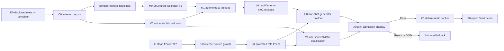

# Roadmap V41: two-speed neural physical sound

| Поле | Значение |
| --- | --- |
| Дата | `2026-09-03` |
| Статус | `ACTIVE / D0_COMPLETE / C0_NEXT / DISCLOSED_LAB_FIRST / PROTECTED_ADMISSION_SOURCE_POWER_OOD / OFFLINE_ONLY / AUTHORED_FALLBACK` |
| Заменяет | [Roadmap V40](physical-sound-synthesis-roadmap-v40.md) как planning authority; I0/D0 и все terminal results сохраняются как exact evidence |
| Архитектура | [SPEC-45](../architecture/45-physical-sound-synthesis-and-acoustic-presentation.md), `Proposed`; public/runtime contract и production consumer не продвигаются этим roadmap |
| Ограничение владельца продукта | Данные берутся из опубликованных internet sources; локальные удары, микрофон и ручное одобрение каждого звука не требуются |

## Решение в одном абзаце

Сначала строим полезную лабораторию на девяти уже раскрытых project families:
единый внешний корпус, автоматический validator, простые baselines и небольшая
нейросеть, которая предсказывает ограниченный sound recipe. Этот цикл может
автономно улучшать Steel-звук и выпускать audition clips, но не имеет права
включать их в продукт. Параллельно отдельный metadata-first трек ищет новые
независимые internet sources. Только один замороженный лабораторный winner
проходит независимые one-shot проверки, после чего обычные `48 kHz` clips
детерминированно запекаются для demo-сцены. Любой reject, OOD или сбой выбирает
authored fallback.

## Почему новый порядок практичнее

Предыдущие итерации доказали, что искать одну точную формулу для любого предмета
слишком хрупко: записи редко содержат одновременно материал, форму, точку удара,
силу, опору и положение слушателя. Но для обучения уже есть много частичной
информации. V41 использует её явно, не выдавая слабые labels за полную физическую
истину.

| Уровень supervision | Что реально известно | Для чего используется |
| --- | --- | --- |
| A — identified recording | project, object, material, waveform | material/object representation, reconstruction и negative examples |
| B — extracted acoustic target | modal peaks, decay, onset, envelope, coloured residual, extraction uncertainty | обучение и сравнение bounded recipes; это pseudo-target, не измеренная механика |
| C — physical transfer | geometry/contact/listener/support и force-deconvolved response там, где они опубликованы | geometry/contact heads, causal tests и проверка физической согласованности |

У каждой строки есть observed-axis mask. Неизвестная сила, толщина или опора не
заполняется догадкой и не участвует в соответствующем loss. Один физический
объект со многими ударами всё равно считается одним parent group.

## Две скорости работы

### Быстрый disclosed lab loop

Этот путь использует только permanently disclosed families и может повторяться.
Его результат — исследовательский `LabWinner`, audition clips или честный
`NoCandidate`. Он не даёт admission credit, не открывает protected data и не
меняет runtime.

### Медленный independent admission loop

Этот путь одноразовый и начинается только после достаточного clean source power.
Он проверяет validator, generator и их совместное решение на независимых whole
projects. Открытый project никогда не возвращается в protected pool.

## Что именно обучаем

`StructuredRecipeNet-v1` не генерирует произвольный waveform. Он предсказывает
ограниченный recipe:

- object-global modal frequencies и damping с bounded correction к
  deterministic modal owner;
- contact-dependent signed participation/gain только при известных contact
  axes;
- короткий onset/transient envelope;
- малый coloured-residual envelope;
- uncertainty и OOD score для каждой недостающей или неподдержанной области.

Deterministic renderer синтезирует waveform из recipe. Energy bounds, decay,
impulse scaling, pole invariance, remesh identity и finite-value checks остаются
необходными ограничениями. Прямая prompt-to-waveform/diffusion модель может быть
только diagnostic comparator и не становится первым runtime или release path.

## Кто автоматически оценивает качество

Validator — отдельный frozen ensemble, а не та же сеть и не человек:

1. canonical PCM, clipping, DC, silence, onset, energy и decay hard checks;
2. physics/metamorphic tests на impulse, contact, geometry и известные
   corruptions;
3. frozen audio embedding и расстояние до validator-calibration real groups;
4. grouped OOD/risk estimator с leave-project-out статистикой;
5. exact/near-copy и shared-carrier leakage guard;
6. aggregation rule: `Pass`, `Reject` или `FallbackOutOfDomain`.

Архитектура embedding, mutations и thresholds замораживается до просмотра
generator outputs. Прослушивание остаётся необязательным debugging preview и не
выбирает checkpoint, threshold или release.

## Milestones и критерии выхода

| ID | Состояние | Проверяемый выход |
| --- | --- | --- |
| I0 | `COMPLETE / SOURCE_POWER_OOD` | Exact clean frontier остаётся `9 Steel / 7 non-Metal`; лучшие protected roles имеют дефициты `13/34` и `13/31`. |
| D0 | `COMPLETE` | Девять disclosed families навсегда заморожены как `5 generator-train / 2 generator-development / 2 validator-calibration`; protected access равен нулю. |
| C0 | `NEXT` | Один external content-addressed owner связывает exact D0 root, проверяет каждый source hash, создаёт canonical mono `48 kHz` segments, parent IDs, observed-axis masks, acoustic targets/uncertainty и immutable train/development/calibration projections. Два запуска дают одинаковое дерево; dataset/WAV/features остаются вне Git. |
| B0 | `AFTER_C0` | На одной grouped surface воспроизводятся retrieval-copy, global/modal prototype, nearest/local, ridge и малый pointwise MLP. Они задают обязательный минимум для сети. |
| V0 | `AFTER_C0` | Validator-only projects и synthetic corruptions замораживают specialists, embedding, thresholds, OOD и aggregation без generator outputs. Calibration pass разрешает только lab tournament. |
| M0 | `AFTER_C0_AND_B0` | StructuredRecipeNet-v1, losses/masks, deterministic renderer, не более одного distinct comparator, budgets и complete-entry checks заморожены до target access. |
| M1 | `AFTER_M0_AND_V0` | Autonomous runner обучает только на generator-train, сравнивает на grouped generator-development, считает ablations/leakage/OOD и останавливается по frozen budget. |
| L0 | `AFTER_M1` | Публикуется ровно один external `LabWinner` bundle либо `NoCandidate`; audition clips разрешены, product/admission authority — нет. |
| S0 | `OPEN / PARALLEL` | Bounded metadata-first поиск улучшает independent project frontier либо завершает batch как `NoEligibleDelta`; payload не открывается до решения о роли. |
| S1 | `BLOCKED_BY_S0` | Две protected роли имеют каждая `>=2` independent projects и `16 exact-Steel / 35 non-Metal` parent groups, ещё пять whole projects зарезервированы для остальных one-use ролей; exposure/leakage zero. |
| V1 | `BLOCKED_BY_S1_AND_V0` | Frozen validator один раз достигает grouped 95% false-pass upper bound `<=0.10`, useful-coverage lower bound `>=0.80` и проходит causal/leave-project-out suite. |
| H0 | `BLOCKED_BY_S1_AND_L0` | Frozen LabWinner один раз превосходит applicable baselines в aggregate, contact-only, geometry-only и joint strata без hard/OOD failure. |
| A0 | `BLOCKED_BY_V1_AND_H0` | Один joint shadow возвращает atomic `Pass`, `Reject` или `FallbackOutOfDomain`; значения не используются для retry или retune. |
| K0 | `BLOCKED_BY_A0_PASS` | Два независимых cook запуска создают byte-identical bounded Steel atlas и complete fallback map; invalid/stale input не оставляет partial assets. |
| P0 | `BLOCKED_BY_K0` | Один opt-in Steel prop в demo-сцене использует существующий audio/content path; feature-off, missing, corrupt, stale, query и device faults выбирают exact authored fallback. |
| X0 | `AFTER_P0` | Wood, thin goblet, bottle и thick jar получают отдельные corpora, thresholds, winners и admission records; Steel pass не переносится на них. |
| PR | `AFTER_WORKING_P0 / ADR_REQUIRED` | Только реальный consumer и Linux enabled/disabled/fault/cost evidence обосновывают минимальный production contract. |

## Автономная M1 iteration

Одна iteration выполняет только заранее разрешённые действия:

1. проверяет code/environment/data/profile roots и access ledger;
2. обучает candidate на `generator_train` с per-target masks;
3. считает baselines и candidate на grouped `generator_development`;
4. запускает frozen validator, causal mutations, OOD, retrieval и ablations;
5. публикует compact metrics, recipes, resource accounting и hashes во внешний
   store;
6. применяет preregistered ranking и stopping rule;
7. продолжает в пределах бюджета или завершает `LabWinner`/`NoCandidate`.

Изменение model family, loss surface, validator или selection rule создаёт новый
profile. Оно не может быть скрытой дополнительной iteration по уже просмотренным
protected values.

## Упорядоченный implementation queue

1. **V41.1 — C0:** построить реальный disclosed corpus и доказать A/B exactness,
   parent isolation и полноту axis masks.
2. **V41.2 — B0:** запустить простые baselines и зафиксировать grouped surface,
   которую обязана превзойти сеть.
3. **V41.3 — V0:** собрать автоматический validator и corruption suite отдельно
   от generator.
4. **V41.4 — M0:** заморозить recipe schema, renderer, masked losses, budget и
   model/comparator families.
5. **V41.5 — M1/L0:** запустить автономный tournament до `LabWinner` либо
   `NoCandidate`; выпустить external audition bundle без product claim.
6. **V41.6 — S0/S1:** параллельно продолжать internet-source discovery и
   заморозить protected roles только при exact feasible frontier.
7. **V41.7 — V1/H0/A0:** выполнить три one-shot independent gates с WIP `1`.
8. **V41.8 — K0/P0:** при A0 `Pass` запечь atlas и подключить один Steel prop с
   полным fallback/fault coverage.
9. **V41.9 — X0/PR:** повторить доказательство для Wood/Glass; писать promoting
   ADR только после работающего Steel vertical.

## Commit boundaries

| Commit | Содержимое |
| --- | --- |
| A | C0 profile/owner/tests, external repeat-exact result и corpus card |
| B | B0 baselines и grouped evaluation surface |
| C | V0 validator specialists, mutations, leakage/OOD tests и frozen profile |
| D | M0 recipe/model/renderer preflight без официального training result |
| E | M1/L0 autonomous runner и terminal `LabWinner` или `NoCandidate` evidence |
| F+ | Каждый protected gate, cooker и demo integration отдельным coherent checkpoint |

## Stop rules

- Не ждать S1, чтобы строить disclosed lab, но никогда не называть `LabWinner`
  независимым доказательством или готовым игровым звуком.
- Не считать extracted modes/damping измеренными material constants; это
  waveform-derived pseudo-targets с uncertainty.
- Не смешивать train/development/validator descendants одного project family и
  не считать contacts/repeats независимыми parents.
- Не выбирать validator representation или thresholds по generator outputs.
- Не ослаблять `16/35`, project disjointness, risk/coverage или one-shot rules
  ради удобства acquisition.
- Не добавлять datasets, source WAV, features, checkpoints, generated clips,
  caches или credentials в Git; provenance и redistribution eligibility
  остаются обязательными.
- Не делать runtime inference первым путём: продукт получает только cooked clips
  и authored fallback.
- `CorpusIncomplete`, `NoEligibleDelta`, `NoCandidate`, `Reject` и
  `FallbackOutOfDomain` — допустимые terminal outcomes без partial publication.

## Product checks

До P0 работа остаётся экспериментальной в границах SPEC-45 `Proposed`. Для C0–L0
нужны focused owner/tests, exact external A/B replay и boundary scan, но они не
создают ProductCheck credit или public contract. P0 дополнительно требует
focused `play`, `content-package`, `persistence-replay` и применимые Linux
`platform`/`performance` checks. Любое production promotion требует отдельный
Accepted ADR и обновление SPEC/routing traceability.
