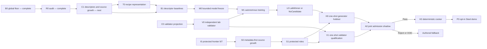

# Roadmap V42: descriptor-first neural physical sound

| Поле | Значение |
| --- | --- |
| Дата | `2026-09-03` |
| Статус | `ACTIVE / R0_COMPLETE / C1_NEXT / V0_READY / CORPUS_SIGNAL_INSUFFICIENT / PROTECTED_ADMISSION_SOURCE_POWER_OOD / OFFLINE_ONLY / AUTHORED_FALLBACK` |
| Заменяет | [Roadmap V41](physical-sound-synthesis-roadmap-v41.md) как planning authority после terminal B0; D1/C0/B0 и все предыдущие terminal results остаются immutable exact evidence |
| Архитектура | [SPEC-45](../architecture/45-physical-sound-synthesis-and-acoustic-presentation.md), `Proposed`; roadmap не продвигает public schema, runtime model или production consumer |
| Ограничение владельца продукта | Только опубликованные internet sources; никаких локальных ударов/микрофона и обязательного ручного прослушивания каждого звука |

## Решение

[B0](../development/physical-sound-v41-b0-grouped-baseline-result-2026-09-03.md)
показал, что на текущих данных coarse material label недостаточно: простой
глобальный прототип обгоняет material prototype, retrieval, nearest, ridge и
маленький MLP. [R0](../development/physical-sound-v42-r0-domain-information-audit-result-2026-09-03.md)
уточнил причину: source project хорошо угадывается по acoustic target
(`0.763333333` balanced accuracy, permutation `p=0.000488162`), а coarse
material при строгом leave-project-out ухудшает median RMSE на `12.29%`.
Простое oracle project-centering материал не спасает. Поэтому мы не запускаем
более крупную сеть вслепую и не пытаемся вычесть один «почерк микрофона».

Следующий критический шаг — C1: собрать из опубликованных источников достаточное
число независимых parents и доступные движку признаки предмета — форму, размеры,
полость, толщину, материал, опору и точку удара. B1 должен доказать, что эти
признаки предсказывают звук лучше глобального среднего. Параллельно V0
замораживает независимый автоматический validator. Только после обоих
доказательств маленькая нейросеть может учить bounded residual к
детерминированной физической основе.

Конечный продукт не запускает сеть во время игры. Он получает обычный набор
детерминированно запечённых `48 kHz` clips и полный authored fallback.

## Что уже доказано

| Evidence | Результат | Практическое значение |
| --- | --- | --- |
| D1 component roster | `COMPLETE / REPEAT_EXACT` | Один Blue Bowl больше не пересекает generator и validator roles. |
| C0 disclosed corpus | `COMPLETE / REPEAT_EXACT` | 139 записей, 278 PCM/feature objects, 67 физических parents и immutable `44 train / 70 development / 25 validator` projections существуют во внешнем store. |
| B0 baseline surface | `COMPLETE / REPEAT_EXACT` | Глобальный prototype задаёт floor: median parent RMSE `1.337593650`; ridge `1.443077073`, MLP `1.484006315`. |
| R0 domain/information audit | `COMPLETE / REPEAT_EXACT / CORPUS_SIGNAL_INSUFFICIENT` | Project signal силён, но coarse material проигрывает global в cross-project test; planning floor — `125` supported evaluation parents. |
| Steel specialization | `NOT_ESTABLISHED` | В train нет exact Steel; три development Steel parents проверяют только перенос coarse `metallic`. |
| Independent admission | `SOURCE_POWER_OOD` | Protected role frontier всё ещё не закрывает дефициты `13/34` и `13/31`. |
| Product/runtime | `NOT_PROMOTED` | SPEC-45 остаётся `Proposed`; demo и runtime продолжают использовать authored clips. |

## Основная гипотеза V42

Полезный генератор возможен, если разделить задачу на четыре части:

```text
runtime-available object descriptors
        + deterministic physical/modal prior
        -> small bounded neural residual
        -> explicit sound recipe
        -> deterministic renderer
        -> cooked clip atlas
```

Сеть не должна угадывать waveform из одного слова `Steel`. Её вход — только то,
что можно получить при authoring/cook и воспроизвести в продукте. Project ID,
имя файла, источник записи, waveform и audio-derived target запрещены как
generator inputs. Они могут использоваться лишь для supervision, grouping и
диагностики domain shift.

Сеть предсказывает не произвольные samples, а ограниченный recipe:

- базовую частоту/масштаб и упорядоченные modal ratios;
- положительный damping/decay;
- bounded modal participation для известной зоны удара;
- нормализованный onset/transient envelope;
- малый coloured-residual envelope;
- uncertainty, support mask и OOD state.

Analytic owner сохраняет положительный damping, порядок мод, energy bounds,
impulse scaling и remesh invariants. Любое неподдержанное сочетание возвращает
`FallbackOutOfDomain`.

## Три независимых контура



The disclosed lab may iterate because every value is already permanently
disclosed. The independent admission lane remains one-shot. A `LabWinner` is a
research candidate, never a release decision.

## Milestones и falsifiable exits

| ID | Состояние | Проверяемый выход |
| --- | --- | --- |
| B0 | `COMPLETE / REPEAT_EXACT` | Six baselines share one 105-D masked grouped surface. Global prototype is the immutable floor; validator/protected/PCM/network access is zero. |
| R0 | `COMPLETE / REPEAT_EXACT / CORPUS_SIGNAL_INSUFFICIENT` | On 46 strict cross-project parents, material median relative improvement is `-0.122864043`, bootstrap 95% `[-0.168145282, -0.050277002]`; project balanced accuracy is `0.763333333`, `p=0.000488162`; oracle centering also fails. No candidate was trained. |
| V0 | `READY / INDEPENDENT` | Using only validator-calibration real groups plus frozen lawful/corrupt mutations, freeze integrity, temporal, spectral/modal, embedding, retrieval, OOD and aggregation specialists before generator outputs. This establishes mechanics only, not real admission quality. |
| C1 | `NEXT / INTERNET_ONLY` | Add runtime-available parent descriptors with source/provenance and missingness masks; audio-derived values never enter inputs. Grow toward R0's planning floor of `125` supported evaluation parents under metadata-first whole-project roles. Exact Steel training requires at least two independent generator-train project families; otherwise Steel remains transfer/OOD. |
| T0 | `AFTER_C1_DESCRIPTOR_CONTRACT` | Freeze explicit recipe V2, masks, uncertainty, permitted source-nuisance treatment and deterministic renderer. Synthetic roundtrip, scale, decay, ordering, remesh, finite/resource and mutation gates repeat exactly. |
| B1 | `AFTER_T0_AND_C1` | Global B0 floor, descriptor prototype, kNN/medoid and masked ridge run on the same grouped leave-project-out surface. Best descriptor baseline must improve paired median RMSE by `>=5%`, have positive grouped-bootstrap 95% lower improvement bound, not regress P90 and avoid unsupported-material claims. Otherwise return to C1, not M0. |
| M0 | `BLOCKED_BY_B1_SIGNAL` | Freeze one compact `StructuredRecipeNet-v2`, at most one substantively distinct comparator, exact inputs/outputs, masked losses, physics projection, ablations, seed/budget/stopping rule and complete-entry/atomicity tests before candidate values. |
| M1 | `BLOCKED_BY_M0_AND_V0` | Train only on generator-train. Rank on grouped generator-development against global and best B1 baseline; report per-project/material/recipe-group deltas, retrieval, OOD, uncertainty, ablations and resource use automatically. |
| L0 | `AFTER_M1` | Publish exactly one external `LabWinner` or `NoCandidate`. Winner must beat both required floors, pass V0 and causal constraints, and carry model/data/profile hashes plus generated audition clips. It has no product authority. |
| S0 | `OPEN / PARALLEL` | Continue bounded metadata-first internet search. Open no payload before whole-project role assignment; publish `EligibleDelta` or `NoEligibleDelta`. |
| S1 | `BLOCKED_BY_S0` | Each protected role has `>=2` independent projects and `16 exact-Steel / 35 non-Metal` parent groups, plus five untouched whole-project reserves; exposure/leakage remains zero. |
| V1 | `BLOCKED_BY_S1_AND_V0` | Frozen validator once achieves grouped 95% false-pass upper bound `<=0.10`, useful-coverage lower bound `>=0.80`, causal-mutation and leave-project-out gates. |
| H0 | `BLOCKED_BY_S1_AND_L0` | Frozen LabWinner once beats applicable global/descriptor baselines in aggregate and supported strata without hard/OOD failure. |
| A0 | `BLOCKED_BY_V1_AND_H0` | One joint shadow atomically returns `Pass`, `Reject` or `FallbackOutOfDomain`; no retry or retune from its values. |
| K0 | `BLOCKED_BY_A0_PASS` | Two independent cooks create byte-identical bounded Steel atlas, manifest and complete fallback map; invalid/stale input publishes nothing. |
| P0 | `BLOCKED_BY_K0` | One opt-in Steel prop in the existing demo scene uses the normal audio/content path. Feature-off, missing, corrupt, stale, query and device faults select exact authored fallback. |
| X0 | `AFTER_WORKING_P0` | Glass-thin, bottle, thick-jar and Wood become separate material/archetype packs with fresh data power, model, validator and admission records; Steel evidence is not inherited. |
| PR | `AFTER_WORKING_P0 / ADR_REQUIRED` | A concrete Linux consumer plus enabled/disabled/fault/cost evidence may justify the smallest Accepted production contract. |

## R0: что именно сломано — COMPLETE

R0 ничего не обучал и вернул terminal `CorpusSignalInsufficient`. Среди `42`
eligible parents акустический target узнаёт source project с balanced accuracy
`0.763333333` против permutation-null median `0.253333333`. Но после исключения
всего query project material prototype улучшает лишь `16/46` parents, а median
relative improvement равен `-0.122864043`. Даже oracle source-centred view
улучшает только `6/44` parents и даёт median `-0.137309564`.

Следствие: domain shift реален, но не сводится к одному additive project offset;
coarse material и простая нормализация недостаточны. Повторять их или подбирать
более крупную material-only сеть нельзя. Полный exact record находится в
[R0 result](../development/physical-sound-v42-r0-domain-information-audit-result-2026-09-03.md).

## C1: какие признаки разрешено дать сети

Descriptor record — parent-level, immutable и source-backed:

- material taxonomy и observed/unknown physical constants;
- shape family, solid/hollow/container и opening topology;
- gross dimensions, wall thickness и mass только когда опубликованы;
- support/boundary class;
- canonical impact zone и listener relation только на observed rows;
- confidence, units, provenance and missingness for every field.

Filename tokens, dataset/project identity and acoustic features are forbidden as
inputs. Missing fields remain masked; they are not filled from the target
waveform. A categorical `unknown` is not evidence of a physical value.

New disclosed audio can expand training, but it is assigned by whole project
before waveform decode. Power targets are computed from R0 parent variance for
a predeclared `5%` practical improvement with `80%` grouped power. If internet
sources cannot provide enough independent parents and descriptors, the honest
terminal is `CorpusSignalInsufficient` and the project keeps authored sound.

## V0: кто выступает validator

Validator is a frozen ensemble, not the generator and not a person:

1. deterministic PCM/integrity/onset/energy/decay checks;
2. physics/metamorphic rules for scaling, damping, modal order and known
   contact/geometry changes;
3. source-independent spectral/modal distances;
4. one frozen audio embedding classifier calibrated only on validator projects;
5. exact/near-copy and shared-carrier leakage guards;
6. grouped OOD/risk estimator;
7. fixed aggregation to `Pass`, `Reject` or `FallbackOutOfDomain`.

Clean real recordings are positive controls; labelled destructive mutations,
wrong-material retrievals, truncation, metallic-smear, overlong ringing,
clipping, silence and spectral-envelope swaps are negative controls. Human
listening remains optional debugging and cannot select thresholds, checkpoints
or release.

## M1: автономный цикл

Every disclosed iteration:

1. validates code, environment, corpus, descriptor and profile roots;
2. trains from one frozen seed schedule and bounded budget;
3. projects output through hard recipe constraints;
4. renders canonical audition clips deterministically;
5. compares candidate to global and descriptor baselines per parent/project;
6. runs V0, causal mutations, OOD, retrieval and ablations;
7. publishes compact metrics, recipes, model hash and resource ledger outside
   Git;
8. applies the predeclared rank/stopping rule and returns continue,
   `LabWinner` or `NoCandidate`.

A change to data roles, descriptor schema, target representation, model family,
loss, validator or selection rule creates a new versioned profile. It is never
hidden as another seed or retry.

## Material recipe registry

The long-term “formula database” is a versioned registry of material/archetype
packs, not a table of one formula per material. Each pack records:

- supported descriptor region and OOD boundary;
- deterministic physical prior and recipe bounds;
- optional offline model/checkpoint hash;
- validator and admission result hashes;
- cooked atlas/manifest hash and authored fallback;
- state: `FallbackOnly`, `LabQualified`, `Admitted` or `Retired`.

Steel/container, thin Glass/goblet, Glass/bottle, Glass/thick-jar and Wood/solid
are separate packs. A pass for one cannot promote another.

## Упорядоченный implementation queue

1. **V42.0 — B0 — COMPLETE:** preserve the global floor and exact result.
2. **V42.1 — R0 — COMPLETE:** preserve the repeat-exact
   `CorpusSignalInsufficient` result and close material-only/project-centering.
3. **V42.2 — C1 — NEXT:** enrich source-backed runtime descriptors and grow
   disclosed independent-parent power toward the frozen planning floor.
4. **V42.3 — V0 — READY / INDEPENDENT:** freeze automatic validator mechanics
   on its isolated role; it may proceed in parallel with C1.
5. **V42.4 — T0:** after C1 freezes the descriptor contract, freeze recipe V2
   and deterministic renderer/invariants.
6. **V42.5 — B1:** prove runtime-available descriptor signal against global
   floor; stop before ML if it fails.
7. **V42.6 — M0:** freeze bounded neural family, comparator and full harness.
8. **V42.7 — M1/L0:** run autonomous disclosed tournament to `LabWinner` or
   `NoCandidate`.
9. **V42.8 — S0/S1:** independently close protected source power.
10. **V42.9 — V1/H0/A0:** execute one-shot admission gates with WIP `1`.
11. **V42.10 — K0/P0:** on A0 `Pass`, cook and integrate one opt-in Steel prop.
12. **V42.11 — X0/PR:** add Glass/Wood packs; promote architecture only after a
    working, measured consumer.

## Commit boundaries

| Commit | Содержимое |
| --- | --- |
| A | B0 owner/profile/tests and repeat-exact result |
| B | V42 roadmap, main-roadmap/task-state transition |
| C | R0 profile/owner/tests and external result |
| D | V0 validator mechanics and frozen calibration profile |
| E | T0 recipe/renderer contract and deterministic fixtures |
| F | C1 descriptor corpus/source-power result |
| G | B1 descriptor baseline gate |
| H | M0 model preflight with zero candidate values |
| I | M1/L0 terminal disclosed result |
| J+ | Each protected gate, cooker and demo integration as a separate checkpoint |

## Stop rules

- Do not train a larger MLP merely because B0's MLP was small. B1 must first
  prove runtime-available input signal beyond the global floor.
- Do not retry coarse material-only or simple project-mean centering: R0 closed
  both on the current disclosed corpus.
- Do not treat project-centering, filename or source ID as deployable object
  information.
- Do not claim Steel specialization without exact Steel generator-train power.
- Do not infer unknown thickness, force, support, composition or listener axes
  from a waveform or class label.
- Do not choose validator features/thresholds from generator outputs.
- Do not move disclosed projects back into protected roles or count repeated
  impacts as independent parents.
- Do not commit datasets, WAV/features, checkpoints, generated clips, caches or
  credentials. Provenance and redistribution eligibility remain mandatory.
- Do not start with runtime inference or raw PhysX-callback mixing.
- `DomainNormalizationRequired`, `CorpusSignalInsufficient`, `NoCandidate`,
  `Reject` and `FallbackOutOfDomain` are valid terminal outcomes without
  partial publication.

## Product checks

R0–L0 remain external research under SPEC-45 `Proposed`: focused tests, exact
external A/B replay and boundary scan are required, but give no ProductCheck or
runtime credit. P0 additionally requires focused `play`, `content-package`,
`persistence-replay` and applicable Linux `platform`/`performance` checks. Any
production promotion requires a separate Accepted ADR plus SPEC/routing and
traceability updates.
