# Roadmap V43: lineage-first autonomous neural physical sound

| Поле | Значение |
| --- | --- |
| Дата | `2026-09-03` |
| Статус | `ACTIVE / C1A_D2_C0R_COMPLETE / B0R_R0R_NEXT / C1_READY / V0_BLOCKED_BY_POWER / M0_BLOCKED / OFFLINE_ONLY / AUTHORED_FALLBACK` |
| Заменяет | [Roadmap V42](physical-sound-synthesis-roadmap-v42.md) как planning authority; прежние terminal results остаются immutable evidence, но C0 больше не доказывает межролевую изоляцию |
| Архитектура | [SPEC-45](../architecture/45-physical-sound-synthesis-and-acoustic-presentation.md), `Proposed`; roadmap не вводит public schema, runtime model или production consumer |
| Ограничение владельца продукта | Только опубликованные internet sources; никаких локальных ударов, микрофона и обязательной ручной приёмки каждого звука |

## Решение

Мы сохраняем выбранное в V42 направление: сеть должна не генерировать waveform
напрямую, а предсказывать ограниченный физический recipe, который затем
детерминированно рендерится и запекается в обычные `48 kHz` clips. Но перед
сбором признаков и обучением нужен более ранний обязательный слой — граф
происхождения данных и идентичности физических предметов.

Причина конкретная. Официальная статья [AV-MSF](https://arxiv.org/abs/2608.05145)
говорит, что метод оценивается на ObjectFolder Real и RealImpact. На
[странице AV-MSF](https://zisenshao.github.io/AV-MSF/) объекты `6` и `80`
совпадают с объектами тех же ID из официального
[каталога ObjectFolder Real](https://objectfolder.stanford.edu/objectfolder-real-download).
В текущем C0 ObjectFolder Real находится в `generator_train`, а AV-MSF — в
`validator_calibration`. Значит, два представления одного физического предмета
могут оказаться по разные стороны train/validator boundary. Для объекта `80`
есть ещё и конфликт материала: `Wood` в ObjectFolder против `Ceramic` на
странице AV-MSF.

Повторяемый [C1A audit](../development/physical-sound-v43-c1a-lineage-audit-result-2026-09-03.md)
подтвердил оба aliases и fail-closed repair plan. Это не доказывает, что
прежние численные B0/R0 измерения вычислены неверно:
они не читали validator rows. Но оно отменяет C0 claim о полной физической
изоляции ролей, делает нынешний V0 непригодным для независимой калибровки и
требует нового baseline на исправленном корпусе.

[D2/C0R](../development/physical-sound-v43-d2-c0r-identity-repair-result-2026-09-03.md)
теперь публикует этот исправленный корпус repeat-exactly: все `20` AV-MSF rows
co-located в train, два aliases объединены, пять object-80 material labels
замаскированы, а `278` content objects сохранены побайтно. Следующий
критический шаг — B0R/R0R на новой проекции; C1 descriptor work также открыт.

## Конечная цель

Результатом программы должен быть не один удачный звук, а автономная фабрика
material/archetype packs:

```text
internet evidence
  -> provenance and physical-parent graph
  -> immutable train/development/validator/protected roles
  -> runtime-available object descriptors
  -> bounded neural recipe predictor
  -> deterministic renderer and clip cooker
  -> automatic validator and OOD decision
  -> versioned material recipe pack + authored fallback
```

Один pack описывает не просто `Glass` или `Wood`, а узкий поддержанный класс:
например `Glass / thin goblet`, `Glass / bottle`, `Glass / thick jar`,
`Wood / solid block` или `Steel / thin container`. Прохождение одного pack не
даёт качества или release credit другому.

В игре neural inference не требуется. Cooked atlas и authored fallback идут по
обычному content/audio path; сеть, датасеты и автоматический validator остаются
offline tooling.

## Что V43 исправляет относительно V42

| Предположение V42 | Новое состояние V43 | Следствие |
| --- | --- | --- |
| C0 содержит 67 изолированных физических parents | `SUPERSEDED_BY_C0R` | C0R содержит 65 disjoint parents после двух alias merges и сохраняет все content objects. |
| V0 можно начинать на 25 validator records | `BLOCKED` | После fail-closed ремонта ожидается только 5 records одного parent/project; нужны новые независимые internet sources. |
| C1 — следующий шаг | `READY_AFTER_C0R` | Identity audit и новая immutable role projection завершены; descriptor contract и internet source growth открыты. |
| B0 global floor готов для B1 | `HISTORICAL_CONTROL_ONLY` | На C0R заново замораживается B0R/R0R; старые числа не используются как новый admission floor. |
| Planning floor равен 125 supported parents | `PROVISIONAL` | R0R пересчитывает мощность после исправления connected components и ролей. |

## Непересекающиеся плоскости доказательств

```mermaid
flowchart LR
    C1A["C1A lineage audit — complete"] --> D2["D2 roster repair — complete"]
    D2 --> C0R["C0R corrected corpus — complete"]
    C0R --> B0R["B0R/R0R corrected floor — next"]
    C0R --> C1["C1 descriptors and disclosed growth — ready"]
    B0R --> B1["B1 descriptor signal gate"]
    C1 --> T0["T0 recipe and renderer"]
    C1 --> B1
    T0 --> B1

    C1A --> V0S["V0S independent validator-source search"]
    V0S --> V0P["V0P grouped power and role freeze"]
    V0P --> V0["V0 automatic validator freeze"]

    B1 --> M0["M0 bounded model freeze"]
    M0 --> M1["M1 autonomous disclosed training"]
    V0 --> M1
    M1 --> L0["L0 LabWinner or NoCandidate"]

    S0["S0 protected source growth"] --> S1["S1 protected roles"]
    L0 --> H0["H0 one-shot generator holdout"]
    S1 --> H0
    V0 --> V1["V1 one-shot validator qualification"]
    S1 --> V1
    H0 --> A0["A0 joint admission shadow"]
    V1 --> A0
    A0 -->|Pass| K0["K0 deterministic cooker"]
    A0 -->|Reject or OOD| FB["Authored fallback"]
    K0 --> P0["P0 opt-in Steel demo"]
```



Disclosed lab может итеративно обучаться и диагностироваться. Protected
holdout, validator qualification и joint shadow открываются ровно один раз для
одного frozen winner. Никакой результат disclosed lab сам по себе не разрешает
cook или runtime integration.

## Milestones и проверяемые выходы

| ID | Состояние | Проверяемый выход |
| --- | --- | --- |
| C1A | `COMPLETE / REPEAT_EXACT` | Hash-bound audit воспроизводит официальный source relationship, два object-ID aliases и label conflict без чтения acoustic features, candidate values или protected roles; A/B inventory root `e11341f3…510b`. |
| D2 | `COMPLETE / REPEAT_EXACT` | Immutable roster co-locates AV-MSF/ObjectFolder/RealImpact in one train source component, merges two aliases and quarantines object-80 material without changing D1/C0. |
| C0R | `COMPLETE / REPEAT_EXACT` | Atomic corpus has `64/70/5` role records, `34/30/1` role parents and byte-identical `278` C0 content objects; it grants no training or validator authority. |
| B0R/R0R | `NEXT / AUTHORIZED_BY_C0R` | All global/material/retrieval/ridge/MLP controls and domain audit repeat on C0R. Publish a new immutable global floor, supported strata and grouped-power target; old B0/R0 remain historical controls. |
| C1 | `READY_AFTER_C0R / INTERNET_ONLY` | Versioned parent descriptors contain only authoring/runtime-available shape, size, cavity, thickness, mass, material, support, impact zone, confidence, units, provenance and missingness. Dataset/project ID and audio-derived targets are forbidden inputs. |
| V0S | `OPEN_AFTER_C1A / METADATA_FIRST` | Поиск находит независимые validator-calibration project families. Connected-component role назначается до payload/audio decode; derived, mirrored или неясные источники отклоняются либо целиком co-locate. |
| V0P | `BLOCKED_BY_V0S` | До настройки thresholds фиксируются parent-level risk/coverage targets, required project/parent counts, lawful and destructive mutations и OOD strata. Если мощности нет, terminal state — `ValidatorSourcePowerOOD`. |
| T0 | `AFTER_C1_DESCRIPTOR_CONTRACT` | Заморожены recipe V2, uncertainty/masks, hard projection и deterministic renderer. Roundtrip, order, positive damping, energy, impulse scaling, remesh, finite/resource и mutation gates повторяются exactly. |
| B1 | `BLOCKED_BY_B0R_R0R_C1_T0` | Descriptor prototype, kNN/medoid и masked ridge сравниваются с новым global floor на одинаковом grouped leave-project-out surface. Для прохода нужны paired median improvement `>=5%`, положительная lower 95% bootstrap bound, отсутствие P90 regression и unsupported-material claims. |
| V0 | `BLOCKED_BY_V0P` | Frozen ensemble объединяет integrity/onset/decay, causal/metamorphic rules, spectral/modal distances, independent audio embedding, retrieval/copy guards, OOD/risk и fixed aggregation в `Pass`, `Reject` или `FallbackOutOfDomain`. Human listening не выбирает thresholds. |
| M0 | `BLOCKED_BY_B1` | До model values замораживаются один `StructuredRecipeNet-v2`, максимум один содержательно иной comparator, exact inputs/outputs, masked losses, projection, ablations, seed/budget/stopping rule, atomicity и complete-entry tests. |
| M1/L0 | `BLOCKED_BY_M0_AND_V0` | Полностью автоматический disclosed tournament публикует один `LabWinner` либо `NoCandidate`, сравнивает с global и descriptor floors, запускает validator/causal/OOD/retrieval/ablation gates и сохраняет hashes/resources вне Git. |
| S0/S1 | `PARALLEL / PROTECTED` | Metadata-first search закрывает обе protected роли и пять untouched reserves по прежним exact-Steel/non-Metal minima; payload не открывается до whole-component assignment. |
| V1/H0/A0 | `ONE_SHOT` | Frozen winner и validator проходят независимые grouped risk/coverage, holdout и joint-shadow gates без retune. Любой reject/OOD оставляет authored fallback. |
| K0/P0 | `BLOCKED_BY_A0_PASS` | Два независимых cook дают byte-identical bounded Steel atlas/manifest/fallback map; один opt-in Steel prop работает в demo и при любой ошибке выбирает authored clip. |
| X0 | `AFTER_WORKING_P0` | Thin goblet, bottle, thick jar и Wood/solid запускаются как новые packs с собственными lineage, power, model, validator и admission records. |
| PR | `AFTER_WORKING_P0 / ADR_REQUIRED` | Только реальный Linux consumer и enabled/disabled/fault/cost evidence могут обосновать Accepted ADR и минимальный production contract. |

## C1A и D2: как не повторить утечку

Lineage registry строится до acoustic preprocessing:

```text
publisher -> project -> revision -> source object ID
          -> physical-parent connected component
          -> recording/derived view -> role
```

Поддерживаются явные связи `same_physical_object`, `derived_from`,
`suspected_alias`, `conflicting_label` и `independent`. Role назначается всему
connected component. Нельзя считать независимыми paper demo, mirror, subset,
re-encode или feature export исходного датасета.

Для уже обнаруженных объектов план требует:

- `ObjectFolder Real / object 6 / Blue_Bowl` и `AV-MSF / object 6` объединить
  в один physical parent;
- `ObjectFolder Real / object 80` и `AV-MSF / object 80` объединить в один
  physical parent;
- material label объекта `80` не использовать для supervision или descriptor,
  пока конфликт `Wood` против `Ceramic` не разрешён независимым первичным
  источником;
- весь AV-MSF family считать derived от disclosed source families и не
  оставлять в validator role;
- любые ещё неразрешённые aliases считать одним компонентом или quarantine,
  но никогда не разносить по ролям оптимистически.

Image similarity может быть identity clue, но не является acoustic validator и
не заменяет source declarations, object IDs и hash-bound evidence.

## C1 и B1: чему именно должна научиться сеть

Модель получает только признаки, доступные движку при authoring/cook:

- material/archetype taxonomy и observed physical constants;
- solid/hollow/container, opening topology и gross shape;
- dimensions, wall thickness и mass, когда они опубликованы;
- support/boundary class, impact zone и listener relation;
- для каждого поля units, confidence, provenance и missingness mask.

Она предсказывает bounded recipe: base-frequency scale, ordered modal ratios,
positive damping, modal participation, onset/transient envelope, небольшой
coloured residual envelope, uncertainty и OOD support. Analytic projection
остаётся владельцем физических инвариантов.

Project ID, filename, source family и waveform-derived features разрешены только
для grouping, targets и диагностики domain shift. Они не могут быть generator
inputs. Неизвестные значения не восстанавливаются из target audio.

Если B1 не обгоняет global floor, мы не увеличиваем сеть. Следующий допустимый
шаг — новые независимые parents или более информативные опубликованные
descriptors. `CorpusSignalInsufficient` является корректным итогом.

## Автоматический validator

Validator — это отдельная frozen система, а не генератор и не человек:

1. deterministic PCM/integrity/onset/energy/decay checks;
2. causal и metamorphic правила scale/damping/modal order/contact;
3. source-independent spectral/modal distances;
4. embedding specialist, обученный только на validator-calibration sources;
5. exact/near-copy, shared-carrier и retrieval guards;
6. grouped OOD/risk estimator;
7. неизменяемая агрегация в `Pass`, `Reject`, `FallbackOutOfDomain`.

Clean real recordings служат positive controls. Silence, clipping, truncation,
metallic smear, overlong ringing, wrong-material retrieval, spectral-envelope
swap и нарушения причинных инвариантов служат negative controls. Прослушивание
можно использовать для отладки, но не для выбора модели, checkpoint, threshold
или material-pack release.

## Автономный цикл после открытия M1

Одна итерация:

1. проверяет roots кода, environment, corpus, lineage, descriptors и profile;
2. обучает фиксированный seed schedule в ограниченном бюджете;
3. проецирует predictions в hard recipe bounds;
4. детерминированно рендерит audition clips;
5. сравнивает их с global/descriptor controls по parent/project/strata;
6. запускает V0, causal mutations, OOD, retrieval и ablations;
7. атомарно публикует compact metrics, recipes, model hash и resources вне Git;
8. применяет заранее заданный rank/stopping rule.

Изменение roles, lineage rules, descriptor schema, target representation, model
family, loss, validator или selection rule создаёт новую versioned profile.
Скрытый retune через новый seed запрещён.

## Material recipe registry

Долговечная «база формул» — versioned registry packs. Каждый pack содержит:

- поддержанный descriptor region и OOD boundary;
- deterministic physical prior и recipe bounds;
- optional offline checkpoint hash;
- corpus/lineage/validator/admission roots;
- cooked atlas/manifest hash;
- обязательный authored fallback;
- состояние `FallbackOnly`, `LabQualified`, `Admitted` или `Retired`.

Registry хранит только небольшие manifests/recipes/hashes. Датасеты, WAV,
features, checkpoints, generated clips, caches и credentials остаются во
внешнем store и не попадают в Git.

## Упорядоченный implementation queue

1. **V43.0 — C1A — COMPLETE / REPEAT_EXACT:** сохранить hash-bound lineage
   result и terminal `C0_IDENTITY_REPAIR_REQUIRED`.
2. **V43.1 — D2/C0R — COMPLETE / REPEAT_EXACT:** новый roster/corpus соединяет
   aliases, quarantines object `80` material и удаляет AV-MSF из validator role.
3. **V43.2 — B0R/R0R — NEXT:** заново заморозить corrected global floor, domain audit
   и parent-power target.
4. **V43.3 — C1 — READY:** зафиксировать descriptor schema и растить disclosed
   independent-parent power только из internet sources.
5. **V43.4 — V0S/V0P:** параллельно найти действительно независимые
   validator-calibration sources и заморозить grouped power plan.
6. **V43.5 — T0:** зафиксировать recipe V2, renderer и structural mutations.
7. **V43.6 — B1:** доказать deployable descriptor signal; при reject вернуться
   только к C1/source growth.
8. **V43.7 — V0:** заморозить автоматический validator до generator outputs.
9. **V43.8 — M0:** preflight bounded neural family с нулём candidate values.
10. **V43.9 — M1/L0:** автономно получить один `LabWinner` или `NoCandidate`.
11. **V43.10 — S0/S1:** закрыть protected source power и untouched reserves.
12. **V43.11 — V1/H0/A0:** провести one-shot independent admission с WIP `1`.
13. **V43.12 — K0/P0:** при `Pass` запечь atlas и подключить один Steel prop.
14. **V43.13 — X0/PR:** повторить factory для Glass/Wood; architecture promotion
    обсуждать только после работающего измеренного consumer.

## Commit boundaries

| Commit | Содержимое |
| --- | --- |
| A | V43 roadmap, main-roadmap/task-state transition |
| B | C1A owner/profile/tests и repeat-exact lineage result |
| C | D2 immutable roster repair и C0R corrected corpus |
| D | B0R/R0R corrected baseline/domain/power result |
| E | C1 descriptor contract и disclosed source-growth result |
| F | V0S/V0P independent validator-source and power freeze |
| G | T0 recipe/renderer contract и deterministic fixtures |
| H | B1 descriptor signal gate |
| I | V0 automatic validator mechanics and calibration |
| J | M0 value-free model/harness preflight |
| K | M1/L0 terminal disclosed result |
| L+ | Каждый protected gate, cooker и demo integration отдельным checkpoint |

## Stop rules

- Не запускать C1/B1/M1 на старой C0 role projection.
- Не считать AV-MSF независимым validator source от ObjectFolder/RealImpact.
- Не использовать object `80` material label до разрешения конфликта.
- Не переносить старый `125` parent planning floor в C0R без R0R.
- Не считать repeated impacts, recordings, camera views или re-encodes
  независимыми parents.
- Не обучать большую сеть до B1 и не повторять material-only/project-centering.
- Не выбирать validator features или thresholds по generator outputs.
- Не открывать protected payload до whole-component role assignment.
- Не заявлять exact Steel, thin-glass или Wood specialization без собственной
  source power и material-pack admission.
- Не запускать runtime inference или raw PhysX-callback mixing.
- Не коммитить внешние assets/model artifacts; provenance и source eligibility
  обязательны даже для research.
- `IdentityConflict`, `CorpusSignalInsufficient`, `ValidatorSourcePowerOOD`,
  `NoCandidate`, `Reject` и `FallbackOutOfDomain` — нормальные terminal states.

## Product checks

C1A–L0 остаются external research под `Proposed` SPEC-45. Для них нужны focused
owner tests, external A/B replay, canonical/hash/atomicity checks и boundary
scan, но они не дают ProductCheck или runtime credit. P0 дополнительно требует
focused `play`, `content-package`, `persistence-replay` и применимые Linux
`platform`/`performance` checks. Любая production promotion требует отдельный
Accepted ADR, обновление SPEC/routing/traceability и конкретного consumer.
