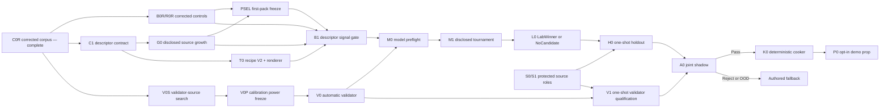

# Roadmap V44: evidence-gated neural physical sound factory

| Поле | Значение |
| --- | --- |
| Дата | `2026-09-03` |
| Статус | `ACTIVE / C0R_COMPLETE / B0R_R0R_NEXT / C1_AND_V0S_OPEN / V0_BLOCKED_BY_POWER / FIRST_PACK_SELECTION_PENDING / TRAINING_BLOCKED / OFFLINE_ONLY / AUTHORED_FALLBACK` |
| Заменяет | [Roadmap V43](physical-sound-synthesis-roadmap-v43.md) как planning authority; C1A и D2/C0R остаются immutable repeat-exact evidence |
| Архитектура | [SPEC-45](../architecture/45-physical-sound-synthesis-and-acoustic-presentation.md), `Proposed`; roadmap не создаёт public schema, runtime inference или production authority |
| Ограничение владельца продукта | Только опубликованные internet sources; никаких локальных ударов, микрофона и обязательной ручной приёмки отдельных звуков |

## Решение

Мы строим не ещё один вручную настроенный звук, а воспроизводимую фабрику:
описание предмета поступает в маленькую offline-модель, модель предсказывает
ограниченный физический recipe, детерминированный renderer запекает обычные
`48 kHz` clips, а независимый автоматический validator решает, можно ли ими
пользоваться. В игре сети нет; при любой ошибке или выходе за область данных
используется authored clip.

V43 исправил критическую утечку идентичности. [D2/C0R](../development/physical-sound-v43-d2-c0r-identity-repair-result-2026-09-03.md)
содержит `64/70/5` train/development/validator records, `34/30/1` физических
parents, объединяет два alias-компонента, маскирует конфликт материала object
`80` и сохраняет все `278` content objects побайтно. Это достаточная основа для
новых disclosed controls, но не для независимой калибровки validator и не для
запуска нейросети.

Главное изменение V44: первый material pack больше не назначается заранее как
Steel. Его выбирает signal-blind `PSEL` по числу независимых проектов и
parents, полноте runtime descriptors, provenance и достижимой мощности
train/development/validator roles. Качество candidate, protected audio и ручное
предпочтение не участвуют в выборе. Steel, Glass и Wood остаются целевыми
packs, но первым в demo идёт тот, для которого раньше появится честное
доказательство.

## Конечный результат

```text
published internet evidence
  -> provenance + physical-parent graph
  -> immutable train / development / validator / protected roles
  -> runtime-available object descriptors
  -> bounded recipe predictor
  -> deterministic renderer
  -> independent automatic validator
  -> deterministic cooked atlas + authored fallback
  -> versioned material/archetype pack
```

Definition of done для первого вертикального среза:

- один evidence-selected impact pack прошёл disclosed, validator, protected
  holdout и joint-shadow gates без retune;
- два cook запуска дают byte-identical atlas и manifest;
- opt-in prop в demo использует generated clips только внутри поддержанного
  descriptor region;
- disabled, corrupt, missing и OOD paths детерминированно выбирают authored
  fallback;
- следующему pack достаточно повторить тот же pipeline с новыми immutable
  roles, power plan и admission record, без прослушивания каждого звука.

## Что уже есть и чего пока нет

| Плоскость | Состояние | Следствие |
| --- | --- | --- |
| Lineage и disclosed corpus | `C1A_D2_C0R_COMPLETE / REPEAT_EXACT` | Новая работа использует только C0R; старые C0 projections исторические. |
| Disclosed numerical floor | `HISTORICAL_ONLY` | B0/R0 нельзя переносить после repair; B0R/R0R — следующий обязательный шаг. |
| Runtime descriptors | `NOT_FROZEN` | Нельзя доказать, что модель учит предмет, а не dataset/project fingerprint. |
| Validator mechanics | `SYNTHETIC_CONTROL_EXISTS` | Механика проверялась, но независимых calibration parents/projects недостаточно. |
| Recipe/renderer | `EXPERIMENTAL_CONTROLS_EXIST` | Нужна одна V2-форма, связанная с новыми descriptors и hard invariants. |
| Neural generator | `BLOCKED` | Сначала B1 должен доказать deployable descriptor signal, затем V0 — независимую оценку. |
| Protected admission | `SOURCE_POWER_OOD` | Untouched holdout/shadow нельзя открывать до закрытия source power. |
| Runtime/product | `NOT_PROMOTED` | SPEC-45 остаётся `Proposed`; authored clips — единственный production path. |

## Критический путь и параллельные потоки



B0R/R0R, C1 и metadata-only V0S могут развиваться параллельно, потому что не
читают candidate outputs и не открывают protected payload. B1 ждёт B0R, C1,
G0, T0 и PSEL. M0/M1 ждут B1 и frozen V0. Protected H0/V1/A0 остаются
one-shot и принимают ровно одного frozen `LabWinner`.

## Milestones и exit criteria

| ID | Состояние | Exit criterion | Если не прошёл |
| --- | --- | --- | --- |
| B0R/R0R | `NEXT` | Повторить global/material/retrieval/medoid/ridge/MLP controls и domain audit на exact C0R; опубликовать новый global floor, supported strata и parent-power target. Замаскированный object `80` участвует в global target statistics, но не в material-conditioned supervision. | `CorrectedCorpusSignalInsufficient`; перейти к C1/G0, сеть не увеличивать. |
| C1 | `OPEN` | Frozen descriptor schema содержит только доступные authoring/runtime поля: shape, dimensions, wall thickness, cavity/opening, mass, material, support, impact zone, units, confidence, provenance и missingness. | Неизвестные оси остаются masked; не выводить их из audio или имени dataset. |
| G0 | `AFTER_C1` | Internet-only ingestion увеличивает число независимых descriptor-complete parents/projects до вычисленного R0R floor; connected components и role assignment происходят до audio/feature decode. | `DisclosedSourcePowerOOD`; искать новые источники, не ретюнить модель. |
| PSEL | `AFTER_B0R_R0R_AND_G0` | Первый pack выбран только по pre-candidate eligibility: exact taxonomy, role power, descriptor coverage, source independence и provenance. | Ни один материал не выбран; все packs остаются `FallbackOnly`. |
| V0S | `OPEN / METADATA_FIRST` | Найдены независимые validator-calibration project families; mirrors, demos, derived exports и re-encodes co-locate с источником или quarantined. | `ValidatorSourcePowerOOD`. |
| V0P | `AFTER_V0S` | До выбора features/thresholds зафиксированы parent/project counts, clean controls, mutations, risk/coverage targets, OOD strata и one-use roles. | Продолжить metadata-only source growth. |
| T0 | `AFTER_C1` | Recipe V2, masks, uncertainty, hard projection и deterministic renderer проходят roundtrip, positive damping, ordered modes, energy, impulse scaling, remesh, finite/resource и mutation checks. | Исправить contract/owner до доступа к model values. |
| B1 | `AFTER_B0R_R0R_C1_G0_T0_PSEL` | На grouped leave-project-out surface descriptor controls дают median improvement `>=5%` к B0R global, lower 95% paired-bootstrap bound `>0`, без P90 regression и unsupported-material claims. | `DescriptorSignalInsufficient`; вернуться только к descriptors/source growth. |
| V0 | `AFTER_V0P / BEFORE_CANDIDATES` | Frozen ensemble выдаёт `Pass`, `Reject` или `FallbackOutOfDomain`; thresholds выбраны на independent calibration controls до generator outputs. | Training остаётся закрытым. |
| M0 | `AFTER_B1_AND_V0` | Frozen `StructuredRecipeNet-v2`, максимум один comparator, exact I/O, masked losses, projection, seeds, budget, stopping/ranking rule, ablations, resource и atomicity gates; ноль candidate values. | Исправить harness или вернуться к B1; не выбирать архитектуру по скрытому holdout. |
| M1/L0 | `AFTER_M0` | Один автономный disclosed tournament возвращает один `LabWinner` или `NoCandidate`, сравнивая сеть с global, descriptor и retrieval controls. | `NoCandidate`; новый цикл начинается с C1/G0, не с seed/width tuning. |
| S0/S1 | `PARALLEL / PROTECTED` | Whole-component metadata-first assignment закрывает frozen holdout, validator-qualification, joint-shadow roles и untouched reserves для выбранного pack. | `ProtectedSourcePowerOOD`; payload остаётся закрыт. |
| H0/V1/A0 | `ONE_SHOT` | Frozen winner и validator проходят independent grouped quality/risk/coverage и joint-shadow gates без retune. | `Reject` или `FallbackOutOfDomain`; authored path сохраняется. |
| K0/P0 | `AFTER_A0_PASS` | Два cook воспроизводят одинаковые clips/manifest; один demo prop подтверждает enabled/disabled/missing/corrupt/OOD fallback и измеренный cost. | Никакого production credit; generated pack остаётся lab artifact. |
| X0 | `AFTER_P0` | Glass, Wood и Steel добавляются как отдельные packs с собственными lineage, power, model, validator и admission records. | Непрошедший pack остаётся `FallbackOnly`, не влияя на прошедшие. |
| PR | `AFTER_WORKING_P0 / ADR_REQUIRED` | Конкретный Linux consumer и product checks обосновывают минимальные public contracts и Accepted ADR. | SPEC-45 остаётся `Proposed`. |

## Автоматический validator

В роли валидатора выступает frozen ensemble, а не человек и не та же сеть,
которая генерирует recipe:

1. PCM integrity, onset, clipping, energy и decay checks;
2. causal/metamorphic rules для scale, damping, modal order, impact strength и
   descriptor mutations;
3. spectral/modal distances до независимых clean recordings;
4. frozen audio embedding, не обученный на generator candidate outputs;
5. exact/near-copy, retrieval и shared-carrier guards;
6. grouped OOD/risk calibration по physical parent и source project;
7. неизменяемая агрегация в `Pass`, `Reject` или
   `FallbackOutOfDomain`.

Clean recordings — positive controls. Silence, clipping, truncation, metallic
smear, overlong ringing, wrong-material retrieval, spectral-envelope swap и
нарушения причинных инвариантов — negative controls. Прослушивание остаётся
удобным debugging-инструментом, но не выбирает thresholds, checkpoint или
release.

## Что именно учит сеть

Вход сети — только поля C1 и их masks. Project ID, publisher, filename, source
family, waveform и audio-derived target запрещены как generator inputs.

Выход — небольшой bounded recipe:

- base-frequency scale и ordered modal ratios;
- positive damping/decay;
- bounded modal participation;
- onset/transient envelope;
- небольшой coloured-residual envelope;
- uncertainty и OOD support.

Analytic projection, а не сеть, владеет физическими инвариантами. Runtime
получает только cooked clips и manifest. Если ridge/kNN/medoid не доказали B1
signal, большая сеть не запускается: capacity не создаёт отсутствующую
информацию о предмете.

## Material recipe registry

Долговечная «база того, как должно звучать» — versioned registry packs, а не
каталог WAV и не одна универсальная формула. Каждый pack хранит:

- material/archetype и поддержанный descriptor region;
- deterministic prior, recipe bounds и OOD boundary;
- optional offline checkpoint hash;
- corpus, lineage, validator и admission roots;
- cooked atlas/manifest hash;
- обязательный authored fallback;
- состояние `FallbackOnly`, `LabQualified`, `Admitted` или `Retired`.

В Git остаются только небольшие contracts, profiles, recipes, hashes и reports.
Datasets, WAV, features, checkpoints, generated clips, caches и credentials
остаются во внешнем store.

## Упорядоченная очередь реализации

1. **V44.0 — B0R/R0R:** corrected controls, domain audit и новый power target.
2. **V44.1 — C1:** descriptor contract, extractor и missingness/provenance gates.
3. **V44.2 — G0/PSEL:** disclosed source growth и signal-blind выбор первого pack.
4. **V44.3 — V0S/V0P:** independent validator sources и frozen calibration plan.
5. **V44.4 — T0:** recipe V2, renderer, causal fixtures и deterministic mutations.
6. **V44.5 — B1:** descriptor learnability gate; при reject — только G0/C1.
7. **V44.6 — V0:** automatic validator freeze до появления candidates.
8. **V44.7 — M0:** value-free model/tournament preflight.
9. **V44.8 — M1/L0:** autonomous training и один `LabWinner` либо `NoCandidate`.
10. **V44.9 — S0/S1:** protected source growth и one-use role freeze.
11. **V44.10 — H0/V1/A0:** one-shot independent admission.
12. **V44.11 — K0/P0:** deterministic cooker и fallback-safe demo prop.
13. **V44.12 — X0/PR:** новые packs; architecture promotion только после
    работающего consumer и product evidence.

## Ближайшие commit boundaries

| Commit | Содержимое |
| --- | --- |
| A44 | Roadmap V44, main-roadmap и task-state transition |
| B44 | B0R/R0R owner/profile/tests и repeat-exact corrected result |
| C44 | C1 descriptor schema, validation и internet source intake contract |
| D44 | G0 source-growth result и PSEL first-pack freeze |
| E44 | V0S/V0P source/power result |
| F44 | T0 recipe V2/renderer contract и deterministic fixtures |
| G44 | B1 descriptor-signal result |
| H44 | V0 automatic validator calibration |
| I44 | M0 model/tournament preflight |
| J44+ | Каждый disclosed, protected, admission, cooker и demo gate отдельным immutable checkpoint |

## Stop rules

- Не использовать старую C0 projection, старый B0 floor или старый
  `125`-parent planning floor как V44 authority.
- Не считать repeated impacts, camera views, paper demos, mirrors, re-encodes
  или feature exports независимыми physical parents/projects.
- Не использовать material object `80` для material supervision до независимого
  разрешения конфликта; валидный acoustic target можно учитывать только в
  material-agnostic controls.
- Не выбирать первый pack по candidate quality, protected data или ручному
  предпочтению.
- Не обучать neural candidate до B1 и frozen V0.
- Не менять validator после появления candidate outputs.
- Не открывать protected payload до whole-component role assignment.
- Не делать claim о Steel, Glass/Wood subtype или иной archetype без отдельного
  source power и pack admission.
- Не запускать runtime inference и не смешивать звук из raw PhysX callbacks.
- Не коммитить datasets, audio, features, checkpoints, generated clips или
  credentials; неизвестная provenance исключает artifact даже из research
  corpus.
- `CorpusSignalInsufficient`, `DisclosedSourcePowerOOD`,
  `ValidatorSourcePowerOOD`, `DescriptorSignalInsufficient`, `NoCandidate`,
  `Reject` и `FallbackOutOfDomain` — корректные результаты, а не разрешение
  ослабить gate.

## Product checks

B0R–L0 остаются external research под `Proposed` SPEC-45. Для каждого нужны
focused owner tests, external A/B replay, canonical/hash/atomicity checks и
boundary scan; они не дают runtime или ProductCheck credit. P0 дополнительно
требует focused `play`, `content-package`, `persistence-replay` и применимые
Linux `platform`/`performance` checks. Production promotion требует отдельный
Accepted ADR, обновление SPEC/routing/traceability и реального consumer.
