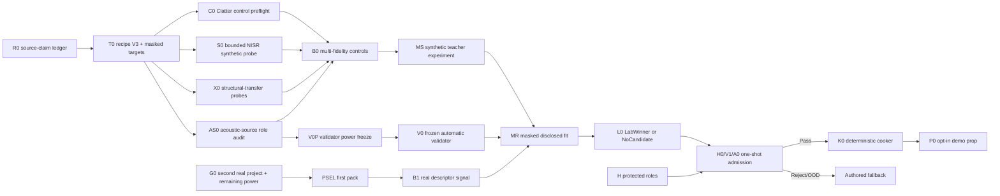

# Roadmap V45: multi-fidelity neural physical sound

| Поле | Значение |
| --- | --- |
| Дата | `2026-09-03` |
| Статус | `ACTIVE / MULTI_FIDELITY_REBASELINE / R0_SOURCE_CLAIM_LEDGER_NEXT / 71_REAL_ACOUSTIC_PARENTS / DEFICIT_34 / CLATTER_CONTROL_ONLY / NISR_SYNTHETIC_ONLY / STRUCTURAL_TRANSFER_OPEN / V0S_OPEN / PSEL_BLOCKED / REAL_TRAINING_BLOCKED / OFFLINE_ONLY / AUTHORED_FALLBACK` |
| Заменяет | [Roadmap V44](physical-sound-synthesis-roadmap-v44.md) как planning authority; все V44 exact results и source-power gates остаются immutable evidence |
| Исследование | [V45 multi-fidelity evidence rebaseline](../development/physical-sound-v45-multifidelity-evidence-rebaseline-2026-09-03.md) |
| Архитектура | [SPEC-45](../architecture/45-physical-sound-synthesis-and-acoustic-presentation.md), `Proposed`; V45 не создаёт public schema, runtime inference или production authority |
| Ограничение владельца продукта | Только опубликованные internet sources; никаких локальных ударов, микрофона и обязательной ручной приёмки отдельных звуков |

## Решение

Конечный продукт не меняется: маленькая offline-модель получает доступное в
движке описание предмета, предсказывает ограниченный физический recipe, а
детерминированный cooker запекает обычные `48 kHz` clips. В runtime нет сети,
обучения или внешнего сервиса. Любая ошибка, неподдержанный descriptor region
или непрошедший pack выбирает authored fallback.

Меняется путь к модели. V44 ждал второй «полный» проект, который одновременно
свяжет physical descriptors с реальным микрофонным сигналом. Поиск показал,
что полезные публичные источники наблюдают разные части причинной цепочки:

```text
geometry + material
        -> modal body
        -> force/contact-to-vibration transfer
        -> acoustic radiation + residual
        -> microphone waveform
```

V45 учит эти части на разных источниках, но не смешивает их доказательную силу.
Каждая строка имеет явный `claim_mask`; loss вычисляется только для реально
наблюдаемой величины. Synthetic/FEM evidence может улучшить modal head,
instrumented evidence — transfer head, а microphone recordings —
radiation/residual head. Независимый validator и protected admission остаются
отдельными реальными источниками и никогда не участвуют в generator fitting.

## Что V45 сохраняет без ослабления

- C0R — единственный текущий corrected disclosed corpus.
- B0R global median `1.312187716` — действующий реальный disclosed floor.
- G0B1c1 даёт `71/105` supported real-acoustic parents; дефицит `34`.
- Пять strict-Steel parents IETeasy принадлежат одному проекту и не закрывают
  PSEL.
- Synthetic rows, FEM variants, force channels, accelerometers, repeated hits,
  camera/listener views и re-encodes не увеличивают real-acoustic parent power.
- Protected source minima, one-shot H0/V1/A0 и prohibition on retune остаются.
- SPEC-45 остаётся `Proposed`; единственный production path — authored clips.

## Конечный результат

Первый вертикальный срез готов, когда:

1. frozen multi-fidelity recipe/model beat analytic, Clatter and simple
   descriptor controls on their declared disclosed lanes;
2. один signal-blind selected material/archetype pack проходит independent
   validator, untouched holdout и joint shadow без retune;
3. два cook запуска дают byte-identical clips и manifest;
4. demo prop использует generated clips только внутри admitted descriptor
   region;
5. disabled, missing, corrupt, OOD and rejected paths deterministically return
   the authored fallback;
6. новый Glass, Wood или Steel pack может пройти тот же pipeline без ручного
   прослушивания каждого звука.

## Source-to-claim contract

| Lane | Source class | Generator supervision | Evaluation authority | Parent-power credit |
| --- | --- | --- | --- | --- |
| `E / empirical_prior` | Clatter-like published statistics | Modal prior/control only | Synthetic/disclosed comparator | `0` |
| `S / modal_teacher` | Analytic/FEM/NISR synthetic data | Frequencies, mode shapes, participation | Synthetic counterfactuals only | `0` |
| `X / structural_transfer` | Force + accelerometer measurements | Excitation, transfer, damping, contact/support | Structural controls only | `0` real-acoustic parents |
| `A / real_acoustic` | Disclosed microphone recordings | Masked modal/radiation/residual targets | Repeatable disclosed evaluation | One per exact physical parent |
| `V / validator_calibration` | Independent real audio and frozen corruptions | Forbidden | Validator risk/calibration only | Claim-specific, never generator |
| `H / protected_admission` | Untouched real project families | Forbidden | One-shot H0/V1/A0 | Frozen protected minima only |

Every external source enters through an immutable ledger row containing source
identity, revision/hash roots, alias component, physical-parent rule, observed
axes, allowed lanes, forbidden claims, payload state, provenance and cost.
Unknown or contradictory fields fail closed.

## Recipe V3

The offline model predicts a bounded, inspectable recipe rather than PCM:

- **modal body:** base scale, ordered modal ratios, positive RT60/damping,
  participation and uncertainty;
- **excitation/transfer:** onset, bounded contact duration, impact-strength gain,
  location/support modifiers and uncertainty;
- **radiation/residual:** band envelope, spectral tilt, short coloured residual
  and uncertainty;
- **support:** descriptor masks and an explicit OOD score.

The deterministic projector owns mode ordering, positivity, Nyquist/resource
bounds, finite output and energy limits. The renderer owns deterministic
`48 kHz` PCM. Runtime receives only cooked clips and a manifest.

## Critical path and parallel work



R0–MS can make scientific progress before G0 reaches the real parent floor,
but MS has no authority beyond synthetic-teacher usefulness. MR remains blocked
until PSEL/B1 and V0 are frozen. Protected roles remain unopened until exactly
one LabWinner exists.

## Milestones and exit criteria

| ID | State | Exit criterion | Reject/fallback |
| --- | --- | --- | --- |
| R0 | `NEXT / VALUE_FREE` | A deterministic source-claim ledger covers Clatter, NISR, Delft plate, cello bridges, CMU impacts, the three-object set and excluded leads; exact revisions, alias components, claim masks, forbidden uses, payload state and cost are repeat-exact with zero media/model access. | `SourceClaimAmbiguous`; keep the row metadata-only or excluded. |
| T0 | `AFTER_R0` | Recipe V3, observation masks, neutral target records and deterministic projection pass roundtrip, missing-label, ordered-mode, positive-decay, energy, Nyquist, finite/resource and corruption tests. | Fix the schema/owner before opening external numeric priors. |
| C0 | `AFTER_T0 / CLATTER_EXTERNAL_CONTROL` | A value-free protocol pins Clatter commit `79cac6c…04806`, inventory and decoder semantics; two external runs reproduce the same neutral prior/control roots and seeded renders. No external code/data enters runtime or Git. | `ExternalPriorUnavailableOrIncompatible`; keep literature-only control. |
| S0 | `AFTER_T0 / BOUNDED_ONLY` | Exact NISR revision, ObjectFolder alias component, generation provenance and a preregistered small sample pass integrity, modal-target and counterfactual checks without bulk download. | `SyntheticTeacherUntrusted`; no NISR-derived labels or sounds are used. |
| X0a | `AFTER_T0` | One Delft plate profile binds dimensions/material/support, 25 locations, three repeats and force/acceleration channels; frozen controls test location, transfer and damping consistency. | `StructuralTransferOOD`; no acoustic or material generalization claim. |
| X0b | `AFTER_X0A` | Cello metadata-only axis/cost audit proves that bridge rows add a separable transfer discriminator beyond assembly confounds. | Defer without downloading payload. |
| AS0 | `AFTER_R0 / METADATA_FIRST` | CMU and three-object candidates receive exact archive/note/physical-parent/alias mappings and immutable disclosed-vs-validator eligibility. | `AcousticSourcePowerOOD`; payload remains closed. |
| B0 | `AFTER_C0_S0_X0_AS0` | Frozen analytic, Clatter and synthetic-teacher controls are evaluated only on lanes they can observe; per-lane metrics, grouped identities and ablations publish a winner or `NoUsefulTeacher`. | Retain analytic P1/T0; do not tune against protected or validator data. |
| MS | `AFTER_B0 / SYNTHETIC_ONLY` | One bounded model predicts recipe V3 on synthetic/prior/transfer lanes and beats the selected simple controls under unseen geometry/material/contact mutations. | `SyntheticTeacherRejected`; this does not block continued real-source growth. |
| G0/PSEL | `PARALLEL / REAL_POWER_BLOCKED` | A second independent real descriptor-to-signal project and sufficient parent power satisfy the frozen PSEL policy, or publish exact `DisclosedSourcePowerOOD`. | No material pack is selected; all remain `FallbackOnly`. |
| B1 | `AFTER_G0_PSEL_T0` | Runtime descriptors beat B0R global by median `>=5%`, paired-bootstrap lower 95% bound `>0`, no P90 regression and no unsupported-material claim under leave-project-out. | `DescriptorSignalInsufficient`; do not start real fitting. |
| V0S/V0P/V0 | `PARALLEL_METADATA / BEFORE_CANDIDATES` | Independent real calibration projects, parent power, corruptions, features, thresholds, risk and OOD policies are frozen before generated candidates. | `ValidatorSourcePowerOOD`; real fitting stays blocked. |
| MR/M1/L0 | `AFTER_MS_B1_V0` | Frozen masked fine-tune/tournament compares analytic, Clatter, descriptor and neural candidates on disclosed roles, returning exactly one `LabWinner` or `NoCandidate`. | New cycle starts at sources/descriptors, never post-hoc seed/width tuning. |
| H0/V1/A0 | `ONE_SHOT` | One LabWinner and the frozen validator pass independent grouped holdout, validator qualification and joint shadow without retune. | `Reject` or `FallbackOutOfDomain`; authored clips remain. |
| K0/P0 | `AFTER_A0_PASS` | Two cooks are byte-identical; demo enabled/disabled/missing/corrupt/OOD paths and measured cost pass. | No runtime/product credit. |
| X1/PR | `AFTER_P0` | New material packs repeat the process; a concrete Linux consumer and product evidence justify any minimal Accepted ADR/public contract. | SPEC-45 stays `Proposed`. |

## Automatic validator

The validator is a frozen ensemble, independent from the recipe predictor:

1. PCM integrity, onset, clipping, finite, energy and decay checks;
2. causal mutations for scale, damping, modal order, impact strength and OOD;
3. modal/spectral/temporal distances to independent real recordings;
4. a frozen audio embedding not trained or selected on candidate outputs;
5. copy/retrieval/shared-carrier guards;
6. grouped calibration by physical parent and source project;
7. immutable aggregation into `Pass`, `Reject` or
   `FallbackOutOfDomain`.

Human listening remains a debugging aid, not a threshold, checkpoint or release
decision. The generator, teacher and validator may share mathematical
definitions, but not fitted weights, calibration rows or selection outputs.

## Ordered implementation queue

1. **V45.0 — R0:** implement the value-free source-claim ledger and repeat-exact
   census.
2. **V45.1 — T0:** freeze recipe V3, target masks and deterministic projection.
3. **V45.2 — C0:** freeze and run the external Clatter prior/control probe.
4. **V45.3 — S0:** run a bounded NISR metadata/generation/sample preflight; no
   bulk acquisition.
5. **V45.4 — X0:** materialize the Delft structural control, then decide the
   cello bridge probe from metadata-only cost/axis evidence.
6. **V45.5 — AS0:** audit CMU and the three-object set for disclosed acoustic or
   validator-calibration roles.
7. **V45.6 — B0/MS:** run the lane-aware control tournament and at most one
   bounded synthetic-teacher experiment.
8. **V45.7 — G0/PSEL/B1:** continue independent real-source growth, select the
   first pack signal-blindly and prove runtime-descriptor signal.
9. **V45.8 — V0:** freeze and qualify the automatic validator before candidates.
10. **V45.9 — MR/M1/L0:** masked real fine-tune and one disclosed tournament.
11. **V45.10 — H0/V1/A0:** one-shot independent admission.
12. **V45.11 — K0/P0:** deterministic cooker and fallback-safe demo prop.
13. **V45.12 — X1/PR:** repeat for Glass/Wood/Steel; promote architecture only
    with a working consumer and product checks.

## Commit boundaries

| Commit | Content |
| --- | --- |
| A45 | V45 research, roadmap, main-roadmap and task-state transition |
| B45 | R0 source-claim ledger owner/profile/tests and repeat-exact result |
| C45 | T0 recipe V3/masked-target contract and deterministic fixtures |
| D45 | C0 Clatter external-control seal, decoder and result |
| E45 | S0 bounded NISR provenance/sample result |
| F45 | X0a Delft structural-transfer result; X0b cello decision if authorized |
| G45 | AS0 acoustic/validator source-role result |
| H45 | B0 control tournament and MS synthetic-teacher result as separate immutable checkpoints |
| I45+ | Each real power, validator, fitting, admission, cooker and demo gate is its own checkpoint |

## Stop rules

- Do not pool lane counts or report a synthetic/structural row as a real
  microphone physical parent.
- Do not let NISR add project independence from its ObjectFolder geometry
  lineage; no full-dataset acquisition is authorized by a bounded sample probe.
- Do not copy Clatter code/data into the engine or make it a runtime dependency;
  provenance/usage terms must pass before even external derived artifacts are
  retained.
- Do not infer acoustic radiation from accelerometers or force channels.
- Do not infer exact mass, dimensions, material grade or contact from filenames,
  waveform features or model predictions.
- Do not use validator/protected rows for fitting, feature choice, threshold
  choice, seed choice or architecture selection.
- Do not lower `105` real-parent planning power, project independence,
  protected-role minima or one-shot admission because partial supervision is
  useful.
- Do not train a prompt-to-waveform model, unrestricted codec or runtime neural
  synthesizer as a shortcut.
- Do not add datasets, audio, features, checkpoints, generated clips, external
  source trees, caches or credentials to Git.
- Do not require the user to record impacts or approve every sound.

## Verification policy

Roadmap and research changes use the documentation cheap path:
`git diff --check` plus direct validation of changed links, paths and
identifiers. R0/T0 code uses formatting/static analysis and focused owner tests.
No ProductCheck is required until a production consumer or architecture
promotion is introduced.
