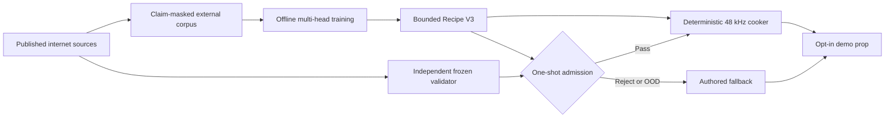

# Roadmap V46: autonomous ML physical-sound MVP

| Поле | Значение |
| --- | --- |
| Дата | `2026-09-03` |
| Статус | `ACTIVE / EXECUTION_ROADMAP / FOUNDATION_D1_COMPLETE / CLAIM_MASKED_CORPUS_INDEX / B0_BASELINE_NEXT / RESEARCH_ONLY / OFFLINE_ML / AUTHORED_FALLBACK` |
| Заменяет | [Roadmap V45](physical-sound-synthesis-roadmap-v45.md) как planning authority; все V45 и более ранние exact results остаются immutable evidence |
| Архитектура | [SPEC-45](../architecture/45-physical-sound-synthesis-and-acoustic-presentation.md), `Proposed`; V46 не создаёт public schema, runtime inference или production authority |
| Ограничение владельца продукта | Только опубликованные internet sources; никаких локальных записей, ударов по предметам и обязательного ручного прослушивания каждого результата |

## Цель

Довести исследования до одного законченного вертикального среза:

1. внешний воспроизводимый pipeline собирает разрешённые части опубликованных
   данных и превращает их в hash-closed multi-fidelity corpus;
2. компактная offline-модель предсказывает ограниченный [Recipe V3](../development/physical-sound-v45-t0-recipe-v3-result-2026-09-03.md),
   а не произвольный PCM;
3. отдельный автоматический validator оценивает причинность, физическую
   правдоподобность, сходство с независимыми реальными записями и OOD;
4. ровно один автоматически выбранный bounded pack проходит untouched
   admission без retune;
5. deterministic cooker дважды создаёт byte-identical `48 kHz` clips;
6. один demo prop воспроизводит эти clips через существующий audio path, а при
   любой ошибке, неизвестном входе или отключённой функции использует authored
   fallback.

Это не попытка найти одну идеальную формулу для всех предметов. Формулы
остаются жёсткой физической оболочкой и safety projector, а нейросеть учит
параметры, которые плохо восстанавливаются вручную: модальные веса, затухание,
возбуждение, спектральное излучение и короткий остаточный transient.

Первый material/archetype pack выбирается signal-blind по доступности и силе
данных. Стеклянная ёмкость остаётся предпочтительным demo consumer, но не
получает обходных правил: если независимых данных недостаточно, первым будет
другой прошедший pack либо весь MVP завершится честным `FallbackOnly`.

## Что уже готово

| Основа | Состояние | Практический смысл |
| --- | --- | --- |
| Source/claim ledger | `COMPLETE / REPEAT_EXACT` | Десять источников разделены на empirical, synthetic, structural, real-acoustic и validator lanes без смешивания доказательств. |
| Recipe V3 | `COMPLETE / REPEAT_EXACT` | Зафиксирован bounded `189`-coordinate target с масками отсутствующих наблюдений и deterministic projection. |
| Analytic/modal renderer | `COMPLETE / CONTROL_ONLY` | Частоты, затухание, энергия, Nyquist и resource bounds можно проверять без нейросети. |
| Clatter comparator | `COMPLETE / REPEAT_EXACT` | Внешне воспроизводятся 84 labels/controls, соответствующие 36 уникальным modal priors; это baseline, не real truth. |
| NISR/VibraVerse preflight | `COMPLETE / REPEAT_EXACT / UNTRUSTED` | Оба exact sources остановлены до payload: у NISR недоступен заявленный generation document, у VibraVerse отсутствует complete generation lineage. |
| External corpus compiler | `COMPLETE / REPEAT_EXACT` | 154 real rows, 80 raw parents, 10 projects и 36 Clatter groups сведены в claim-masked index; роли изолированы, все 308 content objects остались закрыты. |
| Disclosed real corpus | `71/105` supported parents | Есть настоящие записи для исследований, но не хватает `34` parents и второго независимого descriptor-to-signal проекта для выбора pack. |
| Automatic validator release | `NOT_READY` | Есть компоненты и corruption tests, но ещё нет независимой calibration power и frozen release. |
| Trained candidate / cooked pack / demo | `NOT_RUN` | Ни одна модель пока не имеет admission или product authority. |

## Целевая система

Generator и validator не делят fitted weights, calibration rows, source
projects или candidate-selection outputs. Synthetic FEM может учить modal
head, force/accelerometer data — transfer head, а real microphone audio —
radiation/residual head. Отсутствующий target остаётся masked и никогда не
восстанавливается из имени файла или material label.

## Два параллельных контура

### Контур L — воспроизводимый ML lab

Этот контур можно завершать сейчас, не ожидая полного real corpus:

- проверить NISR и VibraVerse как synthetic teachers;
- материализовать маленькие source-backed modal/transfer fixtures;
- сравнить analytic, Clatter, ridge и одну bounded neural architecture;
- доказать unseen-geometry/material/contact counterfactuals;
- вернуть `SyntheticTeacherUseful` либо `SyntheticTeacherRejected`.

Результат L не разрешает pack, cooker или demo. Он отвечает на более узкий
вопрос: умеет ли ML полезно предсказывать части Recipe V3 лучше простых методов.

### Контур E — независимое real evidence и validator

Этот контур открывает дорогу к продукту:

- найти второй независимый descriptor-to-microphone project;
- довести real support с `71/105` до frozen planning floor;
- выбрать первый pack без чтения candidate outputs;
- выделить непересекающиеся generator, validator и protected project families;
- заморозить risk/OOD policy до обучения финального candidate.

Если контур E не набирает силу, работа L остаётся полезным research artifact,
но продукт честно остаётся на authored clips.

## Milestones

| ID | Выход | Exit criterion | Terminal reject/fallback |
| --- | --- | --- | --- |
| F0 | Foundation | V45 R0/T0/C0 остаются exact и являются единственной исходной representation/control основой. | При дефекте исправляется конкретный owner; старые quality roles не переоткрываются. |
| D0 | `COMPLETE / REPEAT_EXACT / NO_TRUSTED_SYNTHETIC_TEACHER` | [Result](../development/physical-sound-v46-d0-synthetic-source-preflight-result-2026-09-03.md) отдельно отвергает NISR и VibraVerse по generation lineage при восьми metadata requests и нулевом payload/sample access. | Оба источника остаются закрыты до exact successor lineage; D1/B0 используют zero external synthetic rows, analytic и Clatter controls. |
| D1 | `COMPLETE / REPEAT_EXACT / CLAIM_MASKED_INDEX` | [Result](../development/physical-sound-v46-d1-corpus-compiler-result-2026-09-03.md) сводит 154 real rows и 36 Clatter groups в byte-identical index, доказывает role/project/parent isolation и не открывает 308 content objects. | Corrupt, ambiguous или incomplete row отвергается до target decode; индекс разрешает только B0. |
| B0 | Multi-fidelity baselines | Analytic, global median, retrieval/ridge и 36-group Clatter сравниваются только на наблюдаемых lanes с project/parent grouping. | `NoUsefulTeacher`; analytic/Clatter остаются control/fallback. |
| M0 | Synthetic/structural model | Одна заранее зафиксированная multi-head model улучшает лучший simple control на unseen synthetic geometry/material/contact mutations без lane regression. | `SyntheticTeacherRejected`; следующий шаг — новые данные/representation, не перебор seeds и widths. |
| E0 | Real-source power | Второй независимый descriptor-to-signal project и суммарно `>=105` supported real parents проходят source, alias, descriptor и event/audio binding. | `RealSourcePowerOOD`; real fitting и material selection остаются закрыты. |
| PSEL/B1 | Pack and signal gate | Pack выбран signal-blind; runtime descriptors улучшают frozen global floor по median `>=5%`, paired-bootstrap lower 95% bound `>0`, без P90 regression under leave-project-out. | `DescriptorSignalInsufficient`; выбранный pack остаётся `FallbackOnly`. |
| V0 | Validator V1 | Независимые real projects, corruptions, features, thresholds, false-pass bound, selective coverage и OOD policy заморожены до candidate; generator access к calibration запрещён. | `ValidatorSourcePowerOOD` или `ValidatorUnqualified`; candidate training не начинается. |
| M1/L0 | Real masked fit | Один M0-derived candidate обучается только на disclosed generator rows; frozen tournament возвращает ровно один `LabWinner` либо `NoCandidate`. | Новый цикл начинается с данных или новой preregistered representation, не с post-hoc tuning. |
| A0 | One-shot admission | LabWinner один раз проходит untouched project-family holdout, qualified validator и joint shadow без retune. | `Reject` или `FallbackOutOfDomain`; protected roles не переиспользуются. |
| K0 | Cooker V1 | Два clean cooks создают byte-identical PCM/manifest; malformed, missing, oversized и OOD inputs fail closed. | Никакого runtime/product credit; authored clips остаются. |
| P0 | Demo vertical | Один opt-in prop использует только admitted cooked clips; enabled/disabled/missing/corrupt/OOD paths сохраняют gameplay/physics/replay и выбирают declared fallback. | SPEC-45 остаётся `Proposed`; feature не включается по умолчанию. |
| X0 | Repeatability | Тот же pipeline без ручной приёмки запускается для следующих Glass/Wood/Steel packs. | Каждый material независимо получает `Admitted` или `FallbackOnly`. |

## Ordered execution queue

1. **V46.1 — D0 — COMPLETE:** [repeat-exact result](../development/physical-sound-v46-d0-synthetic-source-preflight-result-2026-09-03.md)
   возвращает `NoTrustedSyntheticTeacher`; оба samples и все payload values не
   открыты.
2. **V46.2 — D1 — COMPLETE:** [repeat-exact result](../development/physical-sound-v46-d1-corpus-compiler-result-2026-09-03.md)
   публикует claim-masked index, сохраняет разные target contracts и не
   открывает ни один из 308 referenced content objects.
3. **V46.3 — B0 — NEXT:** выпустить lane-aware baseline table и выбрать control,
   который действительно нужно превзойти.
4. **V46.4 — M0:** обучить ровно одну bounded multi-head model; MLflow может
   хранить external experiment lineage, но не является admission authority.
5. **V46.5 — E0:** параллельно закрывать второй real project и дефицит `34`,
   начиная с CMU/three-object metadata audit и новых source candidates.
6. **V46.6 — V0:** заморозить независимый validator dataset, corruptions,
   metrics, aggregation, false-pass risk и OOD policy.
7. **V46.7 — PSEL/B1:** автоматически выбрать первый pack и доказать, что
   доступные движку descriptors несут real cross-project signal.
8. **V46.8 — M1/L0:** выполнить один disclosed fit/tournament и зафиксировать
   `LabWinner` либо `NoCandidate`.
9. **V46.9 — A0:** один раз открыть protected admission.
10. **V46.10 — K0/P0:** только после A0 Pass реализовать deterministic cook и
    fallback-safe demo integration.
11. **V46.11 — X0:** повторить pipeline для остальных материалов и лишь затем
    решать вопрос об Accepted ADR/public content contract.

## Автоматический validator

Validator — не одна нейросеть и не «оценка похожести по тексту», а frozen
ensemble из независимых сигналов:

1. PCM integrity: формат, finite values, silence, clipping, onset и energy;
2. causal mutations: масштаб, damping, modal order, impact strength, contact и
   OOD должны менять звук в ожидаемом направлении;
3. modal/spectral/temporal distances до независимых real recordings;
4. frozen audio embedding, не обученный и не выбранный на candidate outputs;
5. copy/retrieval/shared-carrier guards;
6. grouping по physical parent и source project, а не по количеству WAV;
7. immutable aggregation в `Pass`, `Reject` или `FallbackOutOfDomain`.

Человеческое прослушивание разрешено только как диагностика. Оно не выбирает
checkpoint, threshold, material pack и не является release gate.

## Правила, которые удерживают roadmap конечным

- V46 остаётся активным до `MVP_PASS` или честного `MVP_FALLBACK_ONLY`; каждый
  отрицательный эксперимент создаёт result, а не новый roadmap.
- На одну гипотезу допускается одна заранее зафиксированная bounded model и
  один disclosed tournament. Failure возвращает работу к данным или новой
  representation, но не запускает локальный перебор параметров.
- Research выполняется только для конкретного открытого gate и заканчивается
  машинно проверяемым решением `Pass/Reject/OOD`.
- Synthetic, structural, real, validator и protected counts не суммируются.
- Dataset payloads, audio, features, checkpoints, generated clips, caches и
  credentials остаются вне Git; в Git входят code, profiles, hashes и компактные
  reports/fixtures.
- Runtime не обучает и не запускает neural model. Он получает только cooked
  clips/manifest и всегда имеет authored fallback.
- Impact — единственный текущий sound class. Rolling, scraping, fracture,
  footsteps, cloth, fluids, fire и speech не входят в V46.

## Ближайший проверяемый результат

D1 завершён: [repeat-exact corpus index](../development/physical-sound-v46-d1-corpus-compiler-result-2026-09-03.md)
явно сохраняет `external_modal_teacher_rows = 0`, изолирует train/development/
validator по physical parent, project и component, а также оставляет все 308
referenced content objects закрытыми. Первый следующий checkpoint — B0:

- читает только D1 index и заранее разрешённые observed targets;
- сравнивает analytic owner, historical global median, retrieval/ridge и 36
  value-distinct Clatter controls;
- агрегирует по project/physical parent, а не по WAV;
- не сопоставляет несовместимые target contracts и missing Recipe V3 lanes;
- возвращает один frozen control floor либо `NoUsefulTeacher` без права
  начинать ML training.

Контур E продолжает real-source и validator growth независимо.

## Commit and verification boundaries

| Commit | Содержание |
| --- | --- |
| A46 | Этот roadmap, main-roadmap и task-state transition |
| B46 | D0 source preflight owner/profiles/results |
| C46 | D1 external corpus compiler and repeat-exact index |
| D46 | B0 baseline tournament |
| E46 | M0 synthetic/structural model result |
| F46+ | E0, V0, PSEL/B1, M1/L0, A0, K0 и P0 — отдельные immutable checkpoints |

Documentation-only changes use `git diff --check` and direct link/path checks.
External lab owners use focused formatting/static analysis/tests plus the
physical-sound boundary scan. Production ProductChecks remain `NOT_RUN` until
a concrete promoted consumer exists.
