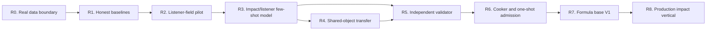

# Roadmap V2: neural physical sound

| Поле | Значение |
| --- | --- |
| Дата rebaseline | 2026-08-30 |
| Статус | `ACTIVE_R&D / R0_COMPLETE / R1_CONTROLS_FROZEN / R2_TIME_DOMAIN_FAMILY_REJECTED / R2B_DENSE_COMPLEX_FIELD_DATA_NEXT / PASS_DISABLED / P1_BLOCKED` |
| Архитектура | [SPEC-45](../architecture/45-physical-sound-synthesis-and-acoustic-presentation.md), `Proposed` |
| Стратегия | [Neural acoustic field strategy](../development/physical-sound-neural-acoustic-field-strategy-2026-08-30.md) |
| Исполнение | [Neural acoustic field implementation plan](2026-08-30-physical-sound-neural-acoustic-field-implementation-plan.md) |
| Текущее состояние | [Physical sound task state](../development/task-state/physical-sound-synthesis.md) |
| Продуктовый статус | Изолированный post-v1 experiment; текущий clip-based audio baseline не меняется |

## North star

Построить автономный цикл, который по опубликованным internet data обучает
модель физического звука, автоматически проверяет её на независимых данных и
превращает принятый результат в компактную детерминированную модель для движка.

Первый целевой результат — один конкретный стеклянный объект с несколькими
позициями удара и слушателя. Для допустимых условий звук синтезируется из
cooked physical model; для неизвестных, ошибочных или out-of-domain условий
всегда используется authored clip.

Работа не считается завершённой, пока нет одновременно:

1. обученной модели с замороженным lineage;
2. преимущества над честным classical baseline на неиспользованных условиях;
3. независимого автоматического validator decision;
4. детерминированного cooker и byte-identical reference PCM;
5. одного exact admitted domain с обязательным fallback;
6. отдельного product decision перед любой runtime-интеграцией.

## Что меняется относительно старого плана

Ручной поиск общей формулы `material -> sound` больше не является основной
веткой. Q30 modal renderer, DCT residual, FEM/BEM и предыдущие real-data
эксперименты сохраняются как baseline, teacher, controls и negative knowledge.

Основной кандидат — offline neural transfer field:

```text
geometry + support + impact position + listener position
                         |
                         v
       global modes + damping + conditional gains + residual
                         |
                         v
             bounded deterministic cooker
                         |
                         v
            excitation convolution -> 48 kHz PCM
```

Force-deconvolved transfer response и обычный recorded impact waveform —
разные типы сигнала. Они не сравниваются sample-to-sample и не смешиваются в
одной loss без явной excitation model:

- transfer responses обучают отклик объекта и пространственное поле;
- recorded impacts проверяют итоговую perceptual identity и envelope;
- synthetic FEM/BEM дают физические controls и дополнительный teacher signal;
- direct waveform generation используется только как report-only upper bound
  либо как источник authored assets.

Первая модель не входит в runtime. Она работает во внешнем research pipeline,
а движок в будущем может получить только проверенные и канонически quantized
coefficients.

## Неизменяемые ограничения

- Training data, recordings, generated WAVs, weights, optimizer state и
  feature caches остаются вне Git.
- Пользователь ничего не записывает и не бьёт по объектам; real evidence
  добывается только из опубликованных internet sources.
- Отсутствующая geometry, material, support, excitation или listener metadata
  остаётся отсутствующей и сужает claim.
- Generator не читает validator calibration, method holdout или admission
  shadow.
- Validator не обучается на candidate outputs той же revision и не меняет
  thresholds после открытия shadow.
- Один pooled similarity score, одна audio-language model и человеческое
  прослушивание не могут самостоятельно выдать `Pass`.
- Невалидный, неопределённый или OOD результат всегда означает
  `FallbackOutOfDomain`.
- Physics и gameplay остаются authoritative. Audio presentation не меняет
  world state, replay, save или deterministic `AcousticFactV1`.
- Runtime neural inference, public schema и production integration требуют
  отдельного consumer-driven architecture decision.

## Артефакты конечного контура

| Артефакт | Что фиксирует | Где хранится |
| --- | --- | --- |
| `CorpusRevision` | source hashes, provenance, signal semantics, published axes и пять split roles | Manifest/report в Git; payloads снаружи |
| `ExperimentRevision` | preprocessing, features, model, environment, seeds, baseline и checkpoint lineage | Code/report в Git; weights/features снаружи |
| `ValidatorRelease` | hard gates, specialists, thresholds, OOD и grouped risk policy | Версионированный report/contract |
| `CookedAcousticModel` | bounded modes, damping, spatial gains, residual, domain envelope и fallback | Сначала external research artifact |
| `AdmissionRecord` | immutable `Pass`, `Reject` или `FallbackOutOfDomain` для exact domain | Reviewable evidence |

Каждое изменение corpus, model, preprocessing, cooker или validator создаёт
новую revision. Неудачные результаты не переписываются и остаются в базе как
запрет на повторение уже опровергнутой гипотезы.

## Карта программы



R4 является условной веткой. Если exact-object few-shot model работает, а
object-disjoint transfer нет, программа продолжает работу с exact-object
models и не маскирует провал обещанием универсального материала.

## Milestones

| ID | Статус | Размер | Проверяемый результат |
| --- | --- | ---: | --- |
| R0 | `COMPLETE` | S | Первый real transfer slice и five-role projection повторяются byte-identical; signal semantics и missing axes честно сохранены. |
| R1 | `COMPLETE / FROZEN_CONTROLS` | M | Transfer-domain и recorded-waveform baselines покрывают только совместимые rows; метрики и fallback заморожены. |
| R2 | `TIME_DOMAIN_FAMILY_REJECTED / R2B_DATA_NEXT` | M | Модель восстанавливает grouped held-out listener responses одного fixed-impact объекта лучше classical interpolation. |
| R3 | `BLOCKED_BY_R2_AND_DATA` | L | Few-shot model предсказывает новые impact/listener conditions exact объекта и cooks в exact PCM. |
| R4 | `CONDITIONAL` | L–XL | Shared geometry-conditioned model либо проходит object/family-disjoint holdout, либо zero-shot claim явно отклонён. |
| R5 | `BLOCKED_BY_R3` | M | Frozen automatic validator показывает bounded grouped risk и useful selective coverage без live human gate. |
| R6 | `BLOCKED_BY_R5` | M | Frozen generator/cooker/validator один раз открывают admission shadow и публикуют tri-state decision. |
| R7 | `BLOCKED_BY_R6` | L–XL | Есть exact admitted neural-cooked domains для glass, wood и metal либо явно зафиксированы недоступные families. |
| R8 | `POST_V1 / BLOCKED_BY_CONSUMER` | XL | Один visible prop использует production contact/content/mixer path с exact clip fallback. |

Размеры относительные; это порядок зависимостей, а не календарное обещание.

## R0 — Real data boundary

Цель — подготовить данные так, чтобы модель не обучалась на неверной
интерпретации сигнала или скрытой leakage.

Deliverables:

- schema V2 с явным `recorded_impact_waveform` или
  `force_deconvolved_transfer_response`;
- независимые optional claims для impact point и outward normal;
- verified REALIMPACT multi-listener slice с общим scale, сохраняющим
  относительную амплитуду между микрофонами;
- роли `train`, `development`, `calibration`, `method_holdout` и
  `admission_shadow` с object/source/recording/mutation-parent disjointness;
- capability report, где каждая отсутствующая axis указана явно;
- sealed rows представлены commitments, а не доступным audio payload.

Exit criteria:

- два запуска дают byte-identical manifests, reports и rendered references;
- stale lineage, non-finite samples, duplicate parents и cross-role leakage
  отвергаются до создания output;
- ни один transfer row не попадает в waveform baseline;
- выбран exact permitted internet slice для R1/R2;
- модель ещё не обучается, admission shadow не открывается.

Evidence: [R0–R1 real boundary](../development/physical-sound-neural-real-boundary-r0-r1-2026-08-30.md).
R0 закрыт: 15-row REALIMPACT slice и 23-row five-role projection повторены
byte-identical; все missing axes сохранены, sealed roles не materialized.

## R1 — Honest baselines and metric contract

Нужны две разные baseline surfaces:

1. transfer-domain baseline — nearest-neighbour/interpolation либо другой
   frozen classical field над impact/listener coordinates;
2. waveform-domain baseline — существующий Q30 modal/DCT или PCM-only path для
   совместимых recorded impacts и synthetic controls.

Одинаковые preprocessing и splits используются всеми будущими candidates.
Метрики замораживаются до обучения:

- multi-resolution log-spectrum и spectral-envelope error;
- modal frequency/damping error там, где extractor допустим;
- time-decay/envelope и residual autocorrelation;
- spatial relative-level and held-out-listener error;
- energy-scaling, silence, rest, separation, finiteness и exact-repeat gates;
- независимые learned-representation diagnostics только как часть ensemble;
- per-object/impact/listener distributions, а не только pooled mean;
- cooker size, offline latency и deterministic reference cost.

Exit criteria:

- каждый development row имеет `Supported` или точный
  `FallbackOutOfDomain` reason;
- baseline и feature reports повторяются byte-identical;
- metric direction, aggregation, primary endpoints и stop thresholds
  preregistered до R2;
- admission shadow остаётся sealed.

Evidence: [R0–R1 real boundary](../development/physical-sound-neural-real-boundary-r0-r1-2026-08-30.md).
R1 закрыт профилем `transfer-listener-field-r1-v1`: восемь context и семь
query listeners имеют повторяемые nearest/linear predictions. Linear control
достигает `9.1745 dB` mean gain-matched spectrum RMSE и `2.5373 dB` mean
absolute level error; эти числа не являются quality pass, а задают порог R2.

## R2 — Fixed-impact listener-field pilot

Первый дешёвый neural experiment использует один объект и один impact point с
несколькими listener positions. Он проверяет только пространственное поле и не
притворяется полной моделью удара.

Experiment ladder:

1. frozen nearest/linear controls;
2. direct time-domain rank-4/rank-7 listener latent — rejected;
3. coordinate-derived propagation-delay-aligned latent — rejected;
4. grouped dense complex/time-frequency field — data preflight next.

Exit criteria:

- held-out listeners улучшаются относительно обоих classical controls по всем
  preregistered primary aggregates;
- relative amplitude, decay, finiteness и exact cook не регрессируют;
- ablation показывает, какой компонент даёт улучшение;
- training повторяется на фиксированных seeds в объявленном tolerance;
- failure публикуется как `REJECT_LISTENER_FIELD` или `DATA_INSUFFICIENT`, а не
  запускает свободный hyperparameter search.

Evidence: [V1 result](../development/physical-sound-listener-field-r2-v1-result-2026-08-30.md)
and [phase-aligned result and failure research](../development/physical-sound-listener-field-r2-phase-research-2026-08-30.md).
V1 and its separately preregistered propagation-delay-aligned successor both
repeat deterministically and return `RejectListenerField`. Phase alignment
makes rank 4 better than both controls on four of five endpoints, but it still
fails the frozen P95 spectrum endpoint. A query-informed subspace diagnostic
also fails the level/spectrum aggregates, so the opened time-domain latent
family is retired rather than tuned.

The next R2B boundary changes data coverage and representation, not thresholds
or nearby MLP hyperparameters:

- project one full 600-position fixed-impact REALIMPACT semicylinder;
- split by complete gantry/spatial groups rather than interleaved microphone
  rows;
- freeze a complex STFT or log-magnitude plus continuous-phase field and its
  exact inverse-cook error before optimization;
- preserve nearest/linear controls and add a simple complex-field control;
- preregister an exterior-air Helmholtz/physics regularizer and a no-physics
  ablation;
- keep method holdout and admission shadow sealed.

Only a grouped held-listener result that beats both controls on all unchanged
primary aggregates can close R2. `DATA_INSUFFICIENT` and
`REJECT_COMPLEX_FIELD_REPRESENTATION` remain valid outcomes.

## R3 — Object-specific impact/listener few-shot model

Entry condition: R2 подтверждает representation, а опубликованный corpus даёт
несколько impact и listener conditions одного объекта. Если impact axis в
источнике отсутствует, milestone остаётся blocked, а metadata не выдумывается.

Model inputs:

- exact object/geometry revision;
- available material/support evidence;
- impact point и имеющийся excitation descriptor;
- listener coordinate/condition.

Model outputs:

- global modal frequencies and damping;
- impact/listener-conditioned gains;
- compact coloured residual;
- uncertainty, coverage distance и OOD reason.

Exit criteria:

- unseen impact positions и listeners лучше R1 baseline;
- bounded excitation scaling и negative controls проходят;
- prediction cooks в canonical bounded coefficients;
- одинаковый cooked record создаёт byte-identical 48 kHz PCM;
- method holdout открывается один раз только после freeze candidate;
- результат — `GO_EXACT_OBJECT`, `REJECT_REPRESENTATION` или
  `DATA_INSUFFICIENT`.

## R4 — Shared geometry-conditioned transfer

Entry condition: R3 доказал exact-object representation. Shared model получает
geometry encoder и проверяется на object- и family-disjoint method holdout.

Обязательные ablations:

- real-only training;
- synthetic FEM/BEM pretraining plus real adaptation;
- object-specific few-shot adaptation;
- shared zero-shot prediction;
- direct waveform model как report-only perceptual upper bound, если его можно
  воспроизвести без нарушения split policy.

Exit criteria:

- `GO_SHARED` выдаётся только при per-object improvement и calibrated OOD;
- pooled mean не скрывает провал отдельных объектов;
- source-project или near-duplicate leakage отсутствует;
- провал shared model оставляет допустимым `GO_EXACT_OBJECT`, но закрывает
  zero-shot/material-wide claim.

## R5 — Independent Validator Release V1

Validator — frozen ensemble, а не одна judge-network:

| Слой | Роль |
| --- | --- |
| Hard/causal gates | Finiteness, bounds, exact repeat, silence/rest/separation, energy relations |
| Acoustic specialists | Modes, decay, envelope, spectral evolution, spatial field, transient/residual |
| Learned representations | Real-corpus similarity и artifact evidence; не самостоятельный `Pass` |
| OOD/selective controller | Принимает только calibrated covered region |
| Grouped risk report | Confidence-bounded false-pass risk и useful coverage по независимым parent groups |

Exit criteria:

- calibration выбирает policy без holdout/shadow;
- frozen mutations, positives, negatives, unavailable-model и reward-hack
  controls имеют declared outcomes;
- report повторяется byte-identical;
- threshold нельзя менять после holdout/shadow;
- если useful coverage несовместима с bounded risk, release честно остаётся
  fallback-only.

## R6 — Neural cooker and one-shot admission

Frozen model, cooker и Validator Release встречаются на untouched admission
shadow один раз.

Cooker обязан проверить finiteness, counts, coordinate envelope, canonical mode
order, duplicate/unstable modes, coefficient bounds, quantization и fallback.
Model failure, missing artifact или OOD не являются audio fault: выбирается
authored clip.

Exit criteria:

- run manifest связывает corpus/model/checkpoint/code/environment/seed/cooker/
  validator hashes;
- validator публикует immutable `Pass`, `Reject` или
  `FallbackOutOfDomain`;
- accepted coefficients и reference PCM повторяются без human approval;
- та же revision не донастраивается по открытому shadow.

## R7 — Neural-cooked formula base V1

База хранит не общие коэффициенты материала, а independently admitted exact
domains:

1. thin glass vessel;
2. dry hardwood block;
3. thin metal vessel/shell.

Каждая запись содержит geometry/support/excitation/listener envelope,
model/checkpoint/cooker/validator revisions, cooked coefficients, risk,
coverage, cost, evidence hashes и authored fallback. Новая geometry, fixture,
energy band или listener envelope создаёт новую admission revision.

V1 считается готовой, если для каждой family либо существует один exact
admitted domain, либо зафиксировано воспроизводимое решение, почему family
остаётся fallback-only. Широкий claim `glass`, `wood` или `metal` не выводится
из одного объекта.

## R8 — Production rigid-impact vertical

Runtime work начинается только после отдельного slot в основном roadmap и
consumer-driven ADR. Recommended consumer — один visible interactable prop с
несколькими impact positions/energies.

Required product work:

1. закрыть engine-owned committed contact projection вместо raw PhysX callback;
2. определить минимальные cooked PresentationOnly content shapes;
3. импортировать один admitted record без datasets/weights/validator runtime;
4. подключить bounded extraction, deterministic voice и текущий mixer;
5. проверить enabled/disabled/OOD/fault/voice-limit clip fallbacks;
6. измерить whole-mixer p95/p99, memory, queue и voice bounds;
7. пройти candidate `AUDIO-PHYS-SOURCE-P1`, `AUDIO-PHYS-CONTENT-P1` и
   `AUDIO-PHYS-PCM-P1` checks.

Enabled и disabled paths должны сохранять одинаковые gameplay, physics,
ledger, persistence и `AcousticFactV1` roots.

## Текущие commit boundary

1. `real neural transfer slice` — `COMPLETE`; schema V2, verified REALIMPACT
   slice, five-role projection и R0 evidence повторены;
2. `transfer-domain classical baseline` — `COMPLETE`; compatible controls,
   preprocessing, metrics и real development report заморожены;
3. `listener-field experiment v1` — `REJECTED`; two-run training, MLflow
   lineage и Rust-metric evaluation повторены, candidate не выбран;
4. `phase-aligned listener successor` — `REJECTED`; training/evaluation and
   failure diagnostic repeat, while the frozen conjunctive rule selects no
   candidate;
5. `dense complex-field data preflight` — `NEXT`; acquire/project the full
   fixed-impact semicylinder, freeze a grouped spatial split and complex
   time-frequency representation, then measure controls before optimization.

После каждого boundary обновляются exact evidence, task state и этот roadmap.
Успешный commit без измеренного exit criterion не меняет milestone status.

## Stop/go policy

| Наблюдение | Решение |
| --- | --- |
| Transfer и recorded-waveform semantics нельзя согласовать | Не смешивать losses; сузить task или добавить явную excitation model |
| R2 не превосходит classical interpolation | `REJECT_LISTENER_FIELD`; исследовать representation/data, не tuning-grid |
| R3 проходит exact object, R4 падает object-disjoint | `GO_EXACT_OBJECT`; zero-shot/shared claim закрыть |
| Direct waveform звучит лучше, но не проходит causal/exact cook | Оставить upper bound или authored asset source |
| Internet data не содержит нужную axis | `DATA_INSUFFICIENT`; искать другой published source, не local capture |
| Learned metric расходится с hard/acoustic specialists | Fallback; одна model score не перевешивает disagreement |
| Frozen candidate падает на shadow | `Reject`; сохранить counterexample и открыть новую revision с одной новой hypothesis |
| Ни neural, ни classical path не дают bounded quality/cost | Остановить domain и использовать authored clips |
| Нет concrete consumer или roadmap slot | Не создавать public/runtime contract |

## Definition of done

- **Research model:** R3 воспроизводимо поддерживает exact-object few-shot claim
  или честно отклоняет representation.
- **Automatic validation:** R5 принимает решения без per-sound human queue и
  показывает confidence-bounded grouped risk.
- **Closed research loop:** R6 один раз встречает frozen generator и validator
  на shadow и публикует immutable tri-state decision.
- **Formula base:** R7 хранит bounded cooked domains, negative knowledge и
  fallbacks без runtime neural inference.
- **Product value:** R8 даёт один visible prop, физически реагирующий на место и
  силу удара, при полном сохранении clip fallback и authoritative roots.

Rolling, scraping, fracture, footsteps, cloth, liquids, fire, voice и
biological sound не входят в этот roadmap. Для каждого потребуется отдельный
source model, corpus и validator domain после успешного impact vertical.
