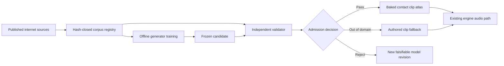

# Roadmap V10: internet data to an autonomously validated physical-sound base

| Поле | Значение |
| --- | --- |
| Дата rebaseline | 2026-08-31 |
| Статус | `ACTIVE_R&D / V9_SYNTHETIC_PASS / A0_REAL_SOURCE_PASS / A1_REJECTED_AT_ONSET / A1R_FORCE_SOURCE_PASS / A1R_FIT_NEXT / REAL_QUALITY_NOT_PROVEN / RUNTIME_NOT_AUTHORIZED` |
| Архитектура | [SPEC-45](../architecture/45-physical-sound-synthesis-and-acoustic-presentation.md), `Proposed` |
| Текущее состояние | [Physical sound task state](../development/task-state/physical-sound-synthesis.md) |
| Исполнение | [Neural acoustic field implementation plan](2026-08-30-physical-sound-neural-acoustic-field-implementation-plan.md) |
| Продуктовый fallback | Обычные authored clips; они остаются обязательным и авторитетным путём |

## Цель

Создать автономный offline-конвейер, который:

1. находит опубликованные записи и геометрию объектов в интернете;
2. обучает компактную модель физического звука;
3. проверяет её на данных, которых generator не видел;
4. принимает, отклоняет или ограничивает результат без очереди ручного
   прослушивания;
5. превращает принятый результат в обычный детерминированный clip atlas для
   движка.

Первая доказуемая цель — не универсальная формула `material -> sound`, а один
точно описанный стеклянный объект с несколькими положениями удара, одной
canonical-listener condition и опубликованной геометрией. После него тот же
контур должен быть повторён для дерева и металла.

Нейросеть работает только во внешнем research/cooking pipeline. Runtime не
загружает weights и не выполняет neural inference. SPEC-45 остаётся
`Proposed`; этот roadmap не создаёт public schema и не обещает shipping.

## Где мы находимся

| Результат | Состояние | Что это означает |
| --- | --- | --- |
| Data boundary и честные classical controls | `COMPLETE` | Типы сигналов, split roles, leakage rules, метрики и fallback определены. |
| Listener-field experiments | `REJECTED / RECORDED` | Модель может идеально запомнить известные точки и всё равно плохо предсказывать новые; эту ветку не повторяем. |
| V5 waveform neural codec | `REJECTED / RECORDED` | Компактный codec сохранял общий envelope, но терял спектр и модальные частоты. |
| V8 explicit modes + sparse residual | `REJECTED_ON_REAL_FIT` | Явные резонансы полезны, но стационарного sparse residual недостаточно для настоящего удара. |
| V9 explicit modes + time-varying residual | `SYNTHETIC_PASS / REPRODUCIBLE` | На известной synthetic truth модель компактна и предсказывает неизвестный контакт лучше nearest control. |
| V9 на новом реальном объекте | `A0_SOURCE_PASS / A1_REJECTED_BEFORE_FIT` | Beer Glass roles заморожены, но generic onset gate математически недостижим на двух fit contacts; V9 representation не была проверена. |
| Автоматический validator release | `NOT_AUTHORIZED` | Компоненты метрик есть, но independent release ещё не калиброван. |
| База моделей и интеграция с движком | `BLOCKED` | Сначала должны пройти real representation, exact-object и validator gates. |

Точное текущее evidence: [V8 real-fit rejection and V9 research](../development/physical-sound-r3a-v8-object91-fit-result-and-v9-residual-research-2026-08-31.md)
и [V9 synthetic result](../development/physical-sound-r3a-v9-time-varying-residual-synthetic-result-2026-08-31.md).

## Целевая система



У контура нет решения «на глаз». Каждая стрелка связывается exact source,
code, configuration, model, validator и output hashes. Изменение любого из них
создаёт новую revision.

## Неизменяемые ограничения

- Пользователь не записывает удары и не собирает локальный corpus. Real data
  поступают только из опубликованных internet sources.
- Dataset payloads, WAVs, weights, checkpoints, feature caches и generated
  atlases остаются вне Git. В репозитории находятся code, manifests, компактные
  fixtures и reviewable reports.
- `recorded_impact_waveform` и `force_deconvolved_transfer_response` — разные
  задачи. Они не смешиваются в одной loss или sample-to-sample метрике без
  явной excitation model.
- Отсутствующая coordinate, geometry, force, support, composition или listener
  axis остаётся отсутствующей и сужает claim; она не угадывается по label.
- Generator не читает validator calibration internals, method holdout или
  admission shadow. Validator той же revision не обучается на candidate
  outputs.
- Один pooled score, одна audio-language model или человеческое прослушивание
  не могут самостоятельно выдать `Pass`.
- Неопределённый, ошибочный или OOD результат всегда использует authored clip.
- Audio остаётся presentation-only и не влияет на physics, gameplay hearing,
  save, replay или authoritative world state.
- Runtime neural inference и прямое микширование raw PhysX callback запрещены.

## Программа работ

Размеры `S/M/L/XL` показывают относительный объём и риск, а не календарное
обещание.

| ID | Этап | Статус | Размер | Выход |
| --- | --- | --- | ---: | --- |
| A0 | Новый real source и coordinate proof | `COMPLETE / REPRODUCIBLE` | S–M | Beer Glass target и Rinsing Cup archive/object holdout имеют exact audio-coordinate-point-cloud binding и frozen roles с нулевым waveform decode. |
| A1 | V9 real representation gate | `REJECTED_AT_PREPROCESSING / REPRODUCIBLE` | M | Два fit-run повторяются точно; frozen onset не существует для `18/29`, representation fitting не начинался, protected reads равны нулю. |
| A1R | Source-semantic synchronization revision | `OBJECT51_FORCE_SOURCE_PASS / FIT_NEXT` | S–M | Object-disjoint Fruit Bowl raw force/microphone/coordinate binding повторяется с нулевым PCM decode; тот же V9 fit запускается только на четырёх fit contacts. |
| A2 | Exact-object contact field | `BLOCKED_BY_A1R` | M–L | Модель предсказывает звук в новых точках объекта и печёт bounded clip atlas. |
| A3 | Independent Validator V1 | `BLOCKED_BY_A1R` | M | Frozen ensemble показывает bounded false-pass risk и useful selective coverage. |
| A4 | One-shot admission | `BLOCKED_BY_A2_A3` | S | Frozen generator и validator один раз открывают shadow и публикуют tri-state decision. |
| A5 | Physical Sound Base V1 | `BLOCKED_BY_A4` | L–XL | Glass, wood и metal имеют admitted exact domains либо честный fallback-only status. |
| A6 | Один production impact prop | `POST_V1 / BLOCKED_BY_CONSUMER_ADR` | L | Visible object использует committed contact projection, baked clips и обязательный fallback. |
| A7 | Cross-object generalization | `OPTIONAL_AFTER_A5` | XL | Shared/few-shot модель проходит object/family-disjoint tests либо broad claim закрывается. |

## A0 — Новый real source и доказательство координат

### Задача

Выбрать полностью новую опубликованную ревизию, которая не участвовала в
выборе V9, и до чтения waveform samples доказать связь:

```text
object revision + contact id
  -> published 3D contact position/normal
  -> exact audio member
  -> exact geometry revision
```

Этот gate закрыт официальным contact-localization bundle: ObjectFolder Real
`60 / Beer_Glass / Glass` выбран target, а `22 / Rinsing_Cup / Glass` из
другого raw archive — representation holdout. Official code использует один
`(object, contact)` ключ для audio, coordinate и point cloud; известный
processed/raw WAV identity control совпадает byte-for-byte. Точная ревизия и
ограничения зафиксированы в [A0 evidence](../development/physical-sound-r3a-v10-objectfolder-real-source-and-role-freeze-2026-08-31.md).

### Порядок

1. Зафиксировать official URLs, source revision, sizes, hashes и signal
   semantics.
2. Доказать coordinate transform и audio/contact ID alignment из primary
   source, не из имени файла или предположения.
3. Выполнить zero-decode inventory: разрешены archive headers и metadata,
   decoded audio sample count обязан остаться нулём.
4. До декодирования распределить complete parent groups по ролям
   `fit/development/representation_holdout/calibration/method_holdout/
   admission_shadow`.
5. Заморозить preprocessing, baselines, metrics, thresholds, read counters и
   stop policy.

### Exit criterion

- Два inventory запуска дают byte-identical manifest/report.
- Все выбранные contacts имеют доказанную coordinate/audio/geometry binding.
- Ни один protected waveform не прочитан и не участвует в normalization.
- Duplicate и mutation-parent leakage отсутствуют.
- Результат ровно один из `READY_FOR_V9_REAL_FIT` или `DATA_INSUFFICIENT`.

Result: `READY_FOR_V9_REAL_FIT`. Два запуска повторили manifest
`8a30cef0…8728` и report `3522c677…00d3`; все waveform decode counters равны
нулю. Selected bundle не содержит force, normal и numeric listener geometry,
поэтому A1 claim сужен до recorded-impact reconstruction при одной
неопубликованной fixed-microphone condition.

## A1 — V9 на реальном звуке

### Гипотеза

Настоящий удар можно компактно представить как:

```text
explicit stable modes
  + contact-conditioned modal gains
  + deterministic time-varying noise-band residual
  + bounded excitation/onset description
```

V9-SYNTH проверил вычислительный substrate, но не realism. A1 проверяет саму
representation hypothesis, прежде чем учить полноценное spatial field.

### Последовательные ворота

1. **Fit-only:** representation обязана восстановить открытые fit contacts и
   уложиться в frozen shared/per-contact budgets. Development остаётся
   непрочитанным.
2. **Development:** одна полностью замороженная capacity сравнивается с
   nearest, modal-only, compatible classical и reconstruction controls.
3. **Representation holdout:** открывается один раз только если каждый
   development endpoint прошёл.

Проверяются level, attack, envelope, decay, modal frequencies/damping,
multi-resolution spectrum, spectro-temporal residual, waveform reconstruction,
finiteness, exact repeat и storage cost. Пороговые значения берутся из
предварительно замороженного A0 protocol, а не подгоняются после результата.

### Решения

- `READY_FOR_EXACT_OBJECT_FIELD`: все gates и compatible baselines пройдены.
- `REJECT_V9_REAL_REPRESENTATION`: сохранён counterexample; A2 не запускается.
- `DATA_INSUFFICIENT`: источник не позволяет проверить заявленную axis.

При reject разрешена только новая falsifiable representation hypothesis и
новая source-disjoint revision. Ещё один bank size, epoch, threshold или
postfilter на открытых contacts запрещён.

### Result и rebaseline

A1 завершён как `REJECT_V9_REAL_REPRESENTATION` для этой полной revision до
representation fitting. Контакты `18/29` не могут пересечь frozen onset:
noise thresholds `0.0061645508/0.0032958984` выше полных peaks
`0.0054626465/0.0025939941`. Два запуска повторяют report
`7d7bb630…9db9b`; все protected counters равны нулю. Это отвергает protocol,
но не доказывает плохое качество V9, потому что candidate не создавался.

A1R не меняет порог на открытых контактах. Object `51 / Fruit_Bowl / Glass`
даёт synchronized raw `Force.wav`: шесть raw microphones byte-identical
processed recordings с координатами, а четыре fit + development + sealed роли
заморожены по archive order. Два inventory-run повторяют manifest
`3041c19d…6ed5` и report `b421743e…7cb9` при нулевом PCM decode. Это новый
физический объект, но тот же ObjectFolder project/archive family, поэтому он
годится для onset/fit discriminator, а не project-disjoint validation. Exact
evidence: [A1 result](../development/physical-sound-r3a-v10-beer-glass-real-fit-result-2026-08-31.md)
и [A1R source freeze](../development/physical-sound-r3a-v10-a1r-object51-force-source-freeze-2026-08-31.md).

## A2 — Exact-object contact field и clip atlas

A2 отвечает на практический вопрос: умеет ли модель по координате удара
предсказывать различия звука одного реального объекта.

### Model boundary

Входы:

- exact object/geometry revision;
- published contact point и доступная normal;
- available excitation descriptor;
- одна canonical-listener condition.

Выходы:

- explicit modal gains и V9 residual latent;
- coverage distance, uncertainty и OOD reason;
- offline-decoded canonical 48 kHz PCM для bounded contact grid.

### Exit criterion

- Held contact groups не участвовали в fitting или normalization.
- Candidate лучше каждого compatible nearest/KNN/classical control по всем
  preregistered primary aggregates, а не только по среднему score.
- Повторные training/evaluation runs воспроизводимы по объявленной policy.
- Frozen grid декодируется в byte-identical clips и manifest.
- Atlas содержит exact hashes, coordinate coverage и authored fallback для
  каждой неподдержанной точки.

Успех A2 доказывает только exact object при одной listener condition. Он не
означает, что модель знает всё стекло или произвольную форму.

## A3 — Independent Validator Release V1

Validator — отдельный frozen ensemble:

| Слой | Проверяет |
| --- | --- |
| Hard/causal gates | Finiteness, bounds, exact repeat, silence/rest, energy scaling, lineage и leakage. |
| Acoustic specialists | Attack, envelope, decay, stable modes, spectral evolution, residual texture и contact variation. |
| Learned representations | Similarity к независимому real corpus и признаки артефактов; сами по себе не выдают `Pass`. |
| OOD controller | Находится ли candidate внутри откалиброванной области применимости. |
| Grouped risk report | Confidence-bounded false-pass risk и useful coverage по независимым source/object parent groups. |

### Calibration protocol

- Positive, negative и controlled mutation sets формируются по parent groups.
- Thresholds выбираются только на calibration.
- Method holdout измеряет перенос validator policy и не меняет её.
- Candidate outputs той же revision не входят в обучение judge components.
- Unavailable learned specialist, disagreement или low confidence дают
  `FallbackOutOfDomain`, а не optimistic pass.

### Exit criterion

Release повторяет report byte-identically, обнаруживает frozen corruptions и
reward-hack controls, сохраняет declared false-pass bound и имеет ненулевую
useful coverage. Иначе validator остаётся fallback-only.

## A4 — One-shot admission

Frozen `CorpusRevision`, generator checkpoint, cooker и `ValidatorRelease`
один раз встречаются на untouched admission shadow.

Выход — immutable `AdmissionRecord`:

- `Pass`: публикуются exact atlas hashes и bounded domain;
- `Reject`: counterexample сохраняется, shadow этой revision больше не
  используется для tuning;
- `FallbackOutOfDomain`: система честно не принимает решение за пределами
  coverage.

Human listening может быть report-only sanity check, но не обязательным
элементом admission и не способом изменить решение после shadow.

## A5 — Physical Sound Base V1

База хранит не одну формулу материала, а набор независимо принятых exact
domains. Первая версия покрывает:

1. стеклянную ёмкость с относительно тонкой стенкой;
2. сухой деревянный объект;
3. тонкую металлическую ёмкость или оболочку.

Каждая запись связывает geometry/support/excitation/listener envelope,
corpus/model/cooker/validator revisions, atlas or optional distilled record,
coverage, risk, cost и authored fallback.

A5 считается закрытым, если каждая family имеет хотя бы один admitted exact
domain либо воспроизводимый `fallback-only` result. Один объект не разрешает
широкий claim `glass`, `wood` или `metal`.

## A6 — Один production impact prop

Runtime-интеграция начинается только после отдельного roadmap slot и
consumer-driven Accepted ADR. Первый consumer — один видимый предмет с
несколькими областями и энергиями удара.

Требуется:

1. engine-owned committed contact projection вместо raw backend callback;
2. минимальный PresentationOnly content contract для atlas и coverage;
3. существующий deterministic clip playback и spatialization SPEC-08;
4. enabled, disabled, missing, OOD, corrupt и voice-limit fallbacks;
5. byte-identical displayless PCM на reference path;
6. одинаковые gameplay, physics, ledger, persistence и `AcousticFactV1` roots
   при включённом и выключенном physical audio;
7. будущие `AUDIO-PHYS-SOURCE-P1`, `AUDIO-PHYS-CONTACT-P1`,
   `AUDIO-PHYS-CONTENT-P1` и `AUDIO-PHYS-PCM-P1` checks.

До этого этапа никакой experimental model/atlas не является shipped content.

## A7 — Cross-object generalization

Это опциональная ветка после нескольких admitted exact domains. Она проверяет:

- shared geometry encoder;
- synthetic FEM/BEM pretraining плюс real adaptation;
- few-shot adaptation нового объекта;
- object- и family-disjoint transfer;
- calibrated OOD для незнакомых форм и материалов.

Если shared model падает, проект продолжает использовать exact-object models.
Провал generalization не отменяет уже admitted atlases и не маскируется pooled
average.

## Ближайшие commit boundaries

Работа продолжается строго в таком порядке:

1. **Source/coordinate feasibility — COMPLETE:** official code/data and raw
   identity control prove audio-coordinate-object binding.
2. **A0 zero-decode freeze — COMPLETE:** repeated manifest `8a30cef0…8728`,
   roles, gates and evidence with zero decoded waveform samples.
3. **A1 fit-only runner — REJECTED:** repeat-exact onset failure on contacts
   `18/29`; no candidate, metrics or protected reads.
4. **A1R source semantics — SOURCE PASS / FIT NEXT:** object-51 raw force,
   microphone, coordinate and point-cloud identity is frozen; run only four fit
   contacts under the committed force-onset protocol.
5. **A1R development/holdout:** каждый следующий gate открывается отдельным
   commit только после pass предыдущего.
6. **A2 contact field:** held-position training/evaluation и внешний baked
   contact atlas.
7. **A3 validator release:** independent calibration, method holdout, OOD и
   grouped risk evidence.
8. **A4 admission:** один frozen shadow run и immutable decision.
9. **A5 expansion:** тот же закрытый цикл сначала для wood, затем для metal.

Отрицательный результат является полноценным выходом commit boundary. Он
обновляет hypothesis и stop policy, но не понижает требования.

## Stop/go policy

| Наблюдение | Решение |
| --- | --- |
| Coordinate/audio binding нельзя доказать | `DATA_INSUFFICIENT`; выбрать другой internet source, ничего не угадывать. |
| V9 не восстанавливает собственные fit contacts | `REJECT_V9_REAL_REPRESENTATION`; development не читать. |
| Fit проходит, development проигрывает baseline | Закрыть revision; holdout не открывать и не тюнить thresholds. |
| Representation holdout проходит | Разрешить A2, но не заявлять validator, database или runtime success. |
| Exact-object field проходит, shared field падает | Сохранить exact-object path и закрыть broad generalization claim. |
| Validator не удерживает false-pass risk | `FALLBACK_ONLY`; generator не может быть admitted. |
| Generator и acoustic specialists расходятся | Fallback; один learned score не имеет veto над hard evidence. |
| Shadow падает | Immutable `Reject`; следующая revision использует новую hypothesis и новые защищённые данные. |
| Cost atlas приемлем, formula distillation хуже | Использовать clips; компактная формула не обязательна. |
| Нет production consumer или Accepted ADR | Не создавать runtime/public contract. |

## Критерии завершения

### Research MVP

- A0–A4 закрыты для одного нового стеклянного объекта.
- Generator лучше честных controls на unseen contacts.
- Validator принимает решение без per-sound human queue.
- Baked atlas и reference PCM воспроизводятся детерминированно.
- OOD и любой fault выбирают authored fallback.

### Physical Sound Base V1

- A5 закрыт для glass, wood и metal через admitted exact domain или явный
  fallback-only result.
- Каждая запись имеет полное lineage, coverage, risk и negative knowledge.
- Новая запись может быть построена тем же автоматизированным pipeline без
  изменения правил задним числом.

### Product vertical

- A6 имеет отдельное архитектурное разрешение и visible production consumer.
- Runtime получает только проверенные cooked assets, не datasets или weights.
- Physical sound не меняет authoritative simulation и всегда сохраняет clip
  fallback.

Rolling, scraping, fracture, footsteps, cloth, liquids, fire, voice и
biological sound не входят в V10. Для каждого потребуется отдельный source
model, corpus и validator domain после успешного impact vertical.

## Durable negative knowledge

Подробная история не дублируется в roadmap. Обязательные запреты и условия
пересмотра находятся в [task-state](../development/task-state/physical-sound-synthesis.md),
а точные измерения — в связанных dated evidence reports. В частности, нельзя
повторять listener-field tuning, nearby codec capacities, V8 sparse/stationary
residual tuning или использовать object `91` для выбора V9.
