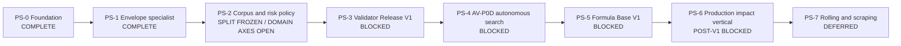

# Roadmap физического синтеза звука

| Поле | Значение |
| --- | --- |
| Статус | `ACTIVE_R&D / PS-2_FIXED_RBF_MULTIOBJECT_AXIS_REJECTED / NARROW_VERTICAL_PILOT_RETAINED / SHAPE_CONDITIONED_PREREGISTRATION_NEXT / THREE_DIMENSIONAL_SPATIAL_FIELD_OPEN / EIGHT_EXACT_CLAIMS_OPEN / FALLBACK_OUT_OF_DOMAIN / AUTOMATIC_PASS_DISABLED / PRODUCTION_P1_BLOCKED` |
| Архитектурная граница | [SPEC-45](../architecture/45-physical-sound-synthesis-and-acoustic-presentation.md), `Proposed` |
| Текущий evidence | [PS-2 REALIMPACT multi-object spatial-axis extension](../development/physical-sound-realimpact-spatial-extension-ps2-2026-08-28.md), [vertical spatial calibration](../development/physical-sound-realimpact-spatial-calibration-ps2-2026-08-28.md), [multi-listener acquisition](../development/physical-sound-realimpact-multilistener-acquisition-ps2-2026-08-28.md), [transfer calibration](../development/physical-sound-realimpact-transfer-calibration-ps2-2026-08-28.md), [internet-source feasibility](../development/physical-sound-internet-source-feasibility-ps2-2026-08-28.md), [exact-domain matrix](../development/physical-sound-domain-claims-matrix-ps2-2026-08-28.md), [internet corpus policy](../development/physical-sound-internet-corpus-policy-ps2-2026-08-27.md), prior E3/E2 pilots, [project split](../development/physical-sound-kronland-reject-split-freeze-ps2-2026-08-28.md), [corpus plan](../development/physical-sound-corpus-plan-ps2-2026-08-27.md) и [task state](../development/task-state/physical-sound-synthesis.md) |
| Последний пакет | [REALIMPACT two-object axis-stratified RBF rejection](../development/physical-sound-realimpact-spatial-extension-ps2-2026-08-28.md) |
| Детальный план | [Domain admission implementation plan](2026-08-27-physical-sound-domain-admission-implementation-plan.md) |
| Связь с продуктом | Изолированный R8 experiment; не меняет текущий R7 critical path и clip-based audio baseline |
| Горизонт | Валидатор → корпус и риск → автономный поиск → база формул → один production impact vertical → persistent contact |

## Цель

Построить автономный контур, который без послушивания каждого результата:

1. генерирует звук физического взаимодействия из ограниченной математической
   модели;
2. проверяет hard, causal, acoustic и out-of-domain свойства независимым
   версионированным валидатором;
3. допускает формулу только для точного acoustic domain, на котором измерены
   риск, покрытие, стоимость и fallback;
4. накапливает reviewable базу условных формул, а не таблицу
   `material -> coefficients`;
5. cooks допущенную модель в PresentationOnly content, сохраняя authored clip
   как обязательный production fallback.

Первый продуктовый результат — один интерактивный rigid-impact object, который
не выбирает event-specific impact WAV в основной ветке и непрерывно реагирует
на позицию и силу удара. Rolling и scraping начинаются только после этого
impact vertical.

## Что считается конечным состоянием

Исследовательский контур хранит четыре независимо версионируемых внешних
артефакта:

- corpus registry с точными объектами, геометрией, опорой, возбуждением,
  listener/radiation conditions, provenance и frozen splits;
- formula registry с семейством уравнений, revision параметров, domain
  envelope, стоимостью и fallback;
- validator release с hard gates, specialist heads, mutation suites, OOD и
  pre-registered risk/coverage policy;
- immutable domain admission record с `Pass`, `Reject` или
  `FallbackOutOfDomain`.

Генератор не видит calibration/holdout/shadow валидатора. Валидатор не
подстраивается под проверяемую generator revision. Исторический результат не
переписывается: новый corpus, formula или validator создаёт новую revision.

В production попадает только детерминированная cooked-формула и bounded
параметры точного допущенного домена. Корпуса, записи, generated WAVs, learned
weights, embeddings и optimizer state остаются снаружи; runtime не обучается,
не скачивает модели и не запускает validator inference.

## Кто принимает решение о качестве

Операционный валидатор — не человек и не одна нейросеть. Решение принимает
frozen `ValidatorRelease`:

| Компонент | Ответственность | Может выдать `Pass` самостоятельно |
| --- | --- | --- |
| Детерминированные hard/causal gates | Signal safety, exact repeat, force/position relations, bounds | Нет; только reject или продолжение |
| Acoustic specialists | Envelope, modal, spectral evolution, material/object/force/position evidence | Нет; публикуют раздельные признаки и ошибки |
| Learned representations | Дополнительная real-corpus similarity и artifact evidence | Нет; disagreement выбирает fallback |
| OOD и selective-risk controller | Принимает только covered region при confidence-bounded risk | Да, но лишь если все остальные gates прошли |
| Человек | Может создать frozen audit/training evidence или проверить сам validator | Нет live-очереди и нет per-sound asset gate |

Таким образом, Codex или другой optimizer может автономно создавать тысячи
кандидатов, но не может менять правило приёмки внутри того же цикла.

## Неизменяемые guardrails

- PCM, voice, mixer, propagation и validator state остаются presentation или
  external research state и не входят в gameplay/save/replay authority.
- Physics остаётся единственным owner контакта. Production audio читает только
  complete engine-owned committed projection, никогда raw PhysX callback.
- Acoustic material/profile отделён от `PhysicsMaterialDescriptorV2` и не
  меняет collision response.
- Неизвестное условие, недостаточная confidence или disagreement всегда
  выбирают authored clip `FallbackOutOfDomain`.
- Один `Pass` не расширяется с конкретной геометрии, опоры, диапазона силы,
  позиции или listener condition до общего «стекло», «металл» или «дерево».
- Source-model и validator hypothesis не меняются в одном research cycle.
- Real evidence добывается из опубликованных internet sources; пользователь и
  local operator не записывают удары, а microphone/force hardware не является
  prerequisite или fallback.
- Две последовательные недискриминирующие попытки запускают bounded research,
  а не ещё один coefficient grid.
- R&D может идти изолированно, но production P1 остаётся post-v1/неактивным,
  пока главный roadmap явно не назначит slot и concrete consumer.

## Карта зависимостей

Размеры ниже относительные и не являются календарным обещанием. Data
acquisition и внешняя model extraction могут занимать больше времени, чем код.

| Milestone | Статус | Размер | Наблюдаемый outcome |
| --- | --- | ---: | --- |
| PS-0. Research foundation | `COMPLETE` | — | Lab/demo, AV-P0A/B, Registry V1, controlled mutations и grouped-risk measurement воспроизводимы; production baseline не изменён. |
| PS-1. Envelope-specialist closure | `COMPLETE` | S–M | Consensus отвергает B4/B5 и все stationary/frozen controls; coverage `2/3`, `1/3`, `2/3`, но `Pass` остаётся выключен. |
| PS-2. Corpus and risk closure | `IN_PROGRESS / FIXED_RBF_MULTIOBJECT_AXIS_REJECTED / NARROW_VERTICAL_PILOT_RETAINED / SHAPE_CONDITIONED_PREREGISTRATION_NEXT / THREE_DIMENSIONAL_SPATIAL_FIELD_OPEN / EIGHT_EXACT_CLAIMS_OPEN` | L | Power policy, `E1` import, bounded source/cache/archive handling and claim-scoped `E1`–`E4` accounting are executable. Eight projects validate 64 objects/135 E3 recordings; Glass is `16/16` and 46 recordings, reject parents `48/35` and 89. Transfer V1 is invalid; injective V2 crosses modal/damping gates. The narrow Green/Shell/Skull vertical pilot remains positive, but the unchanged RBF fails the next Blue/Glass two-object axis-stratified rule: Glass passes `4/6`, Blue `3/6` and its base block fails. Preserve the reject; next inventory a fresh object-disjoint split and preregister coordinate-only control versus one shape-conditioned model. Do not tune on Blue/Glass or open PS-3. |
| PS-3. Validator Release V1 | `BLOCKED_BY_PS-2` | M | Один frozen release демонстрирует bounded false-pass risk и useful coverage на grouped holdout/shadow или честно остаётся fallback-only. |
| PS-4. AV-P0D autonomous formula search | `BLOCKED_BY_PS-3` | M–L | Один полный поиск заканчивается reproducible registry decision без per-candidate human input. |
| PS-5. Formula Base V1 | `BLOCKED_BY_PS-4` | XL | Есть минимум по одному exact admitted domain для thin metal vessel/shell, thin glass vessel и dry hardwood block, каждый со своим fallback. |
| PS-6. Production rigid-impact vertical | `POST_V1 / BLOCKED_BY_CONSUMER` | L–XL | Один player-visible object использует production contact/content/mixer path и проходит candidate `AUDIO-PHYS-*` checks. |
| PS-7. Persistent contact | `DEFERRED_BY_PS-6` | XL | Rolling/scraping доказаны отдельным speed/load/roughness corpus и не зависят от callback-frequency artifacts. |

## PS-0 — Research foundation

Завершено:

- fixed-point steel/wood/glass laboratory and off-by-default demo;
- selected Q30 thin-container transfer and exact PCM repeat;
- AV-P0A hard/metamorphic tri-state validator;
- AV-P0B grouped real/material benchmark;
- Registry V1, который запрещает forged `Pass`;
- 36 controlled temporal mutations и AV-P0C grouped-risk report;
- сохранённые negative controls: glass D/F, steel v3/v4 stationary residual,
  shuffled-envelope wood B4/B5.

Текущий результат — не admission. На provisional threshold real coverage равно
`1/3`, `1/3`, `0/3`, grouped false pass — `0/3`, `1/3`, `1/3`, а holdout и
shadow Wilson upper false-pass risk — `0.7923`.

## PS-1 — Закрыть известный blind spot валидатора

Deliverables:

- отдельный amplitude-envelope trajectory profile: frame log-RMS slope и
  curvature, monotonicity violations, early/mid/late energy ratios и coupling
  energy change со spectral change;
- exact unit controls и deterministic report repeat;
- remeasurement на неизменных corpus, partitions, parent groups, mutations и
  provisional threshold-selection rule;
- explicit failure tags для shuffled-envelope и real-coverage regressions.

Exit criterion:

- обе frozen wood B4/B5 shuffled-envelope мутации отвергаются;
- все прежние stationary-white, stationary-coloured и frozen-spectrum controls
  остаются отвергнуты;
- hard/causal controls и report bytes повторяются;
- real coverage, grouped risk и worst counterexamples опубликованы без
  включения `Pass`.

Если два specialist variants лишь перемещают ошибки или обваливают real
coverage, следующий шаг — research причин `envelope representation` против
`corpus/acquisition mismatch`, а не изменение source model.

Результат: `COMPLETE`. Профили `amplitude-envelope-ps-1-v1` и
`temporal-amplitude-consensus-ps-1-v1` реализованы и измерены на неизменном
AV-P0C pack. Consensus threshold `0.9305864784564901` отвергает все 36
controlled mutations, включая B4/B5, при real coverage `2/3`, `1/3`, `2/3`.
Report повторяется byte-identical; подробные hashes, margins и оставшиеся
false rejects опубликованы в [PS-1 evidence](../development/physical-sound-validator-ps1-2026-08-27.md).
Нулевой observed false pass не включает `Pass`: при трёх parent groups на split
Wilson upper всё ещё `0.5615`, поэтому следующий шаг — PS-2 corpus/risk closure.

PS-2 contract checkpoint: external-only `physical-sound-registry corpus-plan`
фиксирует exact axes, source/provenance hashes, canonical grouping keys,
calibration-only threshold selection, sealed shadow, mutation monotonicity и
mandatory fallback. Для maximum grouped false-pass risk `0.10` при 95%
confidence инструмент требует минимум 35 reject-parent groups; для useful
coverage lower bound `0.80` — 16 in-domain groups. Frozen glass-vessel plan на
40/40 groups получает только `PlanPowerSufficient`; recordings ещё не собраны,
`Pass` и AV-P0D остаются выключены. См. [PS-2 evidence](../development/physical-sound-corpus-plan-ps2-2026-08-27.md).

PS-2 pilot checkpoint: `physical-sound-registry corpus-inventory` импортировал
один real 48 kHz REALIMPACT GlassGoblet transfer с exact mesh vertex, listener
position и audio hash. Finite/byte-count и partition-leakage audit повторяются,
но downloadable archive не содержит force-profile bytes, material composition,
repeat identity и support-fixture revision. Автоматический outcome —
`FallbackOutOfDomain`; pilot не получает calibration/holdout/shadow credit. См.
[pilot evidence](../development/physical-sound-realimpact-pilot-ps2-2026-08-27.md).

PS-2 acquisition-contract checkpoint: a raw synchronized entry now requires
equal microphone/force dimensions, explicit repeat ID, positive calibrated
force, material composition, fixture revision and both calibrations by hash.
Complete test data becomes only `ResearchEligible`; the unchanged REALIMPACT
pilot report remains byte-identical fallback. This is now an `E1` import shape,
not a local recording plan. The active [internet corpus policy](../development/physical-sound-internet-corpus-policy-ps2-2026-08-27.md)
requires published sources, bounded external fetch/cache, source adapters and
claim-scoped capability accounting. Local force hardware is not a blocker.

PS-2 internet-source checkpoint: `physical-sound-registry internet-sources`
now validates source revisions, provenance reviews, exact hashes/byte counts,
bounded HTTPS fetch, a content-addressed external cache and artifact-backed
`E1`--`E4` claims. Two fresh online caches and an offline rerun produced the
same report. Small ObjectFolder files validate synthetic lineage only; the
36.37 GB ObjectFolder-Real acoustic archive remains `DiscoveryOnly` because the
publisher supplies no SHA-256, so it was not downloaded and grants no `E1`--`E3`
credit. See the [source/cache evidence](../development/physical-sound-internet-source-pipeline-ps2-2026-08-27.md).

PS-2 first-real-adapter checkpoint: `av-msf-identified-recording-v1` freezes an
official AV-MSF commit, exact Object 95 `Glass` metadata and contact recordings
`012,036`. It validates both mono 44.1 kHz float32 payloads and grants only
`E3IdentifiedRecording`. Two fresh online caches and an offline audit produce a
byte-identical report. This is one object group, so it opens no calibration,
holdout or shadow and gives no statistical/admission credit. See the
[AV-MSF E3 evidence](../development/physical-sound-av-msf-e3-pilot-ps2-2026-08-27.md).

PS-2 multi-object E3 checkpoint: `physical-sound-registry identified-corpus`
reruns the source audit offline, requires exact adapter-backed E3 capabilities,
derives source/object/recording groups and rejects cross-partition leakage. The
complete frozen AV-MSF public page validates 10 objects, 20 recordings and 6
material labels in two fresh caches plus an offline repeat. All ten objects
share one project/revision group and therefore remain in `dev`; Glass contributes
2 object groups/4 recordings against the planned minimum of 16. This is
`DevelopmentCoverageMeasured`, not corpus admission. See the
[multi-object evidence](../development/physical-sound-av-msf-e3-multiobject-pilot-ps2-2026-08-27.md).

PS-2 typed E2 checkpoint: corpus-inventory V2 requires a source-specific
adapter for deconvolved transfers. The first REALIMPACT profile freezes one
official repository commit, five source artifacts and the exact GlassGoblet row
0 metadata/audio/provenance hashes. Three V2 runs repeat byte-identically and
the old V1 report is unchanged. The row receives scoped transfer, geometry,
impact/listener, object and real-recording E2 capabilities, but remains
`FallbackOutOfDomain` because raw force, composition, repeat and fixture
revisions are absent. See the
[typed E2 evidence](../development/physical-sound-realimpact-e2-adapter-ps2-2026-08-27.md).

PS-2 first-independent-E3 checkpoint: `ycb-impact-identified-recording-v1`
freezes the official YCB Impact robot component, one exact object/material
workbook and eight repeated Glass recordings for Wineglass and Skillet lid. A
tightly scoped OSF policy validates one expected-hash redirect while generic
redirects remain disabled. Two fresh online caches plus offline source and
identified-corpus reruns are byte-identical. Combined with AV-MSF this yields
two publisher/project/revision groups, 12 objects and 28 recordings; Glass is
now 4 object groups/12 recordings against the minimum 16 groups. All entries
remain in `dev`; upstream `train`/`test` does not open NextEngine holdout. See
the [independent YCB evidence](../development/physical-sound-ycb-independent-e3-pilot-ps2-2026-08-27.md).

PS-2 third-project-group checkpoint: `heller-impact-identified-recording-v1`
freezes the official CMU KiltHub Impact Events archive and recording notes, then
credits only the explicitly named Glass-vase event and its five repeats. A
source-specific Figshare redirect and bounded in-process ZIP reader validate
the exact archive and PCM16 entries without filesystem extraction. Mirror,
red-vase and different-impactor variants receive no inferred Glass/object
credit. Combined coverage is three publisher/project/revision groups, 13
objects and 33 recordings; Glass is 5 groups/17 recordings, leaving 11 groups
open. All entries remain in `dev`. See the
[independent Heller evidence](../development/physical-sound-heller-independent-e3-pilot-ps2-2026-08-27.md).

PS-2 Greatest Hits discriminator: bounded range reads recover the complete
735-kB ZIP64 central directory and 979 label files without the 20-GB archive.
They expose 382 Glass-labelled events across 31 videos, but no stable target
object ID; 28 videos also contain other material labels and the source permits
several objects per scene. Ordinary TLS chain verification for the archive host
also fails. Video-as-object grouping and an insecure adapter are rejected, so
coverage remains `5/16`. See the
[bounded discriminator](../development/physical-sound-greatest-hits-discriminator-ps2-2026-08-27.md).

PS-2 GreenGoblet bounded-range checkpoint: `physical-sound-registry
realimpact-row` freezes the official archive HTTP identity, EOCD, central
directory, ZIP entries, decoded NPY/mesh hashes and the first 1 MiB compressed
transfer prefix. It transfers 1,612,392 bytes instead of 2.31 GB, proves that
row 0 maps exactly to mesh vertex 31676 and emits a self-contained V2 inventory
whose repeated acquisition/report hashes are byte-identical. REALIMPACT now
provides two E2 object targets. Missing raw force, composition, repeat and
fixture revisions keep both fallback-only, and E3 Glass coverage stays `5/16`.
See the [bounded-range evidence](../development/physical-sound-realimpact-green-goblet-range-pilot-ps2-2026-08-27.md).

PS-2 fourth-project-group checkpoint: ObjectFolder-Real was tested first and
rejected as the immediate acquisition route because its 34–39 GB single-stream
gzip batches place large media between impact records and expose no bounded
seek path. `freesound-glass-bowl-identified-recording-v1` instead freezes one
explicitly named medium-pitched Glass bowl and eight wood-strike HQ MP3
previews. A source-specific canonical page projection removes dynamic
CSRF/download fields, and the adapter validates exact preview hashes plus
MPEG/Xing/LAME gapless structure. Two independent online caches and offline
audits are byte-identical. Combined coverage is four project revisions,
14 objects/41 recordings; Glass is `6/16` and 25 recordings. Ten Glass groups
and all 35 reject parents remain open. See the
[Freesound evidence](../development/physical-sound-freesound-glass-bowl-e3-pilot-ps2-2026-08-28.md).

PS-2 fifth-project-group checkpoint: a different Freesound publisher provides
three numbered knife strikes on a wine-glass family. The typed adapter validates
the exact HQ MP3 streams and canonical pack identity in two imported cache
roots; source and identified-corpus reports repeat byte-identically. Direct
bounded fetch currently receives HTTP 403 and therefore remains an explicit
transport recheck, not a reason to add a proxy bypass. Combined coverage is 5
project revisions, 15 objects/44 recordings; Glass is `7/16` and 28
recordings. Nine Glass groups and all 35 reject parents remain open. See the
[cached evidence](../development/physical-sound-freesound-wine-glass-e3-pilot-ps2-2026-08-28.md).

PS-2 explicit-role checkpoint: `identified-corpus` now requires a complete
`target`/`reject_parent` classification once explicit mode is used and rejects
material-role mismatches before report publication. Seven Glass objects remain
targets; eight non-Glass AV-MSF objects/sixteen recordings are development-only
reject parents. The report measures `8/35`, leaving 27 parent groups; it does
not claim generated negatives, validator rejection or false-pass risk. The
historical implicit report remains byte-identical. See the
[explicit-role evidence](../development/physical-sound-explicit-reject-parent-import-ps2-2026-08-28.md).

PS-2 declarative-Freesound checkpoint: `freesound-pack-identified-recording-v1`
derives canonical publisher/pack/CDN/license identities and requires exact
pack metadata, preview hashes, gapless MP3 counts and material-bearing
publisher phrases while moving pack-specific values out of Rust. Both frozen
Freesound families repeat from two cache roots; the explicit corpus remains 15
objects/44 recordings, Glass `7/16`, reject parents `8/35`, and the legacy
reports stay byte-identical. Strong Glass-bottle candidates were discovered,
but current canonical raw access returns HTTP 403, so no guessed metadata or
new coverage is claimed. Next source acquisition is now a reviewed manifest
operation when an exact-download route exists. See the [declarative adapter
evidence](../development/physical-sound-declarative-freesound-adapter-ps2-2026-08-28.md).

PS-2 sixth-project-group checkpoint: the 34–39 GB ObjectFolder-Real gzip
archives remain rejected, but the official interactive demos expose a distinct
bounded route to individual impact MP4s. The typed adapter validates exact
official object/material rows, demo/repository bindings, immutable commit/tree
identity, raw paths, SHA-256, computed Git blob SHA-1 and bounded MP4/MP3
structure. Five objects/fifteen recordings add two Glass targets and three
non-Glass parents. The combined corpus repeats at six project revisions,
20 objects/59 recordings; Glass is `9/16` and 34 recordings, reject parents are
`11/35` and 25 recordings. All remain in `dev`; seven targets and twenty-four
parents remain open. See the [ObjectFolder-Real demo evidence](../development/physical-sound-objectfolder-real-demo-e3-pilot-ps2-2026-08-28.md).

PS-2 reject-parent-minimum checkpoint: the official YCB vertical tree binds
recordings to per-object folders, unlike the non-Glass horizontal tree whose
clips are only material-aggregated. The additive typed profile imports three
objects from each of nine primary non-Glass materials and two unique Ogg/Vorbis
files per object. Two independent online caches and two complete offline audits
repeat byte-identically. The combined corpus is 47 objects/113 recordings;
Glass remains `9/16`, while reject parents reach `38/35` and 79 recordings.
All remain in `dev` and the 27 objects share the existing YCB project/revision,
so the count does not open calibration/holdout/shadow or establish false-pass
risk. See the [YCB vertical evidence](../development/physical-sound-ycb-vertical-reject-expansion-ps2-2026-08-28.md).

PS-2 cross-tier E2/E3 checkpoint: the refactored `realimpact-row` command keeps
the GreenGoblet profile byte-identical and adds one independently frozen
`blue-bowl-row-0-v1` range profile. REALIMPACT `6_Bowl` is the same numbered
ObjectFolder Glass object 6 whose interactive demo already supplies three E3
recordings. Two online acquisitions and two V2 inventory audits reproduce
byte-identically after transferring only `1,734,304` bytes of the 2.40 GB
archive. The exact mesh, vertex `35950`, listener axes and `3000 x 230215`
transfer array create the first same-object E2/E3 anchor and the third
REALIMPACT E2 object. It remains fallback-only and contributes no new E3 group,
so Glass stays `9/16` and all non-development splits remain closed. See the
[Blue Bowl evidence](../development/physical-sound-realimpact-blue-bowl-cross-tier-ps2-2026-08-28.md).

PS-2 distinct-shell E2 checkpoint: `shell-plate-row-0-v1` binds REALIMPACT
`51_ShellPlate` to numbered ObjectFolder object 51 `Fruit_Bowl / Glass`. Two
online acquisitions and two V2 audits repeat byte-identically after transferring
`1,700,993` bytes (`0.072607%`) of the 2.34 GB archive. The exact `48,070`-vertex
mesh spans approximately `298 x 299 x 41` mm, row 0 binds vertex `15341`, and
the transfer shape is `3000 x 210424`. This fourth REALIMPACT E2 object remains
fallback-only and adds no E3 group, so Glass stays `9/16` and all
non-development splits remain closed. The generator now reads material family
from each frozen profile instead of globally hard-coding Glass. See the
[Shell Plate evidence](../development/physical-sound-realimpact-shell-plate-range-pilot-ps2-2026-08-28.md).

PS-2 seventh-project-group checkpoint: the official Kronland material-impact
page explicitly separates five numbered `Glass N original` recordings from
their synthesized and tuned derivatives. The typed
`kronland-material-identified-recording-v1` adapter imports only the original
mono PCM16 WAVs, binds exact page/track/object identities and validates their
44.1 kHz structure and frame counts. Two independent online caches and two
complete combined audits repeat byte-identically, and every WAV matches the
earlier AV-P0B hash. The combined corpus reaches 52 objects/118 recordings in
seven project revisions; Glass reaches `14/16` and 39 recordings while reject
parents remain `38/35`. All entries remain `dev`, two Glass targets and all
project-disjoint splits remain open, and no geometry, force, transfer,
admission or quality credit is created. See the [Kronland evidence](../development/physical-sound-kronland-glass-e3-expansion-ps2-2026-08-28.md).

PS-2 fifth-E2-object checkpoint: the bounded E3 audit rejects ObjectFolder's
non-Glass `fork_vis`, processed-spectrogram-only material benchmark and YCB's
objectless horizontal Glass aggregation without downloading their large source
archives or inventing identity. The roadmap fallback `skull-cup-row-0-v1`
binds REALIMPACT object 60 to ObjectFolder `Beer_Glass / Glass`. Two online
acquisitions and two V2 audits repeat byte-identically after transferring
`1,670,815` bytes (`0.071751%`) of the 2.33 GB archive. The exact
`47,810`-vertex mesh spans approximately `89 x 90 x 151` mm, row 0 binds vertex
`2764`, and the transfer shape is `3000 x 209549`. This fifth REALIMPACT E2
object remains fallback-only and adds no E3 group, so Glass stays `14/16` and
all non-development splits remain closed. See the
[Skull Cup evidence](../development/physical-sound-realimpact-skull-cup-range-pilot-ps2-2026-08-28.md).

PS-2 aggregate-coverage and split-audit checkpoint: the published SoundPacks
`Glass Recordings` archive adds an eighth project/revision group through the
typed `soundpacks-glass-recordings-identified-recording-v1` adapter. A stable
page projection, exact MediaFire file-key resolver and bounded pure-Rust RAR5
reader validate four numbered drinking-glass and three numbered glass-vase WAVs
without redistributing the archive. Independent online/offline and complete
combined reports repeat byte-identically. The corpus reaches 54 objects/125
recordings; Glass closes at `16/16` objects and 46 recordings, while reject
parents remain `38/35` objects and 79 recordings.

The new `physical-sound-registry split-feasibility` gate then proves that these
aggregate counts cannot yet form the frozen `20/30/25/25` project-disjoint
partitions: all eight projects contain targets, but only three contain reject
parents. Its exact decision is `ProjectDisjointSplitInfeasible` because four
partitions require at least four reject-bearing project groups. Every entry
therefore remains in `dev`; `Pass`, PS-3 and AV-P0D stay disabled. The next
Package 3 increment is at least one independent reject-bearing project, not
more target-only Glass. See the [SoundPacks and split evidence](../development/physical-sound-soundpacks-glass-e3-and-split-audit-ps2-2026-08-28.md).

PS-2 project-split checkpoint: the official Kronland page also publishes five
numbered Wood originals and five numbered Metal originals. The expanded typed
adapter grants only object/material/real-recording identity, and a stable page
projection excludes rotating WordPress state while preserving all original,
synthesized and tuned track bindings. Two online caches and one offline replay
repeat byte-identically; the legacy five-Glass report is unchanged. The
combined E3 corpus is eight projects, 64 objects and 135 recordings; Glass
remains `16/16` and 46 recordings, while reject parents reach `48/35` and 89.
Kronland becomes the fourth dual-role project, closing the prior feasibility
blocker.

`physical-sound-registry split-freeze` now binds the corpus, feasibility and
plan hashes, applies the frozen seed with bounded deterministic backtracking,
and assigns two whole projects to each partition. Two post-split corpus audits
and two entry-level verifications repeat byte-identically. Every partition has
target and reject evidence; `dev/calibration/holdout/shadow` contain
`30/6/12/16` objects and `70/20/27/18` recordings. This is split evidence only:
domain-axis closure, calibrated selective risk, sealed shadow evaluation,
`Pass`, PS-3 and AV-P0D remain open. See the [Kronland/split evidence](../development/physical-sound-kronland-reject-split-freeze-ps2-2026-08-28.md).

PS-2 exact-domain checkpoint: `physical-sound-registry domain-claims` now
hash-links the frozen plan, partitioned E3 corpus, verified split and five
REALIMPACT E2 reports. Only the reviewed Blue Bowl object 6 relation is an
admitted cross-tier identity; a control rejects the tempting but false
`94_GlassGoblet` / ObjectFolder `94 Salad_Bowl` numeric join. Repeated reports
return `DomainEvidenceIncomplete / FallbackOutOfDomain`. Identity, E3 repeats
and one linked transfer are useful, but eight required exact claims remain
unsupported and every partition has zero exact-domain-eligible objects. The
next action is published-source feasibility for those named claims, followed
by either one typed adapter/link or a preregistered internet-native plan
revision. See the [matrix evidence](../development/physical-sound-domain-claims-matrix-ps2-2026-08-28.md).

PS-2 published-source checkpoint: `physical-sound-registry
source-feasibility` now hash-links the incomplete domain matrix to seven frozen
primary artifacts for REALIMPACT, ObjectFolder Real and AV-MSF. Two runs are
byte-identical and return `ReviewedSourcesCannotCloseV1`: none of the eight
exact blockers closes. The gate selects
`realimpact-normalized-transfer-calibration-v1` as a transfer-only next route,
with explicit prohibitions on absolute amplitude, exact material/support,
matched cross-tier conditions, admission, `Pass` and runtime content.
ObjectFolder Real force calibration is deferred; AV-MSF is reconsidered after
code/data publication. The next package preregisters and executes relative
modal/spatial fitting on object-disjoint REALIMPACT E2 rows. See the
[feasibility evidence](../development/physical-sound-internet-source-feasibility-ps2-2026-08-28.md).

PS-2 transfer-calibration checkpoint: `physical-sound-registry
transfer-calibration` preserves its first frozen revision as
`INVALID_METRIC_CONFOUND`; non-injective tail reuse and shared coarse damping
bins invalidate the apparent Shell Plate gate. A separately hash-closed V2
uses injective one-to-one matching, separated peaks and finer damping bins,
selects `injective-modal-16-fft65536-v2` on Shell Plate and evaluates the
previously unopened Skull Cup once. Two V2 reports are byte-identical and all
five modal/damping gates pass: recall `0.5625`, median frequency error
`28.0099` cents, decaying fraction `0.5625` and tail-prediction RMSE `6.0133`
dB. The allowed result is relative modal/damping extractor transferability,
not glass identity or naturalness. Spatial participation is
`NotEvaluableSingleListenerRowPerObject`; all eight exact claims, admission,
`Pass`, PS-3, AV-P0D and production remain open. The next bounded package is a
typed multi-listener REALIMPACT acquisition pilot followed by a preregistered
object-disjoint spatial discriminator. See the [transfer-calibration
evidence](../development/physical-sound-realimpact-transfer-calibration-ps2-2026-08-28.md).

PS-2 multi-listener acquisition checkpoint: the frozen
`green-goblet-listener-block-0-v1` profile binds the official preprocessing
revision, annotation arrays, transfer V2 prerequisite and a fixed 16 MiB
archive prefix. Rows `0..14` share Green Goblet vertex `31676`, azimuth `0` and
distance offset `0` while covering microphone IDs `0..14` at 15 distinct
listener heights. Two complete acquisitions are byte-identical; the typed
manifest is `fcf44d41…50de`, report `cef5d381…7680` and raw block
`8bcffd0a…75ca`. The decision is `MultiListenerAcquisitionPilotOnly`: this
closes development data access, not a spatial model, cross-object transfer or
quality. Before reading more listener rows, preregister Green Goblet dev, Shell
Plate calibration and Skull Cup spatial holdout together with candidates,
normalization, metrics, gates and bounded ranges. See the [multi-listener
evidence](../development/physical-sound-realimpact-multilistener-acquisition-ps2-2026-08-28.md).

PS-2 vertical spatial-calibration checkpoint: the external preregistration
manifest `077b9a46…f2cb` freezes Green Goblet development, Shell Plate
calibration and Skull Cup holdout before new listener-row access. It freezes
nine anchors, six held listener heights, microphone `7` normalization, 16
transfer-V2 frequencies, four candidates and six conjunctive gates. Shell
selects `vertical-rbf-sigma052-ridge001-v1`; the selection snapshot
`0aea2b62…0320` is hashed before Skull is opened. Two complete reports repeat
at `abc13a9c…989d`. Skull passes with median `4.6881 dB`, p90 `13.0040 dB`,
persistent median `4.0082 dB`, constant-baseline ratio `0.7623` and improved
component fraction exactly `0.5`. This supports one fixed-angle/distance
vertical spectral-participation interpolation only. Keep the RBF frozen and
evaluate at least two additional object-disjoint impact blocks; add explicit
angle/distance partitions before any 3D/radiation-field proposal. See the
[spatial-calibration evidence](../development/physical-sound-realimpact-spatial-calibration-ps2-2026-08-28.md).

PS-2 multi-object spatial-axis checkpoint: Green axis development passes all
six fixed-candidate condition blocks. Evaluation manifest `dbc958bd…6912`
then freezes Blue Bowl and Glass Goblet as equally required holdouts before
rows `1..134` are opened. Two reports repeat at `77a1f9e9…356a`. Glass passes
`4/6`; Blue passes `3/6`, fails its base block, and the study returns
`FixedVerticalCandidateTwoObjectAxisStratificationRejected`. The RBF remains a
narrow conditional pilot, not a generic glass/material profile. Blue and Glass
cannot become development data. Next preregister a fresh object-disjoint split
and compare a coordinate-only control against one shape-conditioned model;
retain per-object/clip fallback. See the [extension evidence](../development/physical-sound-realimpact-spatial-extension-ps2-2026-08-28.md).

## PS-2 — Сделать риск статистически измеримым

Deliverables:

- internet discovery/import plan для нескольких independent objects, publishers
  и families в каждом выбранном domain;
- bounded external fetch/cache, source URL/revision/hash/provenance registry и
  adapters для опубликованных formats;
- точные geometry/support/excitation/impact-position/listener axes вместо
  `unspecified` material-only metadata;
- published matched real recordings/transfer responses с claim-scoped `E1`–`E3`
  capability для первой domain family;
- frozen development/calibration/holdout/shadow partitions grouped по object,
  family, source, generator и mutation parent;
- power analysis, после которого numeric maximum false-pass risk и minimum
  useful coverage фиксируются до открытия shadow;
- pre-registered OOD, mutation monotonicity и unavailable-component policy.

Текущее readiness:

| Кандидат | Сильная сторона | Блокер до domain admission |
| --- | --- | --- |
| Q30 thin glass vessel | Exact synthetic geometry, position/force controls и faithful fixed-point transfer | Нет matched real recording, support/radiation calibration и bounded validator evidence |
| Dry hardwood block | Wood-B perceptually accepted; known frozen envelope counterexamples | Нет exact domain metadata, matched position/force corpus и safe risk bound |
| Thin metal vessel/shell | Несколько independent real-metal families и ясный rejected residual | Material-only metadata; source model и evolving spectral dynamics не закрыты |

Первым становится не любимый материал, а domain, где совокупность независимых
internet sources покрывает required claims и grouped evidence. Одна запись не
обязана притворяться полным bundle: `E2` может закрывать modes/spatial transfer,
а `E3` — real identity/envelope. Material-only AV-P0B/YCB rows не получают
выдуманную геометрию, а отсутствие online coverage оставляет domain fallback-only.

## PS-3 — Заморозить Validator Release V1

Release фиксирует corpus/split hashes, deterministic gates, specialist/model
revisions, mutation families, thresholds, OOD и risk/coverage policy до оценки
новой generator revision.

Exit criterion:

- calibration выбирает policy без holdout/shadow;
- grouped holdout и untouched shadow удовлетворяют pre-registered confidence
  bound и minimum coverage;
- все positive, negative, mutation, unavailable-model и reward-hack controls
  имеют declared outcome;
- повторный report byte-identical;
- failure создаёт immutable failed release и новый hypothesis, а не retry с
  другим threshold на том же shadow.

Если полезная coverage не совместима с bounded risk, Validator V1 остаётся
`FallbackOutOfDomain`-only. Это корректный milestone result, но он не открывает
PS-4.

## PS-4 — AV-P0D autonomous formula search

Optimizer получает только development/fit evidence и отдельную cost axis.
Frozen validator и shadow доступны лишь admission step. Каждый цикл меняет
ровно одно source-model family hypothesis.

Плановый первый discriminator — time-varying coloured residual против bounded
modal interaction для thin-metal vessel. Он запускается только при наличии
exact PS-2 domain corpus; иначе используется первый domain, реально прошедший
PS-2, без ослабления axes.

Exit criterion:

- manifest начинает run с exact corpus/formula/validator hashes;
- candidate lineage и Pareto objective воспроизводимы;
- hard/causal gate не может быть компенсирован learned score;
- frozen validator публикует `Pass`, `Reject` или `FallbackOutOfDomain`;
- результат и negative controls повторяются без per-candidate human input.

## PS-5 — Formula Base V1

Цель — три независимо допущенных bounded domain, а не один универсальный
материал model:

1. thin metal vessel/shell impact;
2. thin glass vessel impact;
3. dry hardwood block impact.

Каждая запись содержит exact geometry/support/excitation/listener envelope,
formula/parameter revision, evidence hashes, risk/coverage, cost и authored
fallback. Новая геометрия, опора, диапазон силы или listener set создаёт новую
admission record. Rejected formulas и mutations остаются в базе как knowledge,
которое не позволяет повторить неработающий путь.

Exit criterion: по одной exact domain revision на family имеет hard/causal
PASS, confidence-bounded selective risk, useful coverage, untouched-shadow
evidence, bounded offline/runtime-reference cost и exact fallback. Это всё ещё
research admission, не shipping content.

## PS-6 — Первый production impact vertical

Recommended consumer: один видимый interactable rigid prop в reference project
с несколькими impact positions/energies и обычным authored clip fallback.
Главный roadmap должен явно активировать этот post-v1 slot до runtime work.

Work package:

1. Accepted promoting ADR under ADR-046 с exact consumer and fallback.
2. Complete SPEC-26 committed contact projection: relative velocity, impulse
   bounds, effective mass, contact kind and canonical material tags; pass
   `PHYS-COLLISION-P1` evidence.
3. Freeze minimum consumer-driven `AcousticMaterialProfileV1`,
   `ModalSoundModelV1` and `PhysicalSoundBindingV1` cooked PresentationOnly
   shapes.
4. Cook one admitted research record; never load research registry or learned
   validator at runtime.
5. Wire bounded extraction, fixed-point reference voice, admission/LOD and
   existing mixer/fallback path.
6. Measure whole mixer/callback p95/p99 and memory/queue/voice bounds on the
   production consumer.
7. Promote `AUDIO-PHYS-SOURCE-P1`, `AUDIO-PHYS-CONTENT-P1` and
   `AUDIO-PHYS-PCM-P1`; run focused `fast`, `play`, `content-package` and
   `persistence-replay`, plus conditional `platform`/`performance`.

Exit criterion: enabled, disabled, voice-limited, missing-content and faulted
profiles preserve gameplay, ledger, physics, `AcousticFactV1` and save/replay
roots; canonical 48 kHz PCM and event-to-sample mapping pass; every invalid or
OOD condition selects the exact clip fallback.

## PS-7 — Rolling and scraping

Начинается только после PS-6. Создаёт отдельные formula/validator domains с
speed, normal-load, roughness и contact-continuity axes, включая resting и
separation controls. Если committed rigid contact не воспроизводит stick-slip,
chattering или micro-collision structure, допускается один bounded flexible-
contact counterfactual; произвольный noise tuning и raw callback frequency не
считаются физической моделью.

Fracture, footsteps, cloth, liquids, fire, voice и biological synthesis не
входят в PS-7. Это отдельные source-owner/model programs со своими gates.

## Ближайшая implementation queue

| Порядок | Work package | Gate после выполнения |
| ---: | --- | --- |
| 1 | Реализовать amplitude-envelope specialist и deterministic unit controls | PS-1 code complete; `Pass` всё ещё disabled |
| 2 | Пересчитать frozen AV-P0C pack и зафиксировать grouped risk/coverage report | PS-1 evidence decision |
| 3 | Спроектировать exact-domain acquisition и power analysis, затем заморозить splits/policy — `COMPLETE` | PS-2 corpus contract |
| 4 | Controlled pilot, `E1` bundle import, internet registry/cache, eight-project E3 normalization, explicit roles, five REALIMPACT E2 rows, deterministic split, exact-domain/source gates, transfer calibration and multi-object axis evaluation — `FIXED_RBF_MULTIOBJECT_AXIS_REJECTED / SHAPE_CONDITIONED_PREREGISTRATION_NEXT / THREE_DIMENSIONAL_SPATIAL_FIELD_OPEN / EIGHT_EXACT_CLAIMS_OPEN`; next freeze a fresh object split and compare coordinate-only versus shape-conditioned spatial models | PS-2 domain-axis readiness |
| 5 | Выпустить или отклонить frozen Validator Release V1 одним declared shadow evaluation | PS-3 go/no-go |
| 6 | Только при go запустить один AV-P0D source-model discriminator | PS-4 first autonomous decision |

Каждый пакет является отдельным coherent commit/evidence boundary. External
recordings, WAVs, features, weights and reports в commit не входят.

## Stop/go policy

| Событие | Решение |
| --- | --- |
| PS-1 не закрывает B4/B5 после двух coherent variants | Bounded research cycle; source tuning запрещён |
| Corpus не позволяет pre-register meaningful confidence/coverage | Расширить independent groups или оставить validator fallback-only |
| Published internet evidence не закрывает required claim/axis | Оставить claim/domain fallback-only; не требовать local capture и не придумывать metadata |
| AV-P0D улучшает fit, но проигрывает frozen validator/shadow | `Reject`, сохранить counterexample, сменить одну hypothesis |
| Ни одна formula family не даёт bounded quality/cost point | Остановить domain и использовать authored clips |
| SPEC-26 projection недостаточна для production excitation | Не обходить raw callback; уточнить consumer-driven projection или остановить P1 |
| Whole-mixer budget не проходит | Явно снизить modes/voices/LOD либо оставить clip fallback; не ослаблять authoritative isolation |
| Нет roadmap slot или player-visible consumer | Research artifacts сохраняются; public schemas/runtime integration не начинаются |

## Definition of done

- **Validator done:** PS-3 публикует measured confidence-bounded automatic
  decision на grouped independent evidence без live human gate.
- **Research loop done:** PS-4 воспроизводимо принимает или отклоняет новую
  formula revision без изменения validator внутри цикла.
- **Formula base V1 done:** PS-5 хранит по одной exact admitted domain для
  metal, glass и wood вместе с negative knowledge и fallbacks.
- **First product value done:** PS-6 проходит production contact/content/PCM,
  root-isolation and whole-mixer gates для одного visible prop.
- **Persistent-contact expansion done:** PS-7 отдельно доказывает rolling и
  scraping; impact success не засчитывается за этот результат.
