# Roadmap V4: geometry-aware modal neural physical sound

| Поле | Значение |
| --- | --- |
| Дата rebaseline | 2026-08-30 |
| Статус | `ACTIVE_R&D / R0_R1_COMPLETE / R2_LISTENER_FIELD_REJECTED / R3A_V1_REPRESENTATION_REJECTED / R3A_V2_RESEARCH_NEXT / PASS_DISABLED / P1_BLOCKED` |
| Архитектура | [SPEC-45](../architecture/45-physical-sound-synthesis-and-acoustic-presentation.md), `Proposed` |
| Стратегия | [Neural acoustic field strategy](../development/physical-sound-neural-acoustic-field-strategy-2026-08-30.md) |
| Исполнение | [Neural acoustic field implementation plan](2026-08-30-physical-sound-neural-acoustic-field-implementation-plan.md) |
| Текущее состояние | [Physical sound task state](../development/task-state/physical-sound-synthesis.md) |
| Продуктовый статус | Изолированный post-v1 experiment; текущий clip-based audio baseline не меняется |

## North star

Построить автономный цикл, который по опубликованным internet data обучает
модель физического звука, автоматически проверяет её на независимых данных и
превращает принятый результат в компактную детерминированную модель для движка.

Первый целевой результат — один конкретный объект с несколькими опубликованными
позициями удара, геометрией и одной объявленной canonical-listener condition.
Модель предсказывает bounded modal sound field по месту контакта; обычное
пространственное представление слушателю остаётся ответственностью SPEC-08.
Для неизвестных, ошибочных или out-of-domain условий всегда используется
authored clip.

Работа не считается завершённой, пока нет одновременно:

1. обученной модели с замороженным lineage;
2. преимущества над честным classical baseline на неиспользованных условиях;
3. независимого автоматического validator decision;
4. детерминированного cooker и byte-identical reference PCM;
5. одного exact admitted domain с обязательным fallback;
6. отдельного product decision перед любой runtime-интеграцией.

## Что меняется в V4

Ручной поиск общей формулы `material -> sound` остаётся закрытой основной
веткой. Q30 modal renderer, DCT residual, FEM/BEM и предыдущие real-data
эксперименты сохраняются как baseline, teacher, controls и negative knowledge.

V3 исправил optimization collapse: R2D V2 точно обучает rank-96 context
coefficients и сохраняет energy/cooker boundary. Но единственный R2E
coordinate field, несмотря на практически нулевую context error, проиграл
всем classical controls на всех пяти held-listener endpoints. Post-reject
projection oracle сохраняет на query только `92.38%` полной энергии, имеет
Frobenius NRMSE `0.2760` и сам пропускает mean-spectrum gate. Поэтому V4
закрывает не neural route, а неверный первый task и порядок программы:

1. opened Green Goblet listener split остаётся immutable negative knowledge;
2. первая полезная модель учит variation по impact/contact position при одной
   canonical-listener condition, а не произвольную object radiation field;
3. новый internet-only multi-object/multi-impact corpus и его disjoint roles
   замораживаются до выбора representation или model;
4. query-seeing development oracle сначала доказывает достаточность modal/
   residual representation; только затем разрешается neural training;
5. exact-object few-shot geometry-aware field предшествует cross-object
   pretraining и zero-shot claims;
6. detailed listener radiation возвращается только отдельной веткой с более
   плотными published observations или independently validated BEM/FEM.

Целевой первый кандидат теперь — offline geometry-aware modal contact field:

```text
published geometry + force-normalized impact recordings
  -> global modal frequency/damping extraction + residual analysis
  -> representation-oracle gate on development contacts
  -> neural geometry/contact-to-modal-gain field
  -> bounded modes/gains/residual + coverage
  -> deterministic cooker
  -> canonical 48 kHz PCM -> SPEC-08 spatialization
```

Force-deconvolved transfer response и обычный recorded impact waveform —
разные типы сигнала. Они не сравниваются sample-to-sample и не смешиваются в
одной loss без явной excitation model:

- transfer responses обучают отклик объекта и могут позднее обучать radiation;
- recorded impacts проверяют итоговую perceptual identity и envelope;
- synthetic FEM/BEM дают физические controls и дополнительный teacher signal;
- direct waveform generation используется только как report-only upper bound
  либо как источник authored assets.

Первая модель не входит в runtime. Она работает во внешнем research pipeline,
а движок в будущем может получить только проверенные и канонически quantized
coefficients.

## Неизменяемые ограничения

- Training data, recordings, generated WAVs, weights, optimizer state и
  feature caches остаются вне Git.
- Пользователь ничего не записывает и не бьёт по объектам; real evidence
  добывается только из опубликованных internet sources.
- Отсутствующая geometry, material, support, excitation или listener metadata
  остаётся отсутствующей и сужает claim.
- Generator не читает validator calibration, method holdout или admission
  shadow.
- Validator не обучается на candidate outputs той же revision и не меняет
  thresholds после открытия shadow.
- Один pooled similarity score, одна audio-language model и человеческое
  прослушивание не могут самостоятельно выдать `Pass`.
- Невалидный, неопределённый или OOD результат всегда означает
  `FallbackOutOfDomain`.
- Physics и gameplay остаются authoritative. Audio presentation не меняет
  world state, replay, save или deterministic `AcousticFactV1`.
- Runtime neural inference, public schema и production integration требуют
  отдельного consumer-driven architecture decision.

## Артефакты конечного контура

| Артефакт | Что фиксирует | Где хранится |
| --- | --- | --- |
| `CorpusRevision` | source hashes, provenance, signal semantics, published axes и пять split roles | Manifest/report в Git; payloads снаружи |
| `ExperimentRevision` | preprocessing, features, model, environment, seeds, baseline и checkpoint lineage | Code/report в Git; weights/features снаружи |
| `ValidatorRelease` | hard gates, specialists, thresholds, OOD и grouped risk policy | Версионированный report/contract |
| `CookedAcousticModel` | bounded modes, damping, spatial gains, residual, domain envelope и fallback | Сначала external research artifact |
| `AdmissionRecord` | immutable `Pass`, `Reject` или `FallbackOutOfDomain` для exact domain | Reviewable evidence |

Каждое изменение corpus, model, preprocessing, cooker или validator создаёт
новую revision. Неудачные результаты не переписываются и остаются в базе как
запрет на повторение уже опровергнутой гипотезы.

## Карта программы

```mermaid
flowchart LR
    R0["R0. Real data boundary"] --> R1["R1. Honest baselines"]
    R1 --> R2D["R2D. Trainability gate"]
    R2D --> R2E["R2E. Listener field reject"]
    R2E --> R3A["R3A. New corpus and representation"]
    R3A --> R3B["R3B. Exact-object contact field"]
    R3B --> R4["R4. Shared-object pretraining"]
    R3B --> R5["R5. Independent validator"]
    R4 --> R5
    R5 --> R6["R6. Cooker and one-shot admission"]
    R6 --> R7["R7. Formula base V1"]
    R7 --> R8["R8. Production impact vertical"]
```



R4 является условной веткой. Если exact-object few-shot model работает, а
object-disjoint transfer нет, программа продолжает работу с exact-object
models и не маскирует провал обещанием универсального материала.

## Milestones

| ID | Статус | Размер | Проверяемый результат |
| --- | --- | ---: | --- |
| R0 | `COMPLETE` | S | Первый real transfer slice и five-role projection повторяются byte-identical; signal semantics и missing axes честно сохранены. |
| R1 | `COMPLETE / FROZEN_CONTROLS` | M | Transfer-domain и recorded-waveform baselines покрывают только совместимые rows; метрики и fallback заморожены. |
| R2C | `COMPLETE / REJECTED / REPRODUCIBLE` | M | Dense separable complex field и Helmholtz ablation завершены без выбранного candidate; silence-collapse локализован до generalization. |
| R2D | `COMPLETE / V2_PASS / REPRODUCIBLE` | S–M | Half-cosine V2 проходит все неизменные context-only objective/cooker gates и повторяется без query reads. |
| R2E | `COMPLETE / REJECTED / REPRODUCIBLE` | M | Perfect context fit loses every held-listener endpoint; repeated query oracle proves both representation and interpolation limitations. |
| R3A | `IN_PROGRESS / V1_REJECTED / V2_NEW_UNOPENED_DATA_REQUIRED` | M–L | Blue Bowl source/splits repeat, but both frozen 512-scalar representations fail the real development gate; a materially new source/representation is required before training. |
| R3B | `BLOCKED_BY_R3A` | L | Geometry-aware exact-object few-shot field predicts held contact positions and cooks bounded modal/residual PCM. |
| R4 | `CONDITIONAL_ON_R3B` | L–XL | Cross-object pretraining/few-shot adaptation passes object/family-disjoint holdout or broad transfer is explicitly rejected. |
| R5 | `BLOCKED_BY_R3B` | M | Frozen automatic validator shows bounded grouped risk and useful selective coverage without a live human gate. |
| R6 | `BLOCKED_BY_R5` | M | Frozen generator/cooker/validator один раз открывают admission shadow и публикуют tri-state decision. |
| R7 | `BLOCKED_BY_R6` | L–XL | Есть exact admitted neural-cooked domains для glass, wood и metal либо явно зафиксированы недоступные families. |
| R8 | `POST_V1 / BLOCKED_BY_CONSUMER` | XL | Один visible prop использует production contact/content/mixer path с exact clip fallback. |

Размеры относительные; это порядок зависимостей, а не календарное обещание.

## R0 — Real data boundary

Цель — подготовить данные так, чтобы модель не обучалась на неверной
интерпретации сигнала или скрытой leakage.

Deliverables:

- schema V2 с явным `recorded_impact_waveform` или
  `force_deconvolved_transfer_response`;
- независимые optional claims для impact point и outward normal;
- verified REALIMPACT multi-listener slice с общим scale, сохраняющим
  относительную амплитуду между микрофонами;
- роли `train`, `development`, `calibration`, `method_holdout` и
  `admission_shadow` с object/source/recording/mutation-parent disjointness;
- capability report, где каждая отсутствующая axis указана явно;
- sealed rows представлены commitments, а не доступным audio payload.

Exit criteria:

- два запуска дают byte-identical manifests, reports и rendered references;
- stale lineage, non-finite samples, duplicate parents и cross-role leakage
  отвергаются до создания output;
- ни один transfer row не попадает в waveform baseline;
- выбран exact permitted internet slice для R1/R2;
- модель ещё не обучается, admission shadow не открывается.

Evidence: [R0–R1 real boundary](../development/physical-sound-neural-real-boundary-r0-r1-2026-08-30.md).
R0 закрыт: 15-row REALIMPACT slice и 23-row five-role projection повторены
byte-identical; все missing axes сохранены, sealed roles не materialized.

## R1 — Honest baselines and metric contract

Нужны две разные baseline surfaces:

1. transfer-domain baseline — nearest-neighbour/interpolation либо другой
   frozen classical field над impact/listener coordinates;
2. waveform-domain baseline — существующий Q30 modal/DCT или PCM-only path для
   совместимых recorded impacts и synthetic controls.

Одинаковые preprocessing и splits используются всеми будущими candidates.
Метрики замораживаются до обучения:

- multi-resolution log-spectrum и spectral-envelope error;
- modal frequency/damping error там, где extractor допустим;
- time-decay/envelope и residual autocorrelation;
- spatial relative-level and held-out-listener error;
- energy-scaling, silence, rest, separation, finiteness и exact-repeat gates;
- независимые learned-representation diagnostics только как часть ensemble;
- per-object/impact/listener distributions, а не только pooled mean;
- cooker size, offline latency и deterministic reference cost.

Exit criteria:

- каждый development row имеет `Supported` или точный
  `FallbackOutOfDomain` reason;
- baseline и feature reports повторяются byte-identical;
- metric direction, aggregation, primary endpoints и stop thresholds
  preregistered до R2;
- admission shadow остаётся sealed.

Evidence: [R0–R1 real boundary](../development/physical-sound-neural-real-boundary-r0-r1-2026-08-30.md).
R1 закрыт профилем `transfer-listener-field-r1-v1`: восемь context и семь
query listeners имеют повторяемые nearest/linear predictions. Linear control
достигает `9.1745 dB` mean gain-matched spectrum RMSE и `2.5373 dB` mean
absolute level error; эти числа не являются quality pass, а задают порог R2.

## R2 — Fixed-impact listener-field pilot

R2 использует один объект и один impact point с несколькими listener positions.
Он проверяет только пространственное поле и не притворяется полной моделью
удара. Milestone закрывается только моделью, которая обходит честную
интерполяцию; воспроизводимое обучение само по себе не является успехом.

Experiment ladder:

1. frozen nearest/linear controls;
2. direct time-domain rank-4/rank-7 listener latent — rejected;
3. coordinate-derived propagation-delay-aligned latent — rejected;
4. grouped dense complex/time-frequency separable SIREN — rejected after
   reproducible two-candidate training and one-shot query evaluation;
5. context trainability and objective gate — next;
6. frozen low-rank complex basis plus neural spatial coefficient field — only
   after the trainability gate passes.

Exit criteria:

- held-out listeners улучшаются относительно каждого frozen control по всем
  preregistered primary aggregates;
- relative amplitude, decay, finiteness и exact cook не регрессируют;
- ablation показывает, какой компонент даёт улучшение;
- training повторяется на фиксированных seeds в объявленном tolerance;
- failure публикуется как `REJECT_LISTENER_FIELD` или `DATA_INSUFFICIENT`, а не
  запускает свободный hyperparameter search.

Evidence: [V1 result](../development/physical-sound-listener-field-r2-v1-result-2026-08-30.md)
and [phase-aligned result and failure research](../development/physical-sound-listener-field-r2-phase-research-2026-08-30.md).
V1 and its separately preregistered propagation-delay-aligned successor both
repeat deterministically and return `RejectListenerField`. Phase alignment
makes rank 4 better than both controls on four of five endpoints, but it still
fails the frozen P95 spectrum endpoint. A query-informed subspace diagnostic
also fails the level/spectrum aggregates, so the opened time-domain latent
family is retired rather than tuned.

R2B is now complete. The [dense complex-field preflight](../development/physical-sound-r2b-dense-complex-field-preflight-2026-08-30.md)
projects the full 600-position fixed-impact REALIMPACT semicylinder, freezes
complete-angle-plane groups with `420 context / 180 query`, and repeats both
acquisition and 288 MB preflight trees byte-identically. Context-only
normalization excludes all query rows; the complex STFT inverse reaches
`-153.348 dB` worst NRMSE and at most one PCM16 LSB. Three controls are
measured before optimization, while method holdout and admission shadow remain
sealed. This closes data/representation readiness only.

R2C is now complete and rejected. The [dense complex-field result and bounded
failure research](../development/physical-sound-listener-field-r2c-result-2026-08-30.md)
records byte-identical repetitions for the data-only and `0.0001` Helmholtz
candidates. They produce about `53 dB` mean level error and `27 dB` mean
spectrum error, passing only the near-zero waveform endpoint. Helmholtz is not
the primary cause: both candidates collapse alike.

The context diagnostic changes the next hypothesis. Rank 96 can retain
`99.6396%` of context energy with Frobenius NRMSE `0.0600`, but the trained
data-only full-context objective is `1.0498x` the zero predictor and every
logged step reaches gradient clipping. The joint separable SIREN has therefore
failed before spatial generalization. Width, rank, step, seed and physics-loss
grids on the opened query are forbidden.

### R2D — Context trainability and objective gate

R2D reads only context data and performs no grouped-query candidate evaluation.
It freezes an energy-preserving objective, sampling policy and optimizer
diagnostics, then proves them in increasing order:

1. exact identity/cooker control;
2. one-row micro-overfit;
3. small spatial-block micro-overfit;
4. full-context fit against zero, global-mean and context-only rank oracles;
5. deterministic repeat with clipping/gradient and emitted-PCM metrics.

The profile must explicitly measure absolute RMS level, multi-resolution
spectrum, complex reconstruction, waveform NRMSE, active-bin coverage and
gradient clipping. A candidate cannot pass merely because a sampled loss falls.
All numeric thresholds are frozen from context controls before optimization;
query audio, method holdout and admission shadow reads remain zero.

Exit criteria:

- one-row and small-block controls reconstruct through the real inverse/PCM
  cooker within their preregistered bounds;
- the full-context result strictly improves both zero and global-mean controls
  and approaches the declared context-only low-rank oracle envelope;
- signal level does not collapse and no non-finite output occurs;
- two runs reproduce under the declared deterministic/tolerance policy;
- failure returns `REJECT_TRAINING_SUBSTRATE`, without opening query audio.

[R2D V1](../development/physical-sound-listener-field-r2d-trainability-v1-result-2026-08-30.md)
is complete and reproducible. The rank-96 basis retains `99.6396%` energy and
is orthonormal within `1.67e-6`; one-row fit and every coefficient, cooker,
oracle-proximity, clipping and trivial-control gate pass. The eight-row and
full-context tasks miss only the unchanged mean absolute log-energy limit:
`0.007785` and `0.005062` versus `0.005`. V1 remains rejected. The next
revision may change only the fixed learning rate to a preregistered decay
schedule; it may not relax thresholds, add query reads or alter the basis/loss.

[R2D V2](../development/physical-sound-listener-field-r2d-trainability-v2-result-2026-08-30.md)
is complete and passes. It changes only fixed `0.05` AdamW learning rate to a
frozen half-cosine `0.05 -> 0.00001` schedule. Both runs produce the same
`898ee201…0875` normalized report, all checkpoints and all 37 prediction WAVs
match byte-for-byte, and every unchanged coefficient, energy, clipping,
oracle-proximity and cooker comparison is green. Query, method-holdout and
shadow reads remain zero. This authorizes one separately frozen R2E candidate;
it does not grant held-listener quality, admission or runtime authority.

### R2E — Low-rank neural spatial coefficient field

R2E is complete and rejected. The sole data-only harmonic coordinate field
fits all 420 context rows essentially exactly, two runs reproduce checkpoint,
report and 208 prediction WAVs byte-for-byte, and query audio remains unread
until the frozen evaluation. On all 180 grouped queries it is worse than every
classical control on all five primary endpoints.

Exit criteria:

- all R2D trainability gates remain green under the final R2E path;
- query audio affects only the single frozen evaluation;
- the candidate is strictly better than every frozen control on all unchanged
  five primary aggregates;
- cooked outputs and reports repeat under the frozen policy;
- otherwise return `REJECT_LOW_RANK_COEFFICIENT_FIELD` or
  `DATA_INSUFFICIENT`, preserve the counterexample and stop R2.

The exact decision is `RejectLowRankCoefficientField`. A post-reject rank-96
query projection oracle also misses the mean-spectrum gate and retains only
`92.38%` query energy at NRMSE `0.2760`; its repeated report is
`b6dcc5fc…47ac2`. This distinguishes a representation ceiling from the larger
coordinate interpolation failure. The opened split cannot select another
architecture. See the [R2E result and V4 research](../development/physical-sound-listener-field-r2e-result-and-v4-research-2026-08-30.md).

R2 is closed as `REJECT_LISTENER_FIELD`. This does not reject impact-
conditioned object sound at a canonical listener condition.

## R3A — Internet corpus and representation gate

Entry condition: met by R2 closure and the independent product decision to
separate contact variation from listener radiation. R3A must use a new
unopened projection; the Green Goblet R2 query is diagnostic-only.

Deliverables:

- source audit for published multi-object/multi-impact real datasets, starting
  with REALIMPACT and ObjectFolder Real availability without redistributing
  their payloads;
- one canonical-listener policy per source, force normalization, peak/time
  alignment and explicit recorded-waveform versus transfer semantics;
- object/source/project/mutation-parent grouped `train`, `development`,
  `calibration`, `method_holdout` and `admission_shadow` roles;
- geometry/visual artifact binding with absent support/composition axes left
  absent;
- frozen nearest/KNN, modal, DiffSound/FEM when reproducible and authored/Q30
  compatible controls;
- query-seeing development oracles for at least modal plus residual and one
  alternative compact representation before neural training;
- a spatial-sampling capability report that prohibits arbitrary listener
  directivity where published density is insufficient.

Exit criteria:

- two projections and representation reports repeat under the declared exact
  or tolerance policy;
- a compact representation preserves level, modal frequency/damping, envelope
  and spectrum strongly enough to beat its preregistered target baseline on
  development contacts;
- at least one exact object exposes enough impact locations for few-shot train
  and held-contact evaluation;
- method holdout and admission shadow remain commitments only;
- result is `READY_FOR_EXACT_OBJECT_FIELD`, `DATA_INSUFFICIENT` or
  `REJECT_REPRESENTATION`.

R3A V1 is complete and returns `REJECT_REPRESENTATION`. Two metadata-only
Blue Bowl preflights, two bounded four-contact extractions and two real
representation oracles repeat byte-identically. The fifth contact remains
undecoded. Modal plus sparse residual improves level and envelope but loses
spectrum, modal-frequency and decay comparisons; equal-budget sparse DCT is
worse. No neural training is authorized. See the
[R3A Blue Bowl representation result](../development/physical-sound-r3a-blue-bowl-representation-gate-2026-08-30.md).

R3A V2 must use a new unopened development projection and a materially
different representation hypothesis. Nearby mode/bin/budget tuning on the
opened Blue Bowl development contact carries no readiness credit. R3B remains
blocked until a new compact representation passes.

## R3B — Object-specific contact-position few-shot model

Entry condition: R3A passes one representation and publishes a new exact
object with disjoint held contact positions. Listener coordinate is fixed to
the source's canonical condition and is not a learned axis.

Model inputs:

- exact object/geometry revision;
- available material/support evidence;
- impact point/normal and available excitation descriptor;
- declared canonical listener and preprocessing revision.

Model outputs:

- global modal frequencies and damping;
- contact-conditioned modal gains with optionally spatial damping only when
  development evidence requires it;
- compact coloured residual;
- uncertainty, coverage distance и OOD reason.

Exit criteria:

- unseen impact positions beat every frozen compatible classical baseline;
- bounded excitation scaling и negative controls проходят;
- prediction cooks в canonical bounded coefficients;
- одинаковый cooked record создаёт byte-identical 48 kHz PCM;
- method holdout открывается один раз только после freeze candidate;
- результат — `GO_EXACT_OBJECT`, `REJECT_REPRESENTATION` или
  `DATA_INSUFFICIENT`.

Preferred first architecture is an AV-MSF-style factorization: object-global
frequencies/damping, geometry-aware contact-to-gain field, explicit residual,
modal initialization/warm-up and no opaque waveform decoder in the admitted
path. A simpler mesh/point feature encoder is preferred over 3DGS when it
preserves the same falsifiable geometry boundary.

## R4 — Shared geometry-conditioned transfer

Entry condition: R3B proved the exact-object representation. Shared model gets
geometry encoder и проверяется на object- и family-disjoint method holdout.

Обязательные ablations:

- real-only training;
- synthetic FEM/BEM pretraining plus real adaptation;
- object-specific few-shot adaptation;
- shared zero-shot prediction;
- direct waveform model как report-only perceptual upper bound, если его можно
  воспроизвести без нарушения split policy.

Exit criteria:

- `GO_SHARED` выдаётся только при per-object improvement и calibrated OOD;
- pooled mean не скрывает провал отдельных объектов;
- source-project или near-duplicate leakage отсутствует;
- провал shared model оставляет допустимым `GO_EXACT_OBJECT`, но закрывает
  zero-shot/material-wide claim.

## R5 — Independent Validator Release V1

Validator — frozen ensemble, а не одна judge-network:

| Слой | Роль |
| --- | --- |
| Hard/causal gates | Finiteness, bounds, exact repeat, silence/rest/separation, energy relations |
| Acoustic specialists | Modes, decay, envelope, spectral evolution, spatial field, transient/residual |
| Learned representations | Real-corpus similarity и artifact evidence; не самостоятельный `Pass` |
| OOD/selective controller | Принимает только calibrated covered region |
| Grouped risk report | Confidence-bounded false-pass risk и useful coverage по независимым parent groups |

Exit criteria:

- calibration выбирает policy без holdout/shadow;
- frozen mutations, positives, negatives, unavailable-model и reward-hack
  controls имеют declared outcomes;
- report повторяется byte-identical;
- threshold нельзя менять после holdout/shadow;
- если useful coverage несовместима с bounded risk, release честно остаётся
  fallback-only.

## R6 — Neural cooker and one-shot admission

Frozen model, cooker и Validator Release встречаются на untouched admission
shadow один раз.

Cooker обязан проверить finiteness, counts, coordinate envelope, canonical mode
order, duplicate/unstable modes, coefficient bounds, quantization и fallback.
Model failure, missing artifact или OOD не являются audio fault: выбирается
authored clip.

Exit criteria:

- run manifest связывает corpus/model/checkpoint/code/environment/seed/cooker/
  validator hashes;
- validator публикует immutable `Pass`, `Reject` или
  `FallbackOutOfDomain`;
- accepted coefficients и reference PCM повторяются без human approval;
- та же revision не донастраивается по открытому shadow.

## R7 — Neural-cooked formula base V1

База хранит не общие коэффициенты материала, а independently admitted exact
domains:

1. thin glass vessel;
2. dry hardwood block;
3. thin metal vessel/shell.

Каждая запись содержит geometry/support/excitation/listener envelope,
model/checkpoint/cooker/validator revisions, cooked coefficients, risk,
coverage, cost, evidence hashes и authored fallback. Новая geometry, fixture,
energy band или listener envelope создаёт новую admission revision.

V1 считается готовой, если для каждой family либо существует один exact
admitted domain, либо зафиксировано воспроизводимое решение, почему family
остаётся fallback-only. Широкий claim `glass`, `wood` или `metal` не выводится
из одного объекта.

## R8 — Production rigid-impact vertical

Runtime work начинается только после отдельного slot в основном roadmap и
consumer-driven ADR. Recommended consumer — один visible interactable prop с
несколькими impact positions/energies.

Required product work:

1. закрыть engine-owned committed contact projection вместо raw PhysX callback;
2. определить минимальные cooked PresentationOnly content shapes;
3. импортировать один admitted record без datasets/weights/validator runtime;
4. подключить bounded extraction, deterministic voice и текущий mixer;
5. проверить enabled/disabled/OOD/fault/voice-limit clip fallbacks;
6. измерить whole-mixer p95/p99, memory, queue и voice bounds;
7. пройти candidate `AUDIO-PHYS-SOURCE-P1`, `AUDIO-PHYS-CONTENT-P1` и
   `AUDIO-PHYS-PCM-P1` checks.

Enabled и disabled paths должны сохранять одинаковые gameplay, physics,
ledger, persistence и `AcousticFactV1` roots.

## Текущие commit boundaries

1. `real neural transfer slice` — `COMPLETE`; schema V2, verified REALIMPACT
   slice, five-role projection и R0 evidence повторены;
2. `transfer-domain classical baseline` — `COMPLETE`; compatible controls,
   preprocessing, metrics и real development report заморожены;
3. `listener-field experiment v1` — `REJECTED`; two-run training, MLflow
   lineage и Rust-metric evaluation повторены, candidate не выбран;
4. `phase-aligned listener successor` — `REJECTED`; training/evaluation and
   failure diagnostic repeat, while the frozen conjunctive rule selects no
   candidate;
5. `dense complex-field data preflight` — `COMPLETE`; acquisition and full
   representation/control trees repeat byte-identically, with query-isolated
   normalization and zero optimizer steps;
6. `dense complex-field physics ablation` — `COMPLETE / REJECTED`; both frozen
   candidates and their checkpoints repeat, one-shot evaluation selects none,
   and the context diagnostic attributes the primary failure to loss/sampling/
   clipped optimization rather than Helmholtz or rank-96 capacity;
7. `context trainability gate V1` — `COMPLETE / REJECTED`; all gates except
   small-block/full-context log energy pass byte-identically, with zero query
   reads;
8. `context trainability gate V2` — `COMPLETE / PASS`; the optimizer-only
   half-cosine revision passes twice with byte-identical normalized reports,
   checkpoints and prediction WAVs and zero query reads;
9. `low-rank coefficient field` — `COMPLETE / REJECTED`; context fit and two
   repetitions pass, but the one-shot grouped query loses all five endpoints;
10. `R2E representation diagnostic` — `COMPLETE / REPRODUCIBLE`; two
    post-reject query projection runs return the same
    `RepresentationAndInterpolationBothLimited` evidence;
11. `R3A Blue Bowl corpus and representation preflight V1` —
    `COMPLETE / REJECTED / REPRODUCIBLE`; source roles, bounded extraction and
    both 512-scalar oracles repeat, but neither representation passes and no
    neural training is authorized;
12. `R3A V2 source and representation research` — `NEXT`; freeze a materially
    different compact representation on a new unopened development projection
    or return `DATA_INSUFFICIENT`, without opening Blue Bowl field holdout,
    method holdout or admission shadow.

После каждого boundary обновляются exact evidence, task state и этот roadmap.
Успешный commit без измеренного exit criterion не меняет milestone status.

## Stop/go policy

| Наблюдение | Решение |
| --- | --- |
| Transfer и recorded-waveform semantics нельзя согласовать | Не смешивать losses; сузить task или добавить явную excitation model |
| Context fit не обходит zero/global mean или теряет signal energy | `REJECT_TRAINING_SUBSTRATE`; query не открывать |
| R2E не превосходит classical interpolation | `REJECT_LISTENER_FIELD`; сохранить counterexample и остановить этот field, не запускать tuning-grid |
| R3A representation oracle не превосходит target baseline | `REJECT_REPRESENTATION`; neural model не запускать |
| R3B проходит exact object, R4 падает object-disjoint | `GO_EXACT_OBJECT`; zero-shot/shared claim закрыть |
| Published listener sampling spatially aliases the requested field | Narrow to canonical listener or exact grid; arbitrary radiation remains fallback-only |
| Direct waveform звучит лучше, но не проходит causal/exact cook | Оставить upper bound или authored asset source |
| Internet data не содержит нужную axis | `DATA_INSUFFICIENT`; искать другой published source, не local capture |
| Learned metric расходится с hard/acoustic specialists | Fallback; одна model score не перевешивает disagreement |
| Frozen candidate падает на shadow | `Reject`; сохранить counterexample и открыть новую revision с одной новой hypothesis |
| Ни neural, ни classical path не дают bounded quality/cost | Остановить domain и использовать authored clips |
| Нет concrete consumer или roadmap slot | Не создавать public/runtime contract |

## Definition of done

- **Training substrate:** objective, optimizer and cooker pass micro-overfit,
  trivial-control and exact-cook gates before any held task is spent.
- **Representation:** R3A query-seeing development oracle proves that the
  bounded modal/residual record can carry the target before neural training.
- **Research model:** R3B reproducibly supports an exact-object held-contact
  claim or honestly rejects the representation; listener radiation is separate.
- **Automatic validation:** R5 принимает решения без per-sound human queue и
  показывает confidence-bounded grouped risk.
- **Closed research loop:** R6 один раз встречает frozen generator и validator
  на shadow и публикует immutable tri-state decision.
- **Formula base:** R7 хранит bounded cooked domains, negative knowledge и
  fallbacks без runtime neural inference.
- **Product value:** R8 даёт один visible prop, физически реагирующий на место и
  силу удара, при полном сохранении clip fallback и authoritative roots.

Rolling, scraping, fracture, footsteps, cloth, liquids, fire, voice и
biological sound не входят в этот roadmap. Для каждого потребуется отдельный
source model, corpus и validator domain после успешного impact vertical.
