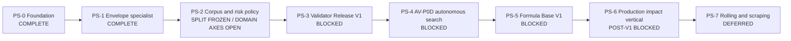

# Roadmap физического синтеза звука

| Поле | Значение |
| --- | --- |
| Статус | `ACTIVE_R&D / PS-2_PITCHER_COMBINED_PROTOCOL_REJECTED / CERAMIC_METHOD_DEVELOPMENT_CLOSED / IRON_SKILLET_METHOD_TRANSFER_REJECTED / FIXED_TAIL_TIMING_MISMATCH_SUPPORTED / SELECTOR_COMPOSITION_MISMATCH_NOT_SUPPORTED / SYNTHETIC_CONTROL_RETAINED / SUBBAND_ESPRIT_SYNTHETIC_CONTROL_NEXT / MECHANICS_BLOCKED / PLANTER_AUDIO_SEALED / AUTHORED_CLIP_FALLBACK / EIGHT_EXACT_CLAIMS_OPEN / AUTOMATIC_PASS_DISABLED / PRODUCTION_P1_BLOCKED` |
| Архитектурная граница | [SPEC-45](../architecture/45-physical-sound-synthesis-and-acoustic-presentation.md), `Proposed` |
| Актуальное evidence | [PS-2 Iron selector/tail diagnostic result](../development/physical-sound-realimpact-selector-tail-diagnostic-result-ps2-2026-08-28.md) |
| Текущий evidence | [PS-2 Bempp quadrupole surface mode and Rust cooker](../development/physical-sound-bempp-quadrupole-surface-mode-ps2-2026-08-28.md), [PS-2 independent Bempp analytical control](../development/physical-sound-bempp-independent-control-ps2-2026-08-28.md), [BEM panel-quadrature discriminator](../development/physical-sound-bem-quadrature-discriminator-ps2-2026-08-28.md), [analytical boundary-solver control](../development/physical-sound-bem-analytical-control-ps2-2026-08-28.md), [REALIMPACT modal-radiation diagnostic](../development/physical-sound-realimpact-modal-radiation-representation-ps2-2026-08-28.md), [frequency-conditioned calibration](../development/physical-sound-realimpact-frequency-spatial-calibration-ps2-2026-08-28.md), [shape-conditioned calibration](../development/physical-sound-realimpact-shape-spatial-calibration-ps2-2026-08-28.md), [multi-object spatial-axis extension](../development/physical-sound-realimpact-spatial-extension-ps2-2026-08-28.md), [vertical spatial calibration](../development/physical-sound-realimpact-spatial-calibration-ps2-2026-08-28.md), [multi-listener acquisition](../development/physical-sound-realimpact-multilistener-acquisition-ps2-2026-08-28.md), [transfer calibration](../development/physical-sound-realimpact-transfer-calibration-ps2-2026-08-28.md), [internet-source feasibility](../development/physical-sound-internet-source-feasibility-ps2-2026-08-28.md), [exact-domain matrix](../development/physical-sound-domain-claims-matrix-ps2-2026-08-28.md), [internet corpus policy](../development/physical-sound-internet-corpus-policy-ps2-2026-08-27.md), prior E3/E2 pilots, [project split](../development/physical-sound-kronland-reject-split-freeze-ps2-2026-08-28.md), [corpus plan](../development/physical-sound-corpus-plan-ps2-2026-08-27.md) и [task state](../development/task-state/physical-sound-synthesis.md) |
| Последний пакет | [Iron selector/tail diagnostic result](../development/physical-sound-realimpact-selector-tail-diagnostic-result-ps2-2026-08-28.md) |
| Детальный план | [Domain admission implementation plan](2026-08-27-physical-sound-domain-admission-implementation-plan.md) |
| Связь с продуктом | Изолированный R8 experiment; не меняет текущий R7 critical path и clip-based audio baseline |
| Горизонт | Валидатор → корпус и риск → автономный поиск → база формул → один production impact vertical → persistent contact |

## Цель

Построить автономный контур, который без послушивания каждого результата:

1. генерирует звук физического взаимодействия из ограниченной математической
   модели;
2. проверяет hard, causal, acoustic и out-of-domain свойства независимым
   версионированным валидатором;
3. допускает формулу только для точного acoustic domain, на котором измерены
   риск, покрытие, стоимость и fallback;
4. накапливает reviewable базу условных формул, а не таблицу
   `material -> coefficients`;
5. cooks допущенную модель в PresentationOnly content, сохраняя authored clip
   как обязательный production fallback.

Первый продуктовый результат — один интерактивный rigid-impact object, который
не выбирает event-specific impact WAV в основной ветке и непрерывно реагирует
на позицию и силу удара. Rolling и scraping начинаются только после этого
impact vertical.

## Что считается конечным состоянием

Исследовательский контур хранит четыре независимо версионируемых внешних
артефакта:

- corpus registry с точными объектами, геометрией, опорой, возбуждением,
  listener/radiation conditions, provenance и frozen splits;
- formula registry с семейством уравнений, revision параметров, domain
  envelope, стоимостью и fallback;
- validator release с hard gates, specialist heads, mutation suites, OOD и
  pre-registered risk/coverage policy;
- immutable domain admission record с `Pass`, `Reject` или
  `FallbackOutOfDomain`.

Генератор не видит calibration/holdout/shadow валидатора. Валидатор не
подстраивается под проверяемую generator revision. Исторический результат не
переписывается: новый corpus, formula или validator создаёт новую revision.

В production попадает только детерминированная cooked-формула и bounded
параметры точного допущенного домена. Корпуса, записи, generated WAVs, learned
weights, embeddings и optimizer state остаются снаружи; runtime не обучается,
не скачивает модели и не запускает validator inference.

## Кто принимает решение о качестве

Операционный валидатор — не человек и не одна нейросеть. Решение принимает
frozen `ValidatorRelease`:

| Компонент | Ответственность | Может выдать `Pass` самостоятельно |
| --- | --- | --- |
| Детерминированные hard/causal gates | Signal safety, exact repeat, force/position relations, bounds | Нет; только reject или продолжение |
| Acoustic specialists | Envelope, modal, spectral evolution, material/object/force/position evidence | Нет; публикуют раздельные признаки и ошибки |
| Learned representations | Дополнительная real-corpus similarity и artifact evidence | Нет; disagreement выбирает fallback |
| OOD и selective-risk controller | Принимает только covered region при confidence-bounded risk | Да, но лишь если все остальные gates прошли |
| Человек | Может создать frozen audit/training evidence или проверить сам validator | Нет live-очереди и нет per-sound asset gate |

Таким образом, Codex или другой optimizer может автономно создавать тысячи
кандидатов, но не может менять правило приёмки внутри того же цикла.

## Неизменяемые guardrails

- PCM, voice, mixer, propagation и validator state остаются presentation или
  external research state и не входят в gameplay/save/replay authority.
- Physics остаётся единственным owner контакта. Production audio читает только
  complete engine-owned committed projection, никогда raw PhysX callback.
- Acoustic material/profile отделён от `PhysicsMaterialDescriptorV2` и не
  меняет collision response.
- Неизвестное условие, недостаточная confidence или disagreement всегда
  выбирают authored clip `FallbackOutOfDomain`.
- Один `Pass` не расширяется с конкретной геометрии, опоры, диапазона силы,
  позиции или listener condition до общего «стекло», «металл» или «дерево».
- Source-model и validator hypothesis не меняются в одном research cycle.
- Real evidence добывается из опубликованных internet sources; пользователь и
  local operator не записывают удары, а microphone/force hardware не является
  prerequisite или fallback.
- Две последовательные недискриминирующие попытки запускают bounded research,
  а не ещё один coefficient grid.
- R&D может идти изолированно, но production P1 остаётся post-v1/неактивным,
  пока главный roadmap явно не назначит slot и concrete consumer.

## Карта зависимостей

Размеры ниже относительные и не являются календарным обещанием. Data
acquisition и внешняя model extraction могут занимать больше времени, чем код.

| Milestone | Статус | Размер | Наблюдаемый outcome |
| --- | --- | ---: | --- |
| PS-0. Research foundation | `COMPLETE` | — | Lab/demo, AV-P0A/B, Registry V1, controlled mutations и grouped-risk measurement воспроизводимы; production baseline не изменён. |
| PS-1. Envelope-specialist closure | `COMPLETE` | S–M | Consensus отвергает B4/B5 и все stationary/frozen controls; coverage `2/3`, `1/3`, `2/3`, но `Pass` остаётся выключен. |
| PS-2. Corpus and risk closure | `IN_PROGRESS / PITCHER_COMBINED_PROTOCOL_REJECTED / CERAMIC_METHOD_DEVELOPMENT_CLOSED / IRON_SKILLET_METHOD_TRANSFER_REJECTED / FIXED_TAIL_TIMING_MISMATCH_SUPPORTED / SELECTOR_COMPOSITION_MISMATCH_NOT_SUPPORTED / SYNTHETIC_CONTROL_RETAINED / SUBBAND_ESPRIT_SYNTHETIC_CONTROL_NEXT / MECHANICS_BLOCKED / PLANTER_AUDIO_SEALED / AUTHORED_CLIP_FALLBACK / EIGHT_EXACT_CLAIMS_OPEN` | L | Repeated diagnostic `02551f29…48d1` shows source persistence `0.7059/0.7647/0.6471` at `100/200/400 ms` but `0.3529` at 900 ms; all-onset adaptive validity is `0.7647`. Do not select an early tail from opened Iron. Next prove a synthetic subband common-pole estimator before another object. |
| PS-3. Validator Release V1 | `BLOCKED_BY_PS-2` | M | Один frozen release демонстрирует bounded false-pass risk и useful coverage на grouped holdout/shadow или честно остаётся fallback-only. |
| PS-4. AV-P0D autonomous formula search | `BLOCKED_BY_PS-3` | M–L | Один полный поиск заканчивается reproducible registry decision без per-candidate human input. |
| PS-5. Formula Base V1 | `BLOCKED_BY_PS-4` | XL | Есть минимум по одному exact admitted domain для thin metal vessel/shell, thin glass vessel и dry hardwood block, каждый со своим fallback. |
| PS-6. Production rigid-impact vertical | `POST_V1 / BLOCKED_BY_CONSUMER` | L–XL | Один player-visible object использует production contact/content/mixer path и проходит candidate `AUDIO-PHYS-*` checks. |
| PS-7. Persistent contact | `DEFERRED_BY_PS-6` | XL | Rolling/scraping доказаны отдельным speed/load/roughness corpus и не зависят от callback-frequency artifacts. |

## PS-0 — Research foundation

Завершено:

- fixed-point steel/wood/glass laboratory and off-by-default demo;
- selected Q30 thin-container transfer and exact PCM repeat;
- AV-P0A hard/metamorphic tri-state validator;
- AV-P0B grouped real/material benchmark;
- Registry V1, который запрещает forged `Pass`;
- 36 controlled temporal mutations и AV-P0C grouped-risk report;
- сохранённые negative controls: glass D/F, steel v3/v4 stationary residual,
  shuffled-envelope wood B4/B5.

Текущий результат — не admission. На provisional threshold real coverage равно
`1/3`, `1/3`, `0/3`, grouped false pass — `0/3`, `1/3`, `1/3`, а holdout и
shadow Wilson upper false-pass risk — `0.7923`.

## PS-1 — Закрыть известный blind spot валидатора

Deliverables:

- отдельный amplitude-envelope trajectory profile: frame log-RMS slope и
  curvature, monotonicity violations, early/mid/late energy ratios и coupling
  energy change со spectral change;
- exact unit controls и deterministic report repeat;
- remeasurement на неизменных corpus, partitions, parent groups, mutations и
  provisional threshold-selection rule;
- explicit failure tags для shuffled-envelope и real-coverage regressions.

Exit criterion:

- обе frozen wood B4/B5 shuffled-envelope мутации отвергаются;
- все прежние stationary-white, stationary-coloured и frozen-spectrum controls
  остаются отвергнуты;
- hard/causal controls и report bytes повторяются;
- real coverage, grouped risk и worst counterexamples опубликованы без
  включения `Pass`.

Если два specialist variants лишь перемещают ошибки или обваливают real
coverage, следующий шаг — research причин `envelope representation` против
`corpus/acquisition mismatch`, а не изменение source model.

Результат: `COMPLETE`. Профили `amplitude-envelope-ps-1-v1` и
`temporal-amplitude-consensus-ps-1-v1` реализованы и измерены на неизменном
AV-P0C pack. Consensus threshold `0.9305864784564901` отвергает все 36
controlled mutations, включая B4/B5, при real coverage `2/3`, `1/3`, `2/3`.
Report повторяется byte-identical; подробные hashes, margins и оставшиеся
false rejects опубликованы в [PS-1 evidence](../development/physical-sound-validator-ps1-2026-08-27.md).
Нулевой observed false pass не включает `Pass`: при трёх parent groups на split
Wilson upper всё ещё `0.5615`, поэтому следующий шаг — PS-2 corpus/risk closure.

PS-2 contract checkpoint: external-only `physical-sound-registry corpus-plan`
фиксирует exact axes, source/provenance hashes, canonical grouping keys,
calibration-only threshold selection, sealed shadow, mutation monotonicity и
mandatory fallback. Для maximum grouped false-pass risk `0.10` при 95%
confidence инструмент требует минимум 35 reject-parent groups; для useful
coverage lower bound `0.80` — 16 in-domain groups. Frozen glass-vessel plan на
40/40 groups получает только `PlanPowerSufficient`; recordings ещё не собраны,
`Pass` и AV-P0D остаются выключены. См. [PS-2 evidence](../development/physical-sound-corpus-plan-ps2-2026-08-27.md).

PS-2 pilot checkpoint: `physical-sound-registry corpus-inventory` импортировал
один real 48 kHz REALIMPACT GlassGoblet transfer с exact mesh vertex, listener
position и audio hash. Finite/byte-count и partition-leakage audit повторяются,
но downloadable archive не содержит force-profile bytes, material composition,
repeat identity и support-fixture revision. Автоматический outcome —
`FallbackOutOfDomain`; pilot не получает calibration/holdout/shadow credit. См.
[pilot evidence](../development/physical-sound-realimpact-pilot-ps2-2026-08-27.md).

PS-2 acquisition-contract checkpoint: a raw synchronized entry now requires
equal microphone/force dimensions, explicit repeat ID, positive calibrated
force, material composition, fixture revision and both calibrations by hash.
Complete test data becomes only `ResearchEligible`; the unchanged REALIMPACT
pilot report remains byte-identical fallback. This is now an `E1` import shape,
not a local recording plan. The active [internet corpus policy](../development/physical-sound-internet-corpus-policy-ps2-2026-08-27.md)
requires published sources, bounded external fetch/cache, source adapters and
claim-scoped capability accounting. Local force hardware is not a blocker.

PS-2 internet-source checkpoint: `physical-sound-registry internet-sources`
now validates source revisions, provenance reviews, exact hashes/byte counts,
bounded HTTPS fetch, a content-addressed external cache and artifact-backed
`E1`--`E4` claims. Two fresh online caches and an offline rerun produced the
same report. Small ObjectFolder files validate synthetic lineage only; the
36.37 GB ObjectFolder-Real acoustic archive remains `DiscoveryOnly` because the
publisher supplies no SHA-256, so it was not downloaded and grants no `E1`--`E3`
credit. See the [source/cache evidence](../development/physical-sound-internet-source-pipeline-ps2-2026-08-27.md).

PS-2 first-real-adapter checkpoint: `av-msf-identified-recording-v1` freezes an
official AV-MSF commit, exact Object 95 `Glass` metadata and contact recordings
`012,036`. It validates both mono 44.1 kHz float32 payloads and grants only
`E3IdentifiedRecording`. Two fresh online caches and an offline audit produce a
byte-identical report. This is one object group, so it opens no calibration,
holdout or shadow and gives no statistical/admission credit. See the
[AV-MSF E3 evidence](../development/physical-sound-av-msf-e3-pilot-ps2-2026-08-27.md).

PS-2 multi-object E3 checkpoint: `physical-sound-registry identified-corpus`
reruns the source audit offline, requires exact adapter-backed E3 capabilities,
derives source/object/recording groups and rejects cross-partition leakage. The
complete frozen AV-MSF public page validates 10 objects, 20 recordings and 6
material labels in two fresh caches plus an offline repeat. All ten objects
share one project/revision group and therefore remain in `dev`; Glass contributes
2 object groups/4 recordings against the planned minimum of 16. This is
`DevelopmentCoverageMeasured`, not corpus admission. See the
[multi-object evidence](../development/physical-sound-av-msf-e3-multiobject-pilot-ps2-2026-08-27.md).

PS-2 typed E2 checkpoint: corpus-inventory V2 requires a source-specific
adapter for deconvolved transfers. The first REALIMPACT profile freezes one
official repository commit, five source artifacts and the exact GlassGoblet row
0 metadata/audio/provenance hashes. Three V2 runs repeat byte-identically and
the old V1 report is unchanged. The row receives scoped transfer, geometry,
impact/listener, object and real-recording E2 capabilities, but remains
`FallbackOutOfDomain` because raw force, composition, repeat and fixture
revisions are absent. See the
[typed E2 evidence](../development/physical-sound-realimpact-e2-adapter-ps2-2026-08-27.md).

PS-2 first-independent-E3 checkpoint: `ycb-impact-identified-recording-v1`
freezes the official YCB Impact robot component, one exact object/material
workbook and eight repeated Glass recordings for Wineglass and Skillet lid. A
tightly scoped OSF policy validates one expected-hash redirect while generic
redirects remain disabled. Two fresh online caches plus offline source and
identified-corpus reruns are byte-identical. Combined with AV-MSF this yields
two publisher/project/revision groups, 12 objects and 28 recordings; Glass is
now 4 object groups/12 recordings against the minimum 16 groups. All entries
remain in `dev`; upstream `train`/`test` does not open NextEngine holdout. See
the [independent YCB evidence](../development/physical-sound-ycb-independent-e3-pilot-ps2-2026-08-27.md).

PS-2 third-project-group checkpoint: `heller-impact-identified-recording-v1`
freezes the official CMU KiltHub Impact Events archive and recording notes, then
credits only the explicitly named Glass-vase event and its five repeats. A
source-specific Figshare redirect and bounded in-process ZIP reader validate
the exact archive and PCM16 entries without filesystem extraction. Mirror,
red-vase and different-impactor variants receive no inferred Glass/object
credit. Combined coverage is three publisher/project/revision groups, 13
objects and 33 recordings; Glass is 5 groups/17 recordings, leaving 11 groups
open. All entries remain in `dev`. See the
[independent Heller evidence](../development/physical-sound-heller-independent-e3-pilot-ps2-2026-08-27.md).

PS-2 Greatest Hits discriminator: bounded range reads recover the complete
735-kB ZIP64 central directory and 979 label files without the 20-GB archive.
They expose 382 Glass-labelled events across 31 videos, but no stable target
object ID; 28 videos also contain other material labels and the source permits
several objects per scene. Ordinary TLS chain verification for the archive host
also fails. Video-as-object grouping and an insecure adapter are rejected, so
coverage remains `5/16`. See the
[bounded discriminator](../development/physical-sound-greatest-hits-discriminator-ps2-2026-08-27.md).

PS-2 GreenGoblet bounded-range checkpoint: `physical-sound-registry
realimpact-row` freezes the official archive HTTP identity, EOCD, central
directory, ZIP entries, decoded NPY/mesh hashes and the first 1 MiB compressed
transfer prefix. It transfers 1,612,392 bytes instead of 2.31 GB, proves that
row 0 maps exactly to mesh vertex 31676 and emits a self-contained V2 inventory
whose repeated acquisition/report hashes are byte-identical. REALIMPACT now
provides two E2 object targets. Missing raw force, composition, repeat and
fixture revisions keep both fallback-only, and E3 Glass coverage stays `5/16`.
See the [bounded-range evidence](../development/physical-sound-realimpact-green-goblet-range-pilot-ps2-2026-08-27.md).

PS-2 fourth-project-group checkpoint: ObjectFolder-Real was tested first and
rejected as the immediate acquisition route because its 34–39 GB single-stream
gzip batches place large media between impact records and expose no bounded
seek path. `freesound-glass-bowl-identified-recording-v1` instead freezes one
explicitly named medium-pitched Glass bowl and eight wood-strike HQ MP3
previews. A source-specific canonical page projection removes dynamic
CSRF/download fields, and the adapter validates exact preview hashes plus
MPEG/Xing/LAME gapless structure. Two independent online caches and offline
audits are byte-identical. Combined coverage is four project revisions,
14 objects/41 recordings; Glass is `6/16` and 25 recordings. Ten Glass groups
and all 35 reject parents remain open. See the
[Freesound evidence](../development/physical-sound-freesound-glass-bowl-e3-pilot-ps2-2026-08-28.md).

PS-2 fifth-project-group checkpoint: a different Freesound publisher provides
three numbered knife strikes on a wine-glass family. The typed adapter validates
the exact HQ MP3 streams and canonical pack identity in two imported cache
roots; source and identified-corpus reports repeat byte-identically. Direct
bounded fetch currently receives HTTP 403 and therefore remains an explicit
transport recheck, not a reason to add a proxy bypass. Combined coverage is 5
project revisions, 15 objects/44 recordings; Glass is `7/16` and 28
recordings. Nine Glass groups and all 35 reject parents remain open. See the
[cached evidence](../development/physical-sound-freesound-wine-glass-e3-pilot-ps2-2026-08-28.md).

PS-2 explicit-role checkpoint: `identified-corpus` now requires a complete
`target`/`reject_parent` classification once explicit mode is used and rejects
material-role mismatches before report publication. Seven Glass objects remain
targets; eight non-Glass AV-MSF objects/sixteen recordings are development-only
reject parents. The report measures `8/35`, leaving 27 parent groups; it does
not claim generated negatives, validator rejection or false-pass risk. The
historical implicit report remains byte-identical. See the
[explicit-role evidence](../development/physical-sound-explicit-reject-parent-import-ps2-2026-08-28.md).

PS-2 declarative-Freesound checkpoint: `freesound-pack-identified-recording-v1`
derives canonical publisher/pack/CDN/license identities and requires exact
pack metadata, preview hashes, gapless MP3 counts and material-bearing
publisher phrases while moving pack-specific values out of Rust. Both frozen
Freesound families repeat from two cache roots; the explicit corpus remains 15
objects/44 recordings, Glass `7/16`, reject parents `8/35`, and the legacy
reports stay byte-identical. Strong Glass-bottle candidates were discovered,
but current canonical raw access returns HTTP 403, so no guessed metadata or
new coverage is claimed. Next source acquisition is now a reviewed manifest
operation when an exact-download route exists. See the [declarative adapter
evidence](../development/physical-sound-declarative-freesound-adapter-ps2-2026-08-28.md).

PS-2 sixth-project-group checkpoint: the 34–39 GB ObjectFolder-Real gzip
archives remain rejected, but the official interactive demos expose a distinct
bounded route to individual impact MP4s. The typed adapter validates exact
official object/material rows, demo/repository bindings, immutable commit/tree
identity, raw paths, SHA-256, computed Git blob SHA-1 and bounded MP4/MP3
structure. Five objects/fifteen recordings add two Glass targets and three
non-Glass parents. The combined corpus repeats at six project revisions,
20 objects/59 recordings; Glass is `9/16` and 34 recordings, reject parents are
`11/35` and 25 recordings. All remain in `dev`; seven targets and twenty-four
parents remain open. See the [ObjectFolder-Real demo evidence](../development/physical-sound-objectfolder-real-demo-e3-pilot-ps2-2026-08-28.md).

PS-2 reject-parent-minimum checkpoint: the official YCB vertical tree binds
recordings to per-object folders, unlike the non-Glass horizontal tree whose
clips are only material-aggregated. The additive typed profile imports three
objects from each of nine primary non-Glass materials and two unique Ogg/Vorbis
files per object. Two independent online caches and two complete offline audits
repeat byte-identically. The combined corpus is 47 objects/113 recordings;
Glass remains `9/16`, while reject parents reach `38/35` and 79 recordings.
All remain in `dev` and the 27 objects share the existing YCB project/revision,
so the count does not open calibration/holdout/shadow or establish false-pass
risk. See the [YCB vertical evidence](../development/physical-sound-ycb-vertical-reject-expansion-ps2-2026-08-28.md).

PS-2 cross-tier E2/E3 checkpoint: the refactored `realimpact-row` command keeps
the GreenGoblet profile byte-identical and adds one independently frozen
`blue-bowl-row-0-v1` range profile. REALIMPACT `6_Bowl` is the same numbered
ObjectFolder Glass object 6 whose interactive demo already supplies three E3
recordings. Two online acquisitions and two V2 inventory audits reproduce
byte-identically after transferring only `1,734,304` bytes of the 2.40 GB
archive. The exact mesh, vertex `35950`, listener axes and `3000 x 230215`
transfer array create the first same-object E2/E3 anchor and the third
REALIMPACT E2 object. It remains fallback-only and contributes no new E3 group,
so Glass stays `9/16` and all non-development splits remain closed. See the
[Blue Bowl evidence](../development/physical-sound-realimpact-blue-bowl-cross-tier-ps2-2026-08-28.md).

PS-2 distinct-shell E2 checkpoint: `shell-plate-row-0-v1` binds REALIMPACT
`51_ShellPlate` to numbered ObjectFolder object 51 `Fruit_Bowl / Glass`. Two
online acquisitions and two V2 audits repeat byte-identically after transferring
`1,700,993` bytes (`0.072607%`) of the 2.34 GB archive. The exact `48,070`-vertex
mesh spans approximately `298 x 299 x 41` mm, row 0 binds vertex `15341`, and
the transfer shape is `3000 x 210424`. This fourth REALIMPACT E2 object remains
fallback-only and adds no E3 group, so Glass stays `9/16` and all
non-development splits remain closed. The generator now reads material family
from each frozen profile instead of globally hard-coding Glass. See the
[Shell Plate evidence](../development/physical-sound-realimpact-shell-plate-range-pilot-ps2-2026-08-28.md).

PS-2 seventh-project-group checkpoint: the official Kronland material-impact
page explicitly separates five numbered `Glass N original` recordings from
their synthesized and tuned derivatives. The typed
`kronland-material-identified-recording-v1` adapter imports only the original
mono PCM16 WAVs, binds exact page/track/object identities and validates their
44.1 kHz structure and frame counts. Two independent online caches and two
complete combined audits repeat byte-identically, and every WAV matches the
earlier AV-P0B hash. The combined corpus reaches 52 objects/118 recordings in
seven project revisions; Glass reaches `14/16` and 39 recordings while reject
parents remain `38/35`. All entries remain `dev`, two Glass targets and all
project-disjoint splits remain open, and no geometry, force, transfer,
admission or quality credit is created. See the [Kronland evidence](../development/physical-sound-kronland-glass-e3-expansion-ps2-2026-08-28.md).

PS-2 fifth-E2-object checkpoint: the bounded E3 audit rejects ObjectFolder's
non-Glass `fork_vis`, processed-spectrogram-only material benchmark and YCB's
objectless horizontal Glass aggregation without downloading their large source
archives or inventing identity. The roadmap fallback `skull-cup-row-0-v1`
binds REALIMPACT object 60 to ObjectFolder `Beer_Glass / Glass`. Two online
acquisitions and two V2 audits repeat byte-identically after transferring
`1,670,815` bytes (`0.071751%`) of the 2.33 GB archive. The exact
`47,810`-vertex mesh spans approximately `89 x 90 x 151` mm, row 0 binds vertex
`2764`, and the transfer shape is `3000 x 209549`. This fifth REALIMPACT E2
object remains fallback-only and adds no E3 group, so Glass stays `14/16` and
all non-development splits remain closed. See the
[Skull Cup evidence](../development/physical-sound-realimpact-skull-cup-range-pilot-ps2-2026-08-28.md).

PS-2 aggregate-coverage and split-audit checkpoint: the published SoundPacks
`Glass Recordings` archive adds an eighth project/revision group through the
typed `soundpacks-glass-recordings-identified-recording-v1` adapter. A stable
page projection, exact MediaFire file-key resolver and bounded pure-Rust RAR5
reader validate four numbered drinking-glass and three numbered glass-vase WAVs
without redistributing the archive. Independent online/offline and complete
combined reports repeat byte-identically. The corpus reaches 54 objects/125
recordings; Glass closes at `16/16` objects and 46 recordings, while reject
parents remain `38/35` objects and 79 recordings.

The new `physical-sound-registry split-feasibility` gate then proves that these
aggregate counts cannot yet form the frozen `20/30/25/25` project-disjoint
partitions: all eight projects contain targets, but only three contain reject
parents. Its exact decision is `ProjectDisjointSplitInfeasible` because four
partitions require at least four reject-bearing project groups. Every entry
therefore remains in `dev`; `Pass`, PS-3 and AV-P0D stay disabled. The next
Package 3 increment is at least one independent reject-bearing project, not
more target-only Glass. See the [SoundPacks and split evidence](../development/physical-sound-soundpacks-glass-e3-and-split-audit-ps2-2026-08-28.md).

PS-2 project-split checkpoint: the official Kronland page also publishes five
numbered Wood originals and five numbered Metal originals. The expanded typed
adapter grants only object/material/real-recording identity, and a stable page
projection excludes rotating WordPress state while preserving all original,
synthesized and tuned track bindings. Two online caches and one offline replay
repeat byte-identically; the legacy five-Glass report is unchanged. The
combined E3 corpus is eight projects, 64 objects and 135 recordings; Glass
remains `16/16` and 46 recordings, while reject parents reach `48/35` and 89.
Kronland becomes the fourth dual-role project, closing the prior feasibility
blocker.

`physical-sound-registry split-freeze` now binds the corpus, feasibility and
plan hashes, applies the frozen seed with bounded deterministic backtracking,
and assigns two whole projects to each partition. Two post-split corpus audits
and two entry-level verifications repeat byte-identically. Every partition has
target and reject evidence; `dev/calibration/holdout/shadow` contain
`30/6/12/16` objects and `70/20/27/18` recordings. This is split evidence only:
domain-axis closure, calibrated selective risk, sealed shadow evaluation,
`Pass`, PS-3 and AV-P0D remain open. See the [Kronland/split evidence](../development/physical-sound-kronland-reject-split-freeze-ps2-2026-08-28.md).

PS-2 exact-domain checkpoint: `physical-sound-registry domain-claims` now
hash-links the frozen plan, partitioned E3 corpus, verified split and five
REALIMPACT E2 reports. Only the reviewed Blue Bowl object 6 relation is an
admitted cross-tier identity; a control rejects the tempting but false
`94_GlassGoblet` / ObjectFolder `94 Salad_Bowl` numeric join. Repeated reports
return `DomainEvidenceIncomplete / FallbackOutOfDomain`. Identity, E3 repeats
and one linked transfer are useful, but eight required exact claims remain
unsupported and every partition has zero exact-domain-eligible objects. The
next action is published-source feasibility for those named claims, followed
by either one typed adapter/link or a preregistered internet-native plan
revision. See the [matrix evidence](../development/physical-sound-domain-claims-matrix-ps2-2026-08-28.md).

PS-2 published-source checkpoint: `physical-sound-registry
source-feasibility` now hash-links the incomplete domain matrix to seven frozen
primary artifacts for REALIMPACT, ObjectFolder Real and AV-MSF. Two runs are
byte-identical and return `ReviewedSourcesCannotCloseV1`: none of the eight
exact blockers closes. The gate selects
`realimpact-normalized-transfer-calibration-v1` as a transfer-only next route,
with explicit prohibitions on absolute amplitude, exact material/support,
matched cross-tier conditions, admission, `Pass` and runtime content.
ObjectFolder Real force calibration is deferred; AV-MSF is reconsidered after
code/data publication. The next package preregisters and executes relative
modal/spatial fitting on object-disjoint REALIMPACT E2 rows. See the
[feasibility evidence](../development/physical-sound-internet-source-feasibility-ps2-2026-08-28.md).

PS-2 transfer-calibration checkpoint: `physical-sound-registry
transfer-calibration` preserves its first frozen revision as
`INVALID_METRIC_CONFOUND`; non-injective tail reuse and shared coarse damping
bins invalidate the apparent Shell Plate gate. A separately hash-closed V2
uses injective one-to-one matching, separated peaks and finer damping bins,
selects `injective-modal-16-fft65536-v2` on Shell Plate and evaluates the
previously unopened Skull Cup once. Two V2 reports are byte-identical and all
five modal/damping gates pass: recall `0.5625`, median frequency error
`28.0099` cents, decaying fraction `0.5625` and tail-prediction RMSE `6.0133`
dB. The allowed result is relative modal/damping extractor transferability,
not glass identity or naturalness. Spatial participation is
`NotEvaluableSingleListenerRowPerObject`; all eight exact claims, admission,
`Pass`, PS-3, AV-P0D and production remain open. The next bounded package is a
typed multi-listener REALIMPACT acquisition pilot followed by a preregistered
object-disjoint spatial discriminator. See the [transfer-calibration
evidence](../development/physical-sound-realimpact-transfer-calibration-ps2-2026-08-28.md).

PS-2 multi-listener acquisition checkpoint: the frozen
`green-goblet-listener-block-0-v1` profile binds the official preprocessing
revision, annotation arrays, transfer V2 prerequisite and a fixed 16 MiB
archive prefix. Rows `0..14` share Green Goblet vertex `31676`, azimuth `0` and
distance offset `0` while covering microphone IDs `0..14` at 15 distinct
listener heights. Two complete acquisitions are byte-identical; the typed
manifest is `fcf44d41…50de`, report `cef5d381…7680` and raw block
`8bcffd0a…75ca`. The decision is `MultiListenerAcquisitionPilotOnly`: this
closes development data access, not a spatial model, cross-object transfer or
quality. Before reading more listener rows, preregister Green Goblet dev, Shell
Plate calibration and Skull Cup spatial holdout together with candidates,
normalization, metrics, gates and bounded ranges. See the [multi-listener
evidence](../development/physical-sound-realimpact-multilistener-acquisition-ps2-2026-08-28.md).

PS-2 vertical spatial-calibration checkpoint: the external preregistration
manifest `077b9a46…f2cb` freezes Green Goblet development, Shell Plate
calibration and Skull Cup holdout before new listener-row access. It freezes
nine anchors, six held listener heights, microphone `7` normalization, 16
transfer-V2 frequencies, four candidates and six conjunctive gates. Shell
selects `vertical-rbf-sigma052-ridge001-v1`; the selection snapshot
`0aea2b62…0320` is hashed before Skull is opened. Two complete reports repeat
at `abc13a9c…989d`. Skull passes with median `4.6881 dB`, p90 `13.0040 dB`,
persistent median `4.0082 dB`, constant-baseline ratio `0.7623` and improved
component fraction exactly `0.5`. This supports one fixed-angle/distance
vertical spectral-participation interpolation only. Keep the RBF frozen and
evaluate at least two additional object-disjoint impact blocks; add explicit
angle/distance partitions before any 3D/radiation-field proposal. See the
[spatial-calibration evidence](../development/physical-sound-realimpact-spatial-calibration-ps2-2026-08-28.md).

PS-2 multi-object spatial-axis checkpoint: Green axis development passes all
six fixed-candidate condition blocks. Evaluation manifest `dbc958bd…6912`
then freezes Blue Bowl and Glass Goblet as equally required holdouts before
rows `1..134` are opened. Two reports repeat at `77a1f9e9…356a`. Glass passes
`4/6`; Blue passes `3/6`, fails its base block, and the study returns
`FixedVerticalCandidateTwoObjectAxisStratificationRejected`. The RBF remains a
narrow conditional pilot, not a generic glass/material profile. Blue and Glass
cannot become development data. Next preregister a fresh object-disjoint split
and compare a coordinate-only control against one shape-conditioned model;
retain per-object/clip fallback. See the [extension evidence](../development/physical-sound-realimpact-spatial-extension-ps2-2026-08-28.md).

PS-2 shape-conditioned calibration checkpoint: official-roster hash ordering
freezes ten development, two calibration and two holdout objects before audio
access. Development reports repeat at `3d18358b…4962f`. The single preregistered
bbox/aspect/impact-conditioned object bandwidth is then evaluated unchanged;
calibration reports repeat at `ffb17687…aad6`. Both candidate condition gates
pass and p90 improves, but median ratio `1.0122` fails `0.95` and maximum object
ratio `1.0242` fails `1.0`. Decision:
`MeshConditionedBandwidthCalibrationRejected`. No holdout payload is opened.
Next test one per-mode bandwidth conditioned on frequency/acoustic scale with
fresh calibration; preserve per-object/clip fallback. See the
[shape-calibration evidence](../development/physical-sound-realimpact-shape-spatial-calibration-ps2-2026-08-28.md).

PS-2 frequency-conditioned calibration checkpoint: twelve opened objects and
192 selected modes fit one frozen `kL`/shape/impact-conditioned per-mode
bandwidth under manifest `88cac5bc…09f`. Fresh calibration manifest
`92ebe6a7…42f8` then opens only `100_Frisbee` and `32_WoodChalice`. Both
candidate condition gates pass, but median ratio `1.0146` fails `0.95` and
maximum object ratio `1.0266` fails `1.0`; reports repeat at
`42b6605d…983`. Decision:
`FrequencyConditionedBandwidthCalibrationRejected`. The frequency coefficient
collapses near zero, both ceramic holdouts remain unopened and RBF-bandwidth
tuning is retired. Next use already-open blocks for one bounded complex
per-mode radiation-basis sufficiency experiment. Only a successful
representation test may lead to fresh validation and an offline surface-mode
plus PAT/BEM-style cooker. See the [frequency-calibration
evidence](../development/physical-sound-realimpact-frequency-spatial-calibration-ps2-2026-08-28.md).

PS-2 modal-radiation representation checkpoint: manifest `686c1d42…0ff`
binds fourteen already-open blocks before their complex mode responses are
inspected. The order-three axisymmetric outgoing multipole candidate passes
all `14/14` absolute condition gates but loses every frozen comparison:
median object ratio `1.2506`, maximum `2.0861`, p90 regression `+7.2513 dB`
and improved fraction `0.3482`. Reports repeat at `7cbf7c59…f25`; no fresh
impact/angle/distance or ceramic holdout payload opens. Decision:
`ComplexMultipoleRepresentationDevelopmentRejected`. Do not increase empirical
order on these rows. Next hash-close classical modal analysis plus BEM acoustic
transfer on one analytical synthetic fixture, using the frozen NeuralSound
classical generation path as the first feasibility candidate. Train no network
and open no new REALIMPACT data until this control passes. See the
[modal-radiation evidence](../development/physical-sound-realimpact-modal-radiation-representation-ps2-2026-08-28.md).

PS-2 analytical boundary-solver checkpoint: manifest `9a26ca13…8095` freezes a
pulsating-sphere indirect single-layer BEM control across three `ka` values,
three listener radii, ten directions and 80/320-panel meshes. Both reports are
byte-identical at `6f74a309…a689`. Fine maximum error is `2.1251%`, magnitude
error `0.1827 dB`, phase error `0.2993°` and direction span `0.0002 dB`, so all
four absolute gates pass. The fine/coarse median ratio is nevertheless
`2.8589` against the frozen `0.8`; decision is
`ClassicalBoundarySolverAnalyticalControlRejected`. Preserve the harness and
holdouts; next test convergence with added resolution or an independent
classical result on synthetic data. See the [analytical-control
evidence](../development/physical-sound-bem-analytical-control-ps2-2026-08-28.md).

PS-2 panel-quadrature discriminator: manifest `b9ff02c9…dff47` binds the exact
V1 report and changes only the symmetric triangle rule from three to seven
points. Absolute candidate gates pass, but fine/coarse median error is
`2.6109` against `0.8` and candidate/control fine median is `1.0447` against
`0.75`. Reports repeat at `7460750e…b48d`; historical V1 remains
`6f74a309…a689`. Stop regular quadrature variants. Next freeze Bempp-cl `0.4.2`
revision `a1eaaef9…e1c0` as an independent Galerkin/singular-quadrature sphere
control. See the [quadrature
evidence](../development/physical-sound-bem-quadrature-discriminator-ps2-2026-08-28.md).

PS-2 independent Bempp checkpoint: manifest `33d30a35…3873` pins Python
`3.12.13`, Bempp-cl `0.4.2` revision `a1eaaef9…e1c0`, CPU/Numba and the direct
Neumann-to-Dirichlet formulation. The 512-panel sphere reaches `1.2710%`
maximum complex error, `0.1111 dB` magnitude error, `0.4844°` phase error,
`0.0074 dB` direction span and `0.2625` fine/coarse median ratio. All six
GMRES solves and seven gates pass; reports repeat at `ba638a21…01f1`. This
supports only an analytical sphere oracle. Next freeze a non-spherical
prescribed surface mode before opening real data. See the [independent-control
evidence](../development/physical-sound-bempp-independent-control-ps2-2026-08-28.md).

PS-2 quadrupole surface-mode and cooker checkpoint: final Bempp V3 manifest
`3a67f4ad…0e39` explicitly binds radial pullback, zero mean flux and tolerant
classification of the `|P2| = 0.25` boundary. Reports repeat at
`e8e1d4d5…6437`; the 512-panel field reaches `4.5546%` maximum
peak-normalized error, `4.8013%` maximum active relative error, nodal leakage
`1.293e-6`, directional correlation `0.9999978` and refinement `0.2713`.
Cooker manifest `e76d82cb…398fc` fits seven directions at `1.5a`; its two
reports repeat at `054901ee…f871` across 132 held `3a/10a` conditions. Minimum
degree-two energy is `99.9907%`, maximum held peak-normalized error `0.7856%`
and correlation `0.9998376`; all frozen gates pass. This supports one
axisymmetric spherical surface-mode representation only. REALIMPACT and
ceramic holdouts stayed sealed; the following triaxial checkpoint performs the
required non-spherical prescribed-mode cross-check. See the [surface-mode
evidence](../development/physical-sound-bempp-quadrupole-surface-mode-ps2-2026-08-28.md).

PS-2 triaxial/full-angular checkpoint: manifest `74d8ebd1…267d` freezes a
triaxial `0.08/0.10/0.13 m` closed mesh, non-axisymmetric `2 u_x u_z` mode,
three mesh levels, two `kL`, three radii and 56 directions. Its repeated report
`49bee8c2…76ef` passes all convergence/field gates. Sparse near-angle cooker
manifest `e3bbd547…3851` is retained as a rejection: degree 4 reaches
`0.06032` maximum error against `0.05`, localized to the omitted near-shell
angles; report `6d5f653a…ef55` repeats. The separately frozen product-shaped
full-near-shell manifest `e69f09b2…b896` fits all 56 near directions and holds
out all 224 `4L/10L` conditions. It rejects `m=0`, selects full degree 2 at
`0.04604` maximum peak error and `0.9990417` minimum correlation, and repeats
at `a0e0d881…b0be`. This closes non-spherical prescribed-mode representation,
not FEM/material/real-field/quality/admission/runtime evidence, and defined the
following elastic FEM checkpoint. REALIMPACT and ceramic holdouts remained
sealed. See the [triaxial evidence](../development/physical-sound-bempp-triaxial-full-angular-cooker-ps2-2026-08-28.md).

PS-2 elastic FEM/Bempp checkpoint: coarse manifest `eaff559d…79d4` is retained
as a rejection at report `a58f28b9…90ef`; it fails the frozen eigenfrequency,
surface-profile and BEM-field convergence gates. Refined manifest
`1adfe3d6…abf7` tracks the same non-axisymmetric mode across `128/512/2048`
surface panels, converges to `355.651 Hz` and passes all 16 gates; reports
repeat at `a71515fa…a667`. Cooker manifest `d4daf0f3…4cf1` fits all 56 `2L`
directions, holds out 112 `4L/10L` conditions, rejects `m=0` and selects full
degree 2 at `0.030975` maximum peak error and `0.9996932` minimum correlation.
Reports repeat at `c3101130…b476`. This closes one synthetic elastic
eigenmode-to-acoustic representation prerequisite, not real object, material,
quality, admission or runtime evidence. Next preregister one fresh
object-disjoint real spatial-transfer calibration before opening any reserved
REALIMPACT rows; preserve per-object/clip fallback. See the [FEM/Bempp
evidence](../development/physical-sound-fem-eigenmode-bempp-cooker-ps2-2026-08-28.md).

PS-2 REALIMPACT geometry-spatial-transfer preregistration checkpoint:
manifest `5be5f195…e576` binds the exact prior rejection and synthetic-positive
lineage, assigns `65_PitcherCeramic` to calibration and
`63_SmallPlanterCeramic` to a one-shot holdout, and freezes their ZIP/mesh/audio
identities before payload access. The candidate uses a declared non-elastic
cotangent-biharmonic surface proxy, pinned Bempp and the full-angular cooker;
the fixed coordinate RBF and normalization constant remain controls/fallbacks.
Ninety coordinates are anchors and 510 are held across height, angle and
distance. Every frequency, solver, per-stratum and RBF-comparison gate is
conjunctive. The new repository validator reads only eight prerequisite JSON
artifacts and the manifest; two reports repeat at `c2f51cff…01ef`, recording
zero network requests and zero reserved audio bytes. This freezes only the
protocol and opening order. Next implement the deterministic `8192/2048`-face
geometry preflight twice; any topology/numeric/repeat failure returns the clip
fallback before Pitcher audio. See the [preregistration
evidence](../development/physical-sound-realimpact-geometry-spatial-transfer-preregistration-ps2-2026-08-28.md).

PS-2 REALIMPACT geometry-only preflight checkpoint: V1 reports repeat at
`2fb9fd0f…e25d`, read exactly `1308328` compressed mesh bytes and zero reserved
audio bytes, and reject both objects. Their published OBJ indices are
triangle soup: Pitcher/Planter have `16139/15910` connected components before
simplification, so the closed-manifold gate correctly prevents eigensolver and
Bempp input publication. After that immutable rejection, an exact bitwise
coordinate-weld diagnostic reduces the meshes to `8070/7958` unique vertices
with one component and zero boundary/nonmanifold edges. It uses no tolerance,
repair or audio. Next preregister only exact-coordinate welding before the
unchanged `8192/2048` reduction and repeat geometry preflight; Pitcher and
Planter audio remain sealed. See the [preflight
evidence](../development/physical-sound-realimpact-geometry-preflight-ps2-2026-08-28.md).

PS-2 exact-weld geometry V2 checkpoint: manifest `85ca065b…f46f` changes only
bitwise coordinate welding before the unchanged V1 reduction/eigenmode path.
Pitcher/Planter become closed `8070/7958`-vertex surfaces; all welded,
`8192`-face and `2048`-face topology gates pass. Sixty-four modes have maximum
residuals `3.141e-13/4.446e-13`. Report `c1c86f78…7e5d` and blocks
`bcd54087…9acc` / `9310910f…5431` repeat byte-identically with zero audio.
This closes geometry setup only. Next freeze a Pitcher-only calibration
manifest binding its exact block, bounded audio prefix/decoder, mapping,
Bempp/cooker, `90/510` split, controls, gates and stop-before-Planter fallback.
See the [V2 evidence](../development/physical-sound-realimpact-exact-weld-geometry-preflight-ps2-2026-08-28.md).

PS-2 Pitcher calibration preregistration checkpoint: manifest
`c60621cc…4a7` binds only `65_PitcherCeramic` calibration, exact geometry block
`bcd54087…9acc`, one fixed `536870912`-byte compressed prefix, the complete
600-row decoder, extractor implementation hashes, 16-to-64 scale/mapping,
Bempp/full-angular inputs, `90/510` split, controls and all conjunctive gates.
Reports repeat at `2ae1bc0b…9c72` after validating the prerequisite lineage and
geometry bytes with zero network requests and zero reserved audio payload
bytes. Prefix growth, changed-threshold retry and Planter access are forbidden.
Next implement the bounded runner plus synthetic Rust-parity control, then make
the single Pitcher request and repeat from its immutable cache. This package
does not establish real transfer or open the one-shot holdout. See the
[calibration preregistration evidence](../development/physical-sound-realimpact-pitcher-calibration-preregistration-ps2-2026-08-28.md).

PS-2 Pitcher runner preflight checkpoint: the exact frozen Rust extractor emits
fixture report `2e3db2d3…5572` and samples `c8316f81…0477` byte-identically.
Python revision `cf93b1fc…6772` recovers all 16 modes with maximum absolute
error `3.02336e-12`, validates the Pitcher geometry arrays, exercises the
one-refit dynamic program and reproduces the `90/510` split. Its two reports
repeat at `6e60d71f…fd2d`. A new Rust projection helper includes the exact
bound spatial DSP and accepts only the future `600 × 230470` block. All runs
read zero network and audio bytes; audio mode stays disabled. Next freeze the
execution script/manifest including expansion origin, Bempp environment,
direction source and staged acquisition/decode before the one prefix request.
See the [runner evidence](../development/physical-sound-realimpact-pitcher-runner-preflight-ps2-2026-08-28.md).

PS-2 Pitcher execution preflight checkpoint: manifest `8e791327…ba45` binds the
final script `c5900a9c…bbfa`, original exact-weld bbox centre/diagonal, 56
directions, `2L/4L/10L` shells, Bempp environment and solver, cooker, raw-
DEFLATE decoder, exact range and all frozen gates. Two reports repeat at
`94d5e1e6…9b32`; the synthetic full-angular held error is below `2e-13` and
extractor parity remains `3.02336e-12`. Network and reserved audio bytes remain
zero. The one exact Pitcher request is now authorized; retry, prefix growth and
Planter access remain prohibited. See the [execution evidence](../development/physical-sound-realimpact-pitcher-execution-preflight-ps2-2026-08-28.md).

PS-2 Pitcher serializer-repair checkpoint: the one request succeeded with
acquisition report `899fbbe9…c819`, prefix `a0dd7006…6cf5`, decode report
`29496c6f…9eef` and exact 600-row block `182f2010…1e0f`. The first offline
analysis completed its numeric work but published no report because a NumPy
comparison boolean was not JSON serializable. Repair manifest
`603c1185…28e3` fixed bool conversion but rejected the correctly parent-bound
decode report before block access. Successor `f51a6046…db7e` binds that failed
repair, accepts only decode report `29496c6f…9eef` under original manifest
`8e791327…ba45`, changes no numeric path and still prohibits acquire/decode.
Two preflights repeat at `9c5c9ca8…471c`; next run the analysis twice offline.
Planter stays sealed. See the [repair evidence](../development/physical-sound-realimpact-pitcher-serializer-repair-ps2-2026-08-28.md).

PS-2 Pitcher calibration checkpoint: repaired offline runs A/B and their exact
Rust projections are byte-identical. Report `8bd5323c…1aea` rejects the
cotangent-biharmonic/Bempp/full-angular candidate. Thirteen modes pass coverage
and every solver residual is healthy, but mapping error is `0.5664/1.6260`
octave median/p90, all held-stratum medians are `19.90–23.44 dB`, and the
candidate is `2.7039×` worse than RBF with `+27.58 dB` p90 regression. Preserve
the clip fallback, keep Planter sealed and do not tune opened Pitcher values.
Next run a bounded research discriminator for thickness/interior shell
mechanics, support/excitation coupling and metadata/observation mismatch on a
separately frozen unopened development object. See the [calibration evidence](../development/physical-sound-realimpact-pitcher-calibration-ps2-2026-08-28.md).

PS-2 Pitcher causal-audit checkpoint: read-only runs A/B repeat at report
`68c79a37…5a57` with zero network, audio or Planter bytes. The audit binds the
unchanged V2 extractor/gate sources and shows that Pitcher's observation fails
the pre-existing decay threshold (`0.4375 < 0.50`) even though the downstream
frequency and field comparisons consumed it. Eleven of sixteen peaks are below
the REALIMPACT paper's `500 Hz` less-anechoic-room boundary. Preserve the
combined-protocol rejection, but do not uniquely blame mechanics. The next
package freezes official unopened `78_CeramicCup` and runs complete observation
admission before any scalar/shell/volume comparison. See the [causal-audit evidence](../development/physical-sound-pitcher-causal-audit-ps2-2026-08-28.md).

PS-2 Ceramic Cup discovery-preflight checkpoint: manifest
`cf2b72ee…a6a9` binds official unopened development object `78_CeramicCup`,
archive HTTP identity, runner `3a574c6e…2f74`, one exact `65536`-byte ZIP-tail
range, one exact `30`-byte audio local header and at most two HTTPS requests.
Preflight A/B repeats at `5fa54efe…17ee` with zero network and payload bytes.
At that checkpoint only discovery was authorized; the completed cache audit and
successor manifest are recorded below. See the [discovery-preflight evidence](../development/physical-sound-realimpact-ceramic-cup-discovery-preflight-ps2-2026-08-28.md).

PS-2 Ceramic Cup observation-protocol checkpoint: discovery acquisition
`2b183dae…782b` and byte-identical offline audit `cd68ba79…1b0b` resolve the
archive without payload. Successor manifest `71123b21…cae5`, streaming runner
`bad26592…60e2` and repeated preflight `5f34993f…8f21` bind two metadata ranges,
one `512 MiB` prefix, 600-row decode, row `7`, extractor parity and unchanged V2
gates. Execute those three requests once; no physics or Planter access before
observation admission. See the [observation-protocol evidence](../development/physical-sound-realimpact-ceramic-cup-observation-preflight-ps2-2026-08-28.md).

PS-2 Ceramic Cup observation-result checkpoint: acquisition `b6d25bc6…6a0c`,
decode `9f1c2311…daf0` and repeated analysis `56591bb8…3fd9` reject the fresh
observation before physics. Only decay fails (`0.25 < 0.50`); `13/16` selected
modes are below `500 Hz`. Pitcher failed the same gate at `0.4375` with
`11/16` sub-`500 Hz` modes. Do not try a third object or weaken the gate; freeze
one offline height/angle/distance diagnostic on the already decoded Ceramic
rows. See the [observation-result evidence](../development/physical-sound-realimpact-ceramic-cup-observation-result-ps2-2026-08-28.md).

PS-2 Ceramic Cup observation-diagnostic preflight: manifest `e7b952fe…375b`,
runner `92d51c02…3ecb` and repeated report `6e97bc0a…066c` bind 27 rows selected
only by metadata axes: 15 height, ten angle and four distance rows with overlap.
The unchanged gate and listener-local/shared/low-frequency criteria are frozen;
the run is offline and cannot select a replacement listener, tune, denoise, run
physics or open Planter. See the [diagnostic-preflight evidence](../development/physical-sound-ceramic-cup-observation-diagnostic-preflight-ps2-2026-08-28.md).

PS-2 Ceramic Cup observation-diagnostic result: repeated report
`47b578ac…2603` supports shared decay mismatch (`23/27` failed; height
`15/15`, angle `7/10`, distance `3/4`) and rejects listener-local failure. The
frozen low-frequency association also fails: fitted-decay fractions are
`0.3583` below versus `0.2252` at/above `500 Hz`. Do not filter, select a row or
run mechanics. Prove a multi-output spatial-energy decay estimator on synthetic
known modes first. See the [diagnostic result](../development/physical-sound-ceramic-cup-observation-diagnostic-result-ps2-2026-08-28.md).

PS-2 multi-output decay-control preflight: manifest `cd8ee856…2078`, runner
`f0483c39…2068` and repeated report `88b017a1…1153` freeze 15 synthetic outputs,
16 known modal decays, one node/delayed single-output control and
`spatial-modal-power-15-v1`. The candidate retains V2 windows and sums modal
power across outputs. Execute twice; any gate failure rejects it, and no real
row may be reused before a complete pass. See the [control preflight](../development/physical-sound-multioutput-decay-control-preflight-ps2-2026-08-28.md).

PS-2 multi-output decay-control result: two executions emit byte-identical
report `a099f50d…e8bea`. Spatial aggregation recovers all 16 known decays with
fraction `1.0`, median truth error `0.35979 dB/s` and tail RMSE `0.34787 dB`;
the frozen node-channel comparator remains at decay fraction `0.0`. This is a
synthetic method control only. Next hash-close the existing Ceramic Cup
fixed-impact/all-microphone counterfactual before any real analysis. See the
[control result](../development/physical-sound-multioutput-decay-control-result-ps2-2026-08-28.md).

PS-2 Ceramic Cup multi-output counterfactual preflight: manifest
`add0017b…25e1`, runner `b5635c42…fb7a` and repeated report
`7bf54ec8…e0e1` bind existing rows `0..14` at `0°/0 mm`, reference row `7`,
the exact synthetic implementation and six support gates. Preflight reads zero
real-payload bytes; each analysis must rehash the full block. Execute twice
after commit, without new data, tuning or physics. See the [counterfactual
preflight](../development/physical-sound-ceramic-cup-multioutput-counterfactual-preflight-ps2-2026-08-28.md).

PS-2 Ceramic Cup multi-output counterfactual result: repeated report
`9947c427…96cbf` rejects the candidate with spatial/reference decay fractions
`0.1875/0.25`; mode count, persistence, frequency and tail RMSE still pass.
Primary setup/code evidence confirms that rows `0..14` are synchronized, but
the authors fit a bandpassed RMS envelope over a per-mode peak/noise interval,
not V2's fixed window. Next freeze that adaptive statistic on synthetic known
truth before any real reuse. See the [counterfactual result](../development/physical-sound-ceramic-cup-multioutput-counterfactual-result-ps2-2026-08-28.md).

PS-2 adaptive modal-decay control preflight: manifest `926921e2…cedf`, runner
`fe59b3d6…9c20` and repeated report `f51e513a…7b49` bind delayed/noisy
15-output known truth, the source-derived bandpass/RMS-envelope fit, fixed-window
comparator and eight checks. Execute twice; any failure rejects. Real data,
frequency cutoffs, mechanics and Planter remain blocked. See the [adaptive
control preflight](../development/physical-sound-adaptive-decay-control-preflight-ps2-2026-08-28.md).

PS-2 adaptive modal-decay control result: repeated report `9fabc2bd…0297f`
passes all checks. All 16 fits are valid, median known-decay error is
`0.68081 dB/s`, median `R²` is `0.999812`, and error improves by
`58.27233 dB/s` over fixed-window V2. This is synthetic evidence only. Next
freeze a separate Ceramic adaptive counterfactual. See the [adaptive control
result](../development/physical-sound-adaptive-decay-control-result-ps2-2026-08-28.md).

PS-2 Ceramic Cup adaptive counterfactual preflight: manifest
`48001fb7…ff9a`, runner `e50bec23…056b` and repeated report
`4358d4da…220f` bind the same rows `0..14`, the synthetic-pass estimator,
fixed comparator `0.1875` and seven checks. Execute twice after commit; each
run rehashes the full block. See the [adaptive counterfactual preflight](../development/physical-sound-ceramic-cup-adaptive-counterfactual-preflight-ps2-2026-08-28.md).

PS-2 Ceramic Cup adaptive counterfactual result: repeated report
`2ec3b03e…d6b7` rejects the method/input pair. Only `6/16` fits have at least
`20 dB` dynamic range; decay fraction and improvement are `0.375/0.1875`.
The pinned source suppresses peaks within ±`10%` of a larger candidate, unlike
V2's dense selection. Close Ceramic and test that salience rule synthetically
before an unopened object. See the [adaptive counterfactual result](../development/physical-sound-ceramic-cup-adaptive-counterfactual-result-ps2-2026-08-28.md).

PS-2 source-derived salience-selector result: manifest `e11ffd56…72f1`, runner
`62043142…4ed2` and byte-identical report `fa940710…0b3e` pass all 14 gates.
The relative ±`10%` dominance plus `900 ms` persistence selector recovers
`16/16` known modes with no false positives; top-16 recovers `4/16`, and exact
bin selection repeats at scales `0.125/1/8`. Adaptive decay remains `16/16`
valid at `0.39520 dB/s` median error. This is synthetic method evidence only.
See the [salience result](../development/physical-sound-salience-selector-control-result-ps2-2026-08-28.md).

PS-2 independent observation preregistration: manifest `a77f6d97…357f`, runner
`27b11de8…70f1` and repeated report `85c53d80…7ead` freeze official unopened
`17_IronSkillet` by roster order. One metadata-only HEAD request read zero
member payload bytes. Next perform only the exact archive-tail and 30-byte
local-header discovery once, then audit twice offline. Observation, mechanics
and Planter remain blocked. See the [independent preregistration](../development/physical-sound-realimpact-independent-observation-preregistration-ps2-2026-08-28.md).

PS-2 Iron Skillet discovery and observation protocol: acquisition report
`b9f659b4…6f6c` uses the exact two ranges, and offline audit
`a3bd84f1…8dab` repeats byte-identically with zero member-payload bytes.
Manifest `573ff0d6…8c93`, runner `7385241d…8273` and repeated zero-access
preflight `19c1f57a…2680` freeze four future requests, audio shape
`(3000,230549)`, impact-zero rows `0..599`, condition identity and unchanged
salience/adaptive gates. Implement and hash-close the execution runner before
any payload access. See the [discovery/protocol evidence](../development/physical-sound-realimpact-iron-skillet-discovery-and-observation-protocol-ps2-2026-08-28.md).

PS-2 Iron Skillet execution preflight: manifest `2c98971a…d8ee`, runner
`0c53553a…0988` and byte-identical zero-access report `b9927f17…672b`
bind the complete preflight/acquire/decode/analyze path. Acquisition is exactly
three 1360-byte metadata ranges plus one 512 MiB audio prefix. Decode is exactly
600 impact-zero rows; analysis uses the unchanged relative salience/adaptive
gates and keeps top-16 diagnostic only. After commit execute once; no retry,
prefix growth, object substitution, physics or Planter. See the [execution
preflight](../development/physical-sound-realimpact-iron-skillet-execution-preflight-ps2-2026-08-28.md).

PS-2 Iron Skillet observation result: exact acquisition/decode reports
`6a99d291…dfeb` / `47acdc35…c099` and byte-identical analysis
`a9c4ae36…206d` reject current real transfer. Persistence is
`0.35294 < 0.50`; adaptive-valid fraction is `0.50 < 0.75`. Scale invariance
and five other gates pass. Diagnostic top-16 has `0.9375/0.9375`
valid/decaying fractions, so preserve the synthetic pass but reject the real
salience pipeline. Next freeze existing-block diagnostics separating ±`10%`
dominance from fixed `900 ms` persistence and research multichannel transient
modal estimation; no tuning, new object, retry, physics or Planter. See the
[observation result](../development/physical-sound-realimpact-iron-skillet-observation-result-ps2-2026-08-28.md).

PS-2 Iron selector/tail diagnostic result: runner `8e815598…6b9bf`, manifest
`00d05074…0281e`, preflight `4fc075c4…5ff2c` and byte-identical analysis
`02551f29…48d1` support a fixed-tail timing mismatch. All-onset source
adaptive-valid is `13/17 = 0.7647`; persistence is
`0.7059/0.7647/0.6471/0.3529` at `100/200/400/900 ms`. The comparator also
decreases `0.625/0.50/0.375/0.125`, so ±10% composition mismatch is not
supported. Do not promote an earlier observed tail. Next prove Gabor/subband
ESPRIT on synthetic multichannel common-pole truth; no new object, mechanics or
Planter. See the [diagnostic result](../development/physical-sound-realimpact-selector-tail-diagnostic-result-ps2-2026-08-28.md).

## PS-2 — Сделать риск статистически измеримым

Deliverables:

- internet discovery/import plan для нескольких independent objects, publishers
  и families в каждом выбранном domain;
- bounded external fetch/cache, source URL/revision/hash/provenance registry и
  adapters для опубликованных formats;
- точные geometry/support/excitation/impact-position/listener axes вместо
  `unspecified` material-only metadata;
- published matched real recordings/transfer responses с claim-scoped `E1`–`E3`
  capability для первой domain family;
- frozen development/calibration/holdout/shadow partitions grouped по object,
  family, source, generator и mutation parent;
- power analysis, после которого numeric maximum false-pass risk и minimum
  useful coverage фиксируются до открытия shadow;
- pre-registered OOD, mutation monotonicity и unavailable-component policy.

Текущее readiness:

| Кандидат | Сильная сторона | Блокер до domain admission |
| --- | --- | --- |
| Q30 thin glass vessel | Exact synthetic geometry, position/force controls и faithful fixed-point transfer | Нет matched real recording, support/radiation calibration и bounded validator evidence |
| Dry hardwood block | Wood-B perceptually accepted; known frozen envelope counterexamples | Нет exact domain metadata, matched position/force corpus и safe risk bound |
| Thin metal vessel/shell | Несколько independent real-metal families и ясный rejected residual | Material-only metadata; source model и evolving spectral dynamics не закрыты |

Первым становится не любимый материал, а domain, где совокупность независимых
internet sources покрывает required claims и grouped evidence. Одна запись не
обязана притворяться полным bundle: `E2` может закрывать modes/spatial transfer,
а `E3` — real identity/envelope. Material-only AV-P0B/YCB rows не получают
выдуманную геометрию, а отсутствие online coverage оставляет domain fallback-only.

## PS-3 — Заморозить Validator Release V1

Release фиксирует corpus/split hashes, deterministic gates, specialist/model
revisions, mutation families, thresholds, OOD и risk/coverage policy до оценки
новой generator revision.

Exit criterion:

- calibration выбирает policy без holdout/shadow;
- grouped holdout и untouched shadow удовлетворяют pre-registered confidence
  bound и minimum coverage;
- все positive, negative, mutation, unavailable-model и reward-hack controls
  имеют declared outcome;
- повторный report byte-identical;
- failure создаёт immutable failed release и новый hypothesis, а не retry с
  другим threshold на том же shadow.

Если полезная coverage не совместима с bounded risk, Validator V1 остаётся
`FallbackOutOfDomain`-only. Это корректный milestone result, но он не открывает
PS-4.

## PS-4 — AV-P0D autonomous formula search

Optimizer получает только development/fit evidence и отдельную cost axis.
Frozen validator и shadow доступны лишь admission step. Каждый цикл меняет
ровно одно source-model family hypothesis.

Плановый первый discriminator — time-varying coloured residual против bounded
modal interaction для thin-metal vessel. Он запускается только при наличии
exact PS-2 domain corpus; иначе используется первый domain, реально прошедший
PS-2, без ослабления axes.

Exit criterion:

- manifest начинает run с exact corpus/formula/validator hashes;
- candidate lineage и Pareto objective воспроизводимы;
- hard/causal gate не может быть компенсирован learned score;
- frozen validator публикует `Pass`, `Reject` или `FallbackOutOfDomain`;
- результат и negative controls повторяются без per-candidate human input.

## PS-5 — Formula Base V1

Цель — три независимо допущенных bounded domain, а не один универсальный
материал model:

1. thin metal vessel/shell impact;
2. thin glass vessel impact;
3. dry hardwood block impact.

Каждая запись содержит exact geometry/support/excitation/listener envelope,
formula/parameter revision, evidence hashes, risk/coverage, cost и authored
fallback. Новая геометрия, опора, диапазон силы или listener set создаёт новую
admission record. Rejected formulas и mutations остаются в базе как knowledge,
которое не позволяет повторить неработающий путь.

Exit criterion: по одной exact domain revision на family имеет hard/causal
PASS, confidence-bounded selective risk, useful coverage, untouched-shadow
evidence, bounded offline/runtime-reference cost и exact fallback. Это всё ещё
research admission, не shipping content.

## PS-6 — Первый production impact vertical

Recommended consumer: один видимый interactable rigid prop в reference project
с несколькими impact positions/energies и обычным authored clip fallback.
Главный roadmap должен явно активировать этот post-v1 slot до runtime work.

Work package:

1. Accepted promoting ADR under ADR-046 с exact consumer and fallback.
2. Complete SPEC-26 committed contact projection: relative velocity, impulse
   bounds, effective mass, contact kind and canonical material tags; pass
   `PHYS-COLLISION-P1` evidence.
3. Freeze minimum consumer-driven `AcousticMaterialProfileV1`,
   `ModalSoundModelV1` and `PhysicalSoundBindingV1` cooked PresentationOnly
   shapes.
4. Cook one admitted research record; never load research registry or learned
   validator at runtime.
5. Wire bounded extraction, fixed-point reference voice, admission/LOD and
   existing mixer/fallback path.
6. Measure whole mixer/callback p95/p99 and memory/queue/voice bounds on the
   production consumer.
7. Promote `AUDIO-PHYS-SOURCE-P1`, `AUDIO-PHYS-CONTENT-P1` and
   `AUDIO-PHYS-PCM-P1`; run focused `fast`, `play`, `content-package` and
   `persistence-replay`, plus conditional `platform`/`performance`.

Exit criterion: enabled, disabled, voice-limited, missing-content and faulted
profiles preserve gameplay, ledger, physics, `AcousticFactV1` and save/replay
roots; canonical 48 kHz PCM and event-to-sample mapping pass; every invalid or
OOD condition selects the exact clip fallback.

## PS-7 — Rolling and scraping

Начинается только после PS-6. Создаёт отдельные formula/validator domains с
speed, normal-load, roughness и contact-continuity axes, включая resting и
separation controls. Если committed rigid contact не воспроизводит stick-slip,
chattering или micro-collision structure, допускается один bounded flexible-
contact counterfactual; произвольный noise tuning и raw callback frequency не
считаются физической моделью.

Fracture, footsteps, cloth, liquids, fire, voice и biological synthesis не
входят в PS-7. Это отдельные source-owner/model programs со своими gates.

## Ближайшая implementation queue

| Порядок | Work package | Gate после выполнения |
| ---: | --- | --- |
| 1 | Реализовать amplitude-envelope specialist и deterministic unit controls | PS-1 code complete; `Pass` всё ещё disabled |
| 2 | Пересчитать frozen AV-P0C pack и зафиксировать grouped risk/coverage report | PS-1 evidence decision |
| 3 | Спроектировать exact-domain acquisition и power analysis, затем заморозить splits/policy — `COMPLETE` | PS-2 corpus contract |
| 4 | Controlled pilot, `E1` bundle import, internet registry/cache, eight-project E3 normalization, explicit roles, five typed E2 rows, exact-domain/source gates, transfer calibration and spatial discriminators — `PITCHER_COMBINED_PROTOCOL_REJECTED / CERAMIC_METHOD_DEVELOPMENT_CLOSED / IRON_SKILLET_METHOD_TRANSFER_REJECTED / FIXED_TAIL_TIMING_MISMATCH_SUPPORTED / SELECTOR_COMPOSITION_MISMATCH_NOT_SUPPORTED / SYNTHETIC_CONTROL_RETAINED / SUBBAND_ESPRIT_SYNTHETIC_CONTROL_NEXT / MECHANICS_BLOCKED / PLANTER_AUDIO_SEALED / AUTHORED_CLIP_FALLBACK / EIGHT_EXACT_CLAIMS_OPEN`; next synthetic subband common-pole control, not an early-tail promotion/object/physics | PS-2 domain-axis readiness |
| 5 | Выпустить или отклонить frozen Validator Release V1 одним declared shadow evaluation | PS-3 go/no-go |
| 6 | Только при go запустить один AV-P0D source-model discriminator | PS-4 first autonomous decision |

Каждый пакет является отдельным coherent commit/evidence boundary. External
recordings, WAVs, features, weights and reports в commit не входят.

## Stop/go policy

| Событие | Решение |
| --- | --- |
| PS-1 не закрывает B4/B5 после двух coherent variants | Bounded research cycle; source tuning запрещён |
| Corpus не позволяет pre-register meaningful confidence/coverage | Расширить independent groups или оставить validator fallback-only |
| Published internet evidence не закрывает required claim/axis | Оставить claim/domain fallback-only; не требовать local capture и не придумывать metadata |
| AV-P0D улучшает fit, но проигрывает frozen validator/shadow | `Reject`, сохранить counterexample, сменить одну hypothesis |
| Ни одна formula family не даёт bounded quality/cost point | Остановить domain и использовать authored clips |
| SPEC-26 projection недостаточна для production excitation | Не обходить raw callback; уточнить consumer-driven projection или остановить P1 |
| Whole-mixer budget не проходит | Явно снизить modes/voices/LOD либо оставить clip fallback; не ослаблять authoritative isolation |
| Нет roadmap slot или player-visible consumer | Research artifacts сохраняются; public schemas/runtime integration не начинаются |

## Definition of done

- **Validator done:** PS-3 публикует measured confidence-bounded automatic
  decision на grouped independent evidence без live human gate.
- **Research loop done:** PS-4 воспроизводимо принимает или отклоняет новую
  formula revision без изменения validator внутри цикла.
- **Formula base V1 done:** PS-5 хранит по одной exact admitted domain для
  metal, glass и wood вместе с negative knowledge и fallbacks.
- **First product value done:** PS-6 проходит production contact/content/PCM,
  root-isolation and whole-mixer gates для одного visible prop.
- **Persistent-contact expansion done:** PS-7 отдельно доказывает rolling и
  scraping; impact success не засчитывается за этот результат.
