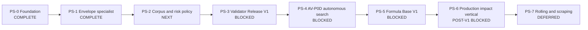

# Roadmap физического синтеза звука

| Поле | Значение |
| --- | --- |
| Статус | `ACTIVE_R&D / PS-1_COMPLETE / PS-2_NEXT / AUTOMATIC_PASS_DISABLED / PRODUCTION_P1_BLOCKED` |
| Архитектурная граница | [SPEC-45](../architecture/45-physical-sound-synthesis-and-acoustic-presentation.md), `Proposed` |
| Текущий evidence | [PS-1 amplitude-envelope evidence](../development/physical-sound-validator-ps1-2026-08-27.md) и [task state](../development/task-state/physical-sound-synthesis.md) |
| Детальный план | [Domain admission implementation plan](2026-08-27-physical-sound-domain-admission-implementation-plan.md) |
| Связь с продуктом | Изолированный R8 experiment; не меняет текущий R7 critical path и clip-based audio baseline |
| Горизонт | Валидатор → корпус и риск → автономный поиск → база формул → один production impact vertical → persistent contact |

## Цель

Построить автономный контур, который без послушивания каждого результата:

1. генерирует звук физического взаимодействия из ограниченной математической
   модели;
2. проверяет hard, causal, acoustic и out-of-domain свойства независимым
   версионированным валидатором;
3. допускает формулу только для точного acoustic domain, на котором измерены
   риск, покрытие, стоимость и fallback;
4. накапливает reviewable базу условных формул, а не таблицу
   `material -> coefficients`;
5. cooks допущенную модель в PresentationOnly content, сохраняя authored clip
   как обязательный production fallback.

Первый продуктовый результат — один интерактивный rigid-impact object, который
не выбирает event-specific impact WAV в основной ветке и непрерывно реагирует
на позицию и силу удара. Rolling и scraping начинаются только после этого
impact vertical.

## Что считается конечным состоянием

Исследовательский контур хранит четыре независимо версионируемых внешних
артефакта:

- corpus registry с точными объектами, геометрией, опорой, возбуждением,
  listener/radiation conditions, provenance и frozen splits;
- formula registry с семейством уравнений, revision параметров, domain
  envelope, стоимостью и fallback;
- validator release с hard gates, specialist heads, mutation suites, OOD и
  pre-registered risk/coverage policy;
- immutable domain admission record с `Pass`, `Reject` или
  `FallbackOutOfDomain`.

Генератор не видит calibration/holdout/shadow валидатора. Валидатор не
подстраивается под проверяемую generator revision. Исторический результат не
переписывается: новый corpus, formula или validator создаёт новую revision.

В production попадает только детерминированная cooked-формула и bounded
параметры точного допущенного домена. Корпуса, записи, generated WAVs, learned
weights, embeddings и optimizer state остаются снаружи; runtime не обучается,
не скачивает модели и не запускает validator inference.

## Кто принимает решение о качестве

Операционный валидатор — не человек и не одна нейросеть. Решение принимает
frozen `ValidatorRelease`:

| Компонент | Ответственность | Может выдать `Pass` самостоятельно |
| --- | --- | --- |
| Детерминированные hard/causal gates | Signal safety, exact repeat, force/position relations, bounds | Нет; только reject или продолжение |
| Acoustic specialists | Envelope, modal, spectral evolution, material/object/force/position evidence | Нет; публикуют раздельные признаки и ошибки |
| Learned representations | Дополнительная real-corpus similarity и artifact evidence | Нет; disagreement выбирает fallback |
| OOD и selective-risk controller | Принимает только covered region при confidence-bounded risk | Да, но лишь если все остальные gates прошли |
| Человек | Может создать frozen audit/training evidence или проверить сам validator | Нет live-очереди и нет per-sound asset gate |

Таким образом, Codex или другой optimizer может автономно создавать тысячи
кандидатов, но не может менять правило приёмки внутри того же цикла.

## Неизменяемые guardrails

- PCM, voice, mixer, propagation и validator state остаются presentation или
  external research state и не входят в gameplay/save/replay authority.
- Physics остаётся единственным owner контакта. Production audio читает только
  complete engine-owned committed projection, никогда raw PhysX callback.
- Acoustic material/profile отделён от `PhysicsMaterialDescriptorV2` и не
  меняет collision response.
- Неизвестное условие, недостаточная confidence или disagreement всегда
  выбирают authored clip `FallbackOutOfDomain`.
- Один `Pass` не расширяется с конкретной геометрии, опоры, диапазона силы,
  позиции или listener condition до общего «стекло», «металл» или «дерево».
- Source-model и validator hypothesis не меняются в одном research cycle.
- Две последовательные недискриминирующие попытки запускают bounded research,
  а не ещё один coefficient grid.
- R&D может идти изолированно, но production P1 остаётся post-v1/неактивным,
  пока главный roadmap явно не назначит slot и concrete consumer.

## Карта зависимостей

Размеры ниже относительные и не являются календарным обещанием. Data
acquisition и внешняя model extraction могут занимать больше времени, чем код.

| Milestone | Статус | Размер | Наблюдаемый outcome |
| --- | --- | ---: | --- |
| PS-0. Research foundation | `COMPLETE` | — | Lab/demo, AV-P0A/B, Registry V1, controlled mutations и grouped-risk measurement воспроизводимы; production baseline не изменён. |
| PS-1. Envelope-specialist closure | `COMPLETE` | S–M | Consensus отвергает B4/B5 и все stationary/frozen controls; coverage `2/3`, `1/3`, `2/3`, но `Pass` остаётся выключен. |
| PS-2. Corpus and risk closure | `NEXT` | L | Independent real object families имеют честные acoustic-domain axes; numeric risk/coverage policy pre-registered до shadow. |
| PS-3. Validator Release V1 | `BLOCKED_BY_PS-2` | M | Один frozen release демонстрирует bounded false-pass risk и useful coverage на grouped holdout/shadow или честно остаётся fallback-only. |
| PS-4. AV-P0D autonomous formula search | `BLOCKED_BY_PS-3` | M–L | Один полный поиск заканчивается reproducible registry decision без per-candidate human input. |
| PS-5. Formula Base V1 | `BLOCKED_BY_PS-4` | XL | Есть минимум по одному exact admitted domain для thin metal vessel/shell, thin glass vessel и dry hardwood block, каждый со своим fallback. |
| PS-6. Production rigid-impact vertical | `POST_V1 / BLOCKED_BY_CONSUMER` | L–XL | Один player-visible object использует production contact/content/mixer path и проходит candidate `AUDIO-PHYS-*` checks. |
| PS-7. Persistent contact | `DEFERRED_BY_PS-6` | XL | Rolling/scraping доказаны отдельным speed/load/roughness corpus и не зависят от callback-frequency artifacts. |

## PS-0 — Research foundation

Завершено:

- fixed-point steel/wood/glass laboratory and off-by-default demo;
- selected Q30 thin-container transfer and exact PCM repeat;
- AV-P0A hard/metamorphic tri-state validator;
- AV-P0B grouped real/material benchmark;
- Registry V1, который запрещает forged `Pass`;
- 36 controlled temporal mutations и AV-P0C grouped-risk report;
- сохранённые negative controls: glass D/F, steel v3/v4 stationary residual,
  shuffled-envelope wood B4/B5.

Текущий результат — не admission. На provisional threshold real coverage равно
`1/3`, `1/3`, `0/3`, grouped false pass — `0/3`, `1/3`, `1/3`, а holdout и
shadow Wilson upper false-pass risk — `0.7923`.

## PS-1 — Закрыть известный blind spot валидатора

Deliverables:

- отдельный amplitude-envelope trajectory profile: frame log-RMS slope и
  curvature, monotonicity violations, early/mid/late energy ratios и coupling
  energy change со spectral change;
- exact unit controls и deterministic report repeat;
- remeasurement на неизменных corpus, partitions, parent groups, mutations и
  provisional threshold-selection rule;
- explicit failure tags для shuffled-envelope и real-coverage regressions.

Exit criterion:

- обе frozen wood B4/B5 shuffled-envelope мутации отвергаются;
- все прежние stationary-white, stationary-coloured и frozen-spectrum controls
  остаются отвергнуты;
- hard/causal controls и report bytes повторяются;
- real coverage, grouped risk и worst counterexamples опубликованы без
  включения `Pass`.

Если два specialist variants лишь перемещают ошибки или обваливают real
coverage, следующий шаг — research причин `envelope representation` против
`corpus/acquisition mismatch`, а не изменение source model.

Результат: `COMPLETE`. Профили `amplitude-envelope-ps-1-v1` и
`temporal-amplitude-consensus-ps-1-v1` реализованы и измерены на неизменном
AV-P0C pack. Consensus threshold `0.9305864784564901` отвергает все 36
controlled mutations, включая B4/B5, при real coverage `2/3`, `1/3`, `2/3`.
Report повторяется byte-identical; подробные hashes, margins и оставшиеся
false rejects опубликованы в [PS-1 evidence](../development/physical-sound-validator-ps1-2026-08-27.md).
Нулевой observed false pass не включает `Pass`: при трёх parent groups на split
Wilson upper всё ещё `0.5615`, поэтому следующий шаг — PS-2 corpus/risk closure.

## PS-2 — Сделать риск статистически измеримым

Deliverables:

- acquisition/import plan для нескольких independent objects и families в
  каждом выбранном domain;
- точные geometry/support/excitation/impact-position/listener axes вместо
  `unspecified` material-only metadata;
- matched real recordings либо independently governed exact acquisition для
  первой domain family;
- frozen development/calibration/holdout/shadow partitions grouped по object,
  family, source, generator и mutation parent;
- power analysis, после которого numeric maximum false-pass risk и minimum
  useful coverage фиксируются до открытия shadow;
- pre-registered OOD, mutation monotonicity и unavailable-component policy.

Текущее readiness:

| Кандидат | Сильная сторона | Блокер до domain admission |
| --- | --- | --- |
| Q30 thin glass vessel | Exact synthetic geometry, position/force controls и faithful fixed-point transfer | Нет matched real recording, support/radiation calibration и bounded validator evidence |
| Dry hardwood block | Wood-B perceptually accepted; known frozen envelope counterexamples | Нет exact domain metadata, matched position/force corpus и safe risk bound |
| Thin metal vessel/shell | Несколько independent real-metal families и ясный rejected residual | Material-only metadata; source model и evolving spectral dynamics не закрыты |

Первым становится не любимый материал, а domain с первой полной строкой exact
metadata и достаточным grouped evidence. Material-only AV-P0B/YCB rows не
получают выдуманную геометрию.

## PS-3 — Заморозить Validator Release V1

Release фиксирует corpus/split hashes, deterministic gates, specialist/model
revisions, mutation families, thresholds, OOD и risk/coverage policy до оценки
новой generator revision.

Exit criterion:

- calibration выбирает policy без holdout/shadow;
- grouped holdout и untouched shadow удовлетворяют pre-registered confidence
  bound и minimum coverage;
- все positive, negative, mutation, unavailable-model и reward-hack controls
  имеют declared outcome;
- повторный report byte-identical;
- failure создаёт immutable failed release и новый hypothesis, а не retry с
  другим threshold на том же shadow.

Если полезная coverage не совместима с bounded risk, Validator V1 остаётся
`FallbackOutOfDomain`-only. Это корректный milestone result, но он не открывает
PS-4.

## PS-4 — AV-P0D autonomous formula search

Optimizer получает только development/fit evidence и отдельную cost axis.
Frozen validator и shadow доступны лишь admission step. Каждый цикл меняет
ровно одно source-model family hypothesis.

Плановый первый discriminator — time-varying coloured residual против bounded
modal interaction для thin-metal vessel. Он запускается только при наличии
exact PS-2 domain corpus; иначе используется первый domain, реально прошедший
PS-2, без ослабления axes.

Exit criterion:

- manifest начинает run с exact corpus/formula/validator hashes;
- candidate lineage и Pareto objective воспроизводимы;
- hard/causal gate не может быть компенсирован learned score;
- frozen validator публикует `Pass`, `Reject` или `FallbackOutOfDomain`;
- результат и negative controls повторяются без per-candidate human input.

## PS-5 — Formula Base V1

Цель — три независимо допущенных bounded domain, а не один универсальный
материал model:

1. thin metal vessel/shell impact;
2. thin glass vessel impact;
3. dry hardwood block impact.

Каждая запись содержит exact geometry/support/excitation/listener envelope,
formula/parameter revision, evidence hashes, risk/coverage, cost и authored
fallback. Новая геометрия, опора, диапазон силы или listener set создаёт новую
admission record. Rejected formulas и mutations остаются в базе как knowledge,
которое не позволяет повторить неработающий путь.

Exit criterion: по одной exact domain revision на family имеет hard/causal
PASS, confidence-bounded selective risk, useful coverage, untouched-shadow
evidence, bounded offline/runtime-reference cost и exact fallback. Это всё ещё
research admission, не shipping content.

## PS-6 — Первый production impact vertical

Recommended consumer: один видимый interactable rigid prop в reference project
с несколькими impact positions/energies и обычным authored clip fallback.
Главный roadmap должен явно активировать этот post-v1 slot до runtime work.

Work package:

1. Accepted promoting ADR under ADR-046 с exact consumer and fallback.
2. Complete SPEC-26 committed contact projection: relative velocity, impulse
   bounds, effective mass, contact kind and canonical material tags; pass
   `PHYS-COLLISION-P1` evidence.
3. Freeze minimum consumer-driven `AcousticMaterialProfileV1`,
   `ModalSoundModelV1` and `PhysicalSoundBindingV1` cooked PresentationOnly
   shapes.
4. Cook one admitted research record; never load research registry or learned
   validator at runtime.
5. Wire bounded extraction, fixed-point reference voice, admission/LOD and
   existing mixer/fallback path.
6. Measure whole mixer/callback p95/p99 and memory/queue/voice bounds on the
   production consumer.
7. Promote `AUDIO-PHYS-SOURCE-P1`, `AUDIO-PHYS-CONTENT-P1` and
   `AUDIO-PHYS-PCM-P1`; run focused `fast`, `play`, `content-package` and
   `persistence-replay`, plus conditional `platform`/`performance`.

Exit criterion: enabled, disabled, voice-limited, missing-content and faulted
profiles preserve gameplay, ledger, physics, `AcousticFactV1` and save/replay
roots; canonical 48 kHz PCM and event-to-sample mapping pass; every invalid or
OOD condition selects the exact clip fallback.

## PS-7 — Rolling and scraping

Начинается только после PS-6. Создаёт отдельные formula/validator domains с
speed, normal-load, roughness и contact-continuity axes, включая resting и
separation controls. Если committed rigid contact не воспроизводит stick-slip,
chattering или micro-collision structure, допускается один bounded flexible-
contact counterfactual; произвольный noise tuning и raw callback frequency не
считаются физической моделью.

Fracture, footsteps, cloth, liquids, fire, voice и biological synthesis не
входят в PS-7. Это отдельные source-owner/model programs со своими gates.

## Ближайшая implementation queue

| Порядок | Work package | Gate после выполнения |
| ---: | --- | --- |
| 1 | Реализовать amplitude-envelope specialist и deterministic unit controls | PS-1 code complete; `Pass` всё ещё disabled |
| 2 | Пересчитать frozen AV-P0C pack и зафиксировать grouped risk/coverage report | PS-1 evidence decision |
| 3 | Спроектировать exact-domain acquisition и power analysis, затем заморозить splits/policy | PS-2 corpus contract |
| 4 | Добавить первую independent real object family с честными axes и hashes | PS-2 evidence expansion |
| 5 | Выпустить или отклонить frozen Validator Release V1 одним declared shadow evaluation | PS-3 go/no-go |
| 6 | Только при go запустить один AV-P0D source-model discriminator | PS-4 first autonomous decision |

Каждый пакет является отдельным coherent commit/evidence boundary. External
recordings, WAVs, features, weights and reports в commit не входят.

## Stop/go policy

| Событие | Решение |
| --- | --- |
| PS-1 не закрывает B4/B5 после двух coherent variants | Bounded research cycle; source tuning запрещён |
| Corpus не позволяет pre-register meaningful confidence/coverage | Расширить independent groups или оставить validator fallback-only |
| AV-P0D улучшает fit, но проигрывает frozen validator/shadow | `Reject`, сохранить counterexample, сменить одну hypothesis |
| Ни одна formula family не даёт bounded quality/cost point | Остановить domain и использовать authored clips |
| SPEC-26 projection недостаточна для production excitation | Не обходить raw callback; уточнить consumer-driven projection или остановить P1 |
| Whole-mixer budget не проходит | Явно снизить modes/voices/LOD либо оставить clip fallback; не ослаблять authoritative isolation |
| Нет roadmap slot или player-visible consumer | Research artifacts сохраняются; public schemas/runtime integration не начинаются |

## Definition of done

- **Validator done:** PS-3 публикует measured confidence-bounded automatic
  decision на grouped independent evidence без live human gate.
- **Research loop done:** PS-4 воспроизводимо принимает или отклоняет новую
  formula revision без изменения validator внутри цикла.
- **Formula base V1 done:** PS-5 хранит по одной exact admitted domain для
  metal, glass и wood вместе с negative knowledge и fallbacks.
- **First product value done:** PS-6 проходит production contact/content/PCM,
  root-isolation and whole-mixer gates для одного visible prop.
- **Persistent-contact expansion done:** PS-7 отдельно доказывает rolling и
  scraping; impact success не засчитывается за этот результат.
