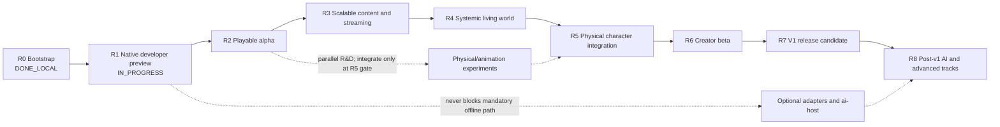

# Next Engine: долгосрочный roadmap реализации

| Поле | Значение |
|---|---|
| Статус | Living planning document, не нормативная архитектура |
| Последнее обновление | 2026-08-14 |
| Текущая точка | R3 и reference-project vertical остаются `COMPLETE`; R2/R3 checks и Windows acceptance не изменились, performance остаётся `REPORT_ONLY`. WIP=1 — [humanoid movement training rebuild](plans/2026-08-12-humanoid-motor-training-rebuild.md): TRAIN-0..3 advanced, TRAIN-4 reopened, all TRAIN-5 checkpoints rejected. V18 имеет `204/12518` required-safety failed cases. R27 сохраняет ADR-070 fresh-scene authority и отклоняет indexed partial reset. Bounded V7/R49 проходит fresh `17/17`, но разрешает только clip-global prototype. R57 закрыл one-solve/exact-slice domain identity и отклонил V7 complete solver. R73 clean V8 passes complete `cmu05`/`cmu16` but fails raw `cmu139`; R74–R90 isolate globalization and a geometry plateau. R91 supports stable foot-box features. Clean V9/R92 passes raw `cmu139` exact-zero at iteration three with unchanged limits; current R93 must reproduce all-three/all-17 offline from one clean invocation. Full V19, fresh PhysX, corpus admission, visual/exhaustive gate и learned optimizer остаются заблокированы. TRAIN-8 optional, R4a queued, B-12/Linux/R1/R7/v1 shipping не закрыты. |
| Windows blocker-plan checkpoint | `WINDOWS_COMPLETE / DEFERRED_LINUX` для B-02, `COMPLETE` для Windows R2 и R3, `COMPLETE / WINDOWS_ACCEPTED` для Architecture Cleanup. R3a/B-04 и R3b/B-06 `COMPLETE`; это не закрывает R1, B-12, Linux или paired cross-target evidence. Активный самостоятельный increment — R5 humanoid movement TRAIN-4 dynamic-reference-feasibility remediation after failed TRAIN-5 safety evidence; R4a поставлен следующим в очередь после этой bounded training lane либо явного решения остановить её. |
| R2 visual checkpoint | Три Windows visual packages и свежий `r2-reference-alpha-visual-v5` прошли automated checks и ручной acceptance. `B0ShaderInterfaceV2`, separate sky/world/UI, directional light/fog/shadows, distinct silhouettes, visible/inset colliders, semantic HUD и 720p/1080p presentation сохранили прежний gameplay result. Performance остаётся `REPORT_ONLY`; B-12 открыт. |
| Горизонт | developer preview → playable alpha → systemic alpha → creator beta → v1 → post-v1 |
| Источники | Accepted SPEC/ADR, текущий workspace и локальные ProductCheck |

## Назначение

Этот документ отвечает на три практических вопроса:

1. что реализовывать следующим;
2. в каком порядке расширять текущий узкий vertical slice;
3. какое наблюдаемое доказательство завершает каждый этап.

Roadmap не заменяет [продуктовый контракт](architecture/00-product-contract.md),
[архитектурную baseline](architecture/README.md) или профильный SPEC/ADR.
При конфликте действует порядок precedence из архитектурной baseline.
Семантическое изменение Accepted architecture по-прежнему требует отдельного
ADR; изменение приоритета или порядка реализации — нет.

Roadmap намеренно не содержит календарных обещаний. Без известного размера
команды, доступного content-production capacity и shipping hardware точные даты
создали бы ложную точность. Этапы упорядочены по продуктовым зависимостям и
имеют относительный размер. Календарный план следует строить из этого документа
после назначения владельцев и измерения скорости первых двух этапов.

## Как читать статус

| Статус | Значение |
|---|---|
| `DONE_LOCAL` | Реализация и релевантные checks проходят на developer host; это не shipping claim. |
| `DONE_LOCAL_WINDOWS` | Windows implementation/checkpoint завершён локально; Linux и cross-target claims остаются отдельными и открытыми. |
| `NEXT` | Следующий этап критического пути. |
| `PLANNED` | Нужен для v1, но зависит от более ранних этапов. |
| `PARALLEL` | Может развиваться параллельно, но имеет указанную integration gate. |
| `ACTIVE_R&D` | Единственный текущий experimental WIP; не означает production promotion, stage completion или v1 requirement. |
| `DEFERRED` | Не блокирует v1. |
| `PROPOSED` | Технология или contract ещё не входит в Accepted shipped baseline. |

Этап считается завершённым только когда одновременно выполнены все условия:

- behavior проходит production path, а не test-only shortcut;
- есть focused positive, failure и restart/save coverage;
- релевантные `fast`, `play`, `persistence-replay`, `content-package`,
  `platform` или `performance` имеют честный результат;
- schema, migration, examples, diagnostics и документация обновлены вместе;
- ни один `NOT_RUN` не интерпретирован как `PASS`;
- fallback проверен как реальное поведение, если основная возможность optional.

Наличие public type, Accepted SPEC или компилируемого adapter само по себе не
закрывает этап.

## Текущая точка

[M0–M11 implementation record](nextengine-v1-vertical-slice-implementation-plan.md)
фиксирует рабочий walking skeleton. На 2026-07-30 локально присутствуют:

- canonical commands, command ledger, fixed-stage runtime и atomic RPG
  transactions;
- direct authoring v2 → exact `ProjectLockV3` cook/activation и
  content-addressed publication без resolver/catalog;
- общий production coordinator для `game`, `headless` и runtime-bearing tools;
- atomic save generations, replay, application-session close/recovery;
- движение grounded capsule, статические Box colliders и contact lifecycle;
- pickup/equipment, melee damage, switch, dialogue/quest/relationship transition;
- deterministic bounded four-region/64-chunk streaming;
- deterministic NPC affordance planner и procedural avatar projection;
- data-only mechanics, bounded Luau и Wasm Component paths;
- exact revision-bound presentation extraction и reference B0 render plan;
- neutral mesh/material/texture/profile catalog, deterministic cook/activation
  и derived B0 meshlet payloads;
- checked-in offline SPIR-V и B0 CPU visible-list/indexed-indirect path с
  deterministic fallback material;
- Windows-local keyboard/mouse ActionMap/InputContext resolver для live `game` и
  headless scenario, persisted ingress assignment и exact physics-snapshot
  `ClosestPoint` targeting, независимый от camera state;
- complete in-memory snapshots на каждой 30 Hz fixed-step boundary и typed
  integer/fixed-point third-person camera в `PresentationSnapshotV2`/B0 plan;
  renderer повторяет последний snapshot при любой cadence, а приватный Vulkan
  backend преобразует camera state в float view-projection и depth;
- simple session durability: два чередующихся snapshot slots и `CURRENT`,
  только last lifecycle request/event и двухстадийный close journal
  `Prepared → SavePublished`; durable world публикуется manual Save и
  save-on-close, Suspend не сохраняет, crash откатывается к последнему Save;
- session-bound desktop host/capability registration отклоняет stale adapter
  lifetime, а same-session authoritative restart начинает fresh presentation
  epoch с sequence `0` и camera cuts по
  [ADR-035](architecture/adr/035-bounded-live-recovery-platform-host-and-presentation-cut.md);
- Windows SDL3/ash B0 path с canonical keyboard/lifecycle events, fullscreen,
  swapchain recreation, bounded device-loss recovery и package smoke;
- current-only Performance V5 foundation с exact THOTH fingerprint,
  release-only methodology-v8 per-run preflight (`CPU/GPU <40%`, free RAM
  `>=10 GiB`), postflight integrity, explicit run boundaries и полным
  streaming/agent/render/live smoke report; representative `r2-alpha-render`
  и streaming-only `r3-multiregion-streaming` реализованы как `REPORT_ONLY`;
  representative `r5-physics-16.v1` выполняет 16 production PhysX 23-DoF
  humanoids при 240/60 Hz и 1/4/8 workers с exact root parity, accepted
  absolute budgets and exact roots. Historical V4/v7 calibration содержит 10
  runs; первый non-retried v7 hard gate прошёл absolute budgets, но дал
  relative `FAIL` на том же commit
  (8-worker frame p95 `+10.0%`, peak RAM `+8.53%`). R4 workload честно
  возвращает `NOT_RUN`; fresh V5 ten-run baseline и fixed three-run hard gate
  ещё не запускались, R5 hard `PASS` отсутствует;
- локальная v1 closure matrix.

Data-first reference alpha реализована и принята на Windows: automated
production flow/package smoke и свежий 20–30-minute manual acceptance от
2026-08-08 проходят. Текущий
R2 gameplay scope намеренно ограничен двумя role-selected chunks, одной combat ability, одним quest
loop и одним neutral humanoid skeleton/clip catalog; general partition, runtime
animation и reusable systemic quest conditions относятся к R3–R5.

### Реализация по подсистемам

| Область | Состояние в коде | Главный gap |
|---|---|---|
| Contracts/runtime/ledger | Реализован фундамент | Расширять только вместе с реальным gameplay use case; не строить второй runtime framework. |
| Project/application/session | Production path реализован: authoring v2 → exact `ProjectLockV3` → atomic `ActivatedProjectV3`; session использует два snapshot slots, last lifecycle record и `Prepared → SavePublished` close journal | Нужны native cross-target platform/package closure и дальнейшие real-project lifecycle cases. |
| Persistence/replay | Реализован current-only owner set; retired alpha formats fail typed unsupported | Migration вводится только после первого публично поддерживаемого v1 format и реального successor. |
| RPG | Частично: основные aggregates и восемь операций | Нет полного faction/membership, status/effect, quest-graph, reward и divine command lifecycle. |
| Mechanics/packages | Частично: contact melee + Luau/Wasm examples | Нет общего ability phase/cost/cooldown/status lifecycle и creator-facing SDK workflow. |
| Content/cooker | Data-first `projects/reference-alpha` проходит file-backed authoring/cook/direct-lock activation; package содержит 113 canonical entries и 64 chunk bindings, шесть production low-poly meshes, десять role/environment materials, четыре textures, synthesized audio и CC0 skeleton/clip provenance/NOTICE | Нет navigation catalog и runtime animation consumption. |
| World/streaming | R3 bounded partition реализован: exact pinned generation, 4 regions/64 chunks, manifest-driven role/route selection, packaged fetch/decode/validate, paired Runtime/World commit и restart из `Requested` | Нет partition interest/residency/eviction, calendar, population, schedules и region transfers; это R4/future scope, не gap закрытого R3. |
| Jobs/resources | R3 использует private bounded workers (default 2, max 4), immutable revision-bound request/result и channel 64; generic subsystem не принят | Shared scheduler/resource contract появляется только при доказанной второй production потребности; SPEC-23 остаётся Proposed. |
| Physics | PhysX 5.9.0 является единственным production backend; upright capsule, static Box, exact B0 `ClosestPoint`, reduced articulation и fixed-humanoid scene/restore path реализованы | Не закрыты полный cutover/platform/replay matrix, general gameplay shape/query breadth и Windows/Linux Stage 0 evidence. |
| Animation/motor | Procedural projection, deterministic 23-DoF standing motor, immutable standing/flat-command V1 and current curriculum V2 CPU environments реализованы: engine command schedule, fixed PD/safety, 240/60 scheduling, partial reset, terminal lifecycle, checkpoint/replay, motor-lab v2 и внешний NPZ v2 recorder. Isaac mirror v2 имеет Rust golden and correspondence gates. Active WIP follows required TRAIN-0…7 + TRAIN-9 from a new biomechanics/motion generation while preserving V1 identities; TRAIN-8 is optional. | Нет admitted motion corpus, specialist reference tracker, trained command/recovery actor, portable runtime evaluator, skeleton graph, retargeting, IK, выполненного Isaac GPU correspondence и полного Windows/Linux performance/parity evidence. Stage 0, learned quality and R5 remain open. |
| Agent AI | Частично: один canonical affordance planner; ADR-056 принял deterministic Strategic Agent direction | Нет perception, beliefs/memory, needs/goals, bounded GOAP, task executive, structured social behavior и 100-NPC workload. SPEC-32 остаётся Proposed до R4c/R4d consumers; SPEC-33/34 и ADR-050/053/054 — optional R8 research. |
| Navigation/audio | Частично: полный baseline audio vertical (A1–A6 `DONE_LOCAL_WINDOWS`) — neutral clip contract, audio scene extraction, software mixer + canonical PCM sink, SDL device adapter, subtitle fallback, `audio_scene` в v1-closure | Gaps: chunked long-clip streaming payload, zone reverb fallback (zone occlusion gain есть), navigation cooker и baseline nav adapters. |
| Player experience | Keyboard/mouse и generic controller используют одинаковые action IDs с keyboard fallback; persisted targeting, third-person camera, semantic HUD/inventory/journal/dialogue/pause flow, localization, subtitles и preferences проходят automated Windows checks. HUD получил цветовой health meter, objective и отдельный presentation-only next-action panel, который выводится из immutable RPG snapshot для accept/pickup/equip/combat/relay/return/complete; Save показывает `Saved`, а Load оставляет восстановленный world на паузе с `Loaded - press Resume`. | Worker-to-desktop regression покрывает quest accept, explicit Save, визуально различимое изменение, sequence-zero Load cut, Load confirmation, продолжение новой epoch после явного Resume и реальное authoritative WASD movement с exact загруженной input-context revision. Свежий 20–30-minute run зафиксирован как `PASS`. Accessibility profiles и capability-scoped extension panels остаются вне R2 gate. |
| Presentation/render | Exact revision-bound snapshot, typed camera, offline SPIR-V, seven-binding B0 scene и Windows recovery/package path реализованы; humanoid/blade/relay имеют разные материалы, collected pickup скрывается, defeated NPC остаётся видимым с тёмным material, relay меняет inactive/active material. Engine-owned relay-approach kit (tiled path, platform, two ruined pillars, four-rock field) добавляет читаемый маршрут и landmarks одним batched draw; отдельный reusable rock source mesh остаётся в content catalog. Relay collider точно следует видимым pillars/top beam/central switch без невидимых продолжений. Contract-preserving B0+ shader выводит flat geometry normal из world-position varying и применяет fixed sun/ambient + depth fog без смены locked position/UV ABI. Private UI adapter рисует контрастные bordered panels: HUD/action слева, inventory/journal справа, dialogue/pause по центру. | Нет authored smooth normals, runtime skeleton/VFX consumption, production art/animation polish, clean ten-run THOTH hard evidence, paired same-commit target proof и Linux hardware-GPU evidence. |
| Tooling | Repository `xtask`, Performance V5/run-level gate batches, семь report scenarios, representative R2/R3/R5 workloads и Windows package smoke реализованы | Нет creator-facing `next` CLI, inspectors, scenario/minimizer, fresh clean ten-run V5 THOTH baselines и stable external SDK workflow. |
| Autonomous narrative | Proposed intent only | Вернуться только с конкретным player-visible production consumer после R3. |

## Продуктовая граница v1

V1 следует оценивать по [SPEC-00](architecture/00-product-contract.md), а не по
количеству полностью реализованных архитектурных документов. Accepted SPEC
задаёт правильную границу и failure semantics, когда соответствующая
возможность реализуется; он не всегда делает всю описанную глубину блокером
первого релиза.

Для v1 обязательны:

- один устанавливаемый cooked project на Windows x86_64 и Linux x86_64;
- связанный movement → interaction → combat → dialogue → quest loop;
- `game`, deterministic `headless` и creator/runtime tools;
- save/load/replay и offline correctness;
- streamed world, generic RPG state и first-party mechanics через public
  package API;
- deterministic Strategic Agent vertical с needs, beliefs/memory, Utility +
  bounded GOAP, structured social acts, owner-validated work/trade/food outcomes
  и одинаковым offline `game`/`headless` behavior;
- bounded data-only, Luau и Wasm extension paths;
- engine-owned physics, motor и animation boundaries с процедурным fallback;
- usable player input, camera, semantic UI и минимально доступный presentation
  path;
- neutral content cook/validate/package workflow.

Не являются v1 blocker:

- LLM, ASR, TTS, external `ai-host` и SPEC-16 multimodal dialogue;
- autonomous Narrative Director и divine agency из SPEC-31;
- learned motor policy, Isaac Lab, PhysX или другой vendor physics backend;
- ray tracing, mesh shaders, HDR, advanced VFX и displayless capture;
- Gothic importer;
- full editor, multiplayer, consoles, mobile или macOS shipping.

Рекомендуемый v1 physical scope: устойчивый capsule/procedural controller,
skeletal presentation, retargeting и basic IK. Full articulation и learned
motor policy входят в v1 только если их собственный product check проходит
достаточно рано; fallback остаётся shipping-capable без них.

## Критический путь



| Этап | Статус | Размер | Product outcome |
|---|---|---:|---|
| R0. Walking skeleton | `DONE_LOCAL` | — | Узкий deterministic slice доказал end-to-end architecture. |
| R1. Native developer preview | `IN_PROGRESS` | S–M | Один exact package действительно запускается на обеих shipping targets. |
| R2. Playable alpha | `COMPLETE / WINDOWS_ACCEPTED` | L | Data-first slice, Windows package, automated checks и зафиксированный 20–30-minute acceptance проходят. Linux/R1 cross-target closure не заявляется. |
| R3. Scalable content and streaming | `COMPLETE` | XL | Private packaged vertical и bounded 4-region/64-chunk project проходят cook/load/unload/save/restart и report-only workload без hard-coded two-chunk assumptions. |
| R4. Systemic living world | `PLANNED / QUEUED` | XL | NPC schedules, population/navigation, deterministic beliefs/needs/goals, Utility + bounded GOAP, social/work/trade consequences и 100-NPC cadence образуют живой offline world без model/network requirement. R4a остаётся следующим critical-path world increment после активной bounded R5 R&D lane. |
| R5. Physical character integration | `PARALLEL / ACTIVE_R&D` | XL | Текущий WIP обучает fixed humanoid движениям; production integration, procedural fallback and stage closure остаются отдельными gates после R4 substrate. |
| R6. Creator beta | `PLANNED` | L–XL | Второй проект/пакет создаётся без правки engine internals. |
| R7. V1 release candidate | `PLANNED` | L | Полный v1 scope стабилизирован и упакован для Windows/Linux. |
| R8. Post-v1 tracks | `DEFERRED` | отдельные программы | Optional AI/narrative/importer/advanced rendering не размывают v1. |

## R0 — Walking skeleton

**Статус:** `DONE_LOCAL`.

**Цель:** доказать, что архитектурные границы соединяются в один production
path.

**Доказанный результат:** M0–M11, локальные `play`, `persistence-replay`,
`content-package`, portable `platform`, `performance` и `v1-closure`.

**Открытый риск:** этот этап доказан на Apple Silicon developer host.
Windows/Linux execution не считается выполненным и перенесён в R1.

**Правило сохранения:** каждый следующий этап расширяет текущий slice
вертикально. Переписывание contracts/runtime без нового player-facing outcome
не является roadmap progress.

## R1 — Native Windows/Linux developer preview

**Статус:** `IN_PROGRESS`. Native gate harness, Windows Desktop B0 hardening и
minimal render-content implementation реализованы; релевантные Windows
`content-package`, `platform`, `performance` и clean `v1-package` проходят
локально. Native Linux target report и package на более раннем checkpoint
имеют отдельный `PASS`; paired
same-commit Windows report и compare ещё не выполнены. Exact checkpoint,
environment и coordination status ведутся в
[Linux validation backlog](development/linux-validation-backlog.md).

**Текущая execution policy:** native Windows x86_64/MSVC/Vulkan — основной
developer host и приоритет текущих work packages. Linux validation выполняется
отдельными асинхронными checkpoint-сессиями; standalone Linux `PASS` не
закрывает R1/B-01 без matching Windows target `PASS` report и успешного compare.
Отложенные Linux-only действия ведутся в
[Linux validation backlog](development/linux-validation-backlog.md) и
выполняются асинхронными checkpoint-сессиями. Их ожидание не блокирует
несвязанные Windows work packages, но соответствующие R1/v1 criteria до
фактического run остаются открытыми.

**Цель:** превратить portable local closure в честно запускаемый native
developer package.

**Основной scope:**

- стабилизировать private SDL3/ash B0 adapter на Windows x86_64 и Linux x86_64;
- закрыть window/input/focus/resize/fullscreen/surface/device-loss lifecycle;
- проверить platform normalization без влияния native timestamps на simulation;
- собрать atomic distribution с `game`, `headless`, exact cooked project и
  notices;
- запустить release `headless` и bounded interactive release `game` из
  созданного package;
- сравнить project/content/state/ledger roots между target reports.

**Критерии успеха:**

- на обеих targets проходят `host-check`, `play`, `persistence-replay`,
  `content-package`, `platform`, `performance` и `v1-closure`;
- каждый `v1-closure` сообщает `PASS` для native target текущего host и честный
  `NOT_RUN` для другого target; успешный same-commit `native-gate-compare`
  выставляет `native_gate_ready = true`;
- `v1-package` создаёт installable directory и оба release binaries запускаются
  против exact packaged lock;
- B0 scene обрабатывает real input и типовые lifecycle transitions без
  authoritative divergence;
- package не содержит machine-local paths, protected data, credentials или
  отсутствующие notices.

**Hard blockers:**

- paired native Windows/Linux `PASS` reports и package на одном exact commit;
- representative hardware-GPU Linux smoke; текущий checkpoint и pending
  actions записаны в
  [Linux validation backlog](development/linux-validation-backlog.md);
- SDL3/ash candidate должен пройти target smoke; cross-compilation недостаточно;
- любой cross-target canonical/hash mismatch;
- packaging/runtime dependency, которая не включена или не диагностируется.

**Не блокируют этап:** PhysX, Slang, RT, learned policy, `ai-host`, capture и
Gothic importer.

**Основные источники:** SPEC-04, SPEC-12, SPEC-17, SPEC-29, SPEC-30, ADR-003,
ADR-028, ADR-030.

## R2 — Playable product alpha

**Цель:** превратить технический fixture в небольшой player-facing slice,
который можно пройти без знания engine internals.

**Основной scope:**

- runtime ActionMap/InputContext service поверх существующего canonical input;
- third-person camera, interaction focus и authoritative targeting query;
- semantic HUD, inventory/equipment, dialogue, quest journal, pause/save/load
  flow;
- source locale, deterministic text IDs, pseudo-locale и readable fallback;
- keyboard/mouse и минимум один controller profile через одинаковые action IDs;
- validate и расширить реализованный minimal mesh/material/texture path для B0
  renderer до representative alpha content;
- baseline sample playback, attenuation/panning, voice limiting и subtitle
  fallback;
- один CC0/engine-owned 20–30 minute project slice с началом, конфликтом и
  завершением.

Первый Windows increment этого этапа, **Player action and camera
(`DONE_LOCAL_WINDOWS`)**, содержит общий keyboard/mouse ActionMap/InputContext
resolver для live `game` и headless scenario, persisted ingress assignment,
authoritative B0 `ClosestPoint` targeting из exact physics snapshot,
`ReplayManifestV5` query provenance и typed integer/fixed-point third-person
camera. Live loop создаёт complete in-memory snapshot на каждой 30 Hz boundary.
Session store хранит два чередующихся current-state slots; durable world
публикуется только manual Save и save-on-close. Suspend не сохраняет, crash
теряет прогресс после последнего Save, а explicit Load из `Suspended` создаёт
fresh presentation epoch/sequence `0` и ждёт Resume. Fresh session-bound desktop
host registration отклоняет stale lifecycle/control events. Exact semantics
зафиксированы [ADR-047](architecture/adr/047-simple-application-session-and-save-on-close.md).
Локальный Windows checkpoint подтверждён `host-check`, `play`,
`persistence-replay`, `content-package`, real SDL3/Vulkan `platform` и
fresh-output `v1-package`. Generic controller использует те же action IDs, что
keyboard/mouse, а отсутствие устройства использует keyboard fallback. Поэтому
Windows-часть B-02 имеет статус `WINDOWS_COMPLETE / DEFERRED_LINUX`; это не
закрывает R1/B-01, `native_gate_ready`, shipping или Linux/native target criteria.

Data-first package `projects/reference-alpha` содержит 51 canonical records и
два chunks, versioned authoring manifest, source spans, engine-owned
geometry/materials/text/synthesized audio и CC0 humanoid skeleton/clip catalog с
source/hash/license/NOTICE. Production scripted equivalent выполняет Frontier
Relay за `32` ticks и `27` events: принимает quest через dialogue, находит и
экипирует предмет, переходит в следующую зону, завершает combat, активирует
relay, возвращается и завершает quest; restore проверяется после acceptance,
combat и relay activation. `game` и `headless` получают одинаковый authoritative
result. Skeleton/clip catalog в R2 является content prerequisite; runtime
animation остаётся R5.

R2 visual usability pass удалил production marker mesh и добавил static
low-poly humanoid, relay gate и blade с отдельными role materials. Presentation
state детерминированно выводится из authoritative RPG snapshot на каждом
publication и после Load: подобранный blade скрывается, побеждённый NPC остаётся
видимым с тёмным material, relay переключает inactive/active material. Его
collider состоит только из видимых pillars, top beam и central switch; live
traversal regression проходит вокруг gate за границу прежней невидимой стены.
Следующий инкремент ввёл exact `B0ShaderInterfaceV2`: position/UV дополняются
optional SNORM16 normals с derivative flat-normal fallback, а 208-byte frame
block содержит camera, sun, fog и stabilized shadow transform. Отдельные
sky/world/UI suites, directional sun, hemispheric ambient, world-distance fog и
renderer-owned 2048² depth shadow map с 32×32 м snapped volume, fixed bias и
3×3 PCF проходят real Windows Vulkan path. Sampled-depth format/allocation
failure выбирает stable no-shadow shader с диагностикой и не меняет gameplay.
Private semantic-UI adapter теперь имеет bordered panels и стабильный
layout: HUD слева, inventory/journal справа, dialogue/pause по центру; health и
objective визуально различимы. Save/Load дают явные подтверждения, причём Load
публикует обязательный recovery cut, затем `Loaded - press Resume` и не запускает
simulation до Resume. Catalog, live bindings, final scripted state и полный
worker save/load flow покрыты regressions; свежие `content-package`, `play`,
`persistence-replay`, native Windows `platform` и package smoke проходят.
Свежий 20–30-minute manual acceptance этого package зафиксирован как `PASS`
2026-08-08.

Следующий bounded visual increment добавил engine-owned tiling ground/path/stone/cloth/metal
textures и batched environment kit-piece: relay approach объединяет дорогу,
подиум, две разрушенные колонны и четыре low-poly скалы; reusable rock mesh
остаётся отдельной public content записью. Начальная scene содержит семь
bindings; после полного flow остаются шесть visible draws,
а legacy 10 000-cycle frame-planning gate проходит прежний absolute 30-second
budget. Отдельный HUD action panel read-only выводит из immutable RPG snapshot
следующий шаг для всех семи стадий acceptance; projection regression покрывает
accept, pickup, equip, combat, relay activation, return и completion. Новый
Четыре крупные скалы получили inset static Box proxies внутри видимых силуэтов;
центральный маршрут и обход relay покрыты live traversal regressions. Player,
enemy и quest giver используют три разных static low-poly silhouette meshes;
skinning и animation path по-прежнему остаются R5. Focus ring и quest marker
публикуются из immutable snapshots с reserved ordinals и не отбрасывают тень;
combat target-health, pickup/relay/defeated states и keyboard/controller
affordances остаются presentation-only. 12×16 alpha font и private overlay
покрыты 720p/1080p HUD/inventory/dialogue/pause/save/load/pseudo-locale goldens.
`visual-smoke` создаёт шесть displayless BMP и manifest с project/snapshot/frame
plan/camera/shader hashes как human evidence, не correctness oracle. Gameplay
contracts, authoritative state и R5 animation path не менялись.

Representative `r2-alpha-render` реализует exploration, combat и UI/dialogue
windows для 1080p и 720p fallback: `3 600` warm-up и `21 600` measured frames,
`50 400` Vulkan queries, distinct snapshots, authoritative roots и V3 resource
evidence. Текущий release report проходит absolute budgets, но сохраняет
`REPORT_ONLY`: тот run имел dirty worktree и не является baseline input.
Текущий THOTH preflight технически готов по ADR-061/062, но это не превращает
старый R2 report в hard evidence и не закрывает B-12.

Первый фактический ручной acceptance дошёл до принятия quest и выявил два дефекта
одного checkpoint path. Сначала runtime tick публиковался до fallible activation
нового input context; activation теперь staged внутри `PreparedRuntimeTick` и
публикуется атомарно с runtime generation. Повторный run на исправленном binary
локализовал оставшийся failure: валидный semantic UI record `Subtitle = 8`
кодировался, но presentation recovery decoder принимал только роли `0..7`.
Decoder теперь покрывает `Subtitle`; отдельный byte-exact codec test, production
quest-accept regression с полным следующим checkpoint и exact manual failed-state
tail от tick 390 проходят. Следующие ручные попытки выявили, что pause-menu Save
не подтверждал публикацию, Load выбирал текущий session checkpoint, а desktop
ошибочно применял tick monotonicity между epoch и мог не увидеть обязательный
sequence-zero recovery cut из-за latest-wins publication. Production worker test
теперь принимает quest реальными клавишами, пересекает durable checkpoint, выполняет
Save → movement → Load, передаёт exact recovery cut/следующий кадр в desktop
transition validator и после явного Resume доказывает реальное WASD movement через exact controller binding из save; `play` проверяет факты всех трёх restored stages. Полный свежий 20–30-minute run на зафиксированном package прошёл 2026-08-08, поэтому R2 и B-03 закрыты для Windows. Текущий scripted flow проверяет требуемый порядок, но R2
намеренно не вводит reusable quest conditions: ручной игрок может повторно
взаимодействовать с quest giver до relay activation. Systemic condition
enforcement относится к representative R4 mechanics scope и явно не
выдаётся за выполненный R2 capability.

**Критерии успеха:**

- новый пользователь может запустить package, пройти movement → pickup/equip →
  combat → dialogue → quest → save/load loop без debug commands;
- те же semantic actions проходят через `game` и headless scenario и дают
  одинаковый authoritative result;
- UI/camera/audio/presentation faults не меняют gameplay hash;
- save/load работает до и после каждого крупного шага slice;
- missing device/locale/audio output использует declared fallback;
- `play`, `persistence-replay`, `content-package` и native `platform` проходят
  для alpha project.

**Открытые ограничения вне Windows R2 closure:** R1 native cross-target package
closure и Linux остаются вне текущего Windows-only плана; B-12 требует clean
ten-run performance evidence.

Automated production path, lawful content/provenance, отсутствие hidden
UI/camera mutation и ручной representative loop подтверждены. Архитектурный
cleanup и R3 завершены; текущий WIP=1 — bounded R5 humanoid movement training,
после него queued R4a.

**Scope guard:** editor, advanced renderer, photoreal assets и procedural world
generation не входят в этот этап.

**Основные источники:** SPEC-04, SPEC-08, SPEC-12, SPEC-18, SPEC-24, SPEC-29,
SPEC-30, ADR-019, ADR-034, ADR-035.

## R3 — Scalable content, jobs and streaming

**Цель:** убрать fixture-specific streaming assumptions через один
consumer-driven production vertical, затем расширить partition ровно настолько,
насколько требует representative multi-region project.

### R3a — one streaming vertical

**Статус:** `COMPLETE` (2026-08-08). B-04 закрыт после focused fault/order
matrix и `host-check`, `play`, `persistence-replay`, `content-package`, release
smoke. Этот private boundary без изменений переиспользован R3b.

Единственный scope R3a:

```text
chunk fetch → decode → validate → canonical commit
```

Один реальный packaged chunk проходит production Assets/World/Runtime path.
Request/result immutable и revision-bound; staging private; schema/hash/bounds/
revision проверяются до одного canonical fixed-stage commit. Completion order,
worker count, I/O timing и cache warmth не меняют committed root. Fault
сохраняет previous active generation.

Generic scheduler, cancellation tree, pins/leases, global eviction framework,
universal resource protocol и публичная task taxonomy заранее не проектируются.
Reusable primitive появляется только если его требует этот consumer; public
contract — только после второго production consumer.

### R3b — bounded general partition

**Статус:** `COMPLETE` (2026-08-09). B-06 закрыт. Reference project расширен
ровно до 4 regions/64 chunks. Cooker, dependency validation, load/unload и
Save/Load/restart освобождены от two-chunk/reference-only assumptions. Rust-only
topology выбирает initial/frontier по exact roles и строит canonical full route;
wire formats и empty initial-placement binding не изменены.

Alpha format migrations в R3 не входят. До объявления первого публично
поддерживаемого v1 format старые authoring/packages/saves/replays остаются
typed unsupported. Первый migration project появляется только при реальном
successor публичного v1 contract.

**Критерии успеха:**

- R3a chunk проходит fetch/decode/validate/commit через production path, а
  corrupt/stale/oversized и completion-order permutations сохраняют или дают
  один declared committed world root;
- R3b project с 4 regions/64 chunks cooks, loads, streams, unloads, saves и
  restarts без hard-coded two-chunk IDs;
- mandatory chunk work не теряется, а второй переход во время `Requested`
  получает stable busy rejection; optional work в R3 не добавлен;
- `content-package`, `persistence-replay`, focused streaming tests и
  affected `performance` scenario проходят в declared resource profile;
- R2 gameplay result и command-ledger roots сохраняются.

**Completion evidence:** 4 regions, 64 chunks, 76 neutral records и 113
packaged entries; worker counts 1/2/4, cold/warm и route permutations сходятся;
restart из `Requested` совпадает с uninterrupted root. R2 baseline остаётся 32
ticks / 27 events / 13 RPG events / revision 40 с exact archive, identity-index
и ledger roots. Smoke сохраняет прежний scenario hash, отдельный
`r3-multiregion-streaming` имеет только `streaming_world` и остаётся
`REPORT_ONLY`.

**Основные источники:** SPEC-03, SPEC-17, SPEC-21, SPEC-22, SPEC-24, SPEC-25,
ADR-026, ADR-051. SPEC-23 остаётся Proposed future generic scheduler/resource
intent и не является принятым R3 contract.

## R4 — Systemic living world

**Статус:** `PLANNED / QUEUED`. R4a остаётся первым increment этого этапа и
следующим world-system package, но текущий WIP=1 отдан bounded R5 humanoid
movement training lane. Одновременная реализация R4a не ведётся.

**Цель:** перейти от scripted encounter к offline world, где NPC и world state
продолжают согласованно жить вне непосредственного контакта с игроком.

**Основной scope:**

- exact derived World Services calendar/routine owner, затем отдельный
  stepped/bounded bulk-time consumer;
- population records, `Dormant/Abstract/Simulated/Active` tiers, schedules,
  wake/defer rules и region transfers;
- deterministic graph navigation baseline, tiled cook/streaming, route validity
  и physical traversal handoff;
- perception facts, epistemic beliefs, bounded episodic/semantic memory and
  deterministic knowledge seeding;
- derived needs/drives, aspirations, candidate goals, fixed-point Utility,
  goal inertia and emergency interruption/resume;
- bounded GOAP over engine-owned semantic affordances, private task executive,
  explicit failure/replanning and Decision Trace;
- structured NPC-to-NPC speech acts, trust/confidence, minimal commitments and
  owner-validated work/currency/trade/food outcomes without LLM;
- faction/membership/relationship operations, reusable dialogue/quest
  conditions and consequences;
- general ability phase/cost/cooldown/effect/status lifecycle through public
  mechanics API;
- integrated 100-NPC budget with deterministic cadence/deferral and no
  starvation;
- deterministic acoustic gameplay facts; hardware audio remains presentation.

**Последовательность R4 product increments (внутренний WIP limit = 1):**

1. **R4a — derived calendar + authored relay-keeper routine (`QUEUED`):** один
   существующий NPC в active relay-station chunk проходит одну authored
   `Duty → Rest` boundary. Exact integer-rational projection от
   `SimulationTick` создаёт internal World Services command/event; committed
   activity разрешает или блокирует exact
   `nextengine.reference-alpha.interaction.accept-frontier-relay` path и
   сохраняется/replay-ится в отдельном routine segment; успешная Duty-ветка
   видна как `Frontier Relay - Active` в journal. Единственный новый catalog
   asset меняет reference authoring roots `27 → 28` и content entries
   `113 → 114`. Promotion также материализует
   канонические SPEC-21 registry/schedule bytes и проводит их через один exact
   runtime profile в неизменённый `ProjectLockV3`, без отдельного opaque hash
   constant. SPEC-20/ADR-052 остаются
   Proposed до одновременного появления production consumer, passing `fast`,
   `play`, `persistence-replay`, `content-package` и conditional smoke/report
   checks. Navigation, tiers, bulk time, transfer, Strategic Agent cognition и
   `r4-100npc` не входят в R4a; smoke остаётся `REPORT_ONLY`, B-12 открыт.
2. **R4b — tiers + graph navigation + 100 NPC (`PLANNED`):** расширить
   population contract только вместе с exact multi-region workload,
   placement/transfer consumer и engine-owned graph/tile navigation baseline.
3. **R4c — deterministic cognition core (`PLANNED`):** production consumers
   для Epistemic/Drive views, beliefs/retrieval, goal candidates, fixed-point
   Utility/inertia/emergency, bounded GOAP, private task executive,
   Decision Trace и owner-segment save/replay. Exact public schemas появляются
   только вместе с consumer по ADR-046.
4. **R4d — systemic Strategic Agent vertical (`PLANNED`):** NPC без еды и денег
   получает сведения через structured speech act, принимает реальную работу,
   проходит navigation/activity, получает committed currency, покупает food и
   ест; threat interrupt, resume/replan, stale/no-route/no-job/no-money branches,
   save/restart/replay и 100-NPC tier behavior используют production owners.

Advanced bargaining, taxes, crime, faction politics, coalitions and long-run
macro-economy остаются future breadth и не входят в R4 exit criteria.

R4a не закрывает R4, B-07 или B-12; full-stage критерии ниже остаются
неизменными. B-13 является optional R8 gap и не блокирует R4/v1.

**Критерии успеха:**

- multi-region scenario с 100 NPC воспроизводит exact schedule/tier/command/
  event/final roots across repeats, save/restart and worker permutations;
- NPC проходит navigation → interaction/combat → consequence только через
  AgentIntent/WorldCommand/Mechanics paths;
- unsupported abstract outcome upgrades or defers and никогда не фабрикует
  success;
- stepped и bulk world time сходятся на одинаковых boundaries;
- faction, quest, inventory и relationship consequences переживают unload,
  save/load и NPC tier changes;
- due AI/navigation work укладывается в ADR-016 thresholds или применяет
  declared deterministic cadence reduction;
- mandatory gameplay остаётся корректным без network и `ai-host`;
- unknown authoritative fact не влияет на candidate/plan до normal
  perception/memory update, а owner rejection не раскрывает hidden truth;
- fixed seed, owner revisions and project profile дают exact goal, GOAP plan,
  task transitions, command/event and state roots в `game`/`headless`,
  save/restart/replay и на Windows/Linux;
- emergency детерминированно прерывает цель и приводит к exact resume/replan;
  missing/stale affordance и route failure дают typed safe fallback без partial
  mutation;
- NPC-to-NPC `Ask/Inform/Offer/Accept` работает без LLM, а commitment/trade
  возникает только после RPG commit;
- LLM, ASR, TTS и audio-understanding остаются optional: authored speech/goal
  candidates and text fallback закрывают R4 без `ai-host`.

**Hard blockers:**

- R3 chunk streaming/partition vertical;
- navigation content and query baseline;
- календарный owner segment для нового current format;
- полный owner-safe RPG operation set для выбранного systemic scenario;
- authored NPC schedules, regions and fallback activities;
- production perception/memory and knowledge-seeding path without hidden world
  snapshot access;
- fixed-point Utility, bounded GOAP budgets, semantic affordance aggregation and
  private proposal-only task executive;
- owner-segment persistence/replay и production work/currency/trade/food plus
  structured social-act operations for the R4d scenario.

**Не блокируют этап:** learned strategic/tactical policies, training data
plane, GPU evaluator, LLM/ASR/TTS/audio-understanding, remote provider и
external `ai-host`. Learned work относится к optional R8; model-mediated
speech может только parse/render bounded semantics, а deterministic authored
behavior/text fallback обязателен.

**Основные источники:** SPEC-06, SPEC-08, SPEC-09, SPEC-12, SPEC-13, SPEC-15,
SPEC-19, SPEC-20, SPEC-21, SPEC-25, SPEC-32, ADR-016, ADR-020, ADR-021,
ADR-022, ADR-026, ADR-030, ADR-046, ADR-051, ADR-052, ADR-056. Optional R8
sources: SPEC-33, SPEC-34, ADR-050, ADR-053, ADR-054.

## R5 — Physical character, animation and motor integration

**Статус:** `PARALLEL / ACTIVE_R&D`, текущий WIP=1. Production integration и
закрытие R5 по-прежнему зависят от R4 substrate и собственных procedural,
animation, parity, performance and fallback gates.

**Цель:** сделать физическое воплощение персонажа частью production gameplay,
не пропуская vendor types или model state через engine-owned authority.

**Обязательный v1 scope:**

- расширить reference physics до нужных gameplay shapes, layers, materials,
  bounded queries, sensors и dynamic/kinematic interactions;
- устойчивый capsule locomotion profile: slopes, stairs, push, fall/recovery;
- neutral skeleton/clip/graph schemas, retargeting и basic IK;
- root motion остаётся intent и проходит physical validation;
- consumer-backed `BodySchema`/`BodyInstanceProjection` deterministically
  компилируются в physics descriptors, tensor layouts и actuator/safety limits
  без второго mutable owner;
- deterministic procedural motor/safety/recovery route;
- physical and animation state save/load/replay;
- один humanoid physical archetype, используемый player и NPC через public
  contracts.

**Accepted parallel substrate, но ещё не Stage 0 completion:** PhysX 5.9.0 —
единственный production backend по ADR-058. Fixed 23-DoF humanoid, fixed
PD/safety, 240/60 schedule, bounded restore and `r5-physics-16.v1` уже
реализованы. На clean commit
`f3226580432103666550dea952cdb67803c3d96e` ровно десять valid release runs
опубликовали historical compatible V4/v7 baseline и один exact root. Первый и
единственный v7 hard-gate run прошёл все ADR-062 absolute budgets, но relative
policy дала
`FAIL`: 8-worker frame p95 `2.328 → 2.561 ms` (`+10.0%`), 1-worker p95
`13.712 → 15.721 ms` (`+14.65%`) и peak working set
`214,884,352 → 233,234,432 bytes` (`+8.53%`). Повторного run не было. Анализ
выявил, что v7 bootstrap ошибочно считал correlated frames independent.
ADR-063 и Performance V5/v8 исправляют evidence unit: baseline хранит 10
independent runs, hard gate является fixed three-run batch, relative bootstrap
работает по whole-run p95. Fresh v8 calibration/gate ещё не запускались.
Hard `PASS` и Isaac correspondence остаются открытыми. Linux platform/replay
matrix явно вынесена за scope текущего locomotion package и остаётся отдельной
Stage 0/shipping обязанностью. Это не закрывает R5 или Stage 0.

**Canonical flat-command environment checkpoint (2026-08-10):** ADR-064
принял bounded consumer `nextengine.motor.env.humanoid-flat-command.v1` без
promotion learned Motor MVP. Engine-owned CPU PhysX path теперь формирует exact
start/stop, translation, strafe/diagonal и yaw command schedule, root-local
84-value observation, ten-component Q16 reward, separate termination/truncation,
independent partial reset и byte-exact checkpoint continuation. `motor-lab` v2,
Python raw-int client, внешний NPZ v2 recorder и Isaac descriptor/mirror v2
реализованы. Локально прошли `host-check`, `play`, PhysX
`persistence-replay`, Windows `platform`, native BODY/PHYS/MOTOR suites и
native `MODEL-DATAPLANE-P1`; Rust/Python mirror golden тоже прошёл. Single dirty
native `r5-physics-16` report сохранил exact worker root и прошёл absolute
budgets, но остался `REPORT_ONLY`; это не baseline и не hard gate. Isaac
Lab/Sim и GPU correspondence отсутствовали (`NOT_RUN`). Linux execution и
cross-target evidence имеют статус `OUT_OF_SCOPE` для этой поставки; Linux
claims не делаются. Подробная матрица evidence и remaining non-Linux work находится в
[locomotion environment evidence](development/locomotion-environment-evidence-2026-08-10.md).
PPO, policy quality, export/runtime evaluator, motion imitation, terrain,
push/recovery и readiness claim остаются вне этого checkpoint.

**Current humanoid movement training focus (2026-08-14):** работа следует
[TRAIN-0…TRAIN-9 plan](plans/2026-08-12-humanoid-motor-training-rebuild.md).
Ближайшая последовательность ограничена так:

1. standing/flat-command V1 BodySchema and manifest identities сохранены,
   curriculum reward/translator hashes and exact mirror goldens закрыты;
2. TRAIN-0 исключает старую pure-PPO artifact line из active
   selection/resume, сохраняя bounded historical evidence;
3. TRAIN-1 задаёт новую engine-owned biomechanics specification and distinct
   BodySchema/environment generation;
4. TRAIN-2/3 доказывают articulation, contacts, safety and terminal semantics
   без ML;
5. TRAIN-4 corpus/retarget проходит не только kinematic/reset checks, но и
   exhaustive optimizer-free full-horizon dynamic-reference-feasibility gate;
6. successive V3/V4 and stance-chain remediation lineages этот gate
   провалили. Последний corpus V18 проходит `27/27` local validation и
   `12815/12815` native poses; exhaustive R14 уменьшил raw failed cases
   `380 -> 204` относительно R13, но сохранил `121` hard-ROM, `67`
   hard-impact и `40` совпадающих ankle-roll joint-safety/velocity cases;
   поэтому все TRAIN-5 checkpoints rejected, а WIP остаётся в TRAIN-4;
7. только после нового TRAIN-4 Advance допускаются reference tracking, command
   locomotion, recovery and portable export; optional TRAIN-8 либо проходит
   retention gate, либо заранее skipped в пользу TRAIN-7 candidate.

**TRAIN-4 causal research checkpoint (`COMPLETE / DECISION_RECORDED /
OPTIMIZER_FREE`, 2026-08-14):** полный
[decision report](development/humanoid-train4-causal-research-2026-08-14.md)
зафиксировал code/event audit, primary-source review и три exact-schedule
counterfactual reports. Во всех отчётах zero-residual control воспроизвёл
R14 `12518/12518` case outcomes без расхождений. Target lead `1/4/6`,
velocity feed-forward и zero-joint-reset-velocity не закрыли failure и
регрессировали passing controls; они отклонены как primary remediation.
Root-link/CoM velocity mismatch подтверждён в коде, но root-link writer в
изоляции ухудшил `204 -> 220` failed cases. Zero/root/contact-projected
velocity interventions доказали causal coupling reset velocity с ROM/impact,
но переносили risk между категориями и поэтому не являются допустимыми fixes.

Complete R27 [prototype decision](development/humanoid-train4-v19-prototype-research-2026-08-14.md)
отклоняет root-only contact projector: fresh scene имеет `3/17`, а indexed
partial reset `4/17` failed cases. Восьми cases недостаточно frozen reset
impulse bound, `cmu16@415` расходится по outcome, поэтому running-scene indexed
reset доказанно неэквивалентен. ADR-070 не меняется: fresh scene остаётся
acceptance authority, partial reset — `ReportOnly` diagnostic и не optimizer
input. Hard thresholds не менялись, formal visual review остаётся pending,
optimizer/training не запускались.

**TRAIN-4 bounded contact research (`BOUNDED_PASS / CLIP_GLOBAL_CURRENT /
OPTIMIZER_FREE`, 2026-08-14):** V5 закрыл post-smoothing boundary offline,
но R39 fresh all-17 обнаружил delayed-landing impact в `cmu16@249`. Bilateral
A/B доказал, что `5 mm` clearance без active support превращает ранний мягкий
контакт в поздний удар. V6 разрешил clearance только от same-frame support и
закрыл `@249`, но all-17 R45 выявил `297 µrad` hard-ROM excess в `@415` от
одного микрорadian reference edit. V7 добавил ограниченный `1 µm`
quantization deadband над неизменным collider floor `-2 µm`, побайтово
сохранил safe V1 controls и прошёл R47 offline `17/17` и R49 fresh `17/17`:
required safety `0`, control regressions `0`, optimizer/training `0`.

[Support-authorization research](development/humanoid-train4-support-authorization-research-2026-08-14.md)
фиксирует explicit R49 decision `PERMIT_CLIP_GLOBAL_PROTOTYPE_ONLY`.
[Contact-boundary research](development/humanoid-train4-contact-boundary-research-2026-08-14.md)
по-прежнему блокирует extrapolation: window solves расходятся до `61997 µm`
root и `60755 µrad` joint, а прежний 801-frame `cmu16` solve не проходит
complete-clip bounds. R57
[clip-global research](development/humanoid-train4-clip-global-research-2026-08-14.md)
закрыл эту domain ambiguity: каждый selected clip решён ровно один раз,
exact slices проходят `17/17`, а 30 overlap pairs имеют ноль расхождений.
Однако V7 complete clips проходят `0/3`, selected slices — `16/17`; R56
также оставляет 27 swing-collider deficits после 30 alternating passes.
Current increment поэтому строит единый coupled trajectory solve, начиная с
полного `cmu05`. Full 27-clip V19, visual/exhaustive gates, TRAIN-4 Advance и
PPO остаются запрещены.

**TRAIN-4 coupled trajectory research (`V9_RAW_CMU139_PASS /
R93_CLEAN_ALL_THREE_PENDING`, 2026-08-14):**
[coupled-solver report](development/humanoid-train4-coupled-trajectory-research-2026-08-14.md)
фиксирует R58–R72. Weighted Gauss-Newton, hard root/joint post-projections,
active-corridor penalties and line-search reduction were rejected because
they exchange contact, collider and velocity violations or stagnate. R68
localized the remaining gap to quantization reserve. R69 passed complete
`cmu05` simultaneously (`4900 µm` residual, `1978/980` finite,
`1968/996` analytic, collider `+30 µm`, joint `2500 bp`, root
`199800 µm/s`) with zero dropped points. R70/R71 removed the hidden R61
semantic precondition: the same constraints start at the immutable V18 clip
and reach PASS after two further relinearizations beyond the eight-iteration
discriminator. R72 then reproduced direct-source `cmu05` in one invocation,
stopping on PASS at iteration ten. Its emitted-integer audit remains PASS
(`4901 µm` residual, `981 µm` finite normal, collider `0 µm`), while proving
that the production status must be recomputed from quantized root/joint FK.
Repository V8 binds at most twelve iterations, the exact hybrid stencil,
stricter internal margins and NumPy/SciPy/OSQP versions as a private
preprocessing adapter. Clean R73 then passed complete `cmu05` at iteration ten
and `cmu16` at iteration five, but the raw-mask `cmu139` made a `231006 µm`
first root correction and its second QP became primal infeasible. This rejects
V8 as an all-clip solution; it is not TRAIN-4 Advance.
Production review additionally found that R57 had removed 11 initially
inferred `cmu139` active points, including frames 628–629 in the selected
discriminator interval. V8 closes that loophole by freezing every source mode
before solving and permitting zero point deletions; all-clip evidence is
therefore intentionally stricter than the R69 `cmu05` proof.

R74 rejects point-entry stencil semantics as a sufficient fix. R75/R76 prove
that a bounded applied step removes false infeasibility, but exact collider and
contact violations alternate between successive active sets. Primary-source
review of TrajOpt, SCvx, CRISP, SQP-filter methods and contact trust regions
identifies the missing contract as globalization: trust bounds belong inside
the QP, artificial infeasibility needs iteration-only restoration variables,
and a candidate must be accepted from the same actual/model violation
functional. R77/R78 confirm that exact rejection detects bad nonlinear steps,
but reject dense category-elastic encodings after OSQP iteration-limit
failures. R79 rejects mixing a per-row L1 model with category-max exact merit.
R80 exact max/sum backtracking eliminates oscillation and lowers worst/total
normalized violation `6.0602/18.0222 -> 2.4908/9.5412`, but reaches factor
`0.0625`; rejected full steps lower total violation further while temporarily
raising the worst component. R81 confirms the diagnosis but rejects the
worst/total filter identity: it accepts the
useful R80-rejected third full step, then trades worst violation
`3.7554 -> 5.9160` for total `9.5286 -> 8.8038`. The interrupted interactive
run emitted no report/candidate and is non-promotable. R82 routed the expected
third full step into exact-row correction, but its hard `58488`-row SOC became
`primal infeasible` after `16925` iterations before exact correction audit.
R83 then added only iteration-local max-normalized nonlinear restoration
slack while keeping linear/trust rows and the final exact-zero gate unchanged.
It brackets model feasibility at `0.235364..0.470727`, but a root-saturated
correction predicted at collider violation `0.4707` measures `8.8592` under
integer FK and is rejected/restored. R84 then tested the trial-point Jacobian
with no slack or limit change; that hard correction is also `primal infeasible`
after `66000` iterations. R85 directly composes trial geometry with the
unchanged sparse phase-I. Its trial model balances near slack `0.235364`, but
integer FK still raises collider violation `3.1438 -> 6.6700`; exact audit
rejects/restores it. R86 then reproduces that direction and finds
exact-improving/model-consistent scales `0.125/0.25` (ratios `1.042/0.695`)
before scale `0.5` reverses progress (ratio `-0.390`). Error localizes to the
right-foot collider around source frame `1388`. R87 now re-solves the
trial-point phase-I inside `10000 µm` root-component / `25000 µrad`
joint-component trust; it does not scale or admit the R86 direction.
R87 brackets feasible model slack at `0.941454..1.176818`, then improves exact
merit `3.3690/12.7778 -> 2.4324/5.9482` with actual/predicted ratio `0.511`.
The result remains non-admissible and exact `FAIL`; R88 performs one same-radius
relinearization at the emitted integer state before any broader mechanism.
R88 lowers total/contact but regresses exact worst `2.4324 -> 2.9816`; its
ratio `-0.327` rejects the step and retains R87. R89 contracts trust by half to
`5000 µm / 12500 µrad` and re-solves at R87 rather than scaling or continuing
from the rejected state.
R89 restores positive agreement (`0.517`) and improves exact merit to
`1.7226/4.8639`. R90 executes the capped six-attempt contract, accepts two
steps, and reaches exact `1.1100/4.3599`, but the final same-minimum-radius
step is rejected at ratio `-1.832`. Collider model error changes from `1.6 µm`
on the accepted fifth step to `992 µm` on the sixth, again at the right foot.
R91 then reproduces the scalar model within `9.1e-13 µm` and finds `85`
baseline-to-exact box-feature switches, `84` on the feet. Stable vertex rows
preserve exact box geometry within `2.3e-10 µm` while lowering maximum model
error `992.020 -> 3.874 µm`; all predeclared discriminators pass. R92 therefore
expands only the two contact-role foot boxes from one to eight rows, adding
`14` rows/frame rather than expanding every body box. Exact all-collider FK and
every physical limit remain unchanged. Clean R92 passes raw `cmu139` at outer
iteration three with exact metrics `4901`, `1981/981`, `1969/996`, collider
`+49`, joint `2500` and root `199770`. R92 remains non-admissible; its `527.8 s`
cost is report-only. R93 now runs unchanged V9 across all-three complete clips,
all 17 exact slices and overlap identity before any fresh scene.
No fresh PhysX or training is authorized while this offline blocker remains.

Ни исправленный BodySchema, ни trainer launch, ни checkpoint не меняют статус
Stage 0/R5. Каждый следующий TRAIN gate остаётся `NOT_RUN`, пока не опубликован
его exact report. TRAIN-0 требует isolation from active identity/selection, а
не физического удаления evidence; optional heavy-byte purge выполняется только
по exact external manifests/resolved paths и с отдельным разрешением.

**Optional learned integration scope:**

- evaluator-neutral learned observation/action path и policy supervisor;
- first-humanoid learned MVP: one fixed `20..30` DoF skeleton, approximately
  `1..3M` parameter MLP, residual joint-position targets, fixed engine PD,
  exact `60 Hz` policy / `240 Hz` physics cadence, explicit known physical
  parameters plus bounded TCN/GRU adaptation and authored/motion-matching
  reference where useful;
- learned MVP fallback remains the shipping animation/procedural/ragdoll/get-up
  path, and replay records canonical action/full policy state/snapshot chain;
- дополнительные articulation/topology profiles сверх fixed Stage 0 humanoid.

**Критерии успеха:**

- player/NPC проходят push, slope, stair, trip, carry, fall/recovery и melee
  fixtures без teleport/direct health mutation;
- contact/query/order, committed physical projection and gameplay outcome
  воспроизводятся согласно выбранному deterministic profile;
- skeleton/retarget/IK failures используют declared pose/procedural fallback и
  не повреждают authoritative state;
- 16 representative avatars укладываются в SPEC-05 budget на declared
  reference CPU profile либо используют deterministic physical LOD;
- save/load/replay сохраняет physical/animation owner state;
- `BodySchema` compiler, instance overlays and any topology remap preserve exact
  stable-ID-derived physics/tensor/safety roots or publish nothing;
- learned/vendor path при отсутствии или failure возвращается к тому же
  shipping-capable procedural path.

**Hard blockers:**

- минимальный v1 physical archetype и animation asset profile;
- general collision/query features, которых требует выбранный gameplay;
- cross-target numeric profile и canonical projection;
- licensed/CC0 skeleton, clips and retarget fixtures;
- ясная граница authoritative physical state против presentation pose.

**Не являются procedural-R5 hard blocker:** training hardware,
learned humanoid portability or quality, learned reference generator,
adaptation, adaptive gains, direct-torque research route или full articulation.
Если они не проходят вовремя, v1 остаётся на reference/procedural route;
procedural R5 closure не зависит от learned profile или proposed toolchain.

**Основные источники:** SPEC-05, SPEC-14, SPEC-26, SPEC-27, SPEC-28, SPEC-34,
SPEC-35, ADR-013, ADR-027, ADR-030, ADR-032, ADR-046, ADR-053, ADR-058,
ADR-059, ADR-062..068.

## R6 — Creator beta and SDK

**Цель:** доказать, что движок расширяется не только его авторами и не только
через Rust source edits.

**Основной scope:**

- stable non-interactive `next` CLI: project validate/diff, cook,
  content/package/save/plugin validation, replay and package;
- read-only inspectors для RPG, world, mechanics, input/player, AI and physical
  projections;
- scenario validate/run/minimize и stable JSON diagnostics;
- public package templates, versioned data/Luau/Wasm APIs and examples;
- ability, item, NPC, dialogue, quest, world-chunk and physical-archetype
  authoring workflows;
- explicit compatibility/export examples only for formats that have an actual
  prior publicly supported version; alpha legacy migration is not a blocker;
- deterministic cooker cache, actionable source spans and basic license/SBOM
  output;
- второй small project или expansion package, созданный только через public
  contracts.

**Критерии успеха:**

- clean checkout + documented toolchain создаёт, cooks, validates, runs and
  packages второй project без изменения engine crates;
- first-party и community-style mechanics используют одинаковый SDK,
  capabilities and validators;
- malformed assets, sandbox escapes, quota overflow and incompatible package
  versions fail with stable diagnostics and no partial publication;
- replay inspector находит first divergent tick/subsystem;
- cold authoring exercise может добавить одну ability, один quest/NPC и один
  streamed chunk через documented public workflow;
- `fast`, `play`, `persistence-replay` and `content-package` включают второй
  project/package как regression fixture.

**Hard blockers:**

- стабилизированный minimal schema surface из R3–R5;
- отсутствие hidden first-party bootstrap APIs;
- понятная distribution/license policy для packages;
- budget на документацию, examples and diagnostics, а не только runtime code.

**Scope guard:** full graphical editor не нужен; CLI/JSON + schemas должны быть
достаточны для v1.

**Основные источники:** SPEC-07, SPEC-09, SPEC-11, SPEC-13, SPEC-15, SPEC-22,
SPEC-24, ADR-008, ADR-014, ADR-025.

## R7 — V1 release candidate and release

**Цель:** стабилизировать выбранный product scope, а не добавлять новые
архитектурные подсистемы.

**Основной scope:**

- feature/content freeze и закрытие только release-blocking defects;
- final representative cooked project и clean-install packages;
- save/schema compatibility matrix и upgrade/rollback documentation;
- Windows/Linux performance, input, renderer, audio and lifecycle hardening;
- accessibility baseline, source locale and fallback behavior;
- license notices, provenance, dependency inventory and protected-data scan;
- user/developer getting-started, package authoring and troubleshooting docs;
- crash/recovery, long-session and corrupted-input suites;
- release versioning and reproducible package manifest.

**Критерии успеха:**

- все 16 MUST из SPEC-00 покрыты observable product behavior;
- final exact commit проходит релевантные checks на native Windows x86_64 и
  Linux x86_64;
- fresh packages запускают `game`, `headless` and tools, activate exact cooked
  lock, save/load and complete the representative loop;
- no open release-blocking data-loss, security, deterministic divergence,
  install/launch or offline-correctness defect;
- target performance profiles соблюдены либо качество снижено только через
  declared non-authoritative/LOD fallback;
- package содержит required notices and no forbidden artifacts;
- все `NOT_RUN` перечислены как non-claims; shipping-required target check не
  может оставаться `NOT_RUN`.

**Hard blockers:**

- незакрытый R1 target/package gate;
- незавершённый representative content slice;
- incompatible save without migration/export path;
- P0/P1 data-loss, security, determinism, offline or installation defect;
- неизвестная provenance любого distributed artifact.

**Основные источники:** SPEC-00, SPEC-11, SPEC-12, SPEC-15, SPEC-17, SPEC-29,
ADR-001, ADR-030.

## R8 — Post-v1 programs

Эти направления получают отдельные implementation plans после v1 либо раньше
как изолированные experiments без влияния на mandatory gameplay:

| Track | Architecture status | Entry condition |
|---|---|---|
| Learned strategic/tactical behavior policies and training data plane | SPEC-33/34 and ADR-050/053/054 `Proposed`; ADR-056 deterministic fallback `Accepted` | R4 deterministic Strategic Agent substrate shipped; promote each role only with its production consumer, immutable bundle, multi-seed quality, Windows/Linux applied-decision parity and complete fallback. Joint suite only for a profile activating both roles. |
| Autonomous quest lifecycle, Narrative Director and divine agency | SPEC-31 `Proposed`; ADR-029/ADR-031 superseded ADR-046 | Вернуться только при наличии конкретного player-visible production consumer; deterministic template fallback реализуется первым. |
| Text-canonical multimodal dialogue/model packs | SPEC-16/ADR-017 `Proposed` | Явное решение о promotion, privacy/budget policy и text-only fallback. |
| External `ai-host` | Optional | Stable bounded process protocol, recorded-input replay and complete in-process fallback. |
| Learned Motor System policy families and full articulation | ADR-066 no-text contact-centric system shape `Accepted`; exact chunks, graph/adapter/expert, training/distillation/rollout profiles and unconsumed wire schemas remain `Proposed` | R5 reference/procedural baseline and consumer-backed BodySchema exist. Promote each family/profile independently only with exact observation/action/state/chunk replay, runtime/training correspondence, multi-seed quality, retention, target parity and declared animation/procedural fallback. |
| PhysX deterministic humanoid substrate | ADR-058/059/062/063/064/065/067 `Accepted`; immutable standing/flat-command V1 and curriculum V2 CPU environments exist, Stage 0 evidence remains incomplete | Complete the PhysX-only Windows/Linux platform/replay gates, fresh ten-run V5 R5 baseline, one fixed three-run hard performance PASS and Isaac GPU correspondence; no reference backend fallback exists. |
| Advanced renderer/HDR/RT/VFX/capture | Optional | B0 v1 path стабилен; feature has bounded fallback and target-specific product check. |
| Gothic importer | Optional separate repository/process | Neutral schemas стабильны, legal/provenance boundary проверен; parent repo остаётся независимым. |
| Full editor | Outside v1 | Creator beta CLI/JSON workflows показали реальные high-friction authoring operations. |

Принятие SPEC-31 не означает, что он должен задерживать v1. Его реализация
зависит почти от всех systemic boundaries R3–R6 и поэтому раньше будет создавать
parallel authority или fixture-only code.

Learned Motor program развивается отдельными independently promotable phases:

1. fixed-humanoid numeric-command MLP MVP with fixed PD and procedural fallback;
2. typed physical primitives, contact plans and closed-loop
   `PhysicalActionChunk` without natural-language runtime inputs;
3. humanoid morphology variations, cached graph encoder, GRU/shared-joint head
   and within-family transfer ablations;
4. equipment, carried loads, fatigue, injuries and explicit damage recovery;
5. manipulation, weapon classes and contact-planned parkour specialists;
6. specialist-teacher distillation, structured motion inpainting and retention;
7. optional morphology-compiled small students and bounded candidate-physics
   rollouts for a small important-actor tier;
8. general-legged policy family and shared-physical-subgoal transfer evaluation;
9. bounded serpentine/aquatic/aerial/modular/musculoskeletal research.

Каждая phase сохраняет старые skills/transition corpus и fallback. Поздняя
phase не создаёт current schema/check и не повышает status более ранней только
по факту training/export. The training critic may be morphology/family
conditioned but is never exported or runtime authority. Mamba допускается лишь
как equal-budget comparator
для long-history adaptation, motion generation или temporal planning.
Progress для physical tasks выводится только из capability-filtered structured
engine facts и committed owner/physics evidence; camera/video/depth perception
не входит в этот track. Transfer claims требуют fixed-body → morphology
randomization → graph conditioning → multi-embodiment → shared-subgoal →
explicit-transfer → topology-fault ablations и отдельно маркируются как
within-family либо cross-family research. Ни один такой результат сам по себе
не создаёт current route или поддержку arbitrary topology.

Candidate-physics rollout is an optional bounded synchronous fork from one
canonical checkpoint with isolated candidate RNG and one recorded winner; it
does not promote durable branching replay. Control quality tiers use only
canonical simulation facts and manifest tokens, never measured load or wall
time. Neither rollout search nor hypernetwork compilation is an R5/v1 blocker.

## Сквозные workstreams

Некоторые работы идут постоянно и не должны превращаться в отдельный
инфраструктурный этап.

### Product slice

Каждый этап должен оставлять более богатый запускаемый project. Нельзя
реализовать world services, animation или tools только на synthetic unit
fixtures и отложить integration до R7.

### Determinism and persistence

Любой новый authoritative owner сразу получает:

- command/transaction path;
- owner segment and canonical state root;
- save/load/restart and corrupt-input coverage;
- replay compare point;
- game/headless parity.

### Security and content provenance

Любой новый parser, package surface, model or external process считается
untrusted с первого changeset. Bounds, hashes, capabilities, quotas, redaction
and notices добавляются вместе с happy path.

### Platform

Windows checks запускаются вместе с каждым work package, который меняет
platform, renderer, physics, packaging or performance. Требующие native Linux
host действия добавляются в
[отдельный backlog](development/linux-validation-backlog.md) и могут
выполняться асинхронно пакетами на зафиксированных exact-commit checkpoints.
Отсутствие Linux run не блокирует unrelated Windows development, но stage exit
или shipping claim, требующий Linux evidence, остаётся открытым. Накопленные
Linux checks нельзя молча переносить за соответствующий stage/release gate.

### Physical R&D

Physics/animation work может идти параллельно после R1. PhysX-only backend уже
Accepted и не имеет reference fallback; Stage 0/default-readiness claim всё
ещё ждёт documented cutover gates. Неуспех learned model candidate не блокирует
deterministic procedural motor через тот же PhysX path.

## Blocker register

| ID | Blocker | Блокирует закрытие | Условие снятия |
|---|---|---|---|
| B-01 | `DEFERRED_LINUX`: Linux validation и same-commit cross-target compare исключены из текущего Windows-only плана. Имеющееся evidence остаётся historical и не закрывает R1/R7. | R1, R7 | Вне текущего плана: на одном exact clean commit собраны Windows/Linux target `PASS` reports/packages с matching roots и `native-gate-compare` сообщает `native_gate_ready = true`. |
| B-02 | `WINDOWS_COMPLETE / DEFERRED_LINUX`: Windows SDL3/ash B0 проходит real Vulkan frame, resize/focus/suspend-resume/fullscreen, injected device/swapchain recovery, normalized keyboard/mouse, generic controller action profile, real audio open/reopen и packaged `game`/`headless` launch. Linux не выполняется. | R1, R2 | Windows-часть завершена; полное R1 closure и paired cross-target evidence остаются вне Windows-only плана. |
| B-03 | `CLOSED / WINDOWS_ACCEPTED`: lawful 51-record `projects/reference-alpha`, scripted flow, persistence recovery, package smoke и manual acceptance проходят. Полный representative run без debug commands зафиксирован 2026-08-08 для `r2-reference-alpha-visual-v5` с immutable package/game/project-lock hashes; Save → world change → Load → Resume, rollback/WASD, collisions, UI, resize/fullscreen подтверждены. | — | Закрыт. Повторять acceptance после material package/runtime changes; Linux/R1 и B-12 остаются отдельными открытыми gates. |
| B-04 | `CLOSED`: production `relay-station → frontier` проходит pinned bounded packaged fetch/decode/validate и paired fixed-stage commit; worker/fault/restore permutations сохраняют declared roots. | — | Закрыт 2026-08-08 по ADR-051 и ProductCheck. Generic scheduler, pins/leases и eviction framework не приняты и не требовались. |
| B-05 | `DEFERRED / NOT_CURRENT_BLOCKER`: публично поддерживаемого persisted v1 predecessor ещё нет | — | После объявления первого public v1 и появления реального successor определить минимальный compatibility/export/migration path и copy-on-write fault check. Alpha legacy не мигрируется. |
| B-06 | `CLOSED`: production project содержит 4 regions/64 chunks и проходит canonical packaged load/unload, save в `Requested`, process restart, exact pinned reactivation и completion с uninterrupted root. | — | Закрыт 2026-08-09 по focused Assets/Project/World/Runtime/Verification tests и ProductCheck. Generic scheduler, placement catalog, residency и eviction framework не вводились и не требовались. |
| B-07 | Нет calendar/population/navigation services | R4 | World owner segment, schedules/tiers and graph navigation baseline проходят systemic scenario. |
| B-08 | Full production physical-character path не закрыт: текущий fixed-humanoid substrate не имеет admitted motion/retarget corpus, trained command/recovery actor, runtime animation/IK integration или полностью проверенного procedural fallback | R5 | V1 physical profile and procedural animation/motor fallback проходят physical ProductChecks; learned route дополнительно проходит required TRAIN-0…7 + TRAIN-9, а TRAIN-8 только если selected, но не подменяет обязательный fallback. |
| B-09 | Нет external creator CLI/SDK workflow | R6, R7 | Второй project/package создаётся cleanly только public tools/contracts. |
| B-10 | `PERMANENT_SCOPE_GATE`: content scope может расти быстрее playable loop; blocker не закрывается одноразово. | Все этапы | На каждом package один representative scenario и явный non-goal list; новая подсистема допускается только по требованию scenario. |
| B-11 | `CONTENT_COMPLETE / SOLO_OWNER`: единственный owner — solo maintainer; отдельная staffing/ownership matrix не создаётся. Alpha package содержит engine-owned assets/audio/text, acceptance docs, CC0 source/hash/license provenance и NOTICE и проходит `content-package`/package smoke. Будущие creator examples относятся к R6/B-09, а не к staffing gate. | R2, R6, R7 | Содержательно закрыт для alpha package; поддерживать provenance/NOTICE в том же public package по мере дальнейших content changes. |
| B-12 | `OPEN / R2+R3_REPORT_ONLY / R5_V7_GATE_FAIL_HISTORICAL / V8_EVIDENCE_NOT_RUN / DEFERRED_LINUX`: Performance V5 methodology v8 and THOTH `610.88` fingerprint are current; start preflight requires CPU/GPU `<40%` and free RAM `>=10 GiB`, with per-run postflight integrity. Representative R2, R3 and `r5-physics-16.v1` workloads exist. The historical exact-commit R5 V4/v7 baseline and first non-retried gate remain recorded; that gate passed absolute/root checks but failed the old pooled-frame relative policy. ADR-063 corrected the evidence unit and fixed a hard gate at three independent runs. No fresh V5 ten-run R5 baseline or v8 hard gate exists. R4 workload, R2/R3 V5 baselines/gates and Linux evidence are also absent. | R4, R5, R7 | Для Windows-части — по 10 valid clean release V5 runs каждого R2–R5 workload, compatible baseline и one fixed three-run hard `PASS`; затем `WINDOWS_COMPLETE / DEFERRED_LINUX`. The historical v7 failure cannot be retried to green and cannot satisfy v8. |
| B-13 | `OPTIONAL R8 GAP / NOT V1 BLOCKER`: нет canonical behavior-training data plane, vendor-neutral evaluator, trained strategic/tactical bundles и runtime-training parity. | — | Возвращается только для optional R8 production profile. Каждая activated role проходит applicable SPEC-33/34 and ADR-050/053/054 data/provenance/export/multi-seed/parity/fallback checks; joint suite нужна только профилю с обеими roles. Отсутствие этого трека не блокирует R4/v1 и сохраняет deterministic ADR-056 path. |

## Решения, которые нужно принять вовремя

Эти решения не должны блокировать начало roadmap, но должны быть закрыты до
указанного gate.

| Decision | Deadline | Рекомендация |
|---|---|---|
| Минимальный v1 visual/content profile | до R2 implementation freeze | B0 raster, mesh/material/texture, one humanoid skeleton, source locale; no HDR/RT requirement. |
| UI toolkit/backend | до R2 UI integration | Private replaceable adapter behind semantic UI; не вводить widget types в contracts. |
| Baseline navigation | до R4 | Начать с engine-owned deterministic graph/tile representation; Recast remains replaceable candidate. |
| Optional behavior evaluator и learned bundles | до первого R8 production promotion | Engine-owned vendor-neutral boundary, per-role immutable bundles, exact applied-decision parity and deterministic fallback; concrete CUDA/DirectML/provider type остаётся private. |
| V1 physical scope | до R5 content production | Capsule/procedural + skeletal/IK mandatory; learned/full articulation optional. |
| PhysX cutover evidence | до Stage 0/default-readiness claim | Backend choice resolved by ADR-058: PhysX 5.9.0 only. Complete Windows/Linux platform/replay, R5 hard performance and correspondence gates before readiness claim; missing SDK fails typed before activation. |
| Creator surface | до R6 | Stable CLI/JSON first; graphical editor after real creator workflow data. |
| Narrative/LLM priority | после R7 scope freeze | Template/deterministic behavior first; external model only as optional candidate source. |

## Ближайшая implementation queue

Ближайшая очередь является Windows-first. Linux validation не занимает позицию
в implementation queue: требующие native Linux host действия накапливаются в
[Linux validation backlog](development/linux-validation-backlog.md) и
выполняются отдельными checkpoint-сессиями. Это не блокирует начало следующего
Windows increment. Оба same-commit reports и успешный compare остаются
обязательными перед закрытием R1/B-01.

Следующие work packages рекомендуется выполнять в этом порядке:

Завершённый Windows baseline: **Desktop B0 hardening (`DONE_LOCAL_WINDOWS`)**.
SDL keyboard input нормализуется в engine-owned events; resize/focus/minimize/
restore/fullscreen, surface recreation и bounded device-loss recovery проходят
production adapter path. Оставшиеся target claims учитываются отдельно и не
возвращают этот implementation package в активную очередь.

Реализация **Minimal render content (`DONE_LOCAL_WINDOWS`)**
добавляет neutral mesh/material/texture/profile catalog, exact revision-bound
presentation, deterministic cook/activation и meshlet payloads, checked-in
offline SPIR-V, CPU visible list/indexed-indirect B0 path и declared fallback.
`content-package`, `platform`, `performance` и clean package smoke проходят
локально на Windows; `LNX-004` выполняется позднее асинхронно и не удерживает
следующий Windows package.

Завершённый Windows checkpoint **Player action and camera
(`DONE_LOCAL_WINDOWS`)** добавляет общий
для live `game` и headless scenario ActionMap/InputContext resolver с WASD,
pickup/equip-use/interact/melee и relative mouse orbit; persisted ingress
assignment и exact physics-snapshot `ClosestPoint` query определяют
authoritative target; `ReplayManifestV5` связывает V2 mapping receipts и exact
targeting/query facts. Typed integer/fixed-point camera, complete in-memory
30 Hz snapshots и private Vulkan float view-projection/depth остаются
presentation-only. Current application session хранит два чередующихся
`session.snapshot.v4.bin` и `CURRENT`. Durable world публикуется только manual
Save и save-on-close; Suspend ничего не сохраняет, а crash откатывает к
последнему Save. `Prepared` close journal содержит immutable save image,
`SavePublished` завершает close без второй generation. Current
host/capability registration отклоняет stale adapter events; Load разрешён
только из `Suspended`, создаёт fresh presentation epoch/sequence `0` и ждёт
явного Resume. `LNX-005` выполняется позднее асинхронно.

Performance measurement foundation (`DONE_LOCAL_WINDOWS`) использует
`PerformanceRunV5`/`PerformanceResourceCountersV4`/`PerformanceMetricV1`/
`PerformanceBaselineV5`; V2/V3/V4 readers удалены. Полный
THOTH fingerprint and ready load/RAM/thermal preflight, profile `profiling`,
raw nearest-rank metrics с explicit independent-run boundaries и explicit
`NOT_RUN` for absent workloads. Baseline требует 10 single-run reports, hard
gate выполняет fixed batch из 3 runs, absolute tails берутся по worst run, а
relative bootstrap resamples whole-run p95. Start/postflight environment
samples фиксируются вокруг каждого run без observer polling внутри timed
window. R2/R3/R5
representative workloads are implemented; R4 remains absent. Report-only
`long-session-soak` воспроизводит
`3 600` live ticks через driver и interactive application path и проверяет exact
ledger-root parity без allocator window. Strict `performance-baseline` publisher,
Windows process I/O deltas, bounded CPU/Vulkan frame timing и conservative
engine-owned device-allocation ceiling реализованы; release smoke на THOTH
получил timestamp samples без dropped queries.
ADR-049 (`DONE_LOCAL_WINDOWS`) делает canonical logical charges, Windows peak
working set/process I/O, device-allocation ceiling, Vulkan timestamps, profiler
integrity и authoritative roots обязательным hard evidence. Allocator
instrumentation, отдельная unsafe boundary, probes и diagnostic command удалены.
Исторические session-pack/checkpoint измерения остаются доступны в git history,
но больше не описывают current storage contract и не входят в performance
evidence. B-12 остаётся открытым до clean ten-run baselines и fixed three-run
hard gates на текущем V5/v8 формате.
Следующий bounded transaction-delta package перестал копировать и полностью
перехешировать retained command history на каждом ordinary live tick. Runtime
теперь staged-изменяет только archive additions, touched identity bindings и
causal additions; точные derived ledger/archive roots лениво материализуются
при public snapshot/checkpoint и кэшируются на runtime generation. Полная
проверка canonical command-body bytes остаётся на каждом untrusted
decode/insert boundary, а уже типизированный `CommandBodyArchiveV1` больше не
декодирует всю закрытую append-only историю повторно при каждом checkpoint.
Три before и три after release `long-session-soak.v3` run на THOTH сохранили
authoritative root
`5e45825e1a627113902640184c00bf448964bb2b8daf10d6e0947d40fd5a6e17` и exact
driver/application ledger/archive parity. Median run p95 изменился так:
ordinary application tick `4 317 → 3 072 µs` (`-28.8%`), checkpoint application
tick `182 545 → 97 792 µs` (`-46.4%`), checkpoint materialization
`131 873 → 44 794 µs` (`-66.0%`), driver prepare `3 979 → 2 451 µs`
(`-38.4%`), driver 1 200-tick window `9.331 → 4.614 s` (`-50.6%`) и
application window `10.852 → 6.662 s` (`-38.6%`). Все run остались
`REPORT_ONLY`; CPU/GPU preflight был шумным, поэтому это принимает bounded
локальную оптимизацию, но не заменяет ten-run hard calibration и не закрывает
B-12. Durable schemas, cadence `0/30/60`, rollback/retry и replay roots не
изменились.
Следующий seven-package performance pass добавил bounded `Arc` latest-snapshot
handoff без копирования projection между main/render и simulation/persistence worker, retry-capable
`Closed` barrier до освобождения SDL/Vulkan adapters, два Vulkan frame slots с
retirement stale image-fence aliases, exact-key frame-plan cache, reference
physics staging fork с shared immutable geometry и canonical fallback для opaque backends, incremental
checkpoint validation/shared private object bytes. Отдельный
`interactive-frame-soak` измеряет `240` production FIFO frames при запрошенных
`1920×1080`; THOTH run получил `239` cache hits / `1` cold miss, `0` deadline
misses, `0` software-paced iterations, critical-path p95/p99 `125/215 µs`, GPU
p95 `10 µs`, event/frame-source p95 `13 µs` и frame-slot-wait p95 `7 093 µs`.
Fixture использует статический
immutable render snapshot: он измеряет event/frame-source overhead и Vulkan
path, но не main-to-simulation-worker handoff. Отдельный report-only
`production-worker-soak` по ADR-038 теперь проходит тот же bounded queue,
`next-simulation`, fixed-step application и shared snapshot handoff, что и
game composition root. Windows-local diagnostic run подтвердил `240/240`
submitted/processed callbacks, queue high-water `8`, `0` drop/reorder,
`120` fixed steps (`116` ordinary / `4` checkpoint) и `121` publication с
unchanged authoritative roots; эти operational timings не откалиброваны и не
закрывают B-12. Три before run commit `ad5e4da` и
три after run окончательного engine candidate сохранили authoritative root
`5e45825e1a627113902640184c00bf448964bb2b8daf10d6e0947d40fd5a6e17`, exact
driver/application ledger/archive parity и дали median p95: application window
`6.938 → 5.926 s` (`-14.6%`), application checkpoint window
`3.825 → 3.305 s` (`-13.6%`), driver window `4.933 → 4.349 s` (`-11.9%`),
ordinary application tick `3 157 → 2 758 µs` (`-12.6%`), checkpoint tick
`106 380 → 93 987 µs` (`-11.6%`), checkpoint materialization
`50 425 → 48 446 µs` (`-3.9%`), driver prepare `2 688 → 2 429 µs`
(`-9.6%`) и driver commit `591 → 480 µs` (`-18.8%`). Все long-session и
interactive измерения остаются `REPORT_ONLY`: preflight
не достиг idle CPU/20-GiB free-RAM условий. Opt-in `release-thin-lto` и
`release-pgo` workflow не меняет default `release`; representative R2–R5
ten-run comparison и PGO merge остаются `NOT_RUN`, поэтому codegen profiles не
promoted. Workflow требует exact executable/build sidecars для baseline и
candidate, отклоняет чужие rustflags/profile overrides и строит общий CI прямым
scenario-cluster bootstrap. B-12 остаётся открытым.

Следующий live-runtime performance package сделал полный public `TickReport`
ленивым для ordinary reportless commit, сохранил accepted presentation snapshot
в shared `Arc` до production worker и заменил физическое receipt window на
engine-owned chunked COW packing по `64` receipts. Логический ordered suffix из
`4 096` receipts, canonical bytes, schema и receipt-chain root не изменились;
новые monotonic sequences также обходят два линейных retry/collision scan по
retained history. Отдельный `0/4 095/4 096/4 097` diagnostic проверяет точную
эвикцию, clone isolation, decode/re-encode и repeated-driver root parity. Три
before и три after release `long-session-soak.v3` run на той же ревизии
сохранили authoritative root
`5e45825e1a627113902640184c00bf448964bb2b8daf10d6e0947d40fd5a6e17` и exact
driver/application ledger/archive parity. Median run p95 изменился так: driver
window `4.349 → 3.427 s` (`-21.2%`), driver prepare `2 429 → 1 960 µs`
(`-19.3%`), driver commit `480 → 330 µs` (`-31.2%`), checkpoint
materialization `48 446 → 41 445 µs` (`-14.5%`), ordinary application tick
`2 758 → 2 278 µs` (`-17.4%`) и application window `5.926 → 5.117 s`
(`-13.6%`). Identity-root probe и checkpoint tails остаются noise-sensitive.
Все run имеют `REPORT_ONLY`: preflight не достиг одновременно idle CPU и
20-GiB free-RAM условий, поэтому результат не заменяет ten-run hard calibration
и не закрывает B-12.

ADR-049 удалил allocator-counter subsystem после того, как он уже перестал
быть hard evidence. Retained failed candidates остаются историческим фактом в
Git history; они не требуют live crate, unsafe hook или compatibility reader.
Все семь реализованных performance scenarios сохраняют workload semantics и
используют V4 methodology/hash. B-12 остаётся `OPEN` до clean ten-run THOTH
baselines и остальных требований ADR-036.

Отдельно реализован bounded incremental checkpoint
validation package. Fresh instrumentation показала, что при live checkpoint
materialization около `60%` времени составляла не encode/hashing, а повторная
полная ревалидация retained command history: per-receipt validation, пересчёт
receipt chain root и recompute identity index root.
`CommandStreamLedgerV2`/`CommandIdentityIndexV1` получили bounded
live-checkpoint валидацию на доказательствах приватных checked mutation APIs:
каждый receipt валидирован в момент append, chain root продвигается только на
append, identity bindings/root — на transaction boundary; live checkpoint
проверяет только window length/hash binding, reservation и count consistency.
Anti-forgery receipt-reference closure и identity command-link closure walks
сохранены (regression test на re-rooted identity forgery падает, если walk
убрать), а complete validator остаётся обязательным на
decode/restore/migration paths. Добавлены два focused test: accept за
пределами window capacity `4096` и bounded faults
(`ReceiptWindowLengthMismatch`/`ReceiptWindowInvalid`/`ReservationMismatch`/
`IdentityIndexCountMismatch`/`CommandBodyArchiveCorrupt`). Contracts `129`
tests, verification suite, `host-check` и `persistence-replay` проходят;
history-scaling diagnostic показывает materialization на history `4096`
`63 165 → 13 994 µs` при byte-exact parity всех четырёх roots. Три before
(`target/checkpoint-bytes-before-01..03`) и три after
(`target/checkpoint-bytes-after-01..03`) soak run на THOTH дали exact root
parity во всех шести run и median p95 deltas: materialization
`41 546 → 11 142 µs` (`-73.2%`), application checkpoint-tick
`82 775 → 46 860 µs` (`-43.4%`), application checkpoint window
`3 064 055 → 1 751 103 µs` (`-42.9%`), application window `-29.1%`,
live-runtime window `-34.5%`, driver commit `-34.9%`; ordinary tick/driver
prepare в пределах tail noise. Замеры сделаны на менее нагруженной системе,
baseline ниже прежних `REPORT_ONLY` чисел, все run остаются `NOT_RUN` из-за
недоступного NVML probe (`PERF_HOST_PROBE_FAILED`), поэтому это bounded
локальная оптимизация, а не ten-run hard calibration; B-12 не закрывается.
Durable schemas, cadence `0/30/60`, rollback/retry и replay roots не
изменились.

Второй пакет убрал избыточные CPU-проходы в checkpoint encode/publication
path. Fresh phase instrumentation показала, что после bounded validation
остаток materialization — encode/hashing, а publication доминируется
mandated I/O: staging round-trip `reload_match` стоил `9 347 µs` p50, из
которых hashing/parse составляли только ~`0.8 ms`, а остальное — сами
чтения с диска на этой системе. `ContentStore::publish_inner` больше не
клонирует все file bytes для defensive revalidation (borrowed fast path с
прежним fallback на canonicalizing constructor для unsorted input), а
staged generation verification заменена с generic decode+rehash на
byte-exact compare против canonical in-memory bytes: это строго сильнее
hash-consistency и соответствует ADR-037 §3 «полностью перечитать staged
generation» с прежними failure modes; load path не тронут.
`SessionObjectV1::from_shared_parts` убирает повторный SHA-256 всех session
objects на каждый publish (object collect `751 → 3 µs`). Canonical segment
encoder получил exact capacity reservation и shared borrowed-payload core,
runtime snapshot envelope больше не клонирует ledger bytes. Exact counters:
realloc bytes `11 282 408 143 → 7 891 931 959` (`-30.0%`), allocator
allocated bytes `-11.7%`, I/O read/write байт-в-байт прежние. Три after run
(`target/checkpoint-pub-after-01..03`) дали exact root parity со всеми
прежними runs (`5e45825e…`): median p95 materialization
`11 142 → 10 419 µs` (`-6.5%`), application checkpoint-tick
`46 860 → 46 702 µs` (в пределах шума), windows/ordinary tick в пределах
run-to-run spread нагруженной системы; driver commit `+48%` p95 в одном
batch-сравнении опровергнут paired instrumented runs (`336 → 303 µs`
same-day) как system-state noise. Добавлен focused test
`staged_byte_verification_detects_corruption`; contracts `129` tests,
assets `30` tests, `host-check` и `persistence-replay` проходят. Все run
остаются `NOT_RUN` из-за недоступного NVML probe — bounded CPU-side
cleanup, а не hard calibration; B-12 не закрывается. Оставшийся publication
cost — mandated fsync/read I/O (ADR-037 §3); его ослабление
проанализировано 2026-08-02 и отклонено без ADR: staged re-read
load-bearing, session store и application recovery не имеют fallback с
corrupt current на previous generation, поэтому снятие проверки превращает
publish-time bounded failure в load-time unrecoverable (см. addendum в
`docs/development/performance-research-2026-08-01.md`); encode-side
incremental caching реализован четвёртым пакетом ниже, а parallel
encode/write на scoped threads реализован, измерен paired same-hour A/B и
отклонён: baseline materialization p95 `10 514 µs` (старый baseline
`10 419 µs`, система не деградировала) против candidate `13 674 µs`
(`+30%`), checkpoint-tick `+22%`, ordinary tick `+65%`, windows
`+27%/+43%` — per-checkpoint thread spawning в authoritative tick path на
нагруженной reference-системе дороже сэкономленного параллелизма; код
полностью откачен, повторная попытка имеет смысл только с B-04 job
substrate (persistent bounded workers по ADR-026). Durable schemas, cadence `0/30/60`,
rollback/retry и replay roots не изменились.

Третий пакет убрал избыточную работу из game save commit path. До этого
`SaveImage::from_world_checkpoint` повторно валидировал уже построенный
`WorldCheckpointV4` (сама ссылка на него — доказательство валидности: его
constructor выполняет full component validation, closure checks и encode),
затем ещё раз валидировал собранный image, а generation numbering и staged
round-trip probe декодировали и пересобирали весь мир через
`validate_world` только ради verdict'а. Добавлены
`validate_world_checkpoint_component_closures` (contracts) и
`SaveImage::validate_world_light` + `probe_generation_directory` (assets):
те же accept/reject проверки — manifest, descriptor hashes, полные
canonical decodes всех компонентов, ledger/revision/tick closures и
cross-component closures — но без reconstruction checkpoint'а, повторного
encode и пересчёта state root, который в image не хранится и потому не мог
изменить verdict. Commit path (numbering и staging round-trip) переведён
на probe с прежним byte-exact сравнением image; load path
(`read_generation_directory`/`validate_world`) не тронут, SPEC-03 numbering
semantics и обработка rejected generations сохранены. Focused tests
фиксируют parity verdicts light/full на валидных и повреждённых образах
(одинаковые stable codes) и probe/read parity на диске: assets `32` tests,
contracts `129` tests, `host-check` и `persistence-replay` проходят.
Sanity soak run — exact root parity (`5e45825e…`), метрики в пределах
run-to-run spread (затронут game save commit, а не soak checkpoint
cadence). Durable schemas, cadence `0/30/60`, rollback/retry и replay
roots не изменились.

Четвёртый пакет устранил двойной encode bindings map в checkpoint
materialization: `command_identity_index_root` и canonical stream write
независимо пересобирали canonical nested encoding всей bindings map
(O(history)) на каждый checkpoint. `CommandIdentityIndexBodyV1` получил
derived кэш `bindings_concat: OnceLock<Arc<[u8]>>` — count-prefixed
canonical encoding bindings map, лениво собираемый через
`encode_identity_bindings` и инвалидируемый в
`insert_occurrence_incremental` и `commit_prepared_replacements_deferred`;
ручные `PartialEq`/`Eq`/`Debug` исключают кэш из сравнений, `from_parts`
фиксирует cold-cache invariant на decode. `canonical_bytes`,
`canonical_layout` и `visit_canonical_bytes` читают кэш, поэтому root
hashing и stream write делят один encode. Плоский ledger wire формат
(`encode_identity_index`) намеренно не тронут — первая попытка применить
кэш там ломала nested/flat контракт (`Decode(UnexpectedEnd)`).
Identity-index-root-probe в soak: p50 `458 → 243 µs`, p95 `676 → 372 µs`
(`-47%`, стабильно в 3 candidate runs), synthetic root probe @12k
bindings `2 000 → 1 210 µs`; roots byte-exact во всех soak runs
(`5e45825e…`) и в probe. Парный same-hour A/B (2 baseline runs против 3
candidate runs — cross-batch сравнения на нагруженной reference-системе
шумные): ordinary tick, driver-prepare, checkpoint-tick, materialization
и windows в пределах run-to-run spread; elevation в ранних candidate
runs оказалась фоновой нагрузкой (глобальный сдвиг всех метрик в одном
run, транзиентный burst в другом, парный третий run чистый). Contracts
`130` + assets `32` tests, `host-check` и `persistence-replay` PASS с
неизменными roots. Открытые follow-up кандидаты: merged replacements root
path устранён седьмым пакетом ниже; flat ledger wire encode
переведён на derived кэш шестым пакетом ниже, подозрение на
`Arc::make_mut` deep-clone подтверждено и устранено пятым пакетом ниже.
Durable schemas, cadence `0/30/60`, rollback/retry и replay roots не
изменились.

Пятый пакет устранил O(history) deep-clone identity/causal maps на
каждый reportless tick. Симптом: driver-commit в soak рос линейно
`27 → 323 µs` за 3600 тиков при плоском driver-prepare. Инструментированная
диагностика (strong_count + sub-step timings на 900-тиковом verification
прогоне) показала: `commit_deferred_roots` деструктурировал staged
ledger как `let CommandLedgerV2 { streams, .. } = staged_ledger;`, а
поля за `..` не освобождаются в точке `let` — под pinned toolchain они
доживают до конца enclosing scope. Staged identity index и causal
registry удерживали shared Arc владение картами live-поколения через
copy-on-write commits, поэтому `Arc::make_mut` deep-клонировал всю
bindings map на каждом тике (strong_count 4 в точке commit: live +
update.base + staged + snapshot-cache). Archive commit при этом уникален
и дёшев. Fix: staged `identity_index`/`causal_identity_registry` явно
связываются и сбрасываются до commits — семантика неизменна (tick
мутации несут только streams), regression test фиксирует pointer
stability карт через reportless commits (негативный контроль: падает
без fix). Парный same-hour A/B: driver-commit p95 `385 → 27 µs`
(`-93%`), p50 `178 → 18 µs`, децильный рост `33 → 370` сплющен в
`15 → 41`; ordinary tick в пределах spread (направленно лучше),
checkpoint-tick/materialization/root-probe неизменны, roots byte-exact
(`5e45825e…`). Остаток: ~1 тик на checkpoint interval всё ещё клонирует,
когда materialized-ledger snapshot cache легитимно разделяет карту
(copy-on-write корректность). Известный неисправленный паттерн:
`insert_occurrence_incremental` (contracts) клонирует по построению
(`self.clone()` перед `make_mut`) — test-only путь, production идёт через
prepare/commit. Runtime `44` + contracts `130` + assets `32` +
verification tests, `host-check` и `persistence-replay` PASS с
неизменными roots. Durable schemas, cadence `0/30/60`, rollback/retry и
replay roots не изменились.

Шестой пакет перевёл flat ledger wire encode на derived кэш bindings.
`encode_identity_index` — durable ledger segment на путях
checkpoint/save/replay, плюс mandated byte-exactness re-encode на каждом
decode (`canonical_bytes_validated`) — сериализовал каждый binding
заново при каждом encode. Формат — 24-байтовый header, concat
self-contained per-binding segments в порядке BTreeMap, trailing root —
поэтому concat кэшируется без изменения wire формата: второй derived
буфер `bindings_flat: OnceLock<Arc<[u8]>>` рядом с `bindings_concat`,
общая инвалидация на мутациях, cold-cache invariant на decode через
`from_parts`, encode сводится к exact-capacity header + одному memcpy +
root. Сопутствующая механическая подготовка: canonical-visit helpers и
merged-root machinery перенесены из `identity_index.rs` в `hashes.rs`
(видимость `pub(super)`, байды не изменились) — лимит 1000 строк/файл.
Synthetic probe @12k bindings: flat encode `~1 480 → ~210 µs` (`-86%`),
1 116 056 байт byte-exact против fresh per-binding loop; на soak scale
(3 600 bindings, ~65 µs экономии на checkpoint) эффект ниже шума —
парный A/B (1 baseline + 2 candidate runs) показывает
materialization/checkpoint-tick/driver метрики в пределах run-to-run
spread (checkpoint-tick p95 swings `61–138 ms` — fsync I/O noise на
нагруженной reference-системе), roots byte-exact (`5e45825e…`). Тот же
кэш ускоряет decode-side byte-exactness re-encode на load/restore/replay
путях. Contracts `131` + runtime `44` + assets `32` tests, `host-check`
и `persistence-replay` PASS с неизменными roots. Durable schemas,
cadence `0/30/60`, rollback/retry и replay roots не изменились.

Седьмой пакет устранил двойной full-map encode на checkpoint в merged
root path. `commit_prepared_replacements` вычислял public root через
`update.index_root()` — streaming encode всей merged map
(base + replacements) на каждый checkpoint, — а snapshot encode следом
пересобирал canonical concat той же логической карты второй раз. Теперь
root выводится из committed body через cached
`command_identity_index_root`: committed map по построению равна merged
view (parity-тест против streaming merged root и независимо слитой
карты), encode выполняется один раз и кэш остаётся тёплым для snapshot
encode. Synthetic probe @12k bindings (полный checkpoint-цикл: merged
root + snapshot encode): `~5 000 → ~4 000 µs` (`-20%`), byte-exact
вывод; на soak scale (~300 µs/checkpoint) эффект ниже шума — парный A/B
(1 baseline + 2 candidate runs, один candidate run в нагруженном окне
отброшен по uniform shift незатронутых метрик): materialization,
checkpoint-tick, driver и ordinary tick в пределах run-to-run spread,
roots byte-exact (`5e45825e…`). `PreparedCommandIdentityIndexUpdate::
index_root()` (public contract) сохранён без изменений для внешних
потребителей. Contracts `132` + runtime `44` + assets `32` tests,
`host-check` и `persistence-replay` PASS с неизменными roots. Серия
follow-up кандидатов checkpoint/persistence закрыта; дальнейшие
направления — B-04 job substrate (возврат к parallel encode/write) и
materialized-ledger snapshot cache (~1 clone на checkpoint interval).
Durable schemas, cadence `0/30/60`, rollback/retry и replay roots не
изменились.

1. **Semantic UI (`DONE_LOCAL_WINDOWS`):** HUD, pause/save/load flow, ui-back lifecycle,
   pseudo-locale localization (text catalogs + fallback resolver, ADR-044),
   minimal widget adapter (engine-owned immediate-mode overlay в desktop-sdl-ash:
   CPU rasterizer semantic batches + bitmap font, fullscreen textured quad поверх
   b0, overlay counters asserted в `platform` candidate и frame-timing smoke) и
   minimal preferences (versioned local `PlayerPreferenceProfileV1` —
   PresentationOnly text scale + UI locale, quarantine + bounded defaults,
   overlay text scale wiring), read-only inventory/equipment + quest journal
   surfaces и их deterministic open/close state из committed ui-inventory/
   ui-journal/ui-back actions (ui-back закрывает экран до pause) реализованы;
   dialogue arbitration реализована: modal dialogue surface с ui-nav selection,
   ui-confirm accept через production interaction path (synthetic interact в
   AdvanceDialogueQuest), ui-back close, context swap через queued input
   context revisions и mid-dialogue recovery; interactive pause-menu
   реализовано: host-side presentation-only selection против опубликованных
   records, resume через admitted menu-fabricated `ResumeRequested` (без новых
   lifecycle edges), save через тот же production save-store write, что final
   save, с явным `Saved` confirmation; load читает latest compatible save-store
   generation и атомарно заменяет suspended live world вместе с verified save
   identity, fresh presentation epoch и continuing host registration;
   swallowed menu keys проходят cursor-only admission в input session
   (per-source continuity exact, второго gameplay input path нет).
   `host-check`, `play`, `persistence-replay` и `platform` (desktop-sdl-ash)
   PASS локально на Windows.
2. **Baseline audio (`DONE_LOCAL_WINDOWS`):** clips, emitters/listener, priority/voice limits,
   attenuation/panning and subtitle fallback реализованы в шести sub-increments
   (см. [baseline-audio-research](development/baseline-audio-research-2026-08-05.md)):
   A1 — `NeutralAudioV1` content contract (SPEC-24 `nextengine.content.audio`) с
   cook/activation plumbing без изменения roots; A2 — audio scene contracts
   (`AudioSceneSnapshotV1`: listener/emitter/cue/acoustic-fact records с
   engine-owned derived cue identity) и deterministic extraction из committed
   `DomainEvent` + exact physics poses; A3 — baseline software mixer
   (priority admission/preemption, integer distance/pan/zone, resampling,
   loop), canonical PCM/WAV sink, 4 engine-owned fixture clips и production
   wiring в live driver плюс AUDIO-02-style `audio-scene` check (20 ticks,
   5 cues/5 facts, byte-exact PCM в paired runs; одноразовый root change,
   ledger/archive roots byte-exact); A4 — SDL playback stream + bounded ring
   в desktop adapter с device loss/reopen counters и `audio_*` report fields
   (real device path `NOT_RUN` headlessly); A5 — subtitle fallback:
   `subtitles_enabled` preference (PresentationOnly), speech metadata на cue
   bindings, HUD `Subtitle`-role element, overlay filter (одноразовый root
   change от catalog text, PCM digest неизменен); A6 — `audio_scene` в
   v1-closure с pcm digest в closure hash. Открытые gaps (documented, не
   блокируют R2 alpha slice): chunked long-clip streaming payload и zone
   reverb fallback (zone occlusion gain
   реализован, reverb deferred).
3. **Playable alpha project (`COMPLETE / WINDOWS_ACCEPTED`):**
   data-first Frontier Relay, lawful content package, scripted full-flow equivalent,
   controller fallback, three restore checkpoints и representative R2 performance
   workload реализованы; пять manual checkpoint/menu defects, включая
   worker-to-desktop cross-epoch Load transition и stale post-load input context,
   исправлены и покрыты regressions. Три visual packages завершены:
   `B0ShaderInterfaceV2`, authored/fallback normals, separate sky/world/UI,
   directional/hemisphere/fog, stabilized 2048² shadow map с 3×3 PCF и explicit
   no-shadow fallback проходят real Vulkan path; content имеет разные static
   player/enemy/quest-giver silhouettes, five tiling material patterns и четыре
   inset rock colliders. Focus/quest markers, combat meter, state feedback,
   12×16 alpha UI, keyboard/controller affordances и 720p/1080p goldens остаются
   presentation-only. Six-frame `visual-smoke`, fresh package и release 1080p/720p
   diagnostic проходят. Ручной acceptance `r2-reference-alpha-visual-v5` с
   `Saved`, `Loaded - press Resume`, rollback/WASD, collisions, UI,
   resize/fullscreen зафиксирован как `PASS` 2026-08-08.
4. **Architecture cleanup (`COMPLETE / WINDOWS_ACCEPTED`, packages 1–6/6):** R2 gate закрыт;
   retired replay/input contracts, session recovery archives/object packs и
   project resolver/catalog удалены. Current project path теперь authoring v2 →
   exact `ProjectLockV3` → atomic `ActivatedProjectV3`. Allocator-counter удалён,
   performance evidence переведено на current-only V4. Accepted baseline сжат
   до текущих invariants/contracts. На clean baseline `3825ab9` прошли полный
   automated R2 recheck и manual acceptance нового immutable Windows package;
   точные hashes записаны в `projects/reference-alpha/ACCEPTANCE.md`. Performance
   остаётся `REPORT_ONLY`, B-12 открыт, Linux/R1 не заявляются.
5. **R3a jobs/resources vertical (`COMPLETE`):** packaged chunk
   fetch/decode/validate проходит private bounded workers и paired Runtime/World
   commit; B-04 закрыт без generic scheduler/resource framework.
6. **R3b bounded general partition (`COMPLETE`):** ровно 4 regions/64 chunks,
   canonical packaged route и restart из `Requested`; B-06 закрыт без generic
   scheduler, placement catalog или alpha migration obligation.
7. **R5 humanoid movement TRAIN-4 clip-global prototype (`ACTIVE_R&D / CURRENT WIP`):**
   TRAIN-0..3 advanced; прежний kinematic/data-only TRAIN-4 gate superseded.
   Последний corpus V18 прошёл `27/27` local validation и `12815/12815` native
   poses. Exhaustive R14 покрыл `12518/12518` start states, но остаётся `FAIL`:
   `204` required-safety failed cases (`121` hard-ROM, `67` hard-impact и `40`
   совпадающих joint-safety/joint-velocity), включая `10` reset-window cases;
   остальные required categories равны нулю. Causal research отклонил
   controller lead/feed-forward и простое velocity zeroing. Первый bounded
   contact-manifold R18 прошёл offline active-point checks, но complete PhysX
   R27 отклонён: fresh `3/17`, partial `4/17`, control regressions и reset
   divergence. ADR-070 fresh-scene authority сохраняется; partial reset
   diagnostic-only. После R39/R45 research bounded V7 прошёл R47 offline и
   R49 fresh `17/17` при required safety `0`, controls `0` regressions и
   неизменных caps. Его explicit result разрешает только clip-global
   prototype. R57 реализовал one-solve-per-clip и доказал exact slices/overlap,
   но отклонил V7 complete solver: complete clips `0/3`, selected slices
   `16/17`. R69 proved one simultaneous complete `cmu05` solution; R70/R71
   showed direct canonical-clip convergence. V8 now replaces sequential
   post-passes with one pinned coupled trajectory solver. Clean R73 passes
   `cmu05`/`cmu16` and rejects `cmu139`; R74–R85 stop local solver composition,
   R86 bounds the radius, R87/R89 improve and R88 triggers contraction. R90
   reaches `1.1100/4.3599` then rejects at minimum trust. R91 supports stable
   foot-box features and clean R92 passes raw `cmu139`; R93 runs all-three/all-17. До unchanged all-three
   complete clips and all-17 exact slices PASS
   corpus/native/visual/exhaustive gates, `Advance` и PPO запрещены. No
   training quality, Stage 0 or R5 completion is claimed here.
8. **R4a derived calendar + relay-keeper routine (`PLANNED / QUEUED`):** promote
   SPEC-20/ADR-052 only with the one-NPC production consumer, typed authoring,
   separate World Services routine segment, current-only replay successor and
   passing fast/play/persistence-replay/content-package plus conditional
   performance smoke/report-only checks.
9. **R4b tiers + graph navigation + 100 NPC (`PLANNED`):** exact population,
   tier/placement/transfer and engine-owned graph/tile navigation substrate;
   activate the representative report-only workload without claiming B-12.
10. **R4c deterministic cognition core (`PLANNED`):** production
   Epistemic/Drive views, beliefs/memory retrieval, fixed-point goal Utility,
   bounded GOAP, private task executive, Decision Trace and save/replay.
11. **R4d systemic Strategic Agent vertical (`PLANNED`):** structured
   information/work agreement → navigation/activity → committed currency →
   trade → food, including threat interruption/replan, failure branches and
   exact tiered/headless behavior. This closes R4 without learned models.
12. **R5 physical character and animation production integration (`PLANNED`):** минимальный v1 physics
   profile, procedural capsule motor, skeleton/clip graph, retargeting и fixed
   IK. A TRAIN-9 actor may enter only after its own promotion/parity gates;
   later policy-family phases remain optional and do not block this package.
13. **R6 creator CLI and second project (`PLANNED`):** stable non-interactive JSON
   CLI, inspectors, templates и clean-checkout second-project exercise.
14. **Windows hard performance/release checkpoint (`PLANNED`):** clean-commit
   ten-run R2–R5 baselines/hard gates и Windows v1 candidate package; Linux
   остаётся `DEFERRED_LINUX`, v1 shipping не заявляется.

Каждый package должен быть отдельным product increment с focused checks. WIP=1:
сейчас выполняется bounded R5 TRAIN-4 V19 contact-manifold/reset prototype;
R4a не идёт параллельно и остаётся следующим queued world increment. SPEC-23 остаётся Proposed: завершённый R3 не
начинает универсальный scheduler design без второго concrete production
workload.

## Обновление roadmap

Roadmap обновляется после завершения этапа или существенного изменения
product scope:

1. обновить current-state table по фактическому коду;
2. приложить ссылки на ProductCheck commands/results без превращения их в
   обязательный evidence dossier;
3. перевести только реально выполненный gate;
4. перенести оставшиеся gaps/blockers в следующий этап;
5. оформить ADR лишь если изменена Accepted semantics;
6. сохранить optional/Proposed tracks как non-blocking, пока их собственная
   promotion/integration gate не пройдена.

Главный показатель прогресса — не число contracts или crates, а то, насколько
более богатый проект можно запустить, пройти, сохранить, воспроизвести,
расширить публичным SDK и упаковать на обе shipping platforms.
