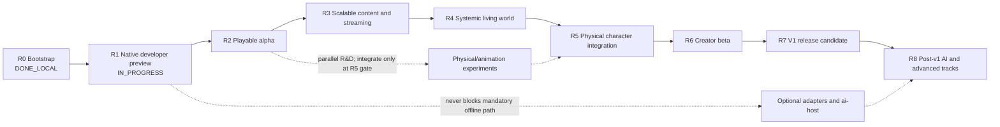

# Next Engine: долгосрочный roadmap реализации

| Поле | Значение |
|---|---|
| Статус | Living planning document, не нормативная архитектура |
| Последнее обновление | 2026-08-08 |
| Текущая точка | R2 Data-first Playable Alpha `COMPLETE` для Windows. Полный 20–30-minute Frontier Relay acceptance для `r2-reference-alpha-visual-v5` прошёл 2026-08-08 на baseline `fe87ae3`; package manifest `fe903b4a…a138`, game binary `50e4fb7f…534a` и project lock `84742a69…a828` записаны в `projects/reference-alpha/ACCEPTANCE.md`. Ручной run подтвердил Save → изменение world → Load → Resume, rollback/WASD, collisions, UI, resize/fullscreen. Automated `play`, `persistence-replay`, `content-package`, SDL3/Vulkan `platform`, workspace/`host-check`, package smoke и authoritative roots также проходят. B-03 закрыт. Следующий work package — bounded architecture cleanup перед R3a. Linux полностью `DEFERRED_LINUX`; R1/R7, B-12 и v1 shipping не заявляются. |
| Windows blocker-plan checkpoint | `WINDOWS_COMPLETE / DEFERRED_LINUX` для B-02 и `COMPLETE` для Windows R2. Это не закрывает R1: Linux исключён, paired cross-target evidence отсутствует. Архитектурный cleanup выполняется следующим самостоятельным increment; R3a после него. |
| R2 visual checkpoint | Три Windows visual packages и свежий `r2-reference-alpha-visual-v5` прошли automated checks и ручной acceptance. `B0ShaderInterfaceV2`, separate sky/world/UI, directional light/fog/shadows, distinct silhouettes, visible/inset colliders, semantic HUD и 720p/1080p presentation сохранили прежний gameplay result. Performance остаётся `REPORT_ONLY`; B-12 открыт. |
| Горизонт | developer preview → playable alpha → systemic alpha → creator beta → v1 → post-v1 |
| Источники | Accepted SPEC/ADR, текущий workspace и локальные ProductCheck |

## Назначение

Этот документ отвечает на три практических вопроса:

1. что реализовывать следующим;
2. в каком порядке расширять текущий узкий vertical slice;
3. какое наблюдаемое доказательство завершает каждый этап.

Roadmap не заменяет [продуктовый контракт](architecture/00-product-contract.md),
[архитектурную baseline](architecture/README.md) или профильный SPEC/ADR.
При конфликте действует порядок precedence из архитектурной baseline.
Семантическое изменение Accepted architecture по-прежнему требует отдельного
ADR; изменение приоритета или порядка реализации — нет.

Roadmap намеренно не содержит календарных обещаний. Без известного размера
команды, доступного content-production capacity и shipping hardware точные даты
создали бы ложную точность. Этапы упорядочены по продуктовым зависимостям и
имеют относительный размер. Календарный план следует строить из этого документа
после назначения владельцев и измерения скорости первых двух этапов.

## Как читать статус

| Статус | Значение |
|---|---|
| `DONE_LOCAL` | Реализация и релевантные checks проходят на developer host; это не shipping claim. |
| `DONE_LOCAL_WINDOWS` | Windows implementation/checkpoint завершён локально; Linux и cross-target claims остаются отдельными и открытыми. |
| `NEXT` | Следующий этап критического пути. |
| `PLANNED` | Нужен для v1, но зависит от более ранних этапов. |
| `PARALLEL` | Может развиваться параллельно, но имеет указанную integration gate. |
| `DEFERRED` | Не блокирует v1. |
| `PROPOSED` | Технология или contract ещё не входит в Accepted shipped baseline. |

Этап считается завершённым только когда одновременно выполнены все условия:

- behavior проходит production path, а не test-only shortcut;
- есть focused positive, failure и restart/save coverage;
- релевантные `fast`, `play`, `persistence-replay`, `content-package`,
  `platform` или `performance` имеют честный результат;
- schema, migration, examples, diagnostics и документация обновлены вместе;
- ни один `NOT_RUN` не интерпретирован как `PASS`;
- fallback проверен как реальное поведение, если основная возможность optional.

Наличие public type, Accepted SPEC или компилируемого adapter само по себе не
закрывает этап.

## Текущая точка

[M0–M11 implementation record](nextengine-v1-vertical-slice-implementation-plan.md)
фиксирует рабочий walking skeleton. На 2026-07-30 локально присутствуют:

- canonical commands, command ledger, fixed-stage runtime и atomic RPG
  transactions;
- exact project resolution/cook/activation и content-addressed publication;
- общий production coordinator для `game`, `headless` и runtime-bearing tools;
- atomic save generations, replay, application-session close/recovery;
- движение grounded capsule, статические Box colliders и contact lifecycle;
- pickup/equipment, melee damage, switch, dialogue/quest/relationship transition;
- deterministic two-chunk streaming;
- deterministic NPC affordance planner и procedural avatar projection;
- data-only mechanics, bounded Luau и Wasm Component paths;
- exact revision-bound presentation extraction и reference B0 render plan;
- neutral mesh/material/texture/profile catalog, deterministic cook/activation
  и derived B0 meshlet payloads;
- checked-in offline SPIR-V и B0 CPU visible-list/indexed-indirect path с
  deterministic fallback material;
- Windows-local keyboard/mouse ActionMap/InputContext resolver для live `game` и
  headless scenario, persisted ingress assignment и exact physics-snapshot
  `ClosestPoint` targeting, независимый от camera state;
- complete in-memory snapshots на каждой 30 Hz fixed-step boundary и typed
  integer/fixed-point third-person camera в `PresentationSnapshotV2`/B0 plan;
  renderer повторяет последний snapshot при любой cadence, а приватный Vulkan
  backend преобразует camera state в float view-projection и depth;
- bounded active-run durability: same-session checkpoint на tick `0`, каждые
  `30` ticks и forced atomically на suspend/close; crash rollback ограничен
  `29` ticks, resume не делает wall-time catch-up, lifecycle retry/publication
  rollback сохраняют prior generation, full lifecycle archive bounded,
  session store удерживает current+previous complete logical generations и
  упаковывает logical objects в bounded object packs по ADR-037, а required-save
  lineage переносится bounded цепочкой до `64` entries с exact prior durable
  snapshots и полными referenced object closures;
- session-bound desktop host/capability registration отклоняет stale adapter
  lifetime, а same-session authoritative restart начинает fresh presentation
  epoch с sequence `0` и camera cuts по
  [ADR-035](architecture/adr/035-bounded-live-recovery-platform-host-and-presentation-cut.md);
- Windows SDL3/ash B0 path с canonical keyboard/lifecycle events, fullscreen,
  swapchain recreation, bounded device-loss recovery и package smoke;
- versioned `xtask performance` foundation с exact THOTH fingerprint,
  release-only gate preflight, nearest-rank/baseline schemas и полным
  streaming/agent/render/live smoke report; representative `r2-alpha-render`
  реализован, а R3–R5 workloads честно возвращают `NOT_RUN`;
- локальная v1 closure matrix.

Data-first reference alpha теперь реализована, но ещё не принята как
пользовательская alpha: automated production flow и package smoke проходят,
а первый ручной run выявил исправленные atomic activation и subtitle recovery defects на принятии quest;
полный свежий 20–30-minute acceptance rerun ещё не выполнен. Текущий
R2 scope намеренно ограничен двумя chunks, одной combat ability, одним quest
loop и одним neutral humanoid skeleton/clip catalog; general partition, runtime
animation и reusable systemic quest conditions относятся к R3–R5.

### Реализация по подсистемам

| Область | Состояние в коде | Главный gap |
|---|---|---|
| Contracts/runtime/ledger | Реализован фундамент | Расширять только вместе с реальным gameplay use case; не строить второй runtime framework. |
| Project/application/session | Production path реализован; same-session active restart, platform-causal lifecycle rollback, full bounded retry archive, current-host binding и tick-0/30 checkpoint model прошли Windows-local checkpoint | Нужны native cross-target platform/package closure и дальнейшие real-project lifecycle cases. |
| Persistence/replay | Реализован текущий owner set | Нет реального schema migration graph и будущих owner segments. |
| RPG | Частично: основные aggregates и восемь операций | Нет полного faction/membership, status/effect, quest-graph, reward и divine command lifecycle. |
| Mechanics/packages | Частично: contact melee + Luau/Wasm examples | Нет общего ability phase/cost/cooldown/status lifecycle и creator-facing SDK workflow. |
| Content/cooker | Data-first `projects/reference-alpha` проходит file-backed authoring/resolve/cook/activate; package содержит 43 canonical entries, шесть production low-poly meshes, десять role/environment materials, четыре textures, synthesized audio и CC0 skeleton/clip provenance/NOTICE; прежний marker mesh удалён из production catalog | Нет navigation catalog, реальных migrations, general resource policy и runtime animation consumption. |
| World/streaming | Частично: deterministic two-chunk transition | Нет general partition interest, resource residency, calendar, population, schedules и region transfers. |
| Jobs/resources | Spec-only | Нет общего bounded job, memory, I/O credit, pin/lease и backpressure substrate. |
| Physics | Частично: upright capsule, static Box и exact B0 `ClosestPoint` scene query | Нет полного shape/body/constraint/query profile и production physical-character stack. |
| Animation/motor | Только procedural projection/contract fragments | Нет skeleton graph, retargeting, IK, root-motion intent или deterministic inference supervisor. |
| Agent AI | Частично: один canonical affordance planner | Нет perception, hierarchy, schedules, memory и 100-NPC workload. |
| Navigation/audio | Частично: полный baseline audio vertical (A1–A6 `DONE_LOCAL_WINDOWS`) — neutral clip contract, audio scene extraction, software mixer + canonical PCM sink, SDL device adapter, subtitle fallback, `audio_scene` в v1-closure | Gaps: chunked long-clip streaming payload, zone reverb fallback (zone occlusion gain есть), navigation cooker и baseline nav adapters. |
| Player experience | Keyboard/mouse и generic controller используют одинаковые action IDs с keyboard fallback; persisted targeting, third-person camera, semantic HUD/inventory/journal/dialogue/pause flow, localization, subtitles и preferences проходят automated Windows checks. HUD получил цветовой health meter, objective и отдельный presentation-only next-action panel, который выводится из immutable RPG snapshot для accept/pickup/equip/combat/relay/return/complete; Save показывает `Saved`, а Load оставляет восстановленный world на паузе с `Loaded - press Resume`. | Worker-to-desktop regression покрывает quest accept, durable checkpoint, Save confirmation, визуально различимое изменение, sequence-zero recovery cut, Load confirmation, продолжение новой epoch после явного Resume и реальное authoritative WASD movement с exact загруженной input-context revision. Свежий 20–30-minute run зафиксирован как `PASS`. Accessibility profiles и capability-scoped extension panels остаются вне R2 gate. |
| Presentation/render | Exact revision-bound snapshot, typed camera, offline SPIR-V, seven-binding B0 scene и Windows recovery/package path реализованы; humanoid/blade/relay имеют разные материалы, collected pickup скрывается, defeated NPC остаётся видимым с тёмным material, relay меняет inactive/active material. Engine-owned relay-approach kit (tiled path, platform, two ruined pillars, four-rock field) добавляет читаемый маршрут и landmarks одним batched draw; отдельный reusable rock source mesh остаётся в content catalog. Relay collider точно следует видимым pillars/top beam/central switch без невидимых продолжений. Contract-preserving B0+ shader выводит flat geometry normal из world-position varying и применяет fixed sun/ambient + depth fog без смены locked position/UV ABI. Private UI adapter рисует контрастные bordered panels: HUD/action слева, inventory/journal справа, dialogue/pause по центру. | Нет authored smooth normals, runtime skeleton/VFX consumption, production art/animation polish, clean ten-run THOTH hard evidence, paired same-commit target proof и Linux hardware-GPU evidence. |
| Tooling | Repository `xtask`, Performance V3, representative R2 report workload и Windows package smoke реализованы | Нет creator-facing `next` CLI, inspectors, scenario/minimizer, R3–R5 workloads, ten-run THOTH baselines и stable external SDK workflow. |
| Autonomous narrative | Contract fragments only | SPEC-31 runtime, graph admission, director fallback и divine batch transaction отсутствуют. |

## Продуктовая граница v1

V1 следует оценивать по [SPEC-00](architecture/00-product-contract.md), а не по
количеству полностью реализованных архитектурных документов. Accepted SPEC
задаёт правильную границу и failure semantics, когда соответствующая
возможность реализуется; он не всегда делает всю описанную глубину блокером
первого релиза.

Для v1 обязательны:

- один устанавливаемый cooked project на Windows x86_64 и Linux x86_64;
- связанный movement → interaction → combat → dialogue → quest loop;
- `game`, deterministic `headless` и creator/runtime tools;
- save/load/replay и offline correctness;
- streamed world, generic RPG state и first-party mechanics через public
  package API;
- bounded data-only, Luau и Wasm extension paths;
- engine-owned physics, motor и animation boundaries с процедурным fallback;
- usable player input, camera, semantic UI и минимально доступный presentation
  path;
- neutral content cook/validate/package workflow.

Не являются v1 blocker:

- LLM, ASR, TTS, external `ai-host` и SPEC-16 multimodal dialogue;
- autonomous Narrative Director и divine agency из SPEC-31;
- learned motor policy, Isaac Lab, PhysX или другой vendor physics backend;
- ray tracing, mesh shaders, HDR, advanced VFX и displayless capture;
- Gothic importer;
- full editor, multiplayer, consoles, mobile или macOS shipping.

Рекомендуемый v1 physical scope: устойчивый capsule/procedural controller,
skeletal presentation, retargeting и basic IK. Full articulation и learned
motor policy входят в v1 только если их собственный product check проходит
достаточно рано; fallback остаётся shipping-capable без них.

## Критический путь

| Этап | Статус | Размер | Product outcome |
|---|---|---:|---|
| R0. Walking skeleton | `DONE_LOCAL` | — | Узкий deterministic slice доказал end-to-end architecture. |
| R1. Native developer preview | `IN_PROGRESS` | S–M | Один exact package действительно запускается на обеих shipping targets. |
| R2. Playable alpha | `COMPLETE / WINDOWS_ACCEPTED` | L | Data-first slice, Windows package, automated checks и зафиксированный 20–30-minute acceptance проходят. Linux/R1 cross-target closure не заявляется. |
| R3. Scalable content and streaming | `PLANNED` | XL | Движок перестаёт зависеть от hard-coded two-chunk fixture. |
| R4. Systemic living world | `PLANNED` | XL | NPC, schedules, navigation и RPG consequences образуют живой offline world. |
| R5. Physical character integration | `PARALLEL` → `PLANNED` | XL | Physical, animation и motor layers становятся production gameplay path. |
| R6. Creator beta | `PLANNED` | L–XL | Второй проект/пакет создаётся без правки engine internals. |
| R7. V1 release candidate | `PLANNED` | L | Полный v1 scope стабилизирован и упакован для Windows/Linux. |
| R8. Post-v1 tracks | `DEFERRED` | отдельные программы | Optional AI/narrative/importer/advanced rendering не размывают v1. |

## R0 — Walking skeleton

**Статус:** `DONE_LOCAL`.

**Цель:** доказать, что архитектурные границы соединяются в один production
path.

**Доказанный результат:** M0–M11, локальные `play`, `persistence-replay`,
`content-package`, portable `platform`, `performance` и `v1-closure`.

**Открытый риск:** этот этап доказан на Apple Silicon developer host.
Windows/Linux execution не считается выполненным и перенесён в R1.

**Правило сохранения:** каждый следующий этап расширяет текущий slice
вертикально. Переписывание contracts/runtime без нового player-facing outcome
не является roadmap progress.

## R1 — Native Windows/Linux developer preview

**Статус:** `IN_PROGRESS`. Native gate harness, Windows Desktop B0 hardening и
minimal render-content implementation реализованы; релевантные Windows
`content-package`, `platform`, `performance` и clean `v1-package` проходят
локально. Native Linux target report и package на более раннем checkpoint
имеют отдельный `PASS`; paired
same-commit Windows report и compare ещё не выполнены. Exact checkpoint,
environment и coordination status ведутся в
[Linux validation backlog](development/linux-validation-backlog.md).

**Текущая execution policy:** native Windows x86_64/MSVC/Vulkan — основной
developer host и приоритет текущих work packages. Linux validation выполняется
отдельными асинхронными checkpoint-сессиями; standalone Linux `PASS` не
закрывает R1/B-01 без matching Windows target `PASS` report и успешного compare.
Отложенные Linux-only действия ведутся в
[Linux validation backlog](development/linux-validation-backlog.md) и
выполняются асинхронными checkpoint-сессиями. Их ожидание не блокирует
несвязанные Windows work packages, но соответствующие R1/v1 criteria до
фактического run остаются открытыми.

**Цель:** превратить portable local closure в честно запускаемый native
developer package.

**Основной scope:**

- стабилизировать private SDL3/ash B0 adapter на Windows x86_64 и Linux x86_64;
- закрыть window/input/focus/resize/fullscreen/surface/device-loss lifecycle;
- проверить platform normalization без влияния native timestamps на simulation;
- собрать atomic distribution с `game`, `headless`, exact cooked project и
  notices;
- запустить release `headless` и bounded interactive release `game` из
  созданного package;
- сравнить project/content/state/ledger roots между target reports.

**Критерии успеха:**

- на обеих targets проходят `host-check`, `play`, `persistence-replay`,
  `content-package`, `platform`, `performance` и `v1-closure`;
- каждый `v1-closure` сообщает `PASS` для native target текущего host и честный
  `NOT_RUN` для другого target; успешный same-commit `native-gate-compare`
  выставляет `native_gate_ready = true`;
- `v1-package` создаёт installable directory и оба release binaries запускаются
  против exact packaged lock;
- B0 scene обрабатывает real input и типовые lifecycle transitions без
  authoritative divergence;
- package не содержит machine-local paths, protected data, credentials или
  отсутствующие notices.

**Hard blockers:**

- paired native Windows/Linux `PASS` reports и package на одном exact commit;
- representative hardware-GPU Linux smoke; текущий checkpoint и pending
  actions записаны в
  [Linux validation backlog](development/linux-validation-backlog.md);
- SDL3/ash candidate должен пройти target smoke; cross-compilation недостаточно;
- любой cross-target canonical/hash mismatch;
- packaging/runtime dependency, которая не включена или не диагностируется.

**Не блокируют этап:** PhysX, Slang, RT, learned policy, `ai-host`, capture и
Gothic importer.

**Основные источники:** SPEC-04, SPEC-12, SPEC-17, SPEC-29, SPEC-30, ADR-003,
ADR-028, ADR-030.

## R2 — Playable product alpha

**Цель:** превратить технический fixture в небольшой player-facing slice,
который можно пройти без знания engine internals.

**Основной scope:**

- runtime ActionMap/InputContext service поверх существующего canonical input;
- third-person camera, interaction focus и authoritative targeting query;
- semantic HUD, inventory/equipment, dialogue, quest journal, pause/save/load
  flow;
- source locale, deterministic text IDs, pseudo-locale и readable fallback;
- keyboard/mouse и минимум один controller profile через одинаковые action IDs;
- validate и расширить реализованный minimal mesh/material/texture path для B0
  renderer до representative alpha content;
- baseline sample playback, attenuation/panning, voice limiting и subtitle
  fallback;
- один CC0/engine-owned 20–30 minute project slice с началом, конфликтом и
  завершением.

Первый Windows increment этого этапа, **Player action and camera
(`DONE_LOCAL_WINDOWS`)**, содержит общий keyboard/mouse ActionMap/InputContext
resolver для live `game` и headless scenario, persisted ingress assignment,
authoritative B0 `ClosestPoint` targeting из exact physics snapshot,
`ReplayManifestV5` query provenance и typed integer/fixed-point third-person
camera. Live loop создаёт complete in-memory snapshot на каждой 30 Hz boundary;
durable same-session checkpoint публикуется на tick `0`, каждые `30` ticks и
forced atomically на suspend/close. Crash может откатить до `29` последних
in-memory ticks, resume не догоняет wall time, exact lifecycle retry и
publication rollback сохраняют prior state, full request/event archive bounded,
а session store удерживает current+previous complete logical generations,
физически объединяет objects в bounded generation packs по ADR-037 и переносит до
`64` required-save recovery entries с exact prior snapshot/object closures.
Fresh session-bound desktop host
registration отклоняет stale lifecycle/control events; authoritative restart
публикует new presentation epoch, sequence `0` и camera cuts. Exact semantics
зафиксированы [ADR-035](architecture/adr/035-bounded-live-recovery-platform-host-and-presentation-cut.md).
Локальный Windows checkpoint подтверждён `host-check`, `play`,
`persistence-replay`, `content-package`, real SDL3/Vulkan `platform` и
fresh-output `v1-package`. Generic controller использует те же action IDs, что
keyboard/mouse, а отсутствие устройства использует keyboard fallback. Поэтому
Windows-часть B-02 имеет статус `WINDOWS_COMPLETE / DEFERRED_LINUX`; это не
закрывает R1/B-01, `native_gate_ready`, shipping или Linux/native target criteria.

Data-first package `projects/reference-alpha` содержит 51 canonical records и
два chunks, versioned authoring manifest, source spans, engine-owned
geometry/materials/text/synthesized audio и CC0 humanoid skeleton/clip catalog с
source/hash/license/NOTICE. Production scripted equivalent выполняет Frontier
Relay за `32` ticks и `27` events: принимает quest через dialogue, находит и
экипирует предмет, переходит в следующую зону, завершает combat, активирует
relay, возвращается и завершает quest; restore проверяется после acceptance,
combat и relay activation. `game` и `headless` получают одинаковый authoritative
result. Skeleton/clip catalog в R2 является content prerequisite; runtime
animation остаётся R5.

R2 visual usability pass удалил production marker mesh и добавил static
low-poly humanoid, relay gate и blade с отдельными role materials. Presentation
state детерминированно выводится из authoritative RPG snapshot на каждом
publication и после Load: подобранный blade скрывается, побеждённый NPC остаётся
видимым с тёмным material, relay переключает inactive/active material. Его
collider состоит только из видимых pillars, top beam и central switch; live
traversal regression проходит вокруг gate за границу прежней невидимой стены.
Следующий инкремент ввёл exact `B0ShaderInterfaceV2`: position/UV дополняются
optional SNORM16 normals с derivative flat-normal fallback, а 208-byte frame
block содержит camera, sun, fog и stabilized shadow transform. Отдельные
sky/world/UI suites, directional sun, hemispheric ambient, world-distance fog и
renderer-owned 2048² depth shadow map с 32×32 м snapped volume, fixed bias и
3×3 PCF проходят real Windows Vulkan path. Sampled-depth format/allocation
failure выбирает stable no-shadow shader с диагностикой и не меняет gameplay.
Private semantic-UI adapter теперь имеет bordered panels и стабильный
layout: HUD слева, inventory/journal справа, dialogue/pause по центру; health и
objective визуально различимы. Save/Load дают явные подтверждения, причём Load
публикует обязательный recovery cut, затем `Loaded - press Resume` и не запускает
simulation до Resume. Catalog, live bindings, final scripted state и полный
worker save/load flow покрыты regressions; свежие `content-package`, `play`,
`persistence-replay`, native Windows `platform` и package smoke проходят.
Свежий 20–30-minute manual acceptance этого package зафиксирован как `PASS`
2026-08-08.

Следующий bounded visual increment добавил engine-owned tiling ground/path/stone/cloth/metal
textures и batched environment kit-piece: relay approach объединяет дорогу,
подиум, две разрушенные колонны и четыре low-poly скалы; reusable rock mesh
остаётся отдельной public content записью. Начальная scene содержит семь
bindings; после полного flow остаются шесть visible draws,
а legacy 10 000-cycle frame-planning gate проходит прежний absolute 30-second
budget. Отдельный HUD action panel read-only выводит из immutable RPG snapshot
следующий шаг для всех семи стадий acceptance; projection regression покрывает
accept, pickup, equip, combat, relay activation, return и completion. Новый
Четыре крупные скалы получили inset static Box proxies внутри видимых силуэтов;
центральный маршрут и обход relay покрыты live traversal regressions. Player,
enemy и quest giver используют три разных static low-poly silhouette meshes;
skinning и animation path по-прежнему остаются R5. Focus ring и quest marker
публикуются из immutable snapshots с reserved ordinals и не отбрасывают тень;
combat target-health, pickup/relay/defeated states и keyboard/controller
affordances остаются presentation-only. 12×16 alpha font и private overlay
покрыты 720p/1080p HUD/inventory/dialogue/pause/save/load/pseudo-locale goldens.
`visual-smoke` создаёт шесть displayless BMP и manifest с project/snapshot/frame
plan/camera/shader hashes как human evidence, не correctness oracle. Gameplay
contracts, authoritative state и R5 animation path не менялись.

Representative `r2-alpha-render` реализует exploration, combat и UI/dialogue
windows для 1080p и 720p fallback: `3 600` warm-up и `21 600` measured frames,
`50 400` Vulkan queries, distinct snapshots, authoritative roots и V3 resource
evidence. Текущий release report проходит absolute budgets, но сохраняет
`REPORT_ONLY`: worktree не clean и THOTH preflight не готов. Это не hard evidence
и не закрывает B-12.

Первый фактический ручной acceptance дошёл до принятия quest и выявил два дефекта
одного checkpoint path. Сначала runtime tick публиковался до fallible activation
нового input context; activation теперь staged внутри `PreparedRuntimeTick` и
публикуется атомарно с runtime generation. Повторный run на исправленном binary
локализовал оставшийся failure: валидный semantic UI record `Subtitle = 8`
кодировался, но presentation recovery decoder принимал только роли `0..7`.
Decoder теперь покрывает `Subtitle`; отдельный byte-exact codec test, production
quest-accept regression с полным следующим checkpoint и exact manual failed-state
tail от tick 390 проходят. Следующие ручные попытки выявили, что pause-menu Save
не подтверждал публикацию, Load выбирал текущий session checkpoint, а desktop
ошибочно применял tick monotonicity между epoch и мог не увидеть обязательный
sequence-zero recovery cut из-за latest-wins publication. Production worker test
теперь принимает quest реальными клавишами, пересекает durable checkpoint, выполняет
Save → movement → Load, передаёт exact recovery cut/следующий кадр в desktop
transition validator и после явного Resume доказывает реальное WASD movement через exact controller binding из save; `play` проверяет факты всех трёх restored stages. Полный свежий 20–30-minute run на зафиксированном package прошёл 2026-08-08, поэтому R2 и B-03 закрыты для Windows. Текущий scripted flow проверяет требуемый порядок, но R2
намеренно не вводит reusable quest conditions: ручной игрок может повторно
взаимодействовать с quest giver до relay activation. Systemic condition
enforcement относится к representative R4 mechanics scope и явно не
выдаётся за выполненный R2 capability.

**Критерии успеха:**

- новый пользователь может запустить package, пройти movement → pickup/equip →
  combat → dialogue → quest → save/load loop без debug commands;
- те же semantic actions проходят через `game` и headless scenario и дают
  одинаковый authoritative result;
- UI/camera/audio/presentation faults не меняют gameplay hash;
- save/load работает до и после каждого крупного шага slice;
- missing device/locale/audio output использует declared fallback;
- `play`, `persistence-replay`, `content-package` и native `platform` проходят
  для alpha project.

**Открытые ограничения вне Windows R2 closure:** R1 native cross-target package
closure и Linux остаются вне текущего Windows-only плана; B-12 требует clean
ten-run performance evidence.

Automated production path, lawful content/provenance, отсутствие hidden
UI/camera mutation и ручной representative loop подтверждены. Следующий WIP=1 —
архитектурный cleanup; R3a начинается только после него.

**Scope guard:** editor, advanced renderer, photoreal assets и procedural world
generation не входят в этот этап.

**Основные источники:** SPEC-04, SPEC-08, SPEC-12, SPEC-18, SPEC-24, SPEC-29,
SPEC-30, ADR-019, ADR-034, ADR-035.

## R3 — Scalable content, jobs and streaming

**Цель:** заменить fixture-specific load/cook behavior на bounded substrate,
пригодный для реального multi-region project.

**Основной scope:**

- закрытый job classification, immutable requests/results, canonical merge,
  cancellation tree и finite queues;
- logical memory/resource budgets, pins, leases, deterministic eviction,
  decompression and I/O credits;
- production `ContentManifest`/bundle container и neutral schemas для scene,
  mesh, material, texture, collision, skeleton, animation, audio, navigation и
  world chunk в реально используемом минимальном профиле;
- schema compatibility registry и первый настоящий copy-on-write migration;
- general world partition interests, dependency groups, placement/tombstones,
  load/unload admission и restart reconstruction;
- cooker cache и atomic publication для multi-region project;
- убрать assumptions, требующие ровно два chunks или reference-only IDs.

**Критерии успеха:**

- representative project с несколькими regions и существенно более чем двумя
  chunks cooks, loads, streams, unloads, saves и restarts через production path;
- worker completion, queue pressure, cancellation и I/O fault permutations
  дают одинаковый committed world root;
- mandatory work не теряется и optional overload использует declared rejection
  или degradation;
- corrupt/oversized/cyclic content и migration inputs fail closed до
  publication;
- первая N−1→N migration сохраняет source generation и публикует только
  complete target generation;
- `content-package`, `persistence-replay`, focused streaming tests и
  `performance` проходят в declared memory/I/O profile.

**Hard blockers:**

- финальный минимальный набор content classes для v1;
- ownership map между Runtime, Assets и World Services без второго mutable
  source;
- измеримый logical resource profile для Windows/Linux;
- migration fixture, представляющий реальную эволюцию schema, а не empty DAG.

**Основные источники:** SPEC-03, SPEC-17, SPEC-21, SPEC-22, SPEC-23, SPEC-24,
SPEC-25, ADR-025, ADR-026.

## R4 — Systemic living world

**Цель:** перейти от scripted encounter к offline world, где NPC и world state
продолжают согласованно жить вне непосредственного контакта с игроком.

**Основной scope:**

- `WorldCalendarState`, stepped/bounded bulk time и World Services save owner;
- population records, `Dormant/Abstract/Simulated/Active` tiers, schedules,
  wake/defer rules и region transfers;
- deterministic graph navigation baseline, tiled cook/streaming, route validity
  и physical traversal handoff;
- perception facts, bounded planner hierarchy, habits and deterministic memory
  baseline;
- faction/membership/relationship operations, reusable dialogue/quest
  conditions and consequences;
- general ability phase/cost/cooldown/effect/status lifecycle through public
  mechanics API;
- integrated 100-NPC budget with deterministic cadence/deferral and no
  starvation;
- deterministic acoustic gameplay facts; hardware audio remains presentation.

**Критерии успеха:**

- multi-region scenario с 100 NPC воспроизводит exact schedule/tier/command/
  event/final roots across repeats, save/restart and worker permutations;
- NPC проходит navigation → interaction/combat → consequence только через
  AgentIntent/WorldCommand/Mechanics paths;
- unsupported abstract outcome upgrades or defers and никогда не фабрикует
  success;
- stepped и bulk world time сходятся на одинаковых boundaries;
- faction, quest, inventory и relationship consequences переживают unload,
  save/load и NPC tier changes;
- due AI/navigation work укладывается в ADR-016 thresholds или применяет
  declared deterministic cadence reduction;
- mandatory gameplay остаётся корректным без network и `ai-host`.

**Hard blockers:**

- R3 job/resource/partition substrate;
- navigation content and query baseline;
- календарный owner segment и migration из любого legacy representation;
- полный owner-safe RPG operation set для выбранного systemic scenario;
- authored NPC schedules, regions and fallback activities.

**Основные источники:** SPEC-06, SPEC-08, SPEC-13, SPEC-19, SPEC-20, SPEC-23,
SPEC-25, ADR-016, ADR-020, ADR-021, ADR-026.

## R5 — Physical character, animation and motor integration

**Статус:** R&D может идти как `PARALLEL` с R2–R4, production integration
закрывается после R4 substrate.

**Цель:** сделать физическое воплощение персонажа частью production gameplay,
не связывая correctness с конкретным vendor backend или model.

**Обязательный v1 scope:**

- расширить reference physics до нужных gameplay shapes, layers, materials,
  bounded queries, sensors и dynamic/kinematic interactions;
- устойчивый capsule locomotion profile: slopes, stairs, push, fall/recovery;
- neutral skeleton/clip/graph schemas, retargeting и basic IK;
- root motion остаётся intent и проходит physical validation;
- deterministic procedural motor/safety/recovery route;
- physical and animation state save/load/replay;
- один humanoid physical archetype, используемый player и NPC через public
  contracts.

**Optional integration scope:**

- ONNX observation/action path и policy supervisor;
- full articulation;
- PhysX 5.9.0 parity adapter.

**Критерии успеха:**

- player/NPC проходят push, slope, stair, trip, carry, fall/recovery и melee
  fixtures без teleport/direct health mutation;
- contact/query/order, committed physical projection and gameplay outcome
  воспроизводятся согласно выбранному deterministic profile;
- skeleton/retarget/IK failures используют declared pose/procedural fallback и
  не повреждают authoritative state;
- 16 representative avatars укладываются в SPEC-05 budget на declared
  reference CPU profile либо используют deterministic physical LOD;
- save/load/replay сохраняет physical/animation owner state;
- learned/vendor path при отсутствии или failure возвращается к тому же
  shipping-capable procedural path.

**Hard blockers:**

- минимальный v1 physical archetype и animation asset profile;
- general collision/query features, которых требует выбранный gameplay;
- cross-target numeric profile и canonical projection;
- licensed/CC0 skeleton, clips and retarget fixtures;
- ясная граница authoritative physical state против presentation pose.

**Не являются hard blocker:** достижение PhysX parity, training hardware,
learned policy quality или full articulation. Если они не проходят вовремя,
v1 остаётся на reference/procedural route.

**Основные источники:** SPEC-05, SPEC-14, SPEC-26, SPEC-27, SPEC-28, ADR-009,
ADR-013, ADR-027, ADR-032, ADR-033.

## R6 — Creator beta and SDK

**Цель:** доказать, что движок расширяется не только его авторами и не только
через Rust source edits.

**Основной scope:**

- stable non-interactive `next` CLI: project resolve/validate/diff, cook,
  content/package/save/plugin validation, replay and package;
- read-only inspectors для RPG, world, mechanics, input/player, AI and physical
  projections;
- scenario validate/run/minimize и stable JSON diagnostics;
- public package templates, versioned data/Luau/Wasm APIs and examples;
- ability, item, NPC, dialogue, quest, world-chunk and physical-archetype
  authoring workflows;
- N/N−1 plugin/package/schema compatibility and migration examples;
- deterministic cooker cache, actionable source spans and basic license/SBOM
  output;
- второй small project или expansion package, созданный только через public
  contracts.

**Критерии успеха:**

- clean checkout + documented toolchain создаёт, cooks, validates, runs and
  packages второй project без изменения engine crates;
- first-party и community-style mechanics используют одинаковый SDK,
  capabilities and validators;
- malformed assets, sandbox escapes, quota overflow and incompatible package
  versions fail with stable diagnostics and no partial publication;
- replay inspector находит first divergent tick/subsystem;
- cold authoring exercise может добавить одну ability, один quest/NPC и один
  streamed chunk через documented public workflow;
- `fast`, `play`, `persistence-replay` and `content-package` включают второй
  project/package как regression fixture.

**Hard blockers:**

- стабилизированный minimal schema surface из R3–R5;
- отсутствие hidden first-party bootstrap APIs;
- понятная distribution/license policy для packages;
- budget на документацию, examples and diagnostics, а не только runtime code.

**Scope guard:** full graphical editor не нужен; CLI/JSON + schemas должны быть
достаточны для v1.

**Основные источники:** SPEC-07, SPEC-09, SPEC-11, SPEC-13, SPEC-15, SPEC-22,
SPEC-24, ADR-008, ADR-014, ADR-025.

## R7 — V1 release candidate and release

**Цель:** стабилизировать выбранный product scope, а не добавлять новые
архитектурные подсистемы.

**Основной scope:**

- feature/content freeze и закрытие только release-blocking defects;
- final representative cooked project и clean-install packages;
- save/schema compatibility matrix и upgrade/rollback documentation;
- Windows/Linux performance, input, renderer, audio and lifecycle hardening;
- accessibility baseline, source locale and fallback behavior;
- license notices, provenance, dependency inventory and protected-data scan;
- user/developer getting-started, package authoring and troubleshooting docs;
- crash/recovery, long-session and corrupted-input suites;
- release versioning and reproducible package manifest.

**Критерии успеха:**

- все 16 MUST из SPEC-00 покрыты observable product behavior;
- final exact commit проходит релевантные checks на native Windows x86_64 и
  Linux x86_64;
- fresh packages запускают `game`, `headless` and tools, activate exact cooked
  lock, save/load and complete the representative loop;
- no open release-blocking data-loss, security, deterministic divergence,
  install/launch or offline-correctness defect;
- target performance profiles соблюдены либо качество снижено только через
  declared non-authoritative/LOD fallback;
- package содержит required notices and no forbidden artifacts;
- все `NOT_RUN` перечислены как non-claims; shipping-required target check не
  может оставаться `NOT_RUN`.

**Hard blockers:**

- незакрытый R1 target/package gate;
- незавершённый representative content slice;
- incompatible save without migration/export path;
- P0/P1 data-loss, security, determinism, offline or installation defect;
- неизвестная provenance любого distributed artifact.

**Основные источники:** SPEC-00, SPEC-11, SPEC-12, SPEC-15, SPEC-17, SPEC-29,
ADR-001, ADR-030.

## R8 — Post-v1 programs

Эти направления получают отдельные implementation plans после v1 либо раньше
как изолированные experiments без влияния на mandatory gameplay:

| Track | Architecture status | Entry condition |
|---|---|---|
| Autonomous quest lifecycle, Narrative Director and divine agency | SPEC-31/ADR-029/ADR-031 Accepted, runtime отсутствует | R4 world/RPG boundaries и R6 scenario/tooling готовы; template fallback реализуется первым. |
| Text-canonical multimodal dialogue/model packs | SPEC-16/ADR-017 `Proposed` | Явное решение о promotion, privacy/budget policy и text-only fallback. |
| External `ai-host` | Optional | Stable bounded process protocol, recorded-input replay and complete in-process fallback. |
| Learned/full-articulation motor | Optional technology | R5 reference/procedural baseline, exact observation/action checks and runtime/training parity. |
| PhysX production backend | ADR-033 technology remains `Proposed` | Полная parity на Windows/Linux; reference backend остаётся oracle/fallback. |
| Advanced renderer/HDR/RT/VFX/capture | Optional | B0 v1 path стабилен; feature has bounded fallback and target-specific product check. |
| Gothic importer | Optional separate repository/process | Neutral schemas стабильны, legal/provenance boundary проверен; parent repo остаётся независимым. |
| Full editor | Outside v1 | Creator beta CLI/JSON workflows показали реальные high-friction authoring operations. |

Принятие SPEC-31 не означает, что он должен задерживать v1. Его реализация
зависит почти от всех systemic boundaries R3–R6 и поэтому раньше будет создавать
parallel authority или fixture-only code.

## Сквозные workstreams

Некоторые работы идут постоянно и не должны превращаться в отдельный
инфраструктурный этап.

### Product slice

Каждый этап должен оставлять более богатый запускаемый project. Нельзя
реализовать world services, animation или tools только на synthetic unit
fixtures и отложить integration до R7.

### Determinism and persistence

Любой новый authoritative owner сразу получает:

- command/transaction path;
- owner segment and canonical state root;
- save/load/restart and corrupt-input coverage;
- replay compare point;
- game/headless parity.

### Security and content provenance

Любой новый parser, package surface, model or external process считается
untrusted с первого changeset. Bounds, hashes, capabilities, quotas, redaction
and notices добавляются вместе с happy path.

### Platform

Windows checks запускаются вместе с каждым work package, который меняет
platform, renderer, physics, packaging or performance. Требующие native Linux
host действия добавляются в
[отдельный backlog](development/linux-validation-backlog.md) и могут
выполняться асинхронно пакетами на зафиксированных exact-commit checkpoints.
Отсутствие Linux run не блокирует unrelated Windows development, но stage exit
или shipping claim, требующий Linux evidence, остаётся открытым. Накопленные
Linux checks нельзя молча переносить за соответствующий stage/release gate.

### Physical R&D

Physics/animation experiments могут идти параллельно после R1, но не меняют
default route до R5 integration gate. Неуспех vendor/model candidate не
блокирует capsule/procedural product.

## Blocker register

| ID | Blocker | Блокирует закрытие | Условие снятия |
|---|---|---|---|
| B-01 | `DEFERRED_LINUX`: Linux validation и same-commit cross-target compare исключены из текущего Windows-only плана. Имеющееся evidence остаётся historical и не закрывает R1/R7. | R1, R7 | Вне текущего плана: на одном exact clean commit собраны Windows/Linux target `PASS` reports/packages с matching roots и `native-gate-compare` сообщает `native_gate_ready = true`. |
| B-02 | `WINDOWS_COMPLETE / DEFERRED_LINUX`: Windows SDL3/ash B0 проходит real Vulkan frame, resize/focus/suspend-resume/fullscreen, injected device/swapchain recovery, normalized keyboard/mouse, generic controller action profile, real audio open/reopen и packaged `game`/`headless` launch. Linux не выполняется. | R1, R2 | Windows-часть завершена; полное R1 closure и paired cross-target evidence остаются вне Windows-only плана. |
| B-03 | `CLOSED / WINDOWS_ACCEPTED`: lawful 51-record `projects/reference-alpha`, scripted flow, persistence recovery, package smoke и manual acceptance проходят. Полный representative run без debug commands зафиксирован 2026-08-08 для `r2-reference-alpha-visual-v5` с immutable package/game/project-lock hashes; Save → world change → Load → Resume, rollback/WASD, collisions, UI, resize/fullscreen подтверждены. | — | Закрыт. Повторять acceptance после material package/runtime changes; Linux/R1 и B-12 остаются отдельными открытыми gates. |
| B-04 | Нет общего job/resource/backpressure substrate | R3–R5 | Finite queues, canonical merge, logical budgets, pin/lease/eviction and fault checks реализованы production owners. |
| B-05 | Schema migration DAG фактически пуст | R3, R7 | Реальная N−1→N copy-on-write migration проходит valid/corrupt/fault matrix. |
| B-06 | World ограничен двумя chunks | R3, R4 | General partition interest/admission and multi-region save/restart scenario проходят. |
| B-07 | Нет calendar/population/navigation services | R4 | World owner segment, schedules/tiers and graph navigation baseline проходят systemic scenario. |
| B-08 | Physics ограничена capsule + static Box; animation/motor отсутствуют | R5 | V1 physical profile and procedural animation/motor fallback проходят physical product checks. |
| B-09 | Нет external creator CLI/SDK workflow | R6, R7 | Второй project/package создаётся cleanly только public tools/contracts. |
| B-10 | `PERMANENT_SCOPE_GATE`: content scope может расти быстрее playable loop; blocker не закрывается одноразово. | Все этапы | На каждом package один representative scenario и явный non-goal list; новая подсистема допускается только по требованию scenario. |
| B-11 | `CONTENT_COMPLETE / SOLO_OWNER`: единственный owner — solo maintainer; отдельная staffing/ownership matrix не создаётся. Alpha package содержит engine-owned assets/audio/text, acceptance docs, CC0 source/hash/license provenance и NOTICE и проходит `content-package`/package smoke. Будущие creator examples относятся к R6/B-09, а не к staffing gate. | R2, R6, R7 | Содержательно закрыт для alpha package; поддерживать provenance/NOTICE в том же public package по мере дальнейших content changes. |
| B-12 | `OPEN / R2_REPORT_ONLY / DEFERRED_LINUX`: ADR-045 узко заменил mandatory exact allocator evidence; current V3 hard schema требует canonical logical charges, peak working set, process I/O, device-allocation ceiling, Vulkan timestamps, profiler integrity и authoritative roots. V2 читается только как historical evidence; allocator counter optional, но strict при наличии. Representative `r2-alpha-render` реализован и в release report выполняет 6 окон, 21 600 measured frames и 50 400 Vulkan queries; все absolute budgets проходят, но dirty worktree и неготовый THOTH preflight оставляют evidence `REPORT_ONLY`. R3–R5 workloads, clean release ten-run baselines и hard gates отсутствуют. Candidate-6/7 failures остаются immutable. Linux полностью deferred. | R4, R5, R7 | Для Windows-части — по 10 valid clean release runs каждого R2–R5 workload, compatible baseline и hard `PASS`; затем `WINDOWS_COMPLETE / DEFERRED_LINUX`. Report-only run, Accepted ADR и `NOT_RUN` не закрывают blocker. |

## Решения, которые нужно принять вовремя

Эти решения не должны блокировать начало roadmap, но должны быть закрыты до
указанного gate.

| Decision | Deadline | Рекомендация |
|---|---|---|
| Минимальный v1 visual/content profile | до R2 implementation freeze | B0 raster, mesh/material/texture, one humanoid skeleton, source locale; no HDR/RT requirement. |
| UI toolkit/backend | до R2 UI integration | Private replaceable adapter behind semantic UI; не вводить widget types в contracts. |
| Baseline navigation | до R4 | Начать с engine-owned deterministic graph/tile representation; Recast remains replaceable candidate. |
| V1 physical scope | до R5 content production | Capsule/procedural + skeletal/IK mandatory; learned/full articulation optional. |
| Physics backend | до R5 integration | Reference remains default/oracle; promote PhysX only after target parity. |
| Creator surface | до R6 | Stable CLI/JSON first; graphical editor after real creator workflow data. |
| Narrative/LLM priority | после R7 scope freeze | Template/deterministic behavior first; external model only as optional candidate source. |

## Ближайшая implementation queue

Ближайшая очередь является Windows-first. Linux validation не занимает позицию
в implementation queue: требующие native Linux host действия накапливаются в
[Linux validation backlog](development/linux-validation-backlog.md) и
выполняются отдельными checkpoint-сессиями. Это не блокирует начало следующего
Windows increment. Оба same-commit reports и успешный compare остаются
обязательными перед закрытием R1/B-01.

Следующие work packages рекомендуется выполнять в этом порядке:

Завершённый Windows baseline: **Desktop B0 hardening (`DONE_LOCAL_WINDOWS`)**.
SDL keyboard input нормализуется в engine-owned events; resize/focus/minimize/
restore/fullscreen, surface recreation и bounded device-loss recovery проходят
production adapter path. Оставшиеся target claims учитываются отдельно и не
возвращают этот implementation package в активную очередь.

Реализация **Minimal render content (`DONE_LOCAL_WINDOWS`)**
добавляет neutral mesh/material/texture/profile catalog, exact revision-bound
presentation, deterministic cook/activation и meshlet payloads, checked-in
offline SPIR-V, CPU visible list/indexed-indirect B0 path и declared fallback.
`content-package`, `platform`, `performance` и clean package smoke проходят
локально на Windows; `LNX-004` выполняется позднее асинхронно и не удерживает
следующий Windows package.

Завершённый Windows checkpoint **Player action and camera
(`DONE_LOCAL_WINDOWS`)** добавляет общий
для live `game` и headless scenario ActionMap/InputContext resolver с WASD,
pickup/equip-use/interact/melee и relative mouse orbit; persisted ingress
assignment и exact physics-snapshot `ClosestPoint` query определяют
authoritative target; `ReplayManifestV5` связывает V2 mapping receipts и exact
targeting/query facts. Typed integer/fixed-point camera, complete in-memory
30 Hz snapshots и private Vulkan float view-projection/depth остаются
presentation-only. Durable same-session checkpoint использует cadence tick
`0`/каждые `30` ticks и forced atomic suspend/close publication; crash rollback
ограничен `29` ticks, resume не делает catch-up, exact lifecycle retry,
publication rollback, full bounded request/event archive, current+previous
logical retention с bounded object packing по ADR-037 и carry-forward chain
до `64` recovery evidence entries с prior
snapshot/object closures сохраняют bounded recovery. Current host/capability
registration отклоняет stale adapter events;
authoritative restart создаёт fresh presentation epoch/sequence `0` и camera
cuts по ADR-035. `LNX-005` выполняется позднее асинхронно; R1/B-01 и весь R2
этим не закрываются.

Performance measurement foundation (`DONE_LOCAL_WINDOWS`) добавляет
`PerformanceRunV3`/`PerformanceResourceCountersV3`/`PerformanceMetricV1`/
`PerformanceBaselineV3`; V2 остаётся strict decode-only historical evidence. Полный
THOTH fingerprint и idle/RAM/thermal preflight, profile `profiling`, raw
nearest-rank smoke metrics и explicit `NOT_RUN` для ещё отсутствующих
representative R2–R5 workloads. Report-only `long-session-soak` теперь
воспроизводит `3 600` live ticks через driver и interactive application path,
показывает 30-tick durable checkpoint growth и проверяет exact ledger-root
parity. Checkpoint publication переиспользует один набор уже проверенных
canonical component bytes, а identity-index root больше не требует полного
временного serialization buffer. Strict `performance-baseline` publisher,
Windows process I/O deltas, bounded CPU/Vulkan frame timing и conservative
engine-owned device-allocation ceiling реализованы; release smoke на THOTH
получил timestamp samples без dropped queries.
ADR-045 (`DONE_LOCAL_WINDOWS`) делает canonical logical charges, Windows peak
working set/process I/O, device-allocation ceiling, Vulkan timestamps, profiler
integrity и authoritative roots обязательным hard evidence. Normal timing window
не активирует exact allocator counter; отдельный `allocator-counter-check`
сохраняет diagnostic semantics, а partial/inconsistent optional payload fail closed.
Private session storage дополнительно объединяет logical objects в один или
несколько bounded generation packs, сокращая Windows durable file barriers,
сохраняет legacy raw load и final logical hash validation; packing не меняет
generation/state/ledger roots. Prepared-tick package дополнительно убирает
полный `ReferenceGameDriverV1`/Runtime checkpoint fork из каждого live tick,
сохраняя его для replay/recovery. Runtime и reference-game tick теперь проходят
`prepare → generation validation → infallible commit`; checkpoint, suspend и
close publication по-прежнему выполняется между validation и commit. Три
instrumented-before run commit `37f3cc2` и три after run на одном THOTH
`long-session-soak.v3` сохранили authoritative root
`5e45825e1a627113902640184c00bf448964bb2b8daf10d6e0947d40fd5a6e17` и exact
driver/application ledger/archive parity. Median run p95 изменился так:
ordinary application tick `5 231 → 4 268 µs` (`-18.4%`), checkpoint application
tick `209 588 → 178 017 µs` (`-15.1%`), application 1 200-tick window
`12.787 → 10.731 s` (`-16.1%`), driver window `9.970 → 9.002 s` (`-9.7%`) и
checkpoint materialization `129 150 → 128 122 µs` (`-0.8%`). Все шесть run
остались `REPORT_ONLY`; host preflight был шумным, поэтому числа принимают эту
ограниченную оптимизацию, но не являются ten-run hard calibration и не закрывают
B-12. Отдельные 4-KiB chunk files были отвергнуты после
release soak из-за многократной checkpoint-latency regression. Итоговое
storage/performance hardening по ADR-037 в одном Windows-local `REPORT_ONLY`
soak улучшило checkpoint windows примерно на `13.8% / 15.3% / 8.0%` против
preceding implementation и не меняет product queue.
Следующий bounded transaction-delta package перестал копировать и полностью
перехешировать retained command history на каждом ordinary live tick. Runtime
теперь staged-изменяет только archive additions, touched identity bindings и
causal additions; точные derived ledger/archive roots лениво материализуются
при public snapshot/checkpoint и кэшируются на runtime generation. Полная
проверка canonical command-body bytes остаётся на каждом untrusted
decode/insert boundary, а уже типизированный `CommandBodyArchiveV1` больше не
декодирует всю закрытую append-only историю повторно при каждом checkpoint.
Три before и три after release `long-session-soak.v3` run на THOTH сохранили
authoritative root
`5e45825e1a627113902640184c00bf448964bb2b8daf10d6e0947d40fd5a6e17` и exact
driver/application ledger/archive parity. Median run p95 изменился так:
ordinary application tick `4 317 → 3 072 µs` (`-28.8%`), checkpoint application
tick `182 545 → 97 792 µs` (`-46.4%`), checkpoint materialization
`131 873 → 44 794 µs` (`-66.0%`), driver prepare `3 979 → 2 451 µs`
(`-38.4%`), driver 1 200-tick window `9.331 → 4.614 s` (`-50.6%`) и
application window `10.852 → 6.662 s` (`-38.6%`). Все run остались
`REPORT_ONLY`; CPU/GPU preflight был шумным, поэтому это принимает bounded
локальную оптимизацию, но не заменяет ten-run hard calibration и не закрывает
B-12. Durable schemas, cadence `0/30/60`, rollback/retry и replay roots не
изменились.
Следующий seven-package performance pass добавил bounded `Arc` latest-snapshot
handoff без копирования projection между main/render и simulation/persistence worker, retry-capable
`Closed` barrier до освобождения SDL/Vulkan adapters, два Vulkan frame slots с
retirement stale image-fence aliases, exact-key frame-plan cache, reference
physics staging fork с shared immutable geometry и canonical fallback для opaque backends, incremental
checkpoint validation/shared private object bytes. Отдельный
`interactive-frame-soak` измеряет `240` production FIFO frames при запрошенных
`1920×1080`; THOTH run получил `239` cache hits / `1` cold miss, `0` deadline
misses, `0` software-paced iterations, critical-path p95/p99 `125/215 µs`, GPU
p95 `10 µs`, event/frame-source p95 `13 µs` и frame-slot-wait p95 `7 093 µs`.
Fixture использует статический
immutable render snapshot: он измеряет event/frame-source overhead и Vulkan
path, но не main-to-simulation-worker handoff. Отдельный report-only
`production-worker-soak` по ADR-038 теперь проходит тот же bounded queue,
`next-simulation`, fixed-step application и shared snapshot handoff, что и
game composition root. Windows-local diagnostic run подтвердил `240/240`
submitted/processed callbacks, queue high-water `8`, `0` drop/reorder,
`120` fixed steps (`116` ordinary / `4` checkpoint) и `121` publication с
unchanged authoritative roots; эти operational timings не откалиброваны и не
закрывают B-12. Три before run commit `ad5e4da` и
три after run окончательного engine candidate сохранили authoritative root
`5e45825e1a627113902640184c00bf448964bb2b8daf10d6e0947d40fd5a6e17`, exact
driver/application ledger/archive parity и дали median p95: application window
`6.938 → 5.926 s` (`-14.6%`), application checkpoint window
`3.825 → 3.305 s` (`-13.6%`), driver window `4.933 → 4.349 s` (`-11.9%`),
ordinary application tick `3 157 → 2 758 µs` (`-12.6%`), checkpoint tick
`106 380 → 93 987 µs` (`-11.6%`), checkpoint materialization
`50 425 → 48 446 µs` (`-3.9%`), driver prepare `2 688 → 2 429 µs`
(`-9.6%`) и driver commit `591 → 480 µs` (`-18.8%`). Все long-session и
interactive измерения остаются `REPORT_ONLY`: preflight
не достиг idle CPU/20-GiB free-RAM условий. Opt-in `release-thin-lto` и
`release-pgo` workflow не меняет default `release`; representative R2–R5
ten-run comparison и PGO merge остаются `NOT_RUN`, поэтому codegen profiles не
promoted. Workflow требует exact executable/build sidecars для baseline и
candidate, отклоняет чужие rustflags/profile overrides и строит общий CI прямым
scenario-cluster bootstrap. B-12 остаётся открытым.

Следующий live-runtime performance package сделал полный public `TickReport`
ленивым для ordinary reportless commit, сохранил accepted presentation snapshot
в shared `Arc` до production worker и заменил физическое receipt window на
engine-owned chunked COW packing по `64` receipts. Логический ordered suffix из
`4 096` receipts, canonical bytes, schema и receipt-chain root не изменились;
новые monotonic sequences также обходят два линейных retry/collision scan по
retained history. Отдельный `0/4 095/4 096/4 097` diagnostic проверяет точную
эвикцию, clone isolation, decode/re-encode и repeated-driver root parity. Три
before и три after release `long-session-soak.v3` run на той же ревизии
сохранили authoritative root
`5e45825e1a627113902640184c00bf448964bb2b8daf10d6e0947d40fd5a6e17` и exact
driver/application ledger/archive parity. Median run p95 изменился так: driver
window `4.349 → 3.427 s` (`-21.2%`), driver prepare `2 429 → 1 960 µs`
(`-19.3%`), driver commit `480 → 330 µs` (`-31.2%`), checkpoint
materialization `48 446 → 41 445 µs` (`-14.5%`), ordinary application tick
`2 758 → 2 278 µs` (`-17.4%`) и application window `5.926 → 5.117 s`
(`-13.6%`). Identity-root probe и checkpoint tails остаются noise-sensitive.
Все run имеют `REPORT_ONLY`: preflight не достиг одновременно idle CPU и
20-GiB free-RAM условий, поэтому результат не заменяет ten-run hard calibration
и не закрывает B-12.

ADR-039 фиксирует отдельную non-FFI unsafe boundary для tooling-only
process-wide `System` counter. Первый global in-flight implementation сохранил
exact roots и занял `80 B`; inactive median прошёл (`-2.58%`), но enabled
median `+15.95%` нарушил `3%`. ADR-040 implementation заменила его fixed
const-TLS per-thread slots с одним owned-slot RMW, сохранила exact roots,
прошла inactive (`+1.12%`), resource (`557 096 B`) и Windows codegen gates,
но retained enabled median `+15.64%` снова нарушил `3%`. ADR-041 owner fast
path сохранил exact roots, прошёл inactive (`+0.04%`), resource (`786 472 B`)
и Windows codegen gates и снизил retained enabled median до `+5.88%`, но всё
ещё не прошёл `3%`. Release codegen показывает оставшийся TLS/recursion/cookie
dispatch на `dealloc`, хотя он не входит ни в один published gross counter.
ADR-042 поэтому оставляет exact ADR-040/041 protocol трём count-bearing
operations, а `dealloc` делает unconditional exactly-once `System`
pass-through без measurement state. Эта implementation прошла source,
boundary, exactness, parity, resource и pinned Windows codegen checks.
Protocol-valid isolated std-only probe audit занял `1.63 s`; более ранний
full-xtask external timeout после `10 min` является invalid/`NOT_RUN`, не
codegen `FAIL`.

Immutable candidate-6
`allocator-counter-check-candidate-6-20260801/allocator-counter-check-v1.json`
(SHA-256
`004DBE9238413E538C7EC84E6AF718123E5EE30EDB59935C84694AFF43A188BE`)
дал System `1 653 928 600 ns`, inactive `1 623 126 700 ns` (`-1.86%`,
`PASS`), enabled `1 733 485 600 ns` (`+4.81%`, `FAIL`) и state `786 472 B`
`PASS`; roots не изменились. Diagnostic run наблюдал `15 253 608`
count-bearing callbacks и aggregate premium примерно `5.216 ns/callback` при
budget примерно `3.253 ns/callback`; это не изолирует стоимость recursion flag.

ADR-043 принял только Windows-local source+IR+ASM/backend-proven
non-reentrant hypothesis: удалить per-call `in_callback`, сохранив exact
owner/foreign admission и остальные faults. Implementation удалена per-call
`in_callback` get/test/set/clear/reject machinery из трёх count-bearing
callbacks и recursion-specific validators/tests; recursion TLS field удалён,
stable `PERF_ALLOCATOR_RECURSION` diagnostic, owner cookie/counters, foreign
admission/postcheck/close handshake и direct `dealloc` не изменились.
Source/boundary gate дополнительно отклоняет recursion machinery, а codegen
admission fail closed при non-empty inherited compiler/wrapper/profile/linker
overrides. Actual pinned Windows release IR/ASM audit подтвердил
recursion-free owner/foreign shapes, обновлённый 64-byte const-TLS layout и
direct non-interposed `HeapAlloc`/`HeapReAlloc` backend за `1.41 s`. Focused
exactness/fault/race/capacity tests, boundary-scan и host-check проходят.
Единственный candidate-7
`allocator-counter-check-candidate-7-20260801/allocator-counter-check-v1.json`
(SHA-256
`658D834BFEF9707655115759EE50576B62FF88FBE10B6D6790B61474A5A14ABC`)
дал System `1 359 449 600 ns`, inactive `1 352 539 300 ns` (`-50 bp`,
`PASS`), enabled `1 417 907 600 ns` (`+430 bp`, `FAIL`) и state `786 472 B`
`PASS`; authoritative roots не изменились во всех `51` run. Candidate-7
immutable и не повторяется как retry-to-green: allocator metric остаётся
disabled, hard timing scenarios `NOT_RUN` и calibration не начинается. Linux
остаётся `NOT_RUN` до `LNX-006` и отдельного Accepted target-extension. Hard
timing gate всё равно требует реальный stage workload, поэтому B-12 остаётся
открыт.

Отдельно от allocator line реализован bounded incremental checkpoint
validation package. Fresh instrumentation показала, что при live checkpoint
materialization около `60%` времени составляла не encode/hashing, а повторная
полная ревалидация retained command history: per-receipt validation, пересчёт
receipt chain root и recompute identity index root.
`CommandStreamLedgerV2`/`CommandIdentityIndexV1` получили bounded
live-checkpoint валидацию на доказательствах приватных checked mutation APIs:
каждый receipt валидирован в момент append, chain root продвигается только на
append, identity bindings/root — на transaction boundary; live checkpoint
проверяет только window length/hash binding, reservation и count consistency.
Anti-forgery receipt-reference closure и identity command-link closure walks
сохранены (regression test на re-rooted identity forgery падает, если walk
убрать), а complete validator остаётся обязательным на
decode/restore/migration paths. Добавлены два focused test: accept за
пределами window capacity `4096` и bounded faults
(`ReceiptWindowLengthMismatch`/`ReceiptWindowInvalid`/`ReservationMismatch`/
`IdentityIndexCountMismatch`/`CommandBodyArchiveCorrupt`). Contracts `129`
tests, verification suite, `host-check` и `persistence-replay` проходят;
history-scaling diagnostic показывает materialization на history `4096`
`63 165 → 13 994 µs` при byte-exact parity всех четырёх roots. Три before
(`target/checkpoint-bytes-before-01..03`) и три after
(`target/checkpoint-bytes-after-01..03`) soak run на THOTH дали exact root
parity во всех шести run и median p95 deltas: materialization
`41 546 → 11 142 µs` (`-73.2%`), application checkpoint-tick
`82 775 → 46 860 µs` (`-43.4%`), application checkpoint window
`3 064 055 → 1 751 103 µs` (`-42.9%`), application window `-29.1%`,
live-runtime window `-34.5%`, driver commit `-34.9%`; ordinary tick/driver
prepare в пределах tail noise. Замеры сделаны на менее нагруженной системе,
baseline ниже прежних `REPORT_ONLY` чисел, все run остаются `NOT_RUN` из-за
недоступного NVML probe (`PERF_HOST_PROBE_FAILED`), поэтому это bounded
локальная оптимизация, а не ten-run hard calibration; B-12 не закрывается.
Durable schemas, cadence `0/30/60`, rollback/retry и replay roots не
изменились.

Второй пакет убрал избыточные CPU-проходы в checkpoint encode/publication
path. Fresh phase instrumentation показала, что после bounded validation
остаток materialization — encode/hashing, а publication доминируется
mandated I/O: staging round-trip `reload_match` стоил `9 347 µs` p50, из
которых hashing/parse составляли только ~`0.8 ms`, а остальное — сами
чтения с диска на этой системе. `ContentStore::publish_inner` больше не
клонирует все file bytes для defensive revalidation (borrowed fast path с
прежним fallback на canonicalizing constructor для unsorted input), а
staged generation verification заменена с generic decode+rehash на
byte-exact compare против canonical in-memory bytes: это строго сильнее
hash-consistency и соответствует ADR-037 §3 «полностью перечитать staged
generation» с прежними failure modes; load path не тронут.
`SessionObjectV1::from_shared_parts` убирает повторный SHA-256 всех session
objects на каждый publish (object collect `751 → 3 µs`). Canonical segment
encoder получил exact capacity reservation и shared borrowed-payload core,
runtime snapshot envelope больше не клонирует ledger bytes. Exact counters:
realloc bytes `11 282 408 143 → 7 891 931 959` (`-30.0%`), allocator
allocated bytes `-11.7%`, I/O read/write байт-в-байт прежние. Три after run
(`target/checkpoint-pub-after-01..03`) дали exact root parity со всеми
прежними runs (`5e45825e…`): median p95 materialization
`11 142 → 10 419 µs` (`-6.5%`), application checkpoint-tick
`46 860 → 46 702 µs` (в пределах шума), windows/ordinary tick в пределах
run-to-run spread нагруженной системы; driver commit `+48%` p95 в одном
batch-сравнении опровергнут paired instrumented runs (`336 → 303 µs`
same-day) как system-state noise. Добавлен focused test
`staged_byte_verification_detects_corruption`; contracts `129` tests,
assets `30` tests, `host-check` и `persistence-replay` проходят. Все run
остаются `NOT_RUN` из-за недоступного NVML probe — bounded CPU-side
cleanup, а не hard calibration; B-12 не закрывается. Оставшийся publication
cost — mandated fsync/read I/O (ADR-037 §3); его ослабление
проанализировано 2026-08-02 и отклонено без ADR: staged re-read
load-bearing, session store и application recovery не имеют fallback с
corrupt current на previous generation, поэтому снятие проверки превращает
publish-time bounded failure в load-time unrecoverable (см. addendum в
`docs/development/performance-research-2026-08-01.md`); encode-side
incremental caching реализован четвёртым пакетом ниже, а parallel
encode/write на scoped threads реализован, измерен paired same-hour A/B и
отклонён: baseline materialization p95 `10 514 µs` (старый baseline
`10 419 µs`, система не деградировала) против candidate `13 674 µs`
(`+30%`), checkpoint-tick `+22%`, ordinary tick `+65%`, windows
`+27%/+43%` — per-checkpoint thread spawning в authoritative tick path на
нагруженной reference-системе дороже сэкономленного параллелизма; код
полностью откачен, повторная попытка имеет смысл только с B-04 job
substrate (persistent bounded workers по ADR-026). Durable schemas, cadence `0/30/60`,
rollback/retry и replay roots не изменились.

Третий пакет убрал избыточную работу из game save commit path. До этого
`SaveImage::from_world_checkpoint` повторно валидировал уже построенный
`WorldCheckpointV4` (сама ссылка на него — доказательство валидности: его
constructor выполняет full component validation, closure checks и encode),
затем ещё раз валидировал собранный image, а generation numbering и staged
round-trip probe декодировали и пересобирали весь мир через
`validate_world` только ради verdict'а. Добавлены
`validate_world_checkpoint_component_closures` (contracts) и
`SaveImage::validate_world_light` + `probe_generation_directory` (assets):
те же accept/reject проверки — manifest, descriptor hashes, полные
canonical decodes всех компонентов, ledger/revision/tick closures и
cross-component closures — но без reconstruction checkpoint'а, повторного
encode и пересчёта state root, который в image не хранится и потому не мог
изменить verdict. Commit path (numbering и staging round-trip) переведён
на probe с прежним byte-exact сравнением image; load path
(`read_generation_directory`/`validate_world`) не тронут, SPEC-03 numbering
semantics и обработка rejected generations сохранены. Focused tests
фиксируют parity verdicts light/full на валидных и повреждённых образах
(одинаковые stable codes) и probe/read parity на диске: assets `32` tests,
contracts `129` tests, `host-check` и `persistence-replay` проходят.
Sanity soak run — exact root parity (`5e45825e…`), метрики в пределах
run-to-run spread (затронут game save commit, а не soak checkpoint
cadence). Durable schemas, cadence `0/30/60`, rollback/retry и replay
roots не изменились.

Четвёртый пакет устранил двойной encode bindings map в checkpoint
materialization: `command_identity_index_root` и canonical stream write
независимо пересобирали canonical nested encoding всей bindings map
(O(history)) на каждый checkpoint. `CommandIdentityIndexBodyV1` получил
derived кэш `bindings_concat: OnceLock<Arc<[u8]>>` — count-prefixed
canonical encoding bindings map, лениво собираемый через
`encode_identity_bindings` и инвалидируемый в
`insert_occurrence_incremental` и `commit_prepared_replacements_deferred`;
ручные `PartialEq`/`Eq`/`Debug` исключают кэш из сравнений, `from_parts`
фиксирует cold-cache invariant на decode. `canonical_bytes`,
`canonical_layout` и `visit_canonical_bytes` читают кэш, поэтому root
hashing и stream write делят один encode. Плоский ledger wire формат
(`encode_identity_index`) намеренно не тронут — первая попытка применить
кэш там ломала nested/flat контракт (`Decode(UnexpectedEnd)`).
Identity-index-root-probe в soak: p50 `458 → 243 µs`, p95 `676 → 372 µs`
(`-47%`, стабильно в 3 candidate runs), synthetic root probe @12k
bindings `2 000 → 1 210 µs`; roots byte-exact во всех soak runs
(`5e45825e…`) и в probe. Парный same-hour A/B (2 baseline runs против 3
candidate runs — cross-batch сравнения на нагруженной reference-системе
шумные): ordinary tick, driver-prepare, checkpoint-tick, materialization
и windows в пределах run-to-run spread; elevation в ранних candidate
runs оказалась фоновой нагрузкой (глобальный сдвиг всех метрик в одном
run, транзиентный burst в другом, парный третий run чистый). Contracts
`130` + assets `32` tests, `host-check` и `persistence-replay` PASS с
неизменными roots. Открытые follow-up кандидаты: merged replacements root
path устранён седьмым пакетом ниже; flat ledger wire encode
переведён на derived кэш шестым пакетом ниже, подозрение на
`Arc::make_mut` deep-clone подтверждено и устранено пятым пакетом ниже.
Durable schemas, cadence `0/30/60`, rollback/retry и replay roots не
изменились.

Пятый пакет устранил O(history) deep-clone identity/causal maps на
каждый reportless tick. Симптом: driver-commit в soak рос линейно
`27 → 323 µs` за 3600 тиков при плоском driver-prepare. Инструментированная
диагностика (strong_count + sub-step timings на 900-тиковом verification
прогоне) показала: `commit_deferred_roots` деструктурировал staged
ledger как `let CommandLedgerV2 { streams, .. } = staged_ledger;`, а
поля за `..` не освобождаются в точке `let` — под pinned toolchain они
доживают до конца enclosing scope. Staged identity index и causal
registry удерживали shared Arc владение картами live-поколения через
copy-on-write commits, поэтому `Arc::make_mut` deep-клонировал всю
bindings map на каждом тике (strong_count 4 в точке commit: live +
update.base + staged + snapshot-cache). Archive commit при этом уникален
и дёшев. Fix: staged `identity_index`/`causal_identity_registry` явно
связываются и сбрасываются до commits — семантика неизменна (tick
мутации несут только streams), regression test фиксирует pointer
stability карт через reportless commits (негативный контроль: падает
без fix). Парный same-hour A/B: driver-commit p95 `385 → 27 µs`
(`-93%`), p50 `178 → 18 µs`, децильный рост `33 → 370` сплющен в
`15 → 41`; ordinary tick в пределах spread (направленно лучше),
checkpoint-tick/materialization/root-probe неизменны, roots byte-exact
(`5e45825e…`). Остаток: ~1 тик на checkpoint interval всё ещё клонирует,
когда materialized-ledger snapshot cache легитимно разделяет карту
(copy-on-write корректность). Известный неисправленный паттерн:
`insert_occurrence_incremental` (contracts) клонирует по построению
(`self.clone()` перед `make_mut`) — test-only путь, production идёт через
prepare/commit. Runtime `44` + contracts `130` + assets `32` +
verification tests, `host-check` и `persistence-replay` PASS с
неизменными roots. Durable schemas, cadence `0/30/60`, rollback/retry и
replay roots не изменились.

Шестой пакет перевёл flat ledger wire encode на derived кэш bindings.
`encode_identity_index` — durable ledger segment на путях
checkpoint/save/replay, плюс mandated byte-exactness re-encode на каждом
decode (`canonical_bytes_validated`) — сериализовал каждый binding
заново при каждом encode. Формат — 24-байтовый header, concat
self-contained per-binding segments в порядке BTreeMap, trailing root —
поэтому concat кэшируется без изменения wire формата: второй derived
буфер `bindings_flat: OnceLock<Arc<[u8]>>` рядом с `bindings_concat`,
общая инвалидация на мутациях, cold-cache invariant на decode через
`from_parts`, encode сводится к exact-capacity header + одному memcpy +
root. Сопутствующая механическая подготовка: canonical-visit helpers и
merged-root machinery перенесены из `identity_index.rs` в `hashes.rs`
(видимость `pub(super)`, байды не изменились) — лимит 1000 строк/файл.
Synthetic probe @12k bindings: flat encode `~1 480 → ~210 µs` (`-86%`),
1 116 056 байт byte-exact против fresh per-binding loop; на soak scale
(3 600 bindings, ~65 µs экономии на checkpoint) эффект ниже шума —
парный A/B (1 baseline + 2 candidate runs) показывает
materialization/checkpoint-tick/driver метрики в пределах run-to-run
spread (checkpoint-tick p95 swings `61–138 ms` — fsync I/O noise на
нагруженной reference-системе), roots byte-exact (`5e45825e…`). Тот же
кэш ускоряет decode-side byte-exactness re-encode на load/restore/replay
путях. Contracts `131` + runtime `44` + assets `32` tests, `host-check`
и `persistence-replay` PASS с неизменными roots. Durable schemas,
cadence `0/30/60`, rollback/retry и replay roots не изменились.

Седьмой пакет устранил двойной full-map encode на checkpoint в merged
root path. `commit_prepared_replacements` вычислял public root через
`update.index_root()` — streaming encode всей merged map
(base + replacements) на каждый checkpoint, — а snapshot encode следом
пересобирал canonical concat той же логической карты второй раз. Теперь
root выводится из committed body через cached
`command_identity_index_root`: committed map по построению равна merged
view (parity-тест против streaming merged root и независимо слитой
карты), encode выполняется один раз и кэш остаётся тёплым для snapshot
encode. Synthetic probe @12k bindings (полный checkpoint-цикл: merged
root + snapshot encode): `~5 000 → ~4 000 µs` (`-20%`), byte-exact
вывод; на soak scale (~300 µs/checkpoint) эффект ниже шума — парный A/B
(1 baseline + 2 candidate runs, один candidate run в нагруженном окне
отброшен по uniform shift незатронутых метрик): materialization,
checkpoint-tick, driver и ordinary tick в пределах run-to-run spread,
roots byte-exact (`5e45825e…`). `PreparedCommandIdentityIndexUpdate::
index_root()` (public contract) сохранён без изменений для внешних
потребителей. Contracts `132` + runtime `44` + assets `32` tests,
`host-check` и `persistence-replay` PASS с неизменными roots. Серия
follow-up кандидатов checkpoint/persistence закрыта; дальнейшие
направления — B-04 job substrate (возврат к parallel encode/write) и
materialized-ledger snapshot cache (~1 clone на checkpoint interval).
Durable schemas, cadence `0/30/60`, rollback/retry и replay roots не
изменились.

1. **Semantic UI (`DONE_LOCAL_WINDOWS`):** HUD, pause/save/load flow, ui-back lifecycle,
   pseudo-locale localization (text catalogs + fallback resolver, ADR-044),
   minimal widget adapter (engine-owned immediate-mode overlay в desktop-sdl-ash:
   CPU rasterizer semantic batches + bitmap font, fullscreen textured quad поверх
   b0, overlay counters asserted в `platform` candidate и frame-timing smoke) и
   minimal preferences (versioned local `PlayerPreferenceProfileV1` —
   PresentationOnly text scale + UI locale, quarantine + bounded defaults,
   overlay text scale wiring), read-only inventory/equipment + quest journal
   surfaces и их deterministic open/close state из committed ui-inventory/
   ui-journal/ui-back actions (ui-back закрывает экран до pause) реализованы;
   dialogue arbitration реализована: modal dialogue surface с ui-nav selection,
   ui-confirm accept через production interaction path (synthetic interact в
   AdvanceDialogueQuest), ui-back close, context swap через queued input
   context revisions и mid-dialogue recovery; interactive pause-menu
   реализовано: host-side presentation-only selection против опубликованных
   records, resume через admitted menu-fabricated `ResumeRequested` (без новых
   lifecycle edges), save через тот же production save-store write, что final
   save, с явным `Saved` confirmation; load читает latest compatible save-store
   generation и атомарно заменяет suspended live world вместе с verified save
   identity, fresh presentation epoch и continuing host registration;
   swallowed menu keys проходят cursor-only admission в input session
   (per-source continuity exact, второго gameplay input path нет).
   `host-check`, `play`, `persistence-replay` и `platform` (desktop-sdl-ash)
   PASS локально на Windows.
2. **Baseline audio (`DONE_LOCAL_WINDOWS`):** clips, emitters/listener, priority/voice limits,
   attenuation/panning and subtitle fallback реализованы в шести sub-increments
   (см. [baseline-audio-research](development/baseline-audio-research-2026-08-05.md)):
   A1 — `NeutralAudioV1` content contract (SPEC-24 `nextengine.content.audio`) с
   cook/activation plumbing без изменения roots; A2 — audio scene contracts
   (`AudioSceneSnapshotV1`: listener/emitter/cue/acoustic-fact records с
   engine-owned derived cue identity) и deterministic extraction из committed
   `DomainEvent` + exact physics poses; A3 — baseline software mixer
   (priority admission/preemption, integer distance/pan/zone, resampling,
   loop), canonical PCM/WAV sink, 4 engine-owned fixture clips и production
   wiring в live driver плюс AUDIO-02-style `audio-scene` check (20 ticks,
   5 cues/5 facts, byte-exact PCM в paired runs; одноразовый root change,
   ledger/archive roots byte-exact); A4 — SDL playback stream + bounded ring
   в desktop adapter с device loss/reopen counters и `audio_*` report fields
   (real device path `NOT_RUN` headlessly); A5 — subtitle fallback:
   `subtitles_enabled` preference (PresentationOnly), speech metadata на cue
   bindings, HUD `Subtitle`-role element, overlay filter (одноразовый root
   change от catalog text, PCM digest неизменен); A6 — `audio_scene` в
   v1-closure с pcm digest в closure hash. Открытые gaps (documented, не
   блокируют R2 alpha slice): chunked long-clip streaming payload (SPEC-23
   streaming package) и zone reverb fallback (zone occlusion gain
   реализован, reverb deferred).
3. **Playable alpha project (`COMPLETE / WINDOWS_ACCEPTED`):**
   data-first Frontier Relay, lawful content package, scripted full-flow equivalent,
   controller fallback, three restore checkpoints и representative R2 performance
   workload реализованы; пять manual checkpoint/menu defects, включая
   worker-to-desktop cross-epoch Load transition и stale post-load input context,
   исправлены и покрыты regressions. Три visual packages завершены:
   `B0ShaderInterfaceV2`, authored/fallback normals, separate sky/world/UI,
   directional/hemisphere/fog, stabilized 2048² shadow map с 3×3 PCF и explicit
   no-shadow fallback проходят real Vulkan path; content имеет разные static
   player/enemy/quest-giver silhouettes, five tiling material patterns и четыре
   inset rock colliders. Focus/quest markers, combat meter, state feedback,
   12×16 alpha UI, keyboard/controller affordances и 720p/1080p goldens остаются
   presentation-only. Six-frame `visual-smoke`, fresh package и release 1080p/720p
   diagnostic проходят. Ручной acceptance `r2-reference-alpha-visual-v5` с
   `Saved`, `Loaded - press Resume`, rollback/WASD, collisions, UI,
   resize/fullscreen зафиксирован как `PASS` 2026-08-08.
4. **Architecture cleanup (`NEXT`):** удалить неподдерживаемые alpha-era contracts,
   resolver/recovery/allocator complexity и синхронизировать нормативные документы,
   сохранив R2 gameplay result.
5. **R3a jobs/resources vertical (`PLANNED / AFTER_ARCHITECTURE_CLEANUP`):** первым
   production consumer является chunk fetch/decode/validate; shared bounded
   admission primitives не проектируются отдельно от этого workload.
6. **R3b general partition and migration (`PLANNED`):** ровно 4 regions/64 chunks,
   generalized placement/streaming и первая real copy-on-write save migration.
7. **R4 living-world vertical (`PLANNED`):** calendar, exact 100-NPC population,
   schedules/tiers, engine-owned graph/tile navigation и representative mechanics.
8. **R5 physical character and animation (`PLANNED`):** минимальный v1 physics
   profile, procedural capsule motor, skeleton/clip graph, retargeting и fixed IK.
9. **R6 creator CLI and second project (`PLANNED`):** stable non-interactive JSON
   CLI, inspectors, templates и clean-checkout second-project exercise.
10. **Windows hard performance/release checkpoint (`PLANNED`):** clean-commit
   ten-run R2–R5 baselines/hard gates и Windows v1 candidate package; Linux
   остаётся `DEFERRED_LINUX`, v1 shipping не заявляется.

Каждый package должен быть отдельным product increment с focused checks. WIP=1:
сначала architecture cleanup, затем R3a. R3a не следует начинать как
универсальный scheduler design без concrete chunk streaming workload.

## Обновление roadmap

Roadmap обновляется после завершения этапа или существенного изменения
product scope:

1. обновить current-state table по фактическому коду;
2. приложить ссылки на ProductCheck commands/results без превращения их в
   обязательный evidence dossier;
3. перевести только реально выполненный gate;
4. перенести оставшиеся gaps/blockers в следующий этап;
5. оформить ADR лишь если изменена Accepted semantics;
6. сохранить optional/Proposed tracks как non-blocking, пока их собственная
   promotion/integration gate не пройдена.

Главный показатель прогресса — не число contracts или crates, а то, насколько
более богатый проект можно запустить, пройти, сохранить, воспроизвести,
расширить публичным SDK и упаковать на обе shipping platforms.
