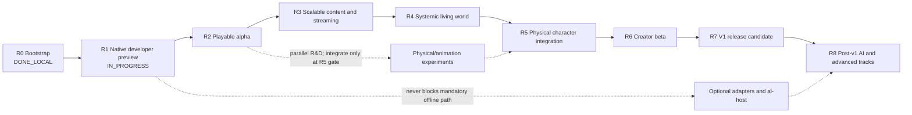

# Next Engine: долгосрочный roadmap реализации

| Поле | Значение |
|---|---|
| Статус | Living planning document, не нормативная архитектура |
| Последнее обновление | 2026-08-17 |
| Текущая точка | R3, reference-project vertical и functional R4 остаются `COMPLETE`: R4a, [R4b tiers + graph navigation + 100 NPC](development/task-state/r4b-population-navigation.md), [R4c deterministic cognition core](development/task-state/r4c-deterministic-cognition.md) и [R4d systemic Strategic Agent vertical](development/task-state/r4d-systemic-strategic-agent.md) закрыты production evidence under ADR-074. R5a physical-animation owner, [R5b capsule/world interactions](development/task-state/r5b-capsule-world-interactions.md), [R5c root-motion admission](development/task-state/r5c-root-motion-admission.md), [R5d BodySchema projection](development/task-state/r5d-body-schema-projection.md) и [R5e procedural motor/safety/recovery](development/task-state/r5e-procedural-motor-safety-recovery.md) теперь `COMPLETE`; следующий bounded WIP — R5f production base-skinning/render-rig route без active articulation или learned route. R141 остаётся `INVALID / STOP_NO_RETRY` без R142/downstream authority. `r4-100npc` exact tier-cognition evidence не закрывает B-12/Linux/R1/R7/v1 shipping. |
| Windows blocker-plan checkpoint | `WINDOWS_COMPLETE / DEFERRED_LINUX` для B-02, `COMPLETE` для Windows R2 и R3, `COMPLETE / LOCAL FUNCTIONAL` для R4 на текущем developer host, `COMPLETE / WINDOWS_ACCEPTED` для Architecture Cleanup. R3a/B-04, R3b/B-06 и R4a–R4d increments `COMPLETE`. Это не заявляет Windows/Linux pair для R4 и не закрывает R1, B-12, Linux, paired cross-target evidence или v1 shipping; bounded TRAIN-4 lineage остановлена без retry/downstream authority. |
| R2 visual checkpoint | Три Windows visual packages и свежий `r2-reference-alpha-visual-v5` прошли automated checks и ручной acceptance. `B0ShaderInterfaceV2`, separate sky/world/UI, directional light/fog/shadows, distinct silhouettes, visible/inset colliders, semantic HUD и 720p/1080p presentation сохранили прежний gameplay result. Performance остаётся `REPORT_ONLY`; B-12 открыт. |
| Горизонт | developer preview → playable alpha → systemic alpha → creator beta → v1 → post-v1 |
| Источники | Accepted SPEC/ADR, текущий workspace и локальные ProductCheck |
| World-dynamics guardrail | ADR-081 Accepted: successor stage/DAG, scheduled PhysX checkpoint epochs, exact float/identity, capacity/fault/budget closure and shadow-only neural rules apply to every post-v1 physical-world track without activating it |

## Назначение

Этот документ отвечает на три практических вопроса:

1. что реализовывать следующим;
2. в каком порядке расширять текущий узкий vertical slice;
3. какое наблюдаемое доказательство завершает каждый этап.

Roadmap не заменяет [продуктовый контракт](architecture/00-product-contract.md),
[архитектурную baseline](architecture/README.md) или профильный SPEC/ADR.
При конфликте действует порядок precedence из архитектурной baseline.
Семантическое изменение Accepted architecture по-прежнему требует отдельного
ADR; изменение приоритета или порядка реализации — нет.

Roadmap намеренно не содержит календарных обещаний. Без известного размера
команды, доступного content-production capacity и shipping hardware точные даты
создали бы ложную точность. Этапы упорядочены по продуктовым зависимостям и
имеют относительный размер. Календарный план следует строить из этого документа
после назначения владельцев и измерения скорости первых двух этапов.

## Как читать статус

| Статус | Значение |
|---|---|
| `DONE_LOCAL` | Реализация и релевантные checks проходят на developer host; это не shipping claim. |
| `DONE_LOCAL_WINDOWS` | Windows implementation/checkpoint завершён локально; Linux и cross-target claims остаются отдельными и открытыми. |
| `NEXT` | Следующий этап критического пути. |
| `PLANNED` | Нужен для v1, но зависит от более ранних этапов. |
| `PARALLEL` | Может развиваться параллельно, но имеет указанную integration gate. |
| `ACTIVE_R&D` | Единственный текущий experimental WIP; не означает production promotion, stage completion или v1 requirement. |
| `DEFERRED` | Не блокирует v1. |
| `PROPOSED` | Технология или contract ещё не входит в Accepted shipped baseline. |

Этап считается завершённым только когда одновременно выполнены все условия:

- behavior проходит production path, а не test-only shortcut;
- есть focused positive, failure и restart/save coverage;
- релевантные `fast`, `play`, `persistence-replay`, `content-package`,
  `platform` или `performance` имеют честный результат;
- schema, migration, examples, diagnostics и документация обновлены вместе;
- ни один `NOT_RUN` не интерпретирован как `PASS`;
- fallback проверен как реальное поведение, если основная возможность optional.

Наличие public type, Accepted SPEC или компилируемого adapter само по себе не
закрывает этап.

## Текущая точка

[M0–M11 implementation record](nextengine-v1-vertical-slice-implementation-plan.md)
фиксирует рабочий walking skeleton. На 2026-08-17 локально присутствуют:

- canonical commands, command ledger, fixed-stage runtime и atomic RPG
  transactions;
- direct authoring V7 → exact `ProjectLockV3` cook/`ActivatedProjectV8` и
  content-addressed publication без resolver/catalog;
- общий production coordinator для `game`, `headless` и runtime-bearing tools;
- atomic save generations, replay, application-session close/recovery;
- движение grounded capsule, R5b slopes/stairs/dynamic-push/sensor/fall-recovery
  interactions и contact lifecycle;
- R5a player/NPC physical-animation owner и R5c authored forward root-motion
  proposal, проходящий exact Runtime admission и capsule collision clipping;
- pickup/equipment, melee damage, switch, dialogue/quest/relationship transition;
- deterministic bounded four-region/64-chunk streaming;
- 100-record tiered population, 64-node graph navigation, abstract transfer,
  one production systemic cognition/activity subject, exact derived calendar
  and one authored relay-keeper `Duty → Rest` routine inside the current
  ten-owner Replay V10 save/replay closure;
- deterministic NPC affordance planner и procedural avatar projection;
- data-only mechanics, bounded Luau и Wasm Component paths;
- exact revision-bound presentation extraction и reference B0 render plan;
- neutral mesh/material/texture/profile catalog, deterministic cook/activation
  и derived B0 meshlet payloads;
- checked-in offline SPIR-V и B0 CPU visible-list/indexed-indirect path с
  deterministic fallback material;
- Windows-local keyboard/mouse ActionMap/InputContext resolver для live `game` и
  headless scenario, persisted ingress assignment и exact physics-snapshot
  `ClosestPoint` targeting, независимый от camera state;
- complete in-memory snapshots на каждой 30 Hz fixed-step boundary и typed
  integer/fixed-point third-person camera в `PresentationSnapshotV2`/B0 plan;
  renderer повторяет последний snapshot при любой cadence, а приватный Vulkan
  backend преобразует camera state в float view-projection и depth;
- simple session durability: два чередующихся snapshot slots и `CURRENT`,
  только last lifecycle request/event и двухстадийный close journal
  `Prepared → SavePublished`; durable world публикуется manual Save и
  save-on-close, Suspend не сохраняет, crash откатывается к последнему Save;
- session-bound desktop host/capability registration отклоняет stale adapter
  lifetime, а same-session authoritative restart начинает fresh presentation
  epoch с sequence `0` и camera cuts по
  [ADR-035](architecture/adr/035-bounded-live-recovery-platform-host-and-presentation-cut.md);
- Windows SDL3/ash B0 path с canonical keyboard/lifecycle events, fullscreen,
  swapchain recreation, bounded device-loss recovery и package smoke;
- current-only Performance V5 foundation с exact THOTH fingerprint,
  release-only methodology-v8 per-run preflight (`CPU/GPU <40%`, free RAM
  `>=10 GiB`), postflight integrity, explicit run boundaries и полным
  streaming/agent/render/live smoke report; representative `r2-alpha-render`
  и streaming-only `r3-multiregion-streaming` реализованы как `REPORT_ONLY`;
  representative `r5-physics-16.v1` выполняет 16 production PhysX 23-DoF
  humanoids при 240/60 Hz и 1/4/8 workers с exact root parity, accepted
  absolute budgets and exact roots. Historical V4/v7 calibration содержит 10
  runs; первый non-retried v7 hard gate прошёл absolute budgets, но дал
  relative `FAIL` на том же commit
  (8-worker frame p95 `+10.0%`, peak RAM `+8.53%`). R4a routine path входит в
  smoke: на текущем unsupported host его шесть метрик записаны как
  `REPORT_ONLY`, а outer command честно остаётся `NOT_RUN` с
  `PERF_TARGET_FINGERPRINT_UNSUPPORTED_HOST`; это не `PASS` и не закрывает
  B-12. Representative `r4-100npc` exists and records tier cognition, but a
  supported-host fresh V5 ten-run baseline and fixed three-run hard gate do
  not exist; R5 hard `PASS` is also absent;
- локальная v1 closure matrix.

Data-first reference alpha реализована и принята на Windows: automated
production flow/package smoke и свежий 20–30-minute manual acceptance от
2026-08-08 проходят. Текущий
R2 gameplay scope намеренно ограничен двумя role-selected chunks, одной combat ability, одним quest
loop и одним neutral humanoid skeleton/clip catalog; general partition, runtime
animation и reusable systemic quest conditions относятся к R3–R5.

### Реализация по подсистемам

| Область | Состояние в коде | Главный gap |
|---|---|---|
| Contracts/runtime/ledger | Реализован фундамент и current `core_r5c` eight-command/four-system registry/schedule/profile closure; R5c root-motion ingress сохраняет прежние 12 stages и проходит common archive/receipt/physical admission | Расширять только вместе с реальным gameplay use case; не строить второй runtime framework. |
| Project/application/session | Production path реализован: authoring V7 → exact `ProjectLockV3` → atomic `ActivatedProjectV8`; session использует два snapshot slots, last lifecycle record и `Prepared → SavePublished` close journal | Нужны native cross-target platform/package closure и дальнейшие real-project lifecycle cases. |
| Persistence/replay | Реализован current-only Replay V10 и ten-owner application closure с independent routine/population/activity/Agent/Memory/physical-animation ledger validation; exact root-motion command body replay-ится без нового owner/format | Migration вводится только после первого публично поддерживаемого v1 format и реального successor. |
| RPG | Частично: двенадцать aggregate payload kinds и девять операций, включая bounded commitment/atomic systemic settlement | Нет полного faction/membership, status/effect, quest-graph, reward, debt/market или divine command lifecycle. |
| Mechanics/packages | Частично: contact melee + Luau/Wasm examples | Нет общего ability phase/cost/cooldown/status lifecycle и creator-facing SDK workflow. |
| Content/cooker | Data-first `projects/reference-alpha` проходит typed V7/V8 authoring/cook/direct-lock activation; package содержит 122 canonical entries, 36 roots и 64 chunk bindings, включая exact `BodySchemaAssetV1`, neutral skeleton/clip/root curve, routine, population, navigation, cognition and activity catalogs | Нет broad animation graph/retarget content, polygon navmesh or creator workflow. |
| World/streaming | R3 partition and R4a–R4d world consumers реализованы: exact pinned generation, 4 regions/64 chunks, derived calendar, separate routine/population/activity/Agent/Memory owners, 16/32/52 cadence, 64-node graph, bounded bulk time and joint publication | Нет generic interest/eviction, physical corridor following or broad jobs/economy framework; эти gaps не входят в bounded R4 closure. |
| Jobs/resources | R3 использует private bounded workers (default 2, max 4), immutable revision-bound request/result и channel 64; generic subsystem не принят | Shared scheduler/resource contract появляется только при доказанной второй production потребности; SPEC-23 остаётся Proposed. |
| Physics | PhysX 5.9.0 является единственным production backend; upright capsule, static Box, exact B0 `ClosestPoint`, reduced articulation и fixed-humanoid scene/restore path реализованы | Не закрыты полный cutover/platform/replay matrix, general gameplay shape/query breadth и Windows/Linux Stage 0 evidence. |
| Animation/motor | Bounded R5a–R5e production path активирует shared player/NPC skeleton/clip owner, exact neutral sampling, identity retarget, presentation-only foot IK, fixed-tick root proposal, physics-validated capsule application, exact project-backed `BodySchemaV1` projections and a stateless player capsule controller bound to the action/actuator-safety roots. During Physics-owned fall it clamps horizontal intent to zero and resumes the held cardinal command after landing. Replay V10 owner arity не меняется. Отдельный deterministic 23-DoF standing/flat-command substrate и current curriculum V2 CPU environments сохраняются; R141 learned lineage остановлен. | Нет real skinning/base render-rig route, general graph/non-identity retarget/physical IK, active articulation cutover, полного `ANIM-ROOT-MOTION-P1`/general SPEC-27 route corpora, Isaac GPU correspondence и Windows/Linux performance/parity evidence. |
| Agent AI | Bounded R4c/R4d core current: one production subject uses revision-bound Epistemic/Drive views, semantic beliefs/speech, Q16 Utility/emergency, bounded GOAP, private tasks, commitment/activity/systemic settlement and separate Agent/Memory owners; 100 records produce exact four-kind tier work | Нет broad episodic/social memory, bargaining or macro-economy. SPEC-33/34 и ADR-050/053/054 остаются optional R8 research. |
| Navigation/audio | Baseline audio vertical и R4b engine-owned graph/query current: 64 chunk-bound nodes, four region tiles, deterministic Dijkstra and route-hash-bound abstract transfer | Gaps: chunked long-clip streaming payload, zone reverb fallback, polygon navmesh cooker, dynamic overlays and physical path-following adapter. |
| Player experience | Keyboard/mouse и generic controller используют одинаковые action IDs с keyboard fallback; persisted targeting, third-person camera, semantic HUD/inventory/journal/dialogue/pause flow, localization, subtitles и preferences проходят automated Windows checks. HUD получил цветовой health meter, objective и отдельный presentation-only next-action panel, который выводится из immutable RPG snapshot для accept/pickup/equip/combat/relay/return/complete; Save показывает `Saved`, а Load оставляет восстановленный world на паузе с `Loaded - press Resume`. | Worker-to-desktop regression покрывает quest accept, explicit Save, визуально различимое изменение, sequence-zero Load cut, Load confirmation, продолжение новой epoch после явного Resume и реальное authoritative WASD movement с exact загруженной input-context revision. Свежий 20–30-minute run зафиксирован как `PASS`. Accessibility profiles и capability-scoped extension panels остаются вне R2 gate. |
| Presentation/render | Exact revision-bound snapshot, typed camera, offline SPIR-V, seven-binding B0 scene и Windows recovery/package path реализованы; humanoid/blade/relay имеют разные материалы, collected pickup скрывается, defeated NPC остаётся видимым с тёмным material, relay меняет inactive/active material. Engine-owned relay-approach kit (tiled path, platform, two ruined pillars, four-rock field) добавляет читаемый маршрут и landmarks одним batched draw; отдельный reusable rock source mesh остаётся в content catalog. Relay collider точно следует видимым pillars/top beam/central switch без невидимых продолжений. Contract-preserving B0+ shader выводит flat geometry normal из world-position varying и применяет fixed sun/ambient + depth fog без смены locked position/UV ABI. Private UI adapter рисует контрастные bordered panels: HUD/action слева, inventory/journal справа, dialogue/pause по центру. | Нет authored smooth normals, real skinned rendering/VFX consumption, production art/animation polish, clean ten-run THOTH hard evidence, paired same-commit target proof и Linux hardware-GPU evidence. |
| Tooling | Repository `xtask`, Performance V5/run-level gate batches, восемь scenarios, representative R2/R3/report-only R4/R5 workloads и Windows package smoke реализованы | Нет creator-facing `next` CLI, inspectors, scenario/minimizer, fresh clean ten-run V5 THOTH baselines и stable external SDK workflow. |
| Autonomous narrative | Proposed intent only | Вернуться только с конкретным player-visible production consumer после R3. |

## Продуктовая граница v1

V1 следует оценивать по [SPEC-00](architecture/00-product-contract.md), а не по
количеству полностью реализованных архитектурных документов. Accepted SPEC
задаёт правильную границу и failure semantics, когда соответствующая
возможность реализуется; он не всегда делает всю описанную глубину блокером
первого релиза.

Для v1 обязательны:

- один устанавливаемый cooked project на Windows x86_64 и Linux x86_64;
- связанный movement → interaction → combat → dialogue → quest loop;
- `game`, deterministic `headless` и creator/runtime tools;
- save/load/replay и offline correctness;
- streamed world, generic RPG state и first-party mechanics через public
  package API;
- deterministic Strategic Agent vertical с needs, beliefs/memory, Utility +
  bounded GOAP, structured social acts, owner-validated work/trade/food outcomes
  и одинаковым offline `game`/`headless` behavior;
- bounded data-only, Luau и Wasm extension paths;
- engine-owned physics, motor и animation boundaries с процедурным fallback;
- usable player input, camera, semantic UI и минимально доступный presentation
  path;
- neutral content cook/validate/package workflow.

Не являются v1 blocker:

- LLM, ASR, TTS, external `ai-host` и SPEC-16 multimodal dialogue;
- autonomous Narrative Director и divine agency из SPEC-31;
- learned motor policy, Isaac Lab, PhysX или другой vendor physics backend;
- ray tracing, mesh shaders, HDR, advanced VFX и displayless capture;
- Gothic importer;
- full editor, multiplayer, consoles, mobile или macOS shipping.

Рекомендуемый v1 physical scope: устойчивый capsule/procedural controller,
skeletal presentation, retargeting и basic IK. Full articulation и learned
motor policy входят в v1 только если их собственный product check проходит
достаточно рано; fallback остаётся shipping-capable без них.

## Критический путь



| Этап | Статус | Размер | Product outcome |
|---|---|---:|---|
| R0. Walking skeleton | `DONE_LOCAL` | — | Узкий deterministic slice доказал end-to-end architecture. |
| R1. Native developer preview | `IN_PROGRESS` | S–M | Один exact package действительно запускается на обеих shipping targets. |
| R2. Playable alpha | `COMPLETE / WINDOWS_ACCEPTED` | L | Data-first slice, Windows package, automated checks и зафиксированный 20–30-minute acceptance проходят. Linux/R1 cross-target closure не заявляется. |
| R3. Scalable content and streaming | `COMPLETE` | XL | Private packaged vertical и bounded 4-region/64-chunk project проходят cook/load/unload/save/restart и report-only workload без hard-coded two-chunk assumptions. |
| R4. Systemic living world | `COMPLETE / LOCAL FUNCTIONAL` | XL | R4a routine, R4b population/navigation, R4c cognition and bounded R4d systemic owners pass production/failure/persistence/tier/bulk checks; B-12 and cross-target gates remain separate. |
| R5. Physical character integration | `IN_PROGRESS / R5A–R5E_COMPLETE / R&D_LINEAGE_STOPPED` | XL | R5a owner, R5b capsule interactions, R5c physics-validated root motion, R5d project-backed `BodySchema` projection and R5e stateless capsule procedural/safety/recovery route are complete. Next WIP is bounded R5f production base-skinning/render-rig route. R141 stays `INVALID / NO_RETRY` and grants no learned-route authority. |
| R6. Creator beta | `PLANNED` | L–XL | Второй проект/пакет создаётся без правки engine internals. |
| R7. V1 release candidate | `PLANNED` | L | Полный v1 scope стабилизирован и упакован для Windows/Linux. |
| R8. Post-v1 tracks | `DEFERRED` | отдельные программы | Optional AI/narrative/importer/advanced rendering не размывают v1. |

## R0 — Walking skeleton

**Статус:** `DONE_LOCAL`.

**Цель:** доказать, что архитектурные границы соединяются в один production
path.

**Доказанный результат:** M0–M11, локальные `play`, `persistence-replay`,
`content-package`, portable `platform`, `performance` и `v1-closure`.

**Открытый риск:** этот этап доказан на Apple Silicon developer host.
Windows/Linux execution не считается выполненным и перенесён в R1.

**Правило сохранения:** каждый следующий этап расширяет текущий slice
вертикально. Переписывание contracts/runtime без нового player-facing outcome
не является roadmap progress.

## R1 — Native Windows/Linux developer preview

**Статус:** `IN_PROGRESS`. Native gate harness, Windows Desktop B0 hardening и
minimal render-content implementation реализованы; релевантные Windows
`content-package`, `platform`, `performance` и clean `v1-package` проходят
локально. Native Linux target report и package на более раннем checkpoint
имеют отдельный `PASS`; paired
same-commit Windows report и compare ещё не выполнены. Exact checkpoint,
environment и coordination status ведутся в
[Linux validation backlog](development/linux-validation-backlog.md).

**Текущая execution policy:** native Windows x86_64/MSVC/Vulkan — основной
developer host и приоритет текущих work packages. Linux validation выполняется
отдельными асинхронными checkpoint-сессиями; standalone Linux `PASS` не
закрывает R1/B-01 без matching Windows target `PASS` report и успешного compare.
Отложенные Linux-only действия ведутся в
[Linux validation backlog](development/linux-validation-backlog.md) и
выполняются асинхронными checkpoint-сессиями. Их ожидание не блокирует
несвязанные Windows work packages, но соответствующие R1/v1 criteria до
фактического run остаются открытыми.

**Цель:** превратить portable local closure в честно запускаемый native
developer package.

**Основной scope:**

- стабилизировать private SDL3/ash B0 adapter на Windows x86_64 и Linux x86_64;
- закрыть window/input/focus/resize/fullscreen/surface/device-loss lifecycle;
- проверить platform normalization без влияния native timestamps на simulation;
- собрать atomic distribution с `game`, `headless`, exact cooked project и
  notices;
- запустить release `headless` и bounded interactive release `game` из
  созданного package;
- сравнить project/content/state/ledger roots между target reports.

**Критерии успеха:**

- на обеих targets проходят `host-check`, `play`, `persistence-replay`,
  `content-package`, `platform`, `performance` и `v1-closure`;
- каждый `v1-closure` сообщает `PASS` для native target текущего host и честный
  `NOT_RUN` для другого target; успешный same-commit `native-gate-compare`
  выставляет `native_gate_ready = true`;
- `v1-package` создаёт installable directory и оба release binaries запускаются
  против exact packaged lock;
- B0 scene обрабатывает real input и типовые lifecycle transitions без
  authoritative divergence;
- package не содержит machine-local paths, protected data, credentials или
  отсутствующие notices.

**Hard blockers:**

- paired native Windows/Linux `PASS` reports и package на одном exact commit;
- representative hardware-GPU Linux smoke; текущий checkpoint и pending
  actions записаны в
  [Linux validation backlog](development/linux-validation-backlog.md);
- SDL3/ash candidate должен пройти target smoke; cross-compilation недостаточно;
- любой cross-target canonical/hash mismatch;
- packaging/runtime dependency, которая не включена или не диагностируется.

**Не блокируют этап:** PhysX, Slang, RT, learned policy, `ai-host`, capture и
Gothic importer.

**Основные источники:** SPEC-04, SPEC-12, SPEC-17, SPEC-29, SPEC-30, ADR-003,
ADR-028, ADR-030.

## R2 — Playable product alpha

**Цель:** превратить технический fixture в небольшой player-facing slice,
который можно пройти без знания engine internals.

**Основной scope:**

- runtime ActionMap/InputContext service поверх существующего canonical input;
- third-person camera, interaction focus и authoritative targeting query;
- semantic HUD, inventory/equipment, dialogue, quest journal, pause/save/load
  flow;
- source locale, deterministic text IDs, pseudo-locale и readable fallback;
- keyboard/mouse и минимум один controller profile через одинаковые action IDs;
- validate и расширить реализованный minimal mesh/material/texture path для B0
  renderer до representative alpha content;
- baseline sample playback, attenuation/panning, voice limiting и subtitle
  fallback;
- один CC0/engine-owned 20–30 minute project slice с началом, конфликтом и
  завершением.

Первый Windows increment этого этапа, **Player action and camera
(`DONE_LOCAL_WINDOWS`)**, содержит общий keyboard/mouse ActionMap/InputContext
resolver для live `game` и headless scenario, persisted ingress assignment,
authoritative B0 `ClosestPoint` targeting из exact physics snapshot,
`ReplayManifestV5` query provenance на момент checkpoint и typed
integer/fixed-point third-person camera. R4a позднее заменил current replay на
V6, сохранив targeting/mapping provenance. Live loop создаёт complete in-memory
snapshot на каждой 30 Hz boundary.
Session store хранит два чередующихся current-state slots; durable world
публикуется только manual Save и save-on-close. Suspend не сохраняет, crash
теряет прогресс после последнего Save, а explicit Load из `Suspended` создаёт
fresh presentation epoch/sequence `0` и ждёт Resume. Fresh session-bound desktop
host registration отклоняет stale lifecycle/control events. Exact semantics
зафиксированы [ADR-047](architecture/adr/047-simple-application-session-and-save-on-close.md).
Локальный Windows checkpoint подтверждён `host-check`, `play`,
`persistence-replay`, `content-package`, real SDL3/Vulkan `platform` и
fresh-output `v1-package`. Generic controller использует те же action IDs, что
keyboard/mouse, а отсутствие устройства использует keyboard fallback. Поэтому
Windows-часть B-02 имеет статус `WINDOWS_COMPLETE / DEFERRED_LINUX`; это не
закрывает R1/B-01, `native_gate_ready`, shipping или Linux/native target criteria.

Data-first package `projects/reference-alpha` содержит 51 canonical records и
два chunks, versioned authoring manifest, source spans, engine-owned
geometry/materials/text/synthesized audio и CC0 humanoid skeleton/clip catalog с
source/hash/license/NOTICE. Production scripted equivalent выполняет Frontier
Relay за `32` ticks и `27` events: принимает quest через dialogue, находит и
экипирует предмет, переходит в следующую зону, завершает combat, активирует
relay, возвращается и завершает quest; restore проверяется после acceptance,
combat и relay activation. `game` и `headless` получают одинаковый authoritative
result. Skeleton/clip catalog в R2 является content prerequisite; runtime
animation остаётся R5.

R2 visual usability pass удалил production marker mesh и добавил static
low-poly humanoid, relay gate и blade с отдельными role materials. Presentation
state детерминированно выводится из authoritative RPG snapshot на каждом
publication и после Load: подобранный blade скрывается, побеждённый NPC остаётся
видимым с тёмным material, relay переключает inactive/active material. Его
collider состоит только из видимых pillars, top beam и central switch; live
traversal regression проходит вокруг gate за границу прежней невидимой стены.
Следующий инкремент ввёл exact `B0ShaderInterfaceV2`: position/UV дополняются
optional SNORM16 normals с derivative flat-normal fallback, а 208-byte frame
block содержит camera, sun, fog и stabilized shadow transform. Отдельные
sky/world/UI suites, directional sun, hemispheric ambient, world-distance fog и
renderer-owned 2048² depth shadow map с 32×32 м snapped volume, fixed bias и
3×3 PCF проходят real Windows Vulkan path. Sampled-depth format/allocation
failure выбирает stable no-shadow shader с диагностикой и не меняет gameplay.
Private semantic-UI adapter теперь имеет bordered panels и стабильный
layout: HUD слева, inventory/journal справа, dialogue/pause по центру; health и
objective визуально различимы. Save/Load дают явные подтверждения, причём Load
публикует обязательный recovery cut, затем `Loaded - press Resume` и не запускает
simulation до Resume. Catalog, live bindings, final scripted state и полный
worker save/load flow покрыты regressions; свежие `content-package`, `play`,
`persistence-replay`, native Windows `platform` и package smoke проходят.
Свежий 20–30-minute manual acceptance этого package зафиксирован как `PASS`
2026-08-08.

Следующий bounded visual increment добавил engine-owned tiling ground/path/stone/cloth/metal
textures и batched environment kit-piece: relay approach объединяет дорогу,
подиум, две разрушенные колонны и четыре low-poly скалы; reusable rock mesh
остаётся отдельной public content записью. Начальная scene содержит семь
bindings; после полного flow остаются шесть visible draws,
а legacy 10 000-cycle frame-planning gate проходит прежний absolute 30-second
budget. Отдельный HUD action panel read-only выводит из immutable RPG snapshot
следующий шаг для всех семи стадий acceptance; projection regression покрывает
accept, pickup, equip, combat, relay activation, return и completion. Новый
Четыре крупные скалы получили inset static Box proxies внутри видимых силуэтов;
центральный маршрут и обход relay покрыты live traversal regressions. Player,
enemy и quest giver используют три разных static low-poly silhouette meshes;
skinning и animation path по-прежнему остаются R5. Focus ring и quest marker
публикуются из immutable snapshots с reserved ordinals и не отбрасывают тень;
combat target-health, pickup/relay/defeated states и keyboard/controller
affordances остаются presentation-only. 12×16 alpha font и private overlay
покрыты 720p/1080p HUD/inventory/dialogue/pause/save/load/pseudo-locale goldens.
`visual-smoke` создаёт шесть displayless BMP и manifest с project/snapshot/frame
plan/camera/shader hashes как human evidence, не correctness oracle. Gameplay
contracts, authoritative state и R5 animation path не менялись.

Representative `r2-alpha-render` реализует exploration, combat и UI/dialogue
windows для 1080p и 720p fallback: `3 600` warm-up и `21 600` measured frames,
`50 400` Vulkan queries, distinct snapshots, authoritative roots и V3 resource
evidence. Текущий release report проходит absolute budgets, но сохраняет
`REPORT_ONLY`: тот run имел dirty worktree и не является baseline input.
Текущий THOTH preflight технически готов по ADR-061/062, но это не превращает
старый R2 report в hard evidence и не закрывает B-12.

Первый фактический ручной acceptance дошёл до принятия quest и выявил два дефекта
одного checkpoint path. Сначала runtime tick публиковался до fallible activation
нового input context; activation теперь staged внутри `PreparedRuntimeTick` и
публикуется атомарно с runtime generation. Повторный run на исправленном binary
локализовал оставшийся failure: валидный semantic UI record `Subtitle = 8`
кодировался, но presentation recovery decoder принимал только роли `0..7`.
Decoder теперь покрывает `Subtitle`; отдельный byte-exact codec test, production
quest-accept regression с полным следующим checkpoint и exact manual failed-state
tail от tick 390 проходят. Следующие ручные попытки выявили, что pause-menu Save
не подтверждал публикацию, Load выбирал текущий session checkpoint, а desktop
ошибочно применял tick monotonicity между epoch и мог не увидеть обязательный
sequence-zero recovery cut из-за latest-wins publication. Production worker test
теперь принимает quest реальными клавишами, пересекает durable checkpoint, выполняет
Save → movement → Load, передаёт exact recovery cut/следующий кадр в desktop
transition validator и после явного Resume доказывает реальное WASD movement через exact controller binding из save; `play` проверяет факты всех трёх restored stages. Полный свежий 20–30-minute run на зафиксированном package прошёл 2026-08-08, поэтому R2 и B-03 закрыты для Windows. Текущий scripted flow проверяет требуемый порядок, но R2
намеренно не вводит reusable quest conditions: ручной игрок может повторно
взаимодействовать с quest giver до relay activation. Systemic condition
enforcement относится к representative R4 mechanics scope и явно не
выдаётся за выполненный R2 capability.

**Критерии успеха:**

- новый пользователь может запустить package, пройти movement → pickup/equip →
  combat → dialogue → quest → save/load loop без debug commands;
- те же semantic actions проходят через `game` и headless scenario и дают
  одинаковый authoritative result;
- UI/camera/audio/presentation faults не меняют gameplay hash;
- save/load работает до и после каждого крупного шага slice;
- missing device/locale/audio output использует declared fallback;
- `play`, `persistence-replay`, `content-package` и native `platform` проходят
  для alpha project.

**Открытые ограничения вне Windows R2 closure:** R1 native cross-target package
closure и Linux остаются вне текущего Windows-only плана; B-12 требует clean
ten-run performance evidence.

Automated production path, lawful content/provenance, отсутствие hidden
UI/camera mutation и ручной representative loop подтверждены. Архитектурный
cleanup, R3 и functional R4a–R4d завершены; R5 minimal physical/animation
production integration is the next WIP slot.

**Scope guard:** editor, advanced renderer, photoreal assets и procedural world
generation не входят в этот этап.

**Основные источники:** SPEC-04, SPEC-08, SPEC-12, SPEC-18, SPEC-24, SPEC-29,
SPEC-30, ADR-019, ADR-034, ADR-035.

## R3 — Scalable content, jobs and streaming

**Цель:** убрать fixture-specific streaming assumptions через один
consumer-driven production vertical, затем расширить partition ровно настолько,
насколько требует representative multi-region project.

### R3a — one streaming vertical

**Статус:** `COMPLETE` (2026-08-08). B-04 закрыт после focused fault/order
matrix и `host-check`, `play`, `persistence-replay`, `content-package`, release
smoke. Этот private boundary без изменений переиспользован R3b.

Единственный scope R3a:

```text
chunk fetch → decode → validate → canonical commit
```

Один реальный packaged chunk проходит production Assets/World/Runtime path.
Request/result immutable и revision-bound; staging private; schema/hash/bounds/
revision проверяются до одного canonical fixed-stage commit. Completion order,
worker count, I/O timing и cache warmth не меняют committed root. Fault
сохраняет previous active generation.

Generic scheduler, cancellation tree, pins/leases, global eviction framework,
universal resource protocol и публичная task taxonomy заранее не проектируются.
Reusable primitive появляется только если его требует этот consumer; public
contract — только после второго production consumer.

### R3b — bounded general partition

**Статус:** `COMPLETE` (2026-08-09). B-06 закрыт. Reference project расширен
ровно до 4 regions/64 chunks. Cooker, dependency validation, load/unload и
Save/Load/restart освобождены от two-chunk/reference-only assumptions. Rust-only
topology выбирает initial/frontier по exact roles и строит canonical full route;
wire formats и empty initial-placement binding не изменены.

Alpha format migrations в R3 не входят. До объявления первого публично
поддерживаемого v1 format старые authoring/packages/saves/replays остаются
typed unsupported. Первый migration project появляется только при реальном
successor публичного v1 contract.

**Критерии успеха:**

- R3a chunk проходит fetch/decode/validate/commit через production path, а
  corrupt/stale/oversized и completion-order permutations сохраняют или дают
  один declared committed world root;
- R3b project с 4 regions/64 chunks cooks, loads, streams, unloads, saves и
  restarts без hard-coded two-chunk IDs;
- mandatory chunk work не теряется, а второй переход во время `Requested`
  получает stable busy rejection; optional work в R3 не добавлен;
- `content-package`, `persistence-replay`, focused streaming tests и
  affected `performance` scenario проходят в declared resource profile;
- R2 gameplay result и command-ledger roots сохраняются.

**Completion evidence:** 4 regions, 64 chunks, 76 neutral records и 113
packaged entries; worker counts 1/2/4, cold/warm и route permutations сходятся;
restart из `Requested` совпадает с uninterrupted root. R2 baseline остаётся 32
ticks / 27 events / 13 RPG events / revision 40 с exact archive, identity-index
и ledger roots. Smoke сохраняет прежний scenario hash, отдельный
`r3-multiregion-streaming` имеет только `streaming_world` и остаётся
`REPORT_ONLY`.

**Основные источники:** SPEC-03, SPEC-17, SPEC-21, SPEC-22, SPEC-24, SPEC-25,
ADR-026, ADR-051. SPEC-23 остаётся Proposed future generic scheduler/resource
intent и не является принятым R3 contract.

## R4 — Systemic living world

**Статус:** `COMPLETE / LOCAL FUNCTIONAL`. R4a–R4d завершены и приняты;
bounded systemic Strategic Agent vertical is current under ADR-074. B-12 and
paired Windows/Linux evidence remain open release/performance gates. Bounded
R5 training lineage stays stopped at R141 without retry/downstream authority.

**Цель:** перейти от scripted encounter к offline world, где NPC и world state
продолжают согласованно жить вне непосредственного контакта с игроком.

**Основной scope:**

- exact derived World Services calendar/routine owner, затем отдельный
  stepped/bounded bulk-time consumer;
- population records, `Dormant/Abstract/Simulated/Active` tiers, schedules,
  wake/defer rules и region transfers;
- deterministic graph navigation baseline, tiled cook/streaming, route validity
  и physical traversal handoff;
- perception facts, epistemic beliefs, bounded semantic memory and
  deterministic knowledge seeding; episodic breadth remains future;
- derived needs/drives, candidate goals, fixed-point Utility,
  goal inertia and emergency interruption/resume;
- bounded GOAP over engine-owned semantic affordances, private task executive,
  explicit failure/replanning and Decision Trace;
- structured NPC-to-NPC speech acts, trust/confidence, minimal commitments and
  owner-validated work/currency/trade/food outcomes without LLM;
- bounded commitment plus existing relationship/inventory operations;
  broader faction/membership and reusable quest/economy breadth remains future;
- integrated 100-NPC cadence/deferral/no-starvation/no-fabrication workload;
  hard supported-host budgets remain B-12;
- deterministic acoustic gameplay facts; hardware audio remains presentation.

**Последовательность R4 product increments (внутренний WIP limit = 1):**

1. **R4a — derived calendar + authored relay-keeper routine (`COMPLETE`,
   2026-08-15):** один
   существующий NPC в active relay-station chunk проходит одну authored
   `Duty → Rest` boundary. Exact integer-rational projection от
   `SimulationTick` создаёт internal World Services command/event; committed
   activity разрешает или блокирует exact
   `nextengine.reference-alpha.interaction.accept-frontier-relay` path и
   сохраняется/replay-ится в отдельном routine segment; успешная Duty-ветка
   видна как `Frontier Relay - Active` в journal. Единственный новый catalog
   asset меняет reference authoring roots `27 → 28` и content entries
   `113 → 114`. Promotion также материализует
   канонические SPEC-21 registry/schedule bytes и проводит их через один exact
   runtime profile в неизменённый `ProjectLockV3`, без отдельного opaque hash
   constant. SPEC-20/ADR-052 приняты одновременно с production consumer после
   `fast`, `play`, `persistence-replay`, `content-package`, `host-check` и
   conditional smoke/report checks. Navigation, tiers, bulk time, transfer,
   Strategic Agent cognition и `r4-100npc` не входят в R4a; smoke остаётся
   `REPORT_ONLY`, B-12 открыт.
2. **R4b — tiers + graph navigation + 100 NPC (`COMPLETE`, 2026-08-16):**
   exact 100-record population uses 16/32/52 cadence and a separate owner; one
   courier preserves identity through seven tier/abstract-transfer revisions
   over the 64-node engine graph. V4/V5 project content has 30 roots and 116
   entries; Save/Replay V7 carries six owners and fails closed on missing
   population ledger evidence. `r4-100npc.v1` runs 1,000 warm-up + 10,000
   measured ticks report-only with exact counts/roots and no starvation. The
   unsupported-host outer verdict is `NOT_RUN`; no B-12 claim follows.
3. **R4c — deterministic cognition core (`COMPLETE`, 2026-08-16):** one
   existing population subject consumes revision-bound Epistemic/Drive views,
   semantic beliefs/retrieval, fixed-point Utility/inertia/emergency and
   bounded GOAP. Its private task executive emits typed intents only; Decision
   Trace remains reconstructible while separate Agent/Memory owners publish at
   stage 9 and persisted in the then-eight-owner application root under ADR-073.
4. **R4d — systemic Strategic Agent vertical (`COMPLETE`, 2026-08-16):** NPC без еды и денег
   получает сведения через structured speech act, принимает реальную работу,
   проходит navigation/activity, получает committed currency, покупает food и
   ест; threat interrupt, resume/replan, stale/no-route/no-job/no-money branches,
   save/restart/replay и 100-NPC tier behavior используют production owners.
   Authoring V6 / activation V7 / Replay V9 add one activity content/owner
   segment and preserve nine-owner atomic publication.

**R4a completion evidence (historical boundary):** `play` завершён на 32 ticks
/ 28 events / 13 RPG events / revision 41; `persistence-replay` — 19 ticks / 2
generations / 8 RPG events; `content-package` — 28 authoring roots, 114 entries
и 64 chunks.
Workspace format/check/clippy, focused failure/rollback coverage,
`boundary-scan` и `host-check` проходят. Performance smoke обработал 900 ticks
и 901 command с stable live root; все шесть метрик `REPORT_ONLY`, а outer
result на текущем host — `NOT_RUN / PERF_TARGET_FINGERPRINT_UNSUPPORTED_HOST`.
Этот результат намеренно не трактуется как hard performance `PASS`.

**R4b completion evidence:** current reference `play` has 32 ticks / 35 events
/ 13 RPG events and the courier ends revision 7 `Dormant` at frontier.
Content closure is 30 roots / 116 entries / 64 chunks. Replay V7 and save/load
preserve six exact descriptors and reject a population snapshot without its
receipt. The full report-only workload measured active/near/background due
counts `53,335 / 21,339 / 8,670`, `83,344` queries, maximum queue depth `16`
and zero deferred/dropped/starved work. Stable due/population/application/
ledger roots are recorded in the report. The unsupported host measured
navigation p95/p99 `4,305/4,875 us` and joint tick p95/p99
`12,646/13,249 us`, above ADR-016 targets, so status remains `NOT_RUN` and
timing is not promotion evidence.

**R4c completion evidence:** then-current authoring V5 / activation V6 added one
cognition catalog for a total of 31 roots / 117 entries / 64 chunks. The
32-tick production `play` commits 46 events / 13 RPG events, eleven paired
Agent/Memory revisions and eleven exact Decision Traces; focused production
health `100 → 20 → 100` yields ordinary selection at tick 1, emergency
interrupt at tick 4 and exact resume at tick 7 with owner revision 3 and no
suspended goal. Replay V8/save restore all eight descriptors and reject a
missing cognition owner or ledger receipt; `persistence-replay` passes at 19
ticks / 2 generations / 8 RPG events with state root
`7fe04abc4607668d1ea86a6caaf1ca85956462617b54760dcd34ca8a6ae3e00f`.
Format, strict clippy, full workspace/host, boundary, play, content and replay
checks pass. Those values remain the historical R4c promotion checkpoint;
ADR-074 advances current formats and evidence below.

**R4d completion evidence:** current-only authoring V6 / activation V7 adds
the activity catalog for 32 roots / 118 entries / 64 chunks. The 32-tick
production `play` commits 52 events / 23 RPG events, five structured speech
acts, three activity revisions and four paired Agent/Memory revisions with
Decision Traces at ticks 1, 4, 5 and 6. `persistence-replay` passes at 19 ticks
/ 2 generations / 18 RPG events and exact-matches all nine descriptors,
application root and ledger root; V8 rejects before projection. Focused tests
cover stale/no-route/no-job/no-money and atomic rollback, plus `1..=4096`
stepped/bulk boundary equivalence. The 100-NPC workload reproduces due counts
`53,335 / 21,339 / 8,670`, `83,344` navigation and cognition work items, queue
depth `16` and zero deferred/dropped/starved/fabricated outcomes. Its local
release result remains `NOT_RUN(PERF_TARGET_FINGERPRINT_UNSUPPORTED_HOST)`;
navigation p95/p99 `4,292/4,870 us` and integrated p95/p99
`15,618/16,300 us` exceed report rows, while cognition dispatch
`759/838 us` is within its row. None of this is a B-12 PASS.

Advanced bargaining, taxes, crime, faction politics, coalitions and long-run
macro-economy остаются future breadth и не входят в R4 exit criteria.

R4d closes bounded B-07 and the functional R4 scope. B-12 remains an open
performance/release gate, and B-13 is an optional R8 gap that does not block
R4/v1.

**Критерии успеха:**

- multi-region scenario с 100 NPC воспроизводит exact schedule/tier/command/
  event/final roots across repeats, save/restart and worker permutations;
- NPC проходит navigation → interaction/combat → consequence только через
  AgentIntent/WorldCommand/Mechanics paths;
- unsupported abstract outcome upgrades or defers and никогда не фабрикует
  success;
- stepped и bulk world time сходятся на одинаковых boundaries;
- commitment, inventory и relationship consequences переживают save/load;
  population identity/location/tier остаются exact across unload/restart;
- due AI/navigation/tier-cognition work has exact counters/roots and honest
  report-only timing; supported-host hard thresholds remain B-12 rather than a
  functional R4 gate;
- mandatory gameplay остаётся корректным без network и `ai-host`;
- unknown authoritative fact не влияет на candidate/plan до normal
  perception/memory update, а owner rejection не раскрывает hidden truth;
- fixed seed, owner revisions and project profile дают exact goal, GOAP plan,
  task transitions, command/event and state roots в `game`/`headless`,
  save/restart/replay locally; paired Windows/Linux parity remains B-01/R7;
- emergency детерминированно прерывает цель и приводит к exact resume/replan;
  missing/stale affordance и route failure дают typed safe fallback без partial
  mutation;
- NPC-to-NPC `Ask/Inform/Offer/Accept` работает без LLM, а commitment/trade
  возникает только после RPG commit;
- LLM, ASR, TTS и audio-understanding остаются optional: authored speech/goal
  candidates and text fallback закрывают R4 без `ai-host`.

**Закрытые R4 blockers:**

- owner-safe RPG operation set for the selected systemic scenario is current;
- bounded bulk-time and exact tier-cognition cadence/no-fabrication evidence pass;
- production work/currency/trade/food, structured social acts and typed
  owner-validated failure branches pass.

**Не блокируют этап:** learned strategic/tactical policies, training data
plane, GPU evaluator, LLM/ASR/TTS/audio-understanding, remote provider и
external `ai-host`. Learned work относится к optional R8; model-mediated
speech может только parse/render bounded semantics, а deterministic authored
behavior/text fallback обязателен.

**Основные источники:** SPEC-06, SPEC-08, SPEC-09, SPEC-12, SPEC-13, SPEC-15,
SPEC-19, SPEC-20, SPEC-21, SPEC-25, SPEC-32, ADR-016, ADR-020, ADR-021,
ADR-022, ADR-026, ADR-030, ADR-046, ADR-051, ADR-052, ADR-056, ADR-072, ADR-073,
ADR-074. Optional R8
sources: SPEC-33, SPEC-34, ADR-050, ADR-053, ADR-054.

## R5 — Physical character, animation and motor integration

**Статус:** `IN_PROGRESS / R5A_COMPLETE / R5B_COMPLETE / R5C_COMPLETE / R5D_COMPLETE / R5E_COMPLETE / NEXT_R5F_BASE_SKINNING_ROUTE`;
`R&D_LINEAGE_STOPPED`. R141 завершился `INVALID / STOP_NO_RETRY` и не
возобновляется. Bounded R5a package принят: один capsule-driven player/NPC
animation owner выполняет exact neutral sampling/identity retarget,
presentation-only basic IK, bind-pose fallback и exact save/load/Replay V10
continuation как десятый owner. Bounded R5b package принят: один production
capsule/world fixture проходит quantized slopes, stairs, dynamic push, sensors
и fall/recovery с exact mid-push reconstruction. Bounded R5c package принят:
authored forward root curve выпускает revision-bound `RootMotionIntentV1`,
который проходит current command registry/capability/source/body/tick checks,
понижается в существующий capsule locomotion intent и только затем применяется,
ограничивается collision или отвергается Physics. Animation не получает
transform authority. Bounded R5d package принят: authoring V7 публикует один
exact frozen `BodySchemaV1` root, production bootstrap компилирует neutral
`BodyInstanceProjectionV1` для player и NPC и получает exact physics,
observation/action и actuator-safety roots. Общие schema/tensor/safety roots
совпадают, subject/instance/physics roots различаются; mismatch schema/profile,
dependency или root отклоняет весь candidate. Compiled projection остаётся
reconstructible witness для shared physical-animation binding: активный
gameplay transform по-прежнему принадлежит capsule Physics, а
`PhysicalAnimationSnapshotV1`, physics step/result schemas и ten-owner Replay
V10 остаются без successor. Bounded R5e package принят: immutable/stateless
`CapsuleProceduralMotorControllerV1` recompiles и exact-compares player
projection, binds action-layout/actuator-safety/capsule-profile roots, rejects
non-cardinal or invalid body candidates and removes horizontal intent while
committed Physics vertical velocity is non-zero. Physics alone performs
fall/landing; save/load during recovery reproduces the same decision from the
existing checkpoint, then held movement resumes on stable landing. No command,
physics, PolicyState or Replay schema changes. Полный 10 000-cycle
`ANIM-ROOT-MOTION-P1`, general `MOTOR-SAFETY/STATE/ROUTE-P1`, active
articulation cutover, real skinning и остальной R5 scope не закрыты. Следующий
bounded cut — R5f production base-skinning/render-rig route; any learned route
still requires its own future gates.
Решения и evidence R5a записаны в
[R5a task state](development/task-state/r5a-physical-animation-owner.md).
Принятая граница, решения и evidence R5b записаны в
[R5b task state](development/task-state/r5b-capsule-world-interactions.md).
Контрактная граница и evidence R5c записаны в
[R5c task state](development/task-state/r5c-root-motion-admission.md).
Project/compiler граница и evidence R5d записаны в
[R5d task state](development/task-state/r5d-body-schema-projection.md).
Procedural/safety/recovery граница и evidence R5e записаны в
[R5e task state](development/task-state/r5e-procedural-motor-safety-recovery.md).

**Цель:** сделать физическое воплощение персонажа частью production gameplay,
не пропуская vendor types или model state через engine-owned authority.

**Обязательный v1 scope:**

- расширить reference physics до нужных gameplay shapes, layers, materials,
  bounded queries, sensors и dynamic/kinematic interactions;
- устойчивый capsule locomotion profile: slopes, stairs, push, fall/recovery;
- neutral skeleton/clip/graph schemas, retargeting и basic IK;
- one authored skinned humanoid surface profile with exact body/animation-to-
  render-rig mapping and a complete base-skinning fallback; load-aware muscle,
  wound and neural deformation are not required for this baseline;
- root motion остаётся intent и проходит physical validation;
- consumer-backed `BodySchema`/`BodyInstanceProjection` deterministically
  компилируются в physics descriptors, tensor layouts и actuator/safety limits
  без второго mutable owner;
- deterministic procedural motor/safety/recovery route;
- physical and animation state save/load/replay;
- один humanoid physical archetype, используемый player и NPC через public
  contracts.

**Accepted parallel substrate, но ещё не Stage 0 completion:** PhysX 5.9.0 —
единственный production backend по ADR-058. Fixed 23-DoF humanoid, fixed
PD/safety, 240/60 schedule, bounded restore and `r5-physics-16.v1` уже
реализованы. На clean commit
`f3226580432103666550dea952cdb67803c3d96e` ровно десять valid release runs
опубликовали historical compatible V4/v7 baseline и один exact root. Первый и
единственный v7 hard-gate run прошёл все ADR-062 absolute budgets, но relative
policy дала
`FAIL`: 8-worker frame p95 `2.328 → 2.561 ms` (`+10.0%`), 1-worker p95
`13.712 → 15.721 ms` (`+14.65%`) и peak working set
`214,884,352 → 233,234,432 bytes` (`+8.53%`). Повторного run не было. Анализ
выявил, что v7 bootstrap ошибочно считал correlated frames independent.
ADR-063 и Performance V5/v8 исправляют evidence unit: baseline хранит 10
independent runs, hard gate является fixed three-run batch, relative bootstrap
работает по whole-run p95. Fresh v8 calibration/gate ещё не запускались.
Hard `PASS` и Isaac correspondence остаются открытыми. Linux platform/replay
matrix явно вынесена за scope текущего locomotion package и остаётся отдельной
Stage 0/shipping обязанностью. Это не закрывает R5 или Stage 0.

**Canonical flat-command environment checkpoint (2026-08-10):** ADR-064
принял bounded consumer `nextengine.motor.env.humanoid-flat-command.v1` без
promotion learned Motor MVP. Engine-owned CPU PhysX path теперь формирует exact
start/stop, translation, strafe/diagonal и yaw command schedule, root-local
84-value observation, ten-component Q16 reward, separate termination/truncation,
independent partial reset и byte-exact checkpoint continuation. `motor-lab` v2,
Python raw-int client, внешний NPZ v2 recorder и Isaac descriptor/mirror v2
реализованы. Локально прошли `host-check`, `play`, PhysX
`persistence-replay`, Windows `platform`, native BODY/PHYS/MOTOR suites и
native `MODEL-DATAPLANE-P1`; Rust/Python mirror golden тоже прошёл. Single dirty
native `r5-physics-16` report сохранил exact worker root и прошёл absolute
budgets, но остался `REPORT_ONLY`; это не baseline и не hard gate. Isaac
Lab/Sim и GPU correspondence отсутствовали (`NOT_RUN`). Linux execution и
cross-target evidence имеют статус `OUT_OF_SCOPE` для этой поставки; Linux
claims не делаются. Подробная матрица evidence и remaining non-Linux work находится в
[locomotion environment evidence](development/locomotion-environment-evidence-2026-08-10.md).
PPO, policy quality, export/runtime evaluator, motion imitation, terrain,
push/recovery и readiness claim остаются вне этого checkpoint.

**Current humanoid movement training focus (2026-08-14):** работа следует
[TRAIN-0…TRAIN-9 plan](plans/2026-08-12-humanoid-motor-training-rebuild.md).
Ближайшая последовательность ограничена так:

1. standing/flat-command V1 BodySchema and manifest identities сохранены,
   curriculum reward/translator hashes and exact mirror goldens закрыты;
2. TRAIN-0 исключает старую pure-PPO artifact line из active
   selection/resume, сохраняя bounded historical evidence;
3. TRAIN-1 задаёт новую engine-owned biomechanics specification and distinct
   BodySchema/environment generation;
4. TRAIN-2/3 доказывают articulation, contacts, safety and terminal semantics
   без ML;
5. TRAIN-4 corpus/retarget проходит не только kinematic/reset checks, но и
   exhaustive optimizer-free full-horizon dynamic-reference-feasibility gate;
6. successive V3/V4 and stance-chain remediation lineages этот gate
   провалили. Последний corpus V18 проходит `27/27` local validation и
   `12815/12815` native poses; exhaustive R14 уменьшил raw failed cases
   `380 -> 204` относительно R13, но сохранил `121` hard-ROM, `67`
   hard-impact и `40` совпадающих ankle-roll joint-safety/velocity cases;
   поэтому все TRAIN-5 checkpoints rejected, а WIP остаётся в TRAIN-4;
7. только после нового TRAIN-4 Advance допускаются reference tracking, command
   locomotion, recovery and portable export; optional TRAIN-8 либо проходит
   retention gate, либо заранее skipped в пользу TRAIN-7 candidate.

**TRAIN-4 causal research checkpoint (`COMPLETE / DECISION_RECORDED /
OPTIMIZER_FREE`, 2026-08-14):** полный
[decision report](development/humanoid-train4-causal-research-2026-08-14.md)
зафиксировал code/event audit, primary-source review и три exact-schedule
counterfactual reports. Во всех отчётах zero-residual control воспроизвёл
R14 `12518/12518` case outcomes без расхождений. Target lead `1/4/6`,
velocity feed-forward и zero-joint-reset-velocity не закрыли failure и
регрессировали passing controls; они отклонены как primary remediation.
Root-link/CoM velocity mismatch подтверждён в коде, но root-link writer в
изоляции ухудшил `204 -> 220` failed cases. Zero/root/contact-projected
velocity interventions доказали causal coupling reset velocity с ROM/impact,
но переносили risk между категориями и поэтому не являются допустимыми fixes.

Complete R27 [prototype decision](development/humanoid-train4-v19-prototype-research-2026-08-14.md)
отклоняет root-only contact projector: fresh scene имеет `3/17`, а indexed
partial reset `4/17` failed cases. Восьми cases недостаточно frozen reset
impulse bound, `cmu16@415` расходится по outcome, поэтому running-scene indexed
reset доказанно неэквивалентен. ADR-070 не меняется: fresh scene остаётся
acceptance authority, partial reset — `ReportOnly` diagnostic и не optimizer
input. Hard thresholds не менялись, formal visual review остаётся pending,
optimizer/training не запускались.

**TRAIN-4 bounded contact research (`BOUNDED_PASS / CLIP_GLOBAL_CURRENT /
OPTIMIZER_FREE`, 2026-08-14):** V5 закрыл post-smoothing boundary offline,
но R39 fresh all-17 обнаружил delayed-landing impact в `cmu16@249`. Bilateral
A/B доказал, что `5 mm` clearance без active support превращает ранний мягкий
контакт в поздний удар. V6 разрешил clearance только от same-frame support и
закрыл `@249`, но all-17 R45 выявил `297 µrad` hard-ROM excess в `@415` от
одного микрорadian reference edit. V7 добавил ограниченный `1 µm`
quantization deadband над неизменным collider floor `-2 µm`, побайтово
сохранил safe V1 controls и прошёл R47 offline `17/17` и R49 fresh `17/17`:
required safety `0`, control regressions `0`, optimizer/training `0`.

[Support-authorization research](development/humanoid-train4-support-authorization-research-2026-08-14.md)
фиксирует explicit R49 decision `PERMIT_CLIP_GLOBAL_PROTOTYPE_ONLY`.
[Contact-boundary research](development/humanoid-train4-contact-boundary-research-2026-08-14.md)
по-прежнему блокирует extrapolation: window solves расходятся до `61997 µm`
root и `60755 µrad` joint, а прежний 801-frame `cmu16` solve не проходит
complete-clip bounds. R57
[clip-global research](development/humanoid-train4-clip-global-research-2026-08-14.md)
закрыл эту domain ambiguity: каждый selected clip решён ровно один раз,
exact slices проходят `17/17`, а 30 overlap pairs имеют ноль расхождений.
Однако V7 complete clips проходят `0/3`, selected slices — `16/17`; R56
также оставляет 27 swing-collider deficits после 30 alternating passes.
Current increment поэтому строит единый coupled trajectory solve, начиная с
полного `cmu05`. Full 27-clip V19, visual/exhaustive gates, TRAIN-4 Advance и
PPO остаются запрещены.

**TRAIN-4 coupled/native trajectory research (`R123_INVALID / R123-RC1_COMPLETE /
R125_COMPLETE / R126_PASS / R127_INVALID / R127-RC1_COMPLETE /
R128_COMPLETE / R129_PASS / R130_INVALID / R130-RC1_COMPLETE /
R131_COMPLETE / R132_PASS / R133_PASS / R134_COMPLETE / R135_PASS /
R136_VALID_INFEASIBLE / R137_COMPLETE / R138_PASS / R139_COMPLETE /
R140_PASS / R141_INVALID / STOP_NO_RETRY`, 2026-08-15):**
[coupled-solver report](development/humanoid-train4-coupled-trajectory-research-2026-08-14.md)
фиксирует R58–R72. Weighted Gauss-Newton, hard root/joint post-projections,
active-corridor penalties and line-search reduction were rejected because
they exchange contact, collider and velocity violations or stagnate. R68
localized the remaining gap to quantization reserve. R69 passed complete
`cmu05` simultaneously (`4900 µm` residual, `1978/980` finite,
`1968/996` analytic, collider `+30 µm`, joint `2500 bp`, root
`199800 µm/s`) with zero dropped points. R70/R71 removed the hidden R61
semantic precondition: the same constraints start at the immutable V18 clip
and reach PASS after two further relinearizations beyond the eight-iteration
discriminator. R72 then reproduced direct-source `cmu05` in one invocation,
stopping on PASS at iteration ten. Its emitted-integer audit remains PASS
(`4901 µm` residual, `981 µm` finite normal, collider `0 µm`), while proving
that the production status must be recomputed from quantized root/joint FK.
Repository V8 binds at most twelve iterations, the exact hybrid stencil,
stricter internal margins and NumPy/SciPy/OSQP versions as a private
preprocessing adapter. Clean R73 then passed complete `cmu05` at iteration ten
and `cmu16` at iteration five, but the raw-mask `cmu139` made a `231006 µm`
first root correction and its second QP became primal infeasible. This rejects
V8 as an all-clip solution; it is not TRAIN-4 Advance.
Production review additionally found that R57 had removed 11 initially
inferred `cmu139` active points, including frames 628–629 in the selected
discriminator interval. V8 closes that loophole by freezing every source mode
before solving and permitting zero point deletions; all-clip evidence is
therefore intentionally stricter than the R69 `cmu05` proof.

R74 rejects point-entry stencil semantics as a sufficient fix. R75/R76 prove
that a bounded applied step removes false infeasibility, but exact collider and
contact violations alternate between successive active sets. Primary-source
review of TrajOpt, SCvx, CRISP, SQP-filter methods and contact trust regions
identifies the missing contract as globalization: trust bounds belong inside
the QP, artificial infeasibility needs iteration-only restoration variables,
and a candidate must be accepted from the same actual/model violation
functional. R77/R78 confirm that exact rejection detects bad nonlinear steps,
but reject dense category-elastic encodings after OSQP iteration-limit
failures. R79 rejects mixing a per-row L1 model with category-max exact merit.
R80 exact max/sum backtracking eliminates oscillation and lowers worst/total
normalized violation `6.0602/18.0222 -> 2.4908/9.5412`, but reaches factor
`0.0625`; rejected full steps lower total violation further while temporarily
raising the worst component. R81 confirms the diagnosis but rejects the
worst/total filter identity: it accepts the
useful R80-rejected third full step, then trades worst violation
`3.7554 -> 5.9160` for total `9.5286 -> 8.8038`. The interrupted interactive
run emitted no report/candidate and is non-promotable. R82 routed the expected
third full step into exact-row correction, but its hard `58488`-row SOC became
`primal infeasible` after `16925` iterations before exact correction audit.
R83 then added only iteration-local max-normalized nonlinear restoration
slack while keeping linear/trust rows and the final exact-zero gate unchanged.
It brackets model feasibility at `0.235364..0.470727`, but a root-saturated
correction predicted at collider violation `0.4707` measures `8.8592` under
integer FK and is rejected/restored. R84 then tested the trial-point Jacobian
with no slack or limit change; that hard correction is also `primal infeasible`
after `66000` iterations. R85 directly composes trial geometry with the
unchanged sparse phase-I. Its trial model balances near slack `0.235364`, but
integer FK still raises collider violation `3.1438 -> 6.6700`; exact audit
rejects/restores it. R86 then reproduces that direction and finds
exact-improving/model-consistent scales `0.125/0.25` (ratios `1.042/0.695`)
before scale `0.5` reverses progress (ratio `-0.390`). Error localizes to the
right-foot collider around source frame `1388`. R87 now re-solves the
trial-point phase-I inside `10000 µm` root-component / `25000 µrad`
joint-component trust; it does not scale or admit the R86 direction.
R87 brackets feasible model slack at `0.941454..1.176818`, then improves exact
merit `3.3690/12.7778 -> 2.4324/5.9482` with actual/predicted ratio `0.511`.
The result remains non-admissible and exact `FAIL`; R88 performs one same-radius
relinearization at the emitted integer state before any broader mechanism.
R88 lowers total/contact but regresses exact worst `2.4324 -> 2.9816`; its
ratio `-0.327` rejects the step and retains R87. R89 contracts trust by half to
`5000 µm / 12500 µrad` and re-solves at R87 rather than scaling or continuing
from the rejected state.
R89 restores positive agreement (`0.517`) and improves exact merit to
`1.7226/4.8639`. R90 executes the capped six-attempt contract, accepts two
steps, and reaches exact `1.1100/4.3599`, but the final same-minimum-radius
step is rejected at ratio `-1.832`. Collider model error changes from `1.6 µm`
on the accepted fifth step to `992 µm` on the sixth, again at the right foot.
R91 then reproduces the scalar model within `9.1e-13 µm` and finds `85`
baseline-to-exact box-feature switches, `84` on the feet. Stable vertex rows
preserve exact box geometry within `2.3e-10 µm` while lowering maximum model
error `992.020 -> 3.874 µm`; all predeclared discriminators pass. R92 therefore
expands only the two contact-role foot boxes from one to eight rows, adding
`14` rows/frame rather than expanding every body box. Exact all-collider FK and
every physical limit remain unchanged. Clean R92 passes raw `cmu139` at outer
iteration three with exact metrics `4901`, `1981/981`, `1969/996`, collider
`+49`, joint `2500` and root `199770`. R92 remains non-admissible; its `527.8 s`
cost is report-only. Clean R93 then passes unchanged V9 across all three
complete clips in `3/2/3` iterations and all 17 exact slices. All `390` arrays
across `30` overlap pairs agree byte-for-byte, with zero contact-point deletion,
optimizer steps or training runs. R94 then executes 17 genuinely fresh scenes
and rejects V9 with `7/17` failures: impact `4`, hard ROM `4`, joint
safety/velocity `1`, including four passing-control regressions. Initial root
and joint state matches the reference within quantization, so reset authorship
is not the cause. The [native-dynamics research decision](development/humanoid-train4-native-dynamics-research-2026-08-14.md)
freezes V9 and places report-only R95 V7↔V9 derivative, implied-PD-load and
contact-transition audit before another native counterfactual. Partial reset
remains report-only; training remains blocked.

Clean R95 executes that report-only audit from commit `6491d24`. Across the
four new control regressions, median V9/V7 acceleration and jerk rise
`6.8865x/21.8469x`. It separates ordinal `2`, where derivatives stay at
`1.0000x/1.0375x` but the active left foot begins `1539 µm` above the surface,
from ordinal `10`, where a non-impact hard-ROM failure follows
`8.3576x/32.7269x` right-hip-pitch acceleration/jerk amplification. R95 permits
only independent contact-only and derivative-only R96 constructions followed
by exactly those two fresh R97 cases. It does not authorize all-17, V19 or
training.

Clean commit `14c322a` implements those variants and passes `172/172` lab
tests. Contact reserve qualifies offline: the `cmu05@25` active-support gap
falls `1539 -> 496 µm`, all public bounds and contact modes remain unchanged,
and the complete clip passes with zero deleted points. The derivative branch
does not qualify through those proxy objectives. Raising first-difference regularization worsens peak
acceleration by `2.62%`; the clean one-unit second-difference artifact lowers
jerk by `31.06%` but worsens acceleration by `1.44%`. This localizes the
operator mismatch to the backward-to-centered emitted-velocity stencil
transition. Clean V11 then acts on emitted acceleration directly and lowers
case-10 acceleration `78001200 -> 44697600 µrad/s²` and jerk
`9073080000 -> 4112424000 µrad/s³`, preserving modes and unselected channels.
The hash-closed two-case R97 fresh discriminator nevertheless returns
`FAIL 1/2`. Contact case `cmu05@25` passes all `11` ticks and lowers the peak
left-foot impulse `6440089 -> 4466405 µN·s`. Derivative case `cmu16@238`
terminates earlier at tick `9` on a new `actuator.left-ankle-roll` velocity
excess `775377 µrad/s`; therefore the old tick-10 hard-ROM event cannot be
claimed closed. R97 canonical/file SHA-256 is
`63d1331529905bd25354884331973bfed4578eb061283c40f7639b31a2f4bfcd` /
`6b7ac6a1f2dad49f2c85ebbe5139859ab855549c905e86af2bdfcce4b6b0ac62`.
It authorizes no merged candidate, all-17, V19 or training. Clean commit
`c8ea848` adds report-only R98 instrumentation and the full lab suite passes
`177/177`. Exact V9 and V11 outcomes reproduce with complete `40/40` and
`36/36` physical-substep traces; the contact control also reproduces PASS with
`44/44` samples. By tick `3`, before left-foot contact in either failed run,
left ankle-roll already has opposite phase near the frozen inner
`7.2 rad/s` PhysX guard (`+7199121` versus `-7198550 µrad/s`). V11 touches
down two substeps later than V9 while requested effort has reversed but the
unchanged feasible effort-slew phase has not; the immediately following
substep reaches `-8775377 µrad/s`. This rejects contact as the first cause and
rejects another open-loop pose/derivative smoother. R99 may only trace exact
passing V7/R49 `cmu16@238` under identical instrumentation, then use observed
pre-contact margins to choose one native-stability/locality anchor. R98
canonical/file SHA-256 values are
`b8e367e873d0384f4a849d25a338751e0a9c56aa7c4143923c1446b63b016372` /
`fd6deb633a5b53c4a00b5de6943a5ce12ae59d4b0a232629586807107ef8d77b`
for V9 and
`06727950f3c2b8b6344b1bf15c2c975d52e9d7630a0edcd9503993dfb9f87910` /
`5143a7ef5bb068c97594926d226460b657c87c6ba7f9b94a123b0f03c79e31cb`
for V11/control. R99 remains report-only; all-17 and training stay blocked.

Clean commit `fad451b` then runs only exact V7/R47 ordinal `10`. R99
reproduces the R49 PASS for `11/11` ticks with complete `44/44` substeps;
canonical/file/trace SHA-256 is
`19aa8ddfce365fadce4146067470e60e6bd48d0c83f80e9064c587fe7e3613db` /
`04553001223cdcb638a8cf8029b5f6a453610ca026fa995833418f97ed6b22dd` /
`552ddd671bc5501500504d54876451e5e93fd4a6979ff1b6b50b5b1649c2b40d`.
V7 reaches the inner guard repeatedly and peaks at `7.290231 rad/s`, so guard
use alone is not a failure criterion. It touches down at tick `10` substep `2`
with negative ankle-roll phase and reverses within the outer limit; V11 touches
down a tick earlier with positive phase and reverses to `-8.775377 rad/s`.
Most narrowly, V7/V9 left-ankle-roll targets agree byte-for-byte for all 12
frames, but their frame-0 velocities differ by `13200 µrad/s`, changing initial
effort by `396000 µN·m` and the later phase. R100 may change only that one V9
velocity scalar to the matched V7 value and trace it report-only. It cannot
authorize a hand-edited artifact, all-17, V19 or training.

Clean commits `0bf2a69`/`a111586` build and bind that exact R100 scalar.
The input changes one array cell and zero others. R100 moves the first `20`
left-ankle-roll substeps close to V7 (RMS distance `177826 µrad/s`, versus
`6542737 µrad/s` to V9) but terminates at tick `5` on a new remote
right-ankle hard impact `6092658 µN·s`. V9's same-tick impulse is
`4521872 µN·s`. Thus scalar phase control is causal but unsafe and rejected.
R100 canonical/file/trace SHA-256 is
`024e2251e4518f83c1f5fba4d22142afa83d6a23d8dfdd04e41c40ba1d4210b3` /
`afee35e799be7522c434998583175d71f4629cdeeb06e0009fffde9d45629426` /
`24489460446a9bee160508b7e16b4125e43cb5ab1f70dbb4440710e754b6eeae`.
R101 may replace only the complete V9 frame-0 joint-velocity vector with V7's
matched vector, coherently aligning initial damping requests across all
actuators. Failure to improve both local phase and remote contact ends manual
boundary substitution; no root/pose expansion or scalar sweep follows.

Clean commits `da0d695`/`9bbfbc1` build and bind that exact R101 vector. The
input changes `18` frame-0 velocity cells and no other array element. R101's
first requested-effort vector equals V7 across all `23` actuators; over the
first `20` substeps its left-roll velocity stays much closer to V7 than V9
(`267756` versus `6461306 µrad/s` RMS), while every applied target remains V9.
The remote tick-5 impulse improves from R100's `6092658` to `5707869 µN·s`,
but then reaches `6006560` at tick `10` together with right-ankle-pitch hard
ROM. Maximum right-pitch effort debt grows to `186668760 µN·m`. R101 is
therefore rejected: boundary initialization is causal but not sufficient, and
manual scalar/vector/root/pose substitution ends.

Primary-source review of KDMR/SPARK, DynaRetarget, DiffMimic and the current
PhysX articulation stability guide supports a trajectory-wide plant-aware
formulation. Clean commit `32258ed` closes R102's hash-bound report-only
evaluator. It recomputes exact V7/V9/R100/R101 trace and lineage identities,
reproduces zero R101↔V7 initial-effort and R101↔V9 target disagreement, and
retains required safety ahead of tracking cost. Canonical/file/profile SHA-256
is `b881f8a7a70542f07c045e2451458a427a38067078520a07dc02dac4034546f6` /
`ef5f95eafe18f513abfa90803bc7ff67e8db756f327bd2b4d27f27c320b8ebee` /
`ea7159cf69d530e3242aab03638415212ebeb7b2be0f369b8ae13ab5446d167c`.
It performs zero PhysX runs, candidate evaluations, trajectory mutations,
optimizer steps or training runs. Corrected clean R103 v2 then binds descriptor
DoF order and defines three convex V9→V7 target knots at selected-case offsets
`2/6/11`, reducing `253` future target cells to three scalar coefficients and
exactly `27` predeclared tuples. Its canonical/file/profile SHA-256 is
`81e213c73a9a0ad071dd7459b0f6e3c285fe18985620b81045e3d4d4c90ddddc` /
`0d213ecae85157ef4f2748fd7b82b4af245f43f97f05c26b82c43be03bccf954` /
`cfb17e8f01ec7a120110646377206cf0fce173c41263d267fcde4c1f893d2378`.
The original R103/R104 reports are superseded because they labeled the
numerically correct descriptor-ordered NPZ array as controller-action order;
v2 reproduces the same numeric outcomes after exact descriptor closure.

Clean R104 v2 reconstructs all 27 targets in memory and applies the unchanged
V9 complete-clip hybrid-stencil/FK/CoM/contact/collider/ROM/velocity audit. Its
canonical/file/profile SHA-256 is
`d80504975367c13e01d724e9bbbae47335ed4d9ab366179b44851741813197ab` /
`1b03170a2679d5061ed6d72c520fc7b0890431672f24ba3fa1f825c9454ebfa8` /
`f7547b66d65341155b583735b9dcb52c08680810db102662e46064814b45076d`.
Only the zero control passes; all `26/26` nonzero points fail contact
finite/analytic velocity and/or joint velocity. The closest point exceeds only
right-hip-pitch velocity (`2531/2500 bp`), while the middle anchor moves a
shared right-foot contact about `8166 µm` versus `2000 µm`. R104 emits zero
candidate artifacts and performs zero PhysX/optimizer/training work.

Primary-source KDMR v2 and SPARK both treat the kinematic motion as a prior and
jointly optimize coupled state/contact/dynamics variables; this explains why
the isolated scalar anchor line is structurally weak. The raw R103 family is
rejected, including grid refinement. R105 is report-only: reconstruct V9's
root-plus-ten-leg constraint linearization, report binding-row rank and
conditioning, and project each R103 basis into the local feasible direction
space. Clean commit `3f5a321` closes that audit. Of `10413` complete variables
and `51881` rows, only `130` variables/`600` rows belong to the allowed window.
The `69` near-binding rows have rank `69`, nullity is `61`, and condition number
is `16750.23`. Early/middle projections retain only `510/569 bp` of their raw
anchor components and are rejected. Late offset `11` retains `9722 bp` with
`9872 bp` cosine and projected violation below `4e-17`. Canonical/file/profile
SHA-256 is `c107230f01f75d25987ca0e9ac07d81cdda71fe94bca1889509d4f5504436f50` /
`19971615f285608903877a265e0387e7dbb963254e1b56493c99c43617e39ae9` /
`48cf5b605e5fc6b3ae36b72ccc85a05d6fffeb6ccaa6d635d468c3e5c5b82d9e`.
R105 emits no candidate and runs no exact nonlinear audit or PhysX. It permits
only R106 reconstruction/quantization/exact-audit formulation for the retained
late direction. Controller/limits/reset changes, all-17 and training remain
unauthorized.

Clean R106 v2 at commit `a5f63fc` selects exactly `anchor-offset-11` and
freezes deterministic reconstruction, ties-to-even quantization and dependent
velocity/FK/CoM recomputation for one R107 in-memory target. Its canonical/
file/profile SHA-256 is
`67a94a01f624cae4db9615646ee00a8ef00920119ad017f3ddead60d2e0c2996` /
`30512398d0e7030e95a61b8a662417b9ea1436ae96b58d0cdb0edaa3fe6b0679` /
`6e67882da4e305aa0566c93d44216fc92f0318173a620aac4c2095eefc4a9937`.
R106 performs zero projection solves, target constructions, candidate
artifacts, exact evaluations, PhysX runs, optimizer steps and training runs.
R107 may run the unchanged exact V9 offline gate once and emit metrics only.
Failure selects a separate progressive kinodynamic formulation; PASS permits
only a bounded native-discriminator formulation. No R107 outcome directly
authorizes an artifact, PhysX, all-17, corpus admission or training.

Clean R107 at commit `34cd81c` performs that one projection QP and one
in-memory exact audit. It reproduces the R105 continuous identity, then
ties-to-even quantizes `7` root and `45` joint cells (`41 µm`/`5688 µrad`
maxima). Contact, collider height, ROM and root-velocity metrics remain PASS,
but exact joint velocity reaches `2501 bp` against the frozen `2500 bp` limit.
Canonical/file/profile SHA-256 is
`5a3c26ca731ac2734637a3d9953d84eca15c6553fb97c9da2ed9a12c2f7781fa` /
`4095dfa6517847c5babfb9fb958e015908fc8c560f4e7c7083f840918b4f9a45` /
`00b826d3aa11f1d1b4df66f99856ba5ed8dd3a08256a662dbfdb8a531c0e4539`.
Exact-zero therefore rejects the late direction. No artifact, PhysX, optimizer
step or training run occurs; shrinking/repair/sweeps remain forbidden. Only
R108 formulation of progressive quantization-aware KTO, fixed-PD inverse
dynamics and conditional full kinodynamics is permitted.

Clean R108 at commit `3e4457a` freezes four progressive stages and returns
`PERMIT_R109_DYNAMICS_MODEL_IDENTITY_PREFLIGHT_ONLY`. Its canonical/file/
profile SHA-256 is
`4ab1ccbc697fdf97efadc9e53ca6f2605956000927c88ed76f1960917590f9e8` /
`6a288d0cd2bdfc5f580c1dabb96ecf63ed71f79f09ae00bc40ebe15ca18fd4fb` /
`1f5a006eb0a2d0f1bb575b67928e6bb9a86b42c00659393994189ebf8ce62b0f`.
Basic descriptor inventory is `24` bodies, `23` joints, `23` actuators and
`19` colliders at `60/240 Hz`; this has no dynamics-model authority. R109 must
bind native/derived-USD mass, inertia, frames, materials, gravity, controller
clipping/slew and cadence conventions before any equation or solve. R108 runs
zero KTO/ID/kinodynamic, candidate, PhysX, optimizer or training work.

Clean R109 at commit `8c4b703` closes mass/inertia, frames/axes, collider and
exclusion, descriptor→USD byte identity, gravity/cadence and fixed-PD safety
mapping. It then returns `FAIL / STOP_INVALID_MODEL_LINEAGE`: the descriptor's
`17` body plus `2` sole material IDs have no exact coefficients/combine rule,
derived USD has no material binding, native hard-codes `0.8/0.7/0.0`, and
Isaac defaults to `0.5/0.5/0.0`. No engine contract owns the scheduled
contact-wrench frame/order. These are SPEC-26 ownership failures, unlike the
explicitly tolerated non-byte-exact GPU solver differences. Canonical/file/
profile SHA-256 is
`2867aecd144d7996d3bf5bd0b6498dc1a5d480f7b8060106a97c5c6fc07da784` /
`97f149b12f5f4a6694da04298df774f33fd4854e93b54f3096d8882f2c1efc85` /
`961926664ca8ff08a4c384180092dcbb7cb6591880bb8501148fef04d1e65ed0`.
R109 runs one static preflight and zero solver, candidate, PhysX, optimizer or
training work. Its stop selected bounded material/combine and wrench-ownership
research plus a separately reviewed repair formulation; KTO stayed unauthorized.

Clean R110 v2 completes that bounded research/formulation gate. It freezes
body/sole/ground material rows at exact Q16 `52429/45875/0`, zero rolling and
spinning friction, zero surface velocity, arithmetic-mean-ties-to-even combine
rules, and a new compiled/USD lineage. Because the implemented material V1
omits three Accepted SPEC-26 fields, the repair is a schema successor rather
than an in-place change. Future solver contact variables are ordered point
forces `[normal,right,forward]` at left heel/forefoot then right heel/forefoot,
with no independent moment. R110 v2 canonical/file/profile SHA-256 is
`83408b97b6ba13dc801b4d9b4f68e55146f9f39b09a451c238b24cc4c8c7d88d` /
`234c7e51c3e6135bff55e503d8ce2bb58946c6cbef36598d92641ce7deb72637` /
`85604a87bfc05ef170d21ff49d217d21327095414fb12b565efe76eb1afb9b18`.
It authorizes only R111 architecture/contracts/compiler/native material-lineage
implementation and static/golden tests. R112 USD/Isaac lineage, R113 identity
recheck, PhysX, KTO and every candidate/training action remain unauthorized.

Clean R111 now closes the engine/native material implementation gate. Accepted
ADR-071 introduces `PhysicsMaterialDescriptorV2`,
`PhysicsMaterialCombineProfileV1`, `CompiledBodySchemaV3` and mirror V2 without
reinterpreting legacy identities. The new compiled descriptor/material-lineage
hashes are
`6751853a812f549866f1db9d3662d8115b18db9b6d73beabd7221bb9f972f027` /
`2d13e197f766e6a24090edf396dfc2fb6cbbf4c578ea9868dffa06ab7adab751`.
Native Bridge ABI 4 removes the ambient material, requires explicit
configuration before scene creation, and fails closed on unequal descriptors
or nonzero extended fields. All eight frozen validations pass, including the
actual ABI-4 compile/link without running a PhysX scene. R111 canonical/file/
profile SHA-256 is
`eafc8fc7f5bc64706b53c313cff143e0c0f8bd7684371e714d94bdef3e86f058` /
`c8b5663c86fdf89ba4f8729fdccb2860328fd5e7b6144388ab892d5d4bc97bd7` /
`a5cb5a3330eddefaeff33639e79c885ecbace7dfb8bddbf86de32f11b04bf44e`.
The report authorizes only static R112: derived-USD physics-material prims and
bindings, exact lineage metadata, and explicit Isaac ground consumption. R113,
all solves, candidates, PhysX scenes and training remain blocked.

Clean R112 closes that derived lineage without constructing a scene. Strict
mirror V2 validation produces two humanoid plus one ground material prim and
exact `19+1` physics-purpose bindings; the translation path binds body-schema
and compiled-descriptor hashes and refuses byte collisions. Isaac validates
the complete humanoid/ground/manifest bundle before scene setup and has no
reachable ambient material fallback. Humanoid/ground USD SHA-256 is
`5ea8a3b9b4e745461fd02bda7823cb1ffb2a1f372c16a9987f385e2697493834` /
`e82398add4570bc0696929081b4602ca16c8e3cf434a73b61c7f780ca6e9d033`.
R112 canonical/file/profile SHA-256 is
`dfb3bd892b04023054ce947127743e7ada78b40000a93e22887101c544c493f2` /
`a615359b7855ca270dacced899960d71ab4a43c8aab69403fd154a55a0067778` /
`c98c383117f03b5bb594855c831f2aa3a31453ac94b6f4fa2dc483015a3b7f0a`.
All five validations pass, including `222/222` lab tests and full `host-check`;
scene/solve/candidate/optimizer/training counts are zero. It authorizes only
one report-only R113 clean model-identity preflight against the exact mirror,
humanoid USD, ground USD and manifest. Every dynamics/runtime action stays
blocked until that independent gate passes.

Clean R113 now closes that independent model-identity gate. It rebinds all
R108 structural, joint/actuator/controller, collider/material, gravity/cadence,
root-coordinate and solver-private point-force groups against the exact R110
and R112 reports plus pinned native/Isaac sources. The old R109 blocker list is
empty. Solver iterations, scene flags and flat-ground representation remain
declared nonblocking mirror divergences; no runtime numerical-equivalence or
PhysX-behavior claim is made. R113 canonical/file/profile SHA-256 is
`3ac92ae2ca508234a52d77f0414ad5557f1164028e51a3938cc045ac4c5147cf` /
`de584af485e789a19e457708cf154193c5d870dd1deb8ee29a61b6abddb6541c` /
`fa52cf18be25144893fb1d4da57bbae2fc2056d00d13e4bac012276ccc8cdf5d`.
Five validations pass, including `226/226` lab tests and full `host-check`.
Exactly one model-identity preflight and zero solver/KTO/PhysX/optimizer/training
work are recorded. Its gate permits only one report-only R114 formulation of
bounded quantization-aware KTO execution; the solve remains blocked.

Clean R114 revision 2 closes that formulation at commit
`8b0ffc998dbed63ea37f07ca79d7dbe21f8dfc8f`. V9/R93 is the sole complete
`801`-knot initialization; passing V7/R47 `cmu16@238..249` is only a local
joint-position prior because V7/R57 complete `cmu16` itself fails complete-clip
contact. The contract lifts floating-base plus all `23` joint q/v/a channels,
`87` scalars per knot and `69687` total. Its exact V9 hybrid stencil has hash
`00f8e3acc9fb19131cfa290109f391b0f0ed05b5c2f44bcec66c73d3e20d63ca`
and rows `10/10/781` forward/backward/centered. Ties-to-even emission must pass
unchanged contact, collider, ROM and velocity limits while making a strict
integer decrease toward the `61`-cell V7 prior. Quaternion emission now also
defines root yaw on the nearest continuous V9 branch: decompose emitted and
source quaternions with frozen XZY semantics, wrap their delta, then add it to
the source V9 yaw. This preserves the existing unwrapped yaw-velocity meaning
without a post-emission repair.

R114 canonical/file/profile SHA-256 is
`7a735320509a303f9feacba79087f2042d451d526b57585d4fe4041603b46ae4` /
`2666a275180b222c014eea91051ff4d3ebdb16a5740eb742ed2cca3a83b3d958` /
`8e26b84de2a25e07d19cd93400bc8c04a6bc4840fb9a4d8eb6ab88237db59a43`.
Revision 1 (`53f77c…` / `2f5c6c…` / `ec0a98…`) is explicitly superseded
before any KTO solve because its root-yaw branch was underdefined. All five
revision-2 validations pass, including `235/235` lab tests and full `host-check`;
every solve, cache, scene, candidate, learned-optimizer and training count is
zero. The gate permits exactly one single-threaded R115 KTO solve with twelve
SQP/QP iterations, at most `72` emitted audits, four hours and `16 GiB`.
Failure is `STOP_AND_RESEARCH`; no setting sweep, second solve or weaker gate
is permitted. Exact PASS may emit only a transient solver-private warm-start
cache with no candidate/corpus/controller/runtime authority. ID, PhysX,
all-17/V19 and learned training remain blocked.

The solver-free R115 implementation preflight builds the exact real-data sparse
shape (`69687` variables, `131180` constraints, `426210` nonzeros) with no
contradictory bound interval. Re-emitting the zero increment changes only `17`
internal quaternion cells by one Q1.30 LSB through canonical normalization,
keeps both endpoints byte-exact, and reproduces every V9 contact/collider/ROM/
velocity PASS metric; only the deliberately required nonzero V7 progress gate
fails. This is implementation evidence, not a KTO solve or candidate result.

R115 then consumes the sole authorized solve at clean commit `e34f463`. OSQP
solves one QP in `2300` iterations, but none of the six exact emitted fractions
passes every gate. Fractions `1/4..1/32` isolate the result: collider, ROM,
root/joint velocity, endpoints, finite contact and strict V7 progress all pass;
only analytic tangential contact velocity fails at `5498`, `3673`, `2791` and
`2368 µm/frame` versus `2000`. The smallest fraction still improves V7 distance
by `615 bp` and has collider `+47 µm`, finite tangent/normal `1982/982`, root
velocity `199800` and joint velocity `2500 bp`. R115 canonical/file/profile is
`b7baa0f4337597c1c61748255535d1102bbff35d0ce560a8a661ed6be7685433` /
`ed89c2733a376f5f50694fc01029abcf9791f2a186054196461ce2a787e8caa8` /
`427958340debb62a3dfc7b9309411184c8e922965a5cef694163cae61d0b9e75`.
It records `FAIL / no_exact_progress_step / STOP_AND_RESEARCH`, one KTO/QP
solve and six audits; no cache, candidate, scene or downstream work exists.
Retry and conditional inverse-dynamics formulation are not authorized.

The clean report-only R115-RC1 cycle at commit `20b52c8` explains why this is
not an intrinsic-feasibility result. Across the `3723` QP analytic-contact rows,
all `33509` nonzeros address velocity and none address configuration. The exact
kernel at `frame 328 / left forefoot` has nonzero tangential sensitivity for
all nine tested root-orientation/left-leg configuration variables, reaching
`1105327.0702 µm/s/rad`. The line-search violation is almost affine in fraction
(`R²=0.9999147`), consistent with a missing first-order term. The QP and exact
baseline velocity functions also differ in `3168` components by more than
`1 µm/s` (maximum `3032.888 µm/s`), so their conventions were not identity-
bound. R115-RC1 canonical/file/profile is
`5edfe0613e2e4f9327cd1bfb6922c96e84ce8056144b05f9617787de0f883475` /
`74f6b7f7c13565618a2972d83b568d411ae8f4598b76699cd176b328f4a42f51` /
`7e4186d0e44049102ab1d61e0cf49f51f3682e88557f9c8c2dd2d92c5c53c3f4`.
All five validations pass, including `239/239` lab tests. No solve, cache,
candidate or scene occurs. Only report-only R117 formulation may now bind the
exact contact function, complete q/v derivative, row diagnostics and explicit
nonlinear iterate acceptance/restoration. It may not execute a solver or alter
the frozen limits, quantization, controller or fresh-scene authority.

Clean report-only R117 at commit `41b7239` now freezes that repair. Its
continuous contact function is the physical-unit extension of the emitted
yaw-plus-six-leg exact kernel, including the continuous-V9 yaw lift and
neighbor-knot stencil dependency. The derivative must cover the whole function
with separate configuration and velocity blocks; tangential contact uses the
exact norm-squared inequality, not R115's component box. Every accepted
intermediate is re-quantized and rederived. At most one analytic-tangent-only
bridge is allowed, followed by strict lexicographic decrease of the exact
emitted tangent-excess funnel while nonzero V7 progress and every other exact
constraint remain PASS. Applying this rule to metric-only R115 summaries
selects `1/32` (`368 µm` excess, `615 bp` progress) only as a policy
discriminator; no R115 direction or arrays were reconstructed.

R117 canonical/file/profile SHA-256 is
`b0a9f07012e0f43c660019df8a1f31e7368f6130312231cf6c2bddb0f59fb7c7` /
`f32f31d895ed26f1f7ec842b2125ce0329a0d5802435aaebc5973d198dc06ed4` /
`eaabc22958324504756d95239ceefec3597523cf01e2d3c8633d6942db23da55`.
All five validations pass, including `243/243` lab tests and full
`host-check`; QP/KTO/ID/kinodynamic, cache, candidate, PhysX, optimizer and
training counts are zero. Only report-only R118 implementation and numerical
conformance is authorized. It must prove baseline function identity within
`1 µm/s/component`, independent whole-function Jacobian agreement within
`5 µm/s/unit + 1e-4` relative tolerance, nonzero required q/neighbor-yaw and
explicit v dependencies, and the norm-squared tangent row. R118 may not import
or run OSQP, construct a candidate, or authorize a KTO execution directly.

Clean report-only R118 at commit `990f1e9` now passes that conformance. All
`1241` active V9 point-frames (`3723` components) preserve exact-kernel
identity with zero violations and maximum difference `0.0000110342 µm/s`.
The fixed hotspot plus entry/exit/centered anchors on both sides pass the
separate full-q/v Jacobian, neighbor-yaw, explicit root-linear/same-side-joint
velocity and tangent norm-squared checks. R118 canonical/file/profile SHA-256
is `23d9d556d8be630f7f2e9fe9907f394b74186ef545d0c46f7484f0efc1df45ca` /
`f4d186a476c6bb73f1f001ac6e991088b7563d2aeeca49f63db6e872afb7e861` /
`d97340714757c1ead27b9f571332f926690104a89fed8a2d3a6ef357c9de88f3`.
All six validations pass, including solver-free import, `248/248` lab tests,
`56/56` motor tests and full `host-check`; every solve, cache, candidate,
scene, optimizer and training count is zero. Only a separate report-only R119
repaired-KTO execution formulation is authorized. It may bind a future bounded
execution gate, but may not itself import/run a solver or emit a candidate.

Clean report-only R119 at commit `322896b` now closes that gate without loading
OSQP. It replaces R115's `3723` analytic component rows with `1241` two-sided
normal and `1241` upper-bounded tangent norm-squared rows: `2482` repaired rows
and `129939` total constraints. The seven R118 scalar projections pass with
normal nonzeros `15` and tangent nonzeros `18..20`, including `10..12` q and
exactly `8` explicit v coefficients. Every accepted emitted anchor is fully
rederived and must repeat the all-active/seven-anchor conformance guard before
another QP; rejected float states are discarded. R115's direction, arrays,
state and cache are forbidden inputs.

R119 canonical/file/profile SHA-256 is
`ac38e3f0a9dfb5e900373bc5a4908168a49f3c3b799fb431bd6e5c1306a4dd1b` /
`e233f9dd60ba8056e55b132167e5dbd6e952781fb15bece56cbb23e62b0c1882` /
`3b48c618cffc5494601a40ac15b04df0ffba2a1b7d6aadbdfd4309b6c167dcd1`.
All six validations pass, including solver-free import, `253/253` lab tests,
`56/56` motor tests and full `host-check`; every formulation execution/work
count is zero. Exactly one new single-threaded R120 process from byte-exact V9
is authorized, with at most `12` QPs, `72` exact audits, four hours and
`16 GiB`. No restart, additional solve, candidate, PhysX or training is
authorized.

The sole clean R120 process at commit `39708da` passes all pre-solver and
per-anchor guards, solves one `129939 × 69687` repaired QP, and audits all six
frozen fractions. It reaches direct exact PASS at `1/32`, without the bridge:
contact `4913/1982/982/2000/994 µm`, collider `+47 µm`, root vertical velocity
`199800 µm/s`, joint velocity `2500 bp`, zero ROM violations, endpoint PASS
and `614 bp` strict V7 progress. Canonical/file/profile/cache SHA-256 is
`dfcb05e006467ee30bab70aac00f4408acce26782fbdbf5d1cea89821c06953b` /
`35e35581b4062ce3048cb564a7856787efdd59e1fa12b64eef9526200ea4f2fc` /
`3dfa2f1b8357cd3452481c9518e8d1ca0ce5c0bb664b3a024fc5ce2653837d55` /
`e305fc5888a1cf1dff238c32ac07707a284b215bb49d25920dfb5ee8f097afc5`.
One KTO/QP and six emitted audits are consumed; candidate, PhysX, ID,
kinodynamic, optimizer and training counts are zero. The cache is
solver-private only. R120 permits only a separate report-only R121 fixed-PD
inverse-dynamics execution formulation; the solve itself remains blocked.

Clean report-only R121 at commit `a20e9bc` now closes that formulation. It
maps `800` motor intervals to `3200` pre-integration collocations and freezes
`29` acceleration, `23` applied-effort and `12` ordered point-force variables
per collocation. The matching `64` equality rows encode rigid-body dynamics,
exact fixed-PD identity and active acceleration-closure/inactive-zero-force;
the full inventory is `204800` variables/equalities plus `4956` friction
cones. Independent affine q/v lifting deliberately has no stage-3 integration
authority. It yields zero ROM, velocity or effort-envelope failures; target
slew activates once by `1672 µrad`, and effort rate limiting activates `641`
times. Canonical/file/profile SHA-256 is
`4e6e9494cd7695208aa893fb898003a74f6d3f91fd1ecab583c026509c298ce3` /
`5be2a83f03fd6eb29b61992cfe0995ddb2f419110ba6078bd107a21489343bf7` /
`9145d5f3312d5615df84f5bef6444210e7a7a110b5d41206b0ce582bf45a8c93`.
All validations pass (`264/264` lab, `56/56` motor and full `host-check`),
with zero local systems, ID/kinodynamic solves, candidates, scenes, optimizer
or training.

Clean report-only R122 at commit `621ed03` then passes every frozen
implementation discriminator with a pure-NumPy descriptor-derived kernel.
Across all seven anchors, independent mass constructions agree within
`6.72e-15`; maximum relative symmetry error is `3.54e-18`, minimum eigenvalue
is `0.0022855`, and inverse/forward round-trip error is at most `1.033e-13`
against `1e-9`. Frozen-FK contact Jacobian error is at most `4.031e-10`; all
nine active-anchor Jdot-v checks stay within `4.743e-8 m/s²` against `1e-5`.
R113 force order/application and exact R121 lift, inventory and fixed-PD
schedule reproduce. One `64 × 64` resource payload is instrumented at `33280`
bytes without factorization or solve. Canonical/file/profile SHA-256 is
`a03f0a7e605a7e35c370e3ee12dcb7e737c24ee928d00ca92f33c2ff8958d309` /
`8bb3f9cbe371f679ffa3d782ee4662de3fedc586ccf70c9d19536594c95afb81` /
`21303443993a34bd527e735961f0e790aa0da88f2d94b46a4c6e1f85557e0ab2`.
All six validations pass (`270/270` lab, `56/56` motor, full `host-check`);
R123 systems, ID execution, candidates, scenes, optimizer and training remain
zero. The sole clean R123 then stops invalid at its first flat-foot collocation:
condition `6.875e16`, one SVD and zero local solves. Both active points belong
to one ankle body, so equal/opposite forces along their line create an exact
zero-wrench gauge and make the square KKT structurally singular. The
[R123 research decision](development/humanoid-train4-r123-redundant-contact-research-2026-08-15.md)
is now clean `COMPLETE`: exact resultant force/moment is zero, rank ≤5/nullity
≥1 and all nine discriminators pass. Canonical/file/profile SHA-256 is
`ebf257991c36970e9ccf9501fe4175fc0efa0efed2e3b1a8ac1e176acef045cf` /
`a35d408a901ea2c439ac387287fa03aa77c669863211fb6b0d7634ce3b0836f9` /
`4ee1fd77701e638a3087cbeaa6498482e073c33133bbb89a1a0b6d134d2ee8b7`.
Clean R125 then freezes reduced `29/32/35` systems, exact nullity/rank guards
and complete line-cone interval feasibility for all `2316` flat collocations,
while retaining all `4956` cones. Canonical/file/profile SHA-256 is
`ddf443610315680d0326b478212105c846a0cfda2b8bcda95567556ea1773080` /
`bdc5cd5388005bbb549df7bfb723dda49a1535d2a6a39c4e31da58340e3ac0db` /
`ca9cc4019e45ea316072378422e7aab304664b24034f204e41b3ccbe30e7da05`.
Clean R126 at `e963599` passes all seven frozen real `29/32/35` rank/nullspace
anchors, five synthetic SVD cases and four independent decimal-oracle cone
cases. Canonical/file/profile SHA-256 is
`2a500b6e6514e3a5cc8cec453756089f235d66d8684718a56678c471202f3e8f` /
`4931ff4c96e8bb062bed64a45681097ae70b23c615c022ba267c0ae6edb6ffd3` /
`23007c0455fef7cf84da411528f9f6162cd04d97e8be86baa7be2c19ae7e87cb`.
It computes zero real particular solutions or gauge intervals and authorizes
exactly one bounded R127 execution; no retry, R124, candidate or PhysX action
is permitted.
The sole clean R127 at `44b536b` consumes that authority and stops `INVALID`
at collocation `0`. Rank `34`, nullity `1` and analytic/SVD projector agreement
all pass, but the equality-consistent particular has scaled residual
`6.2044653e-5` against `1e-9`; no gauge interval is classified. Canonical/file/
profile SHA-256 is
`255f2dd900f7ca67381fd6853aa42e47a991680f723b17539e9505651d6e7a4e` /
`0bdf21b2e995a3ea16f7670666a10b73379d6f6eda9dede04dea5c5e788e1a2b` /
`0e3537dd36e1a148788d6e4634e4409a01d10136033bf957f7a5d684699976c2`.
Clean report-only R127-RC1 at `9d5cdbf` confirms the cause without a solve:
right-foot heel/forefoot separation is `0.215 m`, perpendicular angular speed
is `0.131848744 rad/s`, and their `Jdot-v` difference projected on the rigid
line is `-0.003737579615 m/s²`, exactly `-L||omega×d||²` within `4.34e-19`.
All six validations pass (`305/305` lab); it performs one kinematic audit and
zero Jacobian/KKT/SVD/particular/gauge/solve/downstream work. Canonical/file/
profile SHA-256 is
`a1028728e50050747c2167b45d76726aceebd24a7c881bd11bc9eb1e2c8dcc62` /
`a32f84719b72bf826255287209c596c4faba99646e16112f970acc3c4a5b63ba` /
`1e0137b3c1ba37cedd62da9f20e71616b8cc3a52d2f3e36df49ed3613549ec70`.
The [R127 consistency decision](development/humanoid-train4-r127-constraint-consistency-research-2026-08-15.md)
records the evidence and repair-family comparison. Clean report-only R128 at
`0220493` selects the mass-metric tangent-velocity projection as the smallest
Stage-2 discriminator. It preserves q/modes/points/gains/limits, replaces the
velocity-derived state and PD lineage, retains rank-five flat contact with one
multiplier gauge, and claims no position projection or integration. All six
validations pass (`310/310` lab); formulation execution counters are zero.
Canonical/file/profile SHA-256 is
`32a9e278f0c1afe74b646daaf9ef2e446e04e1e56c101caa4e8221cab76cd3d0` /
`15cba3557e487b3af33cb9b9b281501f90aea2fa662151dcbf99277bab46f56e` /
`4a6caece3113ad622ad8a2481bb07849b139eab626015f68511c66cabfe74035`.
Clean R129 at `b81270f` passes all seven frozen anchors. Six contact projections
reduce maximum active-point velocity to `9.281e-16 m/s`, maximum scaled KKT
residual to `1.469e-14`, and maximum projected flat rigid-line incompatibility
to `2.277e-17 m/s²`; the flight anchor is unchanged. Rank/nullity is exactly
`5/1`, `3/0` or `0/0` as predeclared, every contact projection lowers kinetic
energy, and all synthetic fail-closed cases pass. All six validations pass
(`318/318` lab). It performs exactly seven mass assemblies, six contact-Jacobian
assemblies/factorizations/solves, and zero full-schedule projection, inverse
dynamics or downstream work. Canonical/file/profile SHA-256 is
`b34eb4727165e9b16ef82f597138fde33993c12efa8e3177776254237c6fbb99` /
`490b32f67c98d07d9daf0fe9c301372d69b8b85774227658b942b05210531829` /
`d25557c5a07cc243570c1a2b57d9ecb6c8c9ac12bdd31c1ec950f4cfbfc4a376`.
The sole clean R130 at `4dbd0ac` consumes that authority and stops
`INVALID / R130_CONSUMED_INVALID_NO_RETRY` before inverse dynamics. Its
projection passes `3200/3200` rows with maximum active speed after
`1.295e-14 m/s` and maximum scaled KKT residual `1.249e-13`, but the projected
fixed-PD schedule creates four velocity violations and two empty effort
envelopes, all on right-ankle-roll DoF `11`; its implied peak speed is
`21.712253 rad/s` against the authored `8 rad/s` limit. Canonical/file/profile
SHA-256 is
`acd92a581a732c293cc9440d4215702fdf356f614c150ec4886d82a2fb197955` /
`422a9b54d44ca10297927ccccb54eb541b4fc23cc2c778c34e98d5b55d07ea72` /
`f10f557dd93d47f192f20d321052d309455cf54ba657bafc2829e7700fd2825f`.
Clean report-only R130-RC1 at `74275e3` confirms the actuator conflict and
localizes the four largest corrections to substeps `2/3` of two repeated
right-forefoot intervals immediately followed by flight. Because R130 stores
hashes but no projected vectors or controller-event row indices, this is an
exit hotspot correlation, not an exact row/event identity. All twelve
discriminators and six validations pass (`330/330` lab), with zero projection,
inverse-dynamics, kinodynamic, candidate, PhysX or training work. Canonical/
file/profile SHA-256 is
`edc8f978e6ee068c32637fe2000495c066daafdd15458eb3809365d69446dd3d` /
`68166bcf90d9d77d82e92faad159ee3653259da56bf66fe3020a927c174abc2b` /
`7794c56283e9703f710682ec56b48689db299cbe7788b5ccbdd5653b631cd7eb`.
The [R130 projected-schedule decision](development/humanoid-train4-r130-projected-schedule-research-2026-08-15.md)
records the boundary. Clean report-only R131 at `9f54f3a` audits `799` mode
boundaries (`770` unchanged, `9` entries, `9` complete exits, `11` active-mode
changes) and selects `exit_mode_owned_left_velocity_trace_hold`. Only substeps
`1/2/3` of the nine complete exits replace affine endpoint weights by the
left-mode trace, so at most `27/3200` base-velocity rows can change; q, modes,
points, targets, gains and limits stay exact. R131 claims no `qdot=v`,
integration or release-impulse validity. All six validations pass (`336/336`
lab), with zero lift evaluations/projections/schedules/dynamics/downstream
work. Canonical/file/profile SHA-256 is
`480d28d4b9c90552cc0b42091a26f354118d56fe6b9292777c9813aa8b490696` /
`4a8e6c1bece5269c608a6da3b901ebd868a1a8de0b7f525835706d76f66a9a3d` /
`005b1cddee646064cb4c89a076ac7fe929c1efb84b6dbaf7ef104e7f550543cf`.
Clean report-only R132 at `5c4cb55` passes all `36/36` exit rows. It changes
exactly `27` late rows; every changed row reduces its R130 correction, the
bounded maximum falls `21.700328 -> 1.950192 rad/s`, and all selected rows have
zero local joint-velocity violations. Maximum post-projection contact speed is
`5.551e-16 m/s`; maximum scaled KKT residual is `1.762e-14`. All validations
pass (`343/343` lab, `56/56` motor, host), with exactly `36` projections and
zero schedules/dynamics/downstream work. Canonical/file/profile SHA-256 is
`9afd566adaa81de573462bf083948f8b1f49b0fc023c76726afb403e906e19d6` /
`657ed7216f7fcf59a0f1e5b06e6068f4383fe1425418922ed3e115c36517d2c5` /
`87b09fdf857c8b096898536f34909f5ba8c8eff3ffdb42f8baa61e6afa35937a`.
Clean R133 at `03f8e0b` passes all `3200/3200` rows and the complete fixed-PD
schedule with zero unsafe actuator categories. Its `1011` row-addressed events
are exactly `1010` effort-rate clamps and one target slew. Canonical/file
SHA-256 is `f1fad2ca3c7abd49acaefd9fcd37873d02fb1d289a3081fd2039b0b1192fd3b6` /
`2ddef1cfae193eb0e32f4d001aba6a8b744056b700fa2ecbe533434bc8e5f7c2`.
Clean R134 at `5a4085b` freezes `3200` gauge-aware `29/32/35` systems,
`107668` equality rows, `4956` point cones and `2316` force gauges. R120
acceleration is explicitly scale/diagnostic-only. All validations pass
(`354/354` lab, `56/56` motor, host), while every real numeric counter is zero.
Canonical/file SHA-256 is
`17d696166a05a24bd50a545ca31e4aabd15a72ed49444a09983c472ff6b13783` /
`0f7ccdcdcb4fbcf1b3e73e1e8f5565b0387c15a4bd1cfa3c50fbd6754ba176be`.
Clean R135 at `0f85033` passes all six validations (`364/364` lab, `56/56`
motor, host), exact R133 hash guards and independent block/SVD/gauge oracles.
Canonical/file SHA-256 is
`21fd15693ad092158a9f1fd9d8d8f717cbea26eb38fdca6cd321b61ccc7b7525` /
`873f1049d81d7e4ca7237d3770f05fb2db949a94e78770cc04787de778849ee1`.
Clean R136 at `3766e6c` consumes its sole authority and passes all six
validations (`369/369` lab, `56/56` motor, host). All `3200` equality systems
are numerically valid, but only `782` are cone-feasible: single-point contact
passes `12/324`, flat-foot contact `210/2316`, and flight `560/560`. Every one
of the `2418` infeasible rows has a negative friction margin; `1345` also have
a negative normal margin. Canonical/file/profile SHA-256 is
`b522dc92062d3f760536669cc30a053f6c11d845dfac9e09f2865de597daf6d5` /
`3721ce6acde8f3ef943f33a9811f550611b1b1cbe47364aa75b44b61c9e5e070` /
`6775f58d9e8cedac6f4cb574953e1a42abb881e2e026587fc15daf1421aada2e`;
the [R136 research report](development/humanoid-train4-r136-cone-feasibility-research-2026-08-15.md)
records the exact stop boundary. The subsequent
[R137 decision](development/humanoid-train4-r137-fixed-mode-kinodynamic-research-2026-08-15.md)
selects fixed-mode rigid-contact trajectory co-design over changed contact
semantics and authorizes exactly one report-only formulation with zero numeric
work. Clean R137 at `c647eba` passes all six validations, independently closes
the R131 mode hash, `29` changed boundaries, `18` point activations and `18`
zero-impulse releases, and freezes `311780` primary scalars with no free effort.
Canonical/file/profile SHA-256 is
`f0db8b516897671461161cac299a9e81e9405a1a3ae38778fa6d3659c898381f` /
`a1da712723a3fde29dbbd20496da6cd5937dc7a575b3d70f390cd5fe4b93c733` /
`8468d67c02671de27e57cc6a550a01d16e2cac36ac4496124e875d96026176c9`;
the [R137 result](development/humanoid-train4-r137-fixed-mode-kinodynamic-formulation-result-2026-08-15.md)
records the zero-work stop boundary. R123/R127/R129/R130/R132/R133/R134/R135/
R136 cannot retry. Clean R138 at `4745c0a` then passes all six validations,
all six graph layouts plus malformed rejection, and six synthetic controller
derivations over `19200` rows. R130/R133 target and effort outputs differ at
zero scalars, including ties-to-even and target/effort-rate/work limiter cases.
Canonical/file/profile SHA-256 is
`c2343b289a11e7794d4f092b261f18dc6f4776b265854893cd3403fc53daea6c` /
`cec76311db0c0c4d4cb693b806a1fae344eb3e79e24161aa4081c37a5e258d83` /
`54e6291852997450f4acd2e15f9fb6e499a16196b9aea53295ffef74a979b216`;
the [R138 result](development/humanoid-train4-r138-kinodynamic-graph-conformance-result-2026-08-15.md)
records zero real reconstruction/assembly/solve. The
[R139 solve-method decision](development/humanoid-train4-r139-kinodynamic-solve-research-2026-08-15.md)
selects sparse multiple shooting with three-pass elastic SCvx/SQP QPs, bounded
trust globalization and exact quantized controller/dynamics acceptance. Clean
R139 at `0a71362` passes all six validations and hash-closes three source
reports without reading any source array payload. It freezes immutable R120 q0
and R133 v0, a free nonperiodic terminal under every hard constraint, physical
scales, `1/32..2` trust, `0/3/5` contact ranks, exact circular cones, and the
future-only `6` major / `18` QP / `42` exact-audit / four-hour / `16 GiB`
envelope. Every real graph, assembly, QP, factorization, solve and downstream
counter is zero. Canonical/file/profile SHA-256 is
`fc76b3072ca9323a2b5dfea45bb9f5c74de57e485a80ed01a7a8ecd6651fec0c` /
`efd6968fac2a66144b43c8422d798b025a878d0e5588e85d8a3414b745b465de` /
`55326991ba7fc025238a2a6ef3f288984c1dea14533cf8b50f9e6ad897f57853`;
the [R139 result](development/humanoid-train4-r139-kinodynamic-solve-formulation-result-2026-08-15.md)
records the exact stop boundary. Transition `R139_COMPLETE_R140_CONFORMANCE_ONLY`
authorizes only report-only R140 implementation/numerical conformance. Clean
R140 at `0dfdccf` passes all six validations, 43 synthetic method cases and 32
fixed float64 cone coefficient rows without importing the numeric/solver stack
or reading a source payload. It rejects changed pre-graph identity, premature
graph calls, malformed QP pass, insufficient funnel/ratio, rank gap, unexpected
rank, non-finite coefficient, unordered bound, cone disagreement and ambiguous
solver status/residual. Canonical/file/profile SHA-256 is
`68cab54fccef71b3a30b28159740272547c289b3a04866f6d59979217b35901c` /
`5315eaf27d4ba3756cd119ff7260fa5dfaf664d2d7c5ff65a9d985f916a61f92` /
`dd2dd64f0f37e700256eaa1668967bcfd97560371193340dbcffae4adf769b6a`;
the [R140 result](development/humanoid-train4-r140-kinodynamic-solve-conformance-result-2026-08-15.md)
records `R140_PASS_R141_ROADMAP_DECISION_ONLY` and zero real work. Clean R141 at
`75661a1` consumes the sole execution authority and returns `INVALID` before
the first real reconstruction, QP or solve. Five frozen R120 accepted-array
hashes reproduce, but reconstructed `root_quaternion_q1_30` is
`501e84bc7b92cd1e4df99e38a9b43ea7c2db36408428ccd5ec9be78896f647a5`
instead of accepted
`9b8a83dd33774d0e759237ec7b51997e7404b32d08ee0538ca0bba4abcafb92d`.
R120 stored reference rotation plus orientation delta, not the accepted Q1.30
bytes; decode/reanchor/re-encode therefore is not byte-invertible. The frozen
mode, graph and transition hashes still reproduce with `4956` force, `18`
impulse and `20` anchor rows. Every real-work/downstream counter is zero and all
six validations pass. Canonical/file/profile SHA-256 is
`6933fea7842011f85ff74c0cb2a341e6a91dbd174b4273ca04543c1056d40d86` /
`2a42c1f4cd3a42992d83da4552d7fe1c44a17e8188ad043924734c67c2c020bd` /
`c7df8cef7dac766ea6b5ea93f1466b52dab8318f5819fcfebea741d09851c5e9`;
the [R141 result](development/humanoid-train4-r141-fixed-mode-kinodynamic-execution-result-2026-08-15.md)
records the exact boundary. Transition `R141_INVALID_STOP_WITHOUT_RETRY`
closes this lineage. Integrated feasibility was not evaluated; R141 retry,
R142, candidate, PhysX, corpus and training remain blocked.

Ни исправленный BodySchema, ни trainer launch, ни checkpoint не меняют статус
Stage 0/R5. Каждый следующий TRAIN gate остаётся `NOT_RUN`, пока не опубликован
его exact report. TRAIN-0 требует isolation from active identity/selection, а
не физического удаления evidence; optional heavy-byte purge выполняется только
по exact external manifests/resolved paths и с отдельным разрешением.

**Optional learned integration scope:**

- evaluator-neutral learned observation/action path и policy supervisor;
- first-humanoid learned MVP: one fixed `20..30` DoF skeleton, approximately
  `1..3M` parameter MLP, residual joint-position targets, fixed engine PD,
  exact `60 Hz` policy / `240 Hz` physics cadence, explicit known physical
  parameters plus bounded TCN/GRU adaptation and authored/motion-matching
  reference where useful;
- learned MVP fallback remains the shipping animation/procedural/ragdoll/get-up
  path, and replay records canonical action/full policy state/snapshot chain;
- дополнительные articulation/topology profiles сверх fixed Stage 0 humanoid.

**Approved post-baseline functional-anatomy/embodiment scope:**
[PRODUCT-FA-001](product/functional-anatomy-and-character-embodiment.md),
SPEC-18/36/37 and ADR-075 accept functional gameplay anatomy over the current
fixed-PD route, one simplified systemic condition, staged
stabilization→repair→rehabilitation, shared player/NPC rules, qualitative body
UI and `Reduced`/`Realistic`/`Graphic` third-person presentation. The first
production vertical is one unilateral lower limb: partial weakness,
tendon/nerve zero function, stable fracture, attached passive retained fracture
and detachment, with limp/load-transfer/fall/crawl/drag behavior. Target
workload is 16 nearby detailed, 64 active simplified and distant state-only
actors, but exact timing budgets and implementation remain Proposed until the
vertical passes `play`, `persistence-replay`, `content-package` and applicable
platform/performance checks. This approved signature direction remains
post-baseline/non-blocking for current v1, does not reopen stopped TRAIN-4 and
does not block the authored skinned R5 fallback.

**Критерии успеха:**

- player/NPC проходят push, slope, stair, trip, carry, fall/recovery и melee
  fixtures без teleport/direct health mutation;
- contact/query/order, committed physical projection and gameplay outcome
  воспроизводятся согласно выбранному deterministic profile;
- skeleton/retarget/IK failures используют declared pose/procedural fallback и
  не повреждают authoritative state;
- 16 representative avatars укладываются в SPEC-05 budget на declared
  reference CPU profile либо используют deterministic physical LOD;
- save/load/replay сохраняет physical/animation owner state;
- `BodySchema` compiler, instance overlays and any topology remap preserve exact
  stable-ID-derived physics/tensor/safety roots or publish nothing;
- learned/vendor path при отсутствии или failure возвращается к тому же
  shipping-capable procedural path.

**Hard blockers:**

- минимальный v1 physical archetype и animation asset profile;
- general collision/query features, которых требует выбранный gameplay;
- cross-target numeric profile и canonical projection;
- licensed/CC0 skeleton, clips and retarget fixtures;
- ясная граница authoritative physical state против presentation pose.

**Не являются procedural-R5 hard blocker:** training hardware,
learned humanoid portability or quality, learned reference generator,
adaptation, adaptive gains, direct-torque research route или full articulation.
Если они не проходят вовремя, v1 остаётся на reference/procedural route;
procedural R5 closure не зависит от learned profile или proposed toolchain.

**Основные источники:** SPEC-05, SPEC-14, SPEC-26, SPEC-27, SPEC-28, SPEC-34,
SPEC-35, SPEC-36, SPEC-37, ADR-013, ADR-027, ADR-030, ADR-032, ADR-046,
ADR-053, ADR-058, ADR-059, ADR-062..068, ADR-075.

## R6 — Creator beta and SDK

**Цель:** доказать, что движок расширяется не только его авторами и не только
через Rust source edits.

**Основной scope:**

- stable non-interactive `next` CLI: project validate/diff, cook,
  content/package/save/plugin validation, replay and package;
- read-only inspectors для RPG, world, mechanics, input/player, AI and physical
  projections;
- scenario validate/run/minimize и stable JSON diagnostics;
- public package templates, versioned data/Luau/Wasm APIs and examples;
- ability, item, NPC, dialogue, quest, world-chunk and physical-archetype
  authoring workflows;
- explicit compatibility/export examples only for formats that have an actual
  prior publicly supported version; alpha legacy migration is not a blocker;
- deterministic cooker cache, actionable source spans and basic license/SBOM
  output;
- второй small project или expansion package, созданный только через public
  contracts.

**Критерии успеха:**

- clean checkout + documented toolchain создаёт, cooks, validates, runs and
  packages второй project без изменения engine crates;
- first-party и community-style mechanics используют одинаковый SDK,
  capabilities and validators;
- malformed assets, sandbox escapes, quota overflow and incompatible package
  versions fail with stable diagnostics and no partial publication;
- replay inspector находит first divergent tick/subsystem;
- cold authoring exercise может добавить одну ability, один quest/NPC и один
  streamed chunk через documented public workflow;
- `fast`, `play`, `persistence-replay` and `content-package` включают второй
  project/package как regression fixture.

**Hard blockers:**

- стабилизированный minimal schema surface из R3–R5;
- отсутствие hidden first-party bootstrap APIs;
- понятная distribution/license policy для packages;
- budget на документацию, examples and diagnostics, а не только runtime code.

**Scope guard:** full graphical editor не нужен; CLI/JSON + schemas должны быть
достаточны для v1.

**Основные источники:** SPEC-07, SPEC-09, SPEC-11, SPEC-13, SPEC-15, SPEC-22,
SPEC-24, ADR-008, ADR-014, ADR-025.

## R7 — V1 release candidate and release

**Цель:** стабилизировать выбранный product scope, а не добавлять новые
архитектурные подсистемы.

**Основной scope:**

- feature/content freeze и закрытие только release-blocking defects;
- final representative cooked project и clean-install packages;
- save/schema compatibility matrix и upgrade/rollback documentation;
- Windows/Linux performance, input, renderer, audio and lifecycle hardening;
- accessibility baseline, source locale and fallback behavior;
- license notices, provenance, dependency inventory and protected-data scan;
- user/developer getting-started, package authoring and troubleshooting docs;
- crash/recovery, long-session and corrupted-input suites;
- release versioning and reproducible package manifest.

**Критерии успеха:**

- все 16 MUST из SPEC-00 покрыты observable product behavior;
- final exact commit проходит релевантные checks на native Windows x86_64 и
  Linux x86_64;
- fresh packages запускают `game`, `headless` and tools, activate exact cooked
  lock, save/load and complete the representative loop;
- no open release-blocking data-loss, security, deterministic divergence,
  install/launch or offline-correctness defect;
- target performance profiles соблюдены либо качество снижено только через
  declared non-authoritative/LOD fallback;
- package содержит required notices and no forbidden artifacts;
- все `NOT_RUN` перечислены как non-claims; shipping-required target check не
  может оставаться `NOT_RUN`.

**Hard blockers:**

- незакрытый R1 target/package gate;
- незавершённый representative content slice;
- incompatible save without migration/export path;
- P0/P1 data-loss, security, determinism, offline or installation defect;
- неизвестная provenance любого distributed artifact.

**Основные источники:** SPEC-00, SPEC-11, SPEC-12, SPEC-15, SPEC-17, SPEC-29,
ADR-001, ADR-030.

## R8 — Post-v1 programs

Эти направления получают отдельные implementation plans после v1 либо раньше
как изолированные experiments без влияния на mandatory gameplay:

| Track | Architecture status | Entry condition |
|---|---|---|
| Learned strategic/tactical behavior policies and training data plane | SPEC-33/34 and ADR-050/053/054 `Proposed`; ADR-056 deterministic fallback `Accepted` | R4 deterministic Strategic Agent substrate shipped; promote each role only with its production consumer, immutable bundle, multi-seed quality, Windows/Linux applied-decision parity and complete fallback. Joint suite only for a profile activating both roles. |
| Autonomous quest lifecycle, Narrative Director and divine agency | SPEC-31 `Proposed`; ADR-029/ADR-031 superseded ADR-046 | Вернуться только при наличии конкретного player-visible production consumer; deterministic template fallback реализуется первым. |
| Text-canonical multimodal dialogue/model packs | SPEC-16/ADR-017 `Proposed` | Явное решение о promotion, privacy/budget policy и text-only fallback. |
| External `ai-host` | Optional | Stable bounded process protocol, recorded-input replay and complete in-process fallback. |
| Learned Motor System policy families and full articulation | ADR-066 no-text contact-centric system shape `Accepted`; exact chunks, graph/adapter/expert, training/distillation/rollout profiles and unconsumed wire schemas remain `Proposed` | R5 reference/procedural baseline and consumer-backed BodySchema exist. Promote each family/profile independently only with exact observation/action/state/chunk replay, runtime/training correspondence, multi-seed quality, retention, target parity and declared animation/procedural fallback. |
| PhysX deterministic humanoid substrate | ADR-058/059/062/063/064/065/067 `Accepted`; immutable standing/flat-command V1 and curriculum V2 CPU environments exist, Stage 0 evidence remains incomplete | Complete the PhysX-only Windows/Linux platform/replay gates, fresh ten-run V5 R5 baseline, one fixed three-run hard performance PASS and Isaac GPU correspondence; no reference backend fallback exists. |
| Functional anatomy, treatment and visible character embodiment | PRODUCT-FA-001, SPEC-18/36/37 and ADR-075 product/ownership/treatment/agency/severity/LOD boundary `Accepted`; exact condition, fracture/surface, UI, controller and performance profiles `Proposed` | R5 authored skinned fallback exists; promote one unilateral lower-limb vertical with player/NPC parity, staged treatment, qualitative body UI, retained-vs-detached distinction, exact save/replay and 16/64/distant workload evidence. |
| Local continuum materials: water, deformable terrain, mud and off-road coupling | `PLANNED / NOT_ACTIVE`; SPEC-38/ADR-076 `Proposed`; water `RESEARCH_ONLY`: original W0B `INVALIDATED_BY_RC1`, W0C/W0D closed, W0E local survivor, W0F geometry/QP roots frozen, W0G impact-energy roots frozen, W0H accelerated-pressure roots frozen, W0I reference-attestation root frozen, W1 `LINUX_W1_PASS / CONTINUUM-WATER-REF-P1=PASS`; W2 resource profiling `IN_PROGRESS`; later ProductChecks `NOT_RUN` | W0F binds shared integer outer/internal geometry, two-layer density support, swept contact and a `32,768` static capacity. W0G retains absolute drift for equilibrium/control scenarios and blocks positive energy excess for named impact cases. Sealed-48k then falsified the globally restarting active-set PCG within its 50-operator budget; W0H keeps the same pressure QP and ceiling, roots fixed-step diagonal-scaled APG, and requires both compression and projected-KKT convergence. W0I rejects the old geometry-violating external trajectories and freezes three twice-reproduced hard-clearance reference hashes without changing W0F/G/H. At clean commit `e00999e`, two complete seven-scenario Linux runs attest all three references, pass every blocking rule and reproduce corpus root `d38d6bc8...e96835`; normalized reports match exactly after excluding only diagnostic wall-clock fields. Windows is outside current W1 scope and deferred, not waived, for promotion. W2 cycle 1 preserves every short-run root while removing duplicate neighbor discovery: reconstruction is `1.801×` and the whole sealed-48k step `1.375×` faster, but still consumes one CPU. Deterministic worker equality and standalone performance remain open; do not start integration before W2 passes. Independent terrain closure remains Package 10T. Main-roadmap activation awaits explicit evidence merge/activation; promotion also requires exact cross-target and exchange identity, one composition DAG/PhysX integration, scheduled epochs, worst-case admission, primary-session fault domain and successor combined budget. |
| Layered physical world and living structural vegetation | `PLANNED / NOT_ACTIVE`; SPEC-39/SPEC-40/ADR-077 `Proposed`; V0B `OPEN` | Freeze the float profile, stable one-body/shape proxies and one-use contact/work receipts. Fracture publishes `PendingFracture`; Outcome owns next-substep rigid topology. Epoch/fault/capacity/combined-budget gates apply. |
| World-substrate composition and arcane physical magic | `PLANNED / NOT_ACTIVE`; SPEC-41/SPEC-42/ADR-078 `Proposed`; A0A `COMPLETE`, A0B `OPEN` | The current schedule is unchanged; a successor `WorldDynamicsStep` owns the closed DAG. A0B must freeze the full analytical maximum debit. Epoch, capacity, whole-session fault and combined-budget gates apply. |
| Thermochemical material processes | `PLANNED / NOT_ACTIVE`; SPEC-43/ADR-079 `Proposed`; T0A `COMPLETE`, T0B `OPEN` | T0B includes one signed sub-LSB residual per interface. Successor scheduling, exact exchange identity, atomic parcel topology, capacity/fault and combined-budget gates apply. |
| Neural-assisted world simulation | `PLANNED / NOT_ACTIVE`; SPEC-44/ADR-080 `Proposed`; N1 target `NOT_SELECTED` | N0/N1 is report/shadow-only and never changes production work or failure. Runtime proposals remain blocked until a mechanically checkable safety certificate and later Accepted ADR supersede ADR-081. |
| Advanced renderer/HDR/RT/VFX/capture | Optional | B0 v1 path стабилен; feature has bounded fallback and target-specific product check. |
| Gothic importer | Optional separate repository/process | Neutral schemas стабильны, legal/provenance boundary проверен; parent repo остаётся независимым. |
| Full editor | Outside v1 | Creator beta CLI/JSON workflows показали реальные high-friction authoring operations. |

Принятие SPEC-31 не означает, что он должен задерживать v1. Его реализация
зависит почти от всех systemic boundaries R3–R6 и поэтому раньше будет создавать
parallel authority или fixture-only code.

Learned Motor program развивается отдельными independently promotable phases:

1. fixed-humanoid numeric-command MLP MVP with fixed PD and procedural fallback;
2. typed physical primitives, contact plans and closed-loop
   `PhysicalActionChunk` without natural-language runtime inputs;
3. humanoid morphology variations, cached graph encoder, GRU/shared-joint head
   and within-family transfer ablations;
4. equipment, carried loads, fatigue, SPEC-36 functional injuries and explicit
   damage recovery; SPEC-37 presentation remains a read-only consumer;
5. manipulation, weapon classes and contact-planned parkour specialists;
6. specialist-teacher distillation, structured motion inpainting and retention;
7. optional morphology-compiled small students and bounded candidate-physics
   rollouts for a small important-actor tier;
8. general-legged policy family and shared-physical-subgoal transfer evaluation;
9. bounded serpentine/aquatic/aerial/modular/musculoskeletal research.

Каждая phase сохраняет старые skills/transition corpus и fallback. Поздняя
phase не создаёт current schema/check и не повышает status более ранней только
по факту training/export. The training critic may be morphology/family
conditioned but is never exported or runtime authority. Mamba допускается лишь
как equal-budget comparator
для long-history adaptation, motion generation или temporal planning.
Progress для physical tasks выводится только из capability-filtered structured
engine facts и committed owner/physics evidence; camera/video/depth perception
не входит в этот track. Transfer claims требуют fixed-body → morphology
randomization → graph conditioning → multi-embodiment → shared-subgoal →
explicit-transfer → topology-fault ablations и отдельно маркируются как
within-family либо cross-family research. Ни один такой результат сам по себе
не создаёт current route или поддержку arbitrary topology.

Candidate-physics rollout is an optional bounded synchronous fork from one
canonical checkpoint with isolated candidate RNG and one recorded winner; it
does not promote durable branching replay. Control quality tiers use only
canonical simulation facts and manifest tokens, never measured load or wall
time. Neither rollout search nor hypernetwork compilation is an R5/v1 blocker.

## Сквозные workstreams

Некоторые работы идут постоянно и не должны превращаться в отдельный
инфраструктурный этап.

### Product slice

Каждый этап должен оставлять более богатый запускаемый project. Нельзя
реализовать world services, animation или tools только на synthetic unit
fixtures и отложить integration до R7.

### Determinism and persistence

Любой новый authoritative owner сразу получает:

- command/transaction path;
- owner segment and canonical state root;
- save/load/restart and corrupt-input coverage;
- replay compare point;
- game/headless parity.

### Security and content provenance

Любой новый parser, package surface, model or external process считается
untrusted с первого changeset. Bounds, hashes, capabilities, quotas, redaction
and notices добавляются вместе с happy path.

### Platform

Windows checks запускаются вместе с каждым work package, который меняет
platform, renderer, physics, packaging or performance. Требующие native Linux
host действия добавляются в
[отдельный backlog](development/linux-validation-backlog.md) и могут
выполняться асинхронно пакетами на зафиксированных exact-commit checkpoints.
Отсутствие Linux run не блокирует unrelated Windows development, но stage exit
или shipping claim, требующий Linux evidence, остаётся открытым. Накопленные
Linux checks нельзя молча переносить за соответствующий stage/release gate.

### Physical R&D

Physics/animation work может идти параллельно после R1. PhysX-only backend уже
Accepted и не имеет reference fallback; Stage 0/default-readiness claim всё
ещё ждёт documented cutover gates. Неуспех learned model candidate не блокирует
deterministic procedural motor через тот же PhysX path.

Continuum and structural-vegetation work are separate post-v1 programs.
Water may start only as the bounded serial CPU oracle and becomes an active
integration track after `CONTINUUM-WATER-REF-P1 = PASS`; terrain follows its
independent dry-sand ladder. Vegetation remains blocked on V0B calibration
before its serial structural oracle. Neither track changes current PhysX
authority, and GPU remains correspondence-only.

World-substrate and arcane work is also post-v1 and independent. Architecture
A0A is closed, but no code starts before numeric A0B closes. The track preserves
the same PhysX writer and cannot use magic to bypass an unpromoted physical,
Thermochemical, Vital or Identity owner.

Thermochemical work is a separate post-v1 owner track. T0A ownership and
transaction semantics are closed, but T0B numeric/profile/corpus calibration
blocks code. Arcane heat/cooling is downstream of both base owner promotions
and must use a real enthalpy exchange rather than direct temperature, ignition
or damage. Optional neural assistance is downstream again: it may accelerate
one already promoted classical owner, never repair or replace that owner's
reference, coupling or persistence path.

## Blocker register

| ID | Blocker | Блокирует закрытие | Условие снятия |
|---|---|---|---|
| B-01 | `DEFERRED_LINUX`: Linux validation и same-commit cross-target compare исключены из текущего Windows-only плана. Имеющееся evidence остаётся historical и не закрывает R1/R7. | R1, R7 | Вне текущего плана: на одном exact clean commit собраны Windows/Linux target `PASS` reports/packages с matching roots и `native-gate-compare` сообщает `native_gate_ready = true`. |
| B-02 | `WINDOWS_COMPLETE / DEFERRED_LINUX`: Windows SDL3/ash B0 проходит real Vulkan frame, resize/focus/suspend-resume/fullscreen, injected device/swapchain recovery, normalized keyboard/mouse, generic controller action profile, real audio open/reopen и packaged `game`/`headless` launch. Linux не выполняется. | R1, R2 | Windows-часть завершена; полное R1 closure и paired cross-target evidence остаются вне Windows-only плана. |
| B-03 | `CLOSED / WINDOWS_ACCEPTED`: lawful 51-record `projects/reference-alpha`, scripted flow, persistence recovery, package smoke и manual acceptance проходят. Полный representative run без debug commands зафиксирован 2026-08-08 для `r2-reference-alpha-visual-v5` с immutable package/game/project-lock hashes; Save → world change → Load → Resume, rollback/WASD, collisions, UI, resize/fullscreen подтверждены. | — | Закрыт. Повторять acceptance после material package/runtime changes; Linux/R1 и B-12 остаются отдельными открытыми gates. |
| B-04 | `CLOSED`: production `relay-station → frontier` проходит pinned bounded packaged fetch/decode/validate и paired fixed-stage commit; worker/fault/restore permutations сохраняют declared roots. | — | Закрыт 2026-08-08 по ADR-051 и ProductCheck. Generic scheduler, pins/leases и eviction framework не приняты и не требовались. |
| B-05 | `DEFERRED / NOT_CURRENT_BLOCKER`: публично поддерживаемого persisted v1 predecessor ещё нет | — | После объявления первого public v1 и появления реального successor определить минимальный compatibility/export/migration path и copy-on-write fault check. Alpha legacy не мигрируется. |
| B-06 | `CLOSED`: production project содержит 4 regions/64 chunks и проходит canonical packaged load/unload, save в `Requested`, process restart, exact pinned reactivation и completion с uninterrupted root. | — | Закрыт 2026-08-09 по focused Assets/Project/World/Runtime/Verification tests и ProductCheck. Generic scheduler, placement catalog, residency и eviction framework не вводились и не требовались. |
| B-07 | `CLOSED / R4D_SYSTEMIC_VERTICAL`: calendar, 100-record tiers, logical placement, graph query, abstract transfer, cognition, structured social/work exchange, separate activity owner, commitment/atomic settlement and bounded bulk time are current | — | Closed 2026-08-16 under ADR-074: game/headless/save/Replay V9 and focused failure/tier/bulk checks pass with zero fabricated abstract outcomes. |
| B-08 | Full production physical-character path не закрыт: текущий fixed-humanoid substrate не имеет admitted motion/retarget corpus, trained command/recovery actor, runtime animation/IK integration или полностью проверенного procedural fallback | R5 | V1 physical profile and procedural animation/motor fallback проходят physical ProductChecks; learned route дополнительно проходит required TRAIN-0…7 + TRAIN-9, а TRAIN-8 только если selected, но не подменяет обязательный fallback. |
| B-09 | Нет external creator CLI/SDK workflow | R6, R7 | Второй project/package создаётся cleanly только public tools/contracts. |
| B-10 | `PERMANENT_SCOPE_GATE`: content scope может расти быстрее playable loop; blocker не закрывается одноразово. | Все этапы | На каждом package один representative scenario и явный non-goal list; новая подсистема допускается только по требованию scenario. |
| B-11 | `CONTENT_COMPLETE / SOLO_OWNER`: единственный owner — solo maintainer; отдельная staffing/ownership matrix не создаётся. Alpha package содержит engine-owned assets/audio/text, acceptance docs, CC0 source/hash/license provenance и NOTICE и проходит `content-package`/package smoke. Будущие creator examples относятся к R6/B-09, а не к staffing gate. | R2, R6, R7 | Содержательно закрыт для alpha package; поддерживать provenance/NOTICE в том же public package по мере дальнейших content changes. |
| B-12 | `OPEN / R2+R3+R4_REPORT_ONLY / R5_V7_GATE_FAIL_HISTORICAL / V8_EVIDENCE_NOT_RUN / DEFERRED_LINUX`: Performance V5 methodology v8 and THOTH `610.88` fingerprint are current. Representative R2, R3, `r4-100npc.v1` and `r5-physics-16.v1` workloads exist. R4 completes 83,344 navigation/tier-cognition items with exact roots and zero defer/drop/starvation/fabrication, but the host is unsupported (`NOT_RUN`); navigation `4292/4870 us` and integrated `15618/16300 us` exceed report rows, while cognition `759/838 us` is within its row. No fresh V5 ten-run R2–R5 baselines or fixed three-run v8 hard gates exist; Linux evidence is absent. | R5, R7 | Для Windows-части — по 10 valid clean release V5 runs каждого R2–R5 workload, compatible baseline и one fixed three-run hard `PASS`; затем `WINDOWS_COMPLETE / DEFERRED_LINUX`. Historical failures and unsupported-host reports cannot be retried/relabelled to satisfy v8. |
| B-13 | `OPTIONAL R8 GAP / NOT V1 BLOCKER`: нет canonical behavior-training data plane, vendor-neutral evaluator, trained strategic/tactical bundles и runtime-training parity. | — | Возвращается только для optional R8 production profile. Каждая activated role проходит applicable SPEC-33/34 and ADR-050/053/054 data/provenance/export/multi-seed/parity/fallback checks; joint suite нужна только профилю с обеими roles. Отсутствие этого трека не блокирует R4/v1 и сохраняет deterministic ADR-056 path. |

## Решения, которые нужно принять вовремя

Эти решения не должны блокировать начало roadmap, но должны быть закрыты до
указанного gate.

| Decision | Deadline | Рекомендация |
|---|---|---|
| Минимальный v1 visual/content profile | до R2 implementation freeze | B0 raster, mesh/material/texture, one humanoid skeleton, source locale; no HDR/RT requirement. |
| UI toolkit/backend | до R2 UI integration | Private replaceable adapter behind semantic UI; не вводить widget types в contracts. |
| Baseline navigation | `RESOLVED R4b` | Engine-owned deterministic 64-node/four-tile graph and query are current under ADR-072; Recast remains a replaceable future adapter. |
| Optional behavior evaluator и learned bundles | до первого R8 production promotion | Engine-owned vendor-neutral boundary, per-role immutable bundles, exact applied-decision parity and deterministic fallback; concrete CUDA/DirectML/provider type остаётся private. |
| V1 physical scope | до R5 content production | Capsule/procedural + skeletal/IK mandatory; learned/full articulation optional. |
| Functional-anatomy release gate | after R5 authored baseline, before scheduling its production vertical | Approved post-baseline signature direction; keep non-blocking for current v1 unless a later explicit scope decision promotes the measured lower-limb vertical. |
| PhysX cutover evidence | до Stage 0/default-readiness claim | Backend choice resolved by ADR-058: PhysX 5.9.0 only. Complete Windows/Linux platform/replay, R5 hard performance and correspondence gates before readiness claim; missing SDK fails typed before activation. |
| Creator surface | до R6 | Stable CLI/JSON first; graphical editor after real creator workflow data. |
| Narrative/LLM priority | после R7 scope freeze | Template/deterministic behavior first; external model only as optional candidate source. |

## Ближайшая implementation queue

Ближайшая очередь является Windows-first. Linux validation не занимает позицию
в implementation queue: требующие native Linux host действия накапливаются в
[Linux validation backlog](development/linux-validation-backlog.md) и
выполняются отдельными checkpoint-сессиями. Это не блокирует начало следующего
Windows increment. Оба same-commit reports и успешный compare остаются
обязательными перед закрытием R1/B-01.

Следующие work packages рекомендуется выполнять в этом порядке:

Завершённый Windows baseline: **Desktop B0 hardening (`DONE_LOCAL_WINDOWS`)**.
SDL keyboard input нормализуется в engine-owned events; resize/focus/minimize/
restore/fullscreen, surface recreation и bounded device-loss recovery проходят
production adapter path. Оставшиеся target claims учитываются отдельно и не
возвращают этот implementation package в активную очередь.

Реализация **Minimal render content (`DONE_LOCAL_WINDOWS`)**
добавляет neutral mesh/material/texture/profile catalog, exact revision-bound
presentation, deterministic cook/activation и meshlet payloads, checked-in
offline SPIR-V, CPU visible list/indexed-indirect B0 path и declared fallback.
`content-package`, `platform`, `performance` и clean package smoke проходят
локально на Windows; `LNX-004` выполняется позднее асинхронно и не удерживает
следующий Windows package.

Завершённый Windows checkpoint **Player action and camera
(`DONE_LOCAL_WINDOWS`)** добавляет общий
для live `game` и headless scenario ActionMap/InputContext resolver с WASD,
pickup/equip-use/interact/melee и relative mouse orbit; persisted ingress
   assignment и exact physics-snapshot `ClosestPoint` query определяют
   authoritative target; на момент checkpoint `ReplayManifestV5` связывал V2
   mapping receipts и exact targeting/query facts. Current Replay V10 сохраняет
   эту provenance и добавляет routine/population/activity/Agent/Memory/
   physical-animation ten-owner closure. Typed integer/fixed-point camera, complete in-memory
30 Hz snapshots и private Vulkan float view-projection/depth остаются
presentation-only. Current application session хранит два чередующихся
`session.snapshot.v4.bin` и `CURRENT`. Durable world публикуется только manual
Save и save-on-close; Suspend ничего не сохраняет, а crash откатывает к
последнему Save. `Prepared` close journal содержит immutable save image,
`SavePublished` завершает close без второй generation. Current
host/capability registration отклоняет stale adapter events; Load разрешён
только из `Suspended`, создаёт fresh presentation epoch/sequence `0` и ждёт
явного Resume. `LNX-005` выполняется позднее асинхронно.

Performance measurement foundation (`DONE_LOCAL_WINDOWS`) использует
`PerformanceRunV5`/`PerformanceResourceCountersV4`/`PerformanceMetricV1`/
`PerformanceBaselineV5`; V2/V3/V4 readers удалены. Полный
THOTH fingerprint and ready load/RAM/thermal preflight, profile `profiling`,
raw nearest-rank metrics с explicit independent-run boundaries и explicit
`NOT_RUN` for absent workloads. Baseline требует 10 single-run reports, hard
gate выполняет fixed batch из 3 runs, absolute tails берутся по worst run, а
relative bootstrap resamples whole-run p95. Start/postflight environment
samples фиксируются вокруг каждого run без observer polling внутри timed
window. R2/R3/R5
representative workloads are implemented, including report-only R4
`r4-100npc.v1`; no calibrated R4 hard evidence exists. Report-only
`long-session-soak` воспроизводит
`3 600` live ticks через driver и interactive application path и проверяет exact
ledger-root parity без allocator window. Strict `performance-baseline` publisher,
Windows process I/O deltas, bounded CPU/Vulkan frame timing и conservative
engine-owned device-allocation ceiling реализованы; release smoke на THOTH
получил timestamp samples без dropped queries.
ADR-049 (`DONE_LOCAL_WINDOWS`) делает canonical logical charges, Windows peak
working set/process I/O, device-allocation ceiling, Vulkan timestamps, profiler
integrity и authoritative roots обязательным hard evidence. Allocator
instrumentation, отдельная unsafe boundary, probes и diagnostic command удалены.
Исторические session-pack/checkpoint измерения остаются доступны в git history,
но больше не описывают current storage contract и не входят в performance
evidence. B-12 остаётся открытым до clean ten-run baselines и fixed three-run
hard gates на текущем V5/v8 формате.
Следующий bounded transaction-delta package перестал копировать и полностью
перехешировать retained command history на каждом ordinary live tick. Runtime
теперь staged-изменяет только archive additions, touched identity bindings и
causal additions; точные derived ledger/archive roots лениво материализуются
при public snapshot/checkpoint и кэшируются на runtime generation. Полная
проверка canonical command-body bytes остаётся на каждом untrusted
decode/insert boundary, а уже типизированный `CommandBodyArchiveV1` больше не
декодирует всю закрытую append-only историю повторно при каждом checkpoint.
Три before и три after release `long-session-soak.v3` run на THOTH сохранили
authoritative root
`5e45825e1a627113902640184c00bf448964bb2b8daf10d6e0947d40fd5a6e17` и exact
driver/application ledger/archive parity. Median run p95 изменился так:
ordinary application tick `4 317 → 3 072 µs` (`-28.8%`), checkpoint application
tick `182 545 → 97 792 µs` (`-46.4%`), checkpoint materialization
`131 873 → 44 794 µs` (`-66.0%`), driver prepare `3 979 → 2 451 µs`
(`-38.4%`), driver 1 200-tick window `9.331 → 4.614 s` (`-50.6%`) и
application window `10.852 → 6.662 s` (`-38.6%`). Все run остались
`REPORT_ONLY`; CPU/GPU preflight был шумным, поэтому это принимает bounded
локальную оптимизацию, но не заменяет ten-run hard calibration и не закрывает
B-12. Durable schemas, cadence `0/30/60`, rollback/retry и replay roots не
изменились.
Следующий seven-package performance pass добавил bounded `Arc` latest-snapshot
handoff без копирования projection между main/render и simulation/persistence worker, retry-capable
`Closed` barrier до освобождения SDL/Vulkan adapters, два Vulkan frame slots с
retirement stale image-fence aliases, exact-key frame-plan cache, reference
physics staging fork с shared immutable geometry и canonical fallback для opaque backends, incremental
checkpoint validation/shared private object bytes. Отдельный
`interactive-frame-soak` измеряет `240` production FIFO frames при запрошенных
`1920×1080`; THOTH run получил `239` cache hits / `1` cold miss, `0` deadline
misses, `0` software-paced iterations, critical-path p95/p99 `125/215 µs`, GPU
p95 `10 µs`, event/frame-source p95 `13 µs` и frame-slot-wait p95 `7 093 µs`.
Fixture использует статический
immutable render snapshot: он измеряет event/frame-source overhead и Vulkan
path, но не main-to-simulation-worker handoff. Отдельный report-only
`production-worker-soak` по ADR-038 теперь проходит тот же bounded queue,
`next-simulation`, fixed-step application и shared snapshot handoff, что и
game composition root. Windows-local diagnostic run подтвердил `240/240`
submitted/processed callbacks, queue high-water `8`, `0` drop/reorder,
`120` fixed steps (`116` ordinary / `4` checkpoint) и `121` publication с
unchanged authoritative roots; эти operational timings не откалиброваны и не
закрывают B-12. Три before run commit `ad5e4da` и
три after run окончательного engine candidate сохранили authoritative root
`5e45825e1a627113902640184c00bf448964bb2b8daf10d6e0947d40fd5a6e17`, exact
driver/application ledger/archive parity и дали median p95: application window
`6.938 → 5.926 s` (`-14.6%`), application checkpoint window
`3.825 → 3.305 s` (`-13.6%`), driver window `4.933 → 4.349 s` (`-11.9%`),
ordinary application tick `3 157 → 2 758 µs` (`-12.6%`), checkpoint tick
`106 380 → 93 987 µs` (`-11.6%`), checkpoint materialization
`50 425 → 48 446 µs` (`-3.9%`), driver prepare `2 688 → 2 429 µs`
(`-9.6%`) и driver commit `591 → 480 µs` (`-18.8%`). Все long-session и
interactive измерения остаются `REPORT_ONLY`: preflight
не достиг idle CPU/20-GiB free-RAM условий. Opt-in `release-thin-lto` и
`release-pgo` workflow не меняет default `release`; representative R2–R5
ten-run comparison и PGO merge остаются `NOT_RUN`, поэтому codegen profiles не
promoted. Workflow требует exact executable/build sidecars для baseline и
candidate, отклоняет чужие rustflags/profile overrides и строит общий CI прямым
scenario-cluster bootstrap. B-12 остаётся открытым.

Следующий live-runtime performance package сделал полный public `TickReport`
ленивым для ordinary reportless commit, сохранил accepted presentation snapshot
в shared `Arc` до production worker и заменил физическое receipt window на
engine-owned chunked COW packing по `64` receipts. Логический ordered suffix из
`4 096` receipts, canonical bytes, schema и receipt-chain root не изменились;
новые monotonic sequences также обходят два линейных retry/collision scan по
retained history. Отдельный `0/4 095/4 096/4 097` diagnostic проверяет точную
эвикцию, clone isolation, decode/re-encode и repeated-driver root parity. Три
before и три after release `long-session-soak.v3` run на той же ревизии
сохранили authoritative root
`5e45825e1a627113902640184c00bf448964bb2b8daf10d6e0947d40fd5a6e17` и exact
driver/application ledger/archive parity. Median run p95 изменился так: driver
window `4.349 → 3.427 s` (`-21.2%`), driver prepare `2 429 → 1 960 µs`
(`-19.3%`), driver commit `480 → 330 µs` (`-31.2%`), checkpoint
materialization `48 446 → 41 445 µs` (`-14.5%`), ordinary application tick
`2 758 → 2 278 µs` (`-17.4%`) и application window `5.926 → 5.117 s`
(`-13.6%`). Identity-root probe и checkpoint tails остаются noise-sensitive.
Все run имеют `REPORT_ONLY`: preflight не достиг одновременно idle CPU и
20-GiB free-RAM условий, поэтому результат не заменяет ten-run hard calibration
и не закрывает B-12.

ADR-049 удалил allocator-counter subsystem после того, как он уже перестал
быть hard evidence. Retained failed candidates остаются историческим фактом в
Git history; они не требуют live crate, unsafe hook или compatibility reader.
Все семь реализованных performance scenarios сохраняют workload semantics и
используют V4 methodology/hash. B-12 остаётся `OPEN` до clean ten-run THOTH
baselines и остальных требований ADR-036.

Отдельно реализован bounded incremental checkpoint
validation package. Fresh instrumentation показала, что при live checkpoint
materialization около `60%` времени составляла не encode/hashing, а повторная
полная ревалидация retained command history: per-receipt validation, пересчёт
receipt chain root и recompute identity index root.
`CommandStreamLedgerV2`/`CommandIdentityIndexV1` получили bounded
live-checkpoint валидацию на доказательствах приватных checked mutation APIs:
каждый receipt валидирован в момент append, chain root продвигается только на
append, identity bindings/root — на transaction boundary; live checkpoint
проверяет только window length/hash binding, reservation и count consistency.
Anti-forgery receipt-reference closure и identity command-link closure walks
сохранены (regression test на re-rooted identity forgery падает, если walk
убрать), а complete validator остаётся обязательным на
decode/restore/migration paths. Добавлены два focused test: accept за
пределами window capacity `4096` и bounded faults
(`ReceiptWindowLengthMismatch`/`ReceiptWindowInvalid`/`ReservationMismatch`/
`IdentityIndexCountMismatch`/`CommandBodyArchiveCorrupt`). Contracts `129`
tests, verification suite, `host-check` и `persistence-replay` проходят;
history-scaling diagnostic показывает materialization на history `4096`
`63 165 → 13 994 µs` при byte-exact parity всех четырёх roots. Три before
(`target/checkpoint-bytes-before-01..03`) и три after
(`target/checkpoint-bytes-after-01..03`) soak run на THOTH дали exact root
parity во всех шести run и median p95 deltas: materialization
`41 546 → 11 142 µs` (`-73.2%`), application checkpoint-tick
`82 775 → 46 860 µs` (`-43.4%`), application checkpoint window
`3 064 055 → 1 751 103 µs` (`-42.9%`), application window `-29.1%`,
live-runtime window `-34.5%`, driver commit `-34.9%`; ordinary tick/driver
prepare в пределах tail noise. Замеры сделаны на менее нагруженной системе,
baseline ниже прежних `REPORT_ONLY` чисел, все run остаются `NOT_RUN` из-за
недоступного NVML probe (`PERF_HOST_PROBE_FAILED`), поэтому это bounded
локальная оптимизация, а не ten-run hard calibration; B-12 не закрывается.
Durable schemas, cadence `0/30/60`, rollback/retry и replay roots не
изменились.

Второй пакет убрал избыточные CPU-проходы в checkpoint encode/publication
path. Fresh phase instrumentation показала, что после bounded validation
остаток materialization — encode/hashing, а publication доминируется
mandated I/O: staging round-trip `reload_match` стоил `9 347 µs` p50, из
которых hashing/parse составляли только ~`0.8 ms`, а остальное — сами
чтения с диска на этой системе. `ContentStore::publish_inner` больше не
клонирует все file bytes для defensive revalidation (borrowed fast path с
прежним fallback на canonicalizing constructor для unsorted input), а
staged generation verification заменена с generic decode+rehash на
byte-exact compare против canonical in-memory bytes: это строго сильнее
hash-consistency и соответствует ADR-037 §3 «полностью перечитать staged
generation» с прежними failure modes; load path не тронут.
`SessionObjectV1::from_shared_parts` убирает повторный SHA-256 всех session
objects на каждый publish (object collect `751 → 3 µs`). Canonical segment
encoder получил exact capacity reservation и shared borrowed-payload core,
runtime snapshot envelope больше не клонирует ledger bytes. Exact counters:
realloc bytes `11 282 408 143 → 7 891 931 959` (`-30.0%`), allocator
allocated bytes `-11.7%`, I/O read/write байт-в-байт прежние. Три after run
(`target/checkpoint-pub-after-01..03`) дали exact root parity со всеми
прежними runs (`5e45825e…`): median p95 materialization
`11 142 → 10 419 µs` (`-6.5%`), application checkpoint-tick
`46 860 → 46 702 µs` (в пределах шума), windows/ordinary tick в пределах
run-to-run spread нагруженной системы; driver commit `+48%` p95 в одном
batch-сравнении опровергнут paired instrumented runs (`336 → 303 µs`
same-day) как system-state noise. Добавлен focused test
`staged_byte_verification_detects_corruption`; contracts `129` tests,
assets `30` tests, `host-check` и `persistence-replay` проходят. Все run
остаются `NOT_RUN` из-за недоступного NVML probe — bounded CPU-side
cleanup, а не hard calibration; B-12 не закрывается. Оставшийся publication
cost — mandated fsync/read I/O (ADR-037 §3); его ослабление
проанализировано 2026-08-02 и отклонено без ADR: staged re-read
load-bearing, session store и application recovery не имеют fallback с
corrupt current на previous generation, поэтому снятие проверки превращает
publish-time bounded failure в load-time unrecoverable (см. addendum в
`docs/development/performance-research-2026-08-01.md`); encode-side
incremental caching реализован четвёртым пакетом ниже, а parallel
encode/write на scoped threads реализован, измерен paired same-hour A/B и
отклонён: baseline materialization p95 `10 514 µs` (старый baseline
`10 419 µs`, система не деградировала) против candidate `13 674 µs`
(`+30%`), checkpoint-tick `+22%`, ordinary tick `+65%`, windows
`+27%/+43%` — per-checkpoint thread spawning в authoritative tick path на
нагруженной reference-системе дороже сэкономленного параллелизма; код
полностью откачен, повторная попытка имеет смысл только с B-04 job
substrate (persistent bounded workers по ADR-026). Durable schemas, cadence `0/30/60`,
rollback/retry и replay roots не изменились.

Третий пакет убрал избыточную работу из game save commit path. До этого
`SaveImage::from_world_checkpoint` повторно валидировал уже построенный
`WorldCheckpointV4` (сама ссылка на него — доказательство валидности: его
constructor выполняет full component validation, closure checks и encode),
затем ещё раз валидировал собранный image, а generation numbering и staged
round-trip probe декодировали и пересобирали весь мир через
`validate_world` только ради verdict'а. Добавлены
`validate_world_checkpoint_component_closures` (contracts) и
`SaveImage::validate_world_light` + `probe_generation_directory` (assets):
те же accept/reject проверки — manifest, descriptor hashes, полные
canonical decodes всех компонентов, ledger/revision/tick closures и
cross-component closures — но без reconstruction checkpoint'а, повторного
encode и пересчёта state root, который в image не хранится и потому не мог
изменить verdict. Commit path (numbering и staging round-trip) переведён
на probe с прежним byte-exact сравнением image; load path
(`read_generation_directory`/`validate_world`) не тронут, SPEC-03 numbering
semantics и обработка rejected generations сохранены. Focused tests
фиксируют parity verdicts light/full на валидных и повреждённых образах
(одинаковые stable codes) и probe/read parity на диске: assets `32` tests,
contracts `129` tests, `host-check` и `persistence-replay` проходят.
Sanity soak run — exact root parity (`5e45825e…`), метрики в пределах
run-to-run spread (затронут game save commit, а не soak checkpoint
cadence). Durable schemas, cadence `0/30/60`, rollback/retry и replay
roots не изменились.

Четвёртый пакет устранил двойной encode bindings map в checkpoint
materialization: `command_identity_index_root` и canonical stream write
независимо пересобирали canonical nested encoding всей bindings map
(O(history)) на каждый checkpoint. `CommandIdentityIndexBodyV1` получил
derived кэш `bindings_concat: OnceLock<Arc<[u8]>>` — count-prefixed
canonical encoding bindings map, лениво собираемый через
`encode_identity_bindings` и инвалидируемый в
`insert_occurrence_incremental` и `commit_prepared_replacements_deferred`;
ручные `PartialEq`/`Eq`/`Debug` исключают кэш из сравнений, `from_parts`
фиксирует cold-cache invariant на decode. `canonical_bytes`,
`canonical_layout` и `visit_canonical_bytes` читают кэш, поэтому root
hashing и stream write делят один encode. Плоский ledger wire формат
(`encode_identity_index`) намеренно не тронут — первая попытка применить
кэш там ломала nested/flat контракт (`Decode(UnexpectedEnd)`).
Identity-index-root-probe в soak: p50 `458 → 243 µs`, p95 `676 → 372 µs`
(`-47%`, стабильно в 3 candidate runs), synthetic root probe @12k
bindings `2 000 → 1 210 µs`; roots byte-exact во всех soak runs
(`5e45825e…`) и в probe. Парный same-hour A/B (2 baseline runs против 3
candidate runs — cross-batch сравнения на нагруженной reference-системе
шумные): ordinary tick, driver-prepare, checkpoint-tick, materialization
и windows в пределах run-to-run spread; elevation в ранних candidate
runs оказалась фоновой нагрузкой (глобальный сдвиг всех метрик в одном
run, транзиентный burst в другом, парный третий run чистый). Contracts
`130` + assets `32` tests, `host-check` и `persistence-replay` PASS с
неизменными roots. Открытые follow-up кандидаты: merged replacements root
path устранён седьмым пакетом ниже; flat ledger wire encode
переведён на derived кэш шестым пакетом ниже, подозрение на
`Arc::make_mut` deep-clone подтверждено и устранено пятым пакетом ниже.
Durable schemas, cadence `0/30/60`, rollback/retry и replay roots не
изменились.

Пятый пакет устранил O(history) deep-clone identity/causal maps на
каждый reportless tick. Симптом: driver-commit в soak рос линейно
`27 → 323 µs` за 3600 тиков при плоском driver-prepare. Инструментированная
диагностика (strong_count + sub-step timings на 900-тиковом verification
прогоне) показала: `commit_deferred_roots` деструктурировал staged
ledger как `let CommandLedgerV2 { streams, .. } = staged_ledger;`, а
поля за `..` не освобождаются в точке `let` — под pinned toolchain они
доживают до конца enclosing scope. Staged identity index и causal
registry удерживали shared Arc владение картами live-поколения через
copy-on-write commits, поэтому `Arc::make_mut` deep-клонировал всю
bindings map на каждом тике (strong_count 4 в точке commit: live +
update.base + staged + snapshot-cache). Archive commit при этом уникален
и дёшев. Fix: staged `identity_index`/`causal_identity_registry` явно
связываются и сбрасываются до commits — семантика неизменна (tick
мутации несут только streams), regression test фиксирует pointer
stability карт через reportless commits (негативный контроль: падает
без fix). Парный same-hour A/B: driver-commit p95 `385 → 27 µs`
(`-93%`), p50 `178 → 18 µs`, децильный рост `33 → 370` сплющен в
`15 → 41`; ordinary tick в пределах spread (направленно лучше),
checkpoint-tick/materialization/root-probe неизменны, roots byte-exact
(`5e45825e…`). Остаток: ~1 тик на checkpoint interval всё ещё клонирует,
когда materialized-ledger snapshot cache легитимно разделяет карту
(copy-on-write корректность). Известный неисправленный паттерн:
`insert_occurrence_incremental` (contracts) клонирует по построению
(`self.clone()` перед `make_mut`) — test-only путь, production идёт через
prepare/commit. Runtime `44` + contracts `130` + assets `32` +
verification tests, `host-check` и `persistence-replay` PASS с
неизменными roots. Durable schemas, cadence `0/30/60`, rollback/retry и
replay roots не изменились.

Шестой пакет перевёл flat ledger wire encode на derived кэш bindings.
`encode_identity_index` — durable ledger segment на путях
checkpoint/save/replay, плюс mandated byte-exactness re-encode на каждом
decode (`canonical_bytes_validated`) — сериализовал каждый binding
заново при каждом encode. Формат — 24-байтовый header, concat
self-contained per-binding segments в порядке BTreeMap, trailing root —
поэтому concat кэшируется без изменения wire формата: второй derived
буфер `bindings_flat: OnceLock<Arc<[u8]>>` рядом с `bindings_concat`,
общая инвалидация на мутациях, cold-cache invariant на decode через
`from_parts`, encode сводится к exact-capacity header + одному memcpy +
root. Сопутствующая механическая подготовка: canonical-visit helpers и
merged-root machinery перенесены из `identity_index.rs` в `hashes.rs`
(видимость `pub(super)`, байды не изменились) — лимит 1000 строк/файл.
Synthetic probe @12k bindings: flat encode `~1 480 → ~210 µs` (`-86%`),
1 116 056 байт byte-exact против fresh per-binding loop; на soak scale
(3 600 bindings, ~65 µs экономии на checkpoint) эффект ниже шума —
парный A/B (1 baseline + 2 candidate runs) показывает
materialization/checkpoint-tick/driver метрики в пределах run-to-run
spread (checkpoint-tick p95 swings `61–138 ms` — fsync I/O noise на
нагруженной reference-системе), roots byte-exact (`5e45825e…`). Тот же
кэш ускоряет decode-side byte-exactness re-encode на load/restore/replay
путях. Contracts `131` + runtime `44` + assets `32` tests, `host-check`
и `persistence-replay` PASS с неизменными roots. Durable schemas,
cadence `0/30/60`, rollback/retry и replay roots не изменились.

Седьмой пакет устранил двойной full-map encode на checkpoint в merged
root path. `commit_prepared_replacements` вычислял public root через
`update.index_root()` — streaming encode всей merged map
(base + replacements) на каждый checkpoint, — а snapshot encode следом
пересобирал canonical concat той же логической карты второй раз. Теперь
root выводится из committed body через cached
`command_identity_index_root`: committed map по построению равна merged
view (parity-тест против streaming merged root и независимо слитой
карты), encode выполняется один раз и кэш остаётся тёплым для snapshot
encode. Synthetic probe @12k bindings (полный checkpoint-цикл: merged
root + snapshot encode): `~5 000 → ~4 000 µs` (`-20%`), byte-exact
вывод; на soak scale (~300 µs/checkpoint) эффект ниже шума — парный A/B
(1 baseline + 2 candidate runs, один candidate run в нагруженном окне
отброшен по uniform shift незатронутых метрик): materialization,
checkpoint-tick, driver и ordinary tick в пределах run-to-run spread,
roots byte-exact (`5e45825e…`). `PreparedCommandIdentityIndexUpdate::
index_root()` (public contract) сохранён без изменений для внешних
потребителей. Contracts `132` + runtime `44` + assets `32` tests,
`host-check` и `persistence-replay` PASS с неизменными roots. Серия
follow-up кандидатов checkpoint/persistence закрыта; дальнейшие
направления — B-04 job substrate (возврат к parallel encode/write) и
materialized-ledger snapshot cache (~1 clone на checkpoint interval).
Durable schemas, cadence `0/30/60`, rollback/retry и replay roots не
изменились.

1. **Semantic UI (`DONE_LOCAL_WINDOWS`):** HUD, pause/save/load flow, ui-back lifecycle,
   pseudo-locale localization (text catalogs + fallback resolver, ADR-044),
   minimal widget adapter (engine-owned immediate-mode overlay в desktop-sdl-ash:
   CPU rasterizer semantic batches + bitmap font, fullscreen textured quad поверх
   b0, overlay counters asserted в `platform` candidate и frame-timing smoke) и
   minimal preferences (versioned local `PlayerPreferenceProfileV1` —
   PresentationOnly text scale + UI locale, quarantine + bounded defaults,
   overlay text scale wiring), read-only inventory/equipment + quest journal
   surfaces и их deterministic open/close state из committed ui-inventory/
   ui-journal/ui-back actions (ui-back закрывает экран до pause) реализованы;
   dialogue arbitration реализована: modal dialogue surface с ui-nav selection,
   ui-confirm accept через production interaction path (synthetic interact в
   AdvanceDialogueQuest), ui-back close, context swap через queued input
   context revisions и mid-dialogue recovery; interactive pause-menu
   реализовано: host-side presentation-only selection против опубликованных
   records, resume через admitted menu-fabricated `ResumeRequested` (без новых
   lifecycle edges), save через тот же production save-store write, что final
   save, с явным `Saved` confirmation; load читает latest compatible save-store
   generation и атомарно заменяет suspended live world вместе с verified save
   identity, fresh presentation epoch и continuing host registration;
   swallowed menu keys проходят cursor-only admission в input session
   (per-source continuity exact, второго gameplay input path нет).
   `host-check`, `play`, `persistence-replay` и `platform` (desktop-sdl-ash)
   PASS локально на Windows.
2. **Baseline audio (`DONE_LOCAL_WINDOWS`):** clips, emitters/listener, priority/voice limits,
   attenuation/panning and subtitle fallback реализованы в шести sub-increments
   (см. [baseline-audio-research](development/baseline-audio-research-2026-08-05.md)):
   A1 — `NeutralAudioV1` content contract (SPEC-24 `nextengine.content.audio`) с
   cook/activation plumbing без изменения roots; A2 — audio scene contracts
   (`AudioSceneSnapshotV1`: listener/emitter/cue/acoustic-fact records с
   engine-owned derived cue identity) и deterministic extraction из committed
   `DomainEvent` + exact physics poses; A3 — baseline software mixer
   (priority admission/preemption, integer distance/pan/zone, resampling,
   loop), canonical PCM/WAV sink, 4 engine-owned fixture clips и production
   wiring в live driver плюс AUDIO-02-style `audio-scene` check (20 ticks,
   5 cues/5 facts, byte-exact PCM в paired runs; одноразовый root change,
   ledger/archive roots byte-exact); A4 — SDL playback stream + bounded ring
   в desktop adapter с device loss/reopen counters и `audio_*` report fields
   (real device path `NOT_RUN` headlessly); A5 — subtitle fallback:
   `subtitles_enabled` preference (PresentationOnly), speech metadata на cue
   bindings, HUD `Subtitle`-role element, overlay filter (одноразовый root
   change от catalog text, PCM digest неизменен); A6 — `audio_scene` в
   v1-closure с pcm digest в closure hash. Открытые gaps (documented, не
   блокируют R2 alpha slice): chunked long-clip streaming payload и zone
   reverb fallback (zone occlusion gain
   реализован, reverb deferred).
3. **Playable alpha project (`COMPLETE / WINDOWS_ACCEPTED`):**
   data-first Frontier Relay, lawful content package, scripted full-flow equivalent,
   controller fallback, three restore checkpoints и representative R2 performance
   workload реализованы; пять manual checkpoint/menu defects, включая
   worker-to-desktop cross-epoch Load transition и stale post-load input context,
   исправлены и покрыты regressions. Три visual packages завершены:
   `B0ShaderInterfaceV2`, authored/fallback normals, separate sky/world/UI,
   directional/hemisphere/fog, stabilized 2048² shadow map с 3×3 PCF и explicit
   no-shadow fallback проходят real Vulkan path; content имеет разные static
   player/enemy/quest-giver silhouettes, five tiling material patterns и четыре
   inset rock colliders. Focus/quest markers, combat meter, state feedback,
   12×16 alpha UI, keyboard/controller affordances и 720p/1080p goldens остаются
   presentation-only. Six-frame `visual-smoke`, fresh package и release 1080p/720p
   diagnostic проходят. Ручной acceptance `r2-reference-alpha-visual-v5` с
   `Saved`, `Loaded - press Resume`, rollback/WASD, collisions, UI,
   resize/fullscreen зафиксирован как `PASS` 2026-08-08.
4. **Architecture cleanup (`COMPLETE / WINDOWS_ACCEPTED`, packages 1–6/6):** R2 gate закрыт;
   retired replay/input contracts, session recovery archives/object packs и
   project resolver/catalog удалены. Этот package установил direct authoring
   v2 → exact `ProjectLockV3` → atomic `ActivatedProjectV3`; R4a позднее заменил
   API cut на authoring v3/`ActivatedProjectV4`, R4b — на authoring
   V4/`ActivatedProjectV5`, R4c — на authoring V5/`ActivatedProjectV6`, R4d —
   на authoring V6/`ActivatedProjectV7`, а R5d — на current authoring
   V7/`ActivatedProjectV8`, сохранив direct-lock semantics. Allocator-counter удалён,
   performance evidence тогда переведено на current-only V4. Accepted baseline сжат
   до текущих invariants/contracts. На clean baseline `3825ab9` прошли полный
   automated R2 recheck и manual acceptance нового immutable Windows package;
   точные hashes записаны в `projects/reference-alpha/ACCEPTANCE.md`. Performance
   остаётся `REPORT_ONLY`, B-12 открыт, Linux/R1 не заявляются.
5. **R3a jobs/resources vertical (`COMPLETE`):** packaged chunk
   fetch/decode/validate проходит private bounded workers и paired Runtime/World
   commit; B-04 закрыт без generic scheduler/resource framework.
6. **R3b bounded general partition (`COMPLETE`):** ровно 4 regions/64 chunks,
   canonical packaged route и restart из `Requested`; B-06 закрыт без generic
   scheduler, placement catalog или alpha migration obligation.
7. **R5 humanoid movement TRAIN-4 clip-global prototype (`STOPPED / NO_RETRY`):**
   TRAIN-0..3 advanced; прежний kinematic/data-only TRAIN-4 gate superseded.
   Последний corpus V18 прошёл `27/27` local validation и `12815/12815` native
   poses. Exhaustive R14 покрыл `12518/12518` start states, но остаётся `FAIL`:
   `204` required-safety failed cases (`121` hard-ROM, `67` hard-impact и `40`
   совпадающих joint-safety/joint-velocity), включая `10` reset-window cases;
   остальные required categories равны нулю. Causal research отклонил
   controller lead/feed-forward и простое velocity zeroing. Первый bounded
   contact-manifold R18 прошёл offline active-point checks, но complete PhysX
   R27 отклонён: fresh `3/17`, partial `4/17`, control regressions и reset
   divergence. ADR-070 fresh-scene authority сохраняется; partial reset
   diagnostic-only. После R39/R45 research bounded V7 прошёл R47 offline и
   R49 fresh `17/17` при required safety `0`, controls `0` regressions и
   неизменных caps. Его explicit result разрешает только clip-global
   prototype. R57 реализовал one-solve-per-clip и доказал exact slices/overlap,
   но отклонил V7 complete solver: complete clips `0/3`, selected slices
   `16/17`. R69 proved one simultaneous complete `cmu05` solution; R70/R71
   showed direct canonical-clip convergence. V8 now replaces sequential
   post-passes with one pinned coupled trajectory solver. Clean R73 passes
   `cmu05`/`cmu16` and rejects `cmu139`; R74–R85 stop local solver composition,
   R86 bounds the radius, R87/R89 improve and R88 triggers contraction. R90
   reaches `1.1100/4.3599` then rejects at minimum trust. R91 supports stable
   foot-box features and clean R92 passes raw `cmu139`. R93 then passes all
   three complete clips, all 17 exact slices and byte-exact overlap identity.
   R94 fresh-scene V9 fails `7/17` despite exact reset state, with mixed early
   impacts and late ROM/velocity events plus four safe-control regressions.
   Clean R95 selects ordinal `2` for contact reserve and ordinal `10` for
   derivative regularity. R96 direct emitted-acceleration V11 qualifies
   offline, but R97 passes only contact case `2`; case `10` moves to an earlier
   left-ankle-roll velocity failure. R98 complete physical-substep tracing
   localizes opposite pre-contact phase near the inner velocity guard and
   rejects contact as the first cause. R99 reproduces matched V7 PASS and
   isolates one boundary-velocity scalar under byte-identical ankle-roll targets.
   R100 rejects that scalar after a new remote impact. R101 matches V7's full
   initial effort vector and local phase but fails tick `10` on remote impact
   plus hard ROM. Manual boundary substitution ends; R102 closes the
   report-only native-rollout evaluator. Descriptor-closed R103 defines three
   target-time knots, but exact R104 rejects every `26/26` nonzero lattice
   point before PhysX on contact and/or joint velocity. R105 rejects early and
   middle bases after projection but retains the late basis at `9722/9872 bp`
   component/cosine. Clean R106 v2 freezes its one audit; R107 rejects the
   quantized direction only at exact joint velocity `2501/2500 bp`, with all
   other offline categories still PASS. Clean R108 freezes four progressive
   stages. R109 then closes structural identity but stops invalid material and
   contact-wrench lineage before KTO. R110 v2 freezes the full material-schema
   successor and ordered point-force repair. R111 closes contract/compiler/
   native ABI-4 lineage, R112 closes static USD/Isaac material lineage, and R113
   closes whole-model identity. R114 freezes one bounded R115 KTO run; R115
   fails, R115-RC1 diagnoses its omitted q derivative, R117 freezes the repair,
   R118/R119 verify and freeze it, R120 passes directly at `1/32`, R121
   freezes the ID systems, and clean R122 passes descriptor-derived dynamics
   conformance. The sole R123 is invalid before solve on an exact flat-foot
   force gauge, R123-RC1 hash-closes it, R125/R126 repair and conform gauge
   handling, the sole R127 exposes an incompatible acceleration RHS, and clean
   R127-RC1 proves the frozen FlatSticking q/v state is off-manifold, R128
   selects a mass-metric tangent projection, and R129 conforms it on seven
   anchors. The sole R130 projection passes but its fixed-PD schedule violates
   right-ankle-roll limits; R130-RC1 confirms repeated contact-exit hotspots
   and R131 selects a nine-exit mode-owned lift. R132 passes all 36 rows; R133
   passes all 3200 projections and the complete actuator schedule. R134
   freezes their gauge-aware inverse-dynamics composition with zero numeric
   systems, and R135 passes implementation conformance. The sole clean R136
   then validates all `3200` equality systems but finds only `782` cone-feasible
   rows versus `2418` infeasible. The post-R136 decision selects fixed-mode
   controller-reachable trajectory co-design. Clean R137 freezes its exact
   `3201`-node graph, `18` activation impulses, `18` zero-impulse releases and
   `311780` primary scalars with zero real work. R138 passes synthetic graph and
   exact-controller conformance with zero target/effort differences. Clean R139
   freezes sparse multiple-shooting SCvx/SQP, three lexicographic OSQP passes,
   exact quantized acceptance, numeric invalid stops and the bounded future
   envelope with zero payload reads or real work. Clean R140 passes all 43
   synthetic method cases plus 32 cone rows. The sole clean R141 then stops
   `INVALID` before solve because the R120 cache cannot byte-reproduce the
   accepted quaternion; five other hashes and graph inventory match. R141
   cannot retry, R142 was not earned and every downstream action remains
   blocked.
   До exact-zero fresh/
   full-corpus/native/visual/exhaustive gates, `Advance` и PPO запрещены.
   No training quality, Stage 0 or R5 completion is claimed here.
8. **R4a derived calendar + relay-keeper routine (`COMPLETE`):** SPEC-20/ADR-052
   приняты вместе с one-NPC production consumer, typed authoring V3/V4,
   separate World Services routine segment, then-current Replay V6 and passing
   fast/play/persistence-replay/content-package/host checks. Conditional smoke
   metrics are `REPORT_ONLY`; unsupported-host outer result remains `NOT_RUN`.
9. **R4b tiers + graph navigation + 100 NPC (`COMPLETE`):** exact population,
   tier/placement/abstract-transfer and engine-owned graph/tile navigation
   substrate, then-current six-owner Replay V7 and representative report-only
   workload form the historical ADR-072 boundary without a B-12 claim.
10. **R4c deterministic cognition core (`COMPLETE`):** production
   Epistemic/Drive views, beliefs/memory retrieval, fixed-point goal Utility,
   bounded GOAP, private task executive, Decision Trace and eight-owner
   save/Replay V8 form the historical ADR-073 boundary.
11. **R4d systemic Strategic Agent vertical (`COMPLETE`):** structured
   information/work agreement → navigation/activity → committed currency →
   trade → food, including threat interruption/replan, failure branches and
   exact tiered/headless/bulk behavior. V6/V7 content and nine-owner Replay V9
   formed the historical ADR-074 boundary; this closes functional R4 without learned models.
12. **R5 physical character and animation production integration (`IN_PROGRESS`; R5a/R5b/R5c/R5d/R5e `COMPLETE`, next R5f base-skinning route):**
   один shared player/NPC skeleton/clip owner, retargeting, fixed IK and
   ten-owner save/Replay V10 закрыты R5a; production slopes, stairs, dynamic
   push, sensors, fall/recovery и exact mid-push continuation закрыты R5b.
   R5c проводит exact authored forward root delta отдельной canonical command
   через revision/capability checks и существующий capsule physics path;
   accepted, collision-clipped, stale/source-rejected и exact save/load/Replay
   ветви закрыты без второго transform owner или Replay successor. R5d добавляет
   exact `BodySchemaAssetV1` root и rehydrates distinct player/NPC instance and
   physics roots при shared schema/tensor/safety roots; malformed profile,
   dependency или schema closure fails before publication. R5e exact-binds one
   stateless player capsule controller to the projection/action/safety roots;
   non-cardinal candidates reject, vertical instability selects zero
   horizontal recovery, save/load reproduces the branch from Physics and held
   cardinal input resumes after landing without a new owner or schema.
   Следующий bounded cut — production base-skinning/render-rig route; полный
   `ANIM-ROOT-MOTION-P1`, general SPEC-27 route corpora, active articulation
   cutover и полное R5 promotion остаются последующими cuts. A
   TRAIN-9 actor may enter only after its own
   promotion/parity gates; later policy-family phases remain optional and do
   not block the procedural path.
13. **Functional anatomy and embodiment vertical (`PLANNED / POST-BASELINE / NON-BLOCKING`):**
   one unilateral lower limb implements the PRODUCT-FA-001 state/treatment
   matrix through production commands, fixed-PD capability projection,
   player/NPC physical adaptation, qualitative body UI and three visual
   severity profiles. It measures 16 detailed/64 simplified/distant tiers and
   retains complete procedural/base-skinning fallbacks. It cannot start by
   reopening the stopped TRAIN-4 lineage and is not a current v1 gate.
14. **R6 creator CLI and second project (`PLANNED`):** stable non-interactive JSON
   CLI, inspectors, templates и clean-checkout second-project exercise.
15. **Windows hard performance/release checkpoint (`PLANNED`):** clean-commit
   ten-run R2–R5 baselines/hard gates и Windows v1 candidate package; Linux
   остаётся `DEFERRED_LINUX`, v1 shipping не заявляется.

Каждый package должен быть отдельным product increment с focused checks. R5
minimal procedural production integration занимает следующий WIP slot. Bounded
training lineage remains stopped and does not run in parallel. SPEC-23 stays
Proposed: завершённый R3/R4
начинает универсальный scheduler design без второго concrete production
workload.

## Обновление roadmap

Roadmap обновляется после завершения этапа или существенного изменения
product scope:

1. обновить current-state table по фактическому коду;
2. приложить ссылки на ProductCheck commands/results без превращения их в
   обязательный evidence dossier;
3. перевести только реально выполненный gate;
4. перенести оставшиеся gaps/blockers в следующий этап;
5. оформить ADR лишь если изменена Accepted semantics;
6. сохранить optional/Proposed tracks как non-blocking, пока их собственная
   promotion/integration gate не пройдена.

Главный показатель прогресса — не число contracts или crates, а то, насколько
более богатый проект можно запустить, пройти, сохранить, воспроизвести,
расширить публичным SDK и упаковать на обе shipping platforms.
