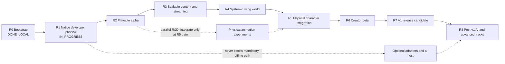

# Next Engine: долгосрочный roadmap реализации

| Поле | Значение |
|---|---|
| Статус | Living planning document, не нормативная архитектура |
| Последнее обновление | 2026-07-30 |
| Текущая точка | Player action and camera и performance measurement foundation завершены локально на Windows; следующий product work package — Semantic UI (`NEXT`), hard timing calibration/R2–R5 workloads и Linux-only `LNX-005` остаются открыты |
| Горизонт | developer preview → playable alpha → systemic alpha → creator beta → v1 → post-v1 |
| Источники | Accepted SPEC/ADR, текущий workspace и локальные ProductCheck |

## Назначение

Этот документ отвечает на три практических вопроса:

1. что реализовывать следующим;
2. в каком порядке расширять текущий узкий vertical slice;
3. какое наблюдаемое доказательство завершает каждый этап.

Roadmap не заменяет [продуктовый контракт](architecture/00-product-contract.md),
[архитектурную baseline](architecture/README.md) или профильный SPEC/ADR.
При конфликте действует порядок precedence из архитектурной baseline.
Семантическое изменение Accepted architecture по-прежнему требует отдельного
ADR; изменение приоритета или порядка реализации — нет.

Roadmap намеренно не содержит календарных обещаний. Без известного размера
команды, доступного content-production capacity и shipping hardware точные даты
создали бы ложную точность. Этапы упорядочены по продуктовым зависимостям и
имеют относительный размер. Календарный план следует строить из этого документа
после назначения владельцев и измерения скорости первых двух этапов.

## Как читать статус

| Статус | Значение |
|---|---|
| `DONE_LOCAL` | Реализация и релевантные checks проходят на developer host; это не shipping claim. |
| `DONE_LOCAL_WINDOWS` | Windows implementation/checkpoint завершён локально; Linux и cross-target claims остаются отдельными и открытыми. |
| `NEXT` | Следующий этап критического пути. |
| `PLANNED` | Нужен для v1, но зависит от более ранних этапов. |
| `PARALLEL` | Может развиваться параллельно, но имеет указанную integration gate. |
| `DEFERRED` | Не блокирует v1. |
| `PROPOSED` | Технология или contract ещё не входит в Accepted shipped baseline. |

Этап считается завершённым только когда одновременно выполнены все условия:

- behavior проходит production path, а не test-only shortcut;
- есть focused positive, failure и restart/save coverage;
- релевантные `fast`, `play`, `persistence-replay`, `content-package`,
  `platform` или `performance` имеют честный результат;
- schema, migration, examples, diagnostics и документация обновлены вместе;
- ни один `NOT_RUN` не интерпретирован как `PASS`;
- fallback проверен как реальное поведение, если основная возможность optional.

Наличие public type, Accepted SPEC или компилируемого adapter само по себе не
закрывает этап.

## Текущая точка

[M0–M11 implementation record](nextengine-v1-vertical-slice-implementation-plan.md)
фиксирует рабочий walking skeleton. На 2026-07-30 локально присутствуют:

- canonical commands, command ledger, fixed-stage runtime и atomic RPG
  transactions;
- exact project resolution/cook/activation и content-addressed publication;
- общий production coordinator для `game`, `headless` и runtime-bearing tools;
- atomic save generations, replay, application-session close/recovery;
- движение grounded capsule, статические Box colliders и contact lifecycle;
- pickup/equipment, melee damage, switch, dialogue/quest/relationship transition;
- deterministic two-chunk streaming;
- deterministic NPC affordance planner и procedural avatar projection;
- data-only mechanics, bounded Luau и Wasm Component paths;
- exact revision-bound presentation extraction и reference B0 render plan;
- neutral mesh/material/texture/profile catalog, deterministic cook/activation
  и derived B0 meshlet payloads;
- checked-in offline SPIR-V и B0 CPU visible-list/indexed-indirect path с
  deterministic fallback material;
- Windows-local keyboard/mouse ActionMap/InputContext resolver для live `game` и
  headless scenario, persisted ingress assignment и exact physics-snapshot
  `ClosestPoint` targeting, независимый от camera state;
- complete in-memory snapshots на каждой 30 Hz fixed-step boundary и typed
  integer/fixed-point third-person camera в `PresentationSnapshotV2`/B0 plan;
  renderer повторяет последний snapshot при любой cadence, а приватный Vulkan
  backend преобразует camera state в float view-projection и depth;
- bounded active-run durability: same-session checkpoint на tick `0`, каждые
  `30` ticks и forced atomically на suspend/close; crash rollback ограничен
  `29` ticks, resume не делает wall-time catch-up, lifecycle retry/publication
  rollback сохраняют prior generation, full lifecycle archive bounded,
  session store удерживает current+previous complete logical generations и
  упаковывает logical objects в bounded object packs по ADR-037, а required-save
  lineage переносится bounded цепочкой до `64` entries с exact prior durable
  snapshots и полными referenced object closures;
- session-bound desktop host/capability registration отклоняет stale adapter
  lifetime, а same-session authoritative restart начинает fresh presentation
  epoch с sequence `0` и camera cuts по
  [ADR-035](architecture/adr/035-bounded-live-recovery-platform-host-and-presentation-cut.md);
- Windows SDL3/ash B0 path с canonical keyboard/lifecycle events, fullscreen,
  swapchain recreation, bounded device-loss recovery и package smoke;
- versioned `xtask performance` foundation с exact THOTH fingerprint,
  release-only gate preflight, nearest-rank/baseline schemas и полным
  streaming/agent/render/live smoke report; representative R2–R5 workloads
  честно возвращают `NOT_RUN`;
- локальная v1 closure matrix.

Это сильный bootstrap, но ещё не пользовательская alpha. Текущий сценарий
жёстко ограничен одним neutral fixture, двумя chunks, одной combat ability,
одним NPC transition и небольшим B0 mesh/material/texture набором без
skeleton/animation/audio.

### Реализация по подсистемам

| Область | Состояние в коде | Главный gap |
|---|---|---|
| Contracts/runtime/ledger | Реализован фундамент | Расширять только вместе с реальным gameplay use case; не строить второй runtime framework. |
| Project/application/session | Production path реализован; same-session active restart, platform-causal lifecycle rollback, full bounded retry archive, current-host binding и tick-0/30 checkpoint model прошли Windows-local checkpoint | Нужны native cross-target platform/package closure и дальнейшие real-project lifecycle cases. |
| Persistence/replay | Реализован текущий owner set | Нет реального schema migration graph и будущих owner segments. |
| RPG | Частично: основные aggregates и восемь операций | Нет полного faction/membership, status/effect, quest-graph, reward и divine command lifecycle. |
| Mechanics/packages | Частично: contact melee + Luau/Wasm examples | Нет общего ability phase/cost/cooldown/status lifecycle и creator-facing SDK workflow. |
| Content/cooker | Частично: generic records плюс canonical mesh/material/texture/profile catalog, deterministic cook/activation и derived meshlet payloads | Нет skeleton/animation/audio/navigation catalog, реальных migrations и достаточного lawful representative content. |
| World/streaming | Частично: deterministic two-chunk transition | Нет general partition interest, resource residency, calendar, population, schedules и region transfers. |
| Jobs/resources | Spec-only | Нет общего bounded job, memory, I/O credit, pin/lease и backpressure substrate. |
| Physics | Частично: upright capsule, static Box и exact B0 `ClosestPoint` scene query | Нет полного shape/body/constraint/query profile и production physical-character stack. |
| Animation/motor | Только procedural projection/contract fragments | Нет skeleton graph, retargeting, IK, root-motion intent или deterministic inference supervisor. |
| Agent AI | Частично: один canonical affordance planner | Нет perception, hierarchy, schedules, memory и 100-NPC workload. |
| Navigation/audio | Spec-only | Нет runtime service, cooker или baseline adapters. |
| Player experience | Частично: общий keyboard/mouse ActionMap/InputContext resolver, persisted targeting intent/query и live third-person camera path | Нет semantic UI, controller profile, localization и accessibility implementation. |
| Presentation/render | Частично: exact revision-bound snapshot с typed camera, offline SPIR-V, CPU visible list/indexed-indirect B0 path, camera view-projection/depth, fallback material и проверенные локально Windows swapchain/device recovery/package paths | Нет skeleton/VFX consumption state, paired same-commit target proof и representative Linux hardware-GPU evidence. |
| Tooling | Частично: repository `xtask` checks и versioned performance report/gate foundation | Нет creator-facing `next` CLI, inspectors, scenario/minimizer, ten-run THOTH baseline и stable external SDK workflow. |
| Autonomous narrative | Contract fragments only | SPEC-31 runtime, graph admission, director fallback и divine batch transaction отсутствуют. |

## Продуктовая граница v1

V1 следует оценивать по [SPEC-00](architecture/00-product-contract.md), а не по
количеству полностью реализованных архитектурных документов. Accepted SPEC
задаёт правильную границу и failure semantics, когда соответствующая
возможность реализуется; он не всегда делает всю описанную глубину блокером
первого релиза.

Для v1 обязательны:

- один устанавливаемый cooked project на Windows x86_64 и Linux x86_64;
- связанный movement → interaction → combat → dialogue → quest loop;
- `game`, deterministic `headless` и creator/runtime tools;
- save/load/replay и offline correctness;
- streamed world, generic RPG state и first-party mechanics через public
  package API;
- bounded data-only, Luau и Wasm extension paths;
- engine-owned physics, motor и animation boundaries с процедурным fallback;
- usable player input, camera, semantic UI и минимально доступный presentation
  path;
- neutral content cook/validate/package workflow.

Не являются v1 blocker:

- LLM, ASR, TTS, external `ai-host` и SPEC-16 multimodal dialogue;
- autonomous Narrative Director и divine agency из SPEC-31;
- learned motor policy, Isaac Lab, PhysX или другой vendor physics backend;
- ray tracing, mesh shaders, HDR, advanced VFX и displayless capture;
- Gothic importer;
- full editor, multiplayer, consoles, mobile или macOS shipping.

Рекомендуемый v1 physical scope: устойчивый capsule/procedural controller,
skeletal presentation, retargeting и basic IK. Full articulation и learned
motor policy входят в v1 только если их собственный product check проходит
достаточно рано; fallback остаётся shipping-capable без них.

## Критический путь

| Этап | Статус | Размер | Product outcome |
|---|---|---:|---|
| R0. Walking skeleton | `DONE_LOCAL` | — | Узкий deterministic slice доказал end-to-end architecture. |
| R1. Native developer preview | `IN_PROGRESS` | S–M | Один exact package действительно запускается на обеих shipping targets. |
| R2. Playable alpha | `PLANNED` | L | В slice можно играть через нормальный camera/UI/presentation loop. |
| R3. Scalable content and streaming | `PLANNED` | XL | Движок перестаёт зависеть от hard-coded two-chunk fixture. |
| R4. Systemic living world | `PLANNED` | XL | NPC, schedules, navigation и RPG consequences образуют живой offline world. |
| R5. Physical character integration | `PARALLEL` → `PLANNED` | XL | Physical, animation и motor layers становятся production gameplay path. |
| R6. Creator beta | `PLANNED` | L–XL | Второй проект/пакет создаётся без правки engine internals. |
| R7. V1 release candidate | `PLANNED` | L | Полный v1 scope стабилизирован и упакован для Windows/Linux. |
| R8. Post-v1 tracks | `DEFERRED` | отдельные программы | Optional AI/narrative/importer/advanced rendering не размывают v1. |

## R0 — Walking skeleton

**Статус:** `DONE_LOCAL`.

**Цель:** доказать, что архитектурные границы соединяются в один production
path.

**Доказанный результат:** M0–M11, локальные `play`, `persistence-replay`,
`content-package`, portable `platform`, `performance` и `v1-closure`.

**Открытый риск:** этот этап доказан на Apple Silicon developer host.
Windows/Linux execution не считается выполненным и перенесён в R1.

**Правило сохранения:** каждый следующий этап расширяет текущий slice
вертикально. Переписывание contracts/runtime без нового player-facing outcome
не является roadmap progress.

## R1 — Native Windows/Linux developer preview

**Статус:** `IN_PROGRESS`. Native gate harness, Windows Desktop B0 hardening и
minimal render-content implementation реализованы; релевантные Windows
`content-package`, `platform`, `performance` и clean `v1-package` проходят
локально. Native Linux target report и package на более раннем checkpoint
имеют отдельный `PASS`; paired
same-commit Windows report и compare ещё не выполнены. Exact checkpoint,
environment и coordination status ведутся в
[Linux validation backlog](development/linux-validation-backlog.md).

**Текущая execution policy:** native Windows x86_64/MSVC/Vulkan — основной
developer host и приоритет текущих work packages. Linux validation выполняется
отдельными асинхронными checkpoint-сессиями; standalone Linux `PASS` не
закрывает R1/B-01 без matching Windows target `PASS` report и успешного compare.
Отложенные Linux-only действия ведутся в
[Linux validation backlog](development/linux-validation-backlog.md) и
выполняются асинхронными checkpoint-сессиями. Их ожидание не блокирует
несвязанные Windows work packages, но соответствующие R1/v1 criteria до
фактического run остаются открытыми.

**Цель:** превратить portable local closure в честно запускаемый native
developer package.

**Основной scope:**

- стабилизировать private SDL3/ash B0 adapter на Windows x86_64 и Linux x86_64;
- закрыть window/input/focus/resize/fullscreen/surface/device-loss lifecycle;
- проверить platform normalization без влияния native timestamps на simulation;
- собрать atomic distribution с `game`, `headless`, exact cooked project и
  notices;
- запустить release `headless` и bounded interactive release `game` из
  созданного package;
- сравнить project/content/state/ledger roots между target reports.

**Критерии успеха:**

- на обеих targets проходят `host-check`, `play`, `persistence-replay`,
  `content-package`, `platform`, `performance` и `v1-closure`;
- каждый `v1-closure` сообщает `PASS` для native target текущего host и честный
  `NOT_RUN` для другого target; успешный same-commit `native-gate-compare`
  выставляет `native_gate_ready = true`;
- `v1-package` создаёт installable directory и оба release binaries запускаются
  против exact packaged lock;
- B0 scene обрабатывает real input и типовые lifecycle transitions без
  authoritative divergence;
- package не содержит machine-local paths, protected data, credentials или
  отсутствующие notices.

**Hard blockers:**

- paired native Windows/Linux `PASS` reports и package на одном exact commit;
- representative hardware-GPU Linux smoke; текущий checkpoint и pending
  actions записаны в
  [Linux validation backlog](development/linux-validation-backlog.md);
- SDL3/ash candidate должен пройти target smoke; cross-compilation недостаточно;
- любой cross-target canonical/hash mismatch;
- packaging/runtime dependency, которая не включена или не диагностируется.

**Не блокируют этап:** PhysX, Slang, RT, learned policy, `ai-host`, capture и
Gothic importer.

**Основные источники:** SPEC-04, SPEC-12, SPEC-17, SPEC-29, SPEC-30, ADR-003,
ADR-028, ADR-030.

## R2 — Playable product alpha

**Цель:** превратить технический fixture в небольшой player-facing slice,
который можно пройти без знания engine internals.

**Основной scope:**

- runtime ActionMap/InputContext service поверх существующего canonical input;
- third-person camera, interaction focus и authoritative targeting query;
- semantic HUD, inventory/equipment, dialogue, quest journal, pause/save/load
  flow;
- source locale, deterministic text IDs, pseudo-locale и readable fallback;
- keyboard/mouse и минимум один controller profile через одинаковые action IDs;
- validate и расширить реализованный minimal mesh/material/texture path для B0
  renderer до representative alpha content;
- baseline sample playback, attenuation/panning, voice limiting и subtitle
  fallback;
- один CC0/engine-owned 20–30 minute project slice с началом, конфликтом и
  завершением.

Первый Windows increment этого этапа, **Player action and camera
(`DONE_LOCAL_WINDOWS`)**, содержит общий keyboard/mouse ActionMap/InputContext
resolver для live `game` и headless scenario, persisted ingress assignment,
authoritative B0 `ClosestPoint` targeting из exact physics snapshot,
`ReplayManifestV5` query provenance и typed integer/fixed-point third-person
camera. Live loop создаёт complete in-memory snapshot на каждой 30 Hz boundary;
durable same-session checkpoint публикуется на tick `0`, каждые `30` ticks и
forced atomically на suspend/close. Crash может откатить до `29` последних
in-memory ticks, resume не догоняет wall time, exact lifecycle retry и
publication rollback сохраняют prior state, full request/event archive bounded,
а session store удерживает current+previous complete logical generations,
физически объединяет objects в bounded generation packs по ADR-037 и переносит до
`64` required-save recovery entries с exact prior snapshot/object closures.
Fresh session-bound desktop host
registration отклоняет stale lifecycle/control events; authoritative restart
публикует new presentation epoch, sequence `0` и camera cuts. Exact semantics
зафиксированы [ADR-035](architecture/adr/035-bounded-live-recovery-platform-host-and-presentation-cut.md).
Локальный Windows checkpoint подтверждён `host-check`, `play`,
`persistence-replay`, `content-package`, `platform`, `performance`,
`v1-closure` и fresh-output `v1-package`. `v1-closure` сообщает Windows-local `PASS`
и честный Linux `NOT_RUN`; это не закрывает R2, R1/B-01, B-02,
`native_gate_ready`, shipping или Linux/native target criteria. `LNX-005`
остаётся отдельной асинхронной проверкой.

**Критерии успеха:**

- новый пользователь может запустить package, пройти movement → pickup/equip →
  combat → dialogue → quest → save/load loop без debug commands;
- те же semantic actions проходят через `game` и headless scenario и дают
  одинаковый authoritative result;
- UI/camera/audio/presentation faults не меняют gameplay hash;
- save/load работает до и после каждого крупного шага slice;
- missing device/locale/audio output использует declared fallback;
- `play`, `persistence-replay`, `content-package` и native `platform` проходят
  для alpha project.

**Hard blockers:**

- R1 native package closure;
- CC0/engine-owned art, UI text и audio fixture с подтверждённой provenance;
- отсутствие hidden direct-mutation path из UI/camera.

Эти blockers ограничивают закрытие R2 и соответствующий alpha claim, но не
начало или продолжение перечисленных Windows work packages.

**Scope guard:** editor, advanced renderer, photoreal assets и procedural world
generation не входят в этот этап.

**Основные источники:** SPEC-04, SPEC-08, SPEC-12, SPEC-18, SPEC-24, SPEC-29,
SPEC-30, ADR-019, ADR-034, ADR-035.

## R3 — Scalable content, jobs and streaming

**Цель:** заменить fixture-specific load/cook behavior на bounded substrate,
пригодный для реального multi-region project.

**Основной scope:**

- закрытый job classification, immutable requests/results, canonical merge,
  cancellation tree и finite queues;
- logical memory/resource budgets, pins, leases, deterministic eviction,
  decompression and I/O credits;
- production `ContentManifest`/bundle container и neutral schemas для scene,
  mesh, material, texture, collision, skeleton, animation, audio, navigation и
  world chunk в реально используемом минимальном профиле;
- schema compatibility registry и первый настоящий copy-on-write migration;
- general world partition interests, dependency groups, placement/tombstones,
  load/unload admission и restart reconstruction;
- cooker cache и atomic publication для multi-region project;
- убрать assumptions, требующие ровно два chunks или reference-only IDs.

**Критерии успеха:**

- representative project с несколькими regions и существенно более чем двумя
  chunks cooks, loads, streams, unloads, saves и restarts через production path;
- worker completion, queue pressure, cancellation и I/O fault permutations
  дают одинаковый committed world root;
- mandatory work не теряется и optional overload использует declared rejection
  или degradation;
- corrupt/oversized/cyclic content и migration inputs fail closed до
  publication;
- первая N−1→N migration сохраняет source generation и публикует только
  complete target generation;
- `content-package`, `persistence-replay`, focused streaming tests и
  `performance` проходят в declared memory/I/O profile.

**Hard blockers:**

- финальный минимальный набор content classes для v1;
- ownership map между Runtime, Assets и World Services без второго mutable
  source;
- измеримый logical resource profile для Windows/Linux;
- migration fixture, представляющий реальную эволюцию schema, а не empty DAG.

**Основные источники:** SPEC-03, SPEC-17, SPEC-21, SPEC-22, SPEC-23, SPEC-24,
SPEC-25, ADR-025, ADR-026.

## R4 — Systemic living world

**Цель:** перейти от scripted encounter к offline world, где NPC и world state
продолжают согласованно жить вне непосредственного контакта с игроком.

**Основной scope:**

- `WorldCalendarState`, stepped/bounded bulk time и World Services save owner;
- population records, `Dormant/Abstract/Simulated/Active` tiers, schedules,
  wake/defer rules и region transfers;
- deterministic graph navigation baseline, tiled cook/streaming, route validity
  и physical traversal handoff;
- perception facts, bounded planner hierarchy, habits and deterministic memory
  baseline;
- faction/membership/relationship operations, reusable dialogue/quest
  conditions and consequences;
- general ability phase/cost/cooldown/effect/status lifecycle through public
  mechanics API;
- integrated 100-NPC budget with deterministic cadence/deferral and no
  starvation;
- deterministic acoustic gameplay facts; hardware audio remains presentation.

**Критерии успеха:**

- multi-region scenario с 100 NPC воспроизводит exact schedule/tier/command/
  event/final roots across repeats, save/restart and worker permutations;
- NPC проходит navigation → interaction/combat → consequence только через
  AgentIntent/WorldCommand/Mechanics paths;
- unsupported abstract outcome upgrades or defers and никогда не фабрикует
  success;
- stepped и bulk world time сходятся на одинаковых boundaries;
- faction, quest, inventory и relationship consequences переживают unload,
  save/load и NPC tier changes;
- due AI/navigation work укладывается в ADR-016 thresholds или применяет
  declared deterministic cadence reduction;
- mandatory gameplay остаётся корректным без network и `ai-host`.

**Hard blockers:**

- R3 job/resource/partition substrate;
- navigation content and query baseline;
- календарный owner segment и migration из любого legacy representation;
- полный owner-safe RPG operation set для выбранного systemic scenario;
- authored NPC schedules, regions and fallback activities.

**Основные источники:** SPEC-06, SPEC-08, SPEC-13, SPEC-19, SPEC-20, SPEC-23,
SPEC-25, ADR-016, ADR-020, ADR-021, ADR-026.

## R5 — Physical character, animation and motor integration

**Статус:** R&D может идти как `PARALLEL` с R2–R4, production integration
закрывается после R4 substrate.

**Цель:** сделать физическое воплощение персонажа частью production gameplay,
не связывая correctness с конкретным vendor backend или model.

**Обязательный v1 scope:**

- расширить reference physics до нужных gameplay shapes, layers, materials,
  bounded queries, sensors и dynamic/kinematic interactions;
- устойчивый capsule locomotion profile: slopes, stairs, push, fall/recovery;
- neutral skeleton/clip/graph schemas, retargeting и basic IK;
- root motion остаётся intent и проходит physical validation;
- deterministic procedural motor/safety/recovery route;
- physical and animation state save/load/replay;
- один humanoid physical archetype, используемый player и NPC через public
  contracts.

**Optional integration scope:**

- ONNX observation/action path и policy supervisor;
- full articulation;
- PhysX 5.9.0 parity adapter.

**Критерии успеха:**

- player/NPC проходят push, slope, stair, trip, carry, fall/recovery и melee
  fixtures без teleport/direct health mutation;
- contact/query/order, committed physical projection and gameplay outcome
  воспроизводятся согласно выбранному deterministic profile;
- skeleton/retarget/IK failures используют declared pose/procedural fallback и
  не повреждают authoritative state;
- 16 representative avatars укладываются в SPEC-05 budget на declared
  reference CPU profile либо используют deterministic physical LOD;
- save/load/replay сохраняет physical/animation owner state;
- learned/vendor path при отсутствии или failure возвращается к тому же
  shipping-capable procedural path.

**Hard blockers:**

- минимальный v1 physical archetype и animation asset profile;
- general collision/query features, которых требует выбранный gameplay;
- cross-target numeric profile и canonical projection;
- licensed/CC0 skeleton, clips and retarget fixtures;
- ясная граница authoritative physical state против presentation pose.

**Не являются hard blocker:** достижение PhysX parity, training hardware,
learned policy quality или full articulation. Если они не проходят вовремя,
v1 остаётся на reference/procedural route.

**Основные источники:** SPEC-05, SPEC-14, SPEC-26, SPEC-27, SPEC-28, ADR-009,
ADR-013, ADR-027, ADR-032, ADR-033.

## R6 — Creator beta and SDK

**Цель:** доказать, что движок расширяется не только его авторами и не только
через Rust source edits.

**Основной scope:**

- stable non-interactive `next` CLI: project resolve/validate/diff, cook,
  content/package/save/plugin validation, replay and package;
- read-only inspectors для RPG, world, mechanics, input/player, AI and physical
  projections;
- scenario validate/run/minimize и stable JSON diagnostics;
- public package templates, versioned data/Luau/Wasm APIs and examples;
- ability, item, NPC, dialogue, quest, world-chunk and physical-archetype
  authoring workflows;
- N/N−1 plugin/package/schema compatibility and migration examples;
- deterministic cooker cache, actionable source spans and basic license/SBOM
  output;
- второй small project или expansion package, созданный только через public
  contracts.

**Критерии успеха:**

- clean checkout + documented toolchain создаёт, cooks, validates, runs and
  packages второй project без изменения engine crates;
- first-party и community-style mechanics используют одинаковый SDK,
  capabilities and validators;
- malformed assets, sandbox escapes, quota overflow and incompatible package
  versions fail with stable diagnostics and no partial publication;
- replay inspector находит first divergent tick/subsystem;
- cold authoring exercise может добавить одну ability, один quest/NPC и один
  streamed chunk через documented public workflow;
- `fast`, `play`, `persistence-replay` and `content-package` включают второй
  project/package как regression fixture.

**Hard blockers:**

- стабилизированный minimal schema surface из R3–R5;
- отсутствие hidden first-party bootstrap APIs;
- понятная distribution/license policy для packages;
- budget на документацию, examples and diagnostics, а не только runtime code.

**Scope guard:** full graphical editor не нужен; CLI/JSON + schemas должны быть
достаточны для v1.

**Основные источники:** SPEC-07, SPEC-09, SPEC-11, SPEC-13, SPEC-15, SPEC-22,
SPEC-24, ADR-008, ADR-014, ADR-025.

## R7 — V1 release candidate and release

**Цель:** стабилизировать выбранный product scope, а не добавлять новые
архитектурные подсистемы.

**Основной scope:**

- feature/content freeze и закрытие только release-blocking defects;
- final representative cooked project и clean-install packages;
- save/schema compatibility matrix и upgrade/rollback documentation;
- Windows/Linux performance, input, renderer, audio and lifecycle hardening;
- accessibility baseline, source locale and fallback behavior;
- license notices, provenance, dependency inventory and protected-data scan;
- user/developer getting-started, package authoring and troubleshooting docs;
- crash/recovery, long-session and corrupted-input suites;
- release versioning and reproducible package manifest.

**Критерии успеха:**

- все 16 MUST из SPEC-00 покрыты observable product behavior;
- final exact commit проходит релевантные checks на native Windows x86_64 и
  Linux x86_64;
- fresh packages запускают `game`, `headless` and tools, activate exact cooked
  lock, save/load and complete the representative loop;
- no open release-blocking data-loss, security, deterministic divergence,
  install/launch or offline-correctness defect;
- target performance profiles соблюдены либо качество снижено только через
  declared non-authoritative/LOD fallback;
- package содержит required notices and no forbidden artifacts;
- все `NOT_RUN` перечислены как non-claims; shipping-required target check не
  может оставаться `NOT_RUN`.

**Hard blockers:**

- незакрытый R1 target/package gate;
- незавершённый representative content slice;
- incompatible save without migration/export path;
- P0/P1 data-loss, security, determinism, offline or installation defect;
- неизвестная provenance любого distributed artifact.

**Основные источники:** SPEC-00, SPEC-11, SPEC-12, SPEC-15, SPEC-17, SPEC-29,
ADR-001, ADR-030.

## R8 — Post-v1 programs

Эти направления получают отдельные implementation plans после v1 либо раньше
как изолированные experiments без влияния на mandatory gameplay:

| Track | Architecture status | Entry condition |
|---|---|---|
| Autonomous quest lifecycle, Narrative Director and divine agency | SPEC-31/ADR-029/ADR-031 Accepted, runtime отсутствует | R4 world/RPG boundaries и R6 scenario/tooling готовы; template fallback реализуется первым. |
| Text-canonical multimodal dialogue/model packs | SPEC-16/ADR-017 `Proposed` | Явное решение о promotion, privacy/budget policy и text-only fallback. |
| External `ai-host` | Optional | Stable bounded process protocol, recorded-input replay and complete in-process fallback. |
| Learned/full-articulation motor | Optional technology | R5 reference/procedural baseline, exact observation/action checks and runtime/training parity. |
| PhysX production backend | ADR-033 technology remains `Proposed` | Полная parity на Windows/Linux; reference backend остаётся oracle/fallback. |
| Advanced renderer/HDR/RT/VFX/capture | Optional | B0 v1 path стабилен; feature has bounded fallback and target-specific product check. |
| Gothic importer | Optional separate repository/process | Neutral schemas стабильны, legal/provenance boundary проверен; parent repo остаётся независимым. |
| Full editor | Outside v1 | Creator beta CLI/JSON workflows показали реальные high-friction authoring operations. |

Принятие SPEC-31 не означает, что он должен задерживать v1. Его реализация
зависит почти от всех systemic boundaries R3–R6 и поэтому раньше будет создавать
parallel authority или fixture-only code.

## Сквозные workstreams

Некоторые работы идут постоянно и не должны превращаться в отдельный
инфраструктурный этап.

### Product slice

Каждый этап должен оставлять более богатый запускаемый project. Нельзя
реализовать world services, animation или tools только на synthetic unit
fixtures и отложить integration до R7.

### Determinism and persistence

Любой новый authoritative owner сразу получает:

- command/transaction path;
- owner segment and canonical state root;
- save/load/restart and corrupt-input coverage;
- replay compare point;
- game/headless parity.

### Security and content provenance

Любой новый parser, package surface, model or external process считается
untrusted с первого changeset. Bounds, hashes, capabilities, quotas, redaction
and notices добавляются вместе с happy path.

### Platform

Windows checks запускаются вместе с каждым work package, который меняет
platform, renderer, physics, packaging or performance. Требующие native Linux
host действия добавляются в
[отдельный backlog](development/linux-validation-backlog.md) и могут
выполняться асинхронно пакетами на зафиксированных exact-commit checkpoints.
Отсутствие Linux run не блокирует unrelated Windows development, но stage exit
или shipping claim, требующий Linux evidence, остаётся открытым. Накопленные
Linux checks нельзя молча переносить за соответствующий stage/release gate.

### Physical R&D

Physics/animation experiments могут идти параллельно после R1, но не меняют
default route до R5 integration gate. Неуспех vendor/model candidate не
блокирует capsule/procedural product.

## Blocker register

| ID | Blocker | Блокирует закрытие | Условие снятия |
|---|---|---|---|
| B-01 | `OPEN`: standalone Linux `PASS` записан; paired same-commit Windows report и cross-target compare отсутствуют. Coordination хранится в [Linux validation backlog](development/linux-validation-backlog.md). | R1, R7 | На одном exact clean commit собраны Windows/Linux target `PASS` reports и packages с matching roots, а `native-gate-compare` сообщает `native_gate_ready = true`. |
| B-02 | SDL3/ash остаётся `Proposed` target candidate; Windows B0 lifecycle/render-content path проходит локально, software-Vulkan Linux evidence записан, а representative hardware-GPU action поставлен в [Linux validation backlog](development/linux-validation-backlog.md). | R1, R2 | B0 lifecycle/input/device-loss checks проходят на обеих targets либо выбран thin adapter за тем же contract. |
| B-03 | `PARTIAL`: minimal mesh/material/texture profile и engine-owned fixture реализованы и проверены на Windows; skeleton/audio и достаточный lawful representative slice отсутствуют | R2, R5, R7 | Зафиксирован и проверен минимальный mesh/material/texture/skeleton/audio profile и lawful fixture/project. |
| B-04 | Нет общего job/resource/backpressure substrate | R3–R5 | Finite queues, canonical merge, logical budgets, pin/lease/eviction and fault checks реализованы production owners. |
| B-05 | Schema migration DAG фактически пуст | R3, R7 | Реальная N−1→N copy-on-write migration проходит valid/corrupt/fault matrix. |
| B-06 | World ограничен двумя chunks | R3, R4 | General partition interest/admission and multi-region save/restart scenario проходят. |
| B-07 | Нет calendar/population/navigation services | R4 | World owner segment, schedules/tiers and graph navigation baseline проходят systemic scenario. |
| B-08 | Physics ограничена capsule + static Box; animation/motor отсутствуют | R5 | V1 physical profile and procedural animation/motor fallback проходят physical product checks. |
| B-09 | Нет external creator CLI/SDK workflow | R6, R7 | Второй project/package создаётся cleanly только public tools/contracts. |
| B-10 | Content scope может расти быстрее playable loop | Все этапы | Для каждого этапа назначен один representative scenario и явно записан non-goal list. |
| B-11 | Недостаточная content/documentation capacity | R2, R6, R7 | Назначены owners и budget для art/audio/text/examples/docs/provenance. |
| B-12 | `OPEN / FOUNDATION_DONE`: ADR-036, THOTH fingerprint/preflight, versioned report, nearest-rank, strict ten-run baseline publisher, Windows I/O delta, bounded Vulkan timestamps и conservative device-allocation residency ceiling реализованы; exact host allocator counter, calibration evidence и representative R2–R5 workloads отсутствуют | R4, R5, R7 | Hard `PASS` на полном `ref-win-thoth-v1`, Linux `REPORT_ONLY` profile и mandatory native correctness на обеих shipping targets; smoke/fallback-only/`NOT_RUN` blocker не закрывают. |

## Решения, которые нужно принять вовремя

Эти решения не должны блокировать начало roadmap, но должны быть закрыты до
указанного gate.

| Decision | Deadline | Рекомендация |
|---|---|---|
| Минимальный v1 visual/content profile | до R2 implementation freeze | B0 raster, mesh/material/texture, one humanoid skeleton, source locale; no HDR/RT requirement. |
| UI toolkit/backend | до R2 UI integration | Private replaceable adapter behind semantic UI; не вводить widget types в contracts. |
| Baseline navigation | до R4 | Начать с engine-owned deterministic graph/tile representation; Recast remains replaceable candidate. |
| V1 physical scope | до R5 content production | Capsule/procedural + skeletal/IK mandatory; learned/full articulation optional. |
| Physics backend | до R5 integration | Reference remains default/oracle; promote PhysX only after target parity. |
| Creator surface | до R6 | Stable CLI/JSON first; graphical editor after real creator workflow data. |
| Narrative/LLM priority | после R7 scope freeze | Template/deterministic behavior first; external model only as optional candidate source. |

## Ближайшая implementation queue

Ближайшая очередь является Windows-first. Linux validation не занимает позицию
в implementation queue: требующие native Linux host действия накапливаются в
[Linux validation backlog](development/linux-validation-backlog.md) и
выполняются отдельными checkpoint-сессиями. Это не блокирует начало следующего
Windows increment. Оба same-commit reports и успешный compare остаются
обязательными перед закрытием R1/B-01.

Следующие work packages рекомендуется выполнять в этом порядке:

Завершённый Windows baseline: **Desktop B0 hardening (`DONE_LOCAL_WINDOWS`)**.
SDL keyboard input нормализуется в engine-owned events; resize/focus/minimize/
restore/fullscreen, surface recreation и bounded device-loss recovery проходят
production adapter path. Оставшиеся target claims учитываются отдельно и не
возвращают этот implementation package в активную очередь.

Реализация **Minimal render content (`DONE_LOCAL_WINDOWS`)**
добавляет neutral mesh/material/texture/profile catalog, exact revision-bound
presentation, deterministic cook/activation и meshlet payloads, checked-in
offline SPIR-V, CPU visible list/indexed-indirect B0 path и declared fallback.
`content-package`, `platform`, `performance` и clean package smoke проходят
локально на Windows; `LNX-004` выполняется позднее асинхронно и не удерживает
следующий Windows package.

Завершённый Windows checkpoint **Player action and camera
(`DONE_LOCAL_WINDOWS`)** добавляет общий
для live `game` и headless scenario ActionMap/InputContext resolver с WASD,
pickup/equip-use/interact/melee и relative mouse orbit; persisted ingress
assignment и exact physics-snapshot `ClosestPoint` query определяют
authoritative target; `ReplayManifestV5` связывает V2 mapping receipts и exact
targeting/query facts. Typed integer/fixed-point camera, complete in-memory
30 Hz snapshots и private Vulkan float view-projection/depth остаются
presentation-only. Durable same-session checkpoint использует cadence tick
`0`/каждые `30` ticks и forced atomic suspend/close publication; crash rollback
ограничен `29` ticks, resume не делает catch-up, exact lifecycle retry,
publication rollback, full bounded request/event archive, current+previous
logical retention с bounded object packing по ADR-037 и carry-forward chain
до `64` recovery evidence entries с prior
snapshot/object closures сохраняют bounded recovery. Current host/capability
registration отклоняет stale adapter events;
authoritative restart создаёт fresh presentation epoch/sequence `0` и camera
cuts по ADR-035. `LNX-005` выполняется позднее асинхронно; R1/B-01 и весь R2
этим не закрываются.

Performance measurement foundation (`DONE_LOCAL_WINDOWS`) добавляет
`PerformanceRunV1`/`PerformanceMetricV1`/`PerformanceBaselineV1`, полный
THOTH fingerprint и idle/RAM/thermal preflight, profile `profiling`, raw
nearest-rank smoke metrics и explicit `NOT_RUN` для ещё отсутствующих
representative R2–R5 workloads. Report-only `long-session-soak` теперь
воспроизводит `3 600` live ticks через driver и interactive application path,
показывает 30-tick durable checkpoint growth и проверяет exact ledger-root
parity. Checkpoint publication переиспользует один набор уже проверенных
canonical component bytes, а identity-index root больше не требует полного
временного serialization buffer. Strict `performance-baseline` publisher,
Windows process I/O deltas, bounded CPU/Vulkan frame timing и conservative
engine-owned device-allocation ceiling реализованы; release smoke на THOTH
получил timestamp samples без dropped queries.
Private session storage дополнительно объединяет logical objects в один или
несколько bounded generation packs, сокращая Windows durable file barriers,
сохраняет legacy raw load и final logical hash validation; packing не меняет
generation/state/ledger roots. Prepared-tick package дополнительно убирает
полный `ReferenceGameDriverV1`/Runtime checkpoint fork из каждого live tick,
сохраняя его для replay/recovery. Runtime и reference-game tick теперь проходят
`prepare → generation validation → infallible commit`; checkpoint, suspend и
close publication по-прежнему выполняется между validation и commit. Три
instrumented-before run commit `37f3cc2` и три after run на одном THOTH
`long-session-soak.v3` сохранили authoritative root
`5e45825e1a627113902640184c00bf448964bb2b8daf10d6e0947d40fd5a6e17` и exact
driver/application ledger/archive parity. Median run p95 изменился так:
ordinary application tick `5 231 → 4 268 µs` (`-18.4%`), checkpoint application
tick `209 588 → 178 017 µs` (`-15.1%`), application 1 200-tick window
`12.787 → 10.731 s` (`-16.1%`), driver window `9.970 → 9.002 s` (`-9.7%`) и
checkpoint materialization `129 150 → 128 122 µs` (`-0.8%`). Все шесть run
остались `REPORT_ONLY`; host preflight был шумным, поэтому числа принимают эту
ограниченную оптимизацию, но не являются ten-run hard calibration и не закрывают
B-12. Отдельные 4-KiB chunk files были отвергнуты после
release soak из-за многократной checkpoint-latency regression. Итоговое
storage/performance hardening по ADR-037 в одном Windows-local `REPORT_ONLY`
soak улучшило checkpoint windows примерно на `13.8% / 15.3% / 8.0%` против
preceding implementation и не меняет product queue.
Следующий bounded transaction-delta package перестал копировать и полностью
перехешировать retained command history на каждом ordinary live tick. Runtime
теперь staged-изменяет только archive additions, touched identity bindings и
causal additions; точные derived ledger/archive roots лениво материализуются
при public snapshot/checkpoint и кэшируются на runtime generation. Полная
проверка canonical command-body bytes остаётся на каждом untrusted
decode/insert boundary, а уже типизированный `CommandBodyArchiveV1` больше не
декодирует всю закрытую append-only историю повторно при каждом checkpoint.
Три before и три after release `long-session-soak.v3` run на THOTH сохранили
authoritative root
`5e45825e1a627113902640184c00bf448964bb2b8daf10d6e0947d40fd5a6e17` и exact
driver/application ledger/archive parity. Median run p95 изменился так:
ordinary application tick `4 317 → 3 072 µs` (`-28.8%`), checkpoint application
tick `182 545 → 97 792 µs` (`-46.4%`), checkpoint materialization
`131 873 → 44 794 µs` (`-66.0%`), driver prepare `3 979 → 2 451 µs`
(`-38.4%`), driver 1 200-tick window `9.331 → 4.614 s` (`-50.6%`) и
application window `10.852 → 6.662 s` (`-38.6%`). Все run остались
`REPORT_ONLY`; CPU/GPU preflight был шумным, поэтому это принимает bounded
локальную оптимизацию, но не заменяет ten-run hard calibration и не закрывает
B-12. Durable schemas, cadence `0/30/60`, rollback/retry и replay roots не
изменились.
Следующий seven-package performance pass добавил bounded `Arc` latest-snapshot
handoff без копирования projection между main/render и simulation/persistence worker, retry-capable
`Closed` barrier до освобождения SDL/Vulkan adapters, два Vulkan frame slots с
retirement stale image-fence aliases, exact-key frame-plan cache, reference
physics staging fork с shared immutable geometry и canonical fallback для opaque backends, incremental
checkpoint validation/shared private object bytes. Отдельный
`interactive-frame-soak` измеряет `240` production FIFO frames при запрошенных
`1920×1080`; THOTH run получил `239` cache hits / `1` cold miss, `0` deadline
misses, `0` software-paced iterations, critical-path p95/p99 `125/215 µs`, GPU
p95 `10 µs`, event/frame-source p95 `13 µs` и frame-slot-wait p95 `7 093 µs`.
Fixture использует статический
immutable render snapshot: он измеряет event/frame-source overhead и Vulkan
path, но не main-to-simulation-worker handoff; отдельный production-worker
timing остаётся diagnostic gap. Три before run commit `ad5e4da` и
три after run окончательного engine candidate сохранили authoritative root
`5e45825e1a627113902640184c00bf448964bb2b8daf10d6e0947d40fd5a6e17`, exact
driver/application ledger/archive parity и дали median p95: application window
`6.938 → 5.926 s` (`-14.6%`), application checkpoint window
`3.825 → 3.305 s` (`-13.6%`), driver window `4.933 → 4.349 s` (`-11.9%`),
ordinary application tick `3 157 → 2 758 µs` (`-12.6%`), checkpoint tick
`106 380 → 93 987 µs` (`-11.6%`), checkpoint materialization
`50 425 → 48 446 µs` (`-3.9%`), driver prepare `2 688 → 2 429 µs`
(`-9.6%`) и driver commit `591 → 480 µs` (`-18.8%`). Все long-session и
interactive измерения остаются `REPORT_ONLY`: preflight
не достиг idle CPU/20-GiB free-RAM условий. Opt-in `release-thin-lto` и
`release-pgo` workflow не меняет default `release`; representative R2–R5
ten-run comparison и PGO merge остаются `NOT_RUN`, поэтому codegen profiles не
promoted. Workflow требует exact executable/build sidecars для baseline и
candidate, отклоняет чужие rustflags/profile overrides и строит общий CI прямым
scenario-cluster bootstrap. B-12 остаётся открытым.

Следующий live-runtime performance package сделал полный public `TickReport`
ленивым для ordinary reportless commit, сохранил accepted presentation snapshot
в shared `Arc` до production worker и заменил физическое receipt window на
engine-owned chunked COW packing по `64` receipts. Логический ordered suffix из
`4 096` receipts, canonical bytes, schema и receipt-chain root не изменились;
новые monotonic sequences также обходят два линейных retry/collision scan по
retained history. Отдельный `0/4 095/4 096/4 097` diagnostic проверяет точную
эвикцию, clone isolation, decode/re-encode и repeated-driver root parity. Три
before и три after release `long-session-soak.v3` run на той же ревизии
сохранили authoritative root
`5e45825e1a627113902640184c00bf448964bb2b8daf10d6e0947d40fd5a6e17` и exact
driver/application ledger/archive parity. Median run p95 изменился так: driver
window `4.349 → 3.427 s` (`-21.2%`), driver prepare `2 429 → 1 960 µs`
(`-19.3%`), driver commit `480 → 330 µs` (`-31.2%`), checkpoint
materialization `48 446 → 41 445 µs` (`-14.5%`), ordinary application tick
`2 758 → 2 278 µs` (`-17.4%`) и application window `5.926 → 5.117 s`
(`-13.6%`). Identity-root probe и checkpoint tails остаются noise-sensitive.
Все run имеют `REPORT_ONLY`: preflight не достиг одновременно idle CPU и
20-GiB free-RAM условий, поэтому результат не заменяет ten-run hard calibration
и не закрывает B-12.

Exact global host allocator counter и ten-run calibration evidence ещё
отсутствуют. Это не меняет product queue: calibration начинается после
стабилизации последнего required counter/noise, а hard
timing gate включается только вместе с реальным stage workload. B-12 остаётся
открыт.

1. **Semantic UI (`NEXT`):** HUD, inventory/equipment, dialogue, quest
   journal, pause/save/load and pseudo-locale.
2. **Baseline audio (`PLANNED`):** clips, emitters/listener, priority/voice limits,
   attenuation/panning and subtitle fallback.
3. **Playable alpha project (`PLANNED`):** заменить technical fixture на один complete
   CC0/engine-owned 20–30 minute slice.
4. **Jobs/resources vertical (`PLANNED`):** сначала content cook/stream use case, затем
   shared bounded admission primitives.
5. **General partition and migration (`PLANNED`):** multi-region streaming plus first real
   save/content schema migration.
6. **Living-world vertical (`PLANNED`):** calendar + small population + graph navigation,
     затем масштабирование к integrated 100-NPC scenario.

Каждый package должен быть отдельным product increment с focused checks. Work
package 4 не следует начинать как универсальный scheduler design без package 3
и конкретного streaming workload.

## Обновление roadmap

Roadmap обновляется после завершения этапа или существенного изменения
product scope:

1. обновить current-state table по фактическому коду;
2. приложить ссылки на ProductCheck commands/results без превращения их в
   обязательный evidence dossier;
3. перевести только реально выполненный gate;
4. перенести оставшиеся gaps/blockers в следующий этап;
5. оформить ADR лишь если изменена Accepted semantics;
6. сохранить optional/Proposed tracks как non-blocking, пока их собственная
   promotion/integration gate не пройдена.

Главный показатель прогресса — не число contracts или crates, а то, насколько
более богатый проект можно запустить, пройти, сохранить, воспроизвести,
расширить публичным SDK и упаковать на обе shipping platforms.
